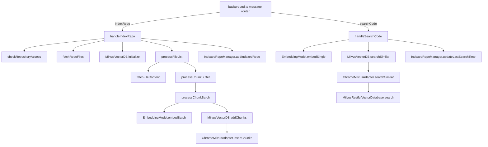

# Chrome extension service worker — in-browser index & search of GitHub repos

## Overview
This is claude-context's **browser-native** incarnation: a Chrome MV3 service worker
that indexes and semantically searches a GitHub repo entirely from inside the extension,
with no local checkout, no Node process, and no core package. It is a deliberately
stripped-down mirror of the VS Code / MCP pipeline — the same *shape* (fetch → chunk →
embed → store; embed-query → vector-search), but every heavyweight dependency is replaced
by something that runs in a page: the GitHub REST API stands in for a filesystem, OpenAI's
embeddings endpoint for a local model, and a hand-written REST client for Milvus in place
of the SDK. The whole module hangs off a single message router
(`background.ts`)
that dispatches two verbs that matter here — `indexRepo` →
[`handleIndexRepo`](../catalog/packages/chrome-extension/src/background.ts.md#handleIndexRepo)
and `searchCode` →
[`handleSearchCode`](../catalog/packages/chrome-extension/src/background.ts.md#handleSearchCode).

The single key idea for the cross-repo survey: **the grounding substrate is dense
embeddings over line-based text chunks, retrieved by cosine similarity from a vector DB** —
not a SCIP symbol table, not a call graph. Comprehension here is "find the passages whose
meaning is nearest the query," and everything else is plumbing around that.

## Diagram

## Design rationale (why it's built this way)
The defining constraint is **"runs in a browser tab, talks only over HTTP."** That single
fact explains most of the odd choices:

- **The vector DB is reached over its REST v2 API, not its SDK.** The adapter
  ([`initialize`](../catalog/packages/chrome-extension/src/milvus/chromeMilvusAdapter.ts.md#ChromeMilvusAdapter.initialize))
  constructs a
  [`MilvusRestfulVectorDatabase`](../catalog/packages/chrome-extension/src/stubs/milvus-vectordb-stub.ts.md#MilvusRestfulVectorDatabase.-constructor)
  whose docstring calls itself a *"Simplified Milvus Vector Database implementation for
  Chrome Extension,"* and every operation is a `fetch` to `/v2/vectordb/...` through
  [`makeRequest`](../catalog/packages/chrome-extension/src/stubs/milvus-vectordb-stub.ts.md#MilvusRestfulVectorDatabase.makeRequest).
  The file lives under `stubs/` precisely because it substitutes for the real client that a
  bundler can't ship into a service worker.

- **Config and index bookkeeping live in Chrome storage, not a config file.** Milvus
  credentials come from `chrome.storage.sync` via
  [`getMilvusConfig`](../catalog/packages/chrome-extension/src/config/milvusConfig.ts.md#MilvusConfigManager.getMilvusConfig)
  (author intent: *"Get Milvus configuration from Chrome storage"*), and the list of
  indexed repos is persisted by
  [`IndexedRepoManager`](../catalog/packages/chrome-extension/src/storage/indexedRepoManager.ts.md#IndexedRepoManager)
  into `chrome.storage.local` under the
  [`STORAGE_KEY`](../catalog/packages/chrome-extension/src/storage/indexedRepoManager.ts.md#IndexedRepoManager.STORAGE_KEY)
  `"indexedRepositories"`.

- **Chunking is intentionally *not* AST-aware.** The comment in
  [`handleIndexRepo`](../catalog/packages/chrome-extension/src/background.ts.md#handleIndexRepo)
  fixes `chunkSize = 1000` / `chunkOverlap = 200` "*same as VSCode extension default*," but
  the splitter that
  [`processFileList`](../catalog/packages/chrome-extension/src/background.ts.md#processFileList)
  actually calls is a local line/character walker (its source comment: *"Simple
  character-based chunking that approximates LangChain's RecursiveCharacterTextSplitter"*).
  There is no tree-sitter, no per-language node typing here — language only enters as a file
  extension filter.

> [!inferred]
> This makes the extension a strictly weaker grounding than the core pipeline: it trades
> tree-sitter AST splitting and Merkle-tree incremental sync for something that bundles into
> a service worker. For the survey, treat it as "the embeddings + vector-search core of
> claude-context, minus multi-language extraction and incremental reconcile."

- **Per-repo collection isolation.** The
  [`MilvusVectorDB` constructor](../catalog/packages/chrome-extension/src/background.ts.md#MilvusVectorDB.-constructor)
  derives
  [`repoCollectionName`](../catalog/packages/chrome-extension/src/background.ts.md#MilvusVectorDB.repoCollectionName)
  as `chrome_repo_<owner_repo>` (non-alphanumerics replaced with `_`), so each GitHub repo
  gets its own Milvus collection and searches never cross repos.

## Entry points
- [`handleIndexRepo`](../catalog/packages/chrome-extension/src/background.ts.md#handleIndexRepo)
  — reached when the router sees `request.action === 'indexRepo'`. It owns the whole ingest:
  acknowledge the popup immediately, verify access, spin up the vector DB, fetch the file
  tree, and drive
  [`processFileList`](../catalog/packages/chrome-extension/src/background.ts.md#processFileList)
  to completion before recording the result.
- [`handleSearchCode`](../catalog/packages/chrome-extension/src/background.ts.md#handleSearchCode)
  — reached on `request.action === 'searchCode'`. It re-opens the same per-repo collection,
  embeds the query string, runs one vector search, and returns the ranked chunks to the
  caller synchronously via `sendResponse`.
- **The message router** — the `background.ts` module itself is the service-worker script; its
  top-level `chrome.runtime.onMessage` listener is the only inbound edge. It dispatches to
  [`handleIndexRepo`](../catalog/packages/chrome-extension/src/background.ts.md#handleIndexRepo)
  and [`handleSearchCode`](../catalog/packages/chrome-extension/src/background.ts.md#handleSearchCode)
  and returns `true` to keep the async message channel open while those handlers run.

## Mechanism (step-by-step)

1. **Guard and bootstrap.**
   [`handleIndexRepo`](../catalog/packages/chrome-extension/src/background.ts.md#handleIndexRepo)
   first sends an immediate `{ success: true }` acknowledgement (so the popup doesn't block
   on the long index), then calls
   [`checkRepositoryAccess`](../catalog/packages/chrome-extension/src/background.ts.md#checkRepositoryAccess),
   which does a `GET /repos/{owner}/{repo}` with the stored token and translates 404/403 into
   human-readable "not found / no permission / rate-limited" errors before any work begins.
   The token itself comes from
   [`getGitHubToken`](../catalog/packages/chrome-extension/src/background.ts.md#getGitHubToken),
   which reads `chrome.storage.sync` and validates the token before returning it.

2. **Open (or create) the per-repo vector collection.**
   [`handleIndexRepo`](../catalog/packages/chrome-extension/src/background.ts.md#handleIndexRepo)
   constructs a `MilvusVectorDB` and calls
   [`initialize`](../catalog/packages/chrome-extension/src/background.ts.md#MilvusVectorDB.initialize),
   which connects the
   [`adapter`](../catalog/packages/chrome-extension/src/background.ts.md#MilvusVectorDB.adapter),
   checks
   [`collectionExists`](../catalog/packages/chrome-extension/src/milvus/chromeMilvusAdapter.ts.md#ChromeMilvusAdapter.collectionExists),
   and if not, calls
   [`createCollection`](../catalog/packages/chrome-extension/src/milvus/chromeMilvusAdapter.ts.md#ChromeMilvusAdapter.createCollection)
   with the fixed `EMBEDDING_DIM` of 1536. The adapter's
   [`initialize`](../catalog/packages/chrome-extension/src/milvus/chromeMilvusAdapter.ts.md#ChromeMilvusAdapter.initialize)
   pulls Milvus creds via
   [`getMilvusConfig`](../catalog/packages/chrome-extension/src/config/milvusConfig.ts.md#MilvusConfigManager.getMilvusConfig),
   runs them through
   [`validateMilvusConfig`](../catalog/packages/chrome-extension/src/config/milvusConfig.ts.md#MilvusConfigManager.validateMilvusConfig)
   (which only insists an
   [`address`](../catalog/packages/chrome-extension/src/config/milvusConfig.ts.md#MilvusConfig.address)
   is present —
   [`token`](../catalog/packages/chrome-extension/src/config/milvusConfig.ts.md#MilvusConfig.token)/[`username`](../catalog/packages/chrome-extension/src/config/milvusConfig.ts.md#MilvusConfig.username)/[`database`](../catalog/packages/chrome-extension/src/config/milvusConfig.ts.md#MilvusConfig.database)
   are optional for local instances), and hands them to the REST client's
   [`constructor`](../catalog/packages/chrome-extension/src/stubs/milvus-vectordb-stub.ts.md#MilvusRestfulVectorDatabase.-constructor).

3. **List the repo's source files.**
   [`fetchRepoFiles`](../catalog/packages/chrome-extension/src/background.ts.md#fetchRepoFiles)
   resolves the default branch and pulls the recursive git tree, keeping only `blob` entries
   whose path matches a fixed source-extension regex (ts/tsx/js/jsx/py/java/cpp/c/h/hpp/cs/go/rs/php/rb/swift/kt/scala/m/mm/md).
   This extension whitelist is the *only* language awareness in the pipeline.

4. **Fetch, chunk, and buffer per file.**
   [`processFileList`](../catalog/packages/chrome-extension/src/background.ts.md#processFileList)
   iterates the file list, pulling each file's decoded content through
   [`fetchFileContent`](../catalog/packages/chrome-extension/src/background.ts.md#fetchFileContent)
   (a `GET .../contents/{path}` whose base64 body is `atob`-decoded). Each file is split into
   overlapping line-based windows, and every chunk with more than 10 trimmed characters
   becomes a
   [`CodeChunk`](../catalog/packages/chrome-extension/src/milvus/chromeMilvusAdapter.ts.md#CodeChunk)
   whose `id` is `<path>_chunk_<j>`, carrying its
   [`content`](../catalog/packages/chrome-extension/src/milvus/chromeMilvusAdapter.ts.md#CodeChunk.content),
   `relativePath`, start/end lines, extension, and a JSON `metadata` blob. Chunks accumulate
   into a buffer flushed once it reaches
   [`EMBEDDING_BATCH_SIZE`](../catalog/packages/chrome-extension/src/background.ts.md#EMBEDDING_BATCH_SIZE)
   (100). A per-file `try/catch` skips unreadable files rather than aborting the whole index,
   and a running
   [`totalChunks`](../catalog/packages/chrome-extension/src/background.ts.md#processFileList.Promise.typeLiteral278.totalChunks)
   count is reported to the UI as progress.

5. **Embed a batch and store it.** Each flushed buffer passes through
   [`processChunkBuffer`](../catalog/packages/chrome-extension/src/background.ts.md#processChunkBuffer)
   (which strips the wrapper and logs a rough `chars/4` token estimate) into
   [`processChunkBatch`](../catalog/packages/chrome-extension/src/background.ts.md#processChunkBatch).
   That step calls
   [`embedBatch`](../catalog/packages/chrome-extension/src/background.ts.md#EmbeddingModel.embedBatch),
   which POSTs the chunk texts to `https://api.openai.com/v1/embeddings` and returns one
   1536-d vector per chunk; the vectors are zipped back onto the chunks and handed to
   [`addChunks`](../catalog/packages/chrome-extension/src/background.ts.md#MilvusVectorDB.addChunks)
   →
   [`insertChunks`](../catalog/packages/chrome-extension/src/milvus/chromeMilvusAdapter.ts.md#ChromeMilvusAdapter.insertChunks),
   which reshapes each chunk into a Milvus document (parsing the `metadata` string back into
   an object) and inserts it into the collection over REST.

6. **Record the indexed repo.** On success,
   [`handleIndexRepo`](../catalog/packages/chrome-extension/src/background.ts.md#handleIndexRepo)
   persists an
   [`IndexedRepository`](../catalog/packages/chrome-extension/src/storage/indexedRepoManager.ts.md#IndexedRepository)
   summary (id, owner, repo, total files/chunks, collection name) via
   [`addIndexedRepo`](../catalog/packages/chrome-extension/src/storage/indexedRepoManager.ts.md#IndexedRepoManager.addIndexedRepo),
   which stamps an
   [`indexedAt`](../catalog/packages/chrome-extension/src/storage/indexedRepoManager.ts.md#IndexedRepository.indexedAt)
   timestamp, dedupes by
   [`id`](../catalog/packages/chrome-extension/src/storage/indexedRepoManager.ts.md#IndexedRepository.id),
   and keeps only the five most-recent repos in `chrome.storage.local`.

7. **Query = embed-one + vector-search.** For search,
   [`handleSearchCode`](../catalog/packages/chrome-extension/src/background.ts.md#handleSearchCode)
   embeds the query string once via
   [`embedSingle`](../catalog/packages/chrome-extension/src/background.ts.md#EmbeddingModel.embedSingle)
   (a thin wrapper over `embedBatch` for a single input), then calls
   [`searchSimilar`](../catalog/packages/chrome-extension/src/background.ts.md#MilvusVectorDB.searchSimilar)
   with `limit = 20`. The adapter's
   [`searchSimilar`](../catalog/packages/chrome-extension/src/milvus/chromeMilvusAdapter.ts.md#ChromeMilvusAdapter.searchSimilar)
   (author intent: *"Search for similar code chunks"*) issues the vector query with a `0.3`
   threshold and `topK = limit`, maps each hit's
   [`document`](../catalog/packages/chrome-extension/src/stubs/milvus-vectordb-stub.ts.md#VectorSearchResult.document)
   and
   [`score`](../catalog/packages/chrome-extension/src/stubs/milvus-vectordb-stub.ts.md#VectorSearchResult.score)
   into a result, and re-sorts descending by score before returning. Finally
   [`updateLastSearchTime`](../catalog/packages/chrome-extension/src/storage/indexedRepoManager.ts.md#IndexedRepoManager.updateLastSearchTime)
   stamps the repo record and the ranked chunks go back to the popup.

## Key data structures
- **[`CodeChunk`](../catalog/packages/chrome-extension/src/milvus/chromeMilvusAdapter.ts.md#CodeChunk)**
  — the unit of everything: `id`, `content`, `relativePath`, `startLine`/`endLine`,
  `fileExtension`, a stringified `metadata` blob, and an optional `vector`. It is the
  interchange type from splitter → embedder → vector store → search result, which is why the
  splitter, `insertChunks`, and `searchSimilar` all agree on it.
- **[`IndexedRepository`](../catalog/packages/chrome-extension/src/storage/indexedRepoManager.ts.md#IndexedRepository)**
  — the persisted "what have I indexed" record (owner/repo/id, counts, collection name,
  timestamps). This is the extension's entire notion of index state: there is no manifest and
  no Merkle snapshot, just this small list capped at five entries.
- **[`MilvusConfig`](../catalog/packages/chrome-extension/src/config/milvusConfig.ts.md#MilvusConfig.address)**
  fields (address/token/username/database) — pulled from `chrome.storage.sync`; the vector
  DB connection is entirely user-supplied, so the extension is BYO-Milvus.
- **The stub's
  [`config`](../catalog/packages/chrome-extension/src/stubs/milvus-vectordb-stub.ts.md#MilvusRestfulVectorDatabase.config)**
  — the live REST-client state (address → `/v2/vectordb` base URL, auth header,
  [`database`](../catalog/packages/chrome-extension/src/stubs/milvus-vectordb-stub.ts.md#MilvusRestfulConfig.database)
  name) threaded through every `makeRequest`.

## Dynamics (design intent)
Indexing is **sequential and batched**: files are processed one at a time, and embeddings
fire in fixed batches of
[`EMBEDDING_BATCH_SIZE`](../catalog/packages/chrome-extension/src/background.ts.md#EMBEDDING_BATCH_SIZE)
= 100 chunks — a size chosen to amortize the OpenAI round-trip in
[`embedBatch`](../catalog/packages/chrome-extension/src/background.ts.md#EmbeddingModel.embedBatch)
while bounding per-request payload. The
[`getConfig`](../catalog/packages/chrome-extension/src/background.ts.md#EmbeddingModel.getConfig)
memoization on the static
[`EmbeddingModel`](../catalog/packages/chrome-extension/src/background.ts.md#EmbeddingModel)
class means the OpenAI key (from
[`getOpenAIConfig`](../catalog/packages/chrome-extension/src/config/milvusConfig.ts.md#MilvusConfigManager.getOpenAIConfig),
model fixed to `text-embedding-3-small`) is fetched once and reused across the whole index.
Progress and completion are pushed back to the active tab as `chrome.tabs.sendMessage`
events — the service worker is fire-and-forget after its initial ack, which is why the
router returns `true` to hold the channel open.

> [!inferred]
> Because the embedding model and dimension (1536) are hard-wired to match
> `text-embedding-3-small`, and `createCollection` is called with `EMBEDDING_DIM`, the
> collection schema and the embedding model are implicitly coupled — switching models would
> require re-indexing into a new collection.

## Edge cases
- **Re-indexing is full, not incremental.** Nothing here diffs against a prior index;
  running `indexRepo` again re-fetches every file and re-embeds every chunk. There is no
  Merkle-tree change detection in this packet.
- **Partial-failure tolerance.** A file that fails to fetch or chunk is logged and skipped
  inside
  [`processFileList`](../catalog/packages/chrome-extension/src/background.ts.md#processFileList);
  a batch that fails to embed/insert is caught and the buffer cleared so the index continues.
  The upside is robustness; the downside is a silently incomplete index with no surfaced error.
- **Tiny chunks are dropped.** Chunks with ≤10 trimmed characters never become a
  [`CodeChunk`](../catalog/packages/chrome-extension/src/milvus/chromeMilvusAdapter.ts.md#CodeChunk),
  so trivial/blank fragments don't pollute search.
- **Only five repos are remembered.**
  [`addIndexedRepo`](../catalog/packages/chrome-extension/src/storage/indexedRepoManager.ts.md#IndexedRepoManager.addIndexedRepo)
  slices the list to the five most recent — the Milvus collections may persist server-side,
  but the extension's own memory of them is capped.
- **Loose validation.**
  [`validateMilvusConfig`](../catalog/packages/chrome-extension/src/config/milvusConfig.ts.md#MilvusConfigManager.validateMilvusConfig)
  only checks that an address exists, so misconfigured auth surfaces as a runtime
  [`makeRequest`](../catalog/packages/chrome-extension/src/stubs/milvus-vectordb-stub.ts.md#MilvusRestfulVectorDatabase.makeRequest)
  failure rather than a config-time error.

## Open questions
- The similarity **threshold is `0.3`** and `topK` is `20` at the call site, but the
  `MilvusVectorDB.searchSimilar` default `limit` is `20` while the adapter default is `10` —
  the effective values come from the caller. Whether `0.3` cosine is a good recall/precision
  point isn't testable from this packet (the Evidence table lists no tests).
- The local `splitCode` splitter (called by `processFileList` but **not in this packet's
  subgraph**) is line/character-based; how it compares to the core package's tree-sitter AST
  splitter for chunk quality can't be judged from here.
- The `MilvusRestfulVectorDatabase.insert` path used by
  [`insertChunks`](../catalog/packages/chrome-extension/src/milvus/chromeMilvusAdapter.ts.md#ChromeMilvusAdapter.insertChunks)
  is referenced but its method isn't in the subgraph, so ID-collision / upsert semantics on
  re-index are unverified here.

## See also
- Sibling claude-context concept pages under `wiki/code/claude-context/concepts/` covering the
  core package's AST splitter (`multi-language-extraction`), the Merkle-tree synchronizer
  (`incremental-reconcile`), and the MCP-server interface — this Chrome build is the
  reduced, embeddings-only counterpart of those.
