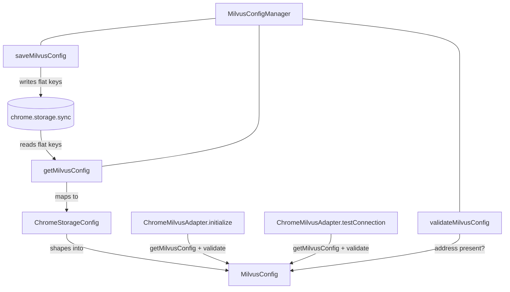

# Chrome extension: Milvus/Zilliz connection config

## Overview
This is the credential-and-endpoint store for the browser build of claude-context. Where the CLI/MCP
server reads a vector-DB address and token from environment or a config file, the Chrome extension has
no filesystem and no process env — so it persists the Milvus/Zilliz connection (address, token,
username, password, database) into `chrome.storage.sync` and hands it back on demand. The single design
idea: a thin static manager, [`MilvusConfigManager`](../catalog/packages/chrome-extension/src/config/milvusConfig.ts.md#MilvusConfigManager),
mediates between a flat browser-storage record and the shaped [`MilvusConfig`](../catalog/packages/chrome-extension/src/config/milvusConfig.ts.md#MilvusConfig)
object that the `chromeMilvusAdapter.ts`
layer feeds into a `MilvusRestfulVectorDatabase`. It is the extension's answer to "where does the vector
store live and how do I authenticate to it," nothing more.

## Diagram

## Design rationale (why it's built this way)
The two interfaces exist because the on-the-wire and in-memory shapes deliberately differ.
[`ChromeStorageConfig`](../catalog/packages/chrome-extension/src/config/milvusConfig.ts.md#ChromeStorageConfig)
is a *flat, prefixed* record — every Milvus field is `milvus`-prefixed
([`milvusAddress`](../catalog/packages/chrome-extension/src/config/milvusConfig.ts.md#ChromeStorageConfig.milvusAddress),
[`milvusToken`](../catalog/packages/chrome-extension/src/config/milvusConfig.ts.md#ChromeStorageConfig.milvusToken),
[`milvusUsername`](../catalog/packages/chrome-extension/src/config/milvusConfig.ts.md#ChromeStorageConfig.milvusUsername),
[`milvusPassword`](../catalog/packages/chrome-extension/src/config/milvusConfig.ts.md#ChromeStorageConfig.milvusPassword),
[`milvusDatabase`](../catalog/packages/chrome-extension/src/config/milvusConfig.ts.md#ChromeStorageConfig.milvusDatabase))
and it shares one namespace with unrelated secrets (`githubToken`, `openaiToken`). That prefixing is what
lets several subsystems co-exist in a single `chrome.storage.sync` bucket without key collisions.
[`MilvusConfig`](../catalog/packages/chrome-extension/src/config/milvusConfig.ts.md#MilvusConfig) is the
*un-prefixed, domain* shape ([`address`](../catalog/packages/chrome-extension/src/config/milvusConfig.ts.md#MilvusConfig.address),
[`token`](../catalog/packages/chrome-extension/src/config/milvusConfig.ts.md#MilvusConfig.token),
[`username`](../catalog/packages/chrome-extension/src/config/milvusConfig.ts.md#MilvusConfig.username),
[`password`](../catalog/packages/chrome-extension/src/config/milvusConfig.ts.md#MilvusConfig.password),
[`database`](../catalog/packages/chrome-extension/src/config/milvusConfig.ts.md#MilvusConfig.database))
that the vector-DB layer consumes. `MilvusConfigManager` is the only place that translation happens, so
the storage schema and the connection schema can evolve independently.

Only `address` is required; token/username/password/database are all optional. The manager encodes an
explicit auth policy in [`validateMilvusConfig`](../catalog/packages/chrome-extension/src/config/milvusConfig.ts.md#MilvusConfigManager.validateMilvusConfig):
its comment states *"Authentication can be optional for local instances"* — so a bare address is
considered valid and self-hosted Milvus without a token is a supported deployment. The `database` field
also carries a default: both read and write coalesce a missing value to `'default'`, matching Milvus's
own default database name so a user who leaves it blank still targets a real database.

> [!inferred] Persisting the token (and password) as plaintext in `chrome.storage.sync` means the
> Zilliz/Milvus credential syncs across the user's Chrome profile and is readable by anything with the
> extension's storage permission. The source shows no encryption; this is a security tradeoff the code
> makes implicitly, not a documented decision.

## Entry points
- [`getMilvusConfig`](../catalog/packages/chrome-extension/src/config/milvusConfig.ts.md#MilvusConfigManager.getMilvusConfig) —
  the read path. Reached whenever the extension needs to talk to the vector store: the adapter's
  [`initialize`](../catalog/packages/chrome-extension/src/milvus/chromeMilvusAdapter.ts.md#ChromeMilvusAdapter.initialize)
  and [`testConnection`](../catalog/packages/chrome-extension/src/milvus/chromeMilvusAdapter.ts.md#ChromeMilvusAdapter.testConnection)
  both call it first to obtain a live connection descriptor. Returns `null` (not a throw) when nothing is
  stored yet, so callers can distinguish "unconfigured" from "misconfigured."
- [`saveMilvusConfig`](../catalog/packages/chrome-extension/src/config/milvusConfig.ts.md#MilvusConfigManager.saveMilvusConfig) —
  the write path, hit from the options/settings UI when the user enters connection details. It flattens a
  [`MilvusConfig`](../catalog/packages/chrome-extension/src/config/milvusConfig.ts.md#MilvusConfig) back
  into the prefixed storage keys.
- [`validateMilvusConfig`](../catalog/packages/chrome-extension/src/config/milvusConfig.ts.md#MilvusConfigManager.validateMilvusConfig) —
  the gate. Both adapter methods run it immediately after loading and refuse to build a
  `MilvusRestfulVectorDatabase` if it returns false.

## Mechanism (step-by-step)
1. **Read and shape.** [`getMilvusConfig`](../catalog/packages/chrome-extension/src/config/milvusConfig.ts.md#MilvusConfigManager.getMilvusConfig)
   wraps the callback-style `chrome.storage.sync.get([...])` in a Promise, requesting exactly the five
   `milvus`-prefixed keys as a [`ChromeStorageConfig`](../catalog/packages/chrome-extension/src/config/milvusConfig.ts.md#ChromeStorageConfig).
   On `chrome.runtime.lastError` it logs and resolves `null`; if
   [`milvusAddress`](../catalog/packages/chrome-extension/src/config/milvusConfig.ts.md#ChromeStorageConfig.milvusAddress)
   is absent it also resolves `null` — address is the presence sentinel for "configured at all." Otherwise
   it builds a [`MilvusConfig`](../catalog/packages/chrome-extension/src/config/milvusConfig.ts.md#MilvusConfig),
   copying each field across the prefix boundary and defaulting
   [`database`](../catalog/packages/chrome-extension/src/config/milvusConfig.ts.md#MilvusConfig.database)
   to `'default'`.
2. **Write and flatten.** [`saveMilvusConfig`](../catalog/packages/chrome-extension/src/config/milvusConfig.ts.md#MilvusConfigManager.saveMilvusConfig)
   is the inverse: it maps the domain fields back onto the prefixed storage keys via
   `chrome.storage.sync.set` and again coalesces a missing
   [`database`](../catalog/packages/chrome-extension/src/config/milvusConfig.ts.md#MilvusConfig.database)
   to `'default'`. Unlike the read path it *rejects* the Promise on `chrome.runtime.lastError` rather than
   swallowing it, so a failed save surfaces to the UI.
3. **Validate before connecting.** [`validateMilvusConfig`](../catalog/packages/chrome-extension/src/config/milvusConfig.ts.md#MilvusConfigManager.validateMilvusConfig)
   is deliberately minimal: it returns false only when
   [`address`](../catalog/packages/chrome-extension/src/config/milvusConfig.ts.md#MilvusConfig.address)
   is falsy, and true otherwise — auth fields are never required, encoding the "local instances may be
   unauthenticated" policy.
4. **Consume in the adapter.** [`initialize`](../catalog/packages/chrome-extension/src/milvus/chromeMilvusAdapter.ts.md#ChromeMilvusAdapter.initialize)
   loads the config, runs it through validate, throws `'Invalid or missing Milvus configuration'` on
   failure, then copies the five fields into a `coreConfig` and constructs the RESTful vector DB.
   [`testConnection`](../catalog/packages/chrome-extension/src/milvus/chromeMilvusAdapter.ts.md#ChromeMilvusAdapter.testConnection)
   does the same load-and-validate, then probes a throwaway collection to confirm reachability — this is
   the "Test connection" button's backend.

## Key data structures
- [`ChromeStorageConfig`](../catalog/packages/chrome-extension/src/config/milvusConfig.ts.md#ChromeStorageConfig) —
  the persisted, flat browser-storage record. Superset of Milvus fields (also holds `githubToken`,
  `openaiToken`); every field optional because storage may be empty on first run.
- [`MilvusConfig`](../catalog/packages/chrome-extension/src/config/milvusConfig.ts.md#MilvusConfig) — the
  in-memory connection descriptor passed to the vector DB. Required
  [`address`](../catalog/packages/chrome-extension/src/config/milvusConfig.ts.md#MilvusConfig.address);
  optional [`token`](../catalog/packages/chrome-extension/src/config/milvusConfig.ts.md#MilvusConfig.token) /
  [`username`](../catalog/packages/chrome-extension/src/config/milvusConfig.ts.md#MilvusConfig.username) /
  [`password`](../catalog/packages/chrome-extension/src/config/milvusConfig.ts.md#MilvusConfig.password) /
  [`database`](../catalog/packages/chrome-extension/src/config/milvusConfig.ts.md#MilvusConfig.database).

## Dynamics (design intent)
[`MilvusConfigManager`](../catalog/packages/chrome-extension/src/config/milvusConfig.ts.md#MilvusConfigManager)
is a purely static class — no instances, no cached state — so every call re-reads
`chrome.storage.sync` and there is no stale in-memory copy to invalidate. (This contrasts with the
sibling `EmbeddingModel`, whose [`getConfig`](../catalog/packages/chrome-extension/src/background.ts.md#EmbeddingModel.getConfig)
in `background.ts`
memoizes its result.) The read path is intentionally forgiving (resolve `null`) while the write path is
strict (reject on error), reflecting that a missing config is a normal first-run state but a failed
persist is a real error the user must see.

## Edge cases
- **Never-configured store:** `getMilvusConfig` resolves `null` both on storage error and on a missing
  address, so callers can't tell those two apart from the return value alone (the error path does log).
- **Empty database:** a blank/absent database coalesces to `'default'` on *both* read and write, so the
  effective value is stable regardless of which path last touched it.
- **Unauthenticated instance:** by design, `validateMilvusConfig` accepts an address with no token —
  valid for local Milvus but means a typo'd/empty token won't be caught here; it fails later at connect
  time inside the adapter.
- **Shared namespace:** because `ChromeStorageConfig` co-locates `openaiToken`/`githubToken`, a careless
  bulk `chrome.storage.sync.clear()` elsewhere would wipe the Milvus config too.

## Open questions
- Which UI component calls `saveMilvusConfig`, and does it call `validateMilvusConfig` before persisting?
  The write path itself does not validate, so an invalid config can be saved and only rejected at
  connect time. The caller is outside this subgraph.
- `getOpenAIConfig` (referenced by `getConfig` in `background.ts`) lives in the same manager but is not in
  this subgraph, so the full set of secrets this class brokers isn't visible here.

## See also
- [Chrome Milvus adapter (`chromeMilvusAdapter.ts`)](packages-chrome-extension-src-milvus-chromeMilvusAdapter.ts.md) — the consumer that turns this config into a live `MilvusRestfulVectorDatabase`.
- [Chrome extension background service worker (`background.ts`)](packages-chrome-extension-src-background.ts.md) — the orchestrator that wires config, embeddings, and search together.
- [Chrome extension indexed-repo storage (`indexedRepoManager.ts`)](packages-chrome-extension-src-storage-indexedRepoManager.ts.md) — a sibling `chrome.storage`-backed store for tracked repositories.
