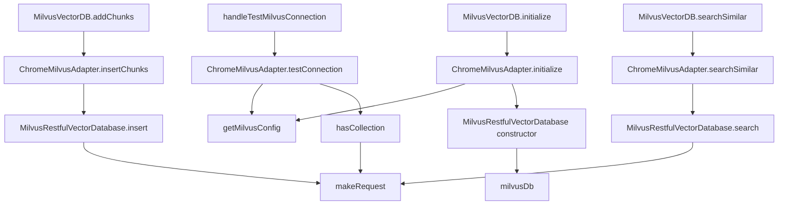

# Chrome-extension Milvus adapter (browser REST bridge to the vector store)

## Overview
This is claude-context's vector-store client *for the browser*. The core package talks to
Milvus/Zilliz through a Node SDK (gRPC-based) that can't run inside a Chrome extension, so the
extension ships its own path: a hand-rolled REST client
([`MilvusRestfulVectorDatabase`](../catalog/packages/chrome-extension/src/stubs/milvus-vectordb-stub.ts.md#MilvusRestfulVectorDatabase))
that speaks the Milvus **v2 REST API over `fetch`**, and a thin
[`ChromeMilvusAdapter`](../catalog/packages/chrome-extension/src/milvus/chromeMilvusAdapter.ts.md#ChromeMilvusAdapter.searchSimilar)
that wraps it, pulls connection settings from `chrome.storage.sync`, and reshapes the
extension's [`CodeChunk`](../catalog/packages/chrome-extension/src/milvus/chromeMilvusAdapter.ts.md#CodeChunk)
records into the DB's [`VectorDocument`](../catalog/packages/chrome-extension/src/stubs/milvus-vectordb-stub.ts.md#VectorDocument)
rows and back. The single design idea: **keep the same grounding substrate as the rest of the
tool — cosine-similarity search over code-chunk embeddings — but reach it with zero Node
dependencies**, so the identical retrieval works from a service worker.

## Diagram

## Design rationale (why it's built this way)
**A REST stub instead of the core SDK.** The file that implements the DB lives under
`src/stubs/` and its class carries the docstring *"Simplified Milvus Vector Database
implementation for Chrome Extension"*
([`MilvusRestfulVectorDatabase`](../catalog/packages/chrome-extension/src/stubs/milvus-vectordb-stub.ts.md#MilvusRestfulVectorDatabase)).
The source comment is explicit that this exists to "work in Chrome extension context without
node-specific dependencies." Rather than import the core's Milvus classes, the extension
re-declares the vector types it needs
([`VectorDocument`](../catalog/packages/chrome-extension/src/stubs/milvus-vectordb-stub.ts.md#VectorDocument),
[`VectorSearchResult`](../catalog/packages/chrome-extension/src/stubs/milvus-vectordb-stub.ts.md#VectorSearchResult),
[`SearchOptions`](../catalog/packages/chrome-extension/src/stubs/milvus-vectordb-stub.ts.md#SearchOptions),
[`MilvusRestfulConfig`](../catalog/packages/chrome-extension/src/stubs/milvus-vectordb-stub.ts.md#MilvusRestfulConfig))
locally — a deliberate duplication that mirrors the core `restful-vectordb` implementation and
`vectordb/types` (see *See also*) so the browser build stays self-contained.

**Every DB call is one `fetch`.** [`makeRequest`](../catalog/packages/chrome-extension/src/stubs/milvus-vectordb-stub.ts.md#MilvusRestfulVectorDatabase.makeRequest)
is the single choke point — its docstring is just "Make HTTP request to Milvus REST API." All
of insert/search/has-collection funnel through it, which is why authentication, base-URL
assembly, and error normalization only had to be written once.

**Config comes from browser storage, not env or files.**
[`getMilvusConfig`](../catalog/packages/chrome-extension/src/config/milvusConfig.ts.md#MilvusConfigManager.getMilvusConfig)
("Get Milvus configuration from Chrome storage") reads `chrome.storage.sync`, so the user's
Zilliz endpoint and credentials sync across their Chrome profile. Validation is intentionally
permissive: [`validateMilvusConfig`](../catalog/packages/chrome-extension/src/config/milvusConfig.ts.md#MilvusConfigManager.validateMilvusConfig)
only requires an [`address`](../catalog/packages/chrome-extension/src/config/milvusConfig.ts.md#MilvusConfig.address)
— its comment notes "Authentication can be optional for local instances," so a local Milvus
with no token is a supported case.

> [!inferred]
> The three-layer wrapping (background `MilvusVectorDB` → `ChromeMilvusAdapter` → REST stub)
> looks like separation of concerns: the background layer owns collection lifecycle
> (dimension, existence), the adapter owns chunk⇄document shape conversion, and the stub owns
> the wire protocol. Each layer re-maps the record fields, which is why `metadata` is
> serialized and deserialized more than once (see *Edge cases*).

## Entry points
- [`ChromeMilvusAdapter.initialize`](../catalog/packages/chrome-extension/src/milvus/chromeMilvusAdapter.ts.md#ChromeMilvusAdapter.initialize)
  — reached at index/search start via
  [`MilvusVectorDB.initialize`](../catalog/packages/chrome-extension/src/background.ts.md#MilvusVectorDB.initialize).
  It loads config from storage and constructs the live
  [`milvusDb`](../catalog/packages/chrome-extension/src/milvus/chromeMilvusAdapter.ts.md#ChromeMilvusAdapter.milvusDb)
  REST client; nothing else works until this has run.
- [`ChromeMilvusAdapter.insertChunks`](../catalog/packages/chrome-extension/src/milvus/chromeMilvusAdapter.ts.md#ChromeMilvusAdapter.insertChunks)
  — the write side of the data plane, entered from
  [`MilvusVectorDB.addChunks`](../catalog/packages/chrome-extension/src/background.ts.md#MilvusVectorDB.addChunks)
  after the extension has embedded a batch of code chunks.
- [`ChromeMilvusAdapter.searchSimilar`](../catalog/packages/chrome-extension/src/milvus/chromeMilvusAdapter.ts.md#ChromeMilvusAdapter.searchSimilar)
  — the read side / retrieval path, entered from
  [`MilvusVectorDB.searchSimilar`](../catalog/packages/chrome-extension/src/background.ts.md#MilvusVectorDB.searchSimilar);
  this is what turns a query embedding into ranked code chunks for the agent.
- [`ChromeMilvusAdapter.testConnection`](../catalog/packages/chrome-extension/src/milvus/chromeMilvusAdapter.ts.md#ChromeMilvusAdapter.testConnection)
  — a connectivity probe wired to the options UI through
  [`handleTestMilvusConnection`](../catalog/packages/chrome-extension/src/background.ts.md#handleTestMilvusConnection).

## Mechanism (step-by-step)
1. **Load config and build the REST client.**
   [`initialize`](../catalog/packages/chrome-extension/src/milvus/chromeMilvusAdapter.ts.md#ChromeMilvusAdapter.initialize)
   calls [`getMilvusConfig`](../catalog/packages/chrome-extension/src/config/milvusConfig.ts.md#MilvusConfigManager.getMilvusConfig),
   which resolves a [`MilvusConfig`](../catalog/packages/chrome-extension/src/config/milvusConfig.ts.md#MilvusConfig)
   from the [`ChromeStorageConfig`](../catalog/packages/chrome-extension/src/config/milvusConfig.ts.md#ChromeStorageConfig)
   keys — defaulting [`milvusDatabase`](../catalog/packages/chrome-extension/src/config/milvusConfig.ts.md#ChromeStorageConfig.milvusDatabase)
   to `'default'` and returning `null` when [`milvusAddress`](../catalog/packages/chrome-extension/src/config/milvusConfig.ts.md#ChromeStorageConfig.milvusAddress)
   is absent. After [`validateMilvusConfig`](../catalog/packages/chrome-extension/src/config/milvusConfig.ts.md#MilvusConfigManager.validateMilvusConfig)
   passes, it instantiates the REST database into
   [`milvusDb`](../catalog/packages/chrome-extension/src/milvus/chromeMilvusAdapter.ts.md#ChromeMilvusAdapter.milvusDb).
2. **Assemble the base URL.** The
   [`MilvusRestfulVectorDatabase` constructor](../catalog/packages/chrome-extension/src/stubs/milvus-vectordb-stub.ts.md#MilvusRestfulVectorDatabase.-constructor)
   stores the [`config`](../catalog/packages/chrome-extension/src/stubs/milvus-vectordb-stub.ts.md#MilvusRestfulVectorDatabase.config),
   prepends `http://` if the [`address`](../catalog/packages/chrome-extension/src/stubs/milvus-vectordb-stub.ts.md#MilvusRestfulConfig.address)
   lacks a protocol, strips a trailing slash, and appends `/v2/vectordb` to form
   [`baseUrl`](../catalog/packages/chrome-extension/src/stubs/milvus-vectordb-stub.ts.md#MilvusRestfulVectorDatabase.baseUrl)
   — the prefix every endpoint hangs off.
3. **Insert a batch.**
   [`insertChunks`](../catalog/packages/chrome-extension/src/milvus/chromeMilvusAdapter.ts.md#ChromeMilvusAdapter.insertChunks)
   maps each [`CodeChunk`](../catalog/packages/chrome-extension/src/milvus/chromeMilvusAdapter.ts.md#CodeChunk)
   into a document — using the chunk's embedding
   [`vector`](../catalog/packages/chrome-extension/src/milvus/chromeMilvusAdapter.ts.md#CodeChunk.vector)
   (or `[]`) and `JSON.parse`-ing its string
   [`metadata`](../catalog/packages/chrome-extension/src/milvus/chromeMilvusAdapter.ts.md#CodeChunk.metadata)
   into an object — then calls
   [`insert`](../catalog/packages/chrome-extension/src/stubs/milvus-vectordb-stub.ts.md#MilvusRestfulVectorDatabase.insert),
   which re-stringifies each `VectorDocument`'s
   [`metadata`](../catalog/packages/chrome-extension/src/stubs/milvus-vectordb-stub.ts.md#VectorDocument.metadata)
   and POSTs `{collectionName, data, dbName}` to `/entities/insert` via
   [`makeRequest`](../catalog/packages/chrome-extension/src/stubs/milvus-vectordb-stub.ts.md#MilvusRestfulVectorDatabase.makeRequest).
   The empty-batch case returns early before any request.
4. **Search.**
   [`searchSimilar`](../catalog/packages/chrome-extension/src/milvus/chromeMilvusAdapter.ts.md#ChromeMilvusAdapter.searchSimilar)
   packs `limit`/`threshold` into a
   [`SearchOptions`](../catalog/packages/chrome-extension/src/stubs/milvus-vectordb-stub.ts.md#SearchOptions)
   (fields [`topK`](../catalog/packages/chrome-extension/src/stubs/milvus-vectordb-stub.ts.md#SearchOptions.topK)
   and [`threshold`](../catalog/packages/chrome-extension/src/stubs/milvus-vectordb-stub.ts.md#SearchOptions.threshold))
   and calls [`search`](../catalog/packages/chrome-extension/src/stubs/milvus-vectordb-stub.ts.md#MilvusRestfulVectorDatabase.search),
   which POSTs `annsField: "vector"`, `limit`, `outputFields`, and
   `searchParams.metricType: "COSINE"` to `/entities/search`. It reads each hit's
   [`document`](../catalog/packages/chrome-extension/src/stubs/milvus-vectordb-stub.ts.md#VectorSearchResult.document)
   fields, converts Milvus's cosine *distance* to a similarity
   [`score`](../catalog/packages/chrome-extension/src/stubs/milvus-vectordb-stub.ts.md#VectorSearchResult.score)
   via `1 - distance` clamped to `[0,1]`, filters below the
   [`threshold`](../catalog/packages/chrome-extension/src/stubs/milvus-vectordb-stub.ts.md#SearchOptions.threshold),
   and sorts descending.
5. **Reshape results for the caller.** Back in the adapter,
   [`searchSimilar`](../catalog/packages/chrome-extension/src/milvus/chromeMilvusAdapter.ts.md#ChromeMilvusAdapter.searchSimilar)
   flattens each [`VectorSearchResult`](../catalog/packages/chrome-extension/src/stubs/milvus-vectordb-stub.ts.md#VectorSearchResult)
   into a [`SearchResult`](../catalog/packages/chrome-extension/src/milvus/chromeMilvusAdapter.ts.md#SearchResult)
   (id/content/path/lines/extension +
   [`score`](../catalog/packages/chrome-extension/src/stubs/milvus-vectordb-stub.ts.md#VectorSearchResult.score),
   with [`metadata`](../catalog/packages/chrome-extension/src/stubs/milvus-vectordb-stub.ts.md#VectorDocument.metadata)
   re-`JSON.stringify`-ed back to a string), re-sorts by score, and returns; the background
   [`searchSimilar`](../catalog/packages/chrome-extension/src/background.ts.md#MilvusVectorDB.searchSimilar)
   then re-maps once more into display `CodeChunk`s.
6. **Probe connectivity.**
   [`testConnection`](../catalog/packages/chrome-extension/src/milvus/chromeMilvusAdapter.ts.md#ChromeMilvusAdapter.testConnection)
   re-fetches and re-validates the config, spins up a throwaway
   [`MilvusRestfulVectorDatabase`](../catalog/packages/chrome-extension/src/stubs/milvus-vectordb-stub.ts.md#MilvusRestfulVectorDatabase),
   and calls [`hasCollection`](../catalog/packages/chrome-extension/src/stubs/milvus-vectordb-stub.ts.md#MilvusRestfulVectorDatabase.hasCollection)
   on a sentinel name `'_test_connection_'` — using a real (harmless) round-trip as the ping.

## Key data structures
- [`CodeChunk`](../catalog/packages/chrome-extension/src/milvus/chromeMilvusAdapter.ts.md#CodeChunk)
  — the extension's in-flight record: id, content, relativePath, start/end line, fileExtension,
  a **string** [`metadata`](../catalog/packages/chrome-extension/src/milvus/chromeMilvusAdapter.ts.md#CodeChunk.metadata),
  and an optional embedding [`vector`](../catalog/packages/chrome-extension/src/milvus/chromeMilvusAdapter.ts.md#CodeChunk.vector).
- [`VectorDocument`](../catalog/packages/chrome-extension/src/stubs/milvus-vectordb-stub.ts.md#VectorDocument)
  — the wire/row shape; same fields but with `metadata` as an **object**
  ([`metadata`](../catalog/packages/chrome-extension/src/stubs/milvus-vectordb-stub.ts.md#VectorDocument.metadata))
  and a required vector. The string↔object gap between these two is the reason for the repeated
  `JSON.parse`/`JSON.stringify`.
- [`MilvusRestfulConfig`](../catalog/packages/chrome-extension/src/stubs/milvus-vectordb-stub.ts.md#MilvusRestfulConfig)
  — connection state: [`address`](../catalog/packages/chrome-extension/src/stubs/milvus-vectordb-stub.ts.md#MilvusRestfulConfig.address),
  optional [`token`](../catalog/packages/chrome-extension/src/stubs/milvus-vectordb-stub.ts.md#MilvusRestfulConfig.token) /
  [`username`](../catalog/packages/chrome-extension/src/stubs/milvus-vectordb-stub.ts.md#MilvusRestfulConfig.username) /
  [`password`](../catalog/packages/chrome-extension/src/stubs/milvus-vectordb-stub.ts.md#MilvusRestfulConfig.password),
  and [`database`](../catalog/packages/chrome-extension/src/stubs/milvus-vectordb-stub.ts.md#MilvusRestfulConfig.database).
  Its storage-facing twin is
  [`MilvusConfig`](../catalog/packages/chrome-extension/src/config/milvusConfig.ts.md#MilvusConfig),
  managed by [`MilvusConfigManager`](../catalog/packages/chrome-extension/src/config/milvusConfig.ts.md#MilvusConfigManager).
- The adapter's own state:
  [`collectionName`](../catalog/packages/chrome-extension/src/milvus/chromeMilvusAdapter.ts.md#ChromeMilvusAdapter.collectionName)
  (the Milvus collection this instance binds to) and the lazily-built
  [`milvusDb`](../catalog/packages/chrome-extension/src/milvus/chromeMilvusAdapter.ts.md#ChromeMilvusAdapter.milvusDb)
  handle.

## Dynamics (design intent)
The layering is strictly sequential per operation — there is no batching or concurrency inside
the adapter. Ranking happens **twice** on the read path: the REST
[`search`](../catalog/packages/chrome-extension/src/stubs/milvus-vectordb-stub.ts.md#MilvusRestfulVectorDatabase.search)
already threshold-filters and sorts descending by
[`score`](../catalog/packages/chrome-extension/src/stubs/milvus-vectordb-stub.ts.md#VectorSearchResult.score),
and the adapter
[`searchSimilar`](../catalog/packages/chrome-extension/src/milvus/chromeMilvusAdapter.ts.md#ChromeMilvusAdapter.searchSimilar)
sorts again after reshaping — a defensive re-sort so callers never depend on server ordering.
Authentication is resolved once per request inside
[`makeRequest`](../catalog/packages/chrome-extension/src/stubs/milvus-vectordb-stub.ts.md#MilvusRestfulVectorDatabase.makeRequest):
a [`token`](../catalog/packages/chrome-extension/src/stubs/milvus-vectordb-stub.ts.md#MilvusRestfulConfig.token)
becomes `Bearer <token>`, else
[`username`](../catalog/packages/chrome-extension/src/stubs/milvus-vectordb-stub.ts.md#MilvusRestfulConfig.username)/[`password`](../catalog/packages/chrome-extension/src/stubs/milvus-vectordb-stub.ts.md#MilvusRestfulConfig.password)
becomes `Bearer user:pass`.

## Edge cases
- **Uninitialized DB.** `insertChunks`/`searchSimilar` throw `'Milvus not initialized'` when
  [`milvusDb`](../catalog/packages/chrome-extension/src/milvus/chromeMilvusAdapter.ts.md#ChromeMilvusAdapter.milvusDb)
  is still `null` — [`initialize`](../catalog/packages/chrome-extension/src/milvus/chromeMilvusAdapter.ts.md#ChromeMilvusAdapter.initialize)
  must run first.
- **Metadata round-trips.** A chunk's [`metadata`](../catalog/packages/chrome-extension/src/milvus/chromeMilvusAdapter.ts.md#CodeChunk.metadata)
  is a string in `CodeChunk`, parsed to an object for
  [`VectorDocument`](../catalog/packages/chrome-extension/src/stubs/milvus-vectordb-stub.ts.md#VectorDocument),
  re-stringified onto the wire by
  [`insert`](../catalog/packages/chrome-extension/src/stubs/milvus-vectordb-stub.ts.md#MilvusRestfulVectorDatabase.insert),
  and on read [`search`](../catalog/packages/chrome-extension/src/stubs/milvus-vectordb-stub.ts.md#MilvusRestfulVectorDatabase.search)
  parses it (falling back to `{}` on malformed JSON) only for the adapter to stringify it again.
  A malformed metadata string is tolerated on read but not on write.
- **Distance vs. similarity.** [`search`](../catalog/packages/chrome-extension/src/stubs/milvus-vectordb-stub.ts.md#MilvusRestfulVectorDatabase.search)
  assumes the server returns a cosine *distance* and computes `1 - distance`; a missing
  `distance` defaults to `1` → score `0`, so absent scores rank last rather than crashing.
- **Connection-test error mapping.**
  [`handleTestMilvusConnection`](../catalog/packages/chrome-extension/src/background.ts.md#handleTestMilvusConnection)
  translates raw failures from
  [`testConnection`](../catalog/packages/chrome-extension/src/milvus/chromeMilvusAdapter.ts.md#ChromeMilvusAdapter.testConnection)
  into user-facing hints (CORS, 401, 404, network), reflecting that a browser `fetch` to a
  self-hosted Milvus commonly trips CORS.

## Open questions
- Collection lifecycle (`createCollection`, `createIndex`, `loadCollection`, and the
  Zilliz-Cloud collection-limit guard `COLLECTION_LIMIT_MESSAGE`) lives in the same stub file
  but is outside this packet's subgraph, so it isn't cited here; the background
  [`initialize`](../catalog/packages/chrome-extension/src/background.ts.md#MilvusVectorDB.initialize)
  is what triggers creation when a collection is absent.
- The embedding dimension the collection is created with (`EMBEDDING_DIM` in `background.ts`)
  is not in this subgraph, so the exact vector width the adapter assumes isn't verifiable from
  the cited symbols.

## See also
- **packages-core-src-vectordb-milvus-restful-vectordb.ts** — the core, Node-side
  `MilvusRestfulVectorDatabase` this stub deliberately mirrors; the browser copy is a trimmed
  reimplementation of it.
- **packages-core-src-vectordb-types.ts** — the canonical `VectorDocument` / `SearchOptions` /
  search-result types the stub re-declares locally to avoid importing core into the extension.
- **packages-chrome-extension-src-config-milvusConfig.ts** — the `chrome.storage.sync`-backed
  config manager this adapter reads from.
- **packages-chrome-extension-src-stubs-milvus-vectordb-stub.ts** — the REST client itself
  (constructor, `makeRequest`, insert/search/collection ops).
