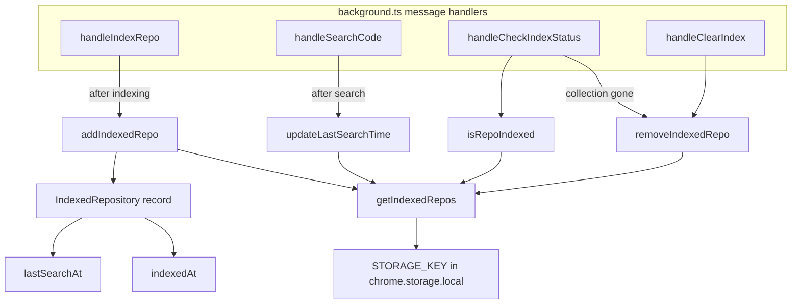

# Indexed-repo registry (browser storage)

## Overview
In the Chrome-extension port of claude-context, "which GitHub repos have I already
indexed?" is answered not by a filesystem snapshot but by a small record in the browser's
own key-value store. [`IndexedRepoManager`](../catalog/packages/chrome-extension/src/storage/indexedRepoManager.ts.md#IndexedRepository)
is a static-only class that reads and writes a single `chrome.storage.local` key,
[`STORAGE_KEY`](../catalog/packages/chrome-extension/src/storage/indexedRepoManager.ts.md#IndexedRepoManager.STORAGE_KEY)
= `"indexedRepositories"`, holding an array of
[`IndexedRepository`](../catalog/packages/chrome-extension/src/storage/indexedRepoManager.ts.md#IndexedRepository)
metadata records. This is the browser analog of the MCP server's on-disk snapshot: it is
*bookkeeping metadata* (owner/repo, chunk counts, timestamps, the Milvus collection name),
never the vectors themselves — the actual embeddings live in a Milvus collection whose name
each record carries. The whole file is deliberately simple: every method funnels through one
read (`getIndexedRepos`) and one `chrome.storage.local.set`.

## Diagram

## Design rationale (why it's built this way)
**Metadata registry, not the index itself.** The
[`IndexedRepository`](../catalog/packages/chrome-extension/src/storage/indexedRepoManager.ts.md#IndexedRepository)
record stores counts and a `collectionName`, not chunks — the vectors are held by Milvus. So
this store and Milvus can drift apart, and the code treats the vector DB as the source of
truth: [`handleCheckIndexStatus`](../catalog/packages/chrome-extension/src/background.ts.md#handleCheckIndexStatus)
trusts a registry record only after re-initializing the Milvus collection, and if that fails
it deletes the now-orphaned record via
[`removeIndexedRepo`](../catalog/packages/chrome-extension/src/storage/indexedRepoManager.ts.md#IndexedRepoManager.removeIndexedRepo)
("Index record found but collection missing, cleaned up storage").

> [!inferred]
> The class is entirely static with a single private `STORAGE_KEY` and no instance state,
> which reads as a deliberate "namespace of storage helpers" rather than an object with a
> lifecycle — consistent with a service-worker context where there is nothing long-lived to
> hold the state.

**A hard cap of five recent repos.** [`addIndexedRepo`](../catalog/packages/chrome-extension/src/storage/indexedRepoManager.ts.md#IndexedRepoManager.addIndexedRepo)
prepends the new record (`unshift`) and then `slice(0, 5)` — the browser store keeps at most
five indexed repos, newest first. This is a bounded LRU-ish cache, not a durable catalog: a
sixth repo silently evicts the oldest record (though not its Milvus collection). The value 5
is a magic constant in the method with no accompanying docstring.

> [!inferred]
> The cap looks like a guard against `chrome.storage.local`'s quota and against the popup UI
> growing unbounded, but the source states no reason; `getRecentlyIndexedRepos(limit=10)`
> would never return more than the five that survive, so the two limits are inconsistent.

**Idempotent upsert by `id`.** Before prepending,
[`addIndexedRepo`](../catalog/packages/chrome-extension/src/storage/indexedRepoManager.ts.md#IndexedRepoManager.addIndexedRepo)
filters out any existing record with the same
[`id`](../catalog/packages/chrome-extension/src/storage/indexedRepoManager.ts.md#IndexedRepository.id).
The `id` is always `` `${owner}/${repo}` `` (built by the background handlers), so re-indexing
a repo replaces its record and refreshes its
[`indexedAt`](../catalog/packages/chrome-extension/src/storage/indexedRepoManager.ts.md#IndexedRepository.indexedAt)
rather than duplicating it.

## Entry points
- [`handleIndexRepo`](../catalog/packages/chrome-extension/src/background.ts.md#handleIndexRepo) —
  the background message handler that runs a full index (fetch files → chunk → embed → Milvus),
  then records the result by calling
  [`addIndexedRepo`](../catalog/packages/chrome-extension/src/storage/indexedRepoManager.ts.md#IndexedRepoManager.addIndexedRepo)
  with the repo id, counts, and collection name. This is the only writer of *new* records.
- [`handleSearchCode`](../catalog/packages/chrome-extension/src/background.ts.md#handleSearchCode) —
  after a semantic search resolves, touches the registry through
  [`updateLastSearchTime`](../catalog/packages/chrome-extension/src/storage/indexedRepoManager.ts.md#IndexedRepoManager.updateLastSearchTime)
  so the record's recency reflects use, not just indexing.
- [`handleCheckIndexStatus`](../catalog/packages/chrome-extension/src/background.ts.md#handleCheckIndexStatus) —
  the read/reconcile path: asks
  [`isRepoIndexed`](../catalog/packages/chrome-extension/src/storage/indexedRepoManager.ts.md#IndexedRepoManager.isRepoIndexed)
  whether a record exists and, on a Milvus mismatch, prunes it via
  [`removeIndexedRepo`](../catalog/packages/chrome-extension/src/storage/indexedRepoManager.ts.md#IndexedRepoManager.removeIndexedRepo).
- [`handleClearIndex`](../catalog/packages/chrome-extension/src/background.ts.md#handleClearIndex) —
  user-initiated teardown: clears the Milvus collection and then drops the registry record with
  [`removeIndexedRepo`](../catalog/packages/chrome-extension/src/storage/indexedRepoManager.ts.md#IndexedRepoManager.removeIndexedRepo).

## Mechanism (step-by-step)
1. **Read is the primitive.** Every operation begins with
   [`getIndexedRepos`](../catalog/packages/chrome-extension/src/storage/indexedRepoManager.ts.md#IndexedRepoManager.getIndexedRepos),
   which wraps the callback-style `chrome.storage.local.get([STORAGE_KEY])` in a Promise,
   surfaces `chrome.runtime.lastError` as a rejection, and returns `items[STORAGE_KEY] || []`
   — so a never-written key reads as an empty array rather than `undefined`. There is no cache;
   each call is a fresh storage read.
2. **Insert with dedup, recency, and cap.**
   [`addIndexedRepo`](../catalog/packages/chrome-extension/src/storage/indexedRepoManager.ts.md#IndexedRepoManager.addIndexedRepo)
   stamps [`indexedAt`](../catalog/packages/chrome-extension/src/storage/indexedRepoManager.ts.md#IndexedRepository.indexedAt)
   with `Date.now()`, removes any prior record sharing the same
   [`id`](../catalog/packages/chrome-extension/src/storage/indexedRepoManager.ts.md#IndexedRepository.id),
   `unshift`es the new record to the front, truncates to five with `slice(0, 5)`, and persists
   the array with a promisified `chrome.storage.local.set`.
3. **Existence check.** [`isRepoIndexed`](../catalog/packages/chrome-extension/src/storage/indexedRepoManager.ts.md#IndexedRepoManager.isRepoIndexed)
   reads the array and returns the record whose
   [`id`](../catalog/packages/chrome-extension/src/storage/indexedRepoManager.ts.md#IndexedRepository.id)
   matches, or `null` — the status handler uses the record's fields (counts, collection name)
   as the "last known" view before confirming against Milvus.
4. **Recency touch.** [`updateLastSearchTime`](../catalog/packages/chrome-extension/src/storage/indexedRepoManager.ts.md#IndexedRepoManager.updateLastSearchTime)
   finds the record by id, sets its
   [`lastSearchAt`](../catalog/packages/chrome-extension/src/storage/indexedRepoManager.ts.md#IndexedRepository.lastSearchAt)
   to `Date.now()`, and rewrites the whole array. If no record matches it returns without
   writing (the `if (repo)` guard), so a search against an unregistered repo is a silent no-op.
5. **Removal.** [`removeIndexedRepo`](../catalog/packages/chrome-extension/src/storage/indexedRepoManager.ts.md#IndexedRepoManager.removeIndexedRepo)
   filters the matching id out and writes back the shorter array — the same read-filter-write
   shape, used both for user "clear index" and for automatic cleanup of orphaned records.
6. **Housekeeping helpers.** [`getRecentlyIndexedRepos`](../catalog/packages/chrome-extension/src/storage/indexedRepoManager.ts.md#IndexedRepoManager.getRecentlyIndexedRepos)
   sorts by [`indexedAt`](../catalog/packages/chrome-extension/src/storage/indexedRepoManager.ts.md#IndexedRepository.indexedAt)
   descending and slices to a `limit` (default 10, though at most five records ever exist), and
   [`cleanupOldRepos`](../catalog/packages/chrome-extension/src/storage/indexedRepoManager.ts.md#IndexedRepoManager.cleanupOldRepos)
   drops records older than a `daysOld` cutoff (default 30) by comparing
   [`indexedAt`](../catalog/packages/chrome-extension/src/storage/indexedRepoManager.ts.md#IndexedRepository.indexedAt)
   against `Date.now() - daysOld*24h`.

## Key data structures
- [`IndexedRepository`](../catalog/packages/chrome-extension/src/storage/indexedRepoManager.ts.md#IndexedRepository) —
  the record shape: `id` (`owner/repo`), `owner`, `repo`,
  [`indexedAt`](../catalog/packages/chrome-extension/src/storage/indexedRepoManager.ts.md#IndexedRepository.indexedAt),
  `totalFiles`, `totalChunks`, optional
  [`lastSearchAt`](../catalog/packages/chrome-extension/src/storage/indexedRepoManager.ts.md#IndexedRepository.lastSearchAt),
  and `collectionName`. The `collectionName` is the bridge to the actual embeddings in Milvus;
  everything else is display/eviction metadata.
- [`STORAGE_KEY`](../catalog/packages/chrome-extension/src/storage/indexedRepoManager.ts.md#IndexedRepoManager.STORAGE_KEY) —
  the single `chrome.storage.local` key `"indexedRepositories"` under which the whole array
  lives. There is exactly one key; the registry is one JSON array, not a per-repo store.

## Dynamics (design intent)
Every mutator follows read-modify-write against the full array (`getIndexedRepos` → transform →
`chrome.storage.local.set`), so writes are not atomic with respect to each other: two
concurrent mutators both read the pre-write array and the second `set` wins. In the
service-worker message-handler model each handler is a discrete request, so overlapping
mutations of the same key are unlikely but not prevented by anything in this file.

> [!inferred]
> No tests in the configured paths reference this subgraph (per the packet Evidence), so the
> concurrency and eviction behavior above is read from the source shape, not from a spec.

## Edge cases
- **Registry/Milvus drift.** A record can outlive its Milvus collection (e.g. collection cleared
  out of band); [`handleCheckIndexStatus`](../catalog/packages/chrome-extension/src/background.ts.md#handleCheckIndexStatus)
  detects this by failing to initialize the collection and self-heals with
  [`removeIndexedRepo`](../catalog/packages/chrome-extension/src/storage/indexedRepoManager.ts.md#IndexedRepoManager.removeIndexedRepo).
- **Silent eviction.** The `slice(0, 5)` in
  [`addIndexedRepo`](../catalog/packages/chrome-extension/src/storage/indexedRepoManager.ts.md#IndexedRepoManager.addIndexedRepo)
  drops the least-recently-indexed record with no notification and without clearing its Milvus
  collection, so an evicted repo's vectors can linger unreferenced.
- **Search on an unknown repo.** [`updateLastSearchTime`](../catalog/packages/chrome-extension/src/storage/indexedRepoManager.ts.md#IndexedRepoManager.updateLastSearchTime)
  does nothing (and does not create a record) when the id isn't present — the `if (repo)` guard
  means a search never implicitly registers a repo.
- **Empty / unwritten key.** [`getIndexedRepos`](../catalog/packages/chrome-extension/src/storage/indexedRepoManager.ts.md#IndexedRepoManager.getIndexedRepos)
  normalizes a missing key to `[]`, so every downstream `find`/`filter`/`sort` is safe on first
  run.

## Open questions
- [`cleanupOldRepos`](../catalog/packages/chrome-extension/src/storage/indexedRepoManager.ts.md#IndexedRepoManager.cleanupOldRepos)
  and [`getRecentlyIndexedRepos`](../catalog/packages/chrome-extension/src/storage/indexedRepoManager.ts.md#IndexedRepoManager.getRecentlyIndexedRepos)
  are in the subgraph but have no caller in it — whether any background handler or popup ever
  invokes the 30-day cleanup or the recent-repos list is not visible from this packet.
- The `daysOld=30` and `limit=10` defaults exceed what the five-record cap can hold; whether
  that mismatch is intentional (future-proofing) or a leftover is not stated in the source.

## See also
- packages-chrome-extension-src-background.ts — the message handlers that drive this registry
  (index / search / status / clear).
- packages-chrome-extension-src-milvus-chromeMilvusAdapter.ts — the vector store whose
  collections the `collectionName` field points at.
- packages-core-src-sync-synchronizer.ts / packages-mcp-src-sync.ts — the non-browser
  (MCP/core) side of "what's already indexed", the snapshot this store is the browser analog of.
