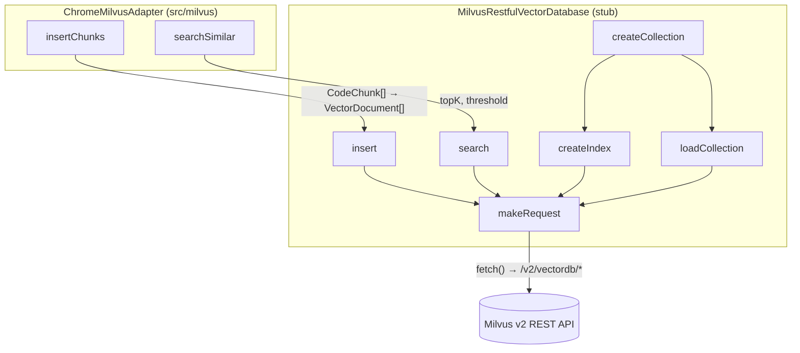

# Browser Milvus stub — a fetch-only vector DB client for the Chrome extension

## Overview
This "stub" is the vector-store grounding substrate for claude-context's **Chrome extension**
build. Despite the name, it is not a no-op placeholder — it is a fully working reimplementation of
the Milvus vector database client written entirely against the browser `fetch` API and Milvus's
v2 RESTful endpoints. The single design idea is *dependency isolation for the webpack bundle*: the
core package's vector-DB barrel re-exports a gRPC-backed client (`@zilliz/milvus2-sdk-node`), which
drags in Node-only modules a browser extension cannot run. Rather than import from the core package,
the extension imports this local copy — a REST-only [`MilvusRestfulVectorDatabase`](../catalog/packages/chrome-extension/src/stubs/milvus-vectordb-stub.ts.md#MilvusRestfulVectorDatabase.-constructor)
plus the [`VectorDocument`](../catalog/packages/chrome-extension/src/stubs/milvus-vectordb-stub.ts.md#VectorDocument) /
[`VectorSearchResult`](../catalog/packages/chrome-extension/src/stubs/milvus-vectordb-stub.ts.md#VectorSearchResult) /
[`SearchOptions`](../catalog/packages/chrome-extension/src/stubs/milvus-vectordb-stub.ts.md#SearchOptions) types it needs —
so nothing gRPC-shaped ever reaches the bundler.

## Diagram

## Design rationale (why it's built this way)
The extension talks to Milvus through the same *concepts* as the core indexer — collections, vectors,
cosine search — but it must ship as a `target: web` webpack bundle. The upstream vector-DB module
exports two implementations from one barrel: a REST client and a gRPC client whose very first import
is `@zilliz/milvus2-sdk-node`. Pulling *either* symbol from the core package would bundle the gRPC
SDK and its Node-only transports (`net`, `tls`, `http2`, native addons) that the browser cannot
provide. The adapter's own comment states the intent directly: *"Import types from a stub file
instead of the core package … a simplified version that works in Chrome extension environment."*
So the stub is a deliberate, self-contained copy of only the REST path.

Every remote call funnels through one private helper,
[`makeRequest`](../catalog/packages/chrome-extension/src/stubs/milvus-vectordb-stub.ts.md#MilvusRestfulVectorDatabase.makeRequest)
— *"Make HTTP request to Milvus REST API."* Centralizing auth, error decoding, and URL construction
in a single seam is what lets the rest of the class stay declarative: each operation just builds a
request body and hands it to `makeRequest`.

> [!inferred]
> The "stub" naming is about what it stands in for at *bundle time* (the core package import), not
> about being unimplemented. Unlike a typical webpack stub that returns `undefined` or throws
> "not implemented", this file performs real network I/O. The only things it throws are genuine
> runtime failures surfaced from `makeRequest` (see Edge cases) — never a "stubbed out" sentinel.

## Entry points
- [`insert`](../catalog/packages/chrome-extension/src/stubs/milvus-vectordb-stub.ts.md#MilvusRestfulVectorDatabase.insert) —
  the write path. Reached from the adapter's
  [`insertChunks`](../catalog/packages/chrome-extension/src/milvus/chromeMilvusAdapter.ts.md#ChromeMilvusAdapter.insertChunks)
  (*"Insert code chunks into Milvus"*), which maps each embedded `CodeChunk` into a
  [`VectorDocument`](../catalog/packages/chrome-extension/src/stubs/milvus-vectordb-stub.ts.md#VectorDocument)
  and calls `insert`. This is how AST-chunked, embedded code lands in the vector store.
- [`search`](../catalog/packages/chrome-extension/src/stubs/milvus-vectordb-stub.ts.md#MilvusRestfulVectorDatabase.search) —
  the read/retrieval path. Reached from
  [`searchSimilar`](../catalog/packages/chrome-extension/src/milvus/chromeMilvusAdapter.ts.md#ChromeMilvusAdapter.searchSimilar)
  (*"Search for similar code chunks"*), which packages the query embedding plus a `topK`/`threshold`
  into [`SearchOptions`](../catalog/packages/chrome-extension/src/stubs/milvus-vectordb-stub.ts.md#SearchOptions).
  This is the semantic-search seam an agent hits to ground on the indexed repo.
- [`createCollection`](../catalog/packages/chrome-extension/src/stubs/milvus-vectordb-stub.ts.md#MilvusRestfulVectorDatabase.createCollection) —
  the one-time provisioning path: defines the schema, then
  [`createIndex`](../catalog/packages/chrome-extension/src/stubs/milvus-vectordb-stub.ts.md#MilvusRestfulVectorDatabase.createIndex)
  and [`loadCollection`](../catalog/packages/chrome-extension/src/stubs/milvus-vectordb-stub.ts.md#MilvusRestfulVectorDatabase.loadCollection).
- The [constructor](../catalog/packages/chrome-extension/src/stubs/milvus-vectordb-stub.ts.md#MilvusRestfulVectorDatabase.-constructor) —
  *"Simplified Milvus Vector Database implementation for Chrome Extension"* — where a
  [`MilvusRestfulConfig`](../catalog/packages/chrome-extension/src/stubs/milvus-vectordb-stub.ts.md#MilvusRestfulConfig)
  is turned into a `/v2/vectordb` base URL before any request is possible.

## Mechanism (step-by-step)
1. **Construct and normalize the endpoint.** The
   [constructor](../catalog/packages/chrome-extension/src/stubs/milvus-vectordb-stub.ts.md#MilvusRestfulVectorDatabase.-constructor)
   stores the [`config`](../catalog/packages/chrome-extension/src/stubs/milvus-vectordb-stub.ts.md#MilvusRestfulVectorDatabase.config),
   then coerces [`address`](../catalog/packages/chrome-extension/src/stubs/milvus-vectordb-stub.ts.md#MilvusRestfulConfig.address)
   into a URL: if it lacks an `http://`/`https://` scheme one is prepended, the trailing slash is
   stripped, and `"/v2/vectordb"` is appended to form
   [`baseUrl`](../catalog/packages/chrome-extension/src/stubs/milvus-vectordb-stub.ts.md#MilvusRestfulVectorDatabase.baseUrl).
   Every later request is `baseUrl + endpoint`. No connection is opened here — REST is stateless.
2. **Provision the collection (first index only).**
   [`createCollection`](../catalog/packages/chrome-extension/src/stubs/milvus-vectordb-stub.ts.md#MilvusRestfulVectorDatabase.createCollection)
   builds a fixed schema — an `id` VarChar primary key, a `FloatVector` field of the caller's
   `dimension`, and `content`/`relativePath`/`startLine`/`endLine`/`fileExtension`/`metadata`
   columns that mirror [`VectorDocument`](../catalog/packages/chrome-extension/src/stubs/milvus-vectordb-stub.ts.md#VectorDocument).
   It POSTs the schema (through a limit-check wrapper), then chains
   [`createIndex`](../catalog/packages/chrome-extension/src/stubs/milvus-vectordb-stub.ts.md#MilvusRestfulVectorDatabase.createIndex)
   (an `AUTOINDEX` on the `vector` field with a `COSINE` metric) and
   [`loadCollection`](../catalog/packages/chrome-extension/src/stubs/milvus-vectordb-stub.ts.md#MilvusRestfulVectorDatabase.loadCollection),
   which must run before the collection is queryable.
3. **Write embedded chunks.**
   [`insert`](../catalog/packages/chrome-extension/src/stubs/milvus-vectordb-stub.ts.md#MilvusRestfulVectorDatabase.insert)
   flattens each [`VectorDocument`](../catalog/packages/chrome-extension/src/stubs/milvus-vectordb-stub.ts.md#VectorDocument)
   into a row, notably `JSON.stringify`-ing the free-form
   [`metadata`](../catalog/packages/chrome-extension/src/stubs/milvus-vectordb-stub.ts.md#VectorDocument.metadata)
   object into a string column while the
   [`vector`](../catalog/packages/chrome-extension/src/stubs/milvus-vectordb-stub.ts.md#VectorDocument.vector),
   [`content`](../catalog/packages/chrome-extension/src/stubs/milvus-vectordb-stub.ts.md#VectorDocument.content),
   [`relativePath`](../catalog/packages/chrome-extension/src/stubs/milvus-vectordb-stub.ts.md#VectorDocument.relativePath),
   [`startLine`](../catalog/packages/chrome-extension/src/stubs/milvus-vectordb-stub.ts.md#VectorDocument.startLine),
   [`endLine`](../catalog/packages/chrome-extension/src/stubs/milvus-vectordb-stub.ts.md#VectorDocument.endLine),
   [`fileExtension`](../catalog/packages/chrome-extension/src/stubs/milvus-vectordb-stub.ts.md#VectorDocument.fileExtension)
   and [`id`](../catalog/packages/chrome-extension/src/stubs/milvus-vectordb-stub.ts.md#VectorDocument.id)
   pass through structurally. The batch is POSTed to `/entities/insert`.
4. **Semantic search and score conversion.**
   [`search`](../catalog/packages/chrome-extension/src/stubs/milvus-vectordb-stub.ts.md#MilvusRestfulVectorDatabase.search)
   defaults [`topK`](../catalog/packages/chrome-extension/src/stubs/milvus-vectordb-stub.ts.md#SearchOptions.topK)
   to 10, POSTs the query vector to `/entities/search` with `metricType: "COSINE"`, then reshapes each
   hit back into a [`VectorSearchResult`](../catalog/packages/chrome-extension/src/stubs/milvus-vectordb-stub.ts.md#VectorSearchResult).
   The load-bearing detail is the score math: Milvus returns a cosine *distance*, and the code converts
   it to a similarity [`score`](../catalog/packages/chrome-extension/src/stubs/milvus-vectordb-stub.ts.md#VectorSearchResult.score)
   via `1 - distance`, clamped to `[0,1]`. If a
   [`threshold`](../catalog/packages/chrome-extension/src/stubs/milvus-vectordb-stub.ts.md#SearchOptions.threshold)
   is supplied, sub-threshold results are dropped, and the survivors are sorted descending by score.
5. **Every call bottoms out in one HTTP helper.**
   [`makeRequest`](../catalog/packages/chrome-extension/src/stubs/milvus-vectordb-stub.ts.md#MilvusRestfulVectorDatabase.makeRequest)
   assembles JSON headers, attaches auth (a `Bearer` [`token`](../catalog/packages/chrome-extension/src/stubs/milvus-vectordb-stub.ts.md#MilvusRestfulConfig.token),
   else a `Bearer username:password` from
   [`username`](../catalog/packages/chrome-extension/src/stubs/milvus-vectordb-stub.ts.md#MilvusRestfulConfig.username)/[`password`](../catalog/packages/chrome-extension/src/stubs/milvus-vectordb-stub.ts.md#MilvusRestfulConfig.password)),
   serializes the body for POSTs, and calls `fetch`. It treats a non-OK HTTP status *and* a Milvus
   `result.code` other than `0`/`200` as errors, and rewrites the raw `fetch` `TypeError` into a
   friendly "Unable to connect to Milvus server at `<address>`" message. Using `fetch` here — not an
   SDK socket — is precisely what keeps the module browser-safe.

## Key data structures
- [`MilvusRestfulConfig`](../catalog/packages/chrome-extension/src/stubs/milvus-vectordb-stub.ts.md#MilvusRestfulConfig):
  connection state — [`address`](../catalog/packages/chrome-extension/src/stubs/milvus-vectordb-stub.ts.md#MilvusRestfulConfig.address),
  optional [`token`](../catalog/packages/chrome-extension/src/stubs/milvus-vectordb-stub.ts.md#MilvusRestfulConfig.token)/[`username`](../catalog/packages/chrome-extension/src/stubs/milvus-vectordb-stub.ts.md#MilvusRestfulConfig.username)/[`password`](../catalog/packages/chrome-extension/src/stubs/milvus-vectordb-stub.ts.md#MilvusRestfulConfig.password),
  and a target [`database`](../catalog/packages/chrome-extension/src/stubs/milvus-vectordb-stub.ts.md#MilvusRestfulConfig.database)
  threaded into every request body as `dbName`.
- [`VectorDocument`](../catalog/packages/chrome-extension/src/stubs/milvus-vectordb-stub.ts.md#VectorDocument):
  the stored unit — an embedding plus the code-provenance columns (`relativePath` + `startLine`/`endLine`
  + `fileExtension`) that let a search hit point back to exact source lines. This shape is the extension's
  grounding substrate: embeddings + cosine search over these rows, *not* a symbol graph or SCIP index.
- [`SearchOptions`](../catalog/packages/chrome-extension/src/stubs/milvus-vectordb-stub.ts.md#SearchOptions)
  / [`VectorSearchResult`](../catalog/packages/chrome-extension/src/stubs/milvus-vectordb-stub.ts.md#VectorSearchResult):
  the query knobs (`topK`, `threshold`) and the returned `{document, score}` pair.

## Dynamics (design intent)
There is no local concurrency or ordering machinery in this file — each method is a single awaited
`fetch` round-trip through
[`makeRequest`](../catalog/packages/chrome-extension/src/stubs/milvus-vectordb-stub.ts.md#MilvusRestfulVectorDatabase.makeRequest).
Ordering that *does* matter is expressed as sequential awaits inside
[`createCollection`](../catalog/packages/chrome-extension/src/stubs/milvus-vectordb-stub.ts.md#MilvusRestfulVectorDatabase.createCollection):
schema-create, then [`createIndex`](../catalog/packages/chrome-extension/src/stubs/milvus-vectordb-stub.ts.md#MilvusRestfulVectorDatabase.createIndex),
then [`loadCollection`](../catalog/packages/chrome-extension/src/stubs/milvus-vectordb-stub.ts.md#MilvusRestfulVectorDatabase.loadCollection)
— a collection is only searchable after it is indexed and loaded. Result ordering is the caller's
concern: both [`search`](../catalog/packages/chrome-extension/src/stubs/milvus-vectordb-stub.ts.md#MilvusRestfulVectorDatabase.search)
and [`searchSimilar`](../catalog/packages/chrome-extension/src/milvus/chromeMilvusAdapter.ts.md#ChromeMilvusAdapter.searchSimilar)
independently re-sort by [`score`](../catalog/packages/chrome-extension/src/stubs/milvus-vectordb-stub.ts.md#VectorSearchResult.score)
descending, a belt-and-suspenders guarantee that top hits come first.
(No tests in the configured paths reference this subgraph, so behavior above is read from source only.)

## Edge cases
- **Metadata round-trips through JSON strings.**
  [`insert`](../catalog/packages/chrome-extension/src/stubs/milvus-vectordb-stub.ts.md#MilvusRestfulVectorDatabase.insert)
  stringifies [`metadata`](../catalog/packages/chrome-extension/src/stubs/milvus-vectordb-stub.ts.md#VectorDocument.metadata)
  on write; [`search`](../catalog/packages/chrome-extension/src/stubs/milvus-vectordb-stub.ts.md#MilvusRestfulVectorDatabase.search)
  parses it back and *swallows* a parse failure (logs a warning, substitutes `{}`) so one corrupt row
  never fails a whole query.
- **Distance-vs-similarity inversion.** Callers must not treat the raw Milvus distance as a score —
  [`search`](../catalog/packages/chrome-extension/src/stubs/milvus-vectordb-stub.ts.md#MilvusRestfulVectorDatabase.search)
  already converts and clamps it. A `threshold` of, say, `0.3` filters on *similarity*, not distance.
- **Auth precedence.**
  [`makeRequest`](../catalog/packages/chrome-extension/src/stubs/milvus-vectordb-stub.ts.md#MilvusRestfulVectorDatabase.makeRequest)
  prefers [`token`](../catalog/packages/chrome-extension/src/stubs/milvus-vectordb-stub.ts.md#MilvusRestfulConfig.token)
  over username/password; supplying both silently ignores the credentials pair.
- **Collection-limit sentinel.** Schema creation is wrapped so a Zilliz "collection limit exceeded"
  error is re-thrown as a *bare string* constant, not an `Error` object — callers matching on
  `error.message` will miss it. (The wrapper function is outside this subgraph; see Open questions.)

## Open questions
- The `createCollectionWithLimitCheck` wrapper and the `COLLECTION_LIMIT_MESSAGE` constant that
  power the limit-sentinel behavior live in the same file but are not in this packet's subgraph, so
  they are described but not cited here.
- This stub is a near-verbatim fork of the core package's `milvus-restful-vectordb.ts`. Whether the
  two copies are kept in sync by hand (drift risk) or by tooling is not visible from this file.

## See also
- [AST code splitter](./packages-core-src-splitter-ast-splitter.ts.md) — produces the code chunks
  that become [`VectorDocument`](../catalog/packages/chrome-extension/src/stubs/milvus-vectordb-stub.ts.md#VectorDocument)s.
- [Merkle sync](./packages-core-src-sync-merkle.ts.md) — the incremental-reconcile layer that decides
  which chunks to (re)insert or delete.
- [OpenAI embedding](./packages-core-src-embedding-openai-embedding.ts.md) /
  [Gemini embedding](./packages-core-src-embedding-gemini-embedding.ts.md) — produce the
  [`vector`](../catalog/packages/chrome-extension/src/stubs/milvus-vectordb-stub.ts.md#VectorDocument.vector)
  values stored and queried here.
