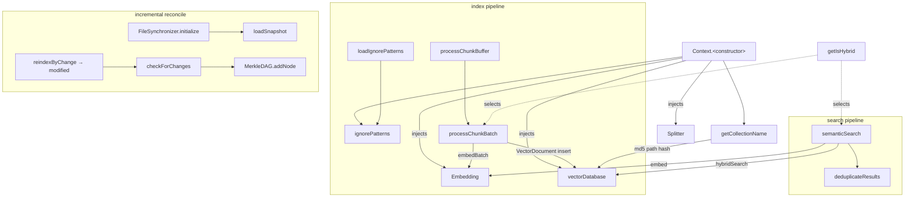

# Context — the index/search orchestrator (splitter + embedding + vectordb + sync)

<!-- connect:up:begin -->
> **Cross-repo concept:** part of [incremental-reconcile](../../../concepts/incremental-reconcile.md) across this wiki's repos.
<!-- connect:up:end -->
## Overview
`Context` is claude-context's hub: the single class that turns a codebase into a semantically
searchable index and answers queries against it. It owns none of the hard work itself — it holds
four injected collaborators (a [`Splitter`](../catalog/packages/core/src/splitter/index.ts.md#Splitter)
that chunks code, an [`Embedding`](../catalog/packages/core/src/embedding/base-embedding.ts.md#Embedding)
provider that vectorizes text, a [`VectorDatabase`](../catalog/packages/core/src/vectordb/types.ts.md#VectorDatabase)
that stores and searches, and a per-collection `FileSynchronizer` for change detection) and wires
them into two pipelines: **index** (files → chunks → embeddings → vector documents) and **search**
(query → embedding → vector search → dedup). The single design idea is *substrate independence via
interfaces plus one unified pipeline* — every provider is swapped through a constructor config, and a
single boolean, [`getIsHybrid`](../catalog/packages/core/src/context.ts.md#Context.getIsHybrid), selects
dense-only vs. dense+sparse (BM25) behavior at both write and read time. Unlike SCIP- or call-graph-based
tools, the grounding substrate here is **embeddings + approximate-nearest-neighbor search**, not a symbol graph.

## Diagram

## Design rationale (why it's built this way)
The class is built around **dependency injection of interfaces**, not concrete providers. The
constructor ([`<constructor>`](../catalog/packages/core/src/context.ts.md#Context.-constructor)) takes a
config and defaults the embedding to `OpenAIEmbedding` and the splitter to `AstCodeSplitter(2500, 300)`,
but it *requires* a [`vectorDatabase`](../catalog/packages/core/src/context.ts.md#Context.vectorDatabase)
to be supplied — it throws otherwise. This is why the same `Context` runs against Milvus-gRPC or
Milvus-REST, and against OpenAI, Ollama, Gemini, or VoyageAI embeddings, with no code change: the
[`Embedding`](../catalog/packages/core/src/embedding/base-embedding.ts.md#Embedding) base class (documented
"Abstract base class for embedding implementations") and the
[`VectorDatabase`](../catalog/packages/core/src/vectordb/types.ts.md#VectorDatabase) interface are the
only contracts the pipeline knows about. The host application assembles the concrete graph — e.g. the
VS Code extension's [`createContextWithConfig`](../catalog/packages/vscode-extension/src/extension.ts.md#createContextWithConfig)
reads user settings, constructs a Milvus REST DB and a chosen splitter, and hands them to `new Context(...)`.

The second decision is a **single hybrid flag** rather than two code paths.
[`getIsHybrid`](../catalog/packages/core/src/context.ts.md#Context.getIsHybrid) reads `HYBRID_MODE` from
the environment and *defaults to true* (its docstring: "Get isHybrid setting from environment variable
with default true"). That one boolean fans out everywhere: the collection name
([`getCollectionName`](../catalog/packages/core/src/context.ts.md#Context.getCollectionName)) is prefixed
`hybrid_code_chunks` vs. `code_chunks`, writes go to `insertHybrid` vs. `insert`, and reads go to a
two-field `hybridSearch` vs. a single-vector `search`. Keeping dense and sparse retrieval as *the same
pipeline with a switch* is why the index written in one mode must be read in the same mode — the collection
name itself encodes the choice, so a hybrid index and a dense index are physically distinct collections.

> [!inferred]
> The default embedding model is `text-embedding-3-small` and the default AST chunk size is 2500 chars
> with 300 overlap (visible in the constructor source). These are the out-of-the-box grounding
> parameters; the design lets a caller override every one, so treat them as defaults, not invariants.

## Entry points
- [`<constructor>`](../catalog/packages/core/src/context.ts.md#Context.-constructor) — the assembly point.
  Reached once when a host (CLI, MCP server, or the VS Code
  [`createContextWithConfig`](../catalog/packages/vscode-extension/src/extension.ts.md#createContextWithConfig))
  builds the object. It resolves the embedding/splitter defaults, hard-requires a
  [`vectorDatabase`](../catalog/packages/core/src/context.ts.md#Context.vectorDatabase), and seeds the
  base ignore patterns and supported extensions from config + environment.
- [`semanticSearch`](../catalog/packages/core/src/context.ts.md#Context.semanticSearch) — the query
  entry, documented "Semantic search with unified implementation." Reached per user query (e.g. the VS
  Code [`execute`](../catalog/packages/vscode-extension/src/commands/searchCommand.ts.md#SearchCommand.execute)
  search command calls it); returns ranked, deduplicated code spans.
- [`modified`](../catalog/packages/core/src/context.ts.md#Context.reindexByChange.Promise.typeLiteral121.modified) —
  the `{ added, removed, modified }` result of `reindexByChange`, the incremental-index entry. Reached
  when a caller asks to bring an already-indexed codebase up to date; it drives
  [`checkForChanges`](../catalog/packages/core/src/sync/synchronizer.ts.md#FileSynchronizer.checkForChanges)
  and re-embeds only the delta.
- [`processChunkBatch`](../catalog/packages/core/src/context.ts.md#Context.processChunkBatch) — the write
  end of the index pipeline ("Process a batch of chunks"), reached once per accumulated buffer during a
  full or incremental index.

## Mechanism (step-by-step)
1. **Assemble collaborators.** The [`<constructor>`](../catalog/packages/core/src/context.ts.md#Context.-constructor)
   stores the injected [`vectorDatabase`](../catalog/packages/core/src/context.ts.md#Context.vectorDatabase),
   defaults the [`Embedding`](../catalog/packages/core/src/embedding/base-embedding.ts.md#Embedding) and
   [`Splitter`](../catalog/packages/core/src/splitter/index.ts.md#Splitter), and merges default +
   config + environment extensions and ignore patterns into
   [`ignorePatterns`](../catalog/packages/core/src/context.ts.md#Context.ignorePatterns). Provider
   secrets (`OPENAI_API_KEY`, `MILVUS_ADDRESS`, `HYBRID_MODE`, …) are read through the shared
   [`envManager`](../catalog/packages/core/src/utils/env-manager.ts.md#envManager) via its
   [`get`](../catalog/packages/core/src/utils/env-manager.ts.md#EnvManager.get), which falls back from
   `process.env` to a `.env` file.
2. **Resolve the collection.** Every operation first computes a stable target via
   [`getCollectionName`](../catalog/packages/core/src/context.ts.md#Context.getCollectionName): an md5
   hash of the resolved codebase path, prefixed by the hybrid mode from
   [`getIsHybrid`](../catalog/packages/core/src/context.ts.md#Context.getIsHybrid). The path hash is
   *always* appended (even under a name override) so that several codebases indexed by one MCP server
   can never collapse into the same collection. This is the key that ties a filesystem location to its
   vector store.
3. **Chunk and embed (index write).** For a full index, files are streamed through the splitter into a
   buffer that, once full, is drained by
   [`processChunkBuffer`](../catalog/packages/core/src/context.ts.md#Context.processChunkBuffer) into
   [`processChunkBatch`](../catalog/packages/core/src/context.ts.md#Context.processChunkBatch). That
   method calls [`embedBatch`](../catalog/packages/core/src/embedding/base-embedding.ts.md#Embedding.embedBatch)
   once per batch to turn each [`CodeChunk`](../catalog/packages/core/src/splitter/index.ts.md#CodeChunk)'s
   [`content`](../catalog/packages/core/src/splitter/index.ts.md#CodeChunk.content) into an
   [`EmbeddingVector`](../catalog/packages/core/src/embedding/base-embedding.ts.md#EmbeddingVector),
   then builds one [`VectorDocument`](../catalog/packages/core/src/vectordb/types.ts.md#VectorDocument)
   per chunk carrying the dense vector, the raw text (for BM25/sparse), the codebase-relative path, and
   line span. Batching amortizes the embedding API round-trip, which is the pipeline's slowest step.
4. **Persist to the store.** In hybrid mode `processChunkBatch` writes with `insertHybrid`
   (both [Milvus gRPC](../catalog/packages/core/src/vectordb/milvus-vectordb.ts.md#MilvusVectorDatabase.insertHybrid)
   and [REST](../catalog/packages/core/src/vectordb/milvus-restful-vectordb.ts.md#MilvusRestfulVectorDatabase.insertHybrid)
   implement it) so both the dense `vector` and the text `content` land in one row; in dense mode it uses
   plain [`insert`](../catalog/packages/core/src/vectordb/milvus-restful-vectordb.ts.md#MilvusRestfulVectorDatabase.insert).
   The REST implementations serialize the request through
   [`makeRequest`](../catalog/packages/core/src/vectordb/milvus-restful-vectordb.ts.md#MilvusRestfulVectorDatabase.makeRequest)
   to the Milvus HTTP API.
5. **Search.** [`semanticSearch`](../catalog/packages/core/src/context.ts.md#Context.semanticSearch)
   resolves the collection, confirms it exists, and embeds the query text with
   [`embed`](../catalog/packages/core/src/embedding/base-embedding.ts.md#Embedding.embed). In hybrid mode
   it issues two parallel retrieval requests — a dense one over the `vector` field and a sparse one over
   `sparse_vector` carrying the raw query text — to
   [`hybridSearch`](../catalog/packages/core/src/vectordb/types.ts.md#VectorDatabase.hybridSearch)
   (the Milvus [REST impl](../catalog/packages/core/src/vectordb/milvus-restful-vectordb.ts.md#MilvusRestfulVectorDatabase.hybridSearch)
   fuses them with RRF reranking, `k=100`). In dense-only mode it falls back to single-vector
   [`search`](../catalog/packages/core/src/vectordb/milvus-restful-vectordb.ts.md#MilvusRestfulVectorDatabase.search).
6. **Deduplicate results.** Both branches map hits into `SemanticSearchResult`s and pass them through
   [`deduplicateResults`](../catalog/packages/core/src/context.ts.md#Context.deduplicateResults), which
   drops any result whose line range overlaps an already-kept result from the same file by more than
   50% ("Keeps higher-scored result when two results from the same file overlap"). This is what stops a
   dense hit and a sparse hit on the same function from being returned twice.
7. **Incremental reconcile.** `reindexByChange` (whose result type is
   [`modified`](../catalog/packages/core/src/context.ts.md#Context.reindexByChange.Promise.typeLiteral121.modified))
   looks up (or lazily rebuilds) the per-collection `FileSynchronizer`, then calls
   [`checkForChanges`](../catalog/packages/core/src/sync/synchronizer.ts.md#FileSynchronizer.checkForChanges).
   The synchronizer compares a freshly built Merkle DAG against the stored snapshot and, only if the DAG
   root moved, does a file-level diff. `Context` then deletes the chunks of removed + modified files and
   re-runs the chunk-and-embed pipeline over added + modified files — the same
   [`processChunkBatch`](../catalog/packages/core/src/context.ts.md#Context.processChunkBatch) path, but
   over the delta only.

## Key data structures
- [`CodeChunk`](../catalog/packages/core/src/splitter/index.ts.md#CodeChunk) — the splitter's output
  unit: a [`content`](../catalog/packages/core/src/splitter/index.ts.md#CodeChunk.content) string plus
  [`metadata`](../catalog/packages/core/src/splitter/index.ts.md#CodeChunk.metadata) holding
  [`startLine`](../catalog/packages/core/src/splitter/index.ts.md#CodeChunk.metadata.typeLiteral52.startLine),
  [`endLine`](../catalog/packages/core/src/splitter/index.ts.md#CodeChunk.metadata.typeLiteral52.endLine),
  [`language`](../catalog/packages/core/src/splitter/index.ts.md#CodeChunk.metadata.typeLiteral52.language),
  and [`filePath`](../catalog/packages/core/src/splitter/index.ts.md#CodeChunk.metadata.typeLiteral52.filePath).
  It is the only structure crossing the splitter→context boundary.
- [`EmbeddingVector`](../catalog/packages/core/src/embedding/base-embedding.ts.md#EmbeddingVector) —
  `{ vector: number[]; dimension: number }`, the dense representation every provider returns and the
  thing the vector DB indexes for cosine similarity.
- [`VectorDocument`](../catalog/packages/core/src/vectordb/types.ts.md#VectorDocument) — the persisted
  row: id, dense `vector`, raw `content` (doubling as the BM25 source), `relativePath`, line span, and a
  JSON `metadata` bag. This is the storage schema the whole system retrieves against.
- [`ignorePatterns`](../catalog/packages/core/src/context.ts.md#Context.ignorePatterns) — the effective
  ignore set, recomputed per index run by
  [`loadIgnorePatterns`](../catalog/packages/core/src/context.ts.md#Context.loadIgnorePatterns) from base
  patterns + `.xxxignore` files + a global `~/.context/.contextignore`.

## Dynamics (design intent)
The index write path is intentionally **streaming and batched**: chunks accumulate in a buffer and are
flushed through [`processChunkBuffer`](../catalog/packages/core/src/context.ts.md#Context.processChunkBuffer)
→ [`processChunkBatch`](../catalog/packages/core/src/context.ts.md#Context.processChunkBatch), so a large
codebase is embedded in bounded-size batches rather than one giant call. The abort and embedding-error
tests (`context.abort.test.ts`, `context.embedding-error.test.ts`) exercise this seam by substituting a
test [`Embedding`](../catalog/packages/core/src/embedding/base-embedding.ts.md#Embedding) whose
[`embedBatch`](../catalog/packages/core/src/embedding/base-embedding.ts.md#Embedding.embedBatch) throws or
returns too few vectors — confirming the design intent that an embedding failure surfaces (with the batch
size) rather than silently corrupting the index. The splitter tests (`context.splitter.test.ts`) inject a
recording [`Splitter`](../catalog/packages/core/src/splitter/index.ts.md#Splitter) to assert that
per-request splitters are honored, and the ignore-patterns tests confirm
[`ignorePatterns`](../catalog/packages/core/src/context.ts.md#Context.ignorePatterns) resolution.
Synchronizer bootstrap is ordered: [`initialize`](../catalog/packages/core/src/sync/synchronizer.ts.md#FileSynchronizer.initialize)
calls [`loadSnapshot`](../catalog/packages/core/src/sync/synchronizer.ts.md#FileSynchronizer.loadSnapshot)
(rebuilding from scratch on a missing snapshot) before any
[`checkForChanges`](../catalog/packages/core/src/sync/synchronizer.ts.md#FileSynchronizer.checkForChanges)
can run.

## Edge cases
- **Mode mismatch is silent-by-collection.** Because [`getIsHybrid`](../catalog/packages/core/src/context.ts.md#Context.getIsHybrid)
  is baked into [`getCollectionName`](../catalog/packages/core/src/context.ts.md#Context.getCollectionName),
  flipping `HYBRID_MODE` after indexing points `semanticSearch` at a *different* collection — the old
  index isn't read, and search returns empty rather than erroring.
- **Missing collection returns empty, not an error.** [`semanticSearch`](../catalog/packages/core/src/context.ts.md#Context.semanticSearch)
  checks `hasCollection` up front and returns `[]` with a "please index first" log if absent.
- **Synchronizer recreated on demand.** `reindexByChange` (result
  [`modified`](../catalog/packages/core/src/context.ts.md#Context.reindexByChange.Promise.typeLiteral121.modified))
  lazily rebuilds a `FileSynchronizer` via its
  [`<constructor>`](../catalog/packages/core/src/sync/synchronizer.ts.md#FileSynchronizer.-constructor)
  and [`initialize`](../catalog/packages/core/src/sync/synchronizer.ts.md#FileSynchronizer.initialize) if
  the in-memory map has none — so incremental indexing survives a process restart, reading the snapshot
  from disk.
- **Overlapping hits are collapsed.** [`deduplicateResults`](../catalog/packages/core/src/context.ts.md#Context.deduplicateResults)
  can hide a legitimately distinct nearby span if it overlaps a higher-scored result by >50% of its own
  length.

## Open questions
- The full `indexCodebase` / `processFileList` orchestration (streaming buffer, `EMBEDDING_BATCH_SIZE`,
  the 450k `CHUNK_LIMIT`, cooperative abort) lives in `context.ts` but those exact symbols are not in
  this packet's Subgraph; they are visible in source but should be cited from their own catalog entries.
- The Merkle DAG comparison internals (`MerkleDAG.compare`, `buildMerkleDAG`, `generateFileHashes`) sit
  in `sync/merkle.ts` / `synchronizer.ts`; only [`addNode`](../catalog/packages/core/src/sync/merkle.ts.md#MerkleDAG.addNode)
  is in this Subgraph, so the change-detection algorithm is best read on the synchronizer's own page.

## See also
- The AST splitter concept page (`AstCodeSplitter` — tree-sitter, per-language chunking) — the
  multi-language-extraction substrate `Context` drives.
- The `FileSynchronizer` / Merkle concept page — the incremental-reconcile mechanism behind
  `reindexByChange`.
- The Milvus vector-database concept pages (REST and gRPC) — the storage/retrieval backends behind the
  [`VectorDatabase`](../catalog/packages/core/src/vectordb/types.ts.md#VectorDatabase) interface.
- The embedding-provider concept pages (OpenAI / Ollama / Gemini / VoyageAI) — implementations of the
  [`Embedding`](../catalog/packages/core/src/embedding/base-embedding.ts.md#Embedding) contract.
