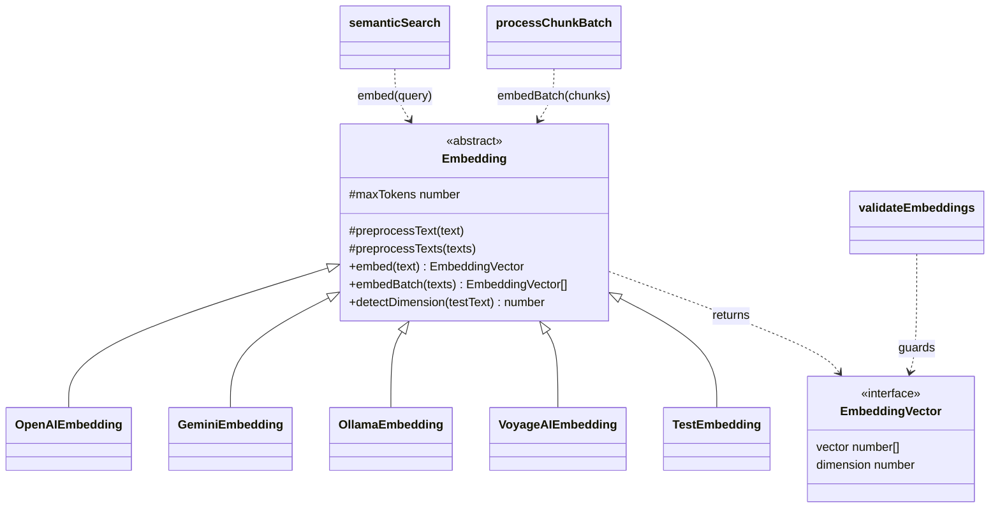

# The Embedding base class — provider-neutral grounding contract

## Overview
claude-context grounds code search on **dense embeddings + a vector store**, not on a symbol graph or
SCIP index. The [`Embedding`](../catalog/packages/core/src/embedding/base-embedding.ts.md#Embedding)
abstract base class is the seam that makes that substrate provider-neutral: it fixes one uniform return
type, [`EmbeddingVector`](../catalog/packages/core/src/embedding/base-embedding.ts.md#EmbeddingVector)
(`{ vector: number[]; dimension: number }`), and one small method contract —
[`embed`](../catalog/packages/core/src/embedding/base-embedding.ts.md#Embedding.embed) for a single
text and [`embedBatch`](../catalog/packages/core/src/embedding/base-embedding.ts.md#Embedding.embedBatch)
for a batch — that every concrete provider must satisfy. The single key idea is a thin base that owns
the *one* behavior which must be identical across providers (text preprocessing / truncation) and
leaves the actual API call abstract, so the rest of the pipeline holds a single
[`embedding`](../catalog/packages/core/src/context.ts.md#Context.embedding) field and never knows
whether OpenAI, Gemini, Ollama, or VoyageAI is behind it.

## Diagram

## Design rationale (why it's built this way)
The base class is deliberately minimal. Only two things are *concrete* on it —
[`preprocessText`](../catalog/packages/core/src/embedding/base-embedding.ts.md#Embedding.preprocessText)
and its batch wrapper
[`preprocessTexts`](../catalog/packages/core/src/embedding/base-embedding.ts.md#Embedding.preprocessTexts)
— because text hygiene is the one step that must behave the same no matter which provider fulfils the
request. Its docstring states the intent plainly: *"Preprocess text to ensure it's valid for
embedding."* Two failure modes are handled without a tokenizer dependency: an empty string is replaced
with a single space (embedding APIs reject empty input), and over-long text is truncated at
`maxTokens * 4` characters — the author's own comment calls this a *"Simple character-based truncation
(approximation)"* on the assumption that *"Each token is roughly 4 characters on average for English
text"* ([base-embedding.ts:24-28](../../../../raw/code/claude-context/packages/core/src/embedding/base-embedding.ts#L24)).
That approximation trades exactness for zero per-provider tokenizer code.

Everything provider-specific is abstract. Each subclass declares its own
[`maxTokens`](../catalog/packages/core/src/embedding/base-embedding.ts.md#Embedding.maxTokens) context
window (`protected abstract`), so the *shared* truncation logic reads a *provider-supplied* bound —
inheritance parameterizes the one concrete method. The dimension of the output vector is likewise not
fixed on the base: it is discovered per provider through
[`detectDimension`](../catalog/packages/core/src/embedding/openai-embedding.ts.md#OpenAIEmbedding.detectDimension)
(*"Detect embedding dimension"*), because the same interface has to span 768-dim local models and
3072-dim cloud models.

> [!inferred]
> Returning a self-describing `EmbeddingVector` (each vector carries its own `dimension`) rather than a
> bare `number[]` lets downstream code — the vector store schema, the `validateEmbeddings` guard —
> assert on dimension without re-consulting the provider. This is a reading of the type shape, not an
> explicit comment.

## Entry points
- [`embedding`](../catalog/packages/core/src/context.ts.md#Context.embedding) — the single
  `Context`-held provider instance (`private embedding: Embedding`). It is the runtime binding of the
  abstraction; it can be read via
  [`getEmbedding`](../catalog/packages/core/src/context.ts.md#Context.getEmbedding) and hot-swapped via
  [`updateEmbedding`](../catalog/packages/core/src/context.ts.md#Context.updateEmbedding), which logs
  the new provider name. It is originally supplied through the optional
  [`embedding`](../catalog/packages/core/src/context.ts.md#ContextConfig.embedding) config field.
- [`semanticSearch`](../catalog/packages/core/src/context.ts.md#Context.semanticSearch) — the **query
  path**. When an agent searches, this method embeds the query string through the base contract to get a
  dense query vector, then hands that vector to the vector database. This is where `embed` is reached at
  read time.
- [`processChunkBatch`](../catalog/packages/core/src/context.ts.md#Context.processChunkBatch) — the
  **indexing path**. During ingest each batch of code chunks is embedded through
  [`embedBatch`](../catalog/packages/core/src/embedding/base-embedding.ts.md#Embedding.embedBatch)
  before the vectors are written to the store. This is where the batch contract is reached at write
  time.
- The four concrete providers —
  [`OpenAIEmbedding`](../catalog/packages/core/src/embedding/openai-embedding.ts.md#OpenAIEmbedding),
  [`GeminiEmbedding`](../catalog/packages/core/src/embedding/gemini-embedding.ts.md#GeminiEmbedding),
  [`OllamaEmbedding`](../catalog/packages/core/src/embedding/ollama-embedding.ts.md#OllamaEmbedding),
  and [`VoyageAIEmbedding`](../catalog/packages/core/src/embedding/voyageai-embedding.ts.md#VoyageAIEmbedding)
  — are the leaf entry points where a real API call is finally issued.

## Mechanism (step-by-step)
1. **Bind one provider.** `Context` stores exactly one
   [`embedding`](../catalog/packages/core/src/context.ts.md#Context.embedding) of static type
   `Embedding`. All embedding work flows through this field via virtual dispatch on
   [`embed`](../catalog/packages/core/src/embedding/base-embedding.ts.md#Embedding.embed) /
   [`embedBatch`](../catalog/packages/core/src/embedding/base-embedding.ts.md#Embedding.embedBatch);
   the caller is compiled against the base, so adding a provider needs no change to `Context`.
2. **Preprocess before every API call.** Each concrete `embed`/`embedBatch` opens by routing its input
   through [`preprocessText`](../catalog/packages/core/src/embedding/base-embedding.ts.md#Embedding.preprocessText)
   (or [`preprocessTexts`](../catalog/packages/core/src/embedding/base-embedding.ts.md#Embedding.preprocessTexts)
   for batches). Every provider does this first — see the OpenAI
   [`embed`](../catalog/packages/core/src/embedding/openai-embedding.ts.md#OpenAIEmbedding.embed) and
   VoyageAI [`embed`](../catalog/packages/core/src/embedding/voyageai-embedding.ts.md#VoyageAIEmbedding.embed)
   — so the empty-string and truncation guards run uniformly regardless of provider. Truncation reads
   the subclass's own [`maxTokens`](../catalog/packages/core/src/embedding/base-embedding.ts.md#Embedding.maxTokens).
3. **Resolve the output dimension.** Providers differ sharply here. OpenAI's
   [`embed`](../catalog/packages/core/src/embedding/openai-embedding.ts.md#OpenAIEmbedding.embed) looks
   the model up in a static table via
   [`getSupportedModels`](../catalog/packages/core/src/embedding/openai-embedding.ts.md#OpenAIEmbedding.getSupportedModels)
   and only calls [`detectDimension`](../catalog/packages/core/src/embedding/openai-embedding.ts.md#OpenAIEmbedding.detectDimension)
   for unknown models; it then overwrites its
   [`dimension`](../catalog/packages/core/src/embedding/openai-embedding.ts.md#OpenAIEmbedding.dimension)
   from the actual response length. Ollama's
   [`embed`](../catalog/packages/core/src/embedding/ollama-embedding.ts.md#OllamaEmbedding.embed)
   instead **lazily probes on first use**, gated by the
   [`dimensionDetected`](../catalog/packages/core/src/embedding/ollama-embedding.ts.md#OllamaEmbedding.dimensionDetected)
   flag and its own [`detectDimension`](../catalog/packages/core/src/embedding/ollama-embedding.ts.md#OllamaEmbedding.detectDimension),
   because a local Ollama model's dimension is not known ahead of time. Gemini and VoyageAI treat
   `detectDimension` as a no-op that returns the model-table value; Gemini additionally honours an
   [`outputDimensionality`](../catalog/packages/core/src/embedding/gemini-embedding.ts.md#GeminiEmbeddingConfig.outputDimensionality)
   override.
4. **Issue the provider call and normalize.** Each provider hits its SDK and maps the raw response into
   the uniform [`EmbeddingVector`](../catalog/packages/core/src/embedding/base-embedding.ts.md#EmbeddingVector)
   shape. Gemini isolates the single-text call in a private
   [`embedProcessedText`](../catalog/packages/core/src/embedding/gemini-embedding.ts.md#GeminiEmbedding.embedProcessedText)
   helper that its [`embed`](../catalog/packages/core/src/embedding/gemini-embedding.ts.md#GeminiEmbedding.embed)
   wraps; its [`embedBatch`](../catalog/packages/core/src/embedding/gemini-embedding.ts.md#GeminiEmbedding.embedBatch)
   sends the array in one request and asserts the returned count matches. Ollama's
   [`embedBatch`](../catalog/packages/core/src/embedding/ollama-embedding.ts.md#OllamaEmbedding.embedBatch)
   uses the native batch API; VoyageAI's
   [`embedBatch`](../catalog/packages/core/src/embedding/voyageai-embedding.ts.md#VoyageAIEmbedding.embedBatch)
   maps each returned item and rejects any missing embedding. Every path returns the same
   `{ vector, dimension }` regardless of the wildly different SDK response shapes.
5. **Validate the batch before it is stored.** Back in the indexing path,
   [`processChunkBatch`](../catalog/packages/core/src/context.ts.md#Context.processChunkBatch) wraps the
   `embedBatch` call in a try/catch (re-throwing as an `EmbeddingError` with the batch size), then runs
   [`validateEmbeddings`](../catalog/packages/core/src/context.ts.md#Context.validateEmbeddings). That
   guard — *"Validate that the embedding batch response is well-formed before writing"* — enforces the
   invariants the type alone can't: the result is an array, its length equals the chunk count, and no
   vector is empty. Only then are the `EmbeddingVector` vectors zipped with their chunks into the store.

## Key data structures
- **`EmbeddingVector`** — the whole contract's currency:
  [`vector: number[]` and `dimension: number`](../catalog/packages/core/src/embedding/base-embedding.ts.md#EmbeddingVector).
  Making the vector self-describe its dimension is what lets `validateEmbeddings` and the vector store
  reason about shape without a back-channel to the provider.
- **`maxTokens`** — the [`protected abstract maxTokens`](../catalog/packages/core/src/embedding/base-embedding.ts.md#Embedding.maxTokens)
  each subclass sets (OpenAI 8192, Gemini/Ollama defaults 2048, VoyageAI 32000). It is the only state
  the base's concrete preprocessing reads, so the shared truncation is really *parameterized* per
  provider.
- **Provider `dimension` / `config` fields** — each subclass carries a mutable `dimension` (e.g.
  [OpenAI](../catalog/packages/core/src/embedding/openai-embedding.ts.md#OpenAIEmbedding.dimension),
  [Ollama](../catalog/packages/core/src/embedding/ollama-embedding.ts.md#OllamaEmbedding.dimension),
  [Gemini](../catalog/packages/core/src/embedding/gemini-embedding.ts.md#GeminiEmbedding.dimension),
  [VoyageAI](../catalog/packages/core/src/embedding/voyageai-embedding.ts.md#VoyageAIEmbedding.dimension))
  updated as the true dimension becomes known, plus a `config` object holding the
  [model](../catalog/packages/core/src/embedding/openai-embedding.ts.md#OpenAIEmbeddingConfig.model) and
  credentials. Ollama additionally keeps a
  [`client`](../catalog/packages/core/src/embedding/ollama-embedding.ts.md#OllamaEmbedding.client) and a
  [`keepAlive`](../catalog/packages/core/src/embedding/ollama-embedding.ts.md#OllamaEmbeddingConfig.keepAlive)
  hint for its local server.

## Dynamics (design intent)
The consumers are split by lifecycle: the read path
([`semanticSearch`](../catalog/packages/core/src/context.ts.md#Context.semanticSearch)) embeds exactly
one query per search, while the write path
([`processChunkBatch`](../catalog/packages/core/src/context.ts.md#Context.processChunkBatch)) embeds
whole batches — which is why `embedBatch` exists as a first-class contract method rather than a loop
over `embed`: Ollama, Gemini and VoyageAI all send the batch in a single API call.
[`validateEmbeddings`](../catalog/packages/core/src/context.ts.md#Context.validateEmbeddings) encodes an
ordering invariant — `embeddings[i]` must align positionally with `chunks[i]` — so a short or partial
batch is treated as a hard failure rather than silently mis-stored. The tests confirm the abstraction
is honored by construction: every one of the four suites defines a `TestEmbedding` that
`extends Embedding` and returns a fixed `{ vector: [1,0,0], dimension: 3 }`, letting the indexing and
search logic be exercised with no network at all
([splitter](../catalog/packages/core/src/context.splitter.test.ts.md#TestEmbedding),
[abort](../catalog/packages/core/src/context.abort.test.ts.md#TestEmbedding),
[ignore-patterns](../catalog/packages/core/src/context.ignore-patterns.test.ts.md#TestEmbedding)).

## Edge cases
- **Empty input** — [`preprocessText`](../catalog/packages/core/src/embedding/base-embedding.ts.md#Embedding.preprocessText)
  converts `''` to `' '` before any provider sees it, because embedding APIs reject empty strings.
- **Over-long input** — the same method truncates at `maxTokens * 4` chars. This is an *approximation*,
  not a real token count, so a text that is dense in multi-byte or sub-4-char tokens can still exceed the
  provider's true limit after truncation.
- **Unknown / custom models** — OpenAI and Ollama fall back to a live
  [`detectDimension`](../catalog/packages/core/src/embedding/openai-embedding.ts.md#OpenAIEmbedding.detectDimension)
  API probe; Gemini/VoyageAI do not probe and simply return the configured value, so a mis-configured
  custom dimension there is not caught until the vector store schema rejects it.
- **Malformed provider response** — a null/partial batch or an empty vector is caught by
  [`validateEmbeddings`](../catalog/packages/core/src/context.ts.md#Context.validateEmbeddings), which
  raises rather than writing corrupt vectors that would poison search for that chunk's file.

## Open questions
- The base class also declares two abstract methods — a dimension getter and a provider-name getter —
  that are implemented by every subclass and the `TestEmbedding` doubles, but they are **not in this
  packet's subgraph**, so they are not cited here. `updateEmbedding`'s log line reads the provider name
  through one of them; a fuller treatment would surface both.
- Where `Context` first constructs the default provider (the packet shows `OpenAIEmbedding` imported
  into `context.ts`)
  and how CLI/MCP configuration selects among the four providers is out of scope for this page.

## See also
- The concrete provider pages — `OpenAIEmbedding`, `GeminiEmbedding`, `OllamaEmbedding`,
  `VoyageAIEmbedding` — for per-provider API and dimension handling.
- The indexing pipeline concept (`processChunkBatch` / vector store) for how `EmbeddingVector` batches
  become stored documents.
- The semantic-search concept (`semanticSearch`) for how the query vector is used against the vector
  database.
</content>
</invoke>
