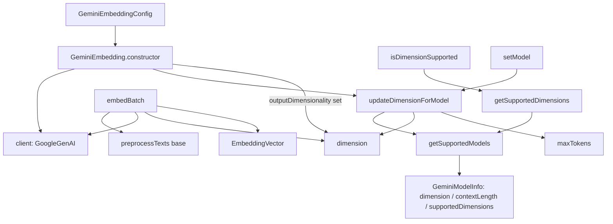

# Gemini embedding provider — Matryoshka dimensions over the shared Embedding contract

## Overview
This is one of claude-context's pluggable **grounding substrates**: the component that turns a chunk of
code (or a search query) into the dense vector the pipeline later stores and searches. It is a thin
Google-GenAI adapter — [`GeminiEmbedding`](../catalog/packages/core/src/embedding/gemini-embedding.ts.md#GeminiEmbedding)
extends the abstract [`Embedding`](../catalog/packages/core/src/embedding/base-embedding.ts.md#Embedding)
base and inherits the entire shared contract (text preprocessing, the `EmbeddingVector` shape, the
`embed`/`embedBatch` method surface); everything genuinely *Gemini-specific* is dimension bookkeeping.
The single interesting design idea here is **Matryoshka Representation Learning**: Gemini's embedding
models emit a 3072-d vector that can be truncated to 1536, 768, or 256 dims and still be usable, so this
provider spends most of its code deciding which dimension to request and validating that the number is
one the model actually supports.

## Diagram

## Design rationale (why it's built this way)
**Dimension is derived, not trusted.** A caller supplies only a model name and an optional
`outputDimensionality`; the provider looks up the *authoritative* dimension and context window from a
static registry rather than accepting whatever the caller passes.
[`getSupportedModels`](../catalog/packages/core/src/embedding/gemini-embedding.ts.md#GeminiEmbedding.getSupportedModels)
is that registry — a hard-coded `Record` mapping `gemini-embedding-001` and `gemini-embedding-2` to a
[`GeminiModelInfo`](../catalog/packages/core/src/embedding/gemini-embedding.ts.md#GeminiModelInfo) record
of [`dimension`](../catalog/packages/core/src/embedding/gemini-embedding.ts.md#GeminiModelInfo.typeLiteral1.dimension),
[`contextLength`](../catalog/packages/core/src/embedding/gemini-embedding.ts.md#GeminiModelInfo.typeLiteral1.contextLength),
[`description`](../catalog/packages/core/src/embedding/gemini-embedding.ts.md#GeminiModelInfo.typeLiteral1.description),
and the Matryoshka
[`supportedDimensions`](../catalog/packages/core/src/embedding/gemini-embedding.ts.md#GeminiModelInfo.typeLiteral1.supportedDimensions)
list `[3072, 1536, 768, 256]`. The author's inline comment names the mechanism explicitly —
`// Matryoshka Representation Learning support` — which is why a shorter dimension is a valid truncation
of the full vector, not a different model.

**Provider-specific config, shared vector shape.**
[`GeminiEmbeddingConfig`](../catalog/packages/core/src/embedding/gemini-embedding.ts.md#GeminiEmbeddingConfig)
carries the four knobs this provider needs —
[`model`](../catalog/packages/core/src/embedding/gemini-embedding.ts.md#GeminiEmbeddingConfig.model),
[`apiKey`](../catalog/packages/core/src/embedding/gemini-embedding.ts.md#GeminiEmbeddingConfig.apiKey),
an optional [`baseURL`](../catalog/packages/core/src/embedding/gemini-embedding.ts.md#GeminiEmbeddingConfig.baseURL)
for a custom endpoint, and the optional dimension override
[`outputDimensionality`](../catalog/packages/core/src/embedding/gemini-embedding.ts.md#GeminiEmbeddingConfig.outputDimensionality).
But the *output* is the base contract's
[`EmbeddingVector`](../catalog/packages/core/src/embedding/base-embedding.ts.md#EmbeddingVector)
(`{ vector, dimension }`), identical to every sibling provider, so nothing downstream learns it is talking
to Gemini. Contrast the parallel implementations that satisfy the same base:
[`OpenAIEmbedding`](../catalog/packages/core/src/embedding/openai-embedding.ts.md#OpenAIEmbedding),
[`VoyageAIEmbedding`](../catalog/packages/core/src/embedding/voyageai-embedding.ts.md#VoyageAIEmbedding),
and [`OllamaEmbedding`](../catalog/packages/core/src/embedding/ollama-embedding.ts.md#OllamaEmbedding) —
each is a virtual override of the abstract
[`embedBatch`](../catalog/packages/core/src/embedding/base-embedding.ts.md#Embedding.embedBatch).

**No dynamic dimension probe.** Unlike Ollama (which detects its dimension on first call) and OpenAI's
custom-model path (which round-trips the API to measure the vector length), Gemini's dimensions are known
statically. The base declares `detectDimension` abstract, but here it just returns the configured
[`dimension`](../catalog/packages/core/src/embedding/gemini-embedding.ts.md#GeminiEmbedding.dimension) —
no network call.

> [!inferred]
> The lens asked about a Gemini "task type" knob. The code does **not** set one: `embedBatch` passes only
> `model`, `contents`, and `config.outputDimensionality` to the GenAI SDK — there is no `taskType` /
> `RETRIEVAL_DOCUMENT` vs `RETRIEVAL_QUERY` distinction, so documents and queries are embedded
> identically. See Open questions.

## Entry points
- [`<constructor>`](../catalog/packages/core/src/embedding/gemini-embedding.ts.md#GeminiEmbedding.-constructor)
  — reached when the pipeline instantiates the Gemini provider from a resolved config. It builds the
  [`client`](../catalog/packages/core/src/embedding/gemini-embedding.ts.md#GeminiEmbedding.client) (a
  `GoogleGenAI` instance, optionally pointed at a custom
  [`baseURL`](../catalog/packages/core/src/embedding/gemini-embedding.ts.md#GeminiEmbeddingConfig.baseURL)
  via `httpOptions`), then resolves dimensions before any embedding call.
- [`embedBatch`](../catalog/packages/core/src/embedding/gemini-embedding.ts.md#GeminiEmbedding.embedBatch)
  — the hot path. The indexer calls it with a batch of chunk texts and gets back one
  [`EmbeddingVector`](../catalog/packages/core/src/embedding/base-embedding.ts.md#EmbeddingVector) per
  input; this is the override of the base's abstract
  [`embedBatch`](../catalog/packages/core/src/embedding/base-embedding.ts.md#Embedding.embedBatch).
- [`getSupportedDimensions`](../catalog/packages/core/src/embedding/gemini-embedding.ts.md#GeminiEmbedding.getSupportedDimensions)
  and [`isDimensionSupported`](../catalog/packages/core/src/embedding/gemini-embedding.ts.md#GeminiEmbedding.isDimensionSupported)
  — introspection entry points a caller (or the test suite) hits to discover / validate the Matryoshka
  choices for the current model before committing a vector-store schema to a fixed width.
- [`setModel`](../catalog/packages/core/src/embedding/gemini-embedding.ts.md#GeminiEmbedding.setModel)
  — mutates the configured
  [`model`](../catalog/packages/core/src/embedding/gemini-embedding.ts.md#GeminiEmbeddingConfig.model) at
  runtime and re-derives dimension/context via `updateDimensionForModel`.

## Mechanism (step-by-step)
1. **Construct and resolve dimension.** The
   [`<constructor>`](../catalog/packages/core/src/embedding/gemini-embedding.ts.md#GeminiEmbedding.-constructor)
   stores the [`config`](../catalog/packages/core/src/embedding/gemini-embedding.ts.md#GeminiEmbedding.config),
   builds the `GoogleGenAI` [`client`](../catalog/packages/core/src/embedding/gemini-embedding.ts.md#GeminiEmbedding.client),
   then calls
   [`updateDimensionForModel`](../catalog/packages/core/src/embedding/gemini-embedding.ts.md#GeminiEmbedding.updateDimensionForModel)
   with `config.model || 'gemini-embedding-001'`. The instance fields
   [`dimension`](../catalog/packages/core/src/embedding/gemini-embedding.ts.md#GeminiEmbedding.dimension)
   (default 3072) and
   [`maxTokens`](../catalog/packages/core/src/embedding/gemini-embedding.ts.md#GeminiEmbedding.maxTokens)
   (default 2048) exist so a legal dimension is always present even before the lookup.
2. **Look up model metadata.**
   [`updateDimensionForModel`](../catalog/packages/core/src/embedding/gemini-embedding.ts.md#GeminiEmbedding.updateDimensionForModel)
   indexes the static registry from
   [`getSupportedModels`](../catalog/packages/core/src/embedding/gemini-embedding.ts.md#GeminiEmbedding.getSupportedModels)
   by model name. On a hit it copies the model's
   [`dimension`](../catalog/packages/core/src/embedding/gemini-embedding.ts.md#GeminiModelInfo.typeLiteral1.dimension)
   into the instance and its
   [`contextLength`](../catalog/packages/core/src/embedding/gemini-embedding.ts.md#GeminiModelInfo.typeLiteral1.contextLength)
   into [`maxTokens`](../catalog/packages/core/src/embedding/gemini-embedding.ts.md#GeminiEmbedding.maxTokens)
   (note `gemini-embedding-2` widens context to 8192 vs. 2048 for `-001`); on a miss it falls back to the
   3072/2048 defaults, so an unknown model still works rather than throwing.
3. **Apply the dimension override with defined precedence.** Back in the constructor, *after* the model
   lookup, if
   [`outputDimensionality`](../catalog/packages/core/src/embedding/gemini-embedding.ts.md#GeminiEmbeddingConfig.outputDimensionality)
   is set it overwrites
   [`dimension`](../catalog/packages/core/src/embedding/gemini-embedding.ts.md#GeminiEmbedding.dimension).
   The ordering is the contract: the model default is established first, then the explicit override wins —
   letting a caller request a Matryoshka-truncated 768-d vector while keeping the model's own context
   window.
4. **Preprocess before the API call.**
   [`embedBatch`](../catalog/packages/core/src/embedding/gemini-embedding.ts.md#GeminiEmbedding.embedBatch)
   short-circuits an empty input to `[]`, then runs every text through the inherited
   [`preprocessTexts`](../catalog/packages/core/src/embedding/base-embedding.ts.md#Embedding.preprocessTexts),
   which maps the base's
   [`preprocessText`](../catalog/packages/core/src/embedding/base-embedding.ts.md#Embedding.preprocessText)
   over the array — empty strings become a single space, and anything longer than
   [`maxTokens`](../catalog/packages/core/src/embedding/base-embedding.ts.md#Embedding.maxTokens)`* 4`
   characters is truncated (a crude 4-chars-per-token approximation). This truncation is shared across all
   providers; Gemini only supplies the `maxTokens` value.
5. **One batched API round-trip.**
   [`embedBatch`](../catalog/packages/core/src/embedding/gemini-embedding.ts.md#GeminiEmbedding.embedBatch)
   sends the whole processed array as `contents` in a *single*
   [`client`](../catalog/packages/core/src/embedding/gemini-embedding.ts.md#GeminiEmbedding.client)`.models.embedContent`
   call, passing `config.outputDimensionality || this.dimension` so the request width matches the resolved
   dimension. There is no client-side chunking loop here — the batch is however large the caller made it.
6. **Validate and shape the response.** The method rejects a missing `response.embeddings` and, crucially,
   asserts the returned count equals the input count (a guard against silent partial results), then maps
   each embedding into an
   [`EmbeddingVector`](../catalog/packages/core/src/embedding/base-embedding.ts.md#EmbeddingVector) whose
   `dimension` is read from the *actual* returned `values.length` rather than assumed. Any failure is
   re-wrapped as `Gemini batch embedding failed: …`.
7. **Introspect / validate dimensions on demand.**
   [`getSupportedDimensions`](../catalog/packages/core/src/embedding/gemini-embedding.ts.md#GeminiEmbedding.getSupportedDimensions)
   returns the current model's
   [`supportedDimensions`](../catalog/packages/core/src/embedding/gemini-embedding.ts.md#GeminiModelInfo.typeLiteral1.supportedDimensions)
   (or `[this.dimension]` for unknown models), and
   [`isDimensionSupported`](../catalog/packages/core/src/embedding/gemini-embedding.ts.md#GeminiEmbedding.isDimensionSupported)
   is a membership test over that list — the validation a caller runs before trusting a custom
   `outputDimensionality`.

## Key data structures
- [`GeminiEmbeddingConfig`](../catalog/packages/core/src/embedding/gemini-embedding.ts.md#GeminiEmbeddingConfig)
  — the provider's input surface: `model`, `apiKey`, optional `baseURL`, optional `outputDimensionality`.
- [`GeminiModelInfo`](../catalog/packages/core/src/embedding/gemini-embedding.ts.md#GeminiModelInfo)
  — one registry row: `dimension`, `contextLength`, `description`, optional `supportedDimensions`. The
  Matryoshka list lives here.
- Instance state:
  [`dimension`](../catalog/packages/core/src/embedding/gemini-embedding.ts.md#GeminiEmbedding.dimension)
  (the width every request/vector uses) and
  [`maxTokens`](../catalog/packages/core/src/embedding/gemini-embedding.ts.md#GeminiEmbedding.maxTokens)
  (the truncation budget, feeding the base's `preprocessText`).
- [`EmbeddingVector`](../catalog/packages/core/src/embedding/base-embedding.ts.md#EmbeddingVector) — the
  shared `{ vector, dimension }` output contract, defined by the base, not this provider.

## Dynamics (design intent)
The Evidence tests exercise the provider through the base contract: the sibling
`context.*.test.ts` suites all subclass
[`Embedding`](../catalog/packages/core/src/embedding/base-embedding.ts.md#Embedding) with a `TestEmbedding`
double and assert on
[`EmbeddingVector`](../catalog/packages/core/src/embedding/base-embedding.ts.md#EmbeddingVector) shape,
which is exactly how the pipeline consumes any provider — through the abstract seam, provider-agnostic.
The provider-specific unit test in
`gemini-embedding.test.ts`
mocks `@google/genai` and pins the metadata contract directly: it asserts
[`getSupportedModels`](../catalog/packages/core/src/embedding/gemini-embedding.ts.md#GeminiEmbedding.getSupportedModels)
exposes `gemini-embedding-2` with `dimension: 3072, contextLength: 8192`, that a constructed instance
reports 3072, and that
[`getSupportedDimensions`](../catalog/packages/core/src/embedding/gemini-embedding.ts.md#GeminiEmbedding.getSupportedDimensions)
contains both 3072 and 768 — i.e. the Matryoshka list is a tested invariant, and the batched request
behavior is asserted with a two-input mock returning two vectors.

## Edge cases
- **Unknown model name.** No throw —
  [`updateDimensionForModel`](../catalog/packages/core/src/embedding/gemini-embedding.ts.md#GeminiEmbedding.updateDimensionForModel)
  silently falls back to 3072/2048, and
  [`getSupportedDimensions`](../catalog/packages/core/src/embedding/gemini-embedding.ts.md#GeminiEmbedding.getSupportedDimensions)
  returns just `[this.dimension]`. A caller relying on a custom model gets defaults, not an error.
- **Override precedence surprise.** `outputDimensionality` is applied *after* the model lookup in the
  [`<constructor>`](../catalog/packages/core/src/embedding/gemini-embedding.ts.md#GeminiEmbedding.-constructor),
  and nothing checks it against
  [`isDimensionSupported`](../catalog/packages/core/src/embedding/gemini-embedding.ts.md#GeminiEmbedding.isDimensionSupported)
  — an out-of-Matryoshka value is sent to the API as-is; validation is opt-in, not enforced.
- **Count mismatch.**
  [`embedBatch`](../catalog/packages/core/src/embedding/gemini-embedding.ts.md#GeminiEmbedding.embedBatch)
  throws if the API returns a different number of embeddings than inputs, so a partial batch fails loudly
  rather than misaligning vectors with chunks downstream.
- **Empty batch.** Returns `[]` before touching the client, avoiding a needless API call.
- **Reported dimension is trusted from the wire.** Each output's `dimension` is `values.length` from the
  response, so if the API ignored the requested width the stored vector still self-describes its true size.

## Open questions
- **Task type.** The subgraph contains no `taskType`/`RETRIEVAL_QUERY` symbol and the source passes none;
  whether claude-context intends to distinguish query vs. document embeddings for Gemini (as some retrieval
  stacks do) is not answerable from this packet.
- **Batch size limits / rate limiting.** `embedBatch` issues one unbounded `embedContent` call; whether an
  upstream caller caps batch size or retries on Gemini rate limits is outside this packet's subgraph.
- **`setOutputDimensionality` / `getClient`.** The source shows these runtime mutators, but they are not in
  the subgraph, so their call sites and intended use are out of scope here.

## See also
- `base-embedding.ts` — the abstract
  [`Embedding`](../catalog/packages/core/src/embedding/base-embedding.ts.md#Embedding) contract this
  provider satisfies (shared `preprocessText`, `EmbeddingVector`, the abstract
  [`embedBatch`](../catalog/packages/core/src/embedding/base-embedding.ts.md#Embedding.embedBatch)).
- Sibling providers implementing the same seam:
  [`OpenAIEmbedding`](../catalog/packages/core/src/embedding/openai-embedding.ts.md#OpenAIEmbedding),
  [`VoyageAIEmbedding`](../catalog/packages/core/src/embedding/voyageai-embedding.ts.md#VoyageAIEmbedding),
  [`OllamaEmbedding`](../catalog/packages/core/src/embedding/ollama-embedding.ts.md#OllamaEmbedding) —
  compare their differing dimension-resolution strategies (static registry vs. dynamic probe).
