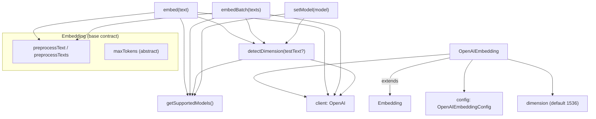

# OpenAI embedding provider

## Overview
[`OpenAIEmbedding`](../catalog/packages/core/src/embedding/openai-embedding.ts.md#OpenAIEmbedding) is the
concrete embedding provider that turns code/text chunks into vectors via OpenAI's `embeddings.create`
API — the grounding substrate claude-context searches against. It extends the shared
[`Embedding`](../catalog/packages/core/src/embedding/base-embedding.ts.md#Embedding) base class, so it
inherits the text-preprocessing/truncation contract and only supplies the OpenAI-specific pieces: a
static **model → dimension** table, a default model of `text-embedding-3-small`, an 8192-token budget,
and an optional `baseURL` override that lets it talk to OpenAI-compatible endpoints. The single
non-obvious design idea is that the embedding **dimension is treated as discovered, not fixed** — known
models resolve their dimension from a table, unknown ones are probed with a live API call, and every
real response corrects `dimension` from the actual vector length.

This page covers only what is provider-specific. The shared preprocessing/truncation contract
(`preprocessText`, `preprocessTexts`, the abstract method surface) lives on the base class — see
[base embedding contract](./packages-core-src-embedding-base-embedding.ts.md).

## Diagram

## Design rationale (why it's built this way)
The provider hard-codes a static
[`getSupportedModels`](../catalog/packages/core/src/embedding/openai-embedding.ts.md#OpenAIEmbedding.getSupportedModels)
table — `text-embedding-3-small` (1536), `text-embedding-3-large` (3072), and the legacy
`text-embedding-ada-002` (1536, flagged "use text-embedding-3-small instead"). Its author-stated intent
is "Get list of supported models," and it doubles as the dimension oracle. Baking these in lets the
common path skip a network round-trip: for a recognized model the vector width is known before any call.

The interesting decision is what happens for a model *not* in the table. Rather than guessing or falling
back to a default width,
[`detectDimension`](../catalog/packages/core/src/embedding/openai-embedding.ts.md#OpenAIEmbedding.detectDimension)
sends a throwaway embedding request (default probe text `"test"`) and reads the returned vector's length.
This is what makes the `baseURL` override on
[`OpenAIEmbeddingConfig`](../catalog/packages/core/src/embedding/openai-embedding.ts.md#OpenAIEmbeddingConfig)
useful in practice: any OpenAI-compatible server exposing arbitrary models can be pointed at, and the
provider will learn each model's dimension empirically instead of failing.

Errors during probing are deliberately **not** swallowed. The code separates authentication failures
(matched on `API key` / `unauthorized` / `authentication` substrings) from other errors, but re-throws
in both branches — an inline comment says "throw exception instead of using fallback." A wrong dimension
would silently corrupt the vector index, so the author chose to fail loudly rather than proceed with a
guessed width.

> [!inferred] The 8192-token `maxTokens`
> ([`maxTokens`](../catalog/packages/core/src/embedding/openai-embedding.ts.md#OpenAIEmbedding.maxTokens))
> matches OpenAI's documented `text-embedding-3-*` context limit; it feeds the base class's
> character-based truncation (`maxTokens * 4`), so oversized chunks are clipped before the request rather
> than rejected by the API. This is the OpenAI-specific number plugged into the shared contract.

## Entry points
- [`embed`](../catalog/packages/core/src/embedding/openai-embedding.ts.md#OpenAIEmbedding.embed) — the
  single-text path ("Generate text embedding vector"). Reached when the indexer or query path needs one
  vector; returns an
  [`EmbeddingVector`](../catalog/packages/core/src/embedding/base-embedding.ts.md#EmbeddingVector)
  of `{ vector, dimension }`.
- [`embedBatch`](../catalog/packages/core/src/embedding/openai-embedding.ts.md#OpenAIEmbedding.embedBatch) —
  the batch path ("Generate text embedding vectors in batch"), the workhorse during indexing. It hands the
  whole array as one API `input`, relying on OpenAI's native multi-input support rather than looping.
- [`setModel`](../catalog/packages/core/src/embedding/openai-embedding.ts.md#OpenAIEmbedding.setModel) —
  "Set model type." Reconfigures the active model on a live instance and eagerly reconciles
  [`dimension`](../catalog/packages/core/src/embedding/openai-embedding.ts.md#OpenAIEmbedding.dimension)
  so downstream index setup sees the right width before the next embed.
- [`detectDimension`](../catalog/packages/core/src/embedding/openai-embedding.ts.md#OpenAIEmbedding.detectDimension) —
  "Detect embedding dimension." Called internally by the three above whenever the model is unknown; also
  the public override of the base class's abstract detector.

## Mechanism (step-by-step)
1. **Resolve model and preprocess.**
   [`embed`](../catalog/packages/core/src/embedding/openai-embedding.ts.md#OpenAIEmbedding.embed) and
   [`embedBatch`](../catalog/packages/core/src/embedding/openai-embedding.ts.md#OpenAIEmbedding.embedBatch)
   both start by reading the model name off
   [`config`](../catalog/packages/core/src/embedding/openai-embedding.ts.md#OpenAIEmbedding.config)
   ([`model`](../catalog/packages/core/src/embedding/openai-embedding.ts.md#OpenAIEmbeddingConfig.model)),
   defaulting to `text-embedding-3-small` when unset, and run the input through the inherited
   [`preprocessText`](../catalog/packages/core/src/embedding/base-embedding.ts.md#Embedding.preprocessText)
   /
   [`preprocessTexts`](../catalog/packages/core/src/embedding/base-embedding.ts.md#Embedding.preprocessTexts)
   (empty-string → single space, then `maxTokens*4` character truncation). This is the only place the
   shared base contract is invoked; everything else here is OpenAI-specific.
2. **Reconcile the dimension against the model table.** Both methods consult
   [`getSupportedModels`](../catalog/packages/core/src/embedding/openai-embedding.ts.md#OpenAIEmbedding.getSupportedModels):
   if the model is known and the cached
   [`dimension`](../catalog/packages/core/src/embedding/openai-embedding.ts.md#OpenAIEmbedding.dimension)
   disagrees with the table's, `dimension` is corrected to the table value; if the model is *unknown*,
   [`detectDimension`](../catalog/packages/core/src/embedding/openai-embedding.ts.md#OpenAIEmbedding.detectDimension)
   is awaited to probe it. This runs *before* the real embedding call so callers that read `dimension`
   between construction and first embed still converge.
3. **Detect dimension for custom models.**
   [`detectDimension`](../catalog/packages/core/src/embedding/openai-embedding.ts.md#OpenAIEmbedding.detectDimension)
   short-circuits to the table value for a known model; otherwise it preprocesses the probe text, issues a
   real `embeddings.create` through
   [`client`](../catalog/packages/core/src/embedding/openai-embedding.ts.md#OpenAIEmbedding.client), and
   returns the length of the returned embedding. Authentication-shaped errors and all others are re-thrown
   with a `Failed to detect dimension for model ...` message — no silent fallback.
4. **Call the API and self-correct.** The real request goes through
   [`client`](../catalog/packages/core/src/embedding/openai-embedding.ts.md#OpenAIEmbedding.client) with
   `encoding_format: 'float'` — a single processed string for
   [`embed`](../catalog/packages/core/src/embedding/openai-embedding.ts.md#OpenAIEmbedding.embed), the full
   processed array for
   [`embedBatch`](../catalog/packages/core/src/embedding/openai-embedding.ts.md#OpenAIEmbedding.embedBatch).
   After the response returns, `dimension` is overwritten one more time from
   `response.data[0].embedding.length` (the ground truth), and each result is mapped into an
   [`EmbeddingVector`](../catalog/packages/core/src/embedding/base-embedding.ts.md#EmbeddingVector). API
   failures are wrapped as `Failed to generate OpenAI embedding(s): ...`.
5. **Switch models on a live instance.**
   [`setModel`](../catalog/packages/core/src/embedding/openai-embedding.ts.md#OpenAIEmbedding.setModel)
   writes the new name into
   [`config`](../catalog/packages/core/src/embedding/openai-embedding.ts.md#OpenAIEmbedding.config) and
   immediately resolves the new
   [`dimension`](../catalog/packages/core/src/embedding/openai-embedding.ts.md#OpenAIEmbedding.dimension)
   — from
   [`getSupportedModels`](../catalog/packages/core/src/embedding/openai-embedding.ts.md#OpenAIEmbedding.getSupportedModels)
   for known models, else via
   [`detectDimension`](../catalog/packages/core/src/embedding/openai-embedding.ts.md#OpenAIEmbedding.detectDimension)
   — so the vector width is correct before any subsequent embed.

## Key data structures
- [`OpenAIEmbeddingConfig`](../catalog/packages/core/src/embedding/openai-embedding.ts.md#OpenAIEmbeddingConfig)
  — `{ model, apiKey, baseURL? }`. The `baseURL?` field is the provider-specific hook that redirects the
  client to OpenAI-compatible endpoints; the comment in source reads "OpenAI supports custom baseURL."
- [`dimension`](../catalog/packages/core/src/embedding/openai-embedding.ts.md#OpenAIEmbedding.dimension)
  — mutable cached vector width, initialized to 1536 (the `text-embedding-3-small` default) and rewritten
  by the model table, by detection, and finally by each real response.
- [`getSupportedModels`](../catalog/packages/core/src/embedding/openai-embedding.ts.md#OpenAIEmbedding.getSupportedModels)
  — the static model → `{ dimension, description }` map; the
  [`dimension`](../catalog/packages/core/src/embedding/openai-embedding.ts.md#OpenAIEmbedding.getSupportedModels.Record.typeLiteral7.dimension)
  and
  [`description`](../catalog/packages/core/src/embedding/openai-embedding.ts.md#OpenAIEmbedding.getSupportedModels.Record.typeLiteral7.description)
  entries drive dimension resolution and human-facing model selection.
- [`maxTokens`](../catalog/packages/core/src/embedding/openai-embedding.ts.md#OpenAIEmbedding.maxTokens)
  = 8192 — the OpenAI-specific token budget the base class's truncation multiplies by 4 to get a character
  cap.
- [`client`](../catalog/packages/core/src/embedding/openai-embedding.ts.md#OpenAIEmbedding.client) — the
  configured `OpenAI` SDK client, constructed once with `apiKey` and `baseURL` from config.

## Dynamics (design intent)
The Evidence in the packet exercises the abstract contract, not this concrete provider — the tests
(`context.abort.test.ts`, `context.splitter.test.ts`, `context.ignore-patterns.test.ts`,
`context.embedding-error.test.ts`) use in-repo `TestEmbedding` / `FailingEmbedding` stubs that return
fixed 3-dim vectors and assert against
[`EmbeddingVector`](../catalog/packages/core/src/embedding/base-embedding.ts.md#EmbeddingVector), so the
OpenAI network path is not covered by unit tests. What is statically visible: dimension resolution is
ordered — table lookup, then detection, then post-response correction — so the cached width converges
toward the real vector length; and
[`embedBatch`](../catalog/packages/core/src/embedding/openai-embedding.ts.md#OpenAIEmbedding.embedBatch)
issues exactly one request per call regardless of array size, leaning on the OpenAI API's native
multi-input support rather than client-side chunking.

## Edge cases
- **Unknown model + failing probe.** If a custom model can't be embedded (auth or otherwise),
  [`detectDimension`](../catalog/packages/core/src/embedding/openai-embedding.ts.md#OpenAIEmbedding.detectDimension)
  throws rather than returning a fallback dimension, so construction-time or first-embed dimension
  resolution can surface as an error up the stack.
- **Dimension drift.** The cached
  [`dimension`](../catalog/packages/core/src/embedding/openai-embedding.ts.md#OpenAIEmbedding.dimension)
  can be wrong (stale default) right up until the first
  [`embed`](../catalog/packages/core/src/embedding/openai-embedding.ts.md#OpenAIEmbedding.embed)/
  [`embedBatch`](../catalog/packages/core/src/embedding/openai-embedding.ts.md#OpenAIEmbedding.embedBatch)
  response corrects it; callers depending on the width before any call should prefer
  [`setModel`](../catalog/packages/core/src/embedding/openai-embedding.ts.md#OpenAIEmbedding.setModel) or
  an explicit
  [`detectDimension`](../catalog/packages/core/src/embedding/openai-embedding.ts.md#OpenAIEmbedding.detectDimension).
- **Legacy model.** `text-embedding-ada-002` is present in the table (1536) but its
  [`description`](../catalog/packages/core/src/embedding/openai-embedding.ts.md#OpenAIEmbedding.getSupportedModels.Record.typeLiteral7.description)
  steers users to `text-embedding-3-small`.
- **Empty / oversized text.** Handled upstream by the inherited
  [`preprocessText`](../catalog/packages/core/src/embedding/base-embedding.ts.md#Embedding.preprocessText)
  (empty → space, char truncation), not here.

## Open questions
- No rate-limiting, retry, or sub-batching is visible in this file — for very large `texts` arrays the
  single-request strategy of
  [`embedBatch`](../catalog/packages/core/src/embedding/openai-embedding.ts.md#OpenAIEmbedding.embedBatch)
  relies entirely on the OpenAI API accepting the whole array; whether an upstream caller chunks before
  calling is out of this packet's subgraph.
- The `dimensions` parameter that OpenAI's `text-embedding-3-*` models support (to request a shorter
  vector) is not passed to `embeddings.create` here; the provider always takes the model's native width.

## See also
- [base embedding contract](./packages-core-src-embedding-base-embedding.ts.md) — the shared
  `Embedding` base: preprocessing, truncation, and the abstract `embed`/`embedBatch`/`detectDimension`
  surface every provider implements.
- [Gemini embedding provider](./packages-core-src-embedding-gemini-embedding.ts.md) — sibling provider
  ([`GeminiEmbedding`](../catalog/packages/core/src/embedding/gemini-embedding.ts.md#GeminiEmbedding)).
- [Ollama embedding provider](./packages-core-src-embedding-ollama-embedding.ts.md) — sibling provider
  ([`OllamaEmbedding`](../catalog/packages/core/src/embedding/ollama-embedding.ts.md#OllamaEmbedding)).
- [VoyageAI embedding provider](./packages-core-src-embedding-voyageai-embedding.ts.md) — sibling provider
  ([`VoyageAIEmbedding`](../catalog/packages/core/src/embedding/voyageai-embedding.ts.md#VoyageAIEmbedding)).
