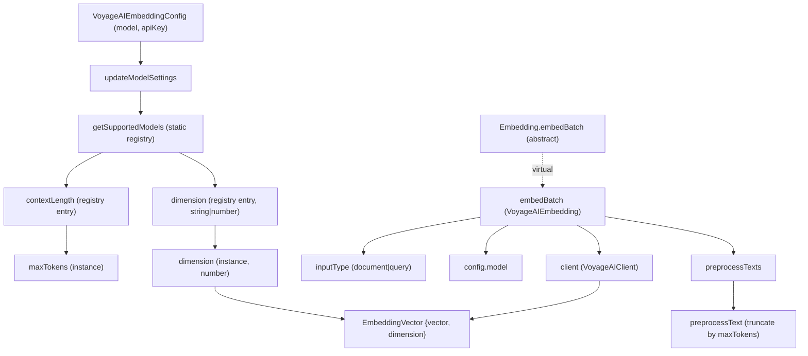

# VoyageAI embedding provider — code-specialized vectors with document/query asymmetry

## Overview
This is one of claude-context's pluggable embedding backends — the substrate that turns a code
chunk into the numeric vector the vector store indexes and the semantic-search path queries. It
implements the abstract [`Embedding`](../catalog/packages/core/src/embedding/base-embedding.ts.md#Embedding.embedBatch)
contract (preprocess → embed → return `{vector, dimension}`) and adds only what is *VoyageAI-specific*:
a default of **`voyage-code-3`** (a model tuned for code retrieval), an **`input_type` of
`document` vs `query`** that lets the same model embed a stored chunk and a search query
differently, and a **model→dimension/context-length registry** that both auto-configures the
instance and reflects VoyageAI's variable output dimensions (256/512/1024/2048). The shared
preprocessing, batching contract, and `EmbeddingVector` shape all come from
[base-embedding](packages-core-src-embedding-base-embedding.ts.md); this page is only the provider delta.

## Diagram

## Design rationale (why it's built this way)
**Code-specialized default.** The instance is seeded with `voyage-code-3`, whose registry
[`description`](../catalog/packages/core/src/embedding/voyageai-embedding.ts.md#VoyageAIEmbedding.getSupportedModels.Record.typeLiteral7.description)
is literally "Optimized for code retrieval (recommended for code)". For a tool whose whole job is
making a *codebase* searchable, picking a code-tuned embedding model as the default is the point —
this is where claude-context's grounding substrate (dense embeddings + vector search) is biased
toward code rather than general prose.

**Document/query asymmetry.** The provider keeps an
[`inputType`](../catalog/packages/core/src/embedding/voyageai-embedding.ts.md#VoyageAIEmbedding.inputType)
of `'document' | 'query'`, defaulting to `document`. VoyageAI models embed a stored passage and a
search query into deliberately different points of the space, so indexing (documents) and
retrieval (queries) can use the *same* model with different framing. The base contract has no such
notion — it is a genuine provider-specific knob.

**Variable output dimension, declared as data.** VoyageAI's newer models don't have a single fixed
dimension; a model entry's
[`dimension`](../catalog/packages/core/src/embedding/voyageai-embedding.ts.md#VoyageAIEmbedding.getSupportedModels.Record.typeLiteral7.dimension)
is typed `string | number` precisely so it can hold either a fixed number (legacy models like
`voyage-large-2` = 1536) or a menu string such as `"1024 (default), 256, 512, 2048"`. The registry
encodes the provider's capability matrix as a static table rather than hard-coding one dimension,
so adding a model is a data edit.

> [!inferred]
> The `contextLength → maxTokens` mapping exists so the shared character-truncation preprocessor
> (which multiplies `maxTokens` by ~4 chars/token) truncates to *this provider's* real window
> rather than a generic constant. This reading is from the source comment "Set max tokens based on
> model's context length" plus how base `preprocessText` uses `maxTokens`, not from a test.

**Larger default window than its siblings.** Voyage's default
[`maxTokens`](../catalog/packages/core/src/embedding/voyageai-embedding.ts.md#VoyageAIEmbedding.maxTokens)
is `32000`, versus `8192` for
[OpenAI](../catalog/packages/core/src/embedding/openai-embedding.ts.md#OpenAIEmbedding.maxTokens)
and `2048` for [Ollama](../catalog/packages/core/src/embedding/ollama-embedding.ts.md#OllamaEmbedding.maxTokens)
and [Gemini](../catalog/packages/core/src/embedding/gemini-embedding.ts.md#GeminiEmbedding.maxTokens).
Because that number drives the shared truncation, the provider choice directly changes how much of
a long code chunk survives into the embedding.

## Entry points
- [`embedBatch`](../catalog/packages/core/src/embedding/voyageai-embedding.ts.md#VoyageAIEmbedding.embedBatch)
  — the batch embedding path (author intent: "Generate text embedding vectors in batch"), reached
  from the indexing pipeline for every batch of code chunks. It overrides the abstract
  [`Embedding.embedBatch`](../catalog/packages/core/src/embedding/base-embedding.ts.md#Embedding.embedBatch)
  via the virtual dispatch, so callers hold a base `Embedding` and get this implementation.
- [`updateModelSettings`](../catalog/packages/core/src/embedding/voyageai-embedding.ts.md#VoyageAIEmbedding.updateModelSettings)
  — the configuration path, hit at construction (and on any later model change) to resolve a model
  name into the instance's
  [`dimension`](../catalog/packages/core/src/embedding/voyageai-embedding.ts.md#VoyageAIEmbedding.dimension)
  and [`maxTokens`](../catalog/packages/core/src/embedding/voyageai-embedding.ts.md#VoyageAIEmbedding.maxTokens).
- [`getSupportedModels`](../catalog/packages/core/src/embedding/voyageai-embedding.ts.md#VoyageAIEmbedding.getSupportedModels)
  — the static capability registry (author intent: "Get list of supported models"); the source of
  truth `updateModelSettings` reads.

## Mechanism (step-by-step)
1. **Resolve model → settings.**
   [`updateModelSettings`](../catalog/packages/core/src/embedding/voyageai-embedding.ts.md#VoyageAIEmbedding.updateModelSettings)
   looks the requested
   [`model`](../catalog/packages/core/src/embedding/voyageai-embedding.ts.md#VoyageAIEmbeddingConfig.model)
   up in
   [`getSupportedModels`](../catalog/packages/core/src/embedding/voyageai-embedding.ts.md#VoyageAIEmbedding.getSupportedModels).
   If the entry's
   [`dimension`](../catalog/packages/core/src/embedding/voyageai-embedding.ts.md#VoyageAIEmbedding.getSupportedModels.Record.typeLiteral7.dimension)
   is a string, it regex-parses the leading integer (the "1024 (default)" prefix) as the working
   dimension; if numeric, it uses it directly. It then copies the entry's
   [`contextLength`](../catalog/packages/core/src/embedding/voyageai-embedding.ts.md#VoyageAIEmbedding.getSupportedModels.Record.typeLiteral7.contextLength)
   into
   [`maxTokens`](../catalog/packages/core/src/embedding/voyageai-embedding.ts.md#VoyageAIEmbedding.maxTokens).
2. **Fall back for unknown models.** When the lookup misses,
   [`updateModelSettings`](../catalog/packages/core/src/embedding/voyageai-embedding.ts.md#VoyageAIEmbedding.updateModelSettings)
   defaults
   [`dimension`](../catalog/packages/core/src/embedding/voyageai-embedding.ts.md#VoyageAIEmbedding.dimension)
   to `1024` and
   [`maxTokens`](../catalog/packages/core/src/embedding/voyageai-embedding.ts.md#VoyageAIEmbedding.maxTokens)
   to `32000` — an unrecognized name still yields a usable, code-sized configuration rather than
   throwing.
3. **Preprocess the batch.**
   [`embedBatch`](../catalog/packages/core/src/embedding/voyageai-embedding.ts.md#VoyageAIEmbedding.embedBatch)
   first runs the inherited
   [`preprocessTexts`](../catalog/packages/core/src/embedding/base-embedding.ts.md#Embedding.preprocessTexts),
   which maps each string through
   [`preprocessText`](../catalog/packages/core/src/embedding/base-embedding.ts.md#Embedding.preprocessText)
   — replacing an empty string with a single space and truncating anything longer than
   `maxTokens * 4` characters. The truncation ceiling is exactly the provider window resolved in
   step 1.
4. **Call the VoyageAI API with the code default and input type.**
   [`embedBatch`](../catalog/packages/core/src/embedding/voyageai-embedding.ts.md#VoyageAIEmbedding.embedBatch)
   sends the processed texts to the
   [`client`](../catalog/packages/core/src/embedding/voyageai-embedding.ts.md#VoyageAIEmbedding.client),
   passing the
   [`config`](../catalog/packages/core/src/embedding/voyageai-embedding.ts.md#VoyageAIEmbedding.config)'s
   [`model`](../catalog/packages/core/src/embedding/voyageai-embedding.ts.md#VoyageAIEmbeddingConfig.model)
   (or `'voyage-code-3'` when unset) and the current
   [`inputType`](../catalog/packages/core/src/embedding/voyageai-embedding.ts.md#VoyageAIEmbedding.inputType)
   — the two provider-specific ingredients that distinguish a Voyage call from a generic embedding call.
5. **Shape the response into `EmbeddingVector`s.**
   [`embedBatch`](../catalog/packages/core/src/embedding/voyageai-embedding.ts.md#VoyageAIEmbedding.embedBatch)
   throws if the response has no `data`, and per item throws again on a missing embedding; otherwise
   it maps each returned vector into the shared
   [`EmbeddingVector`](../catalog/packages/core/src/embedding/base-embedding.ts.md#EmbeddingVector)
   `{ vector, dimension }`, stamping the instance
   [`dimension`](../catalog/packages/core/src/embedding/voyageai-embedding.ts.md#VoyageAIEmbedding.dimension)
   resolved earlier so downstream code knows the width without re-querying the API.

## Key data structures
- [`VoyageAIEmbeddingConfig`](../catalog/packages/core/src/embedding/voyageai-embedding.ts.md#VoyageAIEmbeddingConfig)
  — the constructor input: just `model` and `apiKey`. Everything else (dimension, context length)
  is *derived* from the model name, not passed in.
- The static model registry returned by
  [`getSupportedModels`](../catalog/packages/core/src/embedding/voyageai-embedding.ts.md#VoyageAIEmbedding.getSupportedModels)
  — a `Record<string, {dimension, contextLength, description}>` capability table. The union type on
  its
  [`dimension`](../catalog/packages/core/src/embedding/voyageai-embedding.ts.md#VoyageAIEmbedding.getSupportedModels.Record.typeLiteral7.dimension)
  field is what makes the "menu vs fixed" distinction expressible.
- The instance state that a call reads: mutable
  [`dimension`](../catalog/packages/core/src/embedding/voyageai-embedding.ts.md#VoyageAIEmbedding.dimension)
  and
  [`inputType`](../catalog/packages/core/src/embedding/voyageai-embedding.ts.md#VoyageAIEmbedding.inputType),
  the API [`client`](../catalog/packages/core/src/embedding/voyageai-embedding.ts.md#VoyageAIEmbedding.client),
  and the retained
  [`config`](../catalog/packages/core/src/embedding/voyageai-embedding.ts.md#VoyageAIEmbedding.config).
- [`EmbeddingVector`](../catalog/packages/core/src/embedding/base-embedding.ts.md#EmbeddingVector)
  — the shared cross-provider output shape (`vector: number[]`, `dimension: number`); every provider
  in this wiki emits this, which is what lets the vector store stay provider-agnostic.

## Dynamics (design intent)
The abstract [`maxTokens`](../catalog/packages/core/src/embedding/base-embedding.ts.md#Embedding.maxTokens)
is a template-method seam: the base class owns the preprocessing algorithm but forces each provider
to supply its own window, and the test doubles across the suite
([`context.abort.test.ts`](../catalog/packages/core/src/context.abort.test.ts.md#TestEmbedding.maxTokens),
[`context.splitter.test.ts`](../catalog/packages/core/src/context.splitter.test.ts.md#TestEmbedding.maxTokens),
[`context.ignore-patterns.test.ts`](../catalog/packages/core/src/context.ignore-patterns.test.ts.md#TestEmbedding.maxTokens),
[`context.embedding-error.test.ts`](../catalog/packages/core/src/context.embedding-error.test.ts.md#FailingEmbedding.maxTokens))
each set their own `maxTokens` and stub the batch path, confirming the pipeline treats any
`Embedding` uniformly. Those tests assert against the shared
[`EmbeddingVector`](../catalog/packages/core/src/embedding/base-embedding.ts.md#EmbeddingVector)
output, not against Voyage internals — the provider is exercised only through the contract it
overrides.

## Edge cases
- **Menu-dimension parsing is prefix-only.** A registry string like
  `"1024 (default), 256, 512, 2048"` yields `1024` via the leading-integer regex in
  [`updateModelSettings`](../catalog/packages/core/src/embedding/voyageai-embedding.ts.md#VoyageAIEmbedding.updateModelSettings);
  the other listed dimensions (256/512/2048) are *not* selectable through this path — you always get
  the default. Requesting a non-default output dimension is not wired here.
- **Unknown model never throws** — it silently falls back to 1024 / 32000
  ([`updateModelSettings`](../catalog/packages/core/src/embedding/voyageai-embedding.ts.md#VoyageAIEmbedding.updateModelSettings)),
  so a typo'd model name embeds successfully but at possibly the wrong width.
- **Empty strings survive.** The inherited
  [`preprocessText`](../catalog/packages/core/src/embedding/base-embedding.ts.md#Embedding.preprocessText)
  rewrites `''` to a single space so the API never sees an empty input (which many embedding APIs
  reject).
- **Truncation is character-count, not real tokenization.**
  [`preprocessText`](../catalog/packages/core/src/embedding/base-embedding.ts.md#Embedding.preprocessText)
  approximates 4 chars/token; a code chunk dense in short tokens can still overflow the true model
  window, and one with long tokens is truncated earlier than necessary.

## Open questions
- The instance methods that expose the provider knobs at runtime — the constructor, `embed`
  (single-text), `setModel`, `setInputType`, `getProvider`, and `detectDimension` — are outside this
  packet's subgraph, so how
  [`inputType`](../catalog/packages/core/src/embedding/voyageai-embedding.ts.md#VoyageAIEmbedding.inputType)
  gets flipped to `'query'` at search time (vs. `'document'` at index time) is visible in the source
  but not citable here; it belongs to the search-path concept.
- The `VoyageAIClient` transport (batching limits, retry, rate limiting) lives in the external
  `voyageai` SDK behind
  [`client`](../catalog/packages/core/src/embedding/voyageai-embedding.ts.md#VoyageAIEmbedding.client)
  and is not in scope.

## See also
- [base-embedding](packages-core-src-embedding-base-embedding.ts.md) — the abstract `Embedding`
  contract (preprocessing, `EmbeddingVector`, the `maxTokens` seam) this provider fills in.
- [openai-embedding](packages-core-src-embedding-openai-embedding.ts.md),
  [gemini-embedding](packages-core-src-embedding-gemini-embedding.ts.md),
  [ollama-embedding](packages-core-src-embedding-ollama-embedding.ts.md) — sibling providers behind
  the same contract; compare their default `maxTokens` and dimension handling.
