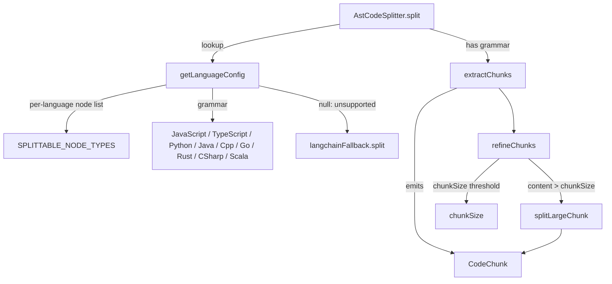

# AST-aware code splitting — tree-sitter chunks with a LangChain fallback

<!-- connect:up:begin -->
> **Cross-repo concept:** part of [multi-language-extraction](../../../concepts/multi-language-extraction.md) across this wiki's repos.
<!-- connect:up:end -->
How claude-context turns a source file into embeddable chunks that respect code structure — one
function/class/interface per chunk where a grammar exists, and a graceful character-based fallback
everywhere else.

## Overview
This subsystem is the *chunking* stage of claude-context's indexing pipeline: before code can be
embedded and stored in a vector index, a file must be broken into pieces small enough to embed but
coherent enough to retrieve. The key design idea is **structure-aware boundaries** — rather than
cutting every N characters, [`split`](../catalog/packages/core/src/splitter/ast-splitter.ts.md#AstCodeSplitter.split)
parses the file with a tree-sitter grammar and emits one [`CodeChunk`](../catalog/packages/core/src/splitter/index.ts.md#CodeChunk)
per *logical unit* (function, class, interface, …) named in a per-language allow-list,
[`SPLITTABLE_NODE_TYPES`](../catalog/packages/core/src/splitter/ast-splitter.ts.md#SPLITTABLE_NODE_TYPES).
Nine languages are backed by real grammars; anything else — or any parse that fails — falls back to a
LangChain recursive character splitter, so the pipeline never drops a file. A second refinement pass
guarantees no chunk exceeds the embedder's budget by character-splitting oversized units.

## Diagram

## Design rationale (why it's built this way)
The whole subsystem exists to make retrieval *meaningful*: an embedding of a whole 800-line file
retrieves poorly, and an embedding of an arbitrary 2500-character window can split a function in half.
By emitting one [`CodeChunk`](../catalog/packages/core/src/splitter/index.ts.md#CodeChunk) per logical
unit, a semantic search for "the retry loop" can land on the exact function. The author's docstring on
[`split`](../catalog/packages/core/src/splitter/ast-splitter.ts.md#AstCodeSplitter.split) states the
scope plainly — *"Split code into code chunks"* — and the implementation layers three deliberate
decisions on top of it.

**Grammars are gated behind a config lookup, not the parse.** Language support is decided *before*
parsing by [`getLanguageConfig`](../catalog/packages/core/src/splitter/ast-splitter.ts.md#AstCodeSplitter.getLanguageConfig),
a hand-written `langMap` that returns a `{ parser, nodeTypes }` pair or `null`. This is where the
survey-relevant multi-language coverage lives: the map aliases many spellings onto nine grammars —
[`JavaScript`](../catalog/packages/core/src/splitter/ast-splitter.ts.md#JavaScript) (also `js`),
[`TypeScript`](../catalog/packages/core/src/splitter/ast-splitter.ts.md#TypeScript) (also `ts`),
[`Python`](../catalog/packages/core/src/splitter/ast-splitter.ts.md#Python) (also `py`),
[`Java`](../catalog/packages/core/src/splitter/ast-splitter.ts.md#Java),
[`Cpp`](../catalog/packages/core/src/splitter/ast-splitter.ts.md#Cpp) (serving `cpp`, `c++`, and
`c`), [`Go`](../catalog/packages/core/src/splitter/ast-splitter.ts.md#Go),
[`Rust`](../catalog/packages/core/src/splitter/ast-splitter.ts.md#Rust) (also `rs`),
[`CSharp`](../catalog/packages/core/src/splitter/ast-splitter.ts.md#CSharp) (`cs`, `csharp`), and
[`Scala`](../catalog/packages/core/src/splitter/ast-splitter.ts.md#Scala). A `null` return is not an
error — it is the signal to use the fallback.

**Fallback is treated as normal, not exceptional.** There are three separate paths to the LangChain
splitter inside [`split`](../catalog/packages/core/src/splitter/ast-splitter.ts.md#AstCodeSplitter.split):
unsupported language (`getLanguageConfig` returned `null`), a parse that produces no `rootNode`, and
any thrown error during parse/extract. All three log and return `langchainFallback.split(...)`. This
is why claude-context can index a repo full of languages it has no grammar for — the splitter degrades
to character-based chunking rather than failing.

> [!inferred]
> The `langchainFallback` field and its `split` are not in this packet's Subgraph, so I cannot cite
> them directly; from the source of `ast-splitter.ts` and `langchain-splitter.ts` the fallback is a
> `LangChainCodeSplitter` wrapping LangChain's `RecursiveCharacterTextSplitter.fromLanguage`, which
> itself falls back to a generic character splitter when the language is unknown to LangChain.

**Structure gives boundaries; character-splitting guarantees the size ceiling.** Tree-sitter decides
*where* the natural seams are, but a single 3000-character function still exceeds the embedder budget.
So [`refineChunks`](../catalog/packages/core/src/splitter/ast-splitter.ts.md#AstCodeSplitter.refineChunks)
runs a second pass that re-splits any chunk whose
[`content`](../catalog/packages/core/src/splitter/index.ts.md#CodeChunk.content) is longer than
[`chunkSize`](../catalog/packages/core/src/splitter/ast-splitter.ts.md#AstCodeSplitter.chunkSize)
(default 2500). Structure and size are two independent concerns handled in two passes.

## Entry points
- [`split`](../catalog/packages/core/src/splitter/ast-splitter.ts.md#AstCodeSplitter.split) — the sole
  public method and the only entry point in this subgraph. The indexing pipeline calls it once per
  file with `(code, language, filePath)`; it returns a `Promise<CodeChunk[]>`. Every test in the
  Evidence table (`context.splitter.test.ts:39`, `context.abort.test.ts:38`,
  `context.embedding-error.test.ts:51`, `context.ignore-patterns.test.ts:35`) drives the pipeline
  through this method and asserts on the resulting
  [`CodeChunk`](../catalog/packages/core/src/splitter/index.ts.md#CodeChunk) shape.

## Mechanism (step-by-step)
1. **Resolve the language.** [`split`](../catalog/packages/core/src/splitter/ast-splitter.ts.md#AstCodeSplitter.split)
   first calls [`getLanguageConfig`](../catalog/packages/core/src/splitter/ast-splitter.ts.md#AstCodeSplitter.getLanguageConfig),
   which lowercases the language string and looks it up in the alias map. On a miss it returns `null`
   and `split` immediately delegates to the LangChain fallback and returns. On a hit it yields the
   grammar object and the matching entry from
   [`SPLITTABLE_NODE_TYPES`](../catalog/packages/core/src/splitter/ast-splitter.ts.md#SPLITTABLE_NODE_TYPES)
   — e.g. `typescript` maps to `['function_declaration', 'arrow_function', 'class_declaration',
   'method_definition', 'export_statement', 'interface_declaration', 'type_alias_declaration']`.

2. **Parse and guard.** With a config in hand, `split` sets the tree-sitter parser to
   `langConfig.parser` and parses the source. If the parse yields no `rootNode` it warns and falls
   back to LangChain; the whole `try` is wrapped so any thrown parser error also routes to the
   fallback. Only a clean parse continues to extraction —
   [`split`](../catalog/packages/core/src/splitter/ast-splitter.ts.md#AstCodeSplitter.split) never lets
   a grammar failure abort indexing.

3. **Walk the tree into chunks.** [`extractChunks`](../catalog/packages/core/src/splitter/ast-splitter.ts.md#AstCodeSplitter.extractChunks)
   does a full recursive descent of the AST. For every node whose `type` is in the language's
   `splittableTypes` list, it slices the exact source span (`startIndex..endIndex`), computes
   1-based [`startLine`](../catalog/packages/core/src/splitter/index.ts.md#CodeChunk.metadata.typeLiteral52.startLine)
   and [`endLine`](../catalog/packages/core/src/splitter/index.ts.md#CodeChunk.metadata.typeLiteral52.endLine)
   from the node's row positions, and — only if the trimmed text is non-empty — pushes a
   [`CodeChunk`](../catalog/packages/core/src/splitter/index.ts.md#CodeChunk) carrying that
   [`content`](../catalog/packages/core/src/splitter/index.ts.md#CodeChunk.content) plus
   [`language`](../catalog/packages/core/src/splitter/index.ts.md#CodeChunk.metadata.typeLiteral52.language)
   and [`filePath`](../catalog/packages/core/src/splitter/index.ts.md#CodeChunk.metadata.typeLiteral52.filePath)
   in its [`metadata`](../catalog/packages/core/src/splitter/index.ts.md#CodeChunk.metadata). Because
   traversal continues into children of a matched node, a class and its methods can *both* be emitted
   — chunks can overlap in coverage. If the walk finds no splittable node at all, `extractChunks`
   emits one chunk spanning the whole file (lines 1..N) so the file is never silently indexed as
   nothing.

4. **Enforce the size ceiling.** [`refineChunks`](../catalog/packages/core/src/splitter/ast-splitter.ts.md#AstCodeSplitter.refineChunks)
   iterates the raw chunks: any whose
   [`content`](../catalog/packages/core/src/splitter/index.ts.md#CodeChunk.content) length is within
   [`chunkSize`](../catalog/packages/core/src/splitter/ast-splitter.ts.md#AstCodeSplitter.chunkSize)
   passes through unchanged; anything larger is handed to
   [`splitLargeChunk`](../catalog/packages/core/src/splitter/ast-splitter.ts.md#AstCodeSplitter.splitLargeChunk).

5. **Character-split oversized units.** [`splitLargeChunk`](../catalog/packages/core/src/splitter/ast-splitter.ts.md#AstCodeSplitter.splitLargeChunk)
   splits the chunk's content by lines and greedily accumulates lines into a sub-chunk until adding the
   next would exceed [`chunkSize`](../catalog/packages/core/src/splitter/ast-splitter.ts.md#AstCodeSplitter.chunkSize),
   then flushes a new [`CodeChunk`](../catalog/packages/core/src/splitter/index.ts.md#CodeChunk).
   Crucially it recomputes line numbers relative to the parent chunk's
   [`startLine`](../catalog/packages/core/src/splitter/index.ts.md#CodeChunk.metadata.typeLiteral52.startLine)
   (`currentStartLine + i`) so each sub-chunk's
   [`endLine`](../catalog/packages/core/src/splitter/index.ts.md#CodeChunk.metadata.typeLiteral52.endLine)
   still points back into the real file, and it copies
   [`language`](../catalog/packages/core/src/splitter/index.ts.md#CodeChunk.metadata.typeLiteral52.language)
   and [`filePath`](../catalog/packages/core/src/splitter/index.ts.md#CodeChunk.metadata.typeLiteral52.filePath)
   forward. This keeps citations accurate even after a function is broken across several vectors.

## Key data structures
- [`CodeChunk`](../catalog/packages/core/src/splitter/index.ts.md#CodeChunk) — the unit of everything
  downstream. A `{ content, metadata }` pair where
  [`content`](../catalog/packages/core/src/splitter/index.ts.md#CodeChunk.content) is the raw source
  slice that gets embedded, and [`metadata`](../catalog/packages/core/src/splitter/index.ts.md#CodeChunk.metadata)
  carries [`startLine`](../catalog/packages/core/src/splitter/index.ts.md#CodeChunk.metadata.typeLiteral52.startLine),
  [`endLine`](../catalog/packages/core/src/splitter/index.ts.md#CodeChunk.metadata.typeLiteral52.endLine),
  optional [`language`](../catalog/packages/core/src/splitter/index.ts.md#CodeChunk.metadata.typeLiteral52.language),
  and optional [`filePath`](../catalog/packages/core/src/splitter/index.ts.md#CodeChunk.metadata.typeLiteral52.filePath).
  The line numbers are what let a vector hit be traced back to an exact source range.
- [`SPLITTABLE_NODE_TYPES`](../catalog/packages/core/src/splitter/ast-splitter.ts.md#SPLITTABLE_NODE_TYPES)
  — a nine-key object mapping each language to the list of tree-sitter node types that count as a
  logical unit. This is the entire policy for *what becomes a chunk*: adding `interface_declaration`
  to `typescript` but not `javascript`, or `impl_item`/`trait_item` to `rust`, is how the author tuned
  granularity per language. It is the natural extension point for new languages alongside a grammar in
  [`getLanguageConfig`](../catalog/packages/core/src/splitter/ast-splitter.ts.md#AstCodeSplitter.getLanguageConfig).
- [`chunkSize`](../catalog/packages/core/src/splitter/ast-splitter.ts.md#AstCodeSplitter.chunkSize) —
  the single tunable that both the pass-through test in
  [`refineChunks`](../catalog/packages/core/src/splitter/ast-splitter.ts.md#AstCodeSplitter.refineChunks)
  and the flush threshold in
  [`splitLargeChunk`](../catalog/packages/core/src/splitter/ast-splitter.ts.md#AstCodeSplitter.splitLargeChunk)
  read (default 2500 characters).

## Dynamics (design intent)
[`split`](../catalog/packages/core/src/splitter/ast-splitter.ts.md#AstCodeSplitter.split) is `async`
and returns a `Promise<CodeChunk[]>`, but the AST work
([`extractChunks`](../catalog/packages/core/src/splitter/ast-splitter.ts.md#AstCodeSplitter.extractChunks),
[`splitLargeChunk`](../catalog/packages/core/src/splitter/ast-splitter.ts.md#AstCodeSplitter.splitLargeChunk))
is synchronous; the `async`/`await` exists because
[`refineChunks`](../catalog/packages/core/src/splitter/ast-splitter.ts.md#AstCodeSplitter.refineChunks)
and the fallback are async. There is no concurrency inside the splitter — one file is parsed and
chunked in order — so ordering of chunks follows AST traversal order (parent before children, siblings
in source order). The Evidence tests exercise this deterministically: each asserts on the concrete
[`CodeChunk`](../catalog/packages/core/src/splitter/index.ts.md#CodeChunk) fields produced from a fixed
input, so chunk boundaries and line numbers are treated as a stable contract.

## Edge cases
- **Unknown language.** [`getLanguageConfig`](../catalog/packages/core/src/splitter/ast-splitter.ts.md#AstCodeSplitter.getLanguageConfig)
  returns `null` and [`split`](../catalog/packages/core/src/splitter/ast-splitter.ts.md#AstCodeSplitter.split)
  hands the file to the LangChain fallback — no chunk is lost, but boundaries are character-based, not
  structural.
- **Grammar present but parse fails.** A missing `rootNode` or a thrown parser error both route to the
  fallback from inside [`split`](../catalog/packages/core/src/splitter/ast-splitter.ts.md#AstCodeSplitter.split);
  a malformed file still gets indexed.
- **No splittable node found.** [`extractChunks`](../catalog/packages/core/src/splitter/ast-splitter.ts.md#AstCodeSplitter.extractChunks)
  emits a single whole-file chunk (lines 1..N) rather than an empty list, so a config file or a script
  with no top-level function/class is still represented.
- **Whitespace-only nodes.** `extractChunks` skips any node whose trimmed
  [`content`](../catalog/packages/core/src/splitter/index.ts.md#CodeChunk.content) is empty, avoiding
  blank chunks.
- **Overlapping coverage.** Because traversal descends into matched nodes, a `class_declaration` chunk
  and its child `method_definition` chunks are both emitted in
  [`extractChunks`](../catalog/packages/core/src/splitter/ast-splitter.ts.md#AstCodeSplitter.extractChunks)
  — the same lines can appear in more than one vector. This is intentional for recall but inflates
  chunk count on class-heavy files.
- **`c` aliased to a C++ grammar.** [`getLanguageConfig`](../catalog/packages/core/src/splitter/ast-splitter.ts.md#AstCodeSplitter.getLanguageConfig)
  maps `c`, `c++`, and `cpp` all to [`Cpp`](../catalog/packages/core/src/splitter/ast-splitter.ts.md#Cpp);
  plain C is parsed with the C++ grammar rather than a dedicated one.

## Open questions
- **Overlap between refined chunks.** [`refineChunks`](../catalog/packages/core/src/splitter/ast-splitter.ts.md#AstCodeSplitter.refineChunks)
  ends by calling `addOverlap` (visible in source, not in this Subgraph) with a `chunkOverlap` of 300;
  the size and line-number effect of that inter-chunk overlap can't be described from citable symbols
  here.
- **Fallback internals.** The `LangChainCodeSplitter` and its language map are outside this packet, so
  exactly which languages LangChain covers (and its own generic fallback) is only summarized in the
  `> [!inferred]` block above.
- **Whole-file vs. per-symbol embedding tradeoff.** How the overlapping class/method chunks interact
  with the downstream vector store and dedup is not visible from this subgraph.

## See also
- The claude-context indexing pipeline and vector-store concept pages (the consumers of
  [`CodeChunk`](../catalog/packages/core/src/splitter/index.ts.md#CodeChunk)).
- Cross-repo: [`multi-language-extraction`](../../../concepts/multi-language-extraction.md) — how
  graphify and the other surveyed tools handle per-language extraction, versus this tree-sitter +
  per-language-node-type + character-fallback approach.
