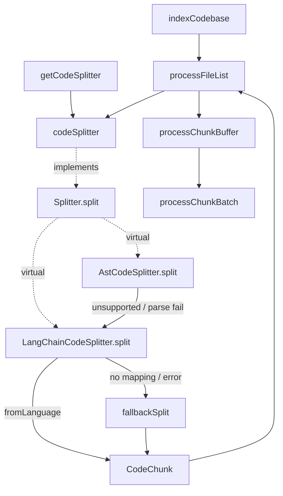

# The Splitter contract — CodeChunk records and the LangChain character-based fallback

<!-- connect:up:begin -->
> **Cross-repo concept:** part of [multi-language-extraction](../../../concepts/multi-language-extraction.md) across this wiki's repos.
<!-- connect:up:end -->
Scope: the `splitter/index.ts` module that defines what "a chunk" *is* in claude-context and the
narrow interface every splitter implements, plus the LangChain character-based splitter that turns
source text into chunks when the AST path can't (or won't) parse a language.

## Overview
Before any code can be embedded, it has to be cut into pieces small enough to embed and coherent
enough to be worth retrieving. claude-context factors that job behind one tiny interface,
[`Splitter`](../catalog/packages/core/src/splitter/index.ts.md#Splitter), whose only real method is
[`split`](../catalog/packages/core/src/splitter/index.ts.md#Splitter.split) — *"Split code into code
chunks."* Every splitter, real or test, returns the **same universal record**,
[`CodeChunk`](../catalog/packages/core/src/splitter/index.ts.md#CodeChunk): a
[`content`](../catalog/packages/core/src/splitter/index.ts.md#CodeChunk.content) string plus
[`metadata`](../catalog/packages/core/src/splitter/index.ts.md#CodeChunk.metadata) (start/end line,
language, file path). This single contract is the seam that lets the two strategies —
[`AstCodeSplitter`](../catalog/packages/core/src/splitter/ast-splitter.ts.md#AstCodeSplitter)
(structure-aware, its own page) and
[`LangChainCodeSplitter`](../catalog/packages/core/src/splitter/langchain-splitter.ts.md#LangChainCodeSplitter)
(character-based) — be interchangeable, and lets tests inject fakes like
[`TestSplitter`](../catalog/packages/core/src/context.ignore-patterns.test.ts.md#TestSplitter). The
character splitter is not just a peer: it is the AST splitter's **fallback**, so it must handle every
language the AST path drops.

## Diagram

## Design rationale (why it's built this way)
The module keeps the interface deliberately minimal — one
[`split`](../catalog/packages/core/src/splitter/index.ts.md#Splitter.split) call returning a flat
`Promise<CodeChunk[]>`, plus `setChunkSize`/`setChunkOverlap` knobs — so that the indexing pipeline
never has to know *how* text was chunked, only that it got back
[`CodeChunk`](../catalog/packages/core/src/splitter/index.ts.md#CodeChunk) records with line
provenance. That provenance is the whole point of
[`metadata`](../catalog/packages/core/src/splitter/index.ts.md#CodeChunk.metadata): a retrieved chunk
is useless to a coding agent unless it can be pointed back at `startLine..endLine` in a file, so line
numbers are carried on every chunk from the moment it is cut.

> [!inferred]
> The interface is a classic strategy pattern: `index.ts` re-exports both concrete splitters
> (`export * from './langchain-splitter'` / `'./ast-splitter'` in the real source), and every
> implementation — including the four in-repo test doubles — is defined by `implements Splitter`. This
> is what makes the splitter a **pluggable substrate**: the survey's cross-repo comparison hinges on
> claude-context grounding retrieval on *embedded text chunks*, and this interface is exactly where the
> "what is a unit of code" decision is localized.

The LangChain splitter exists because tree-sitter cannot cover everything. Its
[`split`](../catalog/packages/core/src/splitter/langchain-splitter.ts.md#LangChainCodeSplitter.split)
first tries a *language-aware* recursive character splitter and, on any miss or exception, degrades to
a generic one via
[`fallbackSplit`](../catalog/packages/core/src/splitter/langchain-splitter.ts.md#LangChainCodeSplitter.fallbackSplit).
The layering is defensive: language-specific separators when possible, plain character windows when
not, but *always* a result — never a thrown error that would strand a file.

## Entry points
- [`Splitter`](../catalog/packages/core/src/splitter/index.ts.md#Splitter) /
  [`split`](../catalog/packages/core/src/splitter/index.ts.md#Splitter.split) — the contract itself.
  Control reaches a concrete `split` through virtual dispatch whenever the pipeline needs a file
  chunked; the interface's docstring fixes the meaning of the call (*"Split code into code chunks"*).
- [`getCodeSplitter`](../catalog/packages/core/src/context.ts.md#Context.getCodeSplitter) — returns the
  active [`codeSplitter`](../catalog/packages/core/src/context.ts.md#Context.codeSplitter); the
  accessor other subsystems use to obtain the current strategy without knowing its class.
- [`processFileList`](../catalog/packages/core/src/context.ts.md#Context.processFileList) — the hot
  loop that actually calls `split` per file; it takes a `splitter` defaulting to
  [`codeSplitter`](../catalog/packages/core/src/context.ts.md#Context.codeSplitter), so a per-request
  override can swap the strategy for one indexing run.
- [`LangChainCodeSplitter`](../catalog/packages/core/src/splitter/langchain-splitter.ts.md#LangChainCodeSplitter)
  and its [`split`](../catalog/packages/core/src/splitter/langchain-splitter.ts.md#LangChainCodeSplitter.split)
  — the character-based implementation; reached directly when configured as the splitter, and
  indirectly as the fallback invoked from
  [`AstCodeSplitter.split`](../catalog/packages/core/src/splitter/ast-splitter.ts.md#AstCodeSplitter.split).

## Mechanism (step-by-step)
1. **A splitter is selected and held on the Context.** The pipeline keeps one active strategy in
   [`codeSplitter`](../catalog/packages/core/src/context.ts.md#Context.codeSplitter), exposed through
   [`getCodeSplitter`](../catalog/packages/core/src/context.ts.md#Context.getCodeSplitter) and
   replaceable at runtime via
   [`updateSplitter`](../catalog/packages/core/src/context.ts.md#Context.updateSplitter). An indexing
   call can also pass a `requestSplitter`: both
   [`indexCodebase`](../catalog/packages/core/src/context.ts.md#Context.indexCodebase) and
   [`reindexByChange`](../catalog/packages/core/src/context.ts.md#Context.reindexByChange) resolve
   `requestSplitter || this.codeSplitter`, and an optional
   [`codeSplitter`](../catalog/packages/core/src/context.ts.md#ContextConfig.codeSplitter) on the
   config seeds the default. The concrete class is never named at the call site — only the
   [`Splitter`](../catalog/packages/core/src/splitter/index.ts.md#Splitter) type.

2. **Each file is chunked through the interface.**
   [`processFileList`](../catalog/packages/core/src/context.ts.md#Context.processFileList) reads a
   file, derives its `language` from the extension, and calls `splitter.split(content, language,
   filePath)`. Because the call is against
   [`split`](../catalog/packages/core/src/splitter/index.ts.md#Splitter.split), which strategy runs is
   decided by virtual dispatch — the AST splitter, the LangChain splitter, or a test double all satisfy
   the same signature.

3. **The LangChain path tries a language-specific splitter first.**
   [`LangChainCodeSplitter.split`](../catalog/packages/core/src/splitter/langchain-splitter.ts.md#LangChainCodeSplitter.split)
   maps the incoming language name to one of LangChain's supported languages (`javascript`/`typescript`
   → `js`, `c`/`c++` → `cpp`, `md` → `markdown`, and ~15 others) and, when a mapping exists, builds a
   `RecursiveCharacterTextSplitter.fromLanguage(...)` sized by `chunkSize`/`chunkOverlap`. It then
   `createDocuments([code])` and converts each returned document into a
   [`CodeChunk`](../catalog/packages/core/src/splitter/index.ts.md#CodeChunk), lifting
   [`content`](../catalog/packages/core/src/splitter/index.ts.md#CodeChunk.content) from
   `doc.pageContent` and populating
   [`metadata`](../catalog/packages/core/src/splitter/index.ts.md#CodeChunk.metadata) start/end lines
   from LangChain's `loc.lines` (defaulting to `{from:1,to:1}` when absent).

4. **Unmapped languages and errors fall through to a generic splitter.** When `mapLanguage` returns
   null, or when the language-specific attempt throws,
   [`split`](../catalog/packages/core/src/splitter/langchain-splitter.ts.md#LangChainCodeSplitter.split)
   calls [`fallbackSplit`](../catalog/packages/core/src/splitter/langchain-splitter.ts.md#LangChainCodeSplitter.fallbackSplit),
   which runs a plain `RecursiveCharacterTextSplitter` (no language grammar) and, lacking `loc` data,
   *estimates* line numbers by locating each chunk's text back in the original code. This guarantees a
   [`CodeChunk`](../catalog/packages/core/src/splitter/index.ts.md#CodeChunk) array is always produced,
   even for an unknown or unparseable language.

5. **This module is the AST splitter's safety net.** When
   [`AstCodeSplitter.split`](../catalog/packages/core/src/splitter/ast-splitter.ts.md#AstCodeSplitter.split)
   finds no tree-sitter grammar for a language, gets a null root node, or throws during parsing, it
   delegates to the LangChain fallback it constructs internally — so an unsupported language degrades
   to character-based chunking rather than being dropped. (The AST-specific refinement steps —
   [`extractChunks`](../catalog/packages/core/src/splitter/ast-splitter.ts.md#AstCodeSplitter.extractChunks),
   [`refineChunks`](../catalog/packages/core/src/splitter/ast-splitter.ts.md#AstCodeSplitter.refineChunks),
   [`splitLargeChunk`](../catalog/packages/core/src/splitter/ast-splitter.ts.md#AstCodeSplitter.splitLargeChunk),
   [`addOverlap`](../catalog/packages/core/src/splitter/ast-splitter.ts.md#AstCodeSplitter.addOverlap) —
   live on that separate page.)

6. **Chunks flow onward to embedding, untouched by their origin.** Whatever splitter produced them,
   the resulting chunks are buffered and embedded through
   [`processChunkBuffer`](../catalog/packages/core/src/context.ts.md#Context.processChunkBuffer) and
   [`processChunkBatch`](../catalog/packages/core/src/context.ts.md#Context.processChunkBatch), which
   read only [`content`](../catalog/packages/core/src/splitter/index.ts.md#CodeChunk.content) (to embed
   and store for BM25) and [`metadata`](../catalog/packages/core/src/splitter/index.ts.md#CodeChunk.metadata)
   (for relative path, line span, language). The interface's uniformity is what lets the embedding
   stage stay strategy-agnostic.

## Key data structures
- **[`CodeChunk`](../catalog/packages/core/src/splitter/index.ts.md#CodeChunk)** — the universal unit
  of indexed code: a [`content`](../catalog/packages/core/src/splitter/index.ts.md#CodeChunk.content)
  string and a [`metadata`](../catalog/packages/core/src/splitter/index.ts.md#CodeChunk.metadata)
  record (`startLine`, `endLine`, optional `language`, optional `filePath`). Everything downstream —
  embedding, vector storage, search results — is derived from this shape.
- **[`Splitter`](../catalog/packages/core/src/splitter/index.ts.md#Splitter)** — the strategy
  interface: one async [`split`](../catalog/packages/core/src/splitter/index.ts.md#Splitter.split) plus
  two size setters. Its implementers in the subgraph are
  [`AstCodeSplitter`](../catalog/packages/core/src/splitter/ast-splitter.ts.md#AstCodeSplitter),
  [`LangChainCodeSplitter`](../catalog/packages/core/src/splitter/langchain-splitter.ts.md#LangChainCodeSplitter),
  and the test doubles below.
- **`chunkSize` / `chunkOverlap`** — private LangChain defaults (1000 / 200 chars); the AST splitter
  uses larger defaults (2500 / 300) and hands them down to its LangChain fallback at construction.
  > [!inferred] These constants are read from the class bodies in the source snippets; they are not
  > their own subgraph symbols, so the exact values are cited only to the source.

## Dynamics (design intent)
The contract is pinned by four in-repo test doubles, each `implements Splitter` and each returning a
[`CodeChunk`](../catalog/packages/core/src/splitter/index.ts.md#CodeChunk) with the required
[`content`](../catalog/packages/core/src/splitter/index.ts.md#CodeChunk.content)/[`metadata`](../catalog/packages/core/src/splitter/index.ts.md#CodeChunk.metadata)
shape: [`TestSplitter`](../catalog/packages/core/src/context.ignore-patterns.test.ts.md#TestSplitter)
(ignore-pattern tests),
[`CountingSplitter`](../catalog/packages/core/src/context.abort.test.ts.md#CountingSplitter) (counts
`split` invocations to prove cooperative abort),
[`OneChunkSplitter`](../catalog/packages/core/src/context.embedding-error.test.ts.md#OneChunkSplitter)
(embedding-error propagation), and
[`RecordingSplitter`](../catalog/packages/core/src/context.splitter.test.ts.md#RecordingSplitter)
(records the `code`/`language`/`filePath` it was handed). The Evidence table shows their
[`split`](../catalog/packages/core/src/context.abort.test.ts.md#CountingSplitter.split) methods
exercising `CodeChunk`, `content`, and `metadata` directly — the tests treat the record shape as the
stable API. That the pipeline resolves `requestSplitter || this.codeSplitter` in
[`processFileList`](../catalog/packages/core/src/context.ts.md#Context.processFileList) is what lets
these fakes be injected per-run.

## Edge cases
- **Unknown language name** — `mapLanguage` returns null and
  [`split`](../catalog/packages/core/src/splitter/langchain-splitter.ts.md#LangChainCodeSplitter.split)
  routes straight to
  [`fallbackSplit`](../catalog/packages/core/src/splitter/langchain-splitter.ts.md#LangChainCodeSplitter.fallbackSplit);
  the file is still chunked, just without language-aware boundaries.
- **LangChain throws mid-split** — the `catch` in
  [`split`](../catalog/packages/core/src/splitter/langchain-splitter.ts.md#LangChainCodeSplitter.split)
  logs and falls back to the generic splitter rather than propagating; a splitter failure never aborts
  indexing (only embedding failures do, upstream).
- **Chunk text not found for line estimation** — in
  [`fallbackSplit`](../catalog/packages/core/src/splitter/langchain-splitter.ts.md#LangChainCodeSplitter.fallbackSplit),
  when the produced chunk cannot be located in the original code the estimator returns `{start:1,
  end:<lineCount>}`, so [`metadata`](../catalog/packages/core/src/splitter/index.ts.md#CodeChunk.metadata)
  line numbers can be approximate for fallback chunks.
- **AST unsupported / parse failure** — handled by delegation to this module from
  [`AstCodeSplitter.split`](../catalog/packages/core/src/splitter/ast-splitter.ts.md#AstCodeSplitter.split);
  see step 5.

## Open questions
- The LangChain language map and default `chunkSize`/`chunkOverlap` are class internals, not subgraph
  symbols, so they are described from the source body rather than cited to a catalog entry.
- Where the initial [`codeSplitter`](../catalog/packages/core/src/context.ts.md#Context.codeSplitter)
  is first assigned (the constructor default vs. `SplitterConfig`) is not in this subgraph beyond the
  optional [`codeSplitter`](../catalog/packages/core/src/context.ts.md#ContextConfig.codeSplitter)
  config field; the default-selection logic lives in the Context concept.

## See also
- [`packages-core-src-splitter-ast-splitter.ts`](packages-core-src-splitter-ast-splitter.ts.md) — the
  tree-sitter, structure-aware splitter that implements this same contract and falls back to the
  LangChain path here.
- [`packages-core-src-context.ts`](packages-core-src-context.ts.md) — the indexing pipeline that holds
  the active splitter and consumes its `CodeChunk`s.
- [`packages-core-src-sync-synchronizer.ts`](packages-core-src-sync-synchronizer.ts.md) — the
  incremental change detection that decides which files get re-split on
  [`reindexByChange`](../catalog/packages/core/src/context.ts.md#Context.reindexByChange).
