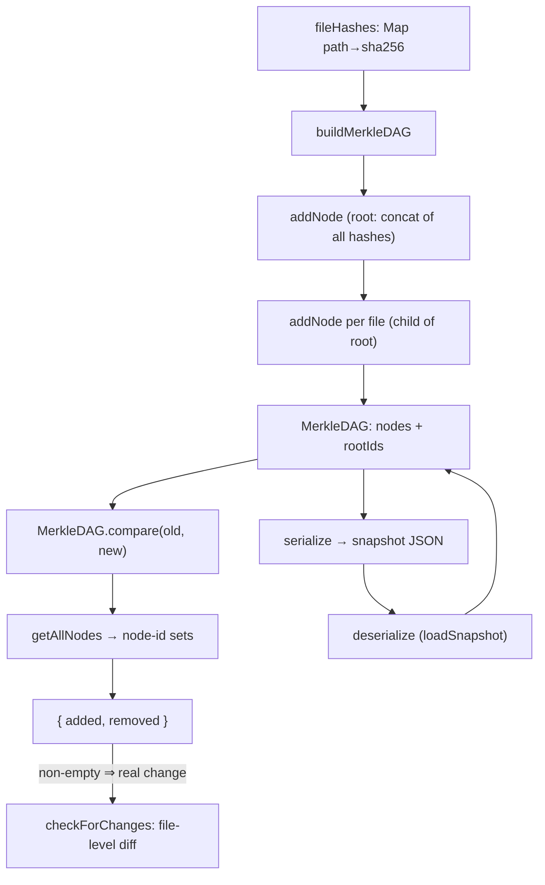

# Merkle-DAG change detection — the incremental-sync tripwire

<!-- connect:up:begin -->
> **Cross-repo concept:** part of [incremental-reconcile](../../../concepts/incremental-reconcile.md) across this wiki's repos.
<!-- connect:up:end -->
## Overview
This is how claude-context avoids re-embedding an entire codebase on every run: it fingerprints
the file tree into a small content-addressed graph, persists that graph, and on the next pass
rebuilds it and diffs the two. The key design idea is **content addressing** — a node's id *is*
the SHA-256 of its data ([`addNode`](../catalog/packages/core/src/sync/merkle.ts.md#MerkleDAG.addNode)),
so an unchanged file produces a byte-identical node across rebuilds and drops out of the diff for
free. The graph ([`MerkleDAG`](../catalog/packages/core/src/sync/merkle.ts.md#MerkleDAG)) is
deliberately shallow — one root plus one child per file — and its
[`compare`](../catalog/packages/core/src/sync/merkle.ts.md#MerkleDAG.compare) is a fast *did-anything-change*
gate, not the final diff: when it fires, the synchronizer falls through to a per-file comparison
to classify added / removed / **modified**.

## Diagram

## Design rationale (why it's built this way)
**Content addressing does the diffing.** Every node carries `id === hash === sha256(data)`
([`addNode`](../catalog/packages/core/src/sync/merkle.ts.md#MerkleDAG.addNode),
[`hash`](../catalog/packages/core/src/sync/merkle.ts.md#MerkleDAG.hash)), and nodes are keyed by
that id in a `Map` ([`nodes`](../catalog/packages/core/src/sync/merkle.ts.md#MerkleDAG.nodes)). So
identity is structural, not positional: two rebuilds of an untouched file yield the same id, and
[`compare`](../catalog/packages/core/src/sync/merkle.ts.md#MerkleDAG.compare) — a plain set
difference over ids — reports it as neither added nor removed. This is the classic content-addressed
incremental-reconcile substrate, the same idea git uses.

**The DAG is a tripwire, not the diff.** `compare` returns only
[`added`](../catalog/packages/core/src/sync/merkle.ts.md#MerkleDAG.compare.typeLiteral23.added) and
[`removed`](../catalog/packages/core/src/sync/merkle.ts.md#MerkleDAG.compare.typeLiteral23.removed)
— there is no `modified`. That is intentional: a *modified* file changes its child node's data
(`"path:hash"`), hence its id, so it surfaces as one removed id plus one added id. The DAG can
therefore tell you *something* changed but not *what kind*, which is exactly why
[`checkForChanges`](../catalog/packages/core/src/sync/synchronizer.ts.md#FileSynchronizer.checkForChanges)
only uses the DAG result as a boolean short-circuit and then does a separate file-level comparison
to split added / removed / modified.

**A root node makes the whole tree a single checksum.**
[`buildMerkleDAG`](../catalog/packages/core/src/sync/synchronizer.ts.md#FileSynchronizer.buildMerkleDAG)
first creates one root node whose data is the concatenation of every file hash, then hangs each file
off it as a child via [`addNode`](../catalog/packages/core/src/sync/merkle.ts.md#MerkleDAG.addNode)
with a `parentId`. Any add, remove, or edit perturbs that concatenation, so the root id alone
flips on any change — a compact global fingerprint sitting above the per-file nodes.

> [!inferred]
> Despite the "Merkle tree" framing, this structure does **not** buy the usual logarithmic
> subtree-skipping. It is only two levels deep (root → files), and
> [`compare`](../catalog/packages/core/src/sync/merkle.ts.md#MerkleDAG.compare) walks *all* nodes
> via [`getAllNodes`](../catalog/packages/core/src/sync/merkle.ts.md#MerkleDAG.getAllNodes) rather
> than descending only where hashes differ. In practice the DAG comparison and the fallback
> file-level comparison are both O(files); the DAG's real contribution is a cheap "nothing changed"
> exit and a persistable, content-addressed snapshot, not sublinear diffing.

## Entry points
- [`buildMerkleDAG`](../catalog/packages/core/src/sync/synchronizer.ts.md#FileSynchronizer.buildMerkleDAG)
  — the constructor of a fingerprint. Given a `path → sha256` map it builds a fresh
  [`MerkleDAG`](../catalog/packages/core/src/sync/merkle.ts.md#MerkleDAG): a root node over the
  concatenated hashes, then one child [`addNode`](../catalog/packages/core/src/sync/merkle.ts.md#MerkleDAG.addNode)
  per file in sorted-path order. Called both when priming state and on every change check.
- [`checkForChanges`](../catalog/packages/core/src/sync/synchronizer.ts.md#FileSynchronizer.checkForChanges)
  — the per-run entry. It rebuilds the DAG from the current tree and diffs it against the stored one
  via [`compare`](../catalog/packages/core/src/sync/merkle.ts.md#MerkleDAG.compare); this is where
  the Merkle machinery is actually consumed.
- [`loadSnapshot`](../catalog/packages/core/src/sync/synchronizer.ts.md#FileSynchronizer.loadSnapshot)
  — the cold-start entry. It rehydrates the previous DAG from disk through
  [`deserialize`](../catalog/packages/core/src/sync/merkle.ts.md#MerkleDAG.deserialize), or, if no
  snapshot exists, seeds one with [`buildMerkleDAG`](../catalog/packages/core/src/sync/synchronizer.ts.md#FileSynchronizer.buildMerkleDAG).

## Mechanism (step-by-step)
1. **Fingerprint the tree.**
   [`buildMerkleDAG`](../catalog/packages/core/src/sync/synchronizer.ts.md#FileSynchronizer.buildMerkleDAG)
   receives a `Map` of file path → content hash and instantiates an empty
   [`MerkleDAG`](../catalog/packages/core/src/sync/merkle.ts.md#MerkleDAG). It builds a `root:`
   string by concatenating every file's hash and adds it as the root node, then iterates files in
   sorted order adding each as a child of that root.
2. **Content-address each node.** Every
   [`addNode`](../catalog/packages/core/src/sync/merkle.ts.md#MerkleDAG.addNode) call runs the
   node's data through [`hash`](../catalog/packages/core/src/sync/merkle.ts.md#MerkleDAG.hash)
   (SHA-256) to get a `nodeId`, stores it in
   [`nodes`](../catalog/packages/core/src/sync/merkle.ts.md#MerkleDAG.nodes) keyed by that id, and
   wires parent/child links: with a `parentId`, it pushes into the child's
   [`parents`](../catalog/packages/core/src/sync/merkle.ts.md#MerkleDAGNode.parents) and the
   parent's [`children`](../catalog/packages/core/src/sync/merkle.ts.md#MerkleDAGNode.children);
   without one, the id is appended to
   [`rootIds`](../catalog/packages/core/src/sync/merkle.ts.md#MerkleDAG.rootIds). Each node stores
   its [`id`](../catalog/packages/core/src/sync/merkle.ts.md#MerkleDAGNode.id),
   [`hash`](../catalog/packages/core/src/sync/merkle.ts.md#MerkleDAGNode.hash) and original
   [`data`](../catalog/packages/core/src/sync/merkle.ts.md#MerkleDAGNode.data).
3. **Diff old against new.**
   [`checkForChanges`](../catalog/packages/core/src/sync/synchronizer.ts.md#FileSynchronizer.checkForChanges)
   builds a fresh DAG from the current filesystem and calls
   [`compare`](../catalog/packages/core/src/sync/merkle.ts.md#MerkleDAG.compare), which pulls both
   graphs' ids via [`getAllNodes`](../catalog/packages/core/src/sync/merkle.ts.md#MerkleDAG.getAllNodes),
   forms two id sets, and returns the set difference as
   [`added`](../catalog/packages/core/src/sync/merkle.ts.md#MerkleDAG.compare.typeLiteral23.added)
   and [`removed`](../catalog/packages/core/src/sync/merkle.ts.md#MerkleDAG.compare.typeLiteral23.removed).
4. **Short-circuit or classify.** If both lists are empty,
   [`checkForChanges`](../catalog/packages/core/src/sync/synchronizer.ts.md#FileSynchronizer.checkForChanges)
   returns "no changes" and does no further work. Otherwise it performs a file-level comparison of
   the old and new hash maps to produce the real `{ added, removed, modified }` classification,
   adopts the new DAG as current state, and persists it.
5. **Persist and restore.** State survives across runs by serializing the DAG —
   [`serialize`](../catalog/packages/core/src/sync/merkle.ts.md#MerkleDAG.serialize) flattens
   [`nodes`](../catalog/packages/core/src/sync/merkle.ts.md#MerkleDAG.nodes) to an entries array
   plus [`rootIds`](../catalog/packages/core/src/sync/merkle.ts.md#MerkleDAG.rootIds) — and rebuilding
   it on load via the static
   [`deserialize`](../catalog/packages/core/src/sync/merkle.ts.md#MerkleDAG.deserialize), which
   [`loadSnapshot`](../catalog/packages/core/src/sync/synchronizer.ts.md#FileSynchronizer.loadSnapshot)
   invokes on the JSON snapshot.

## Key data structures
- [`MerkleDAGNode`](../catalog/packages/core/src/sync/merkle.ts.md#MerkleDAGNode) — the unit of
  fingerprinting: `{ id, hash, data, parents[], children[] }`, where
  [`id`](../catalog/packages/core/src/sync/merkle.ts.md#MerkleDAGNode.id) and
  [`hash`](../catalog/packages/core/src/sync/merkle.ts.md#MerkleDAGNode.hash) are the same SHA-256
  and [`data`](../catalog/packages/core/src/sync/merkle.ts.md#MerkleDAGNode.data) is the preimage
  (`"root:…"` or `"path:hash"`). The
  [`parents`](../catalog/packages/core/src/sync/merkle.ts.md#MerkleDAGNode.parents) /
  [`children`](../catalog/packages/core/src/sync/merkle.ts.md#MerkleDAGNode.children) arrays make
  it a DAG rather than a bare set.
- [`MerkleDAG`](../catalog/packages/core/src/sync/merkle.ts.md#MerkleDAG) — holds
  [`nodes`](../catalog/packages/core/src/sync/merkle.ts.md#MerkleDAG.nodes), the id→node index that
  gives content-based dedup, and
  [`rootIds`](../catalog/packages/core/src/sync/merkle.ts.md#MerkleDAG.rootIds), the entry points.
  Accessors [`getNode`](../catalog/packages/core/src/sync/merkle.ts.md#MerkleDAG.getNode),
  [`getAllNodes`](../catalog/packages/core/src/sync/merkle.ts.md#MerkleDAG.getAllNodes),
  [`getRootNodes`](../catalog/packages/core/src/sync/merkle.ts.md#MerkleDAG.getRootNodes) and
  [`getLeafNodes`](../catalog/packages/core/src/sync/merkle.ts.md#MerkleDAG.getLeafNodes) expose it;
  only [`getAllNodes`](../catalog/packages/core/src/sync/merkle.ts.md#MerkleDAG.getAllNodes) is on
  the hot change-detection path (via [`compare`](../catalog/packages/core/src/sync/merkle.ts.md#MerkleDAG.compare)).

## Dynamics (design intent)
The Evidence table lists no tests exercising this subgraph, so behavior is read from source only.
The intended lifecycle is single-threaded and snapshot-oriented: a run
[`loadSnapshot`](../catalog/packages/core/src/sync/synchronizer.ts.md#FileSynchronizer.loadSnapshot)s
the last DAG, later calls
[`checkForChanges`](../catalog/packages/core/src/sync/synchronizer.ts.md#FileSynchronizer.checkForChanges)
to rebuild and [`compare`](../catalog/packages/core/src/sync/merkle.ts.md#MerkleDAG.compare), and
only on a detected change swaps in the new DAG and rewrites the snapshot. Ordering is made
deterministic on the child level by
[`buildMerkleDAG`](../catalog/packages/core/src/sync/synchronizer.ts.md#FileSynchronizer.buildMerkleDAG)
adding files in sorted-path order; because node identity is a content hash, sort order does not
affect ids anyway (the `Map` keys on hash), only iteration order of children.

## Edge cases
- **Modified files are invisible to `compare` as "modified."** They read out as a paired
  add + remove of node ids; distinguishing them requires the separate file-level comparison inside
  [`checkForChanges`](../catalog/packages/core/src/sync/synchronizer.ts.md#FileSynchronizer.checkForChanges).
- **Dangling parent id.** [`addNode`](../catalog/packages/core/src/sync/merkle.ts.md#MerkleDAG.addNode)
  only wires the parent/child link if the `parentId` already exists in
  [`nodes`](../catalog/packages/core/src/sync/merkle.ts.md#MerkleDAG.nodes); if it does not, the
  node is stored but left with empty
  [`parents`](../catalog/packages/core/src/sync/merkle.ts.md#MerkleDAGNode.parents) and is *not*
  added to [`rootIds`](../catalog/packages/core/src/sync/merkle.ts.md#MerkleDAG.rootIds) — an
  orphan. In the current [`buildMerkleDAG`](../catalog/packages/core/src/sync/synchronizer.ts.md#FileSynchronizer.buildMerkleDAG)
  flow this cannot happen because the root is always inserted first.
- **Trust in the snapshot format.**
  [`deserialize`](../catalog/packages/core/src/sync/merkle.ts.md#MerkleDAG.deserialize) assigns
  `data.nodes` and `data.rootIds` straight onto a fresh DAG with no validation, mirroring exactly
  what [`serialize`](../catalog/packages/core/src/sync/merkle.ts.md#MerkleDAG.serialize) wrote; a
  hand-edited or truncated snapshot would silently produce a malformed graph.

> [!inferred]
> The root node's data is built from the file hashes in the map's insertion order, whereas the
> per-file child nodes are added in *sorted* order
> ([`buildMerkleDAG`](../catalog/packages/core/src/sync/synchronizer.ts.md#FileSynchronizer.buildMerkleDAG)).
> Since the root id is a hash of that insertion-order concatenation, two runs that discover the same
> files in a different traversal order could produce different root ids and thus a spurious change
> signal from [`compare`](../catalog/packages/core/src/sync/merkle.ts.md#MerkleDAG.compare). The
> fallback file-level comparison would then correctly report zero real changes, so this is at most a
> lost short-circuit, not a wrong answer.

## Open questions
- The file-level classifier that actually produces `modified` (the `compareStates` helper referenced
  by [`checkForChanges`](../catalog/packages/core/src/sync/synchronizer.ts.md#FileSynchronizer.checkForChanges))
  is not in this subgraph, so its exact semantics are described from the caller's use rather than cited.
- `getRootNodes`, `getLeafNodes` and `getNode` are part of the public
  [`MerkleDAG`](../catalog/packages/core/src/sync/merkle.ts.md#MerkleDAG) surface but have no callers
  in this subgraph; whether any consumer uses the DAG as a navigable structure (versus a pure
  fingerprint) is unresolved here.

## See also
- [Merkle-DAG change detection — the incremental-sync tripwire](packages-core-src-sync-synchronizer.ts.md)
  — the `FileSynchronizer` companion that owns snapshot I/O, ignore filtering, and the file-level
  add/remove/modify classification this page's DAG gates.
- [AST splitter](packages-core-src-splitter-ast-splitter.ts.md) — what runs on the files this
  subsystem flags as changed, chunking them for re-embedding.
- [Context orchestrator](packages-core-src-context.ts.md) — the indexing pipeline that ties change
  detection to embedding and vector-store updates.
