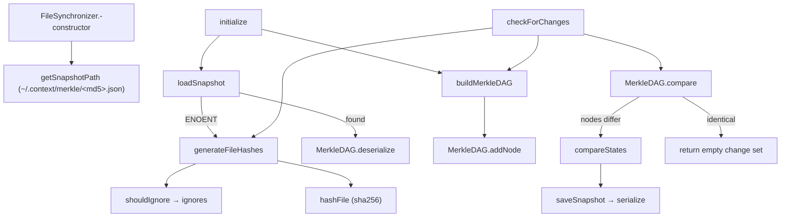

# FileSynchronizer — Merkle-snapshot incremental change detection

<!-- connect:up:begin -->
> **Cross-repo concept:** part of [incremental-reconcile](../../../concepts/incremental-reconcile.md) across this wiki's repos.
<!-- connect:up:end -->
## Overview
`FileSynchronizer` is the component that lets claude-context re-index a codebase without re-embedding
every file: it answers the question *"which files were added, removed, or modified since last time?"*.
It does this by content-hashing every eligible file into a `path → sha256` map, folding those hashes
into a shallow Merkle DAG (one root node over a leaf node per file), and persisting both to a snapshot
JSON keyed by the codebase's absolute path. On the next run it rebuilds the map from disk, compares the
old DAG against a freshly-computed one as a cheap "did anything change at all" gate, and — only when the
gate fires — runs an exact per-file diff to produce the three change lists the re-index loop consumes.
The single design idea is **content-addressed hashing plus a persisted snapshot**: file identity is its
content hash, so change detection is robust to clock skew / clones / `touch` and survives across process
restarts.

## Diagram

## Design rationale (why it's built this way)
**Two-stage detection: a cheap gate, then an exact diff.**
[`checkForChanges`](../catalog/packages/core/src/sync/synchronizer.ts.md#FileSynchronizer.checkForChanges)
first compares the whole-tree DAGs with
[`compare`](../catalog/packages/core/src/sync/merkle.ts.md#MerkleDAG.compare) and only falls through to
the file-by-file [`compareStates`](../catalog/packages/core/src/sync/synchronizer.ts.md#FileSynchronizer.compareStates)
when the DAG's node set actually differs. On a no-op run it returns an empty change set immediately and
never touches the snapshot file, so the common "nothing changed" case is fast and side-effect-free.

> [!inferred]
> Because a modified file changes its own leaf node's content hash, a modification surfaces at the DAG
> level as one node removed + one node added — so the `added || removed` gate in `checkForChanges` also
> catches pure modifications, even though the gate only inspects `added`/`removed` and not a `modified`
> bucket. The DAG comparison is O(n) over all node ids, the same order as `compareStates`, so the gate
> is best understood as an early-exit for the unchanged case rather than an asymptotic speedup.

**Content hashing, not mtime.**
[`hashFile`](../catalog/packages/core/src/sync/synchronizer.ts.md#FileSynchronizer.hashFile) reads each
file's bytes and takes a sha256. Identity is therefore the content itself — a file whose timestamp
changed but whose bytes did not is *not* reported as modified, and a checkout/clone that resets mtimes
does not spuriously invalidate the index. The cost is that every eligible file is read in full on every
check.

**The "DAG" is a two-level tree, and the leaves carry the real signal.**
[`buildMerkleDAG`](../catalog/packages/core/src/sync/synchronizer.ts.md#FileSynchronizer.buildMerkleDAG)
creates one root node whose data is `"root:"` + all file hashes concatenated, then one child leaf per
file with data `path + ":" + hash`. Each node id is `sha256(data)` via
[`addNode`](../catalog/packages/core/src/sync/merkle.ts.md#MerkleDAG.addNode), so nodes are
content-addressed and the leaf ids alone already encode the full `(path, content)` set. The general
[`MerkleDAG`](../catalog/packages/core/src/sync/merkle.ts.md#MerkleDAG) supports arbitrary
parents/children, but this builder never nests deeper than root→leaf, so there is no subtree-pruning
benefit — the comparison always enumerates every node.

**The snapshot is per-codebase and machine-global.**
[`getSnapshotPath`](../catalog/packages/core/src/sync/synchronizer.ts.md#FileSynchronizer.getSnapshotPath)
hashes the *absolute* codebase path with md5 and writes to `~/.context/merkle/<hash>.json`, so the
change-detection state lives outside the repo (survives `git clean`, shared across all indexers of that
path on the machine).

## Entry points
- [`<constructor>`](../catalog/packages/core/src/sync/synchronizer.ts.md#FileSynchronizer.-constructor) —
  wires the synchronizer to a codebase: records
  [`rootDir`](../catalog/packages/core/src/sync/synchronizer.ts.md#FileSynchronizer.rootDir), derives
  [`snapshotPath`](../catalog/packages/core/src/sync/synchronizer.ts.md#FileSynchronizer.snapshotPath),
  seeds empty [`fileHashes`](../catalog/packages/core/src/sync/synchronizer.ts.md#FileSynchronizer.fileHashes)
  / [`merkleDAG`](../catalog/packages/core/src/sync/synchronizer.ts.md#FileSynchronizer.merkleDAG), and
  builds the [`IgnoreMatcher`](../catalog/packages/core/src/utils/ignore-matcher.ts.md#IgnoreMatcher)
  from the caller's ignore patterns. It does no I/O — the object is inert until `initialize`.
- [`initialize`](../catalog/packages/core/src/sync/synchronizer.ts.md#FileSynchronizer.initialize) —
  called once before a codebase can be watched (the VS Code index command reaches it through
  [`execute`](../catalog/packages/vscode-extension/src/commands/indexCommand.ts.md#IndexCommand.execute)).
  It loads or bootstraps the snapshot, then rebuilds the in-memory DAG so state is consistent before the
  first `checkForChanges`.
- [`checkForChanges`](../catalog/packages/core/src/sync/synchronizer.ts.md#FileSynchronizer.checkForChanges) —
  the per-reindex entry point; the incremental re-index loop calls it and consumes the returned
  `{added, removed, modified}` to decide which chunks to delete and re-embed (the caller's result type is
  the [`modified`](../catalog/packages/core/src/context.ts.md#Context.reindexByChange.Promise.typeLiteral121.modified)
  count in `Context.reindexByChange`).

## Mechanism (step-by-step)
1. **Establish baseline state.**
   [`initialize`](../catalog/packages/core/src/sync/synchronizer.ts.md#FileSynchronizer.initialize) calls
   [`loadSnapshot`](../catalog/packages/core/src/sync/synchronizer.ts.md#FileSynchronizer.loadSnapshot),
   which reads the snapshot JSON, rehydrates
   [`fileHashes`](../catalog/packages/core/src/sync/synchronizer.ts.md#FileSynchronizer.fileHashes) into a
   fresh `Map`, and deserializes the stored DAG with
   [`deserialize`](../catalog/packages/core/src/sync/merkle.ts.md#MerkleDAG.deserialize). If the file is
   missing (`ENOENT`), it instead does a first full scan and persists it. Notably, `initialize` then
   *rebuilds* [`merkleDAG`](../catalog/packages/core/src/sync/synchronizer.ts.md#FileSynchronizer.merkleDAG)
   from the loaded hashes via
   [`buildMerkleDAG`](../catalog/packages/core/src/sync/synchronizer.ts.md#FileSynchronizer.buildMerkleDAG),
   so the just-deserialized DAG is immediately discarded in favor of a deterministically re-derived one.
2. **Scan the tree into a hash map.**
   [`generateFileHashes`](../catalog/packages/core/src/sync/synchronizer.ts.md#FileSynchronizer.generateFileHashes)
   recurses from `rootDir`, and for each entry calls
   [`shouldIgnore`](../catalog/packages/core/src/sync/synchronizer.ts.md#FileSynchronizer.shouldIgnore)
   *before* any filesystem stat — an ignored path is skipped with zero further access. Surviving files are
   filtered by [`supportedExtensions`](../catalog/packages/core/src/sync/synchronizer.ts.md#FileSynchronizer.supportedExtensions)
   (when non-empty) and hashed with
   [`hashFile`](../catalog/packages/core/src/sync/synchronizer.ts.md#FileSynchronizer.hashFile), yielding a
   `relativePath → sha256` map. Unreadable directories/files are logged and skipped rather than aborting
   the scan.
3. **Apply the ignore rules.**
   [`shouldIgnore`](../catalog/packages/core/src/sync/synchronizer.ts.md#FileSynchronizer.shouldIgnore)
   delegates to [`ignores`](../catalog/packages/core/src/utils/ignore-matcher.ts.md#IgnoreMatcher.ignores),
   which normalizes the path, rejects anything with a dotted segment via
   [`hasHiddenSegment`](../catalog/packages/core/src/utils/ignore-matcher.ts.md#IgnoreMatcher.hasHiddenSegment)
   (hidden files/dirs are always excluded), and otherwise consults the gitignore-style
   [`matcher`](../catalog/packages/core/src/utils/ignore-matcher.ts.md#IgnoreMatcher.matcher), testing a
   trailing-slash form for directories.
4. **Fold the map into a Merkle tree.**
   [`buildMerkleDAG`](../catalog/packages/core/src/sync/synchronizer.ts.md#FileSynchronizer.buildMerkleDAG)
   adds a root over the concatenated hashes, then a leaf per file (in sorted path order) with
   [`addNode`](../catalog/packages/core/src/sync/merkle.ts.md#MerkleDAG.addNode). Each `addNode` stores a
   [`MerkleDAGNode`](../catalog/packages/core/src/sync/merkle.ts.md#MerkleDAGNode) whose id is the sha256
   of its data, so identical content collapses to the same id and the node set is a content fingerprint of
   the whole tree.
5. **Gate on the DAG diff.**
   [`checkForChanges`](../catalog/packages/core/src/sync/synchronizer.ts.md#FileSynchronizer.checkForChanges)
   re-scans, rebuilds a new DAG, and calls
   [`compare`](../catalog/packages/core/src/sync/merkle.ts.md#MerkleDAG.compare), which set-diffs the two
   node-id sets (drawn from
   [`getAllNodes`](../catalog/packages/core/src/sync/merkle.ts.md#MerkleDAG.getAllNodes)). If nothing was
   added or removed at the node level, it returns an empty change set and stops.
6. **Diff files exactly, then commit the new baseline.**
   When the gate fires,
   [`compareStates`](../catalog/packages/core/src/sync/synchronizer.ts.md#FileSynchronizer.compareStates)
   walks the old and new hash maps to classify each path as added (new key), modified (key present, hash
   differs), or removed (key gone). `checkForChanges` then promotes the new map + DAG to be the live state
   and persists them with
   [`saveSnapshot`](../catalog/packages/core/src/sync/synchronizer.ts.md#FileSynchronizer.saveSnapshot),
   which serializes the DAG via
   [`serialize`](../catalog/packages/core/src/sync/merkle.ts.md#MerkleDAG.serialize). The returned lists
   are what the re-index loop uses to delete stale vectors and re-embed only the changed files.

## Key data structures
- **`fileHashes: Map<string,string>`** —
  [`fileHashes`](../catalog/packages/core/src/sync/synchronizer.ts.md#FileSynchronizer.fileHashes): the
  canonical baseline, `relativePath → sha256(content)`. This is the source of truth for the exact diff;
  the DAG is derived from it.
- **`merkleDAG: MerkleDAG`** —
  [`merkleDAG`](../catalog/packages/core/src/sync/synchronizer.ts.md#FileSynchronizer.merkleDAG): the
  fingerprint used for the cheap gate. Internally a
  [`MerkleDAG`](../catalog/packages/core/src/sync/merkle.ts.md#MerkleDAG) holds a
  [`nodes`](../catalog/packages/core/src/sync/merkle.ts.md#MerkleDAG.nodes) map and
  [`rootIds`](../catalog/packages/core/src/sync/merkle.ts.md#MerkleDAG.rootIds); each
  [`MerkleDAGNode`](../catalog/packages/core/src/sync/merkle.ts.md#MerkleDAGNode) records `id`/`hash`/
  `data`/`parents`/`children`.
- **Snapshot JSON** — the persisted `{ fileHashes: [...], merkleDAG: serialize() }` at
  [`snapshotPath`](../catalog/packages/core/src/sync/synchronizer.ts.md#FileSynchronizer.snapshotPath).
  Arrays (not `Map`s) are used so it round-trips through `JSON.stringify`; `loadSnapshot` rebuilds the
  `Map` by hand.
- **Change record** — the `{ added, removed, modified }` string arrays that `compareStates` returns and
  `checkForChanges` propagates.

## Dynamics (design intent)
The class is designed around a strict lifecycle: construct (no I/O) → `initialize` (load-or-bootstrap the
baseline) → repeated `checkForChanges` (each of which atomically swaps in the new baseline and persists
it before returning). State mutation of `fileHashes`/`merkleDAG` happens only inside `initialize` and the
change-committing branch of `checkForChanges`, so a caller holding one synchronizer per codebase sees a
consistent baseline between calls.

> [!inferred]
> There is no internal locking; correctness under concurrency depends on the caller (`Context`) not
> issuing overlapping `checkForChanges` for the same codebase. Nothing in this subgraph enforces that.

## Edge cases
- **First run / missing snapshot.**
  [`loadSnapshot`](../catalog/packages/core/src/sync/synchronizer.ts.md#FileSynchronizer.loadSnapshot)
  treats `ENOENT` as "bootstrap": it scans, builds, and saves. Any other read error is re-thrown.
- **Deserialized DAG is thrown away.**
  [`initialize`](../catalog/packages/core/src/sync/synchronizer.ts.md#FileSynchronizer.initialize) rebuilds
  the DAG from the loaded hashes after `loadSnapshot` already deserialized one, so the persisted DAG shape
  never actually drives a comparison — only the persisted `fileHashes` matter for continuity.
- **Symlinks and unreadable entries.**
  [`generateFileHashes`](../catalog/packages/core/src/sync/synchronizer.ts.md#FileSynchronizer.generateFileHashes)
  handles only regular files and directories; symlinks and special files are silently skipped, and
  stat/read failures are logged and skipped, not fatal.
- **Empty `supportedExtensions`.** When the list is empty, the extension filter is bypassed and *all*
  non-ignored files are hashed — [`supportedExtensions`](../catalog/packages/core/src/sync/synchronizer.ts.md#FileSynchronizer.supportedExtensions)
  acts as an allow-list only when populated.

> [!inferred]
> The root node's `data` concatenates hashes in `Map` iteration (scan) order while leaves are sorted, so
> if two scans enumerated the directory in different orders the *root* node id could differ even for an
> identical file set. That would trip the DAG gate, but the subsequent `compareStates` would find no
> per-file differences and return an empty change set (after a harmless snapshot re-save). Directory scan
> order is normally stable, so this is a latent quirk rather than an observed bug.

## Open questions
- The re-index consumer (`reindexByChange`, `processFileList`, `deleteFileChunks`) lives outside this
  subgraph, so how the returned change lists map onto vector-store deletes/inserts is only visible from
  the `Context` side (the `modified` count property is the single citable touchpoint here).
- `deleteSnapshot` (the static reset path) and `getFileHash` (a per-file accessor) exist on the class but
  are not in this packet's subgraph, so their callers and role in cache invalidation are not covered here.

## See also
- Sibling claude-context concept pages for the indexing pipeline (AST splitting →
  `multi-language-extraction`), the embedding/vector-store substrate, and the MCP-server search
  interface — this page is the `incremental-reconcile` half of that story.
