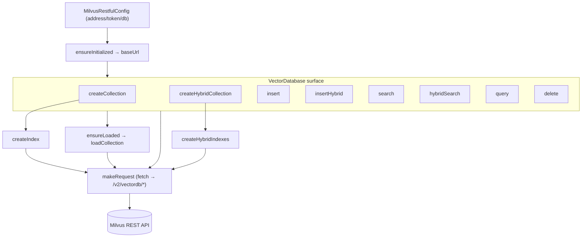

# MilvusRestfulVectorDatabase — the HTTP-only vector store for constrained runtimes

## Overview
This is the second of claude-context's two Milvus back-ends: a drop-in implementation of the
same vector-store contract that talks to Milvus purely over its `/v2/vectordb` REST API instead
of the gRPC SDK. The single design idea is *dependency minimalism* — the file's header docstring
says it is "specifically designed for environments with strict dependency constraints, e.g. VSCode
Extensions, Chrome Extensions," where "the standard Milvus gRPC implementation requires some
dependencies and modules that are not available or restricted." Everything routes through one
`fetch`-based helper, [`makeRequest`](../catalog/packages/core/src/vectordb/milvus-restful-vectordb.ts.md#MilvusRestfulVectorDatabase.makeRequest);
every public method is a thin translator between claude-context's grounding-substrate types
([`VectorDocument`](../catalog/packages/core/src/vectordb/types.ts.md#VectorDocument),
[`HybridSearchRequest`](../catalog/packages/core/src/vectordb/types.ts.md#HybridSearchRequest))
and Milvus's JSON request/response shapes. It implements exactly the same interface as the gRPC
back-end, so the indexing pipeline above it is oblivious to which one it holds.

## Diagram

## Design rationale (why it's built this way)
**REST exists because gRPC can't run everywhere.** The class-level docstring on
[`makeRequest`](../catalog/packages/core/src/vectordb/milvus-restful-vectordb.ts.md#MilvusRestfulVectorDatabase.makeRequest)'s
host class is explicit: "This implementation is designed for environments where gRPC is not
available, such as VSCode extensions or browser environments." gRPC needs HTTP/2 framing and
native/proto modules that a Chrome/VSCode extension sandbox forbids; a plain `fetch` to a JSON
endpoint needs none of that. So the two back-ends are a *portability* split, not a feature split —
they present the identical method set (compare the type-side
[`insert`](../catalog/packages/core/src/vectordb/types.ts.md#VectorDatabase.insert),
[`insertHybrid`](../catalog/packages/core/src/vectordb/types.ts.md#VectorDatabase.insertHybrid),
and [`hybridSearch`](../catalog/packages/core/src/vectordb/types.ts.md#VectorDatabase.hybridSearch)
declarations in `types.ts`) so the ingestion pipeline can pick one at startup and never branch again.

**One choke point for transport and auth.** Rather than scatter `fetch` calls, every operation
funnels through
[`makeRequest`](../catalog/packages/core/src/vectordb/milvus-restful-vectordb.ts.md#MilvusRestfulVectorDatabase.makeRequest),
which is the sole place that knows the URL prefix, sets `Content-Type: application/json`, attaches
the `Authorization` header, and normalizes Milvus's dual success convention (`code === 0 || code === 200`).
It reads its credentials off [`config`](../catalog/packages/core/src/vectordb/milvus-restful-vectordb.ts.md#MilvusRestfulVectorDatabase.config)
— a [`token`](../catalog/packages/core/src/vectordb/milvus-restful-vectordb.ts.md#MilvusRestfulConfig.token)
Bearer if present, else a
[`username`](../catalog/packages/core/src/vectordb/milvus-restful-vectordb.ts.md#MilvusRestfulConfig.username)/[`password`](../catalog/packages/core/src/vectordb/milvus-restful-vectordb.ts.md#MilvusRestfulConfig.password)
pair encoded as `Bearer user:pass`. Centralizing means every collection/entity/index call inherits
the same error handling for free.

**Async-constructor gate.** The constructor kicks off `initialize()` without awaiting it and stores
the promise in
[`initializationPromise`](../catalog/packages/core/src/vectordb/milvus-restful-vectordb.ts.md#MilvusRestfulVectorDatabase.initializationPromise);
every public method first awaits
[`ensureInitialized`](../catalog/packages/core/src/vectordb/milvus-restful-vectordb.ts.md#MilvusRestfulVectorDatabase.ensureInitialized).
This lets callers construct the DB synchronously (a token can be resolved to a cluster
[`address`](../catalog/packages/core/src/vectordb/milvus-restful-vectordb.ts.md#MilvusRestfulConfig)
via a network round-trip) while guaranteeing
[`baseUrl`](../catalog/packages/core/src/vectordb/milvus-restful-vectordb.ts.md#MilvusRestfulVectorDatabase.baseUrl)
is set before any request fires.

**Lazy load-on-demand.** Milvus requires a collection be loaded into memory before search/query.
[`ensureLoaded`](../catalog/packages/core/src/vectordb/milvus-restful-vectordb.ts.md#MilvusRestfulVectorDatabase.ensureLoaded)
checks `loadState` and only calls
[`loadCollection`](../catalog/packages/core/src/vectordb/milvus-restful-vectordb.ts.md#MilvusRestfulVectorDatabase.loadCollection)
when needed, so read paths self-heal without the pipeline tracking load state.

> [!inferred]
> The `Bearer user:pass` encoding is unusual (Basic auth normally base64-encodes `user:pass`).
> This is Zilliz/Milvus's own convention for its REST gateway, not standard HTTP Basic auth; the
> code passes the colon-joined string through verbatim.

## Entry points
- [`insert`](../catalog/packages/core/src/vectordb/milvus-restful-vectordb.ts.md#MilvusRestfulVectorDatabase.insert)
  and [`insertHybrid`](../catalog/packages/core/src/vectordb/milvus-restful-vectordb.ts.md#MilvusRestfulVectorDatabase.insertHybrid)
  — reached by the indexing pipeline once code chunks are embedded; they push a batch of
  [`VectorDocument`](../catalog/packages/core/src/vectordb/types.ts.md#VectorDocument) rows into a
  collection (dense-only vs. dense+sparse-BM25 collections respectively).
- [`search`](../catalog/packages/core/src/vectordb/milvus-restful-vectordb.ts.md#MilvusRestfulVectorDatabase.search)
  and [`hybridSearch`](../catalog/packages/core/src/vectordb/milvus-restful-vectordb.ts.md#MilvusRestfulVectorDatabase.hybridSearch)
  — the semantic-retrieval path hit when a coding agent queries; `search` does pure dense
  (COSINE) similarity, `hybridSearch` fuses a dense and a sparse channel described by
  [`HybridSearchRequest`](../catalog/packages/core/src/vectordb/types.ts.md#HybridSearchRequest).
- [`createCollection`](../catalog/packages/core/src/vectordb/milvus-restful-vectordb.ts.md#MilvusRestfulVectorDatabase.createCollection)
  / [`createHybridCollection`](../catalog/packages/core/src/vectordb/milvus-restful-vectordb.ts.md#MilvusRestfulVectorDatabase.createHybridCollection)
  — one-time schema setup for a repo's index, invoked before the first insert.
- [`makeRequest`](../catalog/packages/core/src/vectordb/milvus-restful-vectordb.ts.md#MilvusRestfulVectorDatabase.makeRequest)
  — the internal choke point every other method funnels through; not called from outside the class.

## Mechanism (step-by-step)
1. **Startup resolves an address and pins a base URL.** The constructor fires `initialize()` and
   stashes the pending promise in
   [`initializationPromise`](../catalog/packages/core/src/vectordb/milvus-restful-vectordb.ts.md#MilvusRestfulVectorDatabase.initializationPromise).
   Every method's first line is `await`
   [`ensureInitialized`](../catalog/packages/core/src/vectordb/milvus-restful-vectordb.ts.md#MilvusRestfulVectorDatabase.ensureInitialized),
   which blocks on that promise and throws if
   [`baseUrl`](../catalog/packages/core/src/vectordb/milvus-restful-vectordb.ts.md#MilvusRestfulVectorDatabase.baseUrl)
   is still null — the `<host>/v2/vectordb` prefix all endpoints hang off.

2. **A collection and its index are created from a hardcoded schema.**
   [`createCollection`](../catalog/packages/core/src/vectordb/milvus-restful-vectordb.ts.md#MilvusRestfulVectorDatabase.createCollection)
   POSTs a fixed field layout — `id` (VarChar primary), a `FloatVector` of the given dimension, plus
   `content`/`relativePath`/`startLine`/`endLine`/`fileExtension`/`metadata` scalar columns — under
   the [`database`](../catalog/packages/core/src/vectordb/milvus-restful-vectordb.ts.md#MilvusRestfulConfig.database)
   `dbName`, then calls
   [`createIndex`](../catalog/packages/core/src/vectordb/milvus-restful-vectordb.ts.md#MilvusRestfulVectorDatabase.createIndex)
   to build an `AUTOINDEX`/`COSINE` index on the vector field and
   [`loadCollection`](../catalog/packages/core/src/vectordb/milvus-restful-vectordb.ts.md#MilvusRestfulVectorDatabase.loadCollection).
   The hybrid variant
   [`createHybridCollection`](../catalog/packages/core/src/vectordb/milvus-restful-vectordb.ts.md#MilvusRestfulVectorDatabase.createHybridCollection)
   adds a `sparse_vector` field plus a server-side `BM25` function over `content`, then
   [`createHybridIndexes`](../catalog/packages/core/src/vectordb/milvus-restful-vectordb.ts.md#MilvusRestfulVectorDatabase.createHybridIndexes)
   builds two indexes (dense COSINE + sparse `SPARSE_INVERTED_INDEX`/BM25).

3. **Documents are flattened into Milvus entities on insert.**
   [`insert`](../catalog/packages/core/src/vectordb/milvus-restful-vectordb.ts.md#MilvusRestfulVectorDatabase.insert)
   maps each [`VectorDocument`](../catalog/packages/core/src/vectordb/types.ts.md#VectorDocument) to a
   row carrying its [`id`](../catalog/packages/core/src/vectordb/types.ts.md#VectorDocument.id),
   [`vector`](../catalog/packages/core/src/vectordb/types.ts.md#VectorDocument.vector),
   [`content`](../catalog/packages/core/src/vectordb/types.ts.md#VectorDocument.content),
   [`relativePath`](../catalog/packages/core/src/vectordb/types.ts.md#VectorDocument.relativePath),
   [`startLine`](../catalog/packages/core/src/vectordb/types.ts.md#VectorDocument.startLine)/[`endLine`](../catalog/packages/core/src/vectordb/types.ts.md#VectorDocument.endLine),
   and [`fileExtension`](../catalog/packages/core/src/vectordb/types.ts.md#VectorDocument.fileExtension) —
   crucially JSON-stringifying
   [`metadata`](../catalog/packages/core/src/vectordb/types.ts.md#VectorDocument.metadata) into a
   VarChar because the REST schema has no map column. It POSTs the batch to `/entities/insert`.
   [`insertHybrid`](../catalog/packages/core/src/vectordb/milvus-restful-vectordb.ts.md#MilvusRestfulVectorDatabase.insertHybrid)
   builds the same row shape (the server derives the sparse vector from `content` via the BM25
   function, so the client never sends one) and checks `response.code !== 0` explicitly.

4. **Dense search issues one request and rehydrates rows.** After
   [`ensureLoaded`](../catalog/packages/core/src/vectordb/milvus-restful-vectordb.ts.md#MilvusRestfulVectorDatabase.ensureLoaded),
   [`search`](../catalog/packages/core/src/vectordb/milvus-restful-vectordb.ts.md#MilvusRestfulVectorDatabase.search)
   wraps the query vector as `data: [queryVector]`, sets `annsField: "vector"`, `limit: topK`,
   `metricType: "COSINE"`, and requests the chunk output fields; an optional boolean `filterExpr`
   (e.g. `fileExtension in ['.ts','.py']`) is attached only when non-empty. It POSTs `/entities/search`,
   then reverses the insert transform — `JSON.parse`-ing the stringified metadata back into an object
   (defaulting to `{}` on parse failure) to reconstruct a result document.

5. **Hybrid search fuses two channels with server-side RRF reranking.**
   [`hybridSearch`](../catalog/packages/core/src/vectordb/milvus-restful-vectordb.ts.md#MilvusRestfulVectorDatabase.hybridSearch)
   reads a two-element
   [`HybridSearchRequest`](../catalog/packages/core/src/vectordb/types.ts.md#HybridSearchRequest)
   array: request `[0]` is the dense channel (its
   [`data`](../catalog/packages/core/src/vectordb/types.ts.md#HybridSearchRequest.data) wrapped to
   `[[...]]`, [`anns_field`](../catalog/packages/core/src/vectordb/types.ts.md#HybridSearchRequest.anns_field)
   `"vector"`, COSINE, default `nprobe: 10`), request `[1]` the sparse channel (`data` as
   `["query text"]`, `anns_field` `"sparse_vector"`, BM25, default `drop_ratio_search: 0.2`), each
   capped by its [`limit`](../catalog/packages/core/src/vectordb/types.ts.md#HybridSearchRequest.limit).
   A `HybridSearchOptions.`[`filterExpr`](../catalog/packages/core/src/vectordb/types.ts.md#HybridSearchOptions.filterExpr)
   is applied to *both* sub-searches, and a fixed `rrf` reranker (`k: 100`) plus a final
   [`limit`](../catalog/packages/core/src/vectordb/types.ts.md#HybridSearchOptions.limit) fuse the two
   result sets server-side. It POSTs `/entities/hybrid_search` and maps rows into
   [`HybridSearchResult`](../catalog/packages/core/src/vectordb/types.ts.md#HybridSearchResult) objects.

6. **Every wire call goes through the one helper.**
   [`makeRequest`](../catalog/packages/core/src/vectordb/milvus-restful-vectordb.ts.md#MilvusRestfulVectorDatabase.makeRequest)
   builds `${baseUrl}${endpoint}`, sets JSON headers, chooses Bearer-token vs. user:pass auth from
   [`config`](../catalog/packages/core/src/vectordb/milvus-restful-vectordb.ts.md#MilvusRestfulVectorDatabase.config),
   serializes the body for POST, `fetch`es, and rejects on a non-OK HTTP status or a Milvus `code`
   that is neither `0` nor `200`. The remaining collection ops —
   [`hasCollection`](../catalog/packages/core/src/vectordb/milvus-restful-vectordb.ts.md#MilvusRestfulVectorDatabase.hasCollection),
   [`listCollections`](../catalog/packages/core/src/vectordb/milvus-restful-vectordb.ts.md#MilvusRestfulVectorDatabase.listCollections),
   [`dropCollection`](../catalog/packages/core/src/vectordb/milvus-restful-vectordb.ts.md#MilvusRestfulVectorDatabase.dropCollection),
   [`getCollectionDescription`](../catalog/packages/core/src/vectordb/milvus-restful-vectordb.ts.md#MilvusRestfulVectorDatabase.getCollectionDescription),
   [`delete`](../catalog/packages/core/src/vectordb/milvus-restful-vectordb.ts.md#MilvusRestfulVectorDatabase.delete),
   [`query`](../catalog/packages/core/src/vectordb/milvus-restful-vectordb.ts.md#MilvusRestfulVectorDatabase.query),
   and [`getCollectionRowCount`](../catalog/packages/core/src/vectordb/milvus-restful-vectordb.ts.md#MilvusRestfulVectorDatabase.getCollectionRowCount)
   — are all one-liners over the same endpoint pattern.

## Key data structures
- [`MilvusRestfulConfig`](../catalog/packages/core/src/vectordb/milvus-restful-vectordb.ts.md#MilvusRestfulConfig)
  — the constructor input: optional `address`,
  [`token`](../catalog/packages/core/src/vectordb/milvus-restful-vectordb.ts.md#MilvusRestfulConfig.token),
  [`username`](../catalog/packages/core/src/vectordb/milvus-restful-vectordb.ts.md#MilvusRestfulConfig.username)/[`password`](../catalog/packages/core/src/vectordb/milvus-restful-vectordb.ts.md#MilvusRestfulConfig.password),
  and [`database`](../catalog/packages/core/src/vectordb/milvus-restful-vectordb.ts.md#MilvusRestfulConfig.database).
  `database` is threaded as `dbName` into essentially every request body.
- [`VectorDocument`](../catalog/packages/core/src/vectordb/types.ts.md#VectorDocument) — the shared
  grounding record (chunk text + embedding + source-location fields) defined in `vectordb-types`,
  identical for both back-ends. Its
  [`metadata`](../catalog/packages/core/src/vectordb/types.ts.md#VectorDocument.metadata) map is the
  one field that must round-trip through JSON-string encoding on this transport.
- [`HybridSearchRequest`](../catalog/packages/core/src/vectordb/types.ts.md#HybridSearchRequest) /
  [`HybridSearchOptions`](../catalog/packages/core/src/vectordb/types.ts.md#HybridSearchOptions) /
  [`HybridSearchResult`](../catalog/packages/core/src/vectordb/types.ts.md#HybridSearchResult) — the
  per-channel query spec (with [`param`](../catalog/packages/core/src/vectordb/types.ts.md#HybridSearchRequest.param)
  overrides), the fusion knobs, and the scored output.
- Runtime state:
  [`baseUrl`](../catalog/packages/core/src/vectordb/milvus-restful-vectordb.ts.md#MilvusRestfulVectorDatabase.baseUrl)
  (null until initialized) and
  [`initializationPromise`](../catalog/packages/core/src/vectordb/milvus-restful-vectordb.ts.md#MilvusRestfulVectorDatabase.initializationPromise)
  are the only mutable per-instance fields beyond
  [`config`](../catalog/packages/core/src/vectordb/milvus-restful-vectordb.ts.md#MilvusRestfulVectorDatabase.config).

## Dynamics (design intent)
The class is stateless per request: after the one-time async init, each call is independent and
re-derives everything from arguments plus `config`, so concurrent inserts/searches don't share
mutable state beyond the load-check in
[`ensureLoaded`](../catalog/packages/core/src/vectordb/milvus-restful-vectordb.ts.md#MilvusRestfulVectorDatabase.ensureLoaded).
Ordering intent is expressed by the two await-gates: `ensureInitialized` before *any* call and
`ensureLoaded` before search/query/insert — both idempotent, so callers need not sequence them.
The [`hybridSearch`](../catalog/packages/core/src/vectordb/milvus-restful-vectordb.ts.md#MilvusRestfulVectorDatabase.hybridSearch)
dense and sparse sub-searches are not run as separate round-trips by the client; they are packed
into a single `/entities/hybrid_search` body and fused server-side, so reranking parallelism is
Milvus's concern, not this code's. (No tests in the configured paths reference this subgraph.)

## Edge cases
- **Metadata JSON round-trip.** Insert stringifies
  [`metadata`](../catalog/packages/core/src/vectordb/types.ts.md#VectorDocument.metadata); search
  `JSON.parse`s it back and swallows parse errors into `{}`. Malformed stored metadata silently
  degrades to empty rather than failing the whole query.
- **Dual success codes.**
  [`makeRequest`](../catalog/packages/core/src/vectordb/milvus-restful-vectordb.ts.md#MilvusRestfulVectorDatabase.makeRequest)
  treats both `0` and `200` as success because different Milvus REST endpoints disagree on the
  convention; several callers (e.g.
  [`insertHybrid`](../catalog/packages/core/src/vectordb/milvus-restful-vectordb.ts.md#MilvusRestfulVectorDatabase.insertHybrid),
  [`query`](../catalog/packages/core/src/vectordb/milvus-restful-vectordb.ts.md#MilvusRestfulVectorDatabase.query))
  *additionally* re-check `code !== 0`, so a `200`-with-error could pass the helper but be caught
  by the caller.
- **Hybrid search assumes exactly two channels.**
  [`hybridSearch`](../catalog/packages/core/src/vectordb/milvus-restful-vectordb.ts.md#MilvusRestfulVectorDatabase.hybridSearch)
  indexes `searchRequests[0]` and `searchRequests[1]` directly; a request array with fewer than two
  entries would throw on undefined access. The reranker (`rrf`, `k:100`) is hardcoded and ignores
  any caller-supplied rerank strategy in
  [`HybridSearchOptions`](../catalog/packages/core/src/vectordb/types.ts.md#HybridSearchOptions).
- **Row count avoids stale stats.**
  [`getCollectionRowCount`](../catalog/packages/core/src/vectordb/milvus-restful-vectordb.ts.md#MilvusRestfulVectorDatabase.getCollectionRowCount)
  uses `count(*)` via `/entities/query` (and loads the collection first) rather than cached
  segment stats, returning `-1` for "unknown" so recovery logic doesn't mistake a freshly-indexed
  collection for an empty one.

## Open questions
- `checkCollectionLimit` is declared on the interface but its REST implementation is a stub that
  always returns `true` (per the source `TODO`); it is not in this subgraph, so its wiring to the
  gRPC-side limit handling isn't traced here.
- The address-resolution path (token → cluster URL via `ClusterManager`) and the collection-limit
  wrapper `createCollectionWithLimitCheck` are outside the subgraph; how `createCollection` surfaces
  the `COLLECTION_LIMIT_MESSAGE` isn't cited on this page.
- Which higher-level component selects this back-end vs. the gRPC one (and on what signal) lives in
  the pipeline/factory layer, not this file.

## See also
- Sibling claude-context concept pages under `wiki/code/claude-context/concepts/` — the gRPC Milvus
  back-end (same `VectorDatabase` contract), the AST-splitter/embedding stages that produce the
  [`VectorDocument`](../catalog/packages/core/src/vectordb/types.ts.md#VectorDocument) rows this
  store persists, and the semantic-search / MCP entry points that call
  [`search`](../catalog/packages/core/src/vectordb/milvus-restful-vectordb.ts.md#MilvusRestfulVectorDatabase.search)
  and [`hybridSearch`](../catalog/packages/core/src/vectordb/milvus-restful-vectordb.ts.md#MilvusRestfulVectorDatabase.hybridSearch).
- `vectordb-types` (`packages/core/src/vectordb/types.ts`) — the interface and record types
  ([`insert`](../catalog/packages/core/src/vectordb/types.ts.md#VectorDatabase.insert),
  [`hybridSearch`](../catalog/packages/core/src/vectordb/types.ts.md#VectorDatabase.hybridSearch))
  both back-ends implement.
