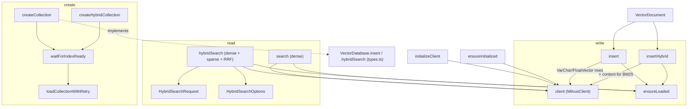

# Milvus VectorDatabase — the gRPC/SDK grounding substrate (collections, insert, dense + BM25 hybrid search)

## Overview
This is where claude-context's *grounding substrate* actually lives: unlike wikify-repo (SCIP
symbol graph) or graphify (knowledge graph), claude-context makes a codebase searchable by
storing code chunks as **embeddings in a Milvus vector store** and retrieving them by vector
similarity. `MilvusVectorDatabase` is the concrete, gRPC/SDK-backed implementation of the
tool-neutral `VectorDatabase` contract declared in `types.ts` — the interface every indexer and
the MCP search path talks to. Two parallel schemas coexist: a **dense-only** collection
([`createCollection`](../catalog/packages/core/src/vectordb/milvus-vectordb.ts.md#MilvusVectorDatabase.createCollection))
searched by cosine similarity, and a **hybrid** collection
([`createHybridCollection`](../catalog/packages/core/src/vectordb/milvus-vectordb.ts.md#MilvusVectorDatabase.createHybridCollection))
that adds a BM25-derived sparse vector so a query can be matched *both* semantically (dense) and
lexically (keyword), then fused. The single design idea worth carrying away: the same
[`VectorDocument`](../catalog/packages/core/src/vectordb/types.ts.md#VectorDocument) — id, embedding,
raw content, and the file/line provenance that lets a result point back at source — is the atom
written on insert and reconstructed on search.

## Diagram

## Design rationale (why it's built this way)
The class `implements VectorDatabase`, so the interface in `types.ts` — e.g.
[`insert`](../catalog/packages/core/src/vectordb/types.ts.md#VectorDatabase.insert) and
[`hybridSearch`](../catalog/packages/core/src/vectordb/types.ts.md#VectorDatabase.hybridSearch) —
is the contract; Milvus is one interchangeable backend behind it. That indirection is what lets
the survey compare claude-context's *embeddings + vector search* grounding against the other
tools' static-analysis grounding: retrieval here is approximate-nearest-neighbor over dense
vectors, not a call-graph walk.

The hybrid path exists because pure dense retrieval misses exact-token matches (an identifier, an
error string). [`createHybridCollection`](../catalog/packages/core/src/vectordb/milvus-vectordb.ts.md#MilvusVectorDatabase.createHybridCollection)
declares the `content` field with `enable_analyzer: true` and attaches a server-side `BM25`
function that emits a `sparse_vector` field — so **Milvus itself computes the sparse/BM25 vector
from the stored text**; the client never ships a sparse embedding. That is why
[`insertHybrid`](../catalog/packages/core/src/vectordb/milvus-vectordb.ts.md#MilvusVectorDatabase.insertHybrid)
writes exactly the same columns as the dense
[`insert`](../catalog/packages/core/src/vectordb/milvus-vectordb.ts.md#MilvusVectorDatabase.insert)
and never populates `sparse_vector` — the BM25 index is derived, not supplied.

Two guardrails reflect hard-won operational scars. Milvus builds indexes and loads collections
asynchronously, so create is not "done" when `createCollection` returns:
[`waitForIndexReady`](../catalog/packages/core/src/vectordb/milvus-vectordb.ts.md#MilvusVectorDatabase.waitForIndexReady)
polls `getIndexBuildProgress` with exponential backoff, and even swallows a known false error
("index duplicates[indexName=]") that older Milvus returns for sparse indexes, treating it as
ready. Loading is separately flaky, so
[`loadCollectionWithRetry`](../catalog/packages/core/src/vectordb/milvus-vectordb.ts.md#MilvusVectorDatabase.loadCollectionWithRetry)
retries `loadCollection` up to five times with backoff. Both are docstring-stated intent
("Wait for an index to be ready before proceeding"; "Load collection with retry logic and
exponential backoff").

## Entry points
- [`createCollection`](../catalog/packages/core/src/vectordb/milvus-vectordb.ts.md#MilvusVectorDatabase.createCollection) /
  [`createHybridCollection`](../catalog/packages/core/src/vectordb/milvus-vectordb.ts.md#MilvusVectorDatabase.createHybridCollection)
  — reached when the indexer first provisions storage for a codebase; they define the schema,
  create the vector index(es), wait for readiness, and load the collection into memory.
- [`insert`](../catalog/packages/core/src/vectordb/milvus-vectordb.ts.md#MilvusVectorDatabase.insert) /
  [`insertHybrid`](../catalog/packages/core/src/vectordb/milvus-vectordb.ts.md#MilvusVectorDatabase.insertHybrid)
  — reached per batch of chunked-and-embedded code, satisfying the interface's
  [`insert`](../catalog/packages/core/src/vectordb/types.ts.md#VectorDatabase.insert) /
  [`insertHybrid`](../catalog/packages/core/src/vectordb/types.ts.md#VectorDatabase.insertHybrid).
- [`search`](../catalog/packages/core/src/vectordb/milvus-vectordb.ts.md#MilvusVectorDatabase.search)
  — the dense semantic-retrieval path: a query embedding in, ranked
  [`VectorDocument`](../catalog/packages/core/src/vectordb/types.ts.md#VectorDocument) hits out.
- [`hybridSearch`](../catalog/packages/core/src/vectordb/milvus-vectordb.ts.md#MilvusVectorDatabase.hybridSearch)
  — the fused dense+sparse path, implementing
  [`hybridSearch`](../catalog/packages/core/src/vectordb/types.ts.md#VectorDatabase.hybridSearch);
  this is what the MCP search tool calls against a hybrid collection.
- Auxiliary lifecycle/introspection surface also on the interface:
  [`hasCollection`](../catalog/packages/core/src/vectordb/milvus-vectordb.ts.md#MilvusVectorDatabase.hasCollection),
  [`listCollections`](../catalog/packages/core/src/vectordb/milvus-vectordb.ts.md#MilvusVectorDatabase.listCollections),
  [`dropCollection`](../catalog/packages/core/src/vectordb/milvus-vectordb.ts.md#MilvusVectorDatabase.dropCollection),
  [`delete`](../catalog/packages/core/src/vectordb/milvus-vectordb.ts.md#MilvusVectorDatabase.delete),
  [`query`](../catalog/packages/core/src/vectordb/milvus-vectordb.ts.md#MilvusVectorDatabase.query),
  [`getCollectionRowCount`](../catalog/packages/core/src/vectordb/milvus-vectordb.ts.md#MilvusVectorDatabase.getCollectionRowCount),
  and [`getCollectionDescription`](../catalog/packages/core/src/vectordb/milvus-vectordb.ts.md#MilvusVectorDatabase.getCollectionDescription).

## Mechanism (step-by-step)
1. **Connect lazily, gate every op on readiness.** The constructor kicks off connection without
   awaiting; [`initializeClient`](../catalog/packages/core/src/vectordb/milvus-vectordb.ts.md#MilvusVectorDatabase.initializeClient)
   constructs the gRPC `MilvusClient` (address, credentials, ssl) and stores it in
   [`client`](../catalog/packages/core/src/vectordb/milvus-vectordb.ts.md#MilvusVectorDatabase.client).
   Every public method first `await`s
   [`ensureInitialized`](../catalog/packages/core/src/vectordb/milvus-vectordb.ts.md#MilvusVectorDatabase.ensureInitialized),
   which awaits the shared
   [`initializationPromise`](../catalog/packages/core/src/vectordb/milvus-vectordb.ts.md#MilvusVectorDatabase.initializationPromise)
   and then asserts the client is non-null — so callers can fire requests immediately after
   construction and they queue behind the connect.
2. **Provision a dense collection.**
   [`createCollection`](../catalog/packages/core/src/vectordb/milvus-vectordb.ts.md#MilvusVectorDatabase.createCollection)
   declares a fixed schema — a VarChar primary key `id`, a `FloatVector` of the given `dimension`,
   plus `content`, `relativePath`, `startLine`/`endLine`, `fileExtension`, and a JSON `metadata`
   string — mirroring [`VectorDocument`](../catalog/packages/core/src/vectordb/types.ts.md#VectorDocument).
   It then creates an `AUTOINDEX`/`COSINE` index on `vector`, blocks on
   [`waitForIndexReady`](../catalog/packages/core/src/vectordb/milvus-vectordb.ts.md#MilvusVectorDatabase.waitForIndexReady),
   and finally memory-loads via
   [`loadCollectionWithRetry`](../catalog/packages/core/src/vectordb/milvus-vectordb.ts.md#MilvusVectorDatabase.loadCollectionWithRetry).
3. **Provision a hybrid collection.**
   [`createHybridCollection`](../catalog/packages/core/src/vectordb/milvus-vectordb.ts.md#MilvusVectorDatabase.createHybridCollection)
   adds a `sparse_vector` (`SparseFloatVector`) field and marks `content` with an analyzer, then
   registers a server-side BM25 function mapping `content → sparse_vector`. It builds *two*
   indexes — `AUTOINDEX`/`COSINE` on the dense `vector` and `SPARSE_INVERTED_INDEX`/`BM25` on
   `sparse_vector` — each gated by its own
   [`waitForIndexReady`](../catalog/packages/core/src/vectordb/milvus-vectordb.ts.md#MilvusVectorDatabase.waitForIndexReady)
   before the single load.
4. **Write chunks.**
   [`insert`](../catalog/packages/core/src/vectordb/milvus-vectordb.ts.md#MilvusVectorDatabase.insert)
   maps each [`VectorDocument`](../catalog/packages/core/src/vectordb/types.ts.md#VectorDocument)
   to a row carrying its
   [`id`](../catalog/packages/core/src/vectordb/types.ts.md#VectorDocument.id),
   [`vector`](../catalog/packages/core/src/vectordb/types.ts.md#VectorDocument.vector),
   [`content`](../catalog/packages/core/src/vectordb/types.ts.md#VectorDocument.content),
   [`relativePath`](../catalog/packages/core/src/vectordb/types.ts.md#VectorDocument.relativePath),
   [`startLine`](../catalog/packages/core/src/vectordb/types.ts.md#VectorDocument.startLine)/[`endLine`](../catalog/packages/core/src/vectordb/types.ts.md#VectorDocument.endLine),
   [`fileExtension`](../catalog/packages/core/src/vectordb/types.ts.md#VectorDocument.fileExtension),
   and a JSON-stringified
   [`metadata`](../catalog/packages/core/src/vectordb/types.ts.md#VectorDocument.metadata), then
   bulk-inserts. [`insertHybrid`](../catalog/packages/core/src/vectordb/milvus-vectordb.ts.md#MilvusVectorDatabase.insertHybrid)
   writes the *same* columns — no sparse vector — because the BM25 function derives it from
   `content` on the server. Both first
   [`ensureLoaded`](../catalog/packages/core/src/vectordb/milvus-vectordb.ts.md#MilvusVectorDatabase.ensureLoaded).
5. **Dense search.**
   [`search`](../catalog/packages/core/src/vectordb/milvus-vectordb.ts.md#MilvusVectorDatabase.search)
   sends the single query vector with `limit = topK`, the fixed `output_fields`, and an optional
   boolean `expr` filter, then maps each Milvus hit back into a
   [`VectorDocument`](../catalog/packages/core/src/vectordb/types.ts.md#VectorDocument) plus a
   score — re-parsing the JSON `metadata` (warning, not throwing, on malformed JSON).
6. **Hybrid search + RRF fusion.**
   [`hybridSearch`](../catalog/packages/core/src/vectordb/milvus-vectordb.ts.md#MilvusVectorDatabase.hybridSearch)
   consumes two [`HybridSearchRequest`](../catalog/packages/core/src/vectordb/types.ts.md#HybridSearchRequest)
   entries — request `[0]` targets the dense field, request `[1]` targets `sparse_vector` — each
   carrying its own [`data`](../catalog/packages/core/src/vectordb/types.ts.md#HybridSearchRequest.data)
   (vector or query text), [`anns_field`](../catalog/packages/core/src/vectordb/types.ts.md#HybridSearchRequest.anns_field),
   [`param`](../catalog/packages/core/src/vectordb/types.ts.md#HybridSearchRequest.param), and
   [`limit`](../catalog/packages/core/src/vectordb/types.ts.md#HybridSearchRequest.limit). It
   submits both sub-searches in one `client.search` call with a hardcoded **RRF (`k=100`)** rerank
   strategy, honoring the top-level
   [`limit`](../catalog/packages/core/src/vectordb/types.ts.md#HybridSearchOptions.limit) and
   [`filterExpr`](../catalog/packages/core/src/vectordb/types.ts.md#HybridSearchOptions.filterExpr)
   from [`HybridSearchOptions`](../catalog/packages/core/src/vectordb/types.ts.md#HybridSearchOptions),
   and returns fused
   [`HybridSearchResult`](../catalog/packages/core/src/vectordb/types.ts.md#HybridSearchResult) rows.

## Key data structures
- [`VectorDocument`](../catalog/packages/core/src/vectordb/types.ts.md#VectorDocument) — the write/read
  atom. Its file-provenance fields
  ([`relativePath`](../catalog/packages/core/src/vectordb/types.ts.md#VectorDocument.relativePath),
  [`startLine`](../catalog/packages/core/src/vectordb/types.ts.md#VectorDocument.startLine),
  [`endLine`](../catalog/packages/core/src/vectordb/types.ts.md#VectorDocument.endLine)) are what let a
  semantic hit resolve to a concrete source span for the agent.
- [`HybridSearchRequest`](../catalog/packages/core/src/vectordb/types.ts.md#HybridSearchRequest) — one
  per vector field; the `data | anns_field | param | limit` shape is the neutral form
  `hybridSearch` translates into Milvus's per-field `search_param`.
- [`HybridSearchOptions`](../catalog/packages/core/src/vectordb/types.ts.md#HybridSearchOptions) and
  [`HybridSearchResult`](../catalog/packages/core/src/vectordb/types.ts.md#HybridSearchResult) — the
  fusion knobs (overall limit, filter, rerank) and the scored output.
- [`client`](../catalog/packages/core/src/vectordb/milvus-vectordb.ts.md#MilvusVectorDatabase.client) and
  [`initializationPromise`](../catalog/packages/core/src/vectordb/milvus-vectordb.ts.md#MilvusVectorDatabase.initializationPromise)
  — the connection handle and the readiness barrier every method awaits.

## Dynamics (design intent)
Readiness is enforced by two barriers, in order. Structurally,
[`ensureInitialized`](../catalog/packages/core/src/vectordb/milvus-vectordb.ts.md#MilvusVectorDatabase.ensureInitialized)
("Ensure initialization is complete before method execution") gates on connection, and
[`ensureLoaded`](../catalog/packages/core/src/vectordb/milvus-vectordb.ts.md#MilvusVectorDatabase.ensureLoaded)
("Ensure collection is loaded before search/query operations") checks `getLoadState` and loads on
demand — read/write ops await both, while pure metadata ops (`hasCollection`, `listCollections`,
`dropCollection`) await only initialization. Index/load flakiness is absorbed by the two backoff
loops ([`waitForIndexReady`](../catalog/packages/core/src/vectordb/milvus-vectordb.ts.md#MilvusVectorDatabase.waitForIndexReady),
[`loadCollectionWithRetry`](../catalog/packages/core/src/vectordb/milvus-vectordb.ts.md#MilvusVectorDatabase.loadCollectionWithRetry)),
whose bounds are their default parameters (60s / 5 retries).

## Edge cases
- **`hybridSearch` positional coupling.** It indexes `searchRequests[0]` and `[1]` directly, so
  the dense-then-sparse ordering and exactly-two-request shape are an unchecked precondition of
  [`hybridSearch`](../catalog/packages/core/src/vectordb/milvus-vectordb.ts.md#MilvusVectorDatabase.hybridSearch).
- **Empty vs. filtered `query`.**
  [`query`](../catalog/packages/core/src/vectordb/milvus-vectordb.ts.md#MilvusVectorDatabase.query)
  omits an empty/whitespace filter (an empty string is falsy and would make the SDK return nothing)
  and injects a default `limit` of 16384 when unfiltered, because Milvus requires a limit without a
  filter expression.
- **Malformed metadata is non-fatal.** Both
  [`search`](../catalog/packages/core/src/vectordb/milvus-vectordb.ts.md#MilvusVectorDatabase.search)
  and [`hybridSearch`](../catalog/packages/core/src/vectordb/milvus-vectordb.ts.md#MilvusVectorDatabase.hybridSearch)
  catch a `JSON.parse` failure on the stored `metadata` string and warn, returning `{}` rather
  than dropping the hit.
- **Row count degrades to `-1`.**
  [`getCollectionRowCount`](../catalog/packages/core/src/vectordb/milvus-vectordb.ts.md#MilvusVectorDatabase.getCollectionRowCount)
  returns `-1` (never throws) for a missing collection, a failed `count(*)`, or an unparseable
  value — a sentinel callers must special-case.
- **`waitForIndexReady` treats a known false error as success** for older-Milvus sparse indexes,
  which could mask a genuine failure whose reason string happens to match.

## Open questions
- Where the RRF `k=100` and the per-field `param` defaults (`nprobe`, `drop_ratio_search` seen in
  comments) are tuned, and whether they are ever overridden by callers — those knobs are literals
  inside [`hybridSearch`](../catalog/packages/core/src/vectordb/milvus-vectordb.ts.md#MilvusVectorDatabase.hybridSearch),
  not surfaced through [`HybridSearchOptions`](../catalog/packages/core/src/vectordb/types.ts.md#HybridSearchOptions).
- How embeddings are produced upstream and which caller decides dense-vs-hybrid collection: not in
  this subgraph. See the embedding/splitter and context orchestration concept pages.
- The full `checkCollectionLimit` /
  [`checkCollectionLimit`](../catalog/packages/core/src/vectordb/milvus-vectordb.ts.md#MilvusVectorDatabase.checkCollectionLimit)
  timeout-and-cleanup path (a probe collection to detect the managed-Zilliz collection cap) is only
  partially in the packet snippet; its full behavior lives in the module catalog.

## See also
- The `VectorDatabase` interface and `VectorDocument` shape in
  [`packages/core/src/vectordb/types.ts`](../catalog/packages/core/src/vectordb/types.ts.md) — the
  contract this class implements and points every citation of the neutral form back to.
- Sibling claude-context concepts: the AST splitter / chunking, the embedding providers, the
  Merkle-tree incremental synchronizer, and the MCP-server search interface that ultimately calls
  [`search`](../catalog/packages/core/src/vectordb/milvus-vectordb.ts.md#MilvusVectorDatabase.search) /
  [`hybridSearch`](../catalog/packages/core/src/vectordb/milvus-vectordb.ts.md#MilvusVectorDatabase.hybridSearch).
</content>
</invoke>
