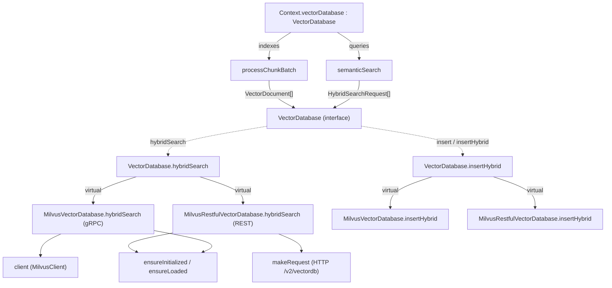

# The VectorDatabase contract — claude-context's grounding substrate

## Overview
`vectordb/types.ts` is where claude-context declares *what a vector store must do* so the rest of
the engine never has to know which store it is. The single interface
[`VectorDatabase`](../catalog/packages/core/src/vectordb/types.ts.md#VectorDatabase) and its data
types — [`VectorDocument`](../catalog/packages/core/src/vectordb/types.ts.md#VectorDocument),
[`HybridSearchRequest`](../catalog/packages/core/src/vectordb/types.ts.md#HybridSearchRequest),
[`HybridSearchResult`](../catalog/packages/core/src/vectordb/types.ts.md#HybridSearchResult) — are
the seam between the indexing/search pipeline (the `Context` class) and two interchangeable Milvus
backends: a gRPC client
([`MilvusVectorDatabase`](../catalog/packages/core/src/vectordb/milvus-vectordb.ts.md#MilvusVectorDatabase))
and a REST client
([`MilvusRestfulVectorDatabase`](../catalog/packages/core/src/vectordb/milvus-restful-vectordb.ts.md#MilvusRestfulVectorDatabase)).
This is the survey's answer to *"what does claude-context ground its comprehension on?"*: not a SCIP
symbol table and not a knowledge graph, but **dense embeddings plus a sparse BM25 field stored in a
vector database**, retrieved by hybrid similarity. Everything else in the tool feeds this contract or
reads from it.

## Diagram

## Design rationale (why it's built this way)
**One interface, two transports, because one transport doesn't run everywhere.** The whole reason
[`VectorDatabase`](../catalog/packages/core/src/vectordb/types.ts.md#VectorDatabase) exists as an
interface rather than a concrete class is that claude-context ships in environments the native gRPC
SDK cannot reach. The REST backend's own docstring states the motive:
[`MilvusRestfulVectorDatabase`](../catalog/packages/core/src/vectordb/milvus-restful-vectordb.ts.md#MilvusRestfulVectorDatabase)
is "designed for environments where gRPC is not available, such as VSCode extensions or browser
environments." Both classes `implements VectorDatabase`, so `Context` binds to the abstract type via
its [`vectorDatabase`](../catalog/packages/core/src/context.ts.md#Context.vectorDatabase) field and
every call dispatches virtually to whichever backend was injected.

**Dense and sparse are two documents-into-one-store, not two stores.** The contract offers a matched
pair of write paths — [`insert`](../catalog/packages/core/src/vectordb/types.ts.md#VectorDatabase.insert)
for dense-only collections and
[`insertHybrid`](../catalog/packages/core/src/vectordb/types.ts.md#VectorDatabase.insertHybrid) for
collections that also carry a sparse BM25 field — and a matched pair of read paths (`search` for
pure vector similarity, [`hybridSearch`](../catalog/packages/core/src/vectordb/types.ts.md#VectorDatabase.hybridSearch)
for the fused query). The same
[`VectorDocument`](../catalog/packages/core/src/vectordb/types.ts.md#VectorDocument) feeds both: its
`vector` field is the dense embedding and its `content` field is the raw code text Milvus tokenizes
for BM25. The author's docstring on the hybrid method — "Hybrid search with multiple vector fields" —
is the whole idea: a single collection with a `vector` field *and* a `sparse_vector` field, queried
together.

**The contract is deliberately Milvus-shaped.** `types.ts` does not pretend to be a
vendor-neutral abstraction. [`HybridSearchRequest`](../catalog/packages/core/src/vectordb/types.ts.md#HybridSearchRequest)
carries a Milvus [`anns_field`](../catalog/packages/core/src/vectordb/types.ts.md#HybridSearchRequest.anns_field)
name and an opaque [`param`](../catalog/packages/core/src/vectordb/types.ts.md#HybridSearchRequest.param)
bag (`Record<string, any>`) passed straight through to the engine, and
[`HybridSearchOptions`](../catalog/packages/core/src/vectordb/types.ts.md#HybridSearchOptions)
exposes a `rerank` strategy that both backends hardwire to Milvus's RRF.

> [!inferred]
> The interface leaks Milvus vocabulary (`anns_field`, `nprobe`, `drop_ratio_search`, RRF), so it
> reads more as "the two Milvus clients' shared shape" than a portable port to arbitrary vector
> stores. Adding, say, a Postgres/pgvector backend would mean either honoring these Milvus-specific
> fields or widening the interface. Nothing in the subgraph contradicts this, but I did not find a
> non-Milvus implementation to confirm the intent.

## Entry points
- [`VectorDatabase`](../catalog/packages/core/src/vectordb/types.ts.md#VectorDatabase) — the contract
  itself. `Context` never references a concrete backend; it holds a
  [`vectorDatabase`](../catalog/packages/core/src/context.ts.md#Context.vectorDatabase) of this type
  and can be reconfigured at runtime through
  [`getVectorDatabase`](../catalog/packages/core/src/context.ts.md#Context.getVectorDatabase) /
  [`updateVectorDatabase`](../catalog/packages/core/src/context.ts.md#Context.updateVectorDatabase),
  with the backend optionally supplied up front via the
  [`vectorDatabase`](../catalog/packages/core/src/context.ts.md#ContextConfig.vectorDatabase) config
  field.
- [`processChunkBatch`](../catalog/packages/core/src/context.ts.md#Context.processChunkBatch) — the
  **write** entry point. During indexing it turns each embedded chunk into a
  [`VectorDocument`](../catalog/packages/core/src/vectordb/types.ts.md#VectorDocument) and calls the
  contract's write side.
- [`semanticSearch`](../catalog/packages/core/src/context.ts.md#Context.semanticSearch) — the
  **read** entry point ("Semantic search with unified implementation"). It assembles
  [`HybridSearchRequest`](../catalog/packages/core/src/vectordb/types.ts.md#HybridSearchRequest)s and
  calls [`hybridSearch`](../catalog/packages/core/src/vectordb/types.ts.md#VectorDatabase.hybridSearch),
  receiving [`HybridSearchResult`](../catalog/packages/core/src/vectordb/types.ts.md#HybridSearchResult)s.
- [`createVectorDatabase`](../catalog/packages/core/src/context.ignore-patterns.test.ts.md#createVectorDatabase)
  — the test seam. Every `Context` test builds a `jest.Mocked<VectorDatabase>`, proving the interface
  is the boundary the engine is exercised against without a real Milvus.

## Mechanism (step-by-step)
1. **Indexing produces `VectorDocument`s.**
   [`processChunkBatch`](../catalog/packages/core/src/context.ts.md#Context.processChunkBatch)
   embeds a batch of chunks and, for the hybrid path, maps each chunk to a
   [`VectorDocument`](../catalog/packages/core/src/vectordb/types.ts.md#VectorDocument): the dense
   `vector` from the embedding, the `content` as the "full text content for BM25 and storage", plus
   `relativePath`, `startLine`, `endLine`, `fileExtension`, and a free-form `metadata` bag. The
   choice of hybrid vs. dense is made here per batch.

2. **Writes fan out to the chosen backend.** `processChunkBatch` calls
   [`insertHybrid`](../catalog/packages/core/src/vectordb/types.ts.md#VectorDatabase.insertHybrid)
   (or [`insert`](../catalog/packages/core/src/vectordb/types.ts.md#VectorDatabase.insert)) on the
   interface; the virtual dispatch lands in whichever backend is wired. The gRPC
   [`insertHybrid`](../catalog/packages/core/src/vectordb/milvus-vectordb.ts.md#MilvusVectorDatabase.insertHybrid)
   flattens each document and hands it to
   [`client`](../catalog/packages/core/src/vectordb/milvus-vectordb.ts.md#MilvusVectorDatabase.client)`.insert`,
   while the REST
   [`insertHybrid`](../catalog/packages/core/src/vectordb/milvus-restful-vectordb.ts.md#MilvusRestfulVectorDatabase.insertHybrid)
   JSON-stringifies the `metadata` field and POSTs to `/entities/insert`. Both stringify `metadata`
   because the store keeps it as a scalar column, not a nested object.

3. **Every backend method first ensures the collection is live.** Read and write methods on both
   backends open with the same two-line preamble:
   [`ensureInitialized`](../catalog/packages/core/src/vectordb/milvus-vectordb.ts.md#MilvusVectorDatabase.ensureInitialized)
   awaits the constructor's fire-and-forget init, then
   [`ensureLoaded`](../catalog/packages/core/src/vectordb/milvus-vectordb.ts.md#MilvusVectorDatabase.ensureLoaded)
   checks the collection's load-state and, if cold, loads it into memory (the REST variant delegates
   to [`loadCollection`](../catalog/packages/core/src/vectordb/milvus-restful-vectordb.ts.md#MilvusRestfulVectorDatabase.loadCollection)).
   Milvus requires a collection be memory-resident before it will search it, so this guard is on the
   hot path of every operation.

4. **A query becomes a two-request hybrid.**
   [`semanticSearch`](../catalog/packages/core/src/context.ts.md#Context.semanticSearch) embeds the
   query, then builds a length-2
   [`HybridSearchRequest`](../catalog/packages/core/src/vectordb/types.ts.md#HybridSearchRequest)
   array: request 0 is dense — its
   [`data`](../catalog/packages/core/src/vectordb/types.ts.md#HybridSearchRequest.data) is the
   embedding vector, [`anns_field`](../catalog/packages/core/src/vectordb/types.ts.md#HybridSearchRequest.anns_field)
   is `"vector"`, [`param`](../catalog/packages/core/src/vectordb/types.ts.md#HybridSearchRequest.param)
   is `{nprobe: 10}`; request 1 is sparse — its `data` is the raw query *text* (the `data` type is
   `number[] | string` precisely to carry both cases), `anns_field` is `"sparse_vector"`, `param` is
   `{drop_ratio_search: 0.2}`. Both share the caller's `topK` as their
   [`limit`](../catalog/packages/core/src/vectordb/types.ts.md#HybridSearchRequest.limit).

5. **The backend fuses the two rankings with RRF.**
   [`hybridSearch`](../catalog/packages/core/src/vectordb/types.ts.md#VectorDatabase.hybridSearch)
   dispatches virtually to the gRPC
   [`hybridSearch`](../catalog/packages/core/src/vectordb/milvus-vectordb.ts.md#MilvusVectorDatabase.hybridSearch)
   or REST
   [`hybridSearch`](../catalog/packages/core/src/vectordb/milvus-restful-vectordb.ts.md#MilvusRestfulVectorDatabase.hybridSearch).
   Each builds two per-field search params — the REST backend names them explicitly (dense metric
   `COSINE`, sparse `BM25`), while the gRPC backend omits a per-field metric type and lets each field
   inherit its index's metric — applies
   the optional [`filterExpr`](../catalog/packages/core/src/vectordb/types.ts.md#HybridSearchOptions.filterExpr)
   to both, and sets a default reciprocal-rank-fusion rerank (`strategy: "rrf"`, `k: 100`). The store
   returns fused hits as [`HybridSearchResult`](../catalog/packages/core/src/vectordb/types.ts.md#HybridSearchResult)s,
   each a [`document`](../catalog/packages/core/src/vectordb/types.ts.md#HybridSearchResult.document)
   plus a `score`.

6. **Transport is the only real difference below the contract.** The REST backend routes everything
   through [`makeRequest`](../catalog/packages/core/src/vectordb/milvus-restful-vectordb.ts.md#MilvusRestfulVectorDatabase.makeRequest),
   which builds the `Bearer` header from
   [`config`](../catalog/packages/core/src/vectordb/milvus-restful-vectordb.ts.md#MilvusRestfulVectorDatabase.config),
   `fetch`es the `/v2/vectordb` URL, and unwraps Milvus's `{code, message}` envelope. The gRPC
   backend instead calls methods on the SDK
   [`client`](../catalog/packages/core/src/vectordb/milvus-vectordb.ts.md#MilvusVectorDatabase.client).
   Above `makeRequest`/`client`, the two backends implement the same contract nearly line-for-line.

## Key data structures
- [`VectorDocument`](../catalog/packages/core/src/vectordb/types.ts.md#VectorDocument) — the stored
  unit: `id`, dense `vector`, `content` (doubles as the BM25 source and the returned snippet),
  `relativePath`/`startLine`/`endLine`/`fileExtension` (the location a search result points back to),
  and an open `metadata: Record<string, any>`. It is what
  [`insert`](../catalog/packages/core/src/vectordb/types.ts.md#VectorDatabase.insert) and
  [`insertHybrid`](../catalog/packages/core/src/vectordb/types.ts.md#VectorDatabase.insertHybrid)
  consume and what a result's
  [`document`](../catalog/packages/core/src/vectordb/types.ts.md#VectorSearchResult.document) carries
  back.
- [`HybridSearchRequest`](../catalog/packages/core/src/vectordb/types.ts.md#HybridSearchRequest) —
  one per vector field. Its polymorphic
  [`data`](../catalog/packages/core/src/vectordb/types.ts.md#HybridSearchRequest.data) (`number[] |
  string`) is what lets one request type express both a dense vector and a sparse text query.
- [`HybridSearchOptions`](../catalog/packages/core/src/vectordb/types.ts.md#HybridSearchOptions) —
  cross-request knobs: a `rerank` strategy, an overall
  [`limit`](../catalog/packages/core/src/vectordb/types.ts.md#HybridSearchOptions.limit), and a
  [`filterExpr`](../catalog/packages/core/src/vectordb/types.ts.md#HybridSearchOptions.filterExpr)
  applied to every sub-search.
- [`HybridSearchResult`](../catalog/packages/core/src/vectordb/types.ts.md#HybridSearchResult) — the
  fused hit: a [`document`](../catalog/packages/core/src/vectordb/types.ts.md#HybridSearchResult.document)
  and its `score`. Structurally identical to `VectorSearchResult`, kept separate to name the two
  retrieval paths distinctly.
- [`MilvusRestfulConfig`](../catalog/packages/core/src/vectordb/milvus-restful-vectordb.ts.md#MilvusRestfulConfig)
  — the REST backend's connection spec: `address`, [`token`](../catalog/packages/core/src/vectordb/milvus-restful-vectordb.ts.md#MilvusRestfulConfig.token),
  [`username`](../catalog/packages/core/src/vectordb/milvus-restful-vectordb.ts.md#MilvusRestfulConfig.username)/[`password`](../catalog/packages/core/src/vectordb/milvus-restful-vectordb.ts.md#MilvusRestfulConfig.password),
  and [`database`](../catalog/packages/core/src/vectordb/milvus-restful-vectordb.ts.md#MilvusRestfulConfig.database)
  (sent as `dbName` on every write). The gRPC config differs only by carrying `ssl` instead of
  `database`.

## Dynamics (design intent)
Both backends start their constructor's `initialize()` without awaiting it and store the pending
promise in `initializationPromise`; every subsequent method awaits it through
[`ensureInitialized`](../catalog/packages/core/src/vectordb/milvus-restful-vectordb.ts.md#MilvusRestfulVectorDatabase.ensureInitialized).
The intent is a non-blocking constructor: object creation returns immediately and the first real
operation pays the connection cost. The REST guard checks
[`baseUrl`](../catalog/packages/core/src/vectordb/milvus-restful-vectordb.ts.md#MilvusRestfulVectorDatabase.baseUrl)
was resolved; the gRPC guard checks
[`client`](../catalog/packages/core/src/vectordb/milvus-vectordb.ts.md#MilvusVectorDatabase.client)
is non-null. Layered after it,
[`ensureLoaded`](../catalog/packages/core/src/vectordb/milvus-restful-vectordb.ts.md#MilvusRestfulVectorDatabase.ensureLoaded)
makes memory-residence a per-call precondition rather than a one-time setup step — every read/write
re-verifies the collection is loaded.

## Edge cases
- **Dense-vs-sparse `data` shaping.** The REST
  [`hybridSearch`](../catalog/packages/core/src/vectordb/milvus-restful-vectordb.ts.md#MilvusRestfulVectorDatabase.hybridSearch)
  wraps the dense request's
  [`data`](../catalog/packages/core/src/vectordb/types.ts.md#HybridSearchRequest.data) into a nested
  array (`[[...]]`) but leaves the sparse text as a flat array (`["query"]`) — the two fields want
  different shapes even though they share the request type, so the `number[] | string` union has to
  be branched on at the call site.
- **`metadata` is stringified across the seam.** Both
  [`insert`](../catalog/packages/core/src/vectordb/milvus-restful-vectordb.ts.md#MilvusRestfulVectorDatabase.insert)
  and [`insertHybrid`](../catalog/packages/core/src/vectordb/milvus-vectordb.ts.md#MilvusVectorDatabase.insertHybrid)
  `JSON.stringify` the document's `metadata` before sending. A consumer reading it back must parse it;
  it is not a native nested column.
- **`param` is unvalidated.** [`param`](../catalog/packages/core/src/vectordb/types.ts.md#HybridSearchRequest.param)
  is `Record<string, any>` passed straight to the engine — a malformed `nprobe`/`drop_ratio_search`
  surfaces only as a Milvus error, not a TypeScript one.
- **Backend swaps mid-session.**
  [`updateVectorDatabase`](../catalog/packages/core/src/context.ts.md#Context.updateVectorDatabase)
  replaces the whole backend at runtime; any collection state cached in the old instance's
  `initializationPromise`/client is dropped with it.

## Open questions
- The interface also declares `createCollection` / `createHybridCollection` (which fix the dense vs.
  dense+sparse schema and vector dimension), `hasCollection`, `query`, `delete`,
  `getCollectionRowCount`, and `checkCollectionLimit` with its `COLLECTION_LIMIT_MESSAGE`. None are
  in this packet's subgraph, so the *collection-schema* and *Zilliz-Cloud collection-cap* halves of
  the contract are only visible here through the mock in
  [`createVectorDatabase`](../catalog/packages/core/src/context.abort.test.ts.md#createVectorDatabase).
  They deserve their own page.
- How the dense embedding dimension is negotiated end-to-end (embedding provider ↔
  `createHybridCollection`) is out of this subgraph's scope.
- The Evidence table lists no tests referencing this subgraph directly; the `createVectorDatabase`
  mocks confirm the *shape* of the contract but not the backends' behavior. Behavioral claims above
  are read from source, not observed.

## See also
- `context.ts` — the `Context` engine that owns the
  [`vectorDatabase`](../catalog/packages/core/src/context.ts.md#Context.vectorDatabase) and drives
  both [`processChunkBatch`](../catalog/packages/core/src/context.ts.md#Context.processChunkBatch)
  (write) and [`semanticSearch`](../catalog/packages/core/src/context.ts.md#Context.semanticSearch)
  (read) against this contract.
- The AST splitter and embedding concepts — the producers of the `content` and `vector` fields this
  contract stores.
