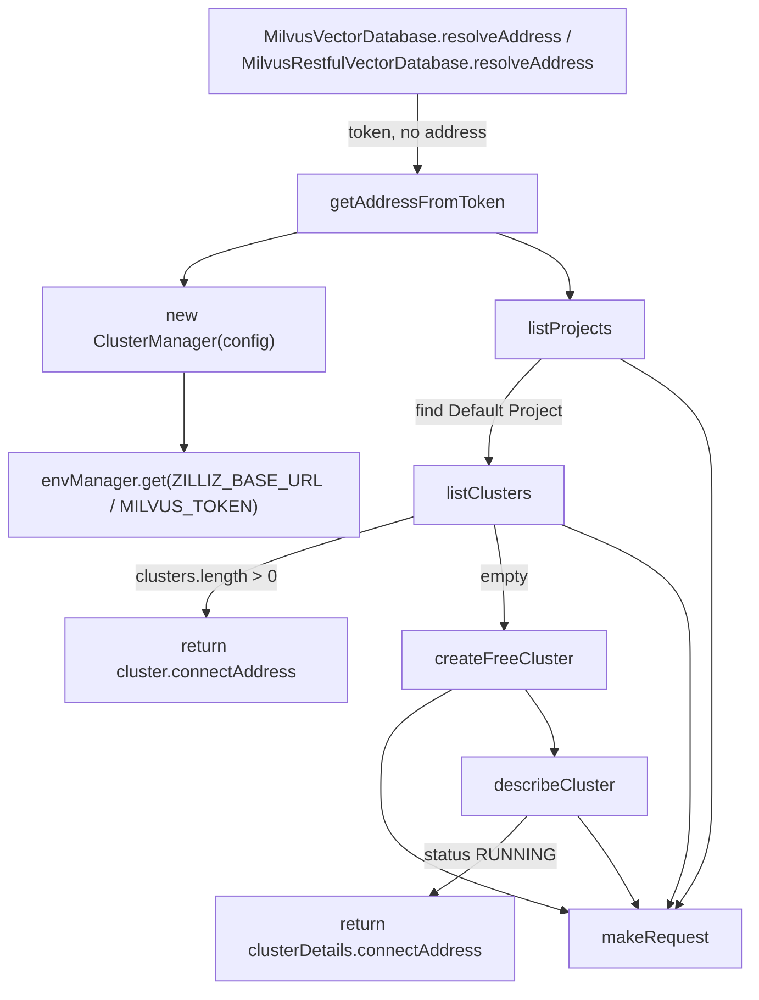

# Zilliz Cloud address resolution & serverless cluster provisioning

## Overview
claude-context stores its code embeddings in a Milvus-compatible vector store, and the
managed flavour of that store is **Zilliz Cloud**. But a coding agent configured with only a
Zilliz API token has no host to connect to — Zilliz endpoints are per-cluster URLs that don't
exist until a cluster does. This module is the bridge: given a token, it talks to the Zilliz
**control-plane** REST API to find the user's default project, reuse an existing cluster if one
is there, and otherwise **provision a free serverless cluster and block until it is `RUNNING`**,
returning the cluster's data-plane connect address. The whole subsystem is one class,
[`ClusterManager`](../catalog/packages/core/src/vectordb/zilliz-utils.ts.md#ClusterManager.-constructor),
wrapping a thin typed HTTP client over the documented Zilliz Cloud v2 endpoints; its one public
static entry, [`getAddressFromToken`](../catalog/packages/core/src/vectordb/zilliz-utils.ts.md#ClusterManager.getAddressFromToken),
is what the two Milvus vector-DB drivers call when their config gives a token but no address.

## Diagram

## Design rationale (why it's built this way)
**Token-first, zero-touch onboarding.** The design goal, per the static method's docstring, is
that [`getAddressFromToken`](../catalog/packages/core/src/vectordb/zilliz-utils.ts.md#ClusterManager.getAddressFromToken)
"will find or create a cluster and return its connect address" — so a user who supplies only a
Zilliz API key never has to open the console, pick a region, or copy an endpoint. The cost of
that convenience is that address resolution is a *multi-round-trip, control-plane* operation,
not a config lookup, which is why the callers gate it behind a "token but no address" check
rather than running it every time (see [`resolveAddress`](../catalog/packages/core/src/vectordb/milvus-vectordb.ts.md#MilvusVectorDatabase.resolveAddress)).

**Reuse before provision.** When a project already has clusters,
[`getAddressFromToken`](../catalog/packages/core/src/vectordb/zilliz-utils.ts.md#ClusterManager.getAddressFromToken)
takes the **first** one from [`listClusters`](../catalog/packages/core/src/vectordb/zilliz-utils.ts.md#ClusterManager.listClusters)
and returns its [`connectAddress`](../catalog/packages/core/src/vectordb/zilliz-utils.ts.md#Cluster.connectAddress)
rather than spinning up another. Provisioning is the fallback, not the default — it avoids
piling up idle free clusters on repeated runs.

**Config precedence lives in the constructor, not the caller.** The
[`<constructor>`](../catalog/packages/core/src/vectordb/zilliz-utils.ts.md#ClusterManager.-constructor)
resolves its [`baseUrl`](../catalog/packages/core/src/vectordb/zilliz-utils.ts.md#ClusterManager.baseUrl)
and [`token`](../catalog/packages/core/src/vectordb/zilliz-utils.ts.md#ClusterManager.token) with a
fixed priority — **environment variable first**, then the passed
[`ZillizConfig`](../catalog/packages/core/src/vectordb/zilliz-utils.ts.md#ZillizConfig), then a
hard-coded default of `https://api.cloud.zilliz.com` for the base URL. That environment-first
order is centralized in [`envManager`](../catalog/packages/core/src/utils/env-manager.ts.md#envManager)
(via [`get`](../catalog/packages/core/src/utils/env-manager.ts.md#EnvManager.get)), so an operator
can override the control-plane host (e.g. a non-global Zilliz region or a mock) without touching
code.

> [!inferred]
> The token is read from the `MILVUS_TOKEN` variable rather than a Zilliz-specific name because
> the same credential doubles as the Milvus auth token for the data-plane connection — the vector
> DB drivers that call this path are the Milvus drivers. This is a reading of the constructor's
> variable choice, not something the code states.

**Poll, don't assume, on creation.** A freshly created serverless cluster is not immediately
connectable, so [`createFreeCluster`](../catalog/packages/core/src/vectordb/zilliz-utils.ts.md#ClusterManager.createFreeCluster)
does not return the create response directly — it polls
[`describeCluster`](../catalog/packages/core/src/vectordb/zilliz-utils.ts.md#ClusterManager.describeCluster)
until the [`status`](../catalog/packages/core/src/vectordb/zilliz-utils.ts.md#DescribeClusterResponse.status)
reaches `RUNNING`, and only then hands back the connect address. This is why the type it returns is
[`CreateFreeClusterWithDetailsResponse`](../catalog/packages/core/src/vectordb/zilliz-utils.ts.md#CreateFreeClusterWithDetailsResponse)
— the raw create response has no address, so the ready cluster's
[`clusterDetails`](../catalog/packages/core/src/vectordb/zilliz-utils.ts.md#CreateFreeClusterWithDetailsResponse.clusterDetails)
are merged in.

## Entry points
- [`getAddressFromToken`](../catalog/packages/core/src/vectordb/zilliz-utils.ts.md#ClusterManager.getAddressFromToken)
  — the one public, static entry to this subsystem. It is reached from the vector-DB drivers'
  [`resolveAddress`](../catalog/packages/core/src/vectordb/milvus-vectordb.ts.md#MilvusVectorDatabase.resolveAddress)
  (and the REST variant [`resolveAddress`](../catalog/packages/core/src/vectordb/milvus-restful-vectordb.ts.md#MilvusRestfulVectorDatabase.resolveAddress))
  exactly when a Milvus/Zilliz config carries a `token` but no `address`. It orchestrates the
  whole find-or-create dance and returns a bare connect-address string.
- [`<constructor>`](../catalog/packages/core/src/vectordb/zilliz-utils.ts.md#ClusterManager.-constructor)
  — every path starts here. It is invoked inside
  [`getAddressFromToken`](../catalog/packages/core/src/vectordb/zilliz-utils.ts.md#ClusterManager.getAddressFromToken)
  with `{ token }`, and establishes the two pieces of connection state
  ([`baseUrl`](../catalog/packages/core/src/vectordb/zilliz-utils.ts.md#ClusterManager.baseUrl),
  [`token`](../catalog/packages/core/src/vectordb/zilliz-utils.ts.md#ClusterManager.token)) plus a
  fail-fast guard that throws if no token can be resolved.

## Mechanism (step-by-step)
1. **Construct the manager and resolve credentials.** Control enters
   [`getAddressFromToken`](../catalog/packages/core/src/vectordb/zilliz-utils.ts.md#ClusterManager.getAddressFromToken),
   which first rejects an empty token, then builds a
   [`<constructor>`](../catalog/packages/core/src/vectordb/zilliz-utils.ts.md#ClusterManager.-constructor)-created
   instance. The constructor pulls `ZILLIZ_BASE_URL` and `MILVUS_TOKEN` through
   [`get`](../catalog/packages/core/src/utils/env-manager.ts.md#EnvManager.get) on the shared
   [`envManager`](../catalog/packages/core/src/utils/env-manager.ts.md#envManager), falling back to
   the [`ZillizConfig`](../catalog/packages/core/src/vectordb/zilliz-utils.ts.md#ZillizConfig) fields
   and finally the default host, and throws immediately if the resulting token is empty.
2. **Find the default project.**
   [`getAddressFromToken`](../catalog/packages/core/src/vectordb/zilliz-utils.ts.md#ClusterManager.getAddressFromToken)
   calls [`listProjects`](../catalog/packages/core/src/vectordb/zilliz-utils.ts.md#ClusterManager.listProjects),
   which GETs `/v2/projects` and returns the array of
   [`Project`](../catalog/packages/core/src/vectordb/zilliz-utils.ts.md#Project) records. It then
   searches for the one whose
   [`projectName`](../catalog/packages/core/src/vectordb/zilliz-utils.ts.md#Project.projectName) is
   the literal string `"Default Project"` and throws `Default Project not found` if absent — the
   subsequent lookups are all scoped by that project's
   [`projectId`](../catalog/packages/core/src/vectordb/zilliz-utils.ts.md#Project.projectId).
3. **List clusters in that project.** Passing the resolved project id,
   [`getAddressFromToken`](../catalog/packages/core/src/vectordb/zilliz-utils.ts.md#ClusterManager.getAddressFromToken)
   calls [`listClusters`](../catalog/packages/core/src/vectordb/zilliz-utils.ts.md#ClusterManager.listClusters),
   which builds a paginated `/v2/clusters?pageSize=…&currentPage=…&projectId=…` endpoint and returns the
   [`clusters`](../catalog/packages/core/src/vectordb/zilliz-utils.ts.md#ClusterManager.listClusters.Promise.typeLiteral31.clusters)
   page. Defaults are page size 10, page 1 — so only the first page is ever consulted.
4. **Reuse an existing cluster if any.** When the returned
   [`clusters`](../catalog/packages/core/src/vectordb/zilliz-utils.ts.md#ClusterManager.listClusters.Promise.typeLiteral31.clusters)
   array is non-empty,
   [`getAddressFromToken`](../catalog/packages/core/src/vectordb/zilliz-utils.ts.md#ClusterManager.getAddressFromToken)
   takes element `[0]` — a [`Cluster`](../catalog/packages/core/src/vectordb/zilliz-utils.ts.md#Cluster)
   — logs its [`clusterName`](../catalog/packages/core/src/vectordb/zilliz-utils.ts.md#Cluster.clusterName)
   and [`clusterId`](../catalog/packages/core/src/vectordb/zilliz-utils.ts.md#Cluster.clusterId), and
   returns its [`connectAddress`](../catalog/packages/core/src/vectordb/zilliz-utils.ts.md#Cluster.connectAddress)
   directly. No provisioning happens on this path.
5. **Provision a free cluster when none exist.** On an empty list,
   [`getAddressFromToken`](../catalog/packages/core/src/vectordb/zilliz-utils.ts.md#ClusterManager.getAddressFromToken)
   calls [`createFreeCluster`](../catalog/packages/core/src/vectordb/zilliz-utils.ts.md#ClusterManager.createFreeCluster)
   with a [`CreateFreeClusterRequest`](../catalog/packages/core/src/vectordb/zilliz-utils.ts.md#CreateFreeClusterRequest)
   whose [`clusterName`](../catalog/packages/core/src/vectordb/zilliz-utils.ts.md#CreateFreeClusterRequest.clusterName)
   is `auto-cluster-${Date.now()}` (a timestamped, collision-resistant name), the discovered
   [`projectId`](../catalog/packages/core/src/vectordb/zilliz-utils.ts.md#CreateFreeClusterRequest.projectId),
   and a **hard-coded** [`regionId`](../catalog/packages/core/src/vectordb/zilliz-utils.ts.md#CreateFreeClusterRequest.regionId)
   of `gcp-us-west1`.
6. **Create, then poll to ready.**
   [`createFreeCluster`](../catalog/packages/core/src/vectordb/zilliz-utils.ts.md#ClusterManager.createFreeCluster)
   POSTs the request to `/v2/clusters/createFree`, receiving a
   [`CreateFreeClusterApiResponse`](../catalog/packages/core/src/vectordb/zilliz-utils.ts.md#CreateFreeClusterApiResponse)
   from which it extracts the new
   [`clusterId`](../catalog/packages/core/src/vectordb/zilliz-utils.ts.md#CreateFreeClusterResponse.clusterId).
   It then loops (default 5 s poll, 5 min timeout) calling
   [`describeCluster`](../catalog/packages/core/src/vectordb/zilliz-utils.ts.md#ClusterManager.describeCluster);
   when the [`status`](../catalog/packages/core/src/vectordb/zilliz-utils.ts.md#DescribeClusterResponse.status)
   is `RUNNING` it returns a
   [`CreateFreeClusterWithDetailsResponse`](../catalog/packages/core/src/vectordb/zilliz-utils.ts.md#CreateFreeClusterWithDetailsResponse)
   that spreads the create response and attaches the ready cluster's
   [`clusterDetails`](../catalog/packages/core/src/vectordb/zilliz-utils.ts.md#CreateFreeClusterWithDetailsResponse.clusterDetails).
   Back in [`getAddressFromToken`](../catalog/packages/core/src/vectordb/zilliz-utils.ts.md#ClusterManager.getAddressFromToken),
   the resolved address is `createResponse.clusterDetails.connectAddress`.
7. **Every call goes through one HTTP shim.**
   [`listProjects`](../catalog/packages/core/src/vectordb/zilliz-utils.ts.md#ClusterManager.listProjects),
   [`listClusters`](../catalog/packages/core/src/vectordb/zilliz-utils.ts.md#ClusterManager.listClusters),
   [`describeCluster`](../catalog/packages/core/src/vectordb/zilliz-utils.ts.md#ClusterManager.describeCluster),
   and [`createFreeCluster`](../catalog/packages/core/src/vectordb/zilliz-utils.ts.md#ClusterManager.createFreeCluster)
   all delegate to the private generic
   [`makeRequest`](../catalog/packages/core/src/vectordb/zilliz-utils.ts.md#ClusterManager.makeRequest),
   which prefixes the endpoint with
   [`baseUrl`](../catalog/packages/core/src/vectordb/zilliz-utils.ts.md#ClusterManager.baseUrl),
   sends a `Bearer`-authenticated `fetch`, and normalizes non-2xx responses into thrown errors. Each
   caller additionally checks the application-level
   [`code`](../catalog/packages/core/src/vectordb/zilliz-utils.ts.md#ListProjectsResponse.code) field
   and throws unless it is `0` — a two-layer error model (HTTP status *and* body `code`).

## Key data structures
- **Connection state** — the two private fields set once by the constructor:
  [`baseUrl`](../catalog/packages/core/src/vectordb/zilliz-utils.ts.md#ClusterManager.baseUrl) (the
  control-plane host) and
  [`token`](../catalog/packages/core/src/vectordb/zilliz-utils.ts.md#ClusterManager.token) (the bearer
  credential). Everything else is derived per request.
- **[`ZillizConfig`](../catalog/packages/core/src/vectordb/zilliz-utils.ts.md#ZillizConfig)** — the
  optional constructor input, with just
  [`baseUrl`](../catalog/packages/core/src/vectordb/zilliz-utils.ts.md#ZillizConfig.baseUrl) and
  [`token`](../catalog/packages/core/src/vectordb/zilliz-utils.ts.md#ZillizConfig.token); both are
  overridden by env vars when present.
- **The API-envelope types** — each endpoint has a `{ code, data }` wrapper
  ([`ListProjectsResponse`](../catalog/packages/core/src/vectordb/zilliz-utils.ts.md#ListProjectsResponse),
  [`ListClustersResponse`](../catalog/packages/core/src/vectordb/zilliz-utils.ts.md#ListClustersResponse),
  [`CreateFreeClusterApiResponse`](../catalog/packages/core/src/vectordb/zilliz-utils.ts.md#CreateFreeClusterApiResponse),
  [`DescribeClusterApiResponse`](../catalog/packages/core/src/vectordb/zilliz-utils.ts.md#DescribeClusterApiResponse))
  whose `data` unwraps to the domain records
  [`Project`](../catalog/packages/core/src/vectordb/zilliz-utils.ts.md#Project),
  [`Cluster`](../catalog/packages/core/src/vectordb/zilliz-utils.ts.md#Cluster), and
  [`DescribeClusterResponse`](../catalog/packages/core/src/vectordb/zilliz-utils.ts.md#DescribeClusterResponse).
- **[`CreateFreeClusterRequest`](../catalog/packages/core/src/vectordb/zilliz-utils.ts.md#CreateFreeClusterRequest)**
  — the three fields the provision path fills in:
  [`clusterName`](../catalog/packages/core/src/vectordb/zilliz-utils.ts.md#CreateFreeClusterRequest.clusterName),
  [`projectId`](../catalog/packages/core/src/vectordb/zilliz-utils.ts.md#CreateFreeClusterRequest.projectId),
  [`regionId`](../catalog/packages/core/src/vectordb/zilliz-utils.ts.md#CreateFreeClusterRequest.regionId).
- **[`envManager`](../catalog/packages/core/src/utils/env-manager.ts.md#envManager)** — a shared
  singleton whose [`get`](../catalog/packages/core/src/utils/env-manager.ts.md#EnvManager.get) reads
  `process.env` first and then falls back to a `~/.context/.env` file (path held in
  [`envFilePath`](../catalog/packages/core/src/utils/env-manager.ts.md#EnvManager.envFilePath)),
  giving the constructor its `process.env > .env file > default` precedence.

## Dynamics (design intent)
The polling loop in
[`createFreeCluster`](../catalog/packages/core/src/vectordb/zilliz-utils.ts.md#ClusterManager.createFreeCluster)
is deliberately tolerant of *transient* describe failures: inside the loop it catches errors from
[`describeCluster`](../catalog/packages/core/src/vectordb/zilliz-utils.ts.md#ClusterManager.describeCluster)
whose message contains `Failed to describe cluster` and simply waits and continues, on the reasoning
(stated in the source comment) that a just-created cluster "might not be immediately available for
describe." Any other error aborts the loop by re-throwing. The loop also short-circuits to a thrown
error if [`status`](../catalog/packages/core/src/vectordb/zilliz-utils.ts.md#DescribeClusterResponse.status)
becomes `DELETED` or `ABNORMAL`, and finally throws a timeout error if the deadline passes without a
`RUNNING` cluster.

> [!inferred]
> This is a sequential, single-flight resolution — nothing here parallelizes across projects or
> clusters, and each `await` blocks the next. That reading follows from the straight-line `await`
> chain in the source; there are no tests in this packet to confirm concurrency behavior.

## Edge cases
- **No token.**
  [`getAddressFromToken`](../catalog/packages/core/src/vectordb/zilliz-utils.ts.md#ClusterManager.getAddressFromToken)
  throws `Token is required…` before constructing anything, and the
  [`<constructor>`](../catalog/packages/core/src/vectordb/zilliz-utils.ts.md#ClusterManager.-constructor)
  independently throws if the resolved
  [`token`](../catalog/packages/core/src/vectordb/zilliz-utils.ts.md#ClusterManager.token) is empty —
  two guards for the same failure.
- **No "Default Project".** The project search is by exact name match on
  [`projectName`](../catalog/packages/core/src/vectordb/zilliz-utils.ts.md#Project.projectName); an
  account that renamed or lacks a project literally called `Default Project` fails with
  `Default Project not found`, even if other projects exist.
- **Region is not configurable.** The provision path always requests
  [`regionId`](../catalog/packages/core/src/vectordb/zilliz-utils.ts.md#CreateFreeClusterRequest.regionId)
  `gcp-us-west1`; there is no knob to place the auto-created cluster elsewhere.
- **First-page-only cluster listing.**
  [`listClusters`](../catalog/packages/core/src/vectordb/zilliz-utils.ts.md#ClusterManager.listClusters)
  is called with default pagination, so only the first 10 clusters are seen — enough for the
  "is there any cluster?" question the caller asks, but not a full inventory.
- **Every failure is wrapped twice.** A low-level fetch error is wrapped by
  [`makeRequest`](../catalog/packages/core/src/vectordb/zilliz-utils.ts.md#ClusterManager.makeRequest)
  (`Zilliz API request failed: …`) and then again by the outer catch in
  [`getAddressFromToken`](../catalog/packages/core/src/vectordb/zilliz-utils.ts.md#ClusterManager.getAddressFromToken)
  (`Failed to get address from token: …`), so the surfaced message nests both prefixes.

## Open questions
- The [`resolveAddress`](../catalog/packages/core/src/vectordb/milvus-vectordb.ts.md#MilvusVectorDatabase.resolveAddress)
  callers are in this subgraph, but the surrounding index/search flow that then *connects* to the
  resolved address lives in the Milvus vector-DB packets, not here — how the returned address is
  used to open the data-plane connection is out of scope for this page.
- The `CreateFreeClusterResponse.username`/`password`/`prompt` fields returned by `/v2/clusters/createFree`
  are outside this packet's subgraph, so how (or whether) the generated free-cluster credentials feed
  back into the Milvus connection is not established here.

## See also
- packages-core-src-vectordb-milvus-vectordb.ts — the gRPC Milvus driver whose
  `resolveAddress` calls into this module.
- packages-core-src-vectordb-milvus-restful-vectordb.ts — the REST Milvus driver, same
  `resolveAddress` seam.
- packages-core-src-vectordb-types.ts — the shared vector-DB config/type surface these drivers implement.
