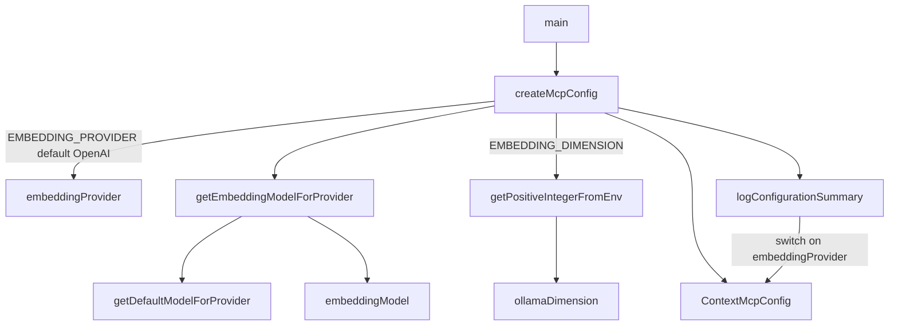

# MCP server configuration resolution

How the `@zilliz/claude-context-mcp` server turns a bag of environment variables into a single
typed [`ContextMcpConfig`](../catalog/packages/mcp/src/config.ts.md#ContextMcpConfig) at startup —
picking one of five embedding providers, resolving a default model per provider, collecting the
provider-specific credentials, and pointing the Milvus vector store at an address (or letting it be
auto-resolved from a token). `config.ts` also happens to define the *snapshot state* types whose
`status` discriminant drives the on-disk index bookkeeping, so this page covers both halves of the
file.

## Overview
The MCP server has no config file and no flags beyond `--help`; **the environment *is* the config
surface**. [`createMcpConfig`](../catalog/packages/mcp/src/config.ts.md#createMcpConfig) is the single
place that reads every `EMBEDDING_*`, provider-key, and `MILVUS_*` variable and materializes one plain
[`ContextMcpConfig`](../catalog/packages/mcp/src/config.ts.md#ContextMcpConfig) object. The one piece of
real logic is *model selection*: the model name isn't read directly but computed from the chosen
provider by [`getEmbeddingModelForProvider`](../catalog/packages/mcp/src/config.ts.md#getEmbeddingModelForProvider),
which layers `EMBEDDING_MODEL` (and, for Ollama, `OLLAMA_MODEL`) over a per-provider default from
[`getDefaultModelForProvider`](../catalog/packages/mcp/src/config.ts.md#getDefaultModelForProvider).
Everything else is a straight read with a fallback default. A companion
[`logConfigurationSummary`](../catalog/packages/mcp/src/config.ts.md#logConfigurationSummary) then prints
the resolved config to stderr with secrets reduced to a ✅/❌ present/absent flag.

For the cross-repo survey, the load-bearing point is the **grounding substrate**: claude-context grounds
semantic search on *embeddings + a Milvus vector store*, and this file is where that substrate is chosen.
There is no SCIP index and no symbol/call graph to configure here — the only knobs are which embedding
model produces the vectors and which vector DB stores them.

## Diagram

## Design rationale (why it's built this way)
**Provider is chosen once; model is derived, not re-entered.** A user sets `EMBEDDING_PROVIDER=VoyageAI`
and gets a working setup with zero further tuning, because
[`getDefaultModelForProvider`](../catalog/packages/mcp/src/config.ts.md#getDefaultModelForProvider) hard-codes
a sensible embedding model per provider (`text-embedding-3-small` for OpenAI, `voyage-code-3` for VoyageAI,
`gemini-embedding-001` for Gemini, `nomic-embed-text` for Ollama, `openai/text-embedding-3-small` for
OpenRouter). `EMBEDDING_MODEL` is an *override* layered on top by
[`getEmbeddingModelForProvider`](../catalog/packages/mcp/src/config.ts.md#getEmbeddingModelForProvider),
not a required field — so the common path stays a one-liner.

**Ollama gets a backward-compat special case.** The model resolver's `Ollama` branch prefers `OLLAMA_MODEL`
over `EMBEDDING_MODEL` before falling back to the default, while every other provider only consults
`EMBEDDING_MODEL` — a deliberate asymmetry called out in the source comment
([`getEmbeddingModelForProvider`](../catalog/packages/mcp/src/config.ts.md#getEmbeddingModelForProvider)),
preserved so older Ollama setups keep working. Ollama is also the only provider that carries an explicit
embedding **dimension**, parsed defensively.

**Dimension is validated, not trusted.**
[`getPositiveIntegerFromEnv`](../catalog/packages/mcp/src/config.ts.md#getPositiveIntegerFromEnv) is a tiny
guard around `EMBEDDING_DIMENSION`: it accepts a value only if it parses to a positive integer, and *warns
and ignores* anything else, leaving [`ollamaDimension`](../catalog/packages/mcp/src/config.ts.md#ContextMcpConfig.ollamaDimension)
`undefined`. A malformed dimension therefore degrades to "not set" rather than propagating a `NaN` into the
vector store schema.

**The vector-store address is optional by design.**
[`milvusAddress`](../catalog/packages/mcp/src/config.ts.md#ContextMcpConfig.milvusAddress) is nullable and the inline comment
notes it "can be auto-resolved from token" — a Zilliz Cloud token embeds its endpoint, so supplying
[`milvusToken`](../catalog/packages/mcp/src/config.ts.md#ContextMcpConfig.milvusToken) alone is enough.
[`logConfigurationSummary`](../catalog/packages/mcp/src/config.ts.md#logConfigurationSummary) mirrors this by
printing `[Auto-resolve from token]` when address is empty but a token is present.

**Secrets never hit the log verbatim.**
[`logConfigurationSummary`](../catalog/packages/mcp/src/config.ts.md#logConfigurationSummary) switches on
[`embeddingProvider`](../catalog/packages/mcp/src/config.ts.md#ContextMcpConfig.embeddingProvider) and prints each API key as a
bare `✅ Configured` / `❌ Missing`, never the value — only non-secret fields like base URLs and the Ollama
host are echoed literally.

> [!inferred]
> The resolved [`ContextMcpConfig`](../catalog/packages/mcp/src/config.ts.md#ContextMcpConfig) is consumed
> downstream in `index.ts`'s `ContextMcpServer` constructor (which I read but whose symbols are outside this
> packet's subgraph): the embedding fields feed `createEmbeddingInstance(config)`, the `milvusAddress` /
> `milvusToken` fields construct a `MilvusVectorDatabase`, and `collectionNameOverride` is passed into the
> `Context`. This file only *produces* the config; the wiring lives in the server constructor.

## Entry points
- [`main`](../catalog/packages/mcp/src/index.ts.md#main) — the server's CLI `main()`. After handling
  `--help`, it calls [`createMcpConfig`](../catalog/packages/mcp/src/config.ts.md#createMcpConfig) then
  [`logConfigurationSummary`](../catalog/packages/mcp/src/config.ts.md#logConfigurationSummary) before
  constructing the server. This is the only place config resolution is triggered.
- [`createMcpConfig`](../catalog/packages/mcp/src/config.ts.md#createMcpConfig) — the resolver itself;
  reads the environment and returns a fully-populated
  [`ContextMcpConfig`](../catalog/packages/mcp/src/config.ts.md#ContextMcpConfig).
- [`originalConsoleWarn`](../catalog/packages/mcp/src/index.ts.md#originalConsoleWarn) — a module-load
  side effect in `index.ts` that captures `console.warn` before the file redirects all console output to
  stderr (so MCP's stdout JSON channel stays clean); it sits at the top of the same startup path that then
  reaches [`createMcpConfig`](../catalog/packages/mcp/src/config.ts.md#createMcpConfig) and
  [`logConfigurationSummary`](../catalog/packages/mcp/src/config.ts.md#logConfigurationSummary).

## Mechanism (step-by-step)
1. **Choose the provider (default OpenAI).**
   [`createMcpConfig`](../catalog/packages/mcp/src/config.ts.md#createMcpConfig) reads `EMBEDDING_PROVIDER`,
   casts it to the [`embeddingProvider`](../catalog/packages/mcp/src/config.ts.md#ContextMcpConfig.embeddingProvider) union
   `'OpenAI' | 'VoyageAI' | 'Gemini' | 'Ollama' | 'OpenRouter'`, and falls back to `'OpenAI'` when unset. The
   cast is unchecked — an unrecognized string is stored as-is (see Edge cases).
2. **Derive the embedding model from the provider.**
   [`createMcpConfig`](../catalog/packages/mcp/src/config.ts.md#createMcpConfig) sets
   [`embeddingModel`](../catalog/packages/mcp/src/config.ts.md#ContextMcpConfig.embeddingModel) by calling
   [`getEmbeddingModelForProvider`](../catalog/packages/mcp/src/config.ts.md#getEmbeddingModelForProvider),
   which for Ollama prefers `OLLAMA_MODEL` then `EMBEDDING_MODEL`, and for every other provider takes
   `EMBEDDING_MODEL`, in both cases bottoming out at
   [`getDefaultModelForProvider`](../catalog/packages/mcp/src/config.ts.md#getDefaultModelForProvider)'s
   per-provider constant.
3. **Collect provider-specific credentials and endpoints.**
   [`createMcpConfig`](../catalog/packages/mcp/src/config.ts.md#createMcpConfig) reads each provider's key and
   optional base URL straight into the config —
   [`openaiApiKey`](../catalog/packages/mcp/src/config.ts.md#ContextMcpConfig.openaiApiKey) /
   [`openaiBaseUrl`](../catalog/packages/mcp/src/config.ts.md#ContextMcpConfig.openaiBaseUrl),
   [`voyageaiApiKey`](../catalog/packages/mcp/src/config.ts.md#ContextMcpConfig.voyageaiApiKey),
   [`geminiApiKey`](../catalog/packages/mcp/src/config.ts.md#ContextMcpConfig.geminiApiKey) /
   [`geminiBaseUrl`](../catalog/packages/mcp/src/config.ts.md#ContextMcpConfig.geminiBaseUrl),
   [`openrouterApiKey`](../catalog/packages/mcp/src/config.ts.md#ContextMcpConfig.openrouterApiKey), and the
   Ollama pair [`ollamaModel`](../catalog/packages/mcp/src/config.ts.md#ContextMcpConfig.ollamaModel) /
   [`ollamaHost`](../catalog/packages/mcp/src/config.ts.md#ContextMcpConfig.ollamaHost). All are optional; none
   is validated here, so a missing key surfaces only later at embedding time.
4. **Parse the optional embedding dimension defensively.**
   [`createMcpConfig`](../catalog/packages/mcp/src/config.ts.md#createMcpConfig) runs `EMBEDDING_DIMENSION`
   through [`getPositiveIntegerFromEnv`](../catalog/packages/mcp/src/config.ts.md#getPositiveIntegerFromEnv),
   which returns the number only if it is a positive integer and otherwise warns and yields `undefined`,
   storing the result in [`ollamaDimension`](../catalog/packages/mcp/src/config.ts.md#ContextMcpConfig.ollamaDimension).
5. **Resolve the vector-store target.**
   [`createMcpConfig`](../catalog/packages/mcp/src/config.ts.md#createMcpConfig) reads
   [`milvusAddress`](../catalog/packages/mcp/src/config.ts.md#ContextMcpConfig.milvusAddress) (optional),
   [`milvusToken`](../catalog/packages/mcp/src/config.ts.md#ContextMcpConfig.milvusToken), and
   [`collectionNameOverride`](../catalog/packages/mcp/src/config.ts.md#ContextMcpConfig.collectionNameOverride) (a human-readable
   collection-name prefix), alongside the server identity fields
   [`name`](../catalog/packages/mcp/src/config.ts.md#ContextMcpConfig.name) and
   [`version`](../catalog/packages/mcp/src/config.ts.md#ContextMcpConfig.version) (defaulting to
   `"Context MCP Server"` / `"1.0.0"`).
6. **Log the resolved summary, redacting secrets.**
   [`logConfigurationSummary`](../catalog/packages/mcp/src/config.ts.md#logConfigurationSummary) prints server
   identity, provider, model, and Milvus target, then `switch`es on
   [`embeddingProvider`](../catalog/packages/mcp/src/config.ts.md#ContextMcpConfig.embeddingProvider) to show only the relevant
   provider's key as present/absent and its non-secret extras (base URL, or the Ollama host defaulting to
   `http://127.0.0.1:11434` and the [`ollamaDimension`](../catalog/packages/mcp/src/config.ts.md#ContextMcpConfig.ollamaDimension)
   when set).

## Key data structures
- **[`ContextMcpConfig`](../catalog/packages/mcp/src/config.ts.md#ContextMcpConfig)** — the flat result
  interface: server [`name`](../catalog/packages/mcp/src/config.ts.md#ContextMcpConfig.name) /
  [`version`](../catalog/packages/mcp/src/config.ts.md#ContextMcpConfig.version), the
  [`embeddingProvider`](../catalog/packages/mcp/src/config.ts.md#ContextMcpConfig.embeddingProvider) union +
  resolved [`embeddingModel`](../catalog/packages/mcp/src/config.ts.md#ContextMcpConfig.embeddingModel), the optional
  per-provider credentials, the optional Ollama trio, and the Milvus fields. Every credential/endpoint field
  is optional; only provider, model, name and version are always present.
- **The codebase-state discriminated union (the file's other half).** `config.ts` also declares the snapshot
  state types whose `status` string is the discriminant: the indexing state carries
  [`status: 'indexing'`](../catalog/packages/mcp/src/config.ts.md#CodebaseInfoIndexing.status) and the failure
  state carries [`status: 'indexfailed'`](../catalog/packages/mcp/src/config.ts.md#CodebaseInfoIndexFailed.status)
  (with an `'indexed'` case completing the union). This `status` tag is what the `SnapshotManager` reads and
  writes throughout — [`setCodebaseIndexing`](../catalog/packages/mcp/src/snapshot.ts.md#SnapshotManager.setCodebaseIndexing)
  and [`setCodebaseIndexFailed`](../catalog/packages/mcp/src/snapshot.ts.md#SnapshotManager.setCodebaseIndexFailed)
  stamp it, [`getCodebaseStatus`](../catalog/packages/mcp/src/snapshot.ts.md#SnapshotManager.getCodebaseStatus)
  returns it, and the list accessors
  [`getIndexedCodebases`](../catalog/packages/mcp/src/snapshot.ts.md#SnapshotManager.getIndexedCodebases),
  [`getIndexingCodebases`](../catalog/packages/mcp/src/snapshot.ts.md#SnapshotManager.getIndexingCodebases), and
  [`getFailedCodebases`](../catalog/packages/mcp/src/snapshot.ts.md#SnapshotManager.getFailedCodebases) filter
  on it. These are a separate subsystem (persisted index bookkeeping) that merely shares this source file; the
  config resolver above never touches them.

## Dynamics (design intent)
Config resolution is a **one-shot, synchronous startup step**: [`main`](../catalog/packages/mcp/src/index.ts.md#main)
calls [`createMcpConfig`](../catalog/packages/mcp/src/config.ts.md#createMcpConfig) exactly once and passes the
frozen result forward; nothing re-reads the environment after boot. The console redirection captured by
[`originalConsoleWarn`](../catalog/packages/mcp/src/index.ts.md#originalConsoleWarn) at module load means all of
[`createMcpConfig`](../catalog/packages/mcp/src/config.ts.md#createMcpConfig)'s debug prints and
[`logConfigurationSummary`](../catalog/packages/mcp/src/config.ts.md#logConfigurationSummary)'s summary land on
stderr, keeping the stdout MCP JSON channel uncontaminated.

On the state-type side, the `status` discriminant drives an interrupted-run recovery invariant:
[`loadV2Format`](../catalog/packages/mcp/src/snapshot.ts.md#SnapshotManager.loadV2Format) (per its docstring,
"Convert v2 format to internal state") rewrites any codebase still marked
[`status: 'indexing'`](../catalog/packages/mcp/src/config.ts.md#CodebaseInfoIndexing.status) at load time into
[`status: 'indexfailed'`](../catalog/packages/mcp/src/config.ts.md#CodebaseInfoIndexFailed.status), on the
premise that an in-progress index at startup means the previous process died mid-run.

## Edge cases
- **Unknown provider passes the cast.** The `EMBEDDING_PROVIDER` value is cast, not validated, in
  [`createMcpConfig`](../catalog/packages/mcp/src/config.ts.md#createMcpConfig), so a typo is stored verbatim in
  [`embeddingProvider`](../catalog/packages/mcp/src/config.ts.md#ContextMcpConfig.embeddingProvider);
  [`getDefaultModelForProvider`](../catalog/packages/mcp/src/config.ts.md#getDefaultModelForProvider)'s `default`
  arm still hands back `text-embedding-3-small`, but
  [`logConfigurationSummary`](../catalog/packages/mcp/src/config.ts.md#logConfigurationSummary)'s `switch` has no
  matching case, so no provider-specific line prints.
- **Malformed dimension is silently dropped.** A non-integer or non-positive `EMBEDDING_DIMENSION` makes
  [`getPositiveIntegerFromEnv`](../catalog/packages/mcp/src/config.ts.md#getPositiveIntegerFromEnv) warn and return
  `undefined`, leaving [`ollamaDimension`](../catalog/packages/mcp/src/config.ts.md#ContextMcpConfig.ollamaDimension) unset rather
  than erroring.
- **Missing credentials are not caught here.** Because every key field is optional in
  [`ContextMcpConfig`](../catalog/packages/mcp/src/config.ts.md#ContextMcpConfig), a provider selected without its
  key resolves cleanly and only [`logConfigurationSummary`](../catalog/packages/mcp/src/config.ts.md#logConfigurationSummary)
  flags it as `❌ Missing`; the actual failure is deferred to embedding time.
- **Interrupted indexing state.** A snapshot loaded with an `'indexing'`
  [`status`](../catalog/packages/mcp/src/config.ts.md#CodebaseInfoIndexing.status) is force-reset to
  `'indexfailed'` by [`loadV2Format`](../catalog/packages/mcp/src/snapshot.ts.md#SnapshotManager.loadV2Format);
  such an entry never reappears in [`getIndexingCodebases`](../catalog/packages/mcp/src/snapshot.ts.md#SnapshotManager.getIndexingCodebases).

## Open questions
- **Downstream consumption is out of subgraph.** How the resolved config becomes a live embedding client and
  Milvus connection (`createEmbeddingInstance`, `MilvusVectorDatabase`, the `Context` constructor) lives in
  `index.ts` / `embedding.ts` and is not citable from this packet — captured only in the inferred block above.
- **`collectionNameOverride` sanitization.** The `--help` text describes a
  `code_chunks_<override>_<pathHash>` scheme with sanitization and a 255-char cap, but that logic is
  `getCollectionName` in the core `Context`, outside this subgraph; only the raw
  [`collectionNameOverride`](../catalog/packages/mcp/src/config.ts.md#ContextMcpConfig.collectionNameOverride) capture is grounded here.
- **No test coverage in this packet.** The Evidence table reports no tests referencing this subgraph, so all
  claims rest on source + docstrings, not executed behavior.

## See also
- packages-mcp-src-snapshot.ts — the `SnapshotManager` that owns the `status`-keyed index bookkeeping whose
  types are declared here.
- packages-mcp-src-index.ts — the `main()` / `ContextMcpServer` startup path that calls this resolver and wires
  the config into the embedding client and Milvus store.
