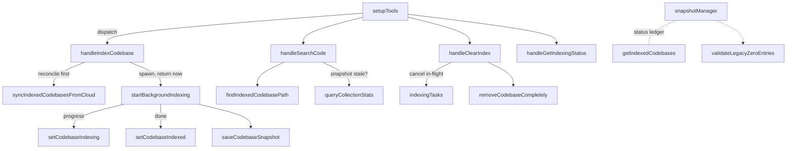

# MCP tool-handler layer (index / search / clear / status)

## Overview
This is the agent-facing surface of claude-context: the four MCP tools a coding agent actually
calls — `index_codebase`, `search_code`, `clear_index`, `get_indexing_status` — implemented as
methods on a single `ToolHandlers` class. Each handler owns *coordination*, not the heavy lifting:
it validates the agent's arguments, resolves the path, reconciles two sources of truth (a local
JSON snapshot vs. the Milvus/Zilliz vector store), then delegates the real work — chunking,
embedding, vector search — to the `context` (`Context`) object. The single organizing idea is that
**indexing is fire-and-forget background work** ([`handleIndexCodebase`](../catalog/packages/mcp/src/handlers.ts.md#ToolHandlers.handleIndexCodebase) returns immediately after
spawning [`startBackgroundIndexing`](../catalog/packages/mcp/src/handlers.ts.md#ToolHandlers.startBackgroundIndexing)), so all four tools have to gracefully handle a codebase that is
half-indexed, and the [`snapshotManager`](../catalog/packages/mcp/src/handlers.ts.md#ToolHandlers.snapshotManager) is the shared status ledger that lets them do it.

## Diagram

## Design rationale (why it's built this way)
The whole file is shaped by one painful failure mode, called out by name in the source: **the 0/0
force-reindex loop (Issue #295)**. If the snapshot ever records a codebase as `status: 'completed'`
with zero files and zero chunks, a client reads that as "not indexed", fires `index_codebase` with
`force=true`, which deletes the real Milvus data and rewrites 0/0 — an infinite self-destroying
loop. The defenses are layered: [`setCodebaseIndexed`](../catalog/packages/mcp/src/snapshot.ts.md#SnapshotManager.setCodebaseIndexed) *refuses at the lowest level* to persist a
`0/0 + completed` record regardless of caller, and [`validateLegacyZeroEntries`](../catalog/packages/mcp/src/handlers.ts.md#ToolHandlers.validateLegacyZeroEntries) does a one-shot
startup sweep to heal or delete any such phantom left behind by an older version. The recovery paths
that *write* a snapshot from vector-store evidence all route through [`queryCollectionStats`](../catalog/packages/mcp/src/handlers.ts.md#ToolHandlers.queryCollectionStats),
which returns `null` (rather than 0/0) when the row count is unknown or truly empty — so an
unverifiable collection is never allowed to poison the ledger.

The second rationale is **two sources of truth that drift**. The local snapshot (`~/.context/…json`)
and the remote Milvus/Zilliz collections can disagree — a collection created on another machine, a
snapshot left over from a crash. Rather than trust either blindly, every read-heavy handler calls
[`syncIndexedCodebasesFromCloud`](../catalog/packages/mcp/src/handlers.ts.md#ToolHandlers.syncIndexedCodebasesFromCloud) first to pull the cloud's view, and both index and search have a
fallback that reconciles the snapshot against `context.hasIndex(...)` before proceeding.

> [!inferred]
> Keeping all four tools in one `ToolHandlers` class (sharing the same `context` and `snapshotManager`
> instances via the [`<constructor>`](../catalog/packages/mcp/src/handlers.ts.md#ToolHandlers.-constructor)) is what makes cross-tool coordination — e.g. `clear_index`
> cancelling an in-flight index — possible without a separate coordinator; this is a reading of the
> structure, not a documented decision.

## Entry points
- [`setupTools`](../catalog/packages/mcp/src/index.ts.md#ContextMcpServer.setupTools) — registers the four MCP tools and their JSON input schemas with the server;
  the `index_codebase` / `search_code` descriptions it embeds are the natural-language contract the
  agent reads, and its `CallTool` dispatch is what routes an incoming tool call to the matching
  handler ([`handleIndexCodebase`](../catalog/packages/mcp/src/handlers.ts.md#ToolHandlers.handleIndexCodebase), [`handleSearchCode`](../catalog/packages/mcp/src/handlers.ts.md#ToolHandlers.handleSearchCode), [`handleClearIndex`](../catalog/packages/mcp/src/handlers.ts.md#ToolHandlers.handleClearIndex), [`handleGetIndexingStatus`](../catalog/packages/mcp/src/handlers.ts.md#ToolHandlers.handleGetIndexingStatus)).
- [`start`](../catalog/packages/mcp/src/index.ts.md#ContextMcpServer.start) — the server boot path; it runs [`validateLegacyZeroEntries`](../catalog/packages/mcp/src/handlers.ts.md#ToolHandlers.validateLegacyZeroEntries) *before* the stdio
  transport accepts any request, so a client never observes a poisoned 0/0 snapshot entry.

## Mechanism (step-by-step)
1. **Argument parsing and guardrails.** [`handleIndexCodebase`](../catalog/packages/mcp/src/handlers.ts.md#ToolHandlers.handleIndexCodebase) destructures the loosely-typed
   `args` (`path`, `force`, `splitter`, `customExtensions`, `ignorePatterns`), defaults the splitter
   to `'ast'`, and validates it via [`isRequestSplitterType`](../catalog/packages/mcp/src/splitter.ts.md#isRequestSplitterType) (only `'ast'` or `'langchain'` are
   accepted, matching [`RequestSplitterType`](../catalog/packages/mcp/src/config.ts.md#RequestSplitterType)). It packs the request-scoped knobs into a
   [`CodebaseIndexOptions`](../catalog/packages/mcp/src/config.ts.md#CodebaseIndexOptions) object ([`requestSplitter`](../catalog/packages/mcp/src/config.ts.md#CodebaseIndexOptions.requestSplitter), [`requestCustomExtensions`](../catalog/packages/mcp/src/config.ts.md#CodebaseIndexOptions.requestCustomExtensions),
   [`requestIgnorePatterns`](../catalog/packages/mcp/src/config.ts.md#CodebaseIndexOptions.requestIgnorePatterns)) that travels with the codebase into its snapshot record.
2. **Path normalization.** Every handler forces the agent-supplied path to absolute via
   [`ensureAbsolutePath`](../catalog/packages/mcp/src/utils.ts.md#ensureAbsolutePath), then checks it exists and is a directory before doing anything else.
   Search additionally logs the path with [`trackCodebasePath`](../catalog/packages/mcp/src/utils.ts.md#trackCodebasePath). Absolute paths are the join key
   for the whole status ledger, which is why the tool descriptions loudly demand them.
3. **Reconcile snapshot vs. cloud.** [`handleIndexCodebase`](../catalog/packages/mcp/src/handlers.ts.md#ToolHandlers.handleIndexCodebase) first calls
   [`syncIndexedCodebasesFromCloud`](../catalog/packages/mcp/src/handlers.ts.md#ToolHandlers.syncIndexedCodebasesFromCloud), which lists Milvus collections, extracts each collection's
   codebase path (from the `codebasePath:` description or a decoded name), and deletes local entries
   with no matching cloud collection — but bails out early if the cloud returns *zero* collections, to
   avoid nuking local state on a transient outage. It then compares `getIndexedCodebases().includes(path)`
   against `context.hasIndex(path)`; a snapshot-missing-but-cloud-present mismatch is healed via
   [`queryCollectionStats`](../catalog/packages/mcp/src/handlers.ts.md#ToolHandlers.queryCollectionStats) → [`setCodebaseIndexed`](../catalog/packages/mcp/src/snapshot.ts.md#SnapshotManager.setCodebaseIndexed), and the reverse mismatch is cleared with
   [`removeCodebaseCompletely`](../catalog/packages/mcp/src/snapshot.ts.md#SnapshotManager.removeCodebaseCompletely).
4. **Idempotency & force semantics.** Still in [`handleIndexCodebase`](../catalog/packages/mcp/src/handlers.ts.md#ToolHandlers.handleIndexCodebase): if the path is already in
   [`getIndexingCodebases`](../catalog/packages/mcp/src/snapshot.ts.md#SnapshotManager.getIndexingCodebases) it is rejected as "already indexing" (unless `force`, which clears the
   stale indexing entry). If already in [`getIndexedCodebases`](../catalog/packages/mcp/src/snapshot.ts.md#SnapshotManager.getIndexedCodebases) and not forcing, it returns
   "already indexed — use force=true". On `force`, it wipes both snapshot ([`removeCodebaseCompletely`](../catalog/packages/mcp/src/snapshot.ts.md#SnapshotManager.removeCodebaseCompletely))
   and the Milvus collection before re-indexing.
5. **Transition to `indexing` and spawn.** It marks the codebase `indexing` at 0% via
   [`setCodebaseIndexing`](../catalog/packages/mcp/src/snapshot.ts.md#SnapshotManager.setCodebaseIndexing) (persisting the request options), immediately persists with
   [`saveCodebaseSnapshot`](../catalog/packages/mcp/src/snapshot.ts.md#SnapshotManager.saveCodebaseSnapshot), then launches [`startBackgroundIndexing`](../catalog/packages/mcp/src/handlers.ts.md#ToolHandlers.startBackgroundIndexing) *without awaiting it* and
   records the `{ controller, promise }` pair in [`indexingTasks`](../catalog/packages/mcp/src/handlers.ts.md#ToolHandlers.indexingTasks). The handler returns a
   "started in background, you can search while it runs" message right away.
6. **Background indexing loop.** [`startBackgroundIndexing`](../catalog/packages/mcp/src/handlers.ts.md#ToolHandlers.startBackgroundIndexing) is where the delegation to `context`
   happens: it builds a splitter, resolves effective ignore patterns/extensions, wires a
   `FileSynchronizer`, then calls `context.indexCodebase(...)` with a progress callback that repeatedly
   calls [`setCodebaseIndexing`](../catalog/packages/mcp/src/snapshot.ts.md#SnapshotManager.setCodebaseIndexing) and throttles [`saveCodebaseSnapshot`](../catalog/packages/mcp/src/snapshot.ts.md#SnapshotManager.saveCodebaseSnapshot) to once every 2s. On
   success it records final stats with [`setCodebaseIndexed`](../catalog/packages/mcp/src/snapshot.ts.md#SnapshotManager.setCodebaseIndexed); on failure it records
   [`setCodebaseIndexFailed`](../catalog/packages/mcp/src/snapshot.ts.md#SnapshotManager.setCodebaseIndexFailed) with the last-known progress from [`getIndexingProgress`](../catalog/packages/mcp/src/snapshot.ts.md#SnapshotManager.getIndexingProgress) —
   *except* an `IndexAbortError`, which returns silently so a concurrent `clear_index` can own the teardown.
7. **Search path with prefix matching.** [`handleSearchCode`](../catalog/packages/mcp/src/handlers.ts.md#ToolHandlers.handleSearchCode) resolves the requested path against
   both indexed and indexing sets via [`findIndexedCodebasePath`](../catalog/packages/mcp/src/snapshot.ts.md#SnapshotManager.findIndexedCodebasePath) / [`findIndexingCodebasePath`](../catalog/packages/mcp/src/snapshot.ts.md#SnapshotManager.findIndexingCodebasePath)
   and picks the *longest matching* codebase, so a search inside a subdirectory of an indexed repo
   still routes to that repo's collection. If neither matches, it falls back to `context.hasIndex(...)`
   + [`queryCollectionStats`](../catalog/packages/mcp/src/handlers.ts.md#ToolHandlers.queryCollectionStats) to recover a lost snapshot (again refusing 0/0), otherwise returns a
   "not indexed" error. It then builds an optional `fileExtension in [...]` filter and calls
   `context.semanticSearch(...)`, formatting each hit as a ranked `relativePath:startLine-endLine`
   snippet. Searching a still-`indexing` codebase is allowed, with a "results may be incomplete" banner.
8. **Clear with cooperative cancel.** [`handleClearIndex`](../catalog/packages/mcp/src/handlers.ts.md#ToolHandlers.handleClearIndex) short-circuits if nothing is indexed
   ([`getIndexedCodebases`](../catalog/packages/mcp/src/snapshot.ts.md#SnapshotManager.getIndexedCodebases)/[`getIndexingCodebases`](../catalog/packages/mcp/src/snapshot.ts.md#SnapshotManager.getIndexingCodebases) both empty), then — critically — looks up any
   live task in [`indexingTasks`](../catalog/packages/mcp/src/handlers.ts.md#ToolHandlers.indexingTasks), calls `controller.abort()` and *awaits the promise* before dropping the
   Milvus collection, so the background task can't keep writing chunks into a just-cleared collection
   (Issue #199). Only then does it call `context.clearIndex(...)` and [`removeCodebaseCompletely`](../catalog/packages/mcp/src/snapshot.ts.md#SnapshotManager.removeCodebaseCompletely).
9. **Status reporting.** [`handleGetIndexingStatus`](../catalog/packages/mcp/src/handlers.ts.md#ToolHandlers.handleGetIndexingStatus) syncs from cloud, resolves the tracked path,
   reads [`getCodebaseStatus`](../catalog/packages/mcp/src/snapshot.ts.md#SnapshotManager.getCodebaseStatus) + [`getCodebaseInfo`](../catalog/packages/mcp/src/snapshot.ts.md#SnapshotManager.getCodebaseInfo), and renders a human-readable message per
   state (`indexed` with file/chunk counts, `indexing` with a percentage, `indexfailed`, `not_found`).

## Key data structures
- **The status ledger.** [`snapshotManager`](../catalog/packages/mcp/src/handlers.ts.md#ToolHandlers.snapshotManager) (a [`SnapshotManager`](../catalog/packages/mcp/src/snapshot.ts.md#SnapshotManager)) holds the canonical
  per-codebase state in [`codebaseInfoMap`](../catalog/packages/mcp/src/snapshot.ts.md#SnapshotManager.codebaseInfoMap) (`path → `[`CodebaseInfo`](../catalog/packages/mcp/src/config.ts.md#CodebaseInfo)), a discriminated union
  of [`CodebaseInfoIndexing`](../catalog/packages/mcp/src/config.ts.md#CodebaseInfoIndexing), [`CodebaseInfoIndexed`](../catalog/packages/mcp/src/config.ts.md#CodebaseInfoIndexed) (carrying [`indexedFiles`](../catalog/packages/mcp/src/config.ts.md#CodebaseInfoIndexed.indexedFiles) /
  [`totalChunks`](../catalog/packages/mcp/src/config.ts.md#CodebaseInfoIndexed.totalChunks)), and an index-failed variant, keyed by their `status` literal (`"indexing"`
  [status](../catalog/packages/mcp/src/config.ts.md#CodebaseInfoIndexing.status) / `"indexed"` [status](../catalog/packages/mcp/src/config.ts.md#CodebaseInfoIndexed.status) / `"indexfailed"`
  [status](../catalog/packages/mcp/src/config.ts.md#CodebaseInfoIndexFailed.status)). Redundant lists ([`indexedCodebases`](../catalog/packages/mcp/src/snapshot.ts.md#SnapshotManager.indexedCodebases),
  [`indexingCodebases`](../catalog/packages/mcp/src/snapshot.ts.md#SnapshotManager.indexingCodebases), [`codebaseFileCount`](../catalog/packages/mcp/src/snapshot.ts.md#SnapshotManager.codebaseFileCount)) exist as fast in-memory indexes over the same
  facts.
- **On-disk snapshot.** Persisted at [`snapshotFilePath`](../catalog/packages/mcp/src/snapshot.ts.md#SnapshotManager.snapshotFilePath) as a [`CodebaseSnapshot`](../catalog/packages/mcp/src/config.ts.md#CodebaseSnapshot) — a v1/v2
  union. [`isV2Format`](../catalog/packages/mcp/src/snapshot.ts.md#SnapshotManager.isV2Format) discriminates the newer [`codebases`](../catalog/packages/mcp/src/config.ts.md#CodebaseSnapshotV2.codebases) map form from the legacy
  [`indexingCodebases`](../catalog/packages/mcp/src/config.ts.md#CodebaseSnapshotV1.indexingCodebases) array. The reads ([`getIndexedCodebases`](../catalog/packages/mcp/src/snapshot.ts.md#SnapshotManager.getIndexedCodebases),
  [`getIndexingCodebases`](../catalog/packages/mcp/src/snapshot.ts.md#SnapshotManager.getIndexingCodebases)) re-read the JSON file each call for cross-process consistency, falling
  back to memory only on read error.
- **In-flight task registry.** [`indexingTasks`](../catalog/packages/mcp/src/handlers.ts.md#ToolHandlers.indexingTasks) maps an absolute path to its `AbortController` +
  `Promise`, the handle that lets `clear_index` cancel and join a running index.
- **Shared collaborators.** [`context`](../catalog/packages/mcp/src/handlers.ts.md#ToolHandlers.context) (the `Context` doing embedding/splitting/vector I/O) and
  [`snapshotManager`](../catalog/packages/mcp/src/handlers.ts.md#ToolHandlers.snapshotManager), both injected once via the [`<constructor>`](../catalog/packages/mcp/src/handlers.ts.md#ToolHandlers.-constructor).

## Dynamics (design intent)
The comments encode the concurrency contract. [`handleIndexCodebase`](../catalog/packages/mcp/src/handlers.ts.md#ToolHandlers.handleIndexCodebase) deliberately does *not* await
[`startBackgroundIndexing`](../catalog/packages/mcp/src/handlers.ts.md#ToolHandlers.startBackgroundIndexing) so search stays available during indexing; the `.finally` on that promise
only deletes its [`indexingTasks`](../catalog/packages/mcp/src/handlers.ts.md#ToolHandlers.indexingTasks) entry "if it still points at this run — a concurrent re-index may have
replaced us." [`handleClearIndex`](../catalog/packages/mcp/src/handlers.ts.md#ToolHandlers.handleClearIndex) awaits the aborted task before teardown specifically so background
embedding can't race the collection drop. And [`start`](../catalog/packages/mcp/src/index.ts.md#ContextMcpServer.start) ordering guarantees [`validateLegacyZeroEntries`](../catalog/packages/mcp/src/handlers.ts.md#ToolHandlers.validateLegacyZeroEntries)
runs to completion before the transport is live. Snapshot writes are further guarded by
[`saveCodebaseSnapshot`](../catalog/packages/mcp/src/snapshot.ts.md#SnapshotManager.saveCodebaseSnapshot)'s read-merge (it folds in disk entries this process doesn't know about, via
[`mergeExternalEntry`](../catalog/packages/mcp/src/snapshot.ts.md#SnapshotManager.mergeExternalEntry)) so two MCP processes sharing one snapshot file don't clobber each other.

> [!inferred]
> No test in the configured test paths references this subgraph (the packet's Evidence table is empty),
> so the concurrency claims above rest on source comments and structure, not on an executed test.

## Edge cases
- **The 0/0 phantom.** [`setCodebaseIndexed`](../catalog/packages/mcp/src/snapshot.ts.md#SnapshotManager.setCodebaseIndexed) hard-refuses a `0/0 + completed` write (logging a stack
  trace); [`validateLegacyZeroEntries`](../catalog/packages/mcp/src/handlers.ts.md#ToolHandlers.validateLegacyZeroEntries) heals older ones — but distinguishes a *missing* collection
  (permanent orphan → remove) from a `hasCollection` *throw* (likely transient → skip), so a network
  blip never destroys real state.
- **Stat imprecision.** [`queryCollectionStats`](../catalog/packages/mcp/src/handlers.ts.md#ToolHandlers.queryCollectionStats) has only a chunk row-count, no file count, so recovered
  entries reuse `rowCount` for both [`indexedFiles`](../catalog/packages/mcp/src/config.ts.md#CodebaseInfoIndexed.indexedFiles) and [`totalChunks`](../catalog/packages/mcp/src/config.ts.md#CodebaseInfoIndexed.totalChunks) until the next full index corrects it.
- **Subdirectory search.** The longest-prefix selection in [`handleSearchCode`](../catalog/packages/mcp/src/handlers.ts.md#ToolHandlers.handleSearchCode) means a path that is a
  child of an indexed root still resolves; the response notes when the requested path was "covered by"
  a broader indexed codebase.
- **Chunk-limit truncation.** A background index can finish with `indexStatus: 'limit_reached'` (the
  450k-chunk cap), surfaced in the completion message and stored in [`CodebaseInfoIndexed`](../catalog/packages/mcp/src/config.ts.md#CodebaseInfoIndexed) — the index
  is usable but incomplete.
- **Collection limit.** Both index and search special-case the `COLLECTION_LIMIT_MESSAGE`, returning it
  as a *non-error* content so the agent treats it as a final answer rather than retrying.
- **Failure isolation.** Every handler wraps its body in try/catch and always returns a structured MCP
  response (`isError: true`) rather than throwing, so a bad path or a downstream exception never crashes
  the stdio server.

## Open questions
- The concrete work — AST vs. langchain splitting, embedding generation, Milvus upsert and
  `semanticSearch` — lives behind `context` (`Context`), which is only a term in this subgraph; see the
  `packages-core-src-context.ts` concept page for the substrate this layer coordinates.
- `resolveIndexOptions` / [`getIndexOptions`](../catalog/packages/mcp/src/snapshot.ts.md#SnapshotManager.getIndexOptions) merge request-scoped options with any previously stored ones,
  but the precedence when an agent passes *different* options on a re-index is only partially visible here.
- `findBestMatchingCodebasePath` (used by [`findIndexedCodebasePath`](../catalog/packages/mcp/src/snapshot.ts.md#SnapshotManager.findIndexedCodebasePath)) is not in this subgraph, so the exact
  matching rule beyond "longest path wins" isn't fully grounded on this page.

## See also
- `packages-mcp-src-snapshot.ts` — the [`SnapshotManager`](../catalog/packages/mcp/src/snapshot.ts.md#SnapshotManager) status ledger these handlers drive.
- `packages-mcp-src-sync.ts` — the background sync manager started alongside these tools.
- `packages-core-src-context.ts` — the `Context` that owns splitting, embedding, and vector search.
- `packages-core-src-sync-synchronizer.ts` — the Merkle-tree file synchronizer background indexing wires up.
- `packages-core-src-splitter-ast-splitter.ts` — the AST splitter selected by the `splitter: 'ast'` option.
