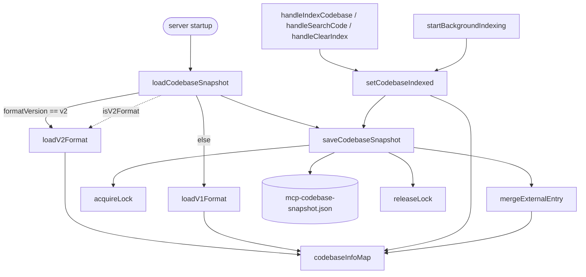

# Indexed-codebase snapshot persistence (SnapshotManager)

How the claude-context MCP server remembers, across restarts, *which* codebases it has indexed and
what state each is in — a small JSON control plane that sits beside (never inside) the vector store.

## Overview
The `SnapshotManager` is the MCP server's durable memory of its own indexing work. The actual searchable
substrate — code chunks and their embeddings — lives in Milvus/Zilliz; this class persists only the
*bookkeeping*: for every codebase path, is it `indexing`, `indexed`, or `indexfailed`, plus stats
(file count, chunk count) and the request-level options used to index it. State is written to a single
file at `~/.context/mcp-codebase-snapshot.json` ([`snapshotFilePath`](../catalog/packages/mcp/src/snapshot.ts.md#SnapshotManager.snapshotFilePath))
and reloaded on startup. The single key design idea is that a **discriminated-union info map**
([`codebaseInfoMap`](../catalog/packages/mcp/src/snapshot.ts.md#SnapshotManager.codebaseInfoMap) of
[`CodebaseInfo`](../catalog/packages/mcp/src/config.ts.md#CodebaseInfo)) is the single source of truth,
from which flat lists ([`indexedCodebases`](../catalog/packages/mcp/src/snapshot.ts.md#SnapshotManager.indexedCodebases),
[`indexingCodebases`](../catalog/packages/mcp/src/snapshot.ts.md#SnapshotManager.indexingCodebases)) are
derived for fast lookup — and everything is hardened against the two ways this file gets corrupted:
a server crash mid-index, and two MCP processes writing the same file.

## Diagram

## Design rationale (why it's built this way)

**One info map, many views.** The class keeps
[`codebaseInfoMap`](../catalog/packages/mcp/src/snapshot.ts.md#SnapshotManager.codebaseInfoMap) as the
authoritative store and denormalizes it into
[`indexedCodebases`](../catalog/packages/mcp/src/snapshot.ts.md#SnapshotManager.indexedCodebases),
[`indexingCodebases`](../catalog/packages/mcp/src/snapshot.ts.md#SnapshotManager.indexingCodebases), and
[`codebaseFileCount`](../catalog/packages/mcp/src/snapshot.ts.md#SnapshotManager.codebaseFileCount). Because
[`CodebaseInfo`](../catalog/packages/mcp/src/config.ts.md#CodebaseInfo) is a discriminated union over a
`status` tag — [`indexing`](../catalog/packages/mcp/src/config.ts.md#CodebaseInfoIndexing.status),
[`indexed`](../catalog/packages/mcp/src/config.ts.md#CodebaseInfoIndexed.status),
[`indexfailed`](../catalog/packages/mcp/src/config.ts.md#CodebaseInfoIndexFailed.status) — every state
carries exactly the fields it needs and nothing it doesn't:
[`CodebaseInfoIndexed`](../catalog/packages/mcp/src/config.ts.md#CodebaseInfoIndexed) has
[`indexedFiles`](../catalog/packages/mcp/src/config.ts.md#CodebaseInfoIndexed.indexedFiles) /
[`totalChunks`](../catalog/packages/mcp/src/config.ts.md#CodebaseInfoIndexed.totalChunks) /
[`indexStatus`](../catalog/packages/mcp/src/config.ts.md#CodebaseInfoIndexed.indexStatus), while
[`CodebaseInfoIndexFailed`](../catalog/packages/mcp/src/config.ts.md#CodebaseInfoIndexFailed) carries an
[`errorMessage`](../catalog/packages/mcp/src/config.ts.md#CodebaseInfoIndexFailed.errorMessage) and the
[`lastAttemptedPercentage`](../catalog/packages/mcp/src/config.ts.md#CodebaseInfoIndexFailed.lastAttemptedPercentage)
for a possible retry.

**Two on-disk formats, and load always migrates forward.** The file exists in a legacy
[`CodebaseSnapshotV1`](../catalog/packages/mcp/src/config.ts.md#CodebaseSnapshotV1) shape (bare arrays:
[`indexedCodebases`](../catalog/packages/mcp/src/config.ts.md#CodebaseSnapshotV1.indexedCodebases) plus an
[`indexingCodebases`](../catalog/packages/mcp/src/config.ts.md#CodebaseSnapshotV1.indexingCodebases) that is
*either* a string array or a path→percent record) and a current
[`CodebaseSnapshotV2`](../catalog/packages/mcp/src/config.ts.md#CodebaseSnapshotV2) shape (a
[`codebases`](../catalog/packages/mcp/src/config.ts.md#CodebaseSnapshotV2.codebases) map of rich
`CodebaseInfo`). [`isV2Format`](../catalog/packages/mcp/src/snapshot.ts.md#SnapshotManager.isV2Format)
discriminates purely on the presence of
[`formatVersion`](../catalog/packages/mcp/src/config.ts.md#CodebaseSnapshotV2.formatVersion) `=== 'v2'`. The
author's intent for each loader is explicit — "Convert v1/v2 format to internal state" — and
[`loadCodebaseSnapshot`](../catalog/packages/mcp/src/snapshot.ts.md#SnapshotManager.loadCodebaseSnapshot)
always re-saves via [`saveCodebaseSnapshot`](../catalog/packages/mcp/src/snapshot.ts.md#SnapshotManager.saveCodebaseSnapshot)
after loading, so a v1 file is silently upgraded to v2 on first read and the v1 path decays.

**A crash mid-index must never look like success.** Because the server can die while a codebase is being
indexed, both loaders treat a persisted `indexing` state as untrustworthy on reload.
[`loadV2Format`](../catalog/packages/mcp/src/snapshot.ts.md#SnapshotManager.loadV2Format) rewrites an
interrupted [`indexing`](../catalog/packages/mcp/src/config.ts.md#CodebaseInfoIndexing.status) entry into a
[`CodebaseInfoIndexFailed`](../catalog/packages/mcp/src/config.ts.md#CodebaseInfoIndexFailed) with the
message "Indexing was interrupted (MCP server restarted)", preserving its
[`indexingPercentage`](../catalog/packages/mcp/src/config.ts.md#CodebaseInfoIndexing.indexingPercentage) as
[`lastAttemptedPercentage`](../catalog/packages/mcp/src/config.ts.md#CodebaseInfoIndexFailed.lastAttemptedPercentage);
[`loadV1Format`](../catalog/packages/mcp/src/snapshot.ts.md#SnapshotManager.loadV1Format) is blunter and
simply drops interrupted entries as "not indexed."

**The 0/0+completed guard (Issue #295).** The most consequential single line here is defensive:
[`setCodebaseIndexed`](../catalog/packages/mcp/src/snapshot.ts.md#SnapshotManager.setCodebaseIndexed)
*refuses* to persist a record whose
[`indexedFiles`](../catalog/packages/mcp/src/snapshot.ts.md#SnapshotManager.setCodebaseIndexed.stats-typeLiteral146.indexedFiles)
and [`totalChunks`](../catalog/packages/mcp/src/snapshot.ts.md#SnapshotManager.setCodebaseIndexed.stats-typeLiteral146.totalChunks)
are both 0 while [`status`](../catalog/packages/mcp/src/snapshot.ts.md#SnapshotManager.setCodebaseIndexed.stats-typeLiteral146.status)
is `completed`. The inline comment explains the failure mode: a client reads 0/0 as "not indexed," triggers a
force-reindex that deletes the real data and rewrites 0/0 — an infinite destructive loop. The guard breaks
that loop at the persistence boundary regardless of caller.

## Entry points
- [`loadCodebaseSnapshot`](../catalog/packages/mcp/src/snapshot.ts.md#SnapshotManager.loadCodebaseSnapshot) — called
  at server startup; reads the JSON file, dispatches on
  [`isV2Format`](../catalog/packages/mcp/src/snapshot.ts.md#SnapshotManager.isV2Format), and rehydrates the
  in-memory maps. On any parse/read error it swallows the exception and starts with an empty list rather than crashing.
- [`saveCodebaseSnapshot`](../catalog/packages/mcp/src/snapshot.ts.md#SnapshotManager.saveCodebaseSnapshot) — the
  single write path; every state mutation is followed by a call here to make the change durable.
- [`setCodebaseIndexed`](../catalog/packages/mcp/src/snapshot.ts.md#SnapshotManager.setCodebaseIndexed) — the
  completion transition (author intent: "Set codebase to indexed status with complete statistics"); it is the
  gate where the 0/0 guard lives, invoked from the indexing and healing paths below.
- [`handleIndexCodebase`](../catalog/packages/mcp/src/handlers.ts.md#ToolHandlers.handleIndexCodebase) and
  [`startBackgroundIndexing`](../catalog/packages/mcp/src/handlers.ts.md#ToolHandlers.startBackgroundIndexing) — the
  MCP `index_codebase` tool and its background worker, which drive a codebase from indexing to indexed/failed and
  persist each transition.
- [`handleSearchCode`](../catalog/packages/mcp/src/handlers.ts.md#ToolHandlers.handleSearchCode) — the `search_code`
  tool; it consults the snapshot to decide whether a path is indexed before searching, and can repair the snapshot
  when it finds the vector store and snapshot disagree.
- [`handleClearIndex`](../catalog/packages/mcp/src/handlers.ts.md#ToolHandlers.handleClearIndex) — the `clear_index`
  tool; removes a codebase and persists the removal.
- [`syncIndexedCodebasesFromCloud`](../catalog/packages/mcp/src/handlers.ts.md#ToolHandlers.syncIndexedCodebasesFromCloud) —
  reconciles the local snapshot against Zilliz Cloud collections (author intent: "Sync indexed codebases from Zilliz
  Cloud collections"), so a snapshot deleted locally can be rebuilt from the cloud side of truth.
- [`validateLegacyZeroEntries`](../catalog/packages/mcp/src/handlers.ts.md#ToolHandlers.validateLegacyZeroEntries) — a
  one-shot startup pass (author intent: "find any legacy 0/0+completed entries on disk") that heals or removes the
  phantom entries that predate the 0/0 guard.

## Mechanism (step-by-step)

1. **Load and discriminate.** At startup,
   [`loadCodebaseSnapshot`](../catalog/packages/mcp/src/snapshot.ts.md#SnapshotManager.loadCodebaseSnapshot) reads the
   file at [`snapshotFilePath`](../catalog/packages/mcp/src/snapshot.ts.md#SnapshotManager.snapshotFilePath); a missing
   file is a normal empty start. It then calls
   [`isV2Format`](../catalog/packages/mcp/src/snapshot.ts.md#SnapshotManager.isV2Format) and routes to either
   [`loadV2Format`](../catalog/packages/mcp/src/snapshot.ts.md#SnapshotManager.loadV2Format) or
   [`loadV1Format`](../catalog/packages/mcp/src/snapshot.ts.md#SnapshotManager.loadV1Format).

2. **Rehydrate with existence + interruption checks (v2).**
   [`loadV2Format`](../catalog/packages/mcp/src/snapshot.ts.md#SnapshotManager.loadV2Format) iterates
   [`codebases`](../catalog/packages/mcp/src/config.ts.md#CodebaseSnapshotV2.codebases). Any path that no longer
   exists on disk is dropped and recorded in
   [`recentlyRemoved`](../catalog/packages/mcp/src/snapshot.ts.md#SnapshotManager.recentlyRemoved). Surviving
   [`indexed`](../catalog/packages/mcp/src/config.ts.md#CodebaseInfoIndexed.status) entries repopulate the derived
   lists; [`indexing`](../catalog/packages/mcp/src/config.ts.md#CodebaseInfoIndexing.status) entries are demoted to
   [`CodebaseInfoIndexFailed`](../catalog/packages/mcp/src/config.ts.md#CodebaseInfoIndexFailed) (carrying the index
   options recovered by [`getIndexOptions`](../catalog/packages/mcp/src/snapshot.ts.md#SnapshotManager.getIndexOptions));
   already-failed entries are kept in the map for retry but excluded from the active lists.

3. **Rehydrate the legacy format (v1).**
   [`loadV1Format`](../catalog/packages/mcp/src/snapshot.ts.md#SnapshotManager.loadV1Format) validates each path in
   [`indexedCodebases`](../catalog/packages/mcp/src/config.ts.md#CodebaseSnapshotV1.indexedCodebases), handles both the
   array and record encodings of
   [`indexingCodebases`](../catalog/packages/mcp/src/config.ts.md#CodebaseSnapshotV1.indexingCodebases), and synthesizes
   minimal [`CodebaseInfoIndexed`](../catalog/packages/mcp/src/config.ts.md#CodebaseInfoIndexed) records — with
   [`indexedFiles`](../catalog/packages/mcp/src/config.ts.md#CodebaseInfoIndexed.indexedFiles) and
   [`totalChunks`](../catalog/packages/mcp/src/config.ts.md#CodebaseInfoIndexed.totalChunks) at 0 because v1 never
   stored them. (These synthesized zeros are exactly the phantoms step 8 later heals.)

4. **Drive a codebase to `indexing`, then `indexed`.** When
   [`handleIndexCodebase`](../catalog/packages/mcp/src/handlers.ts.md#ToolHandlers.handleIndexCodebase) accepts an
   `index_codebase` request it validates the requested
   [`RequestSplitterType`](../catalog/packages/mcp/src/config.ts.md#RequestSplitterType) and assembles a
   [`CodebaseIndexOptions`](../catalog/packages/mcp/src/config.ts.md#CodebaseIndexOptions), then hands off to
   [`startBackgroundIndexing`](../catalog/packages/mcp/src/handlers.ts.md#ToolHandlers.startBackgroundIndexing). On
   completion the worker calls
   [`setCodebaseIndexed`](../catalog/packages/mcp/src/snapshot.ts.md#SnapshotManager.setCodebaseIndexed) and then
   [`saveCodebaseSnapshot`](../catalog/packages/mcp/src/snapshot.ts.md#SnapshotManager.saveCodebaseSnapshot).

5. **Apply the completion guard, then commit the record.**
   [`setCodebaseIndexed`](../catalog/packages/mcp/src/snapshot.ts.md#SnapshotManager.setCodebaseIndexed) first bails on
   the 0/0+completed combination described above; otherwise it moves the path out of
   [`indexingCodebases`](../catalog/packages/mcp/src/snapshot.ts.md#SnapshotManager.indexingCodebases) into
   [`indexedCodebases`](../catalog/packages/mcp/src/snapshot.ts.md#SnapshotManager.indexedCodebases), records the file
   count in [`codebaseFileCount`](../catalog/packages/mcp/src/snapshot.ts.md#SnapshotManager.codebaseFileCount), and
   writes a [`CodebaseInfoIndexed`](../catalog/packages/mcp/src/config.ts.md#CodebaseInfoIndexed) into the map with the
   resolved options from
   [`resolveIndexOptions`](../catalog/packages/mcp/src/snapshot.ts.md#SnapshotManager.resolveIndexOptions) and a fresh
   [`lastUpdated`](../catalog/packages/mcp/src/config.ts.md#CodebaseInfoBase.lastUpdated) timestamp.

6. **Carry index options across transitions.** So a request's splitter/extensions/ignore-patterns survive a state
   change, [`resolveIndexOptions`](../catalog/packages/mcp/src/snapshot.ts.md#SnapshotManager.resolveIndexOptions) falls
   back to the *existing* map entry when no explicit options are passed, and
   [`getIndexOptions`](../catalog/packages/mcp/src/snapshot.ts.md#SnapshotManager.getIndexOptions) whitelists only the
   three known fields — [`requestSplitter`](../catalog/packages/mcp/src/config.ts.md#CodebaseIndexOptions.requestSplitter),
   [`requestCustomExtensions`](../catalog/packages/mcp/src/config.ts.md#CodebaseIndexOptions.requestCustomExtensions),
   [`requestIgnorePatterns`](../catalog/packages/mcp/src/config.ts.md#CodebaseIndexOptions.requestIgnorePatterns) — so no
   stray properties leak into the persisted [`CodebaseInfoBase`](../catalog/packages/mcp/src/config.ts.md#CodebaseInfoBase).
   The test `snapshot.request-options.test.ts`
   asserts these options are preserved across indexing→indexed transitions.

7. **Persist safely under concurrency.**
   [`saveCodebaseSnapshot`](../catalog/packages/mcp/src/snapshot.ts.md#SnapshotManager.saveCodebaseSnapshot) takes a
   directory-based lock via
   [`acquireLock`](../catalog/packages/mcp/src/snapshot.ts.md#SnapshotManager.acquireLock) (which reclaims a lock older
   than 10s), read-merges any entries already on disk that it doesn't know about through
   [`mergeExternalEntry`](../catalog/packages/mcp/src/snapshot.ts.md#SnapshotManager.mergeExternalEntry), serializes the
   full [`codebaseInfoMap`](../catalog/packages/mcp/src/snapshot.ts.md#SnapshotManager.codebaseInfoMap) into a
   [`CodebaseSnapshotV2`](../catalog/packages/mcp/src/config.ts.md#CodebaseSnapshotV2) with a fresh
   [`lastUpdated`](../catalog/packages/mcp/src/config.ts.md#CodebaseSnapshotV2.lastUpdated), clears
   [`recentlyRemoved`](../catalog/packages/mcp/src/snapshot.ts.md#SnapshotManager.recentlyRemoved), and finally calls
   [`releaseLock`](../catalog/packages/mcp/src/snapshot.ts.md#SnapshotManager.releaseLock). The merge skips paths already
   known or recently removed, so another process's concurrent write is not clobbered and a locally-deleted entry is not
   resurrected from disk.

8. **Reconcile against ground truth and heal phantoms.** Read/search entry points call
   [`syncIndexedCodebasesFromCloud`](../catalog/packages/mcp/src/handlers.ts.md#ToolHandlers.syncIndexedCodebasesFromCloud)
   first, so the snapshot tracks the Zilliz Cloud collections that are the real store; the search path itself
   ([`handleSearchCode`](../catalog/packages/mcp/src/handlers.ts.md#ToolHandlers.handleSearchCode)) can re-derive a
   snapshot entry from a confirmed collection row count when the two disagree. At startup,
   [`validateLegacyZeroEntries`](../catalog/packages/mcp/src/handlers.ts.md#ToolHandlers.validateLegacyZeroEntries)
   sweeps the 0/0 `indexed` records left by v1: it probes whether the matching vector collection exists (a definite "no"
   removes the phantom; a thrown error is treated as transient and skipped), and where a real row count is found it heals
   the entry via [`setCodebaseIndexed`](../catalog/packages/mcp/src/snapshot.ts.md#SnapshotManager.setCodebaseIndexed).
   `handlers.get-indexing-status.test.ts`
   pins the invariant that status is read only after a cloud sync.

## Key data structures
- [`codebaseInfoMap`](../catalog/packages/mcp/src/snapshot.ts.md#SnapshotManager.codebaseInfoMap): `Map<path, CodebaseInfo>` —
  the authoritative in-memory state; everything else is derived from it and it is what gets serialized.
- [`indexedCodebases`](../catalog/packages/mcp/src/snapshot.ts.md#SnapshotManager.indexedCodebases) /
  [`indexingCodebases`](../catalog/packages/mcp/src/snapshot.ts.md#SnapshotManager.indexingCodebases) /
  [`codebaseFileCount`](../catalog/packages/mcp/src/snapshot.ts.md#SnapshotManager.codebaseFileCount): denormalized
  fast-lookup views (a string list, a path→percent map, a path→count map).
- [`recentlyRemoved`](../catalog/packages/mcp/src/snapshot.ts.md#SnapshotManager.recentlyRemoved): a `Set` of paths
  deleted since the last save, used by
  [`mergeExternalEntry`](../catalog/packages/mcp/src/snapshot.ts.md#SnapshotManager.mergeExternalEntry) to avoid
  resurrecting them from disk; cleared after a successful write.
- [`CodebaseInfo`](../catalog/packages/mcp/src/config.ts.md#CodebaseInfo): the union type
  ([`CodebaseInfoIndexing`](../catalog/packages/mcp/src/config.ts.md#CodebaseInfoIndexing) |
  [`CodebaseInfoIndexed`](../catalog/packages/mcp/src/config.ts.md#CodebaseInfoIndexed) |
  [`CodebaseInfoIndexFailed`](../catalog/packages/mcp/src/config.ts.md#CodebaseInfoIndexFailed)), all extending
  [`CodebaseInfoBase`](../catalog/packages/mcp/src/config.ts.md#CodebaseInfoBase) (which itself extends
  [`CodebaseIndexOptions`](../catalog/packages/mcp/src/config.ts.md#CodebaseIndexOptions) and adds
  [`lastUpdated`](../catalog/packages/mcp/src/config.ts.md#CodebaseInfoBase.lastUpdated)).
- On-disk envelope: [`CodebaseSnapshotV2`](../catalog/packages/mcp/src/config.ts.md#CodebaseSnapshotV2) (current) vs.
  [`CodebaseSnapshotV1`](../catalog/packages/mcp/src/config.ts.md#CodebaseSnapshotV1) (legacy).

## Dynamics (design intent)
The design assumes **multiple MCP processes may share one snapshot file**: hence the mkdir-based mutex in
[`acquireLock`](../catalog/packages/mcp/src/snapshot.ts.md#SnapshotManager.acquireLock) and the read-merge in
[`saveCodebaseSnapshot`](../catalog/packages/mcp/src/snapshot.ts.md#SnapshotManager.saveCodebaseSnapshot) via
[`mergeExternalEntry`](../catalog/packages/mcp/src/snapshot.ts.md#SnapshotManager.mergeExternalEntry). It also assumes
**the vector store, not this file, is ground truth** — the reconcile path
[`syncIndexedCodebasesFromCloud`](../catalog/packages/mcp/src/handlers.ts.md#ToolHandlers.syncIndexedCodebasesFromCloud)
runs before status reads, and the tests
`snapshot.request-options.test.ts`
and
`handlers.get-indexing-status.test.ts`
document the two invariants the maintainers care about: index options survive state transitions, and status is read only
after a cloud sync.

> [!inferred]
> The lock is best-effort, not a hard guarantee — [`acquireLock`](../catalog/packages/mcp/src/snapshot.ts.md#SnapshotManager.acquireLock)
> returns `false` after its retries and the save proceeds anyway ("saving without lock"). The read-merge is what actually
> protects concurrent writers from losing each other's entries; the lock only narrows the window.

## Edge cases
- **Interrupted indexing.** A persisted `indexing` state after a restart is never trusted:
  [`loadV2Format`](../catalog/packages/mcp/src/snapshot.ts.md#SnapshotManager.loadV2Format) demotes it to
  [`indexfailed`](../catalog/packages/mcp/src/config.ts.md#CodebaseInfoIndexFailed.status), and
  [`loadV1Format`](../catalog/packages/mcp/src/snapshot.ts.md#SnapshotManager.loadV1Format) drops it.
- **Vanished directory.** A path in the snapshot that no longer exists on disk is removed on load and tracked in
  [`recentlyRemoved`](../catalog/packages/mcp/src/snapshot.ts.md#SnapshotManager.recentlyRemoved).
- **0/0+completed.** Refused at the write boundary in
  [`setCodebaseIndexed`](../catalog/packages/mcp/src/snapshot.ts.md#SnapshotManager.setCodebaseIndexed); pre-existing
  such entries are healed or removed by
  [`validateLegacyZeroEntries`](../catalog/packages/mcp/src/handlers.ts.md#ToolHandlers.validateLegacyZeroEntries),
  which distinguishes a permanent orphan (no collection) from a transient probe failure so it never destroys real state
  on a network blip.
- **Corrupt/unreadable file.** [`loadCodebaseSnapshot`](../catalog/packages/mcp/src/snapshot.ts.md#SnapshotManager.loadCodebaseSnapshot)
  catches parse errors and starts empty rather than propagating.
- **Cloud has zero collections.**
  [`syncIndexedCodebasesFromCloud`](../catalog/packages/mcp/src/handlers.ts.md#ToolHandlers.syncIndexedCodebasesFromCloud)
  deliberately skips deletion when the cloud returns no collections, to avoid wiping local state on a transient outage.

## Open questions
- The subgraph exposes [`getFailedCodebases`](../catalog/packages/mcp/src/snapshot.ts.md#SnapshotManager.getFailedCodebases)
  (author intent: "Get all failed codebases") but not the read accessors (`getCodebaseStatus`, `getCodebaseInfo`,
  `getIndexedCodebases`) that consumers actually call to route search — those live in the same file but outside this
  packet's citable set, so the full read side of the snapshot is out of scope here.
- Whether the `mergeExternalEntry` read-merge is sufficient under heavy multi-process contention (versus atomic
  temp-file rename) is not settled by anything visible in this subgraph.

## See also
- [MCP snapshot type definitions (config.ts)](packages-mcp-src-config.ts.md) — the `CodebaseInfo` union and V1/V2
  envelope types this page persists.
- [MCP tool handlers (handlers.ts)](packages-mcp-src-handlers.ts.md) — the `index_codebase` / `search_code` /
  `clear_index` tools that mutate and reconcile the snapshot.
- [MCP incremental sync (sync.ts)](packages-mcp-src-sync.ts.md) — the file-change detection that decides what to
  re-index once a codebase is tracked here.
- [Merkle-tree change detection (core sync/merkle.ts)](packages-core-src-sync-merkle.ts.md) —
  the substrate behind incremental re-index.
