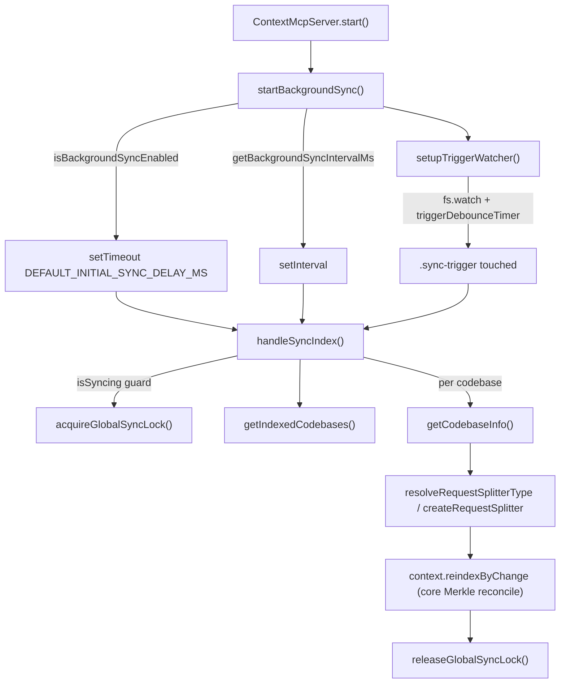

# MCP background sync loop (server-side reconcile driver)

<!-- connect:up:begin -->
> **Cross-repo concept:** part of [incremental-reconcile](../../../concepts/incremental-reconcile.md) across this wiki's repos.
<!-- connect:up:end -->
The MCP server keeps its vector indexes fresh *while it runs*: a long-lived `SyncManager` re-scans
every indexed codebase on a timer (and on an explicit trigger), letting the core Merkle-based
synchronizer diff the tree and re-embed only what changed. This page is about the **driver** — the
scheduling, cross-process locking, and per-codebase fan-out that sits on top of the core reconcile
engine. It is claude-context's answer to "the index goes stale the moment the agent edits a file":
rather than re-index on every keystroke, it batches change detection into periodic passes plus an
opt-in instant path.

## Diagram

## Design rationale (why it's built this way)

The whole subsystem is layered so that **staleness has three independent escape hatches, each cheaper
to disable than the last**. The trigger watcher is set up *first and unconditionally* in
[`startBackgroundSync`](../catalog/packages/mcp/src/sync.ts.md#SyncManager.startBackgroundSync), before
the background-sync enable check — so an integration (e.g. a Claude Code PostToolUse hook touching
`~/.context/.sync-trigger`) can get instant re-index even in a deployment that has turned periodic
polling off. Periodic polling is the fallback that catches edits made by anything that *doesn't* touch
the trigger file.

Every knob is an env var with a validated default. Background polling defaults on
([`isBackgroundSyncEnabled`](../catalog/packages/mcp/src/sync.ts.md#isBackgroundSyncEnabled)) at a
5-minute interval, floored at 1s to stop a misconfiguration from busy-looping
([`getBackgroundSyncIntervalMs`](../catalog/packages/mcp/src/sync.ts.md#getBackgroundSyncIntervalMs)
clamps against [`MIN_SYNC_INTERVAL_MS`](../catalog/packages/mcp/src/sync.ts.md#MIN_SYNC_INTERVAL_MS)).
The trigger watcher's own docstring on
[`isTriggerWatcherEnabled`](../catalog/packages/mcp/src/sync.ts.md#SyncManager.isTriggerWatcherEnabled)
explains the default-ON choice: *"the watcher is cheap and only fires when an external process
explicitly touches the trigger file. Users who want zero filesystem watching (e.g. read-only
filesystems, sandboxed envs) can disable it."*

The most subtle decision is the **global, cross-process lock**
([`acquireGlobalSyncLock`](../catalog/packages/mcp/src/sync.ts.md#SyncManager.acquireGlobalSyncLock)).
A single MCP process already has an in-memory
[`isSyncing`](../catalog/packages/mcp/src/sync.ts.md#SyncManager.isSyncing) guard, but multiple MCP
servers can point at the same on-disk snapshot and the same vector collection. The lock is a
filesystem `mkdir` of a lock *directory* (atomic under POSIX) with an owner token file, so two
processes can't reconcile the same codebase concurrently and corrupt the shared snapshot/index.

> [!inferred]
> The env-var-with-clamped-default pattern and the mkdir-as-mutex are standard defensive-daemon
> idioms; the code shows the mechanism, the *why* (avoiding concurrent writers to a shared snapshot)
> is my reading of the token-ownership checks in acquire/release.

## Entry points

- [`start`](../catalog/packages/mcp/src/index.ts.md#ContextMcpServer.start) — the MCP server's boot
  method. After it heals legacy snapshot entries and connects the stdio transport, it calls
  `startBackgroundSync`, so sync begins only once the server is actually listening.
- [`startBackgroundSync`](../catalog/packages/mcp/src/sync.ts.md#SyncManager.startBackgroundSync) — the
  one-time wiring call. Installs the trigger watcher, the delayed initial sync, and the recurring
  interval. Returns immediately; all real work happens later in callbacks.
- [`setupTriggerWatcher`](../catalog/packages/mcp/src/sync.ts.md#SyncManager.setupTriggerWatcher) —
  *"Watch for trigger file changes to enable instant re-index."* Control reaches it once from
  `startBackgroundSync`; thereafter the OS `fs.watch` callback drives it.
- [`handleSyncIndex`](../catalog/packages/mcp/src/sync.ts.md#SyncManager.handleSyncIndex) — the single
  reconcile pass over all indexed codebases. Reached three ways: the initial delayed timer, each
  periodic tick, and each debounced trigger-file event.

## Mechanism (step-by-step)

1. **Boot wiring.** [`start`](../catalog/packages/mcp/src/index.ts.md#ContextMcpServer.start) calls
   [`startBackgroundSync`](../catalog/packages/mcp/src/sync.ts.md#SyncManager.startBackgroundSync) after
   the transport connects. `startBackgroundSync` first calls `setupTriggerWatcher` (unconditionally),
   then bails out of the *polling* setup if
   [`isBackgroundSyncEnabled`](../catalog/packages/mcp/src/sync.ts.md#isBackgroundSyncEnabled) is false.
   Otherwise it reads the cadence from
   [`getBackgroundSyncIntervalMs`](../catalog/packages/mcp/src/sync.ts.md#getBackgroundSyncIntervalMs),
   schedules one initial `handleSyncIndex` via `setTimeout` after
   [`DEFAULT_INITIAL_SYNC_DELAY_MS`](../catalog/packages/mcp/src/sync.ts.md#DEFAULT_INITIAL_SYNC_DELAY_MS)
   (5s, to let the server settle), and arms a `setInterval` that fires `handleSyncIndex` forever. The
   interval default lives in
   [`DEFAULT_SYNC_INTERVAL_MS`](../catalog/packages/mcp/src/sync.ts.md#DEFAULT_SYNC_INTERVAL_MS).

2. **Instant-path watcher.**
   [`setupTriggerWatcher`](../catalog/packages/mcp/src/sync.ts.md#SyncManager.setupTriggerWatcher)
   returns early if disabled
   ([`isTriggerWatcherEnabled`](../catalog/packages/mcp/src/sync.ts.md#SyncManager.isTriggerWatcherEnabled))
   or already active (the [`triggerWatcher`](../catalog/packages/mcp/src/sync.ts.md#SyncManager.triggerWatcher)
   field is non-null — a guard against hot-reload double-init). It `fs.watch`es `~/.context`, filters
   events down to the `.sync-trigger` filename, and debounces them 2s through
   [`triggerDebounceTimer`](../catalog/packages/mcp/src/sync.ts.md#SyncManager.triggerDebounceTimer)
   before firing `handleSyncIndex` (fire-and-forget with an explicit `.catch`, so a rejection inside the
   timer callback can't crash the process). An async `error` listener on the watcher calls
   [`stopTriggerWatcher`](../catalog/packages/mcp/src/sync.ts.md#SyncManager.stopTriggerWatcher) so an
   unmounted/deleted dir tears down cleanly instead of throwing.

3. **Guard and lock.** Each [`handleSyncIndex`](../catalog/packages/mcp/src/sync.ts.md#SyncManager.handleSyncIndex)
   pass first pulls the work list from
   [`getIndexedCodebases`](../catalog/packages/mcp/src/snapshot.ts.md#SnapshotManager.getIndexedCodebases)
   and returns if empty. It then short-circuits if
   [`isSyncing`](../catalog/packages/mcp/src/sync.ts.md#SyncManager.isSyncing) is already true
   (in-process overlap), and finally tries the cross-process
   [`acquireGlobalSyncLock`](../catalog/packages/mcp/src/sync.ts.md#SyncManager.acquireGlobalSyncLock);
   if the lock is held by a live peer it silently skips this cycle. Only after both guards pass does it
   set `isSyncing = true`.

4. **Resolve the work list.**
   [`getIndexedCodebases`](../catalog/packages/mcp/src/snapshot.ts.md#SnapshotManager.getIndexedCodebases)
   reads the on-disk snapshot JSON (not memory) for consistency. If the file is
   [`isV2Format`](../catalog/packages/mcp/src/snapshot.ts.md#SnapshotManager.isV2Format) it returns the
   [`codebases`](../catalog/packages/mcp/src/config.ts.md#CodebaseSnapshotV2.codebases) whose
   [`status`](../catalog/packages/mcp/src/config.ts.md#CodebaseInfoIndexed.status) is `'indexed'`
   (skipping `'indexing'` / `'indexfailed'` entries); otherwise it falls back to the V1
   [`indexedCodebases`](../catalog/packages/mcp/src/config.ts.md#CodebaseSnapshotV1.indexedCodebases)
   array, and on any read error to the in-memory
   [`indexedCodebases`](../catalog/packages/mcp/src/snapshot.ts.md#SnapshotManager.indexedCodebases)
   copy.

5. **Per-codebase reconcile.** For each path (existence-checked first), the loop fetches its stored
   options via [`getCodebaseInfo`](../catalog/packages/mcp/src/snapshot.ts.md#SnapshotManager.getCodebaseInfo),
   normalizes the splitter choice with
   [`resolveRequestSplitterType`](../catalog/packages/mcp/src/splitter.ts.md#resolveRequestSplitterType)
   (defaults to `'ast'`), materializes it with
   [`createRequestSplitter`](../catalog/packages/mcp/src/splitter.ts.md#createRequestSplitter), and hands
   the path, ignore patterns, custom extensions, and splitter to the core engine through the
   [`context`](../catalog/packages/mcp/src/sync.ts.md#SyncManager.context) field's `reindexByChange`.
   That core call is where the actual Merkle diff + re-embed happens; the driver only accumulates the
   returned `{added, removed, modified}` stats and continues to the next codebase on error.

6. **Release, always.** The pass ends in a `finally` that clears
   [`isSyncing`](../catalog/packages/mcp/src/sync.ts.md#SyncManager.isSyncing) and calls
   [`releaseGlobalSyncLock`](../catalog/packages/mcp/src/sync.ts.md#SyncManager.releaseGlobalSyncLock),
   which only removes the lock dir if the on-disk owner token still matches this process's
   [`syncLockToken`](../catalog/packages/mcp/src/sync.ts.md#SyncManager.syncLockToken) — so a process
   never deletes a lock a peer reclaimed from it.

## Key data structures

- **`SyncManager` instance state** — [`context`](../catalog/packages/mcp/src/sync.ts.md#SyncManager.context)
  (the core [engine](./packages-core-src-context.ts.md) it delegates reconcile to),
  [`snapshotManager`](../catalog/packages/mcp/src/sync.ts.md#SyncManager.snapshotManager),
  the [`isSyncing`](../catalog/packages/mcp/src/sync.ts.md#SyncManager.isSyncing) in-process flag,
  the [`syncLockToken`](../catalog/packages/mcp/src/sync.ts.md#SyncManager.syncLockToken) lock identity,
  and the watcher handles
  [`triggerWatcher`](../catalog/packages/mcp/src/sync.ts.md#SyncManager.triggerWatcher) /
  [`triggerDebounceTimer`](../catalog/packages/mcp/src/sync.ts.md#SyncManager.triggerDebounceTimer).
- **Snapshot / codebase records** — the work list is typed through
  [`CodebaseSnapshot`](../catalog/packages/mcp/src/config.ts.md#CodebaseSnapshot) =
  [`CodebaseSnapshotV1`](../catalog/packages/mcp/src/config.ts.md#CodebaseSnapshotV1) |
  [`CodebaseSnapshotV2`](../catalog/packages/mcp/src/config.ts.md#CodebaseSnapshotV2). V2 keys a
  [`codebaseInfoMap`](../catalog/packages/mcp/src/snapshot.ts.md#SnapshotManager.codebaseInfoMap) of
  [`CodebaseInfo`](../catalog/packages/mcp/src/config.ts.md#CodebaseInfo) =
  [`CodebaseInfoIndexing`](../catalog/packages/mcp/src/config.ts.md#CodebaseInfoIndexing) |
  [`CodebaseInfoIndexed`](../catalog/packages/mcp/src/config.ts.md#CodebaseInfoIndexed) |
  [`CodebaseInfoIndexFailed`](../catalog/packages/mcp/src/config.ts.md#CodebaseInfoIndexFailed) (all
  extending [`CodebaseInfoBase`](../catalog/packages/mcp/src/config.ts.md#CodebaseInfoBase)), and the
  per-codebase options that ride into reconcile are
  [`requestSplitter`](../catalog/packages/mcp/src/config.ts.md#CodebaseIndexOptions.requestSplitter)
  (a [`RequestSplitterType`](../catalog/packages/mcp/src/config.ts.md#RequestSplitterType)),
  [`requestIgnorePatterns`](../catalog/packages/mcp/src/config.ts.md#CodebaseIndexOptions.requestIgnorePatterns),
  and [`requestCustomExtensions`](../catalog/packages/mcp/src/config.ts.md#CodebaseIndexOptions.requestCustomExtensions).
- **Tunables (constants + env)** — the cadence/staleness knobs
  [`DEFAULT_INITIAL_SYNC_DELAY_MS`](../catalog/packages/mcp/src/sync.ts.md#DEFAULT_INITIAL_SYNC_DELAY_MS),
  [`DEFAULT_SYNC_INTERVAL_MS`](../catalog/packages/mcp/src/sync.ts.md#DEFAULT_SYNC_INTERVAL_MS),
  [`MIN_SYNC_INTERVAL_MS`](../catalog/packages/mcp/src/sync.ts.md#MIN_SYNC_INTERVAL_MS),
  [`DEFAULT_SYNC_LOCK_STALE_MS`](../catalog/packages/mcp/src/sync.ts.md#DEFAULT_SYNC_LOCK_STALE_MS), and
  its override env [`SYNC_LOCK_STALE_ENV`](../catalog/packages/mcp/src/sync.ts.md#SYNC_LOCK_STALE_ENV)
  read by [`getSyncLockStaleMs`](../catalog/packages/mcp/src/sync.ts.md#SyncManager.getSyncLockStaleMs).

## Dynamics (design intent)

Concurrency is controlled at two scopes. *Within* a process, `isSyncing` makes passes non-reentrant:
if a periodic tick lands while the previous pass is still running,
[`handleSyncIndex`](../catalog/packages/mcp/src/sync.ts.md#SyncManager.handleSyncIndex) returns early.
*Across* processes, the mkdir-based
[`acquireGlobalSyncLock`](../catalog/packages/mcp/src/sync.ts.md#SyncManager.acquireGlobalSyncLock)
serializes reconcile; a lock older than the stale threshold
([`getSyncLockStaleMs`](../catalog/packages/mcp/src/sync.ts.md#SyncManager.getSyncLockStaleMs)) is
reclaimed by rename-then-recreate so a crashed peer can't wedge sync forever. The lock path is a fixed
location under `~/.context` ([`getSyncLockPath`](../catalog/packages/mcp/src/sync.ts.md#SyncManager.getSyncLockPath)),
which is what makes it *global* across every MCP process on the machine. Codebases are processed
sequentially in a single `for` loop, not in parallel — so a large repo delays the ones after it in the
same pass, but a failure in one is caught and does not abort the rest.

## Edge cases

- **Trigger vs. periodic race.** A trigger event and a periodic tick can both call `handleSyncIndex`;
  the `isSyncing` guard makes the second a no-op rather than double-reconciling.
- **Stale lock recovery.** If a previous run crashed holding the lock,
  [`acquireGlobalSyncLock`](../catalog/packages/mcp/src/sync.ts.md#SyncManager.acquireGlobalSyncLock)
  only reclaims it once `mtime` exceeds the stale window; before that, other processes keep skipping.
- **Foreign lock owner.** [`releaseGlobalSyncLock`](../catalog/packages/mcp/src/sync.ts.md#SyncManager.releaseGlobalSyncLock)
  refuses to delete the lock if the owner token no longer matches
  [`syncLockToken`](../catalog/packages/mcp/src/sync.ts.md#SyncManager.syncLockToken) — the case where a
  peer already reclaimed *your* stale lock.
- **Vanished codebase.** A path that no longer exists on disk is skipped mid-loop; the snapshot itself
  is pruned elsewhere (V1 load-time validation), not here.
- **Bad env values.** Non-numeric or too-small interval/stale values fall back to the clamped defaults
  via [`getBackgroundSyncIntervalMs`](../catalog/packages/mcp/src/sync.ts.md#getBackgroundSyncIntervalMs)
  and [`getSyncLockStaleMs`](../catalog/packages/mcp/src/sync.ts.md#SyncManager.getSyncLockStaleMs)
  rather than crashing.
- **Watcher on read-only / sandboxed FS.** `setupTriggerWatcher` catches setup failures and disables
  itself; `isTriggerWatcherEnabled` lets such environments opt out entirely.

## Open questions

- `context.reindexByChange` and `FileSynchronizer.deleteSnapshot` are the actual reconcile/repair calls
  but are **not in this packet's subgraph** — the Merkle diff, re-embed, and Milvus-collection-deleted
  recovery live in the core sync pages, not here. See those pages for the change-detection internals.
- No tests reference this subgraph (Evidence table is empty), so the concurrency guarantees above are
  read from source and comments, not exercised by a test in the configured paths.

## See also

- [`packages-core-src-sync-synchronizer.ts`](./packages-core-src-sync-synchronizer.ts.md) — the core
  `FileSynchronizer` this loop drives (the snapshot diff engine).
- [`packages-core-src-sync-merkle.ts`](./packages-core-src-sync-merkle.ts.md) — the Merkle-tree change
  detection that decides which files actually changed.
- [`packages-core-src-context.ts`](./packages-core-src-context.ts.md) — the `Context` engine whose
  `reindexByChange` performs the re-embed and vector-store update.
