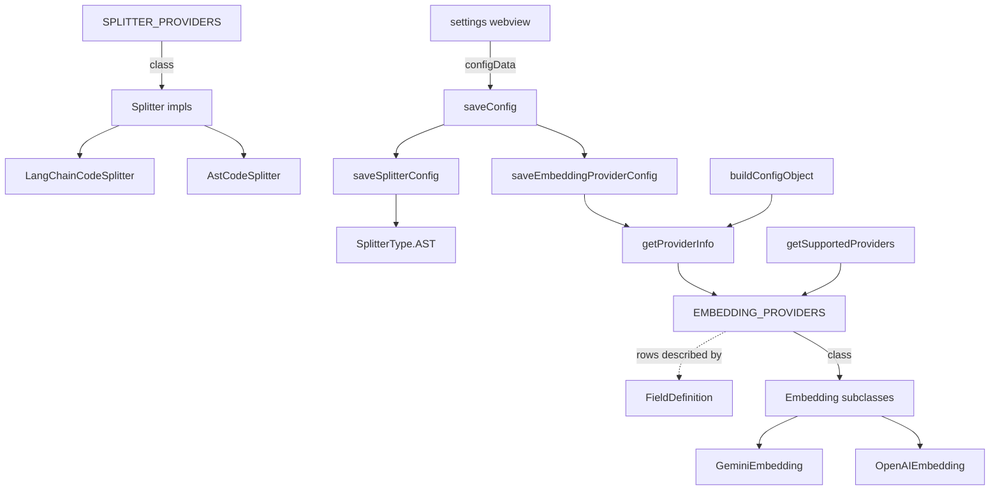

# VS Code extension config manager (provider registry & settings persistence)

The seam where a user's choices in the extension's settings UI — *which* embedding provider, *which*
splitter, what chunk sizes — become durable VS Code settings and, ultimately, the concrete `core`
objects that do the indexing.

## Overview
The VS Code extension has to let a user pick an embedding backend (OpenAI, VoyageAI, Ollama, Gemini) and
a code splitter (AST vs. LangChain), collect the right fields for each, persist them, and later
reconstruct a config object to hand to the `core` package. The single design idea here is a **declarative
provider registry**: two frozen tables, [`EMBEDDING_PROVIDERS`](../catalog/packages/vscode-extension/src/config/configManager.ts.md#EMBEDDING_PROVIDERS)
and [`SPLITTER_PROVIDERS`](../catalog/packages/vscode-extension/src/config/configManager.ts.md#SPLITTER_PROVIDERS),
each row pairing a provider's display metadata, its list of [`FieldDefinition`](../catalog/packages/vscode-extension/src/config/configManager.ts.md#FieldDefinition)
form fields, its default config, **and a direct reference to the `core` class that implements it**. That
one table drives everything: the settings form the webview renders, the loop that reads/writes each field,
and the class that gets instantiated. [`ConfigManager`](../catalog/packages/vscode-extension/src/config/configManager.ts.md#ConfigManager)
is the thin object that reads and writes those tables against VS Code's `workspace` settings store.

## Diagram

## Design rationale (why it's built this way)
**One registry, three consumers.** A provider is defined exactly once — as a row in
[`EMBEDDING_PROVIDERS`](../catalog/packages/vscode-extension/src/config/configManager.ts.md#EMBEDDING_PROVIDERS) —
and that row is read by the UI enumerator ([`getSupportedProviders`](../catalog/packages/vscode-extension/src/config/configManager.ts.md#ConfigManager.getSupportedProviders)),
the persistence path ([`saveEmbeddingProviderConfig`](../catalog/packages/vscode-extension/src/config/configManager.ts.md#ConfigManager.saveEmbeddingProviderConfig)),
and the read/rebuild path ([`buildConfigObject`](../catalog/packages/vscode-extension/src/config/configManager.ts.md#ConfigManager.buildConfigObject)).
Adding a provider is a data edit, not a code change scattered across those three sites.

**The `class` field is the bridge to `core`.** Each registry row stores an actual class reference (e.g.
`class: OpenAIEmbedding`), so the extension can turn a stored provider string into a live instance without a
`switch`. The registered classes — [`OpenAIEmbedding`](../catalog/packages/core/src/embedding/openai-embedding.ts.md#OpenAIEmbedding),
[`VoyageAIEmbedding`](../catalog/packages/core/src/embedding/voyageai-embedding.ts.md#VoyageAIEmbedding),
[`OllamaEmbedding`](../catalog/packages/core/src/embedding/ollama-embedding.ts.md#OllamaEmbedding),
[`GeminiEmbedding`](../catalog/packages/core/src/embedding/gemini-embedding.ts.md#GeminiEmbedding) — all
extend the abstract [`Embedding`](../catalog/packages/core/src/embedding/base-embedding.ts.md#Embedding)
base ("Abstract base class for embedding implementations"), and the splitter classes
[`AstCodeSplitter`](../catalog/packages/core/src/splitter/ast-splitter.ts.md#AstCodeSplitter) /
[`LangChainCodeSplitter`](../catalog/packages/core/src/splitter/langchain-splitter.ts.md#LangChainCodeSplitter)
both implement the [`Splitter`](../catalog/packages/core/src/splitter/index.ts.md#Splitter) interface. So the
config layer is polymorphic over `core`'s type hierarchy — it never names a concrete method, only the
shared contract.

**Fields are self-describing so the form is generic.** A [`FieldDefinition`](../catalog/packages/vscode-extension/src/config/configManager.ts.md#FieldDefinition)
carries a [`name`](../catalog/packages/vscode-extension/src/config/configManager.ts.md#FieldDefinition.typeLiteral27.name),
[`type`](../catalog/packages/vscode-extension/src/config/configManager.ts.md#FieldDefinition.typeLiteral27.type),
[`description`](../catalog/packages/vscode-extension/src/config/configManager.ts.md#FieldDefinition.typeLiteral27.description),
an [`inputType`](../catalog/packages/vscode-extension/src/config/configManager.ts.md#FieldDefinition.typeLiteral27.inputType)
(`'text' | 'password' | 'url' | 'select' | 'select-with-custom'`), a
[`placeholder`](../catalog/packages/vscode-extension/src/config/configManager.ts.md#FieldDefinition.typeLiteral27.placeholder),
and a [`required`](../catalog/packages/vscode-extension/src/config/configManager.ts.md#FieldDefinition.typeLiteral27.required)
flag. The persistence and read loops iterate `[...requiredFields, ...optionalFields]` and key VS Code
settings off `field.name` — nothing about a specific provider's fields is hardcoded in those loops.

> [!inferred]
> The `inputType: 'password'` on API-key fields is a UI hint for masked entry; the config layer itself
> stores whatever value it is given and does not encrypt it. This is a reading of the field's purpose, not
> a behavior visible in this packet.

## Entry points
- [`saveConfig`](../catalog/packages/vscode-extension/src/webview/semanticSearchProvider.ts.md#SemanticSearchViewProvider.saveConfig) —
  the webview message handler. When the user clicks *Save* in the settings panel, it unpacks `configData`
  and dispatches to [`saveEmbeddingProviderConfig`](../catalog/packages/vscode-extension/src/config/configManager.ts.md#ConfigManager.saveEmbeddingProviderConfig)
  and [`saveSplitterConfig`](../catalog/packages/vscode-extension/src/config/configManager.ts.md#ConfigManager.saveSplitterConfig)
  (plus a Milvus save), then triggers a config reload. This is the top of the write path.
- [`saveEmbeddingProviderConfig`](../catalog/packages/vscode-extension/src/config/configManager.ts.md#ConfigManager.saveEmbeddingProviderConfig) —
  persists the chosen embedding provider and each of its fields into VS Code global settings.
- [`saveSplitterConfig`](../catalog/packages/vscode-extension/src/config/configManager.ts.md#ConfigManager.saveSplitterConfig) —
  "Save splitter configuration": persists splitter type + chunk sizes.
- [`buildConfigObject`](../catalog/packages/vscode-extension/src/config/configManager.ts.md#ConfigManager.buildConfigObject) —
  "Build configuration object": the read/rebuild side, reached when the extension needs to reconstruct a
  provider config from stored settings before instantiating a `core` embedder.
- [`getSupportedProviders`](../catalog/packages/vscode-extension/src/config/configManager.ts.md#ConfigManager.getSupportedProviders) —
  "Get supported embedding providers": enumerates the registry (with each provider's models) so the webview
  can render the provider dropdown and per-provider forms.

## Mechanism (step-by-step)
1. **Declare the registries.** [`EMBEDDING_PROVIDERS`](../catalog/packages/vscode-extension/src/config/configManager.ts.md#EMBEDDING_PROVIDERS)
   is a frozen (`as const`) table whose four rows each hold a display `name`, a `class` (one of the `core`
   embedding classes), `requiredFields`/`optionalFields` arrays of [`FieldDefinition`](../catalog/packages/vscode-extension/src/config/configManager.ts.md#FieldDefinition),
   and a `defaultConfig`. [`SPLITTER_PROVIDERS`](../catalog/packages/vscode-extension/src/config/configManager.ts.md#SPLITTER_PROVIDERS)
   is the parallel table for splitters, mapping `AST` → [`AstCodeSplitter`](../catalog/packages/core/src/splitter/ast-splitter.ts.md#AstCodeSplitter)
   and `LangChain` → [`LangChainCodeSplitter`](../catalog/packages/core/src/splitter/langchain-splitter.ts.md#LangChainCodeSplitter),
   each with only optional `chunkSize`/`chunkOverlap` fields.
2. **Resolve a provider row.** [`getProviderInfo`](../catalog/packages/vscode-extension/src/config/configManager.ts.md#ConfigManager.getProviderInfo)
   guards `provider in EMBEDDING_PROVIDERS` and returns the row or `null`; its splitter twin
   [`getSplitterProviderInfo`](../catalog/packages/vscode-extension/src/config/configManager.ts.md#ConfigManager.getSplitterProviderInfo)
   does the same against [`SPLITTER_PROVIDERS`](../catalog/packages/vscode-extension/src/config/configManager.ts.md#SPLITTER_PROVIDERS).
   Every read/write path funnels through these lookups so an unknown provider fails one place.
3. **Persist embedding settings.** [`saveEmbeddingProviderConfig`](../catalog/packages/vscode-extension/src/config/configManager.ts.md#ConfigManager.saveEmbeddingProviderConfig)
   opens the `workspace` configuration namespaced by [`CONFIG_KEY`](../catalog/packages/vscode-extension/src/config/configManager.ts.md#ConfigManager.CONFIG_KEY)
   (`'semanticCodeSearch'`), writes `embeddingProvider.provider`, then loops
   `[...requiredFields, ...optionalFields]` from the resolved [`getProviderInfo`](../catalog/packages/vscode-extension/src/config/configManager.ts.md#ConfigManager.getProviderInfo)
   row and writes each `embeddingProvider.<field.name>` at `ConfigurationTarget.Global`. Empty-string or
   null values are stored as `undefined` so they don't later trip required-field validation.
4. **Persist splitter settings.** [`saveSplitterConfig`](../catalog/packages/vscode-extension/src/config/configManager.ts.md#ConfigManager.saveSplitterConfig)
   writes three keys under the same [`CONFIG_KEY`](../catalog/packages/vscode-extension/src/config/configManager.ts.md#ConfigManager.CONFIG_KEY):
   `splitter.type` (defaulting to [`SplitterType.AST`](../catalog/packages/core/src/splitter/index.ts.md#SplitterType.AST)
   via the [`AST`](../catalog/packages/core/src/splitter/index.ts.md#SplitterType.AST) enum member),
   `splitter.chunkSize` (default 1000), and `splitter.chunkOverlap` (default 200), reading them off the
   [`SplitterConfig`](../catalog/packages/core/src/splitter/index.ts.md#SplitterConfig) shape's
   [`type`](../catalog/packages/core/src/splitter/index.ts.md#SplitterConfig.type) /
   [`chunkSize`](../catalog/packages/core/src/splitter/index.ts.md#SplitterConfig.chunkSize) /
   [`chunkOverlap`](../catalog/packages/core/src/splitter/index.ts.md#SplitterConfig.chunkOverlap) properties.
5. **Rebuild a config object.** [`buildConfigObject`](../catalog/packages/vscode-extension/src/config/configManager.ts.md#ConfigManager.buildConfigObject)
   starts from the row's `defaultConfig` (a spread copy), then for each field reads
   `embeddingProvider.<field.name>` from the stored VS Code config and overlays any defined value; finally it
   re-validates every `requiredFields` entry and returns `null` if one is missing — the inverse of the save
   loop, using the same [`getProviderInfo`](../catalog/packages/vscode-extension/src/config/configManager.ts.md#ConfigManager.getProviderInfo)
   row so the field set can never drift between write and read.
6. **Feed the UI.** [`getSupportedProviders`](../catalog/packages/vscode-extension/src/config/configManager.ts.md#ConfigManager.getSupportedProviders)
   iterates [`EMBEDDING_PROVIDERS`](../catalog/packages/vscode-extension/src/config/configManager.ts.md#EMBEDDING_PROVIDERS)
   and, for each row, calls the registered `class`'s static `getSupportedModels()` (skipped for Ollama, whose
   models are typed by hand) to assemble a `{name, models, requiredFields, optionalFields, defaultConfig}`
   record the webview renders into a form.

## Key data structures
- [`FieldDefinition`](../catalog/packages/vscode-extension/src/config/configManager.ts.md#FieldDefinition) —
  the atom of the registry: `{ name, type, description, inputType?, placeholder?, required? }`. Its
  [`name`](../catalog/packages/vscode-extension/src/config/configManager.ts.md#FieldDefinition.typeLiteral27.name)
  is both the settings-key suffix and the config-object key; its
  [`inputType`](../catalog/packages/vscode-extension/src/config/configManager.ts.md#FieldDefinition.typeLiteral27.inputType)
  and [`required`](../catalog/packages/vscode-extension/src/config/configManager.ts.md#FieldDefinition.typeLiteral27.required)
  drive UI rendering and validation.
- [`EMBEDDING_PROVIDERS`](../catalog/packages/vscode-extension/src/config/configManager.ts.md#EMBEDDING_PROVIDERS) /
  [`SPLITTER_PROVIDERS`](../catalog/packages/vscode-extension/src/config/configManager.ts.md#SPLITTER_PROVIDERS) —
  the frozen provider tables; each value's `class` binds a provider key to an
  [`Embedding`](../catalog/packages/core/src/embedding/base-embedding.ts.md#Embedding) subclass or a
  [`Splitter`](../catalog/packages/core/src/splitter/index.ts.md#Splitter) implementation.
- [`SplitterConfig`](../catalog/packages/core/src/splitter/index.ts.md#SplitterConfig) — the `core` shape
  round-tripped by the splitter save/read path:
  [`type`](../catalog/packages/core/src/splitter/index.ts.md#SplitterConfig.type) (a
  [`SplitterType`](../catalog/packages/core/src/splitter/index.ts.md#SplitterType)),
  [`chunkSize`](../catalog/packages/core/src/splitter/index.ts.md#SplitterConfig.chunkSize),
  [`chunkOverlap`](../catalog/packages/core/src/splitter/index.ts.md#SplitterConfig.chunkOverlap).
- [`CONFIG_KEY`](../catalog/packages/vscode-extension/src/config/configManager.ts.md#ConfigManager.CONFIG_KEY) —
  the `'semanticCodeSearch'` namespace under which every setting is written and read; the single prefix that
  scopes this extension's slice of VS Code settings.

## Dynamics (design intent)
Every write in [`saveEmbeddingProviderConfig`](../catalog/packages/vscode-extension/src/config/configManager.ts.md#ConfigManager.saveEmbeddingProviderConfig)
and [`saveSplitterConfig`](../catalog/packages/vscode-extension/src/config/configManager.ts.md#ConfigManager.saveSplitterConfig)
targets `ConfigurationTarget.Global`, so settings persist per-user across workspaces rather than per-project.
[`saveConfig`](../catalog/packages/vscode-extension/src/webview/semanticSearchProvider.ts.md#SemanticSearchViewProvider.saveConfig)
saves embedding, Milvus, then splitter in that order and afterward issues a `reloadConfiguration` command so
the running `Context` is rebuilt from the freshly stored settings. The registry's polymorphism is exercised
in the tests: the `core` test suites define stand-in [`Embedding`](../catalog/packages/core/src/embedding/base-embedding.ts.md#Embedding)
subclasses ([`TestEmbedding`](../catalog/packages/core/src/context.splitter.test.ts.md#TestEmbedding),
[`FailingEmbedding`](../catalog/packages/core/src/context.embedding-error.test.ts.md#FailingEmbedding)) and
[`Splitter`](../catalog/packages/core/src/splitter/index.ts.md#Splitter) implementations
([`TestSplitter`](../catalog/packages/core/src/context.ignore-patterns.test.ts.md#TestSplitter),
[`RecordingSplitter`](../catalog/packages/core/src/context.splitter.test.ts.md#RecordingSplitter),
[`CountingSplitter`](../catalog/packages/core/src/context.abort.test.ts.md#CountingSplitter),
[`OneChunkSplitter`](../catalog/packages/core/src/context.embedding-error.test.ts.md#OneChunkSplitter)),
confirming the contracts this config layer targets are substitutable.

> [!inferred]
> Those test doubles live in the `core` package's context tests, not in this config module — they show the
> `Embedding`/`Splitter` abstractions are pluggable, but no test in this packet's Evidence set directly
> exercises `ConfigManager`.

## Edge cases
- **Empty vs. absent fields.** [`saveEmbeddingProviderConfig`](../catalog/packages/vscode-extension/src/config/configManager.ts.md#ConfigManager.saveEmbeddingProviderConfig)
  rewrites `''`/`null` to `undefined` before writing, so a cleared field is *removed* rather than stored as an
  empty string that would fail required-field checks on the next
  [`buildConfigObject`](../catalog/packages/vscode-extension/src/config/configManager.ts.md#ConfigManager.buildConfigObject).
- **Missing required field.** [`buildConfigObject`](../catalog/packages/vscode-extension/src/config/configManager.ts.md#ConfigManager.buildConfigObject)
  returns `null` if any [`required`](../catalog/packages/vscode-extension/src/config/configManager.ts.md#FieldDefinition.typeLiteral27.required)
  field is empty — callers treat a `null` as "not configured yet."
- **Unknown provider.** [`getProviderInfo`](../catalog/packages/vscode-extension/src/config/configManager.ts.md#ConfigManager.getProviderInfo)
  returns `null` for a key not in the table; the save path turns that into a thrown `Unknown provider` error.
- **Splitter defaults on first run.** If `splitter.type` was never set, the read path falls back to
  [`SplitterType.AST`](../catalog/packages/core/src/splitter/index.ts.md#SplitterType.AST) with 1000/200 chunk
  sizes — note this differs from the AST registry row's own `defaultConfig` of 2500/300 in
  [`SPLITTER_PROVIDERS`](../catalog/packages/vscode-extension/src/config/configManager.ts.md#SPLITTER_PROVIDERS),
  so the persisted default and the code-splitter's constructor default are not identical.
- **Ollama has no static model list.** [`getSupportedProviders`](../catalog/packages/vscode-extension/src/config/configManager.ts.md#ConfigManager.getSupportedProviders)
  special-cases `'Ollama'` with an empty models map because users type model names by hand, whereas the other
  rows call their class's `getSupportedModels()`.

## Open questions
- `getEmbeddingProviderConfig`, `getSplitterConfig`, `createEmbeddingInstance`, and the Milvus
  read/write/`getMilvusFullConfig` methods sit in this same file but are outside this packet's subgraph, so
  they are not cited here — the full read side (turning stored settings back into a live embedder) is only
  partially covered by [`buildConfigObject`](../catalog/packages/vscode-extension/src/config/configManager.ts.md#ConfigManager.buildConfigObject).
- The exact `getSupportedModels()` contract on each embedding class is referenced by
  [`getSupportedProviders`](../catalog/packages/vscode-extension/src/config/configManager.ts.md#ConfigManager.getSupportedProviders)
  but not present as a subgraph symbol; how model lists reach the UI dropdown is described here only at the
  registry boundary.

## See also
- The AST splitter concept (`packages-core-src-splitter-ast-splitter.ts`) — what
  [`AstCodeSplitter`](../catalog/packages/core/src/splitter/ast-splitter.ts.md#AstCodeSplitter) actually does
  once selected here, including its multi-language node-type extraction and LangChain fallback.
- The embedding base concept — the [`Embedding`](../catalog/packages/core/src/embedding/base-embedding.ts.md#Embedding)
  abstraction and its per-provider subclasses this registry instantiates.
- The webview / semantic-search provider concept — [`saveConfig`](../catalog/packages/vscode-extension/src/webview/semanticSearchProvider.ts.md#SemanticSearchViewProvider.saveConfig)
  and the message loop that calls into this manager.
