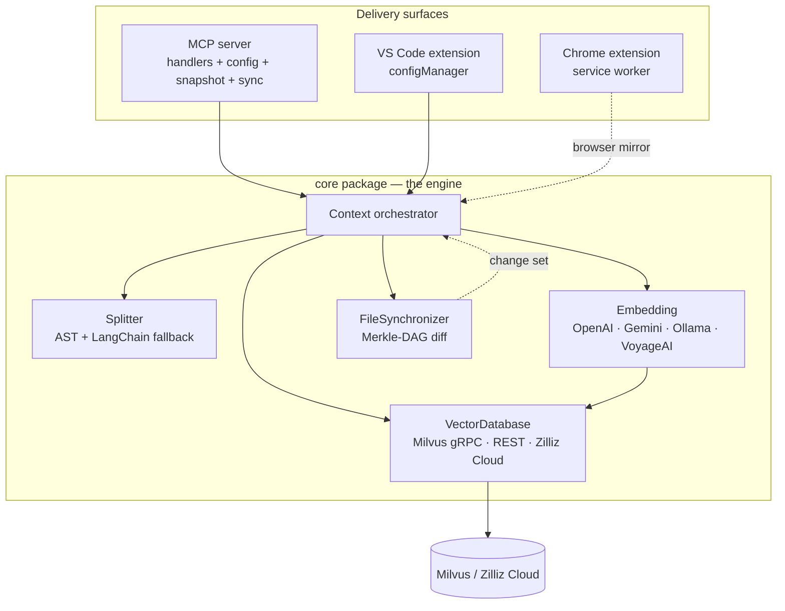
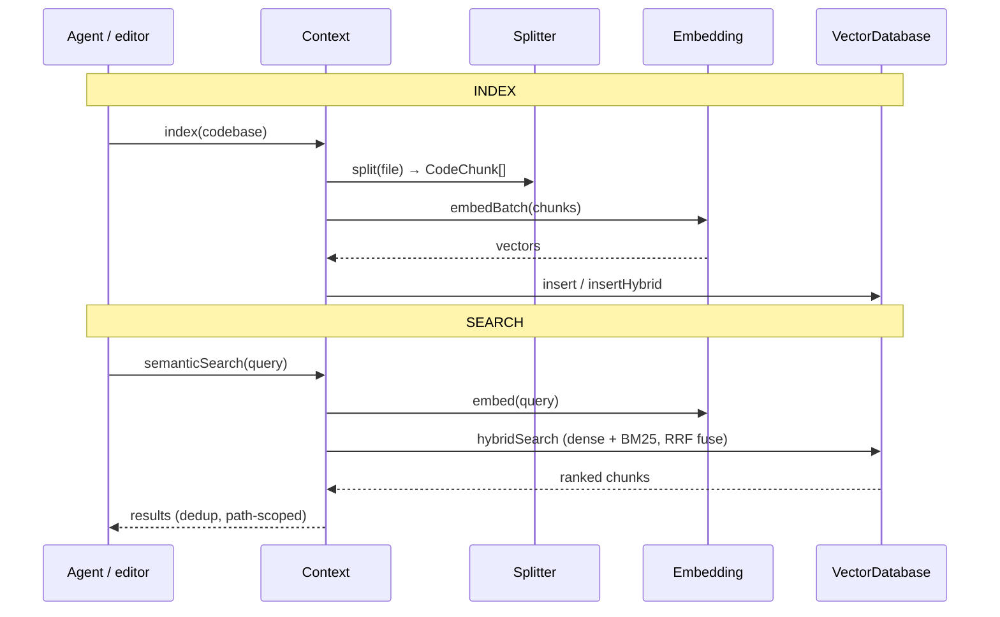

# claude-context — what it is and how it fits together

## In one paragraph
**claude-context** (by Zilliz, the Milvus company) makes an entire codebase **semantically
searchable** so a coding agent can retrieve the handful of relevant passages instead of reading the
whole repo. Its grounding substrate is deliberately *not* a symbol table or a call graph: it splits
code into chunks, turns each chunk into a **dense embedding vector**, stores those in a **Milvus /
Zilliz Cloud vector database**, and answers a natural-language query by embedding it and pulling the
nearest chunks by cosine similarity (optionally fused with a BM25 sparse channel). The whole engine
lives in one framework-agnostic **`core`** package built from four pluggable collaborators — a
**splitter**, an **embedding** provider, a **vector database**, and a **file synchronizer** — wired
together by a single [`Context`](concepts/packages-core-src-context.ts.md) orchestrator. That core is
then delivered through three thin front ends that share it: an **MCP server** (the agent-facing
surface), a **VS Code extension**, and a **Chrome extension** that runs the same pipeline entirely
in-browser. Only two moving parts make indexing cheap to keep current: **AST-aware chunking**
(tree-sitter) and **Merkle-tree incremental sync** (re-embed only what changed).

## Core architecture

Two pipelines run through the same collaborators — **index** (write) and **search** (read):

## Main concepts

### The grounding substrate: embeddings + vector search
Every retrieval decision reduces to *"which stored chunks are nearest this query vector."* The
contract for that store is [`VectorDatabase`](concepts/packages-core-src-vectordb-types.ts.md), and
the primary implementation grounds on **dense vectors plus an optional BM25 sparse field fused by
Reciprocal Rank Fusion** — see [Milvus (gRPC/SDK)](concepts/packages-core-src-vectordb-milvus-vectordb.ts.md).
For the survey, this is the axis that most distinguishes claude-context from its peers: it is
embeddings + ANN, **not** SCIP symbols and **not** a knowledge graph.

### One interface, two transports (and a cloud on-ramp)
The same `VectorDatabase` surface is implemented twice: a
[gRPC/SDK client](concepts/packages-core-src-vectordb-milvus-vectordb.ts.md) for Node hosts and an
[HTTP/REST client](concepts/packages-core-src-vectordb-milvus-restful-vectordb.ts.md) for constrained
runtimes (browsers/extensions) where the native SDK can't run. [Zilliz Cloud
utils](concepts/packages-core-src-vectordb-zilliz-utils.ts.md) resolve a token into a cluster endpoint
and can even provision a free serverless cluster, so a first-run user needs no local Milvus.

### Pluggable embedding providers behind one base class
[`Embedding`](concepts/packages-core-src-embedding-base-embedding.ts.md) fixes the provider-neutral
contract (embed / embedBatch / dimension / shared truncation-preprocessing); four adapters implement
it —
[OpenAI](concepts/packages-core-src-embedding-openai-embedding.ts.md),
[Gemini](concepts/packages-core-src-embedding-gemini-embedding.ts.md) (Matryoshka dimensions),
[Ollama](concepts/packages-core-src-embedding-ollama-embedding.ts.md) (local, keyless,
self-measuring), and
[VoyageAI](concepts/packages-core-src-embedding-voyageai-embedding.ts.md) (code-specialized, with a
document/query input-type asymmetry). Swapping the grounding model is a config choice, not a code
change.

### Multi-language extraction: AST-aware chunking
[`AstCodeSplitter`](concepts/packages-core-src-splitter-ast-splitter.ts.md) drives nine tree-sitter
grammars through a per-language `SPLITTABLE_NODE_TYPES` allow-list so chunks fall on real syntactic
boundaries (functions, classes), then refines oversized chunks. When a language isn't supported or
parsing fails, it degrades to a [LangChain character-based
splitter](concepts/packages-core-src-splitter-index.ts.md) — a *fallback floor* so every file still
chunks. The universal unit both produce is the `CodeChunk`.

### Incremental reconcile: the Merkle tripwire
Re-embedding a whole repo on every edit would be prohibitive, so a
[Merkle-DAG](concepts/packages-core-src-sync-merkle.ts.md) of content hashes plus a
[`FileSynchronizer`](concepts/packages-core-src-sync-synchronizer.ts.md) computes an
added/modified/removed set against a persisted snapshot; only the delta is re-chunked and re-embedded.
On the server this is driven continuously by the [MCP background sync
loop](concepts/packages-mcp-src-sync.ts.md).

### The orchestrator ties it together
[`Context`](concepts/packages-core-src-context.ts.md) is the hub: it injects the four collaborators
behind their interfaces and owns both pipelines, including the single `isHybrid` switch that fans
dense-vs-hybrid behavior across collection naming, writes, and reads.

### Three delivery surfaces over one core
The [**MCP server**](concepts/packages-mcp-src-handlers.ts.md) exposes `index_codebase` /
`search_code` / `clear_index` / status tools to agents, backed by
[env-driven config](concepts/packages-mcp-src-config.ts.md) and a durable
[snapshot](concepts/packages-mcp-src-snapshot.ts.md) of what's indexed. The **VS Code extension**
adds a [provider registry & settings store](concepts/packages-vscode-extension-src-config-configManager.ts.md).
The **Chrome extension** is a browser-native mirror — a
[service worker](concepts/packages-chrome-extension-src-background.ts.md) that indexes GitHub repos
over REST via a [Milvus adapter](concepts/packages-chrome-extension-src-milvus-chromeMilvusAdapter.ts.md)
and a [fetch-only stub client](concepts/packages-chrome-extension-src-stubs-milvus-vectordb-stub.ts.md),
tracking state with an [indexed-repo registry](concepts/packages-chrome-extension-src-storage-indexedRepoManager.ts.md)
and [connection config](concepts/packages-chrome-extension-src-config-milvusConfig.ts.md).

## How a request flows
**Index:** a front end calls `Context.index` → the **splitter** turns each file into `CodeChunk`s →
the **embedding** provider batches them into vectors → the **vector DB** inserts them (dense, or
dense+sparse for hybrid) into a per-codebase collection. **Search:** `Context.semanticSearch` embeds
the query once, runs a dense (or hybrid RRF) search, de-duplicates, and returns ranked chunks with
file/line metadata. **Keep-fresh:** the **synchronizer** diffs the Merkle snapshot and feeds only
changed files back through the index path — on the MCP server, on a timer.

## Survey-relevant surfaces (grounding · multi-language · reconcile)
This wiki is part of a code-comprehension-tool survey; the pages that carry the cross-repo comparison:
- **Grounding substrate** → [VectorDatabase contract](concepts/packages-core-src-vectordb-types.ts.md)
  + [Milvus impl](concepts/packages-core-src-vectordb-milvus-vectordb.ts.md) +
  [Embedding base](concepts/packages-core-src-embedding-base-embedding.ts.md). *Embeddings + ANN over
  chunks*, contrasted with SCIP symbol graphs and knowledge graphs elsewhere in the survey.
- **Multi-language extraction** → [AST splitter](concepts/packages-core-src-splitter-ast-splitter.ts.md)
  (tree-sitter, 9 grammars) with a [LangChain fallback floor](concepts/packages-core-src-splitter-index.ts.md).
- **Incremental reconcile** → [Merkle DAG](concepts/packages-core-src-sync-merkle.ts.md) +
  [FileSynchronizer](concepts/packages-core-src-sync-synchronizer.ts.md) +
  [MCP sync loop](concepts/packages-mcp-src-sync.ts.md).

## Map of the wiki
- *"How is a query actually answered?"* → [Context](concepts/packages-core-src-context.ts.md) then the
  [Milvus impl](concepts/packages-core-src-vectordb-milvus-vectordb.ts.md).
- *"How is code chunked / which languages?"* → [AST splitter](concepts/packages-core-src-splitter-ast-splitter.ts.md).
- *"Which embedding models are supported and how do they differ?"* → the
  [Embedding base](concepts/packages-core-src-embedding-base-embedding.ts.md) and its four provider pages.
- *"How does it avoid re-indexing everything?"* → [Merkle](concepts/packages-core-src-sync-merkle.ts.md)
  / [FileSynchronizer](concepts/packages-core-src-sync-synchronizer.ts.md).
- *"What tools does the agent see?"* → [MCP handlers](concepts/packages-mcp-src-handlers.ts.md).
- *"How does the browser version work without Node?"* → [Chrome service worker](concepts/packages-chrome-extension-src-background.ts.md)
  and the [REST stub](concepts/packages-chrome-extension-src-stubs-milvus-vectordb-stub.ts.md).
- **Exhaustive per-module symbol index** → [`catalog/`](catalog/) (63 modules, 100% represented).
- **Concept table** → [`index.md`](index.md).
