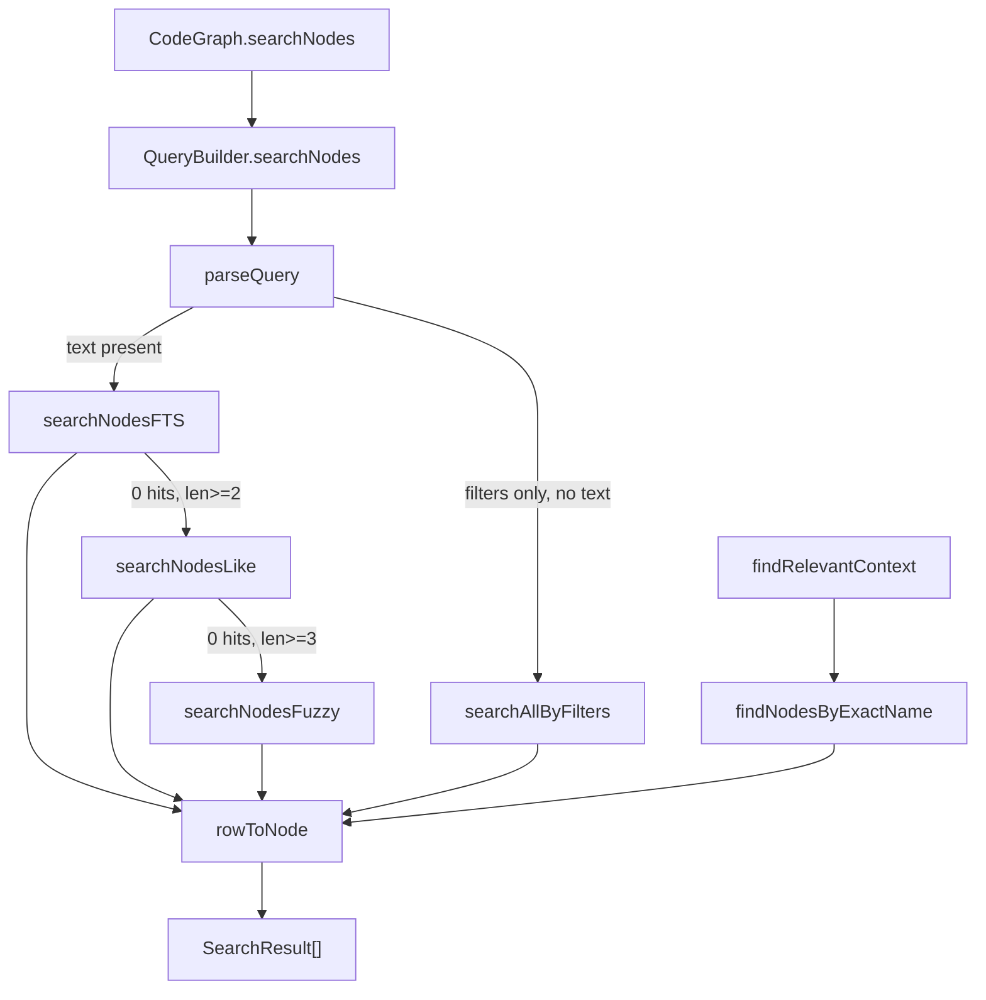

# QueryBuilder — CodeGraph's SQL Query & Search Layer

## Overview
`QueryBuilder` is the single seam between CodeGraph's in-memory domain model
(`Node`, `Edge`, `FileRecord`) and the SQLite tables that actually store the
graph. Every read the MCP tools eventually make — text search, "get this
node," "walk this node's edges" — and every write the extraction/resolution
pipeline makes funnels through this one class. The key design idea is
**cheap-first, cascading retrieval**: rather than a single similarity search
over embeddings, text lookups fall through a ladder of increasingly
expensive-but-more-forgiving SQL strategies (FTS5 → substring `LIKE` →
bounded edit-distance), and point lookups lean on prepared-statement reuse
and a small in-process cache to stay fast without an ORM. This is what makes
CodeGraph "just SQL" rather than vectors: retrieval here is deterministic,
index-backed, and name/structure-driven — the thing worth comparing against
other tools' embedding-based semantic search.

## Diagram

## Design rationale (why it's built this way)
- **A cascade, not one strategy.** [`searchNodes`](../catalog/src/db/queries.ts.md#QueryBuilder.searchNodes)
  tries [`searchNodesFTS`](../catalog/src/db/queries.ts.md#QueryBuilder.searchNodesFTS)
  first, then [`searchNodesLike`](../catalog/src/db/queries.ts.md#QueryBuilder.searchNodesLike),
  then [`searchNodesFuzzy`](../catalog/src/db/queries.ts.md#QueryBuilder.searchNodesFuzzy) only
  if the cheaper passes came back empty. FTS5 with prefix matching is fast and
  precise for "the user typed part of a real identifier"; `LIKE` catches
  substrings FTS's tokenizer misses (a CamelCase compound counted as one
  token); fuzzy edit-distance is the last resort for typos, gated behind a
  length check ("1-char queries would match too much," per the source
  comment) because scanning every distinct name is comparatively expensive.
  Each stage only runs if the previous one found nothing, so the common case
  (an exact or near-exact FTS hit) never pays for the fallback machinery.
- **Row↔domain mapping is centralized, not scattered.** [`rowToNode`](../catalog/src/db/queries.ts.md#rowToNode)
  is the only place a raw SQLite row becomes a [`Node`](../catalog/src/types.ts.md#Node).
  SQLite has no boolean column type, so [`isExported`](../catalog/src/types.ts.md#Node.isExported)
  and its siblings are stored as `0`/`1` integers and converted at read time;
  every other method in the file returns through this one function instead of
  re-deriving the mapping, so a schema change only touches one place.
- **Prepared statements are cached per query shape, not per call.** Methods
  like [`insertNode`](../catalog/src/db/queries.ts.md#QueryBuilder.insertNode),
  [`updateNode`](../catalog/src/db/queries.ts.md#QueryBuilder.updateNode), and
  [`getNodeById`](../catalog/src/db/queries.ts.md#QueryBuilder.getNodeById) lazily
  build their SQL once, stash the compiled `SqliteStatement` on
  [`stmts`](../catalog/src/db/queries.ts.md#QueryBuilder.stmts), and reuse it on
  every subsequent call — these are hot paths during a full index (one call
  per symbol in the codebase), so re-preparing the same SQL text every time
  would be wasted work. Methods whose SQL shape varies per call (optional
  `kind`/`language`/`provenance` filters) can't use this trick and build the
  query string fresh each time instead.
- **`SqliteDatabase`/`SqliteStatement` are interfaces, not a concrete driver.**
  `QueryBuilder` only calls [`prepare`](../catalog/src/db/sqlite-adapter.ts.md#SqliteDatabase.prepare)
  and [`all`](../catalog/src/db/sqlite-adapter.ts.md#SqliteStatement.all) through
  these adapter types, never a specific SQLite package — the query layer is
  decoupled from which backend actually executes the SQL.
  > [!inferred] The repo's own docs describe the concrete backend as Node's
  > built-in `node:sqlite`, but that binding lives outside this packet's
  > subgraph, so it isn't cited here.

## Entry points
- [`searchNodes`](../catalog/src/db/queries.ts.md#QueryBuilder.searchNodes) — the
  free-text search entry point, reached through the public
  [`searchNodes`](../catalog/src/index.ts.md#CodeGraph.searchNodes) on the
  top-level `CodeGraph` API. Anything an agent phrases as "find X" ends up
  here.
- [`findRelevantContext`](../catalog/src/context/index.ts.md#ContextBuilder.findRelevantContext) —
  the hybrid entry point for natural-language queries: it extracts candidate
  symbol names out of a prose query and hands them to
  [`findNodesByExactName`](../catalog/src/db/queries.ts.md#QueryBuilder.findNodesByExactName)
  before falling back to full-text search, so a query like "how does
  scrapeLoop work" resolves through exact identifier lookup rather than BM25
  scoring alone.
- [`getNodeById`](../catalog/src/db/queries.ts.md#QueryBuilder.getNodeById) and
  [`getNodesByIds`](../catalog/src/db/queries.ts.md#QueryBuilder.getNodesByIds) —
  reached whenever a caller already has node IDs (from an edge, from a prior
  query) and needs the full `Node`. This is the workhorse behind graph
  traversal, where every edge endpoint has to be hydrated into a real symbol.
- [`getOutgoingEdges`](../catalog/src/db/queries.ts.md#QueryBuilder.getOutgoingEdges) and
  [`getIncomingEdges`](../catalog/src/db/queries.ts.md#QueryBuilder.getIncomingEdges) —
  the structural-traversal entry points: anything answering "who calls this"
  or "what does this call/impact" walks the edge table through these two.
- [`insertNode`](../catalog/src/db/queries.ts.md#QueryBuilder.insertNode),
  [`updateNode`](../catalog/src/db/queries.ts.md#QueryBuilder.updateNode), and
  [`insertEdges`](../catalog/src/db/queries.ts.md#QueryBuilder.insertEdges) — the
  write-side entries hit once per symbol/edge when the extraction and
  resolution pipeline persists a (re-)index.

## Mechanism (step-by-step)
1. **Row → domain object.** Every read path ends in [`rowToNode`](../catalog/src/db/queries.ts.md#rowToNode),
   which takes the raw `NodeRow` and produces the public shape: [`kind`](../catalog/src/types.ts.md#Node.kind),
   [`name`](../catalog/src/types.ts.md#Node.name), [`qualifiedName`](../catalog/src/types.ts.md#Node.qualifiedName),
   [`filePath`](../catalog/src/types.ts.md#Node.filePath), [`language`](../catalog/src/types.ts.md#Node.language),
   [`startLine`](../catalog/src/types.ts.md#Node.startLine)/[`endLine`](../catalog/src/types.ts.md#Node.endLine),
   [`startColumn`](../catalog/src/types.ts.md#Node.startColumn)/[`endColumn`](../catalog/src/types.ts.md#Node.endColumn),
   [`signature`](../catalog/src/types.ts.md#Node.signature), [`isExported`](../catalog/src/types.ts.md#Node.isExported),
   and [`updatedAt`](../catalog/src/types.ts.md#Node.updatedAt). Nothing outside this
   function knows SQLite's snake_case/integer-boolean storage shape.
2. **Text search cascades through cheaper-to-pricier strategies.**
   [`searchNodes`](../catalog/src/db/queries.ts.md#QueryBuilder.searchNodes) first calls
   [`parseQuery`](../catalog/src/search/query-parser.ts.md#parseQuery) to peel
   field-qualified filters (`kind:`, `lang:`, `path:`, `name:`) out of the raw
   string, leaving free text for full-text matching. With text present it
   calls [`searchNodesFTS`](../catalog/src/db/queries.ts.md#QueryBuilder.searchNodesFTS)
   (BM25-ranked FTS5 with per-column weights and prefix matching); with no
   text at all — a pure filter query like `kind:function` — it calls
   [`searchAllByFilters`](../catalog/src/db/queries.ts.md#QueryBuilder.searchAllByFilters)
   instead, since there's no text to match against. If FTS comes back empty,
   [`searchNodesLike`](../catalog/src/db/queries.ts.md#QueryBuilder.searchNodesLike)
   retries as a substring scan, and if that too is empty (and the query is
   long enough to be worth it), [`searchNodesFuzzy`](../catalog/src/db/queries.ts.md#QueryBuilder.searchNodesFuzzy)
   does a bounded edit-distance sweep over the distinct name set. Results
   travel as [`SearchResult`](../catalog/src/types.ts.md#SearchResult) objects
   pairing a [`node`](../catalog/src/types.ts.md#SearchResult.node) with a
   [`score`](../catalog/src/types.ts.md#SearchResult.score) — but the docstring
   is explicit that this score is "NOT normalized and NOT a 0-1 fraction,"
   so nothing downstream should treat it as a probability or blend it across
   stages naively.
3. **Exact-name lookup for natural-language queries.** [`findRelevantContext`](../catalog/src/context/index.ts.md#ContextBuilder.findRelevantContext)
   doesn't go through `searchNodes` at all for its first pass — it extracts
   candidate identifier names from prose and calls
   [`findNodesByExactName`](../catalog/src/db/queries.ts.md#QueryBuilder.findNodesByExactName),
   a two-pass lookup: pass one finds which files contain each queried name and
   flags "distinctive" ones (fewer than 10 file matches); pass two re-queries
   each name and boosts results that co-locate with a distinctive symbol in
   the same file. This is a different retrieval mode from full-text search —
   it assumes the query already names real symbols and is optimizing for
   *which occurrence* of a common name (like `run`) is the relevant one.
4. **Prepared statements are built once per shape and cached on the instance.**
   Fixed-shape queries — [`insertNode`](../catalog/src/db/queries.ts.md#QueryBuilder.insertNode),
   [`updateNode`](../catalog/src/db/queries.ts.md#QueryBuilder.updateNode),
   [`getNodeById`](../catalog/src/db/queries.ts.md#QueryBuilder.getNodeById),
   [`getNodesByKind`](../catalog/src/db/queries.ts.md#QueryBuilder.getNodesByKind),
   [`getNodesByName`](../catalog/src/db/queries.ts.md#QueryBuilder.getNodesByName),
   [`getNodesByLowerName`](../catalog/src/db/queries.ts.md#QueryBuilder.getNodesByLowerName),
   [`getNodesByQualifiedNameExact`](../catalog/src/db/queries.ts.md#QueryBuilder.getNodesByQualifiedNameExact),
   [`getNodesByFile`](../catalog/src/db/queries.ts.md#QueryBuilder.getNodesByFile),
   [`getFileByPath`](../catalog/src/db/queries.ts.md#QueryBuilder.getFileByPath),
   [`getAllFiles`](../catalog/src/db/queries.ts.md#QueryBuilder.getAllFiles),
   [`upsertFile`](../catalog/src/db/queries.ts.md#QueryBuilder.upsertFile),
   [`insertEdge`](../catalog/src/db/queries.ts.md#QueryBuilder.insertEdge),
   [`insertNameSegments`](../catalog/src/db/queries.ts.md#QueryBuilder.insertNameSegments),
   [`insertUnresolvedRef`](../catalog/src/db/queries.ts.md#QueryBuilder.insertUnresolvedRef),
   and the unresolved-reference readers below — each check whether their slot
   on [`stmts`](../catalog/src/db/queries.ts.md#QueryBuilder.stmts) is populated,
   call [`prepare`](../catalog/src/db/sqlite-adapter.ts.md#SqliteDatabase.prepare)
   on [`db`](../catalog/src/db/queries.ts.md#QueryBuilder.db) exactly once if not,
   and then always run through [`all`](../catalog/src/db/sqlite-adapter.ts.md#SqliteStatement.all)
   or the statement's other methods. Variable-shape queries — where an
   optional `kinds`/`languages`/`provenance` filter changes the SQL text
   itself — can't be cached this way and build a fresh string with
   conditionally appended `AND` clauses on every call instead, the same
   pattern repeated across [`searchNodesFTS`](../catalog/src/db/queries.ts.md#QueryBuilder.searchNodesFTS),
   [`searchNodesLike`](../catalog/src/db/queries.ts.md#QueryBuilder.searchNodesLike),
   [`findNodesByNameSubstring`](../catalog/src/db/queries.ts.md#QueryBuilder.findNodesByNameSubstring),
   [`getOutgoingEdges`](../catalog/src/db/queries.ts.md#QueryBuilder.getOutgoingEdges), and
   [`getIncomingEdges`](../catalog/src/db/queries.ts.md#QueryBuilder.getIncomingEdges).
5. **Point lookups and lazy iteration replace app-side filtering.**
   [`getNodeById`](../catalog/src/db/queries.ts.md#QueryBuilder.getNodeById) and
   [`getNodesByIds`](../catalog/src/db/queries.ts.md#QueryBuilder.getNodesByIds) hydrate
   node IDs discovered elsewhere (typically edge endpoints) back into full
   `Node`s via one indexed query rather than an app-side scan; the batch form
   exists specifically to collapse what would otherwise be one query per edge
   into a single `IN (...)` round trip.
   [`iterateNodesByKind`](../catalog/src/db/queries.ts.md#QueryBuilder.iterateNodesByKind)
   is the same shape as [`getNodesByKind`](../catalog/src/db/queries.ts.md#QueryBuilder.getNodesByKind)
   but yields one [`Node`](../catalog/src/types.ts.md#Node) at a time from a
   fresh, uncached statement rather than materializing an array — the
   `iterateNodesByKind` docstring even flags the memory blowup this avoids for
   unbounded kinds like `function`/`method` on a large project.
6. **Edge traversal branches on whether a filter narrows the query.**
   [`getOutgoingEdges`](../catalog/src/db/queries.ts.md#QueryBuilder.getOutgoingEdges) and
   [`getIncomingEdges`](../catalog/src/db/queries.ts.md#QueryBuilder.getIncomingEdges) both
   take the fast, cached-statement path for the plain "all edges from/to this
   node" case, but drop to a hand-built parameterized query (`kind IN (...)`,
   `provenance = ?`) the moment a caller asks for a filtered subset — the same
   cache-vs-build-fresh split as the search methods, applied to structural
   queries instead of text ones.
7. **Writes are idempotent and cache-aware.** [`insertNode`](../catalog/src/db/queries.ts.md#QueryBuilder.insertNode)
   uses `INSERT OR REPLACE` keyed by the node's content-derived
   [`id`](../catalog/src/types.ts.md#Node.id), so re-indexing an unchanged file is
   safe to repeat; both `insertNode` and [`updateNode`](../catalog/src/db/queries.ts.md#QueryBuilder.updateNode)
   drop any cached copy of the node before writing so a subsequent
   `getNodeById` never serves a stale value.
   [`insertEdges`](../catalog/src/db/queries.ts.md#QueryBuilder.insertEdges) wraps a
   whole batch in one transaction and calls [`insertEdge`](../catalog/src/db/queries.ts.md#QueryBuilder.insertEdge)
   (itself `INSERT OR IGNORE`) per edge, after checking that both endpoints
   already exist as nodes — a partial re-index can otherwise leave an edge
   pointing at a node that was never (re-)written.
8. **Unresolved references and stats are separate, purpose-built read paths.**
   [`insertUnresolvedRef`](../catalog/src/db/queries.ts.md#QueryBuilder.insertUnresolvedRef)
   records a reference the extractor couldn't statically bind (an imported
   symbol, a dynamic call target); [`getUnresolvedByName`](../catalog/src/db/queries.ts.md#QueryBuilder.getUnresolvedByName),
   [`getUnresolvedReferences`](../catalog/src/db/queries.ts.md#QueryBuilder.getUnresolvedReferences),
   [`getUnresolvedReferencesBatch`](../catalog/src/db/queries.ts.md#QueryBuilder.getUnresolvedReferencesBatch)
   (`LIMIT`/`OFFSET` paginated), and [`getUnresolvedReferencesByFiles`](../catalog/src/db/queries.ts.md#QueryBuilder.getUnresolvedReferencesByFiles)
   feed that backlog back out for the resolver to retry, each returning
   [`Language`](../catalog/src/types.ts.md#Language)-typed rows via
   [`all`](../catalog/src/db/sqlite-adapter.ts.md#SqliteStatement.all). Separately,
   [`getStats`](../catalog/src/db/queries.ts.md#QueryBuilder.getStats) computes
   node/edge/file counts and per-[`NodeKind`](../catalog/src/types.ts.md#NodeKind)
   breakdowns entirely in SQL (`COUNT`/`GROUP BY`), never by loading rows into
   the process to count them.

## Key data structures
- [`stmts`](../catalog/src/db/queries.ts.md#QueryBuilder.stmts) — a record of
  lazily-populated [`SqliteStatement`](../catalog/src/db/sqlite-adapter.ts.md#SqliteStatement)
  handles, one slot per fixed-shape query. This is the entire "prepared
  statement cache"; there's no eviction because the slot set is small and
  fixed (one per method that needs it).
- [`db`](../catalog/src/db/queries.ts.md#QueryBuilder.db) — the
  [`SqliteDatabase`](../catalog/src/db/sqlite-adapter.ts.md#SqliteDatabase) adapter
  every query ultimately runs against; `QueryBuilder` only ever touches it
  through [`prepare`](../catalog/src/db/sqlite-adapter.ts.md#SqliteDatabase.prepare).
- [`Node`](../catalog/src/types.ts.md#Node) / [`SearchResult`](../catalog/src/types.ts.md#SearchResult) —
  the two shapes every read ultimately returns: a bare symbol, or a symbol
  paired with a [`score`](../catalog/src/types.ts.md#SearchResult.score) for
  ranking.
- [`NodeKind`](../catalog/src/types.ts.md#NodeKind) / [`Language`](../catalog/src/types.ts.md#Language) —
  the closed vocabularies most filter parameters (`kinds`, `languages`) are
  drawn from; every dynamic `IN (...)` clause in this file is built from one
  of these.
  > [!inferred] The class also keeps a small in-memory LRU-style node cache
  > (visible around `getNodeById`/`getNodesByIds` in the source) and a
  > "segmented names already written" set guarding the name-segment
  > vocabulary inserts. Neither has its own entry in this packet's subgraph,
  > so they're noted here rather than cited.

## Dynamics (design intent)
- **Cache invalidation happens before the write, not after.** Both
  [`insertNode`](../catalog/src/db/queries.ts.md#QueryBuilder.insertNode) and
  [`updateNode`](../catalog/src/db/queries.ts.md#QueryBuilder.updateNode) evict
  any cached copy of the node before running the `INSERT`/`UPDATE`, so a
  reader racing the write (via [`getNodeById`](../catalog/src/db/queries.ts.md#QueryBuilder.getNodeById))
  can only ever see the cache miss and re-fetch, never a stale hit.
- **Batch writes are transactional.** [`insertEdges`](../catalog/src/db/queries.ts.md#QueryBuilder.insertEdges)
  wraps its endpoint check and per-edge [`insertEdge`](../catalog/src/db/queries.ts.md#QueryBuilder.insertEdge)
  calls in one `db.transaction(...)`, so a batch of edges from one
  extraction pass commits or rolls back atomically rather than partially
  landing.
- **A live iterator can't share a cached statement.** [`iterateNodesByKind`](../catalog/src/db/queries.ts.md#QueryBuilder.iterateNodesByKind)
  deliberately prepares a fresh statement per call instead of reusing
  [`stmts`](../catalog/src/db/queries.ts.md#QueryBuilder.stmts) — an iterator
  holds an open cursor, so two overlapping scans sharing one statement object
  would conflict.
- **Large ID/path lists are chunked, not sent as one query.** [`getNodesByIds`](../catalog/src/db/queries.ts.md#QueryBuilder.getNodesByIds)
  and [`getUnresolvedReferencesByFiles`](../catalog/src/db/queries.ts.md#QueryBuilder.getUnresolvedReferencesByFiles)
  both split their input into fixed-size chunks before building an `IN (...)`
  clause, rather than binding an unbounded parameter list in one call — a
  single very large first sync otherwise risks exceeding SQLite's bound
  parameter limit.

## Edge cases
- **Scores are not comparable across search paths.** The [`score`](../catalog/src/types.ts.md#SearchResult.score)
  field's own docstring warns it is "relative ranking only," not normalized:
  the FTS path returns an unbounded BM25 magnitude while the fuzzy/exact
  paths return roughly 0–1. Combining or thresholding scores from different
  [`SearchResult`](../catalog/src/types.ts.md#SearchResult) sources without
  accounting for this would silently misrank.
- **Case sensitivity is inconsistent by design across near-identical
  methods.** [`getNodesByName`](../catalog/src/db/queries.ts.md#QueryBuilder.getNodesByName)
  matches `name` exactly and case-sensitively, while
  [`findNodesByExactName`](../catalog/src/db/queries.ts.md#QueryBuilder.findNodesByExactName)
  (used by [`findRelevantContext`](../catalog/src/context/index.ts.md#ContextBuilder.findRelevantContext))
  matches `COLLATE NOCASE`. Which one a caller reaches for changes whether
  `getUser` and `GetUser` are the same lookup.
- **Missing required fields fail silently, not loudly.** [`insertNode`](../catalog/src/db/queries.ts.md#QueryBuilder.insertNode)
  and [`updateNode`](../catalog/src/db/queries.ts.md#QueryBuilder.updateNode) both
  check for a missing [`id`](../catalog/src/types.ts.md#Node.id)/[`kind`](../catalog/src/types.ts.md#Node.kind)/[`name`](../catalog/src/types.ts.md#Node.name)/[`filePath`](../catalog/src/types.ts.md#Node.filePath)/[`language`](../catalog/src/types.ts.md#Node.language)
  and, if any is absent, log to `console.error` and return early — the write
  is dropped, not raised as an exception the caller could catch.

## Open questions
- [`insertEdges`](../catalog/src/db/queries.ts.md#QueryBuilder.insertEdges) skips
  edges whose source or target isn't a known node; the private helper that
  computes that existence set isn't in this packet's subgraph, so the exact
  chunking/lookup behavior it uses isn't cited here.
- [`searchNodesFuzzy`](../catalog/src/db/queries.ts.md#QueryBuilder.searchNodesFuzzy)'s
  edit-distance function and its all-names source aren't in this packet's
  subgraph either, so the fuzzy tier's precise cost/quality tradeoff is
  described from source reading rather than a cited symbol.
- How `QueryBuilder`'s cascading search and cached statements are wired into
  the higher-level `GraphTraverser`/`GraphQueryManager` traversal layer (per
  the repo's own architecture docs) is outside this packet and not verified
  here.

## See also
- [Node/Edge/Language: the core graph data model](types.ts.md) — the
  domain shapes [`rowToNode`](../catalog/src/db/queries.ts.md#rowToNode) and
  every query here read and write.
- [SqliteDatabase/Statement adapter](db-sqlite-adapter.ts.md) — the interface
  `QueryBuilder` is built against; [`prepare`](../catalog/src/db/sqlite-adapter.ts.md#SqliteDatabase.prepare)
  and [`all`](../catalog/src/db/sqlite-adapter.ts.md#SqliteStatement.all) are
  defined there.
- [MCP tool surface (codegraph_explore, callers, impact)](mcp-tools.ts.md) —
  the consumer side: these tools are why [`searchNodes`](../catalog/src/db/queries.ts.md#QueryBuilder.searchNodes),
  [`getOutgoingEdges`](../catalog/src/db/queries.ts.md#QueryBuilder.getOutgoingEdges), and
  [`getIncomingEdges`](../catalog/src/db/queries.ts.md#QueryBuilder.getIncomingEdges) exist.
- [ReferenceResolver: UnresolvedRef → edges](resolution-index.ts.md) — the
  pipeline stage that produces what [`insertUnresolvedRef`](../catalog/src/db/queries.ts.md#QueryBuilder.insertUnresolvedRef)
  stores and later reads back via [`getUnresolvedByName`](../catalog/src/db/queries.ts.md#QueryBuilder.getUnresolvedByName).
