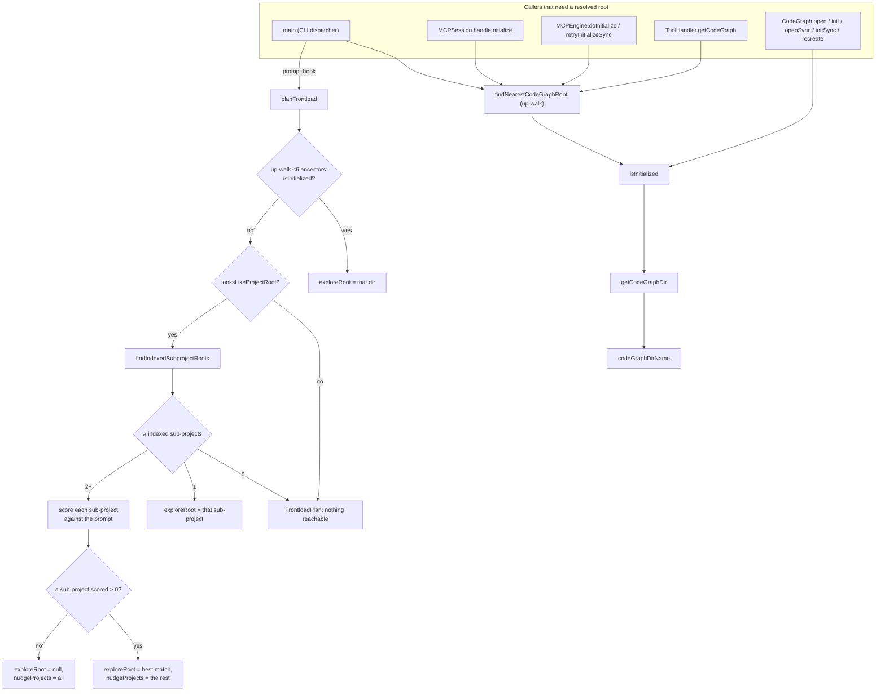

# Finding the Project — Root Discovery, `.codegraph/` Lifecycle, and Frontload Planning

## Overview
`directory.ts` answers a question every other part of CodeGraph must ask before it can do anything: *which project, if any, is this request about?* CodeGraph never receives a fixed project handle from its caller — the CLI is invoked from an arbitrary cwd, the MCP server is launched by a host editor that may not report a workspace root, and a monorepo may have several independently-indexed sub-projects under one checkout. This module is the single place that turns "a filesystem location" into "a resolved `.codegraph/` root," and everything downstream — the library's `CodeGraph` class, the MCP session handshake, the daemon's socket/pid paths, the installer's uninstall sweep — calls back into it rather than re-implementing the walk. Layered on top of that primitive is a second, more surprising job: [`planFrontload`](../catalog/src/directory.ts.md#planFrontload) doesn't just resolve a root, it *guesses* which project a natural-language prompt is about, so a CLI hook can inject context before the agent has asked for it.

## Diagram

## Design rationale (why it's built this way)
- **`.codegraph/` existence isn't enough to mean "initialized."** [`isInitialized`](../catalog/src/directory.ts.md#isInitialized) requires both the directory *and* a `codegraph.db` file inside it — its own comment is explicit: "Must have codegraph.db, not just .codegraph folder." This matters because [`createDirectory`](../catalog/src/directory.ts.md#createDirectory) (folder + `.gitignore`) and database creation are separate steps in the init sequence; without the db check, a project that crashed between those two steps — or one where a caller ran `createDirectory` alone — would incorrectly read as ready to open.
- **Root discovery walks up, not sideways, and every long-lived consumer re-runs it rather than caching it.** [`getCodeGraph`](../catalog/src/mcp/tools.ts.md#ToolHandler.getCodeGraph)'s own comment explains why: "Always RE-RESOLVE the nearest `.codegraph/` from the input path… is the only thing that notices a path whose index root CHANGED since it was first seen — most importantly a git worktree that gained its own `.codegraph/` after the (long-lived) server first resolved it up to the parent checkout." Caching the *database connection* (keyed by resolved root) is fine and done elsewhere; caching the *resolution itself* is what silently went stale.
- **The down-scan for monorepos is gated, not automatic.** [`planFrontload`](../catalog/src/directory.ts.md#planFrontload) only calls [`findIndexedSubprojectRoots`](../catalog/src/directory.ts.md#findIndexedSubprojectRoots) after [`looksLikeProjectRoot`](../catalog/src/directory.ts.md#looksLikeProjectRoot) passes, so a prompt issued from `$HOME` or an arbitrary non-project directory is a cheap no-op instead of a filesystem crawl — the gate exists specifically so an unrelated cwd can't trigger a deep, bounded-but-still-costly walk.
- **When several sub-projects are indexed and none clearly matches the prompt, the plan deliberately picks nothing.** The comment in [`planFrontload`](../catalog/src/directory.ts.md#planFrontload) says it directly: "No clear match — nudge the full list rather than front-load a guess." This mirrors a broader design stance in the repo (see the sibling MCP tool-error handling): a wrong proactive guess is worse than no guess, because it teaches the agent to distrust the injected context.
- **The `.codegraph/` name itself is a live, environment-sensitive value, not a constant.** [`codeGraphDirName`](../catalog/src/directory.ts.md#codeGraphDirName) reads `CODEGRAPH_DIR` from the environment on every call (not captured once at load), rejects anything that isn't a bare directory segment (no `..`, no path separators, not absolute), and falls back to [`DEFAULT_CODEGRAPH_DIR`](../catalog/src/directory.ts.md#DEFAULT_CODEGRAPH_DIR) with a one-time warning (tracked by [`warnedBadDirName`](../catalog/src/directory.ts.md#warnedBadDirName)) when it's invalid. [`getCodeGraphDir`](../catalog/src/directory.ts.md#getCodeGraphDir) is the thin join of a project root with that name, and it is what everything else — the database path, the daemon socket path, the daemon pidfile — is built from, so a bad override can't leak into any of those.

> [!inferred] `codeGraphDirName`'s docstring (visible in source, not in this packet's cited doc line) explains the *reason* for making the directory name overridable: two environments sharing one working tree (Windows-native and WSL) must not share one `.codegraph/`, because the daemon lockfile records a platform-specific pid/socket and cross-filesystem SQLite locking between WSL2 and Windows is unreliable. This is read directly from the source comment rather than from a citable Subgraph symbol, since the rationale lives in prose above the function.

## Entry points
- [`main`](../catalog/src/bin/codegraph.ts.md#main) — the CLI's command dispatcher. It registers, among other subcommands, the hidden `prompt-hook` command that a host agent wires up as a `UserPromptSubmit` hook; that command is what calls [`planFrontload`](../catalog/src/directory.ts.md#planFrontload) on (effectively) every user turn, and it also underlies `codegraph init`/`codegraph status`, which go through [`isInitialized`](../catalog/src/directory.ts.md#isInitialized) and [`getCodeGraphDir`](../catalog/src/directory.ts.md#getCodeGraphDir).
- [`open`](../catalog/src/index.ts.md#CodeGraph.open), [`init`](../catalog/src/index.ts.md#CodeGraph.init), [`openSync`](../catalog/src/index.ts.md#CodeGraph.openSync), [`initSync`](../catalog/src/index.ts.md#CodeGraph.initSync), and [`recreate`](../catalog/src/index.ts.md#CodeGraph.recreate) — the library's static entry points, reached whenever any embedder (CLI, MCP engine, or a direct library consumer) opens or creates a project. Each checks [`isInitialized`](../catalog/src/directory.ts.md#isInitialized) in the direction its name implies (`open`/`openSync` require it true, `init`/`initSync` require it false, `recreate` requires it true and rebuilds in place), and each derives its database path via [`getCodeGraphDir`](../catalog/src/directory.ts.md#getCodeGraphDir).
- [`handleInitialize`](../catalog/src/mcp/session.ts.md#MCPSession.handleInitialize) — the MCP protocol handshake handler, hit once per client connection. Before responding, it calls [`findNearestCodeGraphRoot`](../catalog/src/directory.ts.md#findNearestCodeGraphRoot) synchronously to decide which of two instruction variants to hand the connecting agent (a default project exists vs. it must pass `projectPath` explicitly) — done fast enough to answer the handshake before any heavier initialization.
- [`doInitialize`](../catalog/src/mcp/engine.ts.md#MCPEngine.doInitialize) and [`retryInitializeSync`](../catalog/src/mcp/engine.ts.md#MCPEngine.retryInitializeSync) — the MCP engine's project-resolution path, reached at server startup and again on every tool call while no project has yet resolved. Both call [`findNearestCodeGraphRoot`](../catalog/src/directory.ts.md#findNearestCodeGraphRoot) from a `searchFrom` path and, on success, open the library instance — `retryInitializeSync` exists specifically because the *first* resolution attempt can fail (no root reachable yet) and later tool calls need a cheap re-check.
- [`getCodeGraph`](../catalog/src/mcp/tools.ts.md#ToolHandler.getCodeGraph) — hit on every MCP tool invocation that carries a `projectPath`. It re-resolves via [`findNearestCodeGraphRoot`](../catalog/src/directory.ts.md#findNearestCodeGraphRoot) on each call rather than trusting a previous resolution, which is what lets it notice a project whose `.codegraph/` root changed underneath it.
- [`runUninstaller`](../catalog/src/installer/index.ts.md#runUninstaller) — the interactive uninstall flow, which uses [`getCodeGraphDir`](../catalog/src/directory.ts.md#getCodeGraphDir) to locate the per-project data directory it sweeps alongside each agent's config.

## Mechanism (step-by-step)
1. **Naming and locating the directory.** [`codeGraphDirName`](../catalog/src/directory.ts.md#codeGraphDirName) resolves the directory's *name* (honoring a validated `CODEGRAPH_DIR` override, else [`DEFAULT_CODEGRAPH_DIR`](../catalog/src/directory.ts.md#DEFAULT_CODEGRAPH_DIR)) and [`getCodeGraphDir`](../catalog/src/directory.ts.md#getCodeGraphDir) joins it onto a project root. Every other function in this file — and every consumer in the rest of the codebase (daemon sockets via [`getDaemonSocketCandidates`](../catalog/src/mcp/daemon-paths.ts.md#getDaemonSocketCandidates) and [`getDaemonPidPath`](../catalog/src/mcp/daemon-paths.ts.md#getDaemonPidPath), the database path via [`getDatabasePath`](../catalog/src/db/index.ts.md#getDatabasePath)) — builds its path through this pair rather than hardcoding `.codegraph`, so the env override applies uniformly.
2. **Walking up to find "the" project.** [`findNearestCodeGraphRoot`](../catalog/src/directory.ts.md#findNearestCodeGraphRoot) resolves the given start path and walks parent directories one at a time, calling [`isInitialized`](../catalog/src/directory.ts.md#isInitialized) at each level, until it either finds an initialized ancestor or reaches the filesystem root (checked explicitly after the loop, since the loop's `current !== root` guard never evaluates the root itself). This unbounded upward walk is the resolution primitive nearly every entry point above shares — it is what makes CodeGraph work correctly when invoked from a nested subdirectory or a file several levels below the actual project root.
3. **Creating, validating, and removing the directory.** [`createDirectory`](../catalog/src/directory.ts.md#createDirectory) only refuses to proceed if `codegraph.db` already exists (a bare `.codegraph/` folder with no db is fine to reuse), then creates the folder and writes/upgrades its `.gitignore`. [`validateDirectory`](../catalog/src/directory.ts.md#validateDirectory) is the structural-health check `open`/`openSync` run before touching the database — it confirms the directory exists and is really a directory, and self-heals a missing or stale `.gitignore` in place rather than failing on that alone. [`removeDirectory`](../catalog/src/directory.ts.md#removeDirectory) is defensive about what it deletes: a symlinked `.codegraph/` has only the link itself unlinked (never followed for a recursive delete), and a non-directory file at that path is removed as a single file rather than assumed to be a tree.
4. **Guessing the project from a prompt (frontload planning).** [`planFrontload`](../catalog/src/directory.ts.md#planFrontload) layers a heuristic on top of the resolution primitives for the one case where nothing has explicitly named a project yet: a raw chat prompt. It first tries a bounded up-walk (6 ancestors, re-checking [`isInitialized`](../catalog/src/directory.ts.md#isInitialized) at each) covering the ordinary single-project case cheaply; if that fails, it gates a down-scan behind [`looksLikeProjectRoot`](../catalog/src/directory.ts.md#looksLikeProjectRoot) and calls [`findIndexedSubprojectRoots`](../catalog/src/directory.ts.md#findIndexedSubprojectRoots) to find indexed sub-projects (the monorepo case); with more than one candidate, it scores each by whether the prompt text contains its path relative to cwd (score 10) or its bare directory name as a whole word via [`escapeRegExp`](../catalog/src/directory.ts.md#escapeRegExp)-built regex (score 5), and returns the result as a [`FrontloadPlan`](../catalog/src/directory.ts.md#FrontloadPlan) — a single project to explore ([`exploreRoot`](../catalog/src/directory.ts.md#FrontloadPlan.exploreRoot)), the rest to merely mention ([`nudgeProjects`](../catalog/src/directory.ts.md#FrontloadPlan.nudgeProjects)), and whether the answer came from the down-scan ([`viaSubScan`](../catalog/src/directory.ts.md#FrontloadPlan.viaSubScan), which tells the caller a follow-up query needs an explicit `projectPath`).

## Key data structures
- [`FrontloadPlan`](../catalog/src/directory.ts.md#FrontloadPlan) — the return shape of [`planFrontload`](../catalog/src/directory.ts.md#planFrontload): [`exploreRoot`](../catalog/src/directory.ts.md#FrontloadPlan.exploreRoot) (the single project to proactively open and explore, or `null`), [`nudgeProjects`](../catalog/src/directory.ts.md#FrontloadPlan.nudgeProjects) (sibling indexed projects worth mentioning but not opening), and [`viaSubScan`](../catalog/src/directory.ts.md#FrontloadPlan.viaSubScan) (whether the answer came from scanning down into sub-projects rather than up to an ancestor — a signal that any follow-up query needs an explicit path).
- [`WORKSPACE_ROOT_MANIFESTS`](../catalog/src/directory.ts.md#WORKSPACE_ROOT_MANIFESTS) and [`SUBPROJECT_SCAN_SKIP`](../catalog/src/directory.ts.md#SUBPROJECT_SCAN_SKIP) — the two hardcoded lists that gate the down-scan: the former (manifests like `package.json`, `Cargo.toml`, `go.work`, `WORKSPACE`) decides whether a directory even *looks like* something worth scanning under; the latter (`node_modules`, `.git`, `dist`, `vendor`, …) is pruned during the scan so it never descends into build output or dependency trees.
- [`DEFAULT_CODEGRAPH_DIR`](../catalog/src/directory.ts.md#DEFAULT_CODEGRAPH_DIR) and [`warnedBadDirName`](../catalog/src/directory.ts.md#warnedBadDirName) — the fallback directory name and a one-time-warning latch for an invalid `CODEGRAPH_DIR` override, both consumed inside [`codeGraphDirName`](../catalog/src/directory.ts.md#codeGraphDirName).
- The `{ maxDepth, max }` bounds on [`findIndexedSubprojectRoots`](../catalog/src/directory.ts.md#findIndexedSubprojectRoots) — [`maxDepth`](../catalog/src/directory.ts.md#findIndexedSubprojectRoots.opts-typeLiteral50.maxDepth) and [`max`](../catalog/src/directory.ts.md#findIndexedSubprojectRoots.opts-typeLiteral50.max) — default to 4 levels and 64 results, capping the down-scan's worst case on a very large or deep monorepo.
- [`validateDirectory`](../catalog/src/directory.ts.md#validateDirectory)'s `{ valid: boolean; errors: string[] }` result — a small structural report rather than a boolean, consumed by [`open`](../catalog/src/index.ts.md#CodeGraph.open)/[`openSync`](../catalog/src/index.ts.md#CodeGraph.openSync) to surface *which* structural problem it hit rather than a generic failure.

## Dynamics (design intent)
This module's own operations are synchronous filesystem calls (`existsSync`/`statSync`/`readdirSync`) with no concurrency primitives of its own — any serialization (e.g. the MCP engine ensuring concurrent sessions don't double-open a database) lives in the calling module, not here. The one dynamic worth calling out is *freshness over caching*: [`getCodeGraph`](../catalog/src/mcp/tools.ts.md#ToolHandler.getCodeGraph) re-runs [`findNearestCodeGraphRoot`](../catalog/src/directory.ts.md#findNearestCodeGraphRoot) on every call rather than reusing a prior resolution, deliberately paying a repeated (but cheap — a few `existsSync` calls up the tree) stat walk so a changed index root is never served stale.

> [!inferred] This packet's Evidence section lists no tests exercising this subgraph directly. Root-discovery and frontload-planning behavior in this codebase appears to be validated indirectly (installer contract tests and the agent-eval harness described in the repo's own `CLAUDE.md`) rather than by a dedicated unit-test file for `directory.ts`'s planning logic — worth confirming rather than assuming.

## Edge cases
- A `.codegraph/` folder that exists but has no `codegraph.db` reads as **not** initialized — [`isInitialized`](../catalog/src/directory.ts.md#isInitialized) checks both, and [`createDirectory`](../catalog/src/directory.ts.md#createDirectory) alone (folder + `.gitignore`, no db) is exactly this intermediate state.
- [`planFrontload`](../catalog/src/directory.ts.md#planFrontload)'s up-walk is capped at 6 ancestor levels, unlike [`findNearestCodeGraphRoot`](../catalog/src/directory.ts.md#findNearestCodeGraphRoot)'s unbounded walk to the filesystem root — a project nested more than 6 directories below where a prompt originates will fall through to the (gated) down-scan path instead of being found by the up-walk, even though the ordinary root-discovery path used everywhere else would have found it.
- [`findIndexedSubprojectRoots`](../catalog/src/directory.ts.md#findIndexedSubprojectRoots) stops descending the instant it finds an indexed directory ("don't descend into an indexed project" in its own body) — a project nested *inside* another indexed project's tree is invisible to the scan, by design.
- The down-scan only triggers when [`looksLikeProjectRoot`](../catalog/src/directory.ts.md#looksLikeProjectRoot) matches one of the [`WORKSPACE_ROOT_MANIFESTS`](../catalog/src/directory.ts.md#WORKSPACE_ROOT_MANIFESTS) — a monorepo using a build/workspace tool whose manifest isn't in that hardcoded list will never get its sub-projects front-loaded.
- [`planFrontload`](../catalog/src/directory.ts.md#planFrontload)'s name-based scoring only whole-word-matches names of 3+ characters via [`escapeRegExp`](../catalog/src/directory.ts.md#escapeRegExp); shorter sub-project names can never score via the name path and must be matched by relative-path substring instead.
- [`removeDirectory`](../catalog/src/directory.ts.md#removeDirectory) explicitly checks for a symlink before recursing, so a `.codegraph/` that is itself a symlink into another location is never followed for a recursive delete — only the link is removed.

## Open questions
- Why [`planFrontload`](../catalog/src/directory.ts.md#planFrontload)'s up-walk cap is exactly 6 (vs. the unbounded walk in [`findNearestCodeGraphRoot`](../catalog/src/directory.ts.md#findNearestCodeGraphRoot)) isn't explained in a comment — it reads as a deliberate cheap-path bound for a hook that runs on every prompt, but the specific number is unexplained.
- This packet's subgraph doesn't include `isCodeGraphDataDir` or the `CODEGRAPH_DIR`-sibling matching it performs (`.codegraph-*`), so how the file watcher and indexer actually use that predicate to skip a *sibling* environment's data directory (the Windows/WSL co-location scenario `codeGraphDirName`'s docstring describes) is out of scope here — flagged rather than guessed at.
- The exact caller that installs the `prompt-hook` CLI subcommand as an agent's `UserPromptSubmit` hook (i.e. the installer code that wires it up) isn't in this subgraph either; [`main`](../catalog/src/bin/codegraph.ts.md#main) is cited here as the command's registration point, not its installation point.

## See also
- [Top-level CodeGraph orchestration API](index.ts.md) — the library's `CodeGraph` class is this module's most direct consumer, calling `isInitialized`/`createDirectory`/`getCodeGraphDir`/`validateDirectory` from every static entry point.
- [MCP tool surface](mcp-tools.ts.md) — `ToolHandler.getCodeGraph` re-resolves the project root on every tool call via this module's `findNearestCodeGraphRoot`.
- [Background daemon keeping the DB warm across MCP calls](mcp-daemon.ts.md) — the daemon's socket and pidfile paths are both derived from `getCodeGraphDir`, and its root resolution goes through `findNearestCodeGraphRoot`.
- [Filesystem watcher → incremental re-index](sync-watcher.ts.md) — the watcher's own state (`CodeGraph.watcher`) is keyed off the same `.codegraph/` directory this module locates and manages.
