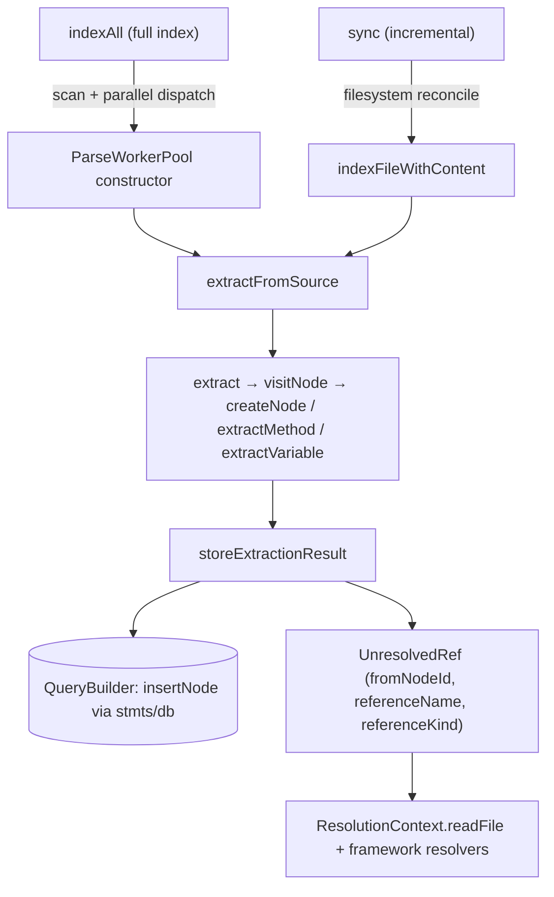

# Extraction pipeline orchestration — two entry points, one ordered write path

## Overview
`ExtractionOrchestrator` is the seam between "files on disk" and "rows in the
SQLite symbol graph." It exposes two independent front doors onto the same
back half of a pipeline: a full-repo pass that fans parsing across a worker
pool, and a filesystem-driven incremental pass that reconciles against
whatever is already indexed. Both converge on the same per-file sequence —
extract, then commit — so a from-scratch index and years of daily incremental
syncs are meant to leave the database in the same shape. The idea worth
carrying away is that this module does no semantic work at all: extraction
downstream of it produces two kinds of output, `Node`/`Edge` it is certain of
and `UnresolvedReference`s it deliberately defers, and this file's entire job
is mechanical — get bytes parsed, commit the result in a stable order, and
keep the file-tracking state (content hashes, sizes, mtimes) honest enough
that the *next* run knows what changed without ever asking git.

## Diagram

## Design rationale (why it's built this way)
- **Parallel parse, serial deterministic commit.** [`indexAll`](../catalog/src/extraction/index.ts.md#ExtractionOrchestrator.indexAll)
  dispatches file parses across a [`<constructor>`](../catalog/src/extraction/parse-pool.ts.md#ParseWorkerPool.-constructor)-built
  worker pool so parsing runs concurrently, but the code inside `indexAll`
  buffers completed parses and commits them to SQLite strictly in original
  file order rather than completion order — because a later resolution phase
  breaks ties between same-named candidate symbols by DB insertion order, and
  parse-completion order would otherwise make the resulting graph drift
  nondeterministically run to run instead of staying byte-identical to a
  single-worker run.
- **The filesystem, never git, is the source of truth for "what changed."**
  [`sync`](../catalog/src/extraction/index.ts.md#ExtractionOrchestrator.sync)'s
  own doc comment is explicit about this: a cheap `(size, mtime)` stat
  pre-filter skips files whose content plausibly hasn't changed without
  reading or hashing them, and only a real candidate gets read + hashed to
  confirm. This is what lets `sync` work in non-git projects and also catch
  changes `git status` is blind to — a `git pull`/`checkout`/`merge`/`rebase`
  leaves a clean working tree even though every touched file's content did
  change underneath the index.
- **A file's incoming edges from *other*, unchanged files must survive its
  own re-index.** [`storeExtractionResult`](../catalog/src/extraction/index.ts.md#ExtractionOrchestrator.storeExtractionResult)
  deletes a changed file's existing nodes before re-inserting the fresh
  extraction, and that delete cascades to every edge touching those nodes —
  including edges whose [`source`](../catalog/src/types.ts.md#Edge.source) is
  a caller living in some *other*, unchanged file (e.g. `pkg.mod.fn(...)`
  reaching into `mod.ts`). Those edges are never re-emitted by re-extracting
  only the changed file, so a naive delete-and-reinsert would silently sever
  them on every edit to a shared module. The fix snapshots those edges (with
  the [`target`](../catalog/src/types.ts.md#Edge.target) node's kind/name)
  before the delete and re-resolves each snapshot to the freshly re-indexed
  target's new [`id`](../catalog/src/types.ts.md#Node.id) — matching by
  `(filePath, kind, name)` rather than the old id, because `id` is derived
  from the symbol's line number, so *any* line shift in the callee file
  (even an unrelated docstring edit above the symbol) changes the id and
  would defeat a lookup by old id. If the symbol was renamed or removed in
  the meantime, no match is found and the edge is correctly left dropped.
- **A content-hash gate makes "no real change" a fast no-op.**
  [`storeExtractionResult`](../catalog/src/extraction/index.ts.md#ExtractionOrchestrator.storeExtractionResult)
  returns immediately when the incoming content's hash matches what's already
  stored for that path — the delete/re-insert/edge-repair machinery above
  never runs for a file that was merely re-scanned, not actually edited.
- **The same method names exist at two layers, and it matters which one you
  mean.** [`indexAll`](../catalog/src/index.ts.md#CodeGraph.indexAll) and
  [`sync`](../catalog/src/index.ts.md#CodeGraph.sync) on the public `CodeGraph`
  class immediately delegate to this orchestrator's own
  [`indexAll`](../catalog/src/extraction/index.ts.md#ExtractionOrchestrator.indexAll)/[`sync`](../catalog/src/extraction/index.ts.md#ExtractionOrchestrator.sync) —
  the outer layer owns locking and post-extraction resolution, this layer
  owns scan/parse/store. A second, sharper naming collision sits inside this
  module's own vocabulary: the graph's [`Node`](../catalog/src/types.ts.md#Node)
  (a code symbol) and tree-sitter's [`Node`](../catalog/src/web-tree-sitter.d.ts.md#Node)
  (a syntax-tree node) are two unrelated types that happen to share the exact
  identifier — every extractor method converts instances of the second into
  instances of the first, so reading this pipeline requires tracking which
  `Node` a given line means from context alone.

## Entry points
- [`indexAll`](../catalog/src/extraction/index.ts.md#ExtractionOrchestrator.indexAll) —
  the full-repo entry point, reached one layer up from
  [`indexAll`](../catalog/src/index.ts.md#CodeGraph.indexAll) on `CodeGraph`
  (the public API `codegraph index`/`codegraph.init` ultimately calls). Hit
  once per from-scratch index or an explicit force re-index.
- [`sync`](../catalog/src/extraction/index.ts.md#ExtractionOrchestrator.sync) —
  the incremental entry point, reached from
  [`sync`](../catalog/src/index.ts.md#CodeGraph.sync) on `CodeGraph`, which in
  turn is what a file watcher or `codegraph sync` wires its debounced/manual
  re-index calls to. Never trusts git state; always reconciles against the
  live filesystem.
- [`indexFileWithContent`](../catalog/src/extraction/index.ts.md#ExtractionOrchestrator.indexFileWithContent) —
  the shared single-file path `sync`'s per-changed-file loop bottoms out in
  (through a thin per-path wrapper that stats and reads the file before
  delegating here). The full-index path does *not* reach it — `indexAll`'s
  ordered-commit loop and its WASM-crash retry passes both call
  `storeExtractionResult` directly. It is the entry point of choice whenever a
  caller already has a file's content and `fs.Stats` in hand and wants one file
  re-extracted and committed without re-scanning the whole tree.

## Mechanism (step-by-step)
1. **Scan, then dispatch parses across a bounded, order-preserving pipeline.**
   [`indexAll`](../catalog/src/extraction/index.ts.md#ExtractionOrchestrator.indexAll)
   scans the project, detects languages per file, and — when a compiled
   worker script is available — spins up a
   [`<constructor>`](../catalog/src/extraction/parse-pool.ts.md#ParseWorkerPool.-constructor)-built
   pool so parses run concurrently across cores. Dispatch is bounded to a
   small rolling window ahead of the commit cursor (buffered, out-of-order
   results wait for their turn), and results are drained into the database
   strictly in file order — trading a little pipeline slack for a
   deterministic graph.
2. **Each file goes through the same generic extraction regardless of
   caller.** Whether reached from `indexAll`'s pool or from
   [`indexFileWithContent`](../catalog/src/extraction/index.ts.md#ExtractionOrchestrator.indexFileWithContent),
   a file's content is handed to
   [`extractFromSource`](../catalog/src/extraction/tree-sitter.ts.md#extractFromSource),
   which parses it and calls
   [`extract`](../catalog/src/extraction/tree-sitter.ts.md#TreeSitterExtractor.extract).
   `extract` walks the tree via
   [`visitNode`](../catalog/src/extraction/tree-sitter.ts.md#TreeSitterExtractor.visitNode),
   which mints graph symbols through
   [`createNode`](../catalog/src/extraction/tree-sitter.ts.md#TreeSitterExtractor.createNode)
   (declaration extractors like
   [`extractMethod`](../catalog/src/extraction/tree-sitter.ts.md#TreeSitterExtractor.extractMethod)
   and
   [`extractVariable`](../catalog/src/extraction/tree-sitter.ts.md#TreeSitterExtractor.extractVariable)
   sit on top of it) and descends into function bodies via
   [`visitFunctionBody`](../catalog/src/extraction/tree-sitter.ts.md#TreeSitterExtractor.visitFunctionBody)
   for call/reference discovery — all of it reading the tree through
   tree-sitter's own accessors
   ([`<get>type`](../catalog/src/web-tree-sitter.d.ts.md#Node.-get-type),
   [`namedChild`](../catalog/src/web-tree-sitter.d.ts.md#Node.namedChild),
   [`<get>namedChildren`](../catalog/src/web-tree-sitter.d.ts.md#Node.-get-namedChildren),
   [`<get>namedChildCount`](../catalog/src/web-tree-sitter.d.ts.md#Node.-get-namedChildCount))
   and the thin
   [`getNodeText`](../catalog/src/extraction/tree-sitter-helpers.ts.md#getNodeText)/[`getChildByField`](../catalog/src/extraction/tree-sitter-helpers.ts.md#getChildByField)
   helpers. This module never touches the AST itself — extraction detail
   lives entirely behind `extractFromSource`'s return value.
3. **The extraction result is committed, with cross-file edges protected.**
   [`storeExtractionResult`](../catalog/src/extraction/index.ts.md#ExtractionOrchestrator.storeExtractionResult)
   is the single chokepoint every extraction path (full-index and
   single-file alike) commits through. It assembles graph rows straight from
   the extracted
   [`Node`](../catalog/src/types.ts.md#Node) fields
   ([`id`](../catalog/src/types.ts.md#Node.id),
   [`kind`](../catalog/src/types.ts.md#Node.kind),
   [`name`](../catalog/src/types.ts.md#Node.name),
   [`qualifiedName`](../catalog/src/types.ts.md#Node.qualifiedName),
   [`filePath`](../catalog/src/types.ts.md#Node.filePath),
   [`language`](../catalog/src/types.ts.md#Node.language),
   [`startLine`](../catalog/src/types.ts.md#Node.startLine),
   [`endLine`](../catalog/src/types.ts.md#Node.endLine)) and
   [`Edge`](../catalog/src/types.ts.md#Edge) fields
   ([`source`](../catalog/src/types.ts.md#Edge.source),
   [`target`](../catalog/src/types.ts.md#Edge.target),
   [`kind`](../catalog/src/types.ts.md#Edge.kind),
   [`line`](../catalog/src/types.ts.md#Edge.line),
   [`metadata`](../catalog/src/types.ts.md#Edge.metadata),
   [`provenance`](../catalog/src/types.ts.md#Edge.provenance)), writing
   through
   [`insertNode`](../catalog/src/db/queries.ts.md#QueryBuilder.insertNode)
   (backed by
   [`stmts`](../catalog/src/db/queries.ts.md#QueryBuilder.stmts),
   [`db`](../catalog/src/db/queries.ts.md#QueryBuilder.db), and
   [`prepare`](../catalog/src/db/sqlite-adapter.ts.md#SqliteDatabase.prepare)),
   before snapshotting and re-targeting any at-risk cross-file incoming edges
   as described above.
4. **Anything not locally resolvable is stored, not resolved, as an
   `UnresolvedReference`.** The same commit also persists every
   [`fromNodeId`](../catalog/src/types.ts.md#UnresolvedReference.fromNodeId) +
   [`referenceName`](../catalog/src/types.ts.md#UnresolvedReference.referenceName) +
   [`referenceKind`](../catalog/src/types.ts.md#UnresolvedReference.referenceKind) +
   [`line`](../catalog/src/types.ts.md#UnresolvedReference.line) +
   [`column`](../catalog/src/types.ts.md#UnresolvedReference.column)
   tuple the extractor queued, denormalizing file path and language onto it
   so the later resolution pass doesn't need to re-join back to the file
   table.
5. **`sync` re-derives "what changed" from disk state, then re-uses the same
   single-file path.** [`sync`](../catalog/src/extraction/index.ts.md#ExtractionOrchestrator.sync)
   walks the current file set against the DB's tracked files, deletes
   records for anything gone from disk, and for every add/modification calls
   into the single-file path that eventually reaches
   [`indexFileWithContent`](../catalog/src/extraction/index.ts.md#ExtractionOrchestrator.indexFileWithContent) —
   so a full index and an incremental sync do not maintain two separate
   extraction-and-commit implementations; they differ only in *which files*
   get fed into the same funnel.
6. **What this module produces is consumed one layer up, not here.** Neither
   `indexAll` nor `sync` in this file resolves an `UnresolvedReference` into
   a real edge — that happens in
   [`indexAll`](../catalog/src/index.ts.md#CodeGraph.indexAll)/[`sync`](../catalog/src/index.ts.md#CodeGraph.sync)
   on `CodeGraph`, which run a resolver against a
   [`ResolutionContext`](../catalog/src/resolution/types.ts.md#ResolutionContext)
   (whose [`readFile`](../catalog/src/resolution/types.ts.md#ResolutionContext.readFile)
   lets framework-specific resolvers —
   [`nestjsResolver`](../catalog/src/resolution/frameworks/nestjs.ts.md#nestjsResolver),
   [`springResolver`](../catalog/src/resolution/frameworks/java.ts.md#springResolver),
   [`railsResolver`](../catalog/src/resolution/frameworks/ruby.ts.md#railsResolver),
   [`aspnetResolver`](../catalog/src/resolution/frameworks/csharp.ts.md#aspnetResolver),
   [`rustResolver`](../catalog/src/resolution/frameworks/rust.ts.md#rustResolver), and
   [`expressResolver`](../catalog/src/resolution/frameworks/express.ts.md#expressResolver) —
   re-read source around a reference) against every stored
   [`UnresolvedRef`](../catalog/src/resolution/types.ts.md#UnresolvedRef). This
   module's contract ends the moment the reference is on disk in SQLite.

## Key data structures
- [`Node`](../catalog/src/types.ts.md#Node) / [`Edge`](../catalog/src/types.ts.md#Edge) —
  the committed graph rows this module writes on every successful extraction;
  see the field list in step 3 above. This is the same shape every downstream
  query/resolution/MCP layer reads back.
- The `UnresolvedReference` queue
  ([`fromNodeId`](../catalog/src/types.ts.md#UnresolvedReference.fromNodeId),
  [`referenceName`](../catalog/src/types.ts.md#UnresolvedReference.referenceName),
  [`referenceKind`](../catalog/src/types.ts.md#UnresolvedReference.referenceKind),
  [`line`](../catalog/src/types.ts.md#UnresolvedReference.line),
  [`column`](../catalog/src/types.ts.md#UnresolvedReference.column)) — the
  half of extraction output this module stores but never interprets; it is
  the handoff contract to resolution.
- [`QueryBuilder`](../catalog/src/db/queries.ts.md#QueryBuilder.stmts)'s
  cached prepared statements
  ([`stmts`](../catalog/src/db/queries.ts.md#QueryBuilder.stmts),
  [`db`](../catalog/src/db/queries.ts.md#QueryBuilder.db),
  [`prepare`](../catalog/src/db/sqlite-adapter.ts.md#SqliteDatabase.prepare)) —
  the write surface `storeExtractionResult` calls through; a statement is
  compiled once (via [`insertNode`](../catalog/src/db/queries.ts.md#QueryBuilder.insertNode))
  and reused on every subsequent node insert in the run.
- The [`<constructor>`](../catalog/src/extraction/parse-pool.ts.md#ParseWorkerPool.-constructor)-built
  worker pool — the parallelism backbone `indexAll` dispatches parses across;
  its existence (vs. the in-process fallback) is the difference between
  `indexAll`'s parallel path and every other entry point's synchronous one.
- [`ResolutionContext`](../catalog/src/resolution/types.ts.md#ResolutionContext) /
  [`UnresolvedRef`](../catalog/src/resolution/types.ts.md#UnresolvedRef) — not
  produced by this module, but the exact shape the next pipeline stage
  expects, which is why `storeExtractionResult`'s denormalization step
  (attaching `filePath`/`language` to each reference) exists.

## Dynamics (design intent)
- Parsing is concurrent (bounded by the pool), but every SQLite write inside
  [`indexAll`](../catalog/src/extraction/index.ts.md#ExtractionOrchestrator.indexAll)
  happens on the main thread through the ordered-commit buffer described
  above — the source comments are explicit that this is deliberate: SQLite
  isn't thread-safe, and committing in parse-completion order (instead of
  file order) would make the resulting graph's tie-breaking behavior depend
  on parse timing rather than being reproducible.
- [`sync`](../catalog/src/extraction/index.ts.md#ExtractionOrchestrator.sync)'s
  reconcile runs two synchronous, `fs`-call-heavy loops (removals, then
  adds/modifications) over every tracked/current file; on a very large
  project this would otherwise block the event loop for minutes, so the loop
  cooperatively yields (`setImmediate`) at a fixed interval, keeping the
  process responsive to a liveness watchdog and any concurrent read query
  while the reconcile runs.
- The worker pool constructed in `indexAll` spawns one worker eagerly at
  construction time — [`<constructor>`](../catalog/src/extraction/parse-pool.ts.md#ParseWorkerPool.-constructor)
  — so the very first file dispatched doesn't pay worker-startup latency on
  the critical path.

## Edge cases
- [`storeExtractionResult`](../catalog/src/extraction/index.ts.md#ExtractionOrchestrator.storeExtractionResult)
  is a true no-op — no delete, no re-insert, no edge repair — when the
  incoming content's hash matches the already-stored file's hash, even if
  the caller re-extracted it anyway.
- Because a graph [`id`](../catalog/src/types.ts.md#Node.id) is derived in
  part from the symbol's source line, an edit that only shifts lines above a
  symbol (no semantic change to the symbol itself) still changes that
  symbol's id — which is exactly why cross-file incoming edges are
  re-targeted by `(filePath, kind, name)` rather than by the old id; if the
  symbol was renamed or deleted in the same edit, no match exists and the
  edge is correctly, not accidentally, dropped.
- [`indexFileWithContent`](../catalog/src/extraction/index.ts.md#ExtractionOrchestrator.indexFileWithContent)
  returns an explicit `path_traversal` error result rather than throwing when
  a path resolves outside the project root, an explicit `size_exceeded`
  warning for oversized files, and a silent empty (`errors: []`) result for a
  detected-but-unsupported language — three different "nothing to extract"
  outcomes with three different meanings a caller has to distinguish by the
  `errors` array, not by an exception.
- [`indexAll`](../catalog/src/extraction/index.ts.md#ExtractionOrchestrator.indexAll)
  checks its `AbortSignal` immediately after the scan/framework-detection
  phase and returns a zero-work, `success: false` result rather than starting
  any parsing at all if the caller already aborted before parsing began.

## Open questions
- [`indexFileWithContent`](../catalog/src/extraction/index.ts.md#ExtractionOrchestrator.indexFileWithContent)
  has no caller inside this packet's subgraph — the real external callers
  (a live file watcher's debounced re-index, or an MCP "reindex this file"
  tool) sit in modules outside this packet and aren't groundable here.
- `indexAll`'s retry passes for files that crash the WASM parser (recycling
  the worker pool, then stripping comment-only lines as a last resort) touch
  no symbol in this subgraph — whether comment-stripped extraction still
  produces correctly-positioned nodes for those specific files isn't
  groundable from this packet.
- The conformance/"second pass" logic that [`indexAll`](../catalog/src/index.ts.md#CodeGraph.indexAll)
  on `CodeGraph` runs after this module's phase completes (chained calls
  resolved against a receiver's supertype) is only partially visible in the
  packet's source excerpt and depends on symbols (e.g. a supertype lookup)
  not present in this subgraph.

## See also
- [CodeGraph orchestration API](index.ts.md) — the public class whose
  `indexAll`/`sync` wrap this module's methods one-to-one and own locking
  plus the resolution phase that consumes what this module writes.
- [TreeSitterExtractor — one generic walker, N language tables](extraction-tree-sitter.ts.md) —
  what actually happens inside `extractFromSource`/`extract` on every file
  this module hands off.
- [FileWatcher — bounded-cost live re-indexing](sync-watcher.ts.md) — the
  live-editing driver whose debounced flush ultimately calls into this
  module's `sync`.
- [ReferenceResolver: UnresolvedRef → edges](resolution-index.ts.md) — the
  next pipeline stage, consuming the `UnresolvedRef` rows this module
  persists but never interprets.
