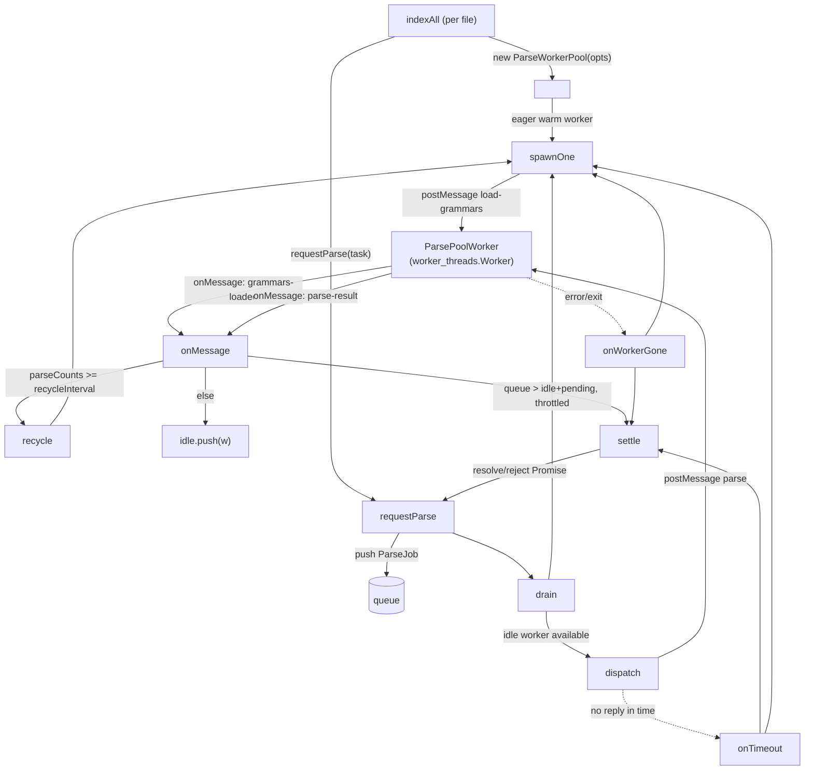

# Parse Worker Pool — Parallelizing Tree-Sitter Extraction Across Cores

## Overview
`ParseWorkerPool` is the mechanism that lets a full `codegraph index` run use every
core on the machine instead of one. Tree-sitter parsing is the CPU-bound stage of
the ingestion pipeline that turns source files into an [`ExtractionResult`](../catalog/src/types.ts.md#ExtractionResult)
(nodes/edges/unresolved refs); before this pool existed, an
[`indexAll`](../catalog/src/extraction/index.ts.md#ExtractionOrchestrator.indexAll)
run parsed every file through one thread and pinned a single core while the rest
of an N-core machine sat idle on large repos. The pool fixes this by farming parse
calls out to a small set of `worker_threads`, each carrying its **own independent
tree-sitter WASM heap**, while SQLite storage stays put on the main thread — SQLite
isn't thread-safe, so only the parallelizable, CPU-bound half of indexing (parsing)
moves off it. The key design idea is a classic bounded worker pool — a job queue,
an idle-worker list, and a scheduler (`drain`) that grows the pool lazily and
dispatches queued work — but with parse-specific twists layered on: workers are
periodically **recycled** because a WASM heap only grows, never shrinks; a failed
parse **rejects rather than retries**, leaving the smarter two-stage retry to the
caller; and a size-1 pool is a deliberate, exact reproduction of the old
single-worker code path (the rollback). This mirrors a sibling pattern used
elsewhere in codegraph for pooling worker threads behind a queue (see the MCP
query pool, below) — the same idle-list-dispatch skeleton, adapted here for
parsing instead of query serving.

## Diagram

## Design rationale (why it's built this way)
- **Only the CPU-bound step is parallelized.** The module keeps SQLite writes on
  the main thread and moves just the parse step into workers, because storage
  "isn't thread-safe" — parallelizing the whole pipeline would require a much
  bigger redesign for no extra throughput, since results are written back as they
  arrive regardless of which worker produced them.
- **Per-worker recycling exists because WASM heaps are one-way.** The pool tracks
  [`parseCounts`](../catalog/src/extraction/parse-pool.ts.md#ParseWorkerPool.parseCounts)
  per worker and tears one down via [`recycle`](../catalog/src/extraction/parse-pool.ts.md#ParseWorkerPool.recycle)
  once it crosses [`recycleInterval`](../catalog/src/extraction/parse-pool.ts.md#ParseWorkerPool.recycleInterval)
  (default [`DEFAULT_RECYCLE_INTERVAL`](../catalog/src/extraction/parse-pool.ts.md#DEFAULT_RECYCLE_INTERVAL) = 250
  parses) — a fresh worker means fresh linear memory, reclaiming heap a
  long-lived WASM tree-sitter instance would otherwise never give back. This is
  explicitly the same reason the old single-worker path recycled.
- **Reject, don't retry, on failure.** [`requestParse`](../catalog/src/extraction/parse-pool.ts.md#ParseWorkerPool.requestParse)'s
  own doc comment is blunt about this: it "Resolves with the extraction result, or
  REJECTS" — a crashed or timed-out parse is not silently requeued inside the
  pool. Retrying belongs to the caller, which can run a smarter two-stage retry
  (fresh worker, then a comment-stripped source) against a guaranteed-clean WASM
  heap; the pool's job is only to fail fast and keep serving other work.
- **Cold-starts are throttled, not simultaneous.** [`drain`](../catalog/src/extraction/parse-pool.ts.md#ParseWorkerPool.drain)
  caps concurrently-spawning workers via [`MAX_CONCURRENT_SPAWN`](../catalog/src/extraction/parse-pool.ts.md#MAX_CONCURRENT_SPAWN)
  (2) — a worker's cold start is heavy (module load plus grammar WASM compile), so
  warming the whole pool at once would thrash CPU precisely when the pool is
  trying to *add* throughput; warming a couple at a time keeps each start fast
  while the pool still reaches full size within a few parses of a large run.
- **The pool size is hard-capped independent of caller intent.** The constructor
  clamps the requested size against [`MAX_PARSE_POOL_SIZE`](../catalog/src/extraction/parse-pool.ts.md#MAX_PARSE_POOL_SIZE)
  (16) regardless of what [`size`](../catalog/src/extraction/parse-pool.ts.md#ParseWorkerPoolOptions.size)
  the options requested — a ceiling that holds even if an env-var override upstream
  asked for more.
- **A crash budget acts as a circuit breaker, not an infinite respawn loop.** Every
  worker crash increments [`totalCrashes`](../catalog/src/extraction/parse-pool.ts.md#ParseWorkerPool.totalCrashes),
  and [`<get>healthy`](../catalog/src/extraction/parse-pool.ts.md#ParseWorkerPool.-get-healthy)
  flips false once that count crosses a threshold, after which the pool stops
  respawning and fails outstanding work instead of trying forever against a
  systematically broken worker platform.

> [!inferred] The exact crash-budget threshold and the logic that resolves a pool's
> `size` from an environment variable / CPU count live in this same source file but
> are outside this packet's subgraph (see Open questions) — read directly from
> source, not from a cited symbol here.

## Entry points
- [`requestParse`](../catalog/src/extraction/parse-pool.ts.md#ParseWorkerPool.requestParse) — the pool's only per-file entry point. Called once per file to parse; it pushes a job onto [`queue`](../catalog/src/extraction/parse-pool.ts.md#ParseWorkerPool.queue) and immediately calls [`drain`](../catalog/src/extraction/parse-pool.ts.md#ParseWorkerPool.drain) to try to run it, returning a `Promise` that settles when the job resolves or rejects.
- [`indexAll`](../catalog/src/extraction/index.ts.md#ExtractionOrchestrator.indexAll) — the orchestrator method that owns a pool instance for the duration of a full index run (its subgraph edges show it constructing the pool via [`<constructor>`](../catalog/src/extraction/parse-pool.ts.md#ParseWorkerPool.-constructor) and calling `requestParse`); this is where control reaches the pool from the rest of the indexing pipeline.
- [`<constructor>`](../catalog/src/extraction/parse-pool.ts.md#ParseWorkerPool.-constructor) — reached once per pool lifetime. It resolves options (clamping size, defaulting [`recycleInterval`](../catalog/src/extraction/parse-pool.ts.md#ParseWorkerPool.recycleInterval) and [`parseTimeoutMs`](../catalog/src/extraction/parse-pool.ts.md#ParseWorkerPool.parseTimeoutMs)), picks a [`createWorker`](../catalog/src/extraction/parse-pool.ts.md#ParseWorkerPool.createWorker) factory, and eagerly spawns one warm worker via [`spawnOne`](../catalog/src/extraction/parse-pool.ts.md#ParseWorkerPool.spawnOne) so the first parse doesn't wait on a cold start.

## Mechanism (step-by-step)
1. A caller (typically [`indexAll`](../catalog/src/extraction/index.ts.md#ExtractionOrchestrator.indexAll) looping over scanned files) calls [`requestParse`](../catalog/src/extraction/parse-pool.ts.md#ParseWorkerPool.requestParse) with a `ParseTask`. Unless the pool is already [`destroyed`](../catalog/src/extraction/parse-pool.ts.md#ParseWorkerPool.destroyed) (in which case it rejects immediately), the call wraps the task in a job, appends it to [`queue`](../catalog/src/extraction/parse-pool.ts.md#ParseWorkerPool.queue), and hands off to the scheduler — every file's parse funnels through this one path regardless of pool state.
2. [`drain`](../catalog/src/extraction/parse-pool.ts.md#ParseWorkerPool.drain) is the scheduler, and it runs after every state change. First it grows the pool: while queued work outnumbers workers that are idle or already cold-starting, and the pool hasn't hit [`maxSize`](../catalog/src/extraction/parse-pool.ts.md#ParseWorkerPool.maxSize) or its [`MAX_CONCURRENT_SPAWN`](../catalog/src/extraction/parse-pool.ts.md#MAX_CONCURRENT_SPAWN) throttle (and the pool is still [`<get>healthy`](../catalog/src/extraction/parse-pool.ts.md#ParseWorkerPool.-get-healthy)), it calls [`spawnOne`](../catalog/src/extraction/parse-pool.ts.md#ParseWorkerPool.spawnOne) to add capacity. Then it pairs every idle worker with a queued job via [`dispatch`](../catalog/src/extraction/parse-pool.ts.md#ParseWorkerPool.dispatch), skipping any job that was already settled (e.g. by a timeout) while it sat in the queue.
3. [`spawnOne`](../catalog/src/extraction/parse-pool.ts.md#ParseWorkerPool.spawnOne) creates a worker through the injected [`createWorker`](../catalog/src/extraction/parse-pool.ts.md#ParseWorkerPoolOptions.createWorker) factory (a real `worker_threads.Worker` in production, a fake in tests), registers it in [`workers`](../catalog/src/extraction/parse-pool.ts.md#ParseWorkerPool.workers) and [`pending`](../catalog/src/extraction/parse-pool.ts.md#ParseWorkerPool.pending), wires its `message`/`error`/`exit` handlers via [`on`](../catalog/src/extraction/parse-pool.ts.md#ParsePoolWorker.on), and tells it to load grammars for the pool's configured [`languages`](../catalog/src/extraction/parse-pool.ts.md#ParseWorkerPool.languages). A worker isn't usable yet at this point — it's `pending`, not `idle`, until it acknowledges the grammars are loaded.
4. [`dispatch`](../catalog/src/extraction/parse-pool.ts.md#ParseWorkerPool.dispatch) hands one job to one idle worker: it records the pairing in [`inflight`](../catalog/src/extraction/parse-pool.ts.md#ParseWorkerPool.inflight), bumps that worker's [`parseCounts`](../catalog/src/extraction/parse-pool.ts.md#ParseWorkerPool.parseCounts), starts a size-scaled timeout timer, and sends the task's [`content`](../catalog/src/extraction/parse-pool.ts.md#ParseTask.content), [`filePath`](../catalog/src/extraction/parse-pool.ts.md#ParseTask.filePath), [`language`](../catalog/src/extraction/parse-pool.ts.md#ParseTask.language), and [`frameworkNames`](../catalog/src/extraction/parse-pool.ts.md#ParseTask.frameworkNames) to the worker via [`postMessage`](../catalog/src/extraction/parse-pool.ts.md#ParsePoolWorker.postMessage).
5. [`onMessage`](../catalog/src/extraction/parse-pool.ts.md#ParseWorkerPool.onMessage) is where every worker reply lands. A `grammars-loaded` reply moves the worker from `pending` into [`idle`](../catalog/src/extraction/parse-pool.ts.md#ParseWorkerPool.idle) and re-triggers `drain` so it can immediately pick up queued work. A `parse-result` reply (carrying an [`ExtractionResult`](../catalog/src/types.ts.md#ExtractionResult) in its [`result`](../catalog/src/extraction/parse-pool.ts.md#ParseWorkerMessage.result) field) is matched against the worker's `inflight` job by id, and — this is the decision point where recycling happens — the worker goes to [`recycle`](../catalog/src/extraction/parse-pool.ts.md#ParseWorkerPool.recycle) if its parse count has reached `recycleInterval`, or back into `idle` otherwise, before the job is [`settle`](../catalog/src/extraction/parse-pool.ts.md#ParseWorkerPool.settle)d and `drain` runs again.
6. Two failure paths short-circuit a job outside the normal reply flow: [`onWorkerGone`](../catalog/src/extraction/parse-pool.ts.md#ParseWorkerPool.onWorkerGone) fires when a worker's `error`/`exit` handler reports it has died, and [`onTimeout`](../catalog/src/extraction/parse-pool.ts.md#ParseWorkerPool.onTimeout) fires when a worker doesn't reply before its per-job timer expires. Both remove the dead/stuck worker from bookkeeping, [`terminate`](../catalog/src/extraction/parse-pool.ts.md#ParsePoolWorker.terminate) it, reject the in-flight job through `settle`, and — if the pool is still [`<get>healthy`](../catalog/src/extraction/parse-pool.ts.md#ParseWorkerPool.-get-healthy) — call `spawnOne` to replace the lost capacity before running `drain` again.
7. [`settle`](../catalog/src/extraction/parse-pool.ts.md#ParseWorkerPool.settle) is the single funnel every job's `Promise` resolves through: it's a no-op if the job's [`settled`](../catalog/src/extraction/parse-pool.ts.md#ParseJob.settled) flag is already set, otherwise it clears the timeout [`timer`](../catalog/src/extraction/parse-pool.ts.md#ParseJob.timer) and calls the job's stored [`reject`](../catalog/src/extraction/parse-pool.ts.md#ParseJob.reject) or [`resolve`](../catalog/src/extraction/parse-pool.ts.md#ParseJob.resolve) callback — guaranteeing a job is only ever settled once no matter which of the several call sites (normal result, crash, timeout, recycle-induced staleness, or destroy) reaches it first.

## Key data structures
- [`ParseJob`](../catalog/src/extraction/parse-pool.ts.md#ParseJob) — one queued or in-flight unit of work: an [`id`](../catalog/src/extraction/parse-pool.ts.md#ParseJob.id) used to match worker replies, the [`task`](../catalog/src/extraction/parse-pool.ts.md#ParseJob.task) payload, the caller's `resolve`/`reject` closures, a `settled` guard, and an optional timeout `timer`.
- [`ParsePoolWorker`](../catalog/src/extraction/parse-pool.ts.md#ParsePoolWorker) — the minimal worker surface the pool drives (`postMessage`, `terminate`, `on('message'|'error'|'exit')`), deliberately abstracted away from `worker_threads.Worker` so tests can inject a fake and exercise queueing/growth/recycle/crash-recovery without spawning real threads.
- [`ParseWorkerMessage`](../catalog/src/extraction/parse-pool.ts.md#ParseWorkerMessage) — the reply shape a worker posts back: a [`type`](../catalog/src/extraction/parse-pool.ts.md#ParseWorkerMessage.type) tag (`grammars-loaded` or `parse-result`), an optional [`id`](../catalog/src/extraction/parse-pool.ts.md#ParseWorkerMessage.id) to match against the job, and the [`result`](../catalog/src/extraction/parse-pool.ts.md#ParseWorkerMessage.result) payload for a parse.
- Five collections indexed by worker track pool state: [`workers`](../catalog/src/extraction/parse-pool.ts.md#ParseWorkerPool.workers) (all live workers), [`idle`](../catalog/src/extraction/parse-pool.ts.md#ParseWorkerPool.idle) (ready for a job), [`pending`](../catalog/src/extraction/parse-pool.ts.md#ParseWorkerPool.pending) (spawned, still loading grammars), [`inflight`](../catalog/src/extraction/parse-pool.ts.md#ParseWorkerPool.inflight) (worker → its current job), and [`parseCounts`](../catalog/src/extraction/parse-pool.ts.md#ParseWorkerPool.parseCounts) (worker → lifetime parses, the recycle trigger).
- The options a pool is constructed with configure everything above: [`languages`](../catalog/src/extraction/parse-pool.ts.md#ParseWorkerPoolOptions.languages) to preload grammars for, [`size`](../catalog/src/extraction/parse-pool.ts.md#ParseWorkerPoolOptions.size), a [`workerScriptPath`](../catalog/src/extraction/parse-pool.ts.md#ParseWorkerPoolOptions.workerScriptPath) (the compiled worker entry point) or an injectable [`createWorker`](../catalog/src/extraction/parse-pool.ts.md#ParseWorkerPoolOptions.createWorker) factory, and optional [`recycleInterval`](../catalog/src/extraction/parse-pool.ts.md#ParseWorkerPoolOptions.recycleInterval) / [`parseTimeoutMs`](../catalog/src/extraction/parse-pool.ts.md#ParseWorkerPoolOptions.parseTimeoutMs) / [`log`](../catalog/src/extraction/parse-pool.ts.md#ParseWorkerPoolOptions.log) overrides.
- [`Language`](../catalog/src/types.ts.md#Language) (drawn from [`LANGUAGES`](../catalog/src/types.ts.md#LANGUAGES)) and [`ExtractionResult`](../catalog/src/types.ts.md#ExtractionResult) are the shared vocabulary crossing the main-thread/worker boundary — a task specifies one `Language`, a completed parse returns one `ExtractionResult`.

## Dynamics (design intent)
The pool's parallelism comes entirely from having multiple independent
`ParsePoolWorker`s each running its own tree-sitter WASM instance — there's no
shared parsing state to synchronize, so results can and do settle in whatever
order their workers happen to finish, not necessarily the order files were
queued. Growth is intentionally lazy and throttled rather than eager: the pool
starts with exactly one warm worker (from the constructor) and only spawns more
as `drain` sees a backlog, capped at [`MAX_CONCURRENT_SPAWN`](../catalog/src/extraction/parse-pool.ts.md#MAX_CONCURRENT_SPAWN)
concurrent cold-starts so a burst of queued files doesn't stampede-spawn the
whole pool at once. Ordering safety across recycling relies on the job `id`
carried in [`ParseWorkerMessage`](../catalog/src/extraction/parse-pool.ts.md#ParseWorkerMessage):
`onMessage` discards a `parse-result` whose `id` doesn't match the worker's
currently-tracked `inflight` job, which is what lets a worker be recycled or
crash mid-flight without a late, stale reply corrupting a *different*, later job
placed on the same worker slot. Because `settle` is idempotent on the job's
`settled` flag, the same job can be raced by multiple paths (its own timeout
firing at the same moment its worker crashes) without double-resolving the
caller's promise.

## Edge cases
- A destroyed pool rejects [`requestParse`](../catalog/src/extraction/parse-pool.ts.md#ParseWorkerPool.requestParse) synchronously rather than queuing work that can never run, guarded by the [`destroyed`](../catalog/src/extraction/parse-pool.ts.md#ParseWorkerPool.destroyed) flag.
- `drain`'s hang-prevention branch: if the [`queue`](../catalog/src/extraction/parse-pool.ts.md#ParseWorkerPool.queue) is non-empty but [`idle`](../catalog/src/extraction/parse-pool.ts.md#ParseWorkerPool.idle) is empty, [`pending`](../catalog/src/extraction/parse-pool.ts.md#ParseWorkerPool.pending) is empty, and [`workers`](../catalog/src/extraction/parse-pool.ts.md#ParseWorkerPool.workers) is empty, the pool fails every queued job outright instead of leaving callers hanging forever — reachable only once the crash budget is exhausted or after destroy.
- A worker's `parse-result` for a stale `id` (one that no longer matches its `inflight` job) is silently dropped in [`onMessage`](../catalog/src/extraction/parse-pool.ts.md#ParseWorkerPool.onMessage) — the documented case is a worker that was recycled or destroyed between sending and its reply arriving.
- Crashes, recycles, and timeouts are handled by three different paths that all converge on respawning capacity, but only [`onWorkerGone`](../catalog/src/extraction/parse-pool.ts.md#ParseWorkerPool.onWorkerGone) increments [`totalCrashes`](../catalog/src/extraction/parse-pool.ts.md#ParseWorkerPool.totalCrashes) toward the health circuit breaker — [`recycle`](../catalog/src/extraction/parse-pool.ts.md#ParseWorkerPool.recycle) (threshold-triggered) and [`onTimeout`](../catalog/src/extraction/parse-pool.ts.md#ParseWorkerPool.onTimeout) (a possibly WASM-wedged worker, not necessarily crashed) both terminate and respawn without charging the budget.
- The constructor clamps a requested pool size against a hard [`MAX_PARSE_POOL_SIZE`](../catalog/src/extraction/parse-pool.ts.md#MAX_PARSE_POOL_SIZE) ceiling of 16 into [`maxSize`](../catalog/src/extraction/parse-pool.ts.md#ParseWorkerPool.maxSize) — a caller cannot ask for an unbounded pool.
- The [`createWorker`](../catalog/src/extraction/parse-pool.ts.md#ParseWorkerPool.createWorker) factory throwing during [`spawnOne`](../catalog/src/extraction/parse-pool.ts.md#ParseWorkerPool.spawnOne) (a spawn error rather than a running-worker crash) is caught and still counted toward [`totalCrashes`](../catalog/src/extraction/parse-pool.ts.md#ParseWorkerPool.totalCrashes), so a platform that can't spawn workers at all still trips the circuit breaker rather than looping forever.

## Open questions
> [!inferred] These are gaps left by this packet's subgraph, not confirmed absences
> in the source — the symbols below exist in `parse-pool.ts` but aren't part of
> this packet, so they're flagged rather than cited.
- How a pool's `size` is actually chosen at startup (an env-var override clamped against CPU count, per source comments elsewhere in the file) isn't covered by any symbol in this packet's subgraph.
- The numeric crash-budget threshold that `totalCrashes` is compared against isn't a subgraph symbol here, so its exact value and tuning rationale aren't grounded in this page.
- Lifecycle/introspection surface (`destroy()`, `recycleAll()`, a `liveWorkers` getter) exists on `ParseWorkerPool` in source but falls outside this packet — worth a separate pass if the wiki needs to document orderly shutdown or the orchestrator's pre-retry recycle-all behavior.
- The worker side of this protocol (grammar loading, the actual tree-sitter call, and how a worker decides to crash itself on a WASM out-of-memory condition) lives in a sibling module not covered by this packet's subgraph.

## See also
- [MCP query pool](mcp-query-pool.ts.md) — the sibling worker-pool pattern this module's own docstring says its design mirrors (idle-list dispatch, lazy growth, throttled cold-starts, crash recovery), applied to serving MCP queries instead of parsing.
- [Extraction pipeline orchestration](extraction-index.ts.md) — `ExtractionOrchestrator.indexAll`, the caller that constructs a `ParseWorkerPool` and drives it with one `requestParse` per scanned file.
- [Core tree-sitter extraction engine](extraction-tree-sitter.ts.md) — what actually runs inside each worker thread once a `parse` message arrives, producing the `ExtractionResult` this pool ferries back to the main thread.
- [Node/Edge graph data model](types.ts.md) — defines `Language`/`LANGUAGES` and `ExtractionResult`, the shared types that cross the main-thread/worker boundary in every `ParseTask`/`ParseJob`.
