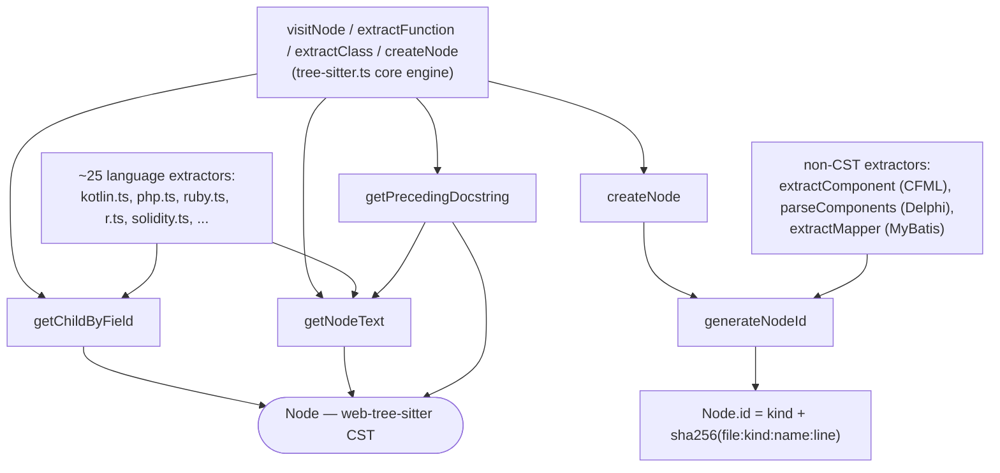

# The CST toolkit every extractor is built from

## Overview
`tree-sitter-helpers.ts` is 127 lines and four exported functions, but it is one of the
most-imported files in CodeGraph: every one of the ~25 tree-sitter-backed
per-language extractor modules, the core `TreeSitterExtractor` engine, and even
several *non*-tree-sitter extractors (CFML, Delphi DFM, Liquid, MyBatis) call into
it. The key design idea is a deliberate leaf module — it has zero dependencies on
the extraction machinery that depends on it, which is what lets a generic engine
and dozens of independent, grammar-specific plugins share one implementation of
"how do I turn a CST node into graph data" without any of them importing each
other. Two of the four functions are one-line wrappers over the tree-sitter API
([`getNodeText`](../catalog/src/extraction/tree-sitter-helpers.ts.md#getNodeText),
[`getChildByField`](../catalog/src/extraction/tree-sitter-helpers.ts.md#getChildByField));
the other two encode real, non-obvious logic —
[`generateNodeId`](../catalog/src/extraction/tree-sitter-helpers.ts.md#generateNodeId)
mints the identity every symbol in the graph is known by, and
[`getPrecedingDocstring`](../catalog/src/extraction/tree-sitter-helpers.ts.md#getPrecedingDocstring)
recovers author comments across wildly different comment and declaration syntaxes.

## Diagram

## Design rationale (why it's built this way)
The module's own header states its reason for existing in one sentence: "Extracted
to a leaf module to avoid circular imports between tree-sitter.ts and languages/."
`tree-sitter.ts` (the core engine) imports every per-language extractor via a
registry, and every per-language extractor needs the same node-navigation
primitives the engine uses — so if those primitives lived inside `tree-sitter.ts`
itself, the languages would have to import back from the file that imports them.
Pulling the shared primitives into a dependency-free leaf breaks that cycle.

[`generateNodeId`](../catalog/src/extraction/tree-sitter-helpers.ts.md#generateNodeId)'s
docstring gives the reasoning for its specific construction: a 32-character
(128-bit) SHA-256 hex digest of `filePath:kind:name:line`, "to avoid collisions
when indexing large codebases with many files containing similar symbols" — plain
name-based IDs would collide constantly across a multi-language monorepo where
many files define a method called, say, `handle` or `render`. The ID is *content-
derived* rather than an auto-increment counter or a random UUID: the same
declaration, unchanged, hashes to the same ID on every re-index, with no database
round-trip needed to look up "did I already assign this symbol an ID." That
determinism is the load-bearing property behind incremental re-indexing — a
symbol's identity survives across parses as long as its file, kind, name, and
declaration line don't move (see Edge cases for what happens when they do). The
result is also kind-prefixed (`` `${kind}:${hash}` ``), so a raw ID is
self-describing without a lookup.

[`getPrecedingDocstring`](../catalog/src/extraction/tree-sitter-helpers.ts.md#getPrecedingDocstring)'s
wrapper-climbing is the file's most intricate piece of logic, and the comment
explains exactly why it's needed: "Node types that *wrap* a declaration so a
leading comment is a sibling of the wrapper, not of the emitted (inner)
declaration node. CodeGraph emits the inner node, so before looking for its
preceding comment we climb out through these." Concretely: CodeGraph's graph
records a `function`-kind node for the arrow function in `const f = () => {}`,
but syntactically that arrow function's tree-sitter parent chain is
`variable_declarator → lexical_declaration`, and a doc comment above the whole
statement is a sibling of the *outer* `lexical_declaration`, not of the inner
function node. Without climbing past `DOCSTRING_WRAPPER_TYPES` (`export_statement`,
`decorated_definition`, `lexical_declaration`, `variable_declaration`,
`variable_declarator`, `ambient_declaration`) first, that comment would silently
never be found. This is issue #780 fixed as a generic tree-shape fix rather than
per-language special-casing — one climb-and-walk routine handles `export class X`
(TS), `@decorator\ndef f()` (Python), and `const f = () => {}` (TS) alike, because
each "wraps exactly one declaration, so climbing can't mis-attribute a comment to
a sibling."

A related private helper, `cleanCommentMarkers` (not itself part of this packet's
subgraph), strips the comment-syntax markers for roughly ten different comment
styles — C-family block/line and their doc variants, Rust/Swift/Kotlin triple-
slash, Python/Ruby/shell `#`, Lua long-bracket, Pascal brace/paren-star, Erlang
`%`/`%%`/`%%%` — in one place. Doing that normalization here, once, means the ~25
callers of `getPrecedingDocstring` all get back plain prose regardless of which
grammar they parsed, instead of each extractor re-implementing comment-marker
stripping for its own language.

## Entry points
- [`visitNode`](../catalog/src/extraction/tree-sitter.ts.md#TreeSitterExtractor.visitNode)
  — the per-node dispatch loop that walks every file's CST; it calls
  [`getChildByField`](../catalog/src/extraction/tree-sitter-helpers.ts.md#getChildByField)
  and [`getNodeText`](../catalog/src/extraction/tree-sitter-helpers.ts.md#getNodeText)
  directly (e.g. to read a C++ `namespace_definition`'s name field) and is the
  root from which every kind-specific `extract*` method below is reached.
- [`extractFunction`](../catalog/src/extraction/tree-sitter.ts.md#TreeSitterExtractor.extractFunction),
  [`extractClass`](../catalog/src/extraction/tree-sitter.ts.md#TreeSitterExtractor.extractClass),
  [`extractMethod`](../catalog/src/extraction/tree-sitter.ts.md#TreeSitterExtractor.extractMethod),
  [`extractVariable`](../catalog/src/extraction/tree-sitter.ts.md#TreeSitterExtractor.extractVariable),
  [`extractEnum`](../catalog/src/extraction/tree-sitter.ts.md#TreeSitterExtractor.extractEnum),
  and [`extractTypeAlias`](../catalog/src/extraction/tree-sitter.ts.md#TreeSitterExtractor.extractTypeAlias)
  — reached once per matching declaration found during the walk; each is where
  [`getPrecedingDocstring`](../catalog/src/extraction/tree-sitter-helpers.ts.md#getPrecedingDocstring)
  is invoked to attach the author's own comment to the emitted node.
- Every per-language extractor module (`kotlin.ts`, `php.ts`, `ruby.ts`, `r.ts`, `solidity.ts`,
  `objc.ts`, among many others) imports
  [`getChildByField`](../catalog/src/extraction/tree-sitter-helpers.ts.md#getChildByField) and
  [`getNodeText`](../catalog/src/extraction/tree-sitter-helpers.ts.md#getNodeText) directly for its own
  language-specific node-shape logic (e.g. Kotlin's positional return-type
  detection, PHP's static-include-path extraction) rather than going through the
  generic engine's walk — reached whenever a file of that language is parsed.
- Non-tree-sitter extractors —
  [`extractComponent`](../catalog/src/extraction/cfml-extractor.ts.md#CfmlExtractor.extractComponent)
  (CFML tags),
  [`parseComponents`](../catalog/src/extraction/dfm-extractor.ts.md#DfmExtractor.parseComponents)
  (Delphi form files),
  [`extractMapper`](../catalog/src/extraction/mybatis-extractor.ts.md#MyBatisExtractor.extractMapper)
  (MyBatis XML) — call
  [`generateNodeId`](../catalog/src/extraction/tree-sitter-helpers.ts.md#generateNodeId)
  directly, showing the ID scheme is the shared identity convention for the whole
  extraction subsystem, not only its tree-sitter-based half.

## Mechanism (step-by-step)
1. **The walk identifies a construct.** As
   [`visitNode`](../catalog/src/extraction/tree-sitter.ts.md#TreeSitterExtractor.visitNode)
   descends a file's CST, it (or a language's own `visitNode` hook inside modules
   like `kotlin.ts`)
   uses [`getChildByField`](../catalog/src/extraction/tree-sitter-helpers.ts.md#getChildByField)
   to pull out named children like a declaration's `name` or `body` field, and
   [`getNodeText`](../catalog/src/extraction/tree-sitter-helpers.ts.md#getNodeText)
   to turn a node's byte range into the literal source string once a field is
   found. Both are thin, null-safe wrappers, but they are the *only* seam every
   per-language module uses to touch node content — none of the ~25 language
   files reach past this module into raw tree-sitter node-walking APIs for that
   purpose.
2. **The engine mints an identity.** Once a handler like
   [`extractFunction`](../catalog/src/extraction/tree-sitter.ts.md#TreeSitterExtractor.extractFunction)
   or [`extractClass`](../catalog/src/extraction/tree-sitter.ts.md#TreeSitterExtractor.extractClass)
   decides a construct is real, `createNode` calls
   [`generateNodeId`](../catalog/src/extraction/tree-sitter-helpers.ts.md#generateNodeId),
   hashing `filePath:kind:name:line` with SHA-256, truncating to 32 hex characters,
   and prefixing with the kind — e.g. `function:9f2a...`. This is the one place a
   `Node.id` is computed anywhere in extraction.
3. **The handler separately recovers the doc comment.** In the same handlers,
   [`getPrecedingDocstring`](../catalog/src/extraction/tree-sitter-helpers.ts.md#getPrecedingDocstring)
   climbs past any wrapper ancestor, then walks backward through contiguous
   `comment`/`line_comment`/`block_comment`/`documentation_comment` siblings via
   [`<get>type`](../catalog/src/web-tree-sitter.d.ts.md#Node.-get-type), collecting
   and re-joining them with
   [`getNodeText`](../catalog/src/extraction/tree-sitter-helpers.ts.md#getNodeText)
   before stripping their comment-syntax markers. [`handleFunDecl`](../catalog/src/extraction/languages/erlang.ts.md#handleFunDecl)
   is one concrete non-`TreeSitterExtractor` caller — Erlang function declarations
   need the same recovery outside the generic class hierarchy.
4. **Non-CST formats reuse only the identity half.** Formats that never produce a
   `SyntaxNode` at all still need graph-consistent IDs:
   [`extractComponent`](../catalog/src/extraction/cfml-extractor.ts.md#CfmlExtractor.extractComponent)
   and [`extractFunctionTag`](../catalog/src/extraction/cfml-extractor.ts.md#CfmlExtractor.extractFunctionTag)
   (CFML tag parsing), [`parseComponents`](../catalog/src/extraction/dfm-extractor.ts.md#DfmExtractor.parseComponents)
   (Delphi's object/end blocks), and the Liquid extractor's
   [`extractSectionReferences`](../catalog/src/extraction/liquid-extractor.ts.md#LiquidExtractor.extractSectionReferences),
   [`extractSnippetReferences`](../catalog/src/extraction/liquid-extractor.ts.md#LiquidExtractor.extractSnippetReferences),
   [`extractAssignments`](../catalog/src/extraction/liquid-extractor.ts.md#LiquidExtractor.extractAssignments),
   and [`extractSchema`](../catalog/src/extraction/liquid-extractor.ts.md#LiquidExtractor.extractSchema)
   all call `generateNodeId` while building `Node` object literals by hand,
   bypassing `getChildByField`/`getNodeText`/`getPrecedingDocstring` entirely
   because there's no tree-sitter CST to walk.
5. **Text extraction underlies statement-level extraction too, not just names.**
   [`extractImport`](../catalog/src/extraction/tree-sitter.ts.md#TreeSitterExtractor.extractImport)
   and [`extractCall`](../catalog/src/extraction/tree-sitter.ts.md#TreeSitterExtractor.extractCall)
   both call [`getNodeText`](../catalog/src/extraction/tree-sitter-helpers.ts.md#getNodeText)
   to capture an entire import path or call expression's source text, not just an
   identifier — the same primitive serves single-token names and whole
   expressions alike because it is defined purely in terms of byte offsets, not
   node semantics.

## Key data structures
- **The generated ID string** — `` `${kind}:${hash}` `` where `hash` is
  `sha256(filePath:kind:name:line).slice(0, 32)`, produced only by
  [`generateNodeId`](../catalog/src/extraction/tree-sitter-helpers.ts.md#generateNodeId).
  This string, not an object, *is* the identity every `Edge.source`/`Edge.target`
  and every catalog cross-reference in this wiki points at.
- **`DOCSTRING_WRAPPER_TYPES`** — a fixed `Set` of six tree-sitter node-type
  strings (`export_statement`, `decorated_definition`, `lexical_declaration`,
  `variable_declaration`, `variable_declarator`, `ambient_declaration`) that
  [`getPrecedingDocstring`](../catalog/src/extraction/tree-sitter-helpers.ts.md#getPrecedingDocstring)
  climbs through. It is a closed, hand-maintained list — a grammar that wraps
  declarations in some other node type not on this list would silently lose
  leading docstrings for that construct.
- **[`Node`](../catalog/src/web-tree-sitter.d.ts.md#Node)** — the web-tree-sitter
  CST node type (distinct from CodeGraph's own graph `Node`) that all four
  helpers operate over; its `startIndex`/`endIndex`, `type`
  ([`<get>type`](../catalog/src/web-tree-sitter.d.ts.md#Node.-get-type)),
  `childForFieldName`, and `previousNamedSibling` are the entire tree-sitter
  surface this module depends on.

## Dynamics (design intent)
> [!inferred] All four exported functions are pure with respect to their
> arguments — none reads or writes module-level mutable state (the only
> module-level state, `DOCSTRING_WRAPPER_TYPES`, is a frozen constant `Set`).
> Nothing in this subgraph demonstrates it, but that purity is what would make
> these safe to call concurrently from parser worker threads without
> synchronization — relevant since CodeGraph runs heavy parsing off the main
> thread. Whether the worker pool actually calls this module directly from
> worker threads is outside this packet's subgraph.

The wide, flat "called by" fan-in on every helper (dozens of call sites for
[`getChildByField`](../catalog/src/extraction/tree-sitter-helpers.ts.md#getChildByField)
and [`getNodeText`](../catalog/src/extraction/tree-sitter-helpers.ts.md#getNodeText)
alone) reflects that there is no orchestration or sequencing *within* this file —
each call is independent and synchronous; all ordering (walk order, which
extractor runs on which node) is owned by the callers, not by this module.

## Edge cases
- **A comment separated from its declaration by another statement is never
  attributed.** [`getPrecedingDocstring`](../catalog/src/extraction/tree-sitter-helpers.ts.md#getPrecedingDocstring)'s
  backward walk stops at the first non-comment sibling, by design — this avoids
  mis-attributing a comment that belongs to something else, at the cost of
  missing a docstring separated from its declaration by a blank-line convention
  the walk doesn't special-case.
- **Block-comment marker stripping is asymmetric on purpose.** The paired
  delimiter (`/* ... */`, Lua's `--[[ ]]`, Pascal's `(* *)`/`{ }`) is stripped
  only when the comment *opens* with one, specifically so a line comment that
  happens to end with a character sequence resembling a closing delimiter is
  never truncated.
- **`generateNodeId` hashes the declaration's *line*, not just its name.** Two
  edits that don't touch a symbol at all — reformatting, or adding a line above
  it — shift its line number and therefore mint a new ID on re-index, even though
  nothing about the symbol changed. The Node/Edge model's own reconciliation
  logic already has to work around this by matching on `(filePath, kind, name)`
  rather than trusting `id` alone across re-indexes — see
  [types.ts](types.ts.md)'s Edge cases for how that plays out downstream. This
  file only enforces the format; it has no collision detection of its own, so two
  same-kind, same-name declarations that land on the exact same line (feasible in
  generated/minified sources) would silently collide.
- **`getChildByField` returning `null` is the common case, not an error** — its
  signature is `Node | null` because a grammar simply may not have the requested
  field on a given node type; every caller must treat "field absent" as
  routine, not exceptional.

## Open questions
- Does anything downstream tolerate the ID churn from `generateNodeId`'s
  line-sensitivity described above, or is `(filePath, kind, name)`-based matching
  the *only* mitigation? Not visible from this subgraph alone.
- `cleanCommentMarkers` (referenced by `getPrecedingDocstring` but not itself in
  this packet's subgraph) already handles marker styles — Erlang `%`, Pascal
  brace/paren-star, Lua long-bracket — for languages whose full extractors may or
  may not yet exist in this build. Whether that breadth was added ahead of
  those languages' extractors landing, or is maintained for some other reason,
  isn't answered here.

## See also
- [extraction-tree-sitter.ts](extraction-tree-sitter.ts.md) — the core
  `TreeSitterExtractor` engine that is this module's biggest single consumer
  (`createNode`, `visitNode`, and every `extract*` method).
- [extraction-tree-sitter-types.ts](extraction-tree-sitter-types.ts.md) — the
  `LanguageExtractor` plugin contract that every per-language module calling
  into this file implements.
- [types.ts](types.ts.md) — the `Node`/`Edge` graph model whose `id` field is
  literally `generateNodeId`'s output, including the fuller discussion of the
  line-shift identity edge case.
- [web-tree-sitter.d.ts](web-tree-sitter.d.ts.md) — the CST `Node` type
  declarations these helpers wrap.
