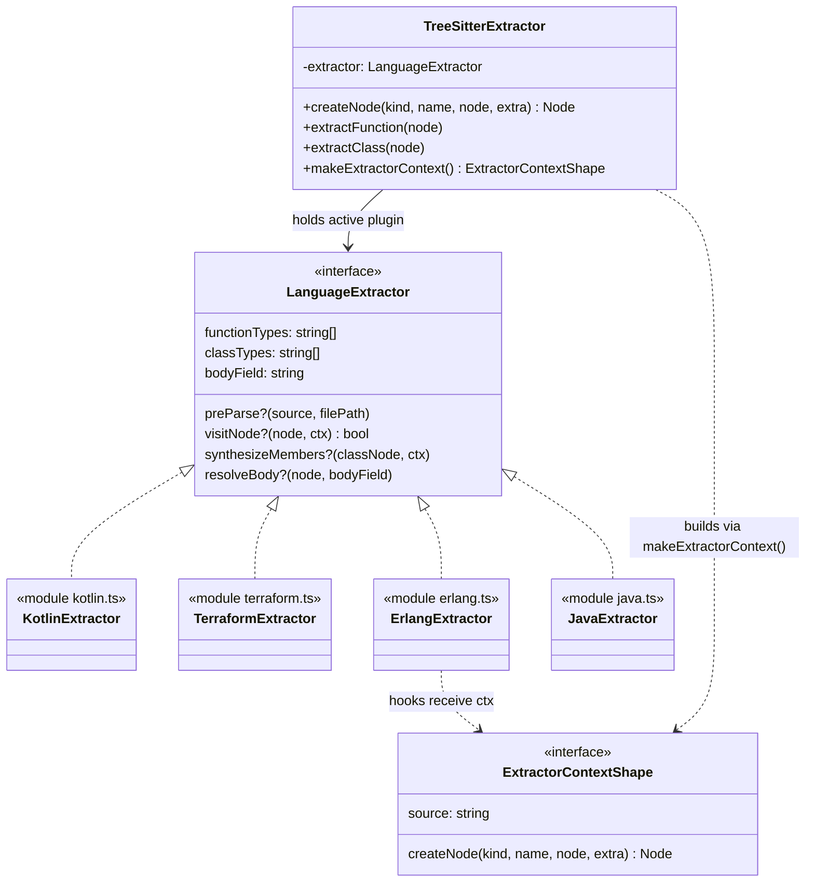

# The LanguageExtractor contract — codegraph's per-language plugin interface

## Overview

`tree-sitter-types.ts` defines the single interface that makes codegraph's extraction pipeline
pluggable across ~26 languages instead of one monolithic parser: [`LanguageExtractor`](../catalog/src/extraction/tree-sitter-types.ts.md#LanguageExtractor).
It is a hybrid contract — mostly declarative string-array tables that map a grammar's own node-type
vocabulary onto codegraph's normalized [`NodeKind`](../catalog/src/types.ts.md#NodeKind), plus roughly
twenty optional hook functions for the syntax a table can't describe. Every per-language module
(kotlin.ts, php.ts, cobol.ts, terraform.ts, …) implements this one interface and is looked up by
language from a registry ([`index.ts`](../catalog/src/extraction/languages/index.ts.md)); the core
engine ([`tree-sitter.ts`](../catalog/src/extraction/tree-sitter.ts.md)'s `TreeSitterExtractor`) never
branches on language name — it only ever calls through the interface. A second, narrower interface
declared in the same file — visible here through its [`source`](../catalog/src/extraction/tree-sitter-types.ts.md#ExtractorContext.source)
and [`createNode`](../catalog/src/extraction/tree-sitter-types.ts.md#ExtractorContext.createNode)
members — is the sandboxed callback surface (`ExtractorContext`) handed to hooks so language code
never touches the engine's private state directly.

## Diagram

## Design rationale (why it's built this way)

The file's own header states it was "Extracted to a leaf module to avoid circular imports": if
[`LanguageExtractor`](../catalog/src/extraction/tree-sitter-types.ts.md#LanguageExtractor) lived inside
`tree-sitter.ts` instead, every per-language module would have to import `tree-sitter.ts` just to get
the type — but `tree-sitter.ts` already imports every language module (through the
[`index.ts`](../catalog/src/extraction/languages/index.ts.md) registry), which would close the cycle.
Hoisting the shared contract to a dependency-free leaf (it only imports `web-tree-sitter`'s
[`Node`](../catalog/src/web-tree-sitter.d.ts.md#Node) and a few types from `../types`) breaks that.

The interface's shape is deliberately two-tier. Most fields — `functionTypes`, `classTypes`,
`bodyField` and its siblings — are plain string arrays: a declarative lookup table, cheap for a new
language to fill in and easy to reason about. But grammars diverge in ways no table can capture, so
roughly twenty fields are *optional hook functions* instead, each an escape hatch for one specific kind
of divergence rather than a general "do whatever you want" callback. `visitNode?` is documented as being
for languages "with fundamentally different AST structures" (the source calls out Pascal);
`synthesizeMembers?` is for members that exist at compile time but never appear in the AST at all (Java
Lombok, see Mechanism below); `resolveBody?` is for grammars where the body isn't even a child field
(Dart puts it as a sibling). Each hook was clearly added to solve one bug: comments on
[`LanguageExtractor`](../catalog/src/extraction/tree-sitter-types.ts.md#LanguageExtractor) cite specific
issue numbers (`#645`, `#808`, `#912`, `#1093`) next to the field they justify — this is
a contract that grew through real per-language failures, not one designed upfront.

> [!inferred] The `ExtractorContext` shape (its `createNode`/`source` members are cited above) exists so
> hook code — which lives in a different module per language and is written by many contributors — can
> only ever touch a narrow, controlled slice of `TreeSitterExtractor`'s internals. This is a plain
> reading of the interface's placement and member list; the packet doesn't cite an explicit "why not
> just pass `this`" comment.

## Entry points

- [`LanguageExtractor`](../catalog/src/extraction/tree-sitter-types.ts.md#LanguageExtractor) — the
  contract every language module's exported object literal is checked against at compile time. Control
  reaches a *specific* implementation at runtime through the
  [`index.ts`](../catalog/src/extraction/languages/index.ts.md) registry, which maps each supported
  `Language` to one `LanguageExtractor` value (`typescriptExtractor`, `phpExtractor`, `cobolExtractor`, …).
- [`createNode`](../catalog/src/extraction/tree-sitter-types.ts.md#ExtractorContext.createNode) (the
  `ExtractorContext` method) — the one function every language hook calls to turn a syntax node it has
  decided is meaningful into a graph [`Node`](../catalog/src/types.ts.md#Node). Every extractor module in
  the subgraph — [`kotlin.ts`](../catalog/src/extraction/languages/kotlin.ts.md),
  [`php.ts`](../catalog/src/extraction/languages/php.ts.md),
  [`cobol.ts`](../catalog/src/extraction/languages/cobol.ts.md), and the rest — reaches it.
- [`makeExtractorContext`](../catalog/src/extraction/tree-sitter.ts.md#TreeSitterExtractor.makeExtractorContext) —
  where `TreeSitterExtractor` builds the sandboxed context object right before invoking any hook that
  needs one; this is the seam between the engine's private state and the plugin's code.
- The generic per-kind dispatch methods —
  [`extractFunction`](../catalog/src/extraction/tree-sitter.ts.md#TreeSitterExtractor.extractFunction),
  [`extractClass`](../catalog/src/extraction/tree-sitter.ts.md#TreeSitterExtractor.extractClass),
  [`extractMethod`](../catalog/src/extraction/tree-sitter.ts.md#TreeSitterExtractor.extractMethod),
  [`extractInterface`](../catalog/src/extraction/tree-sitter.ts.md#TreeSitterExtractor.extractInterface),
  [`extractStruct`](../catalog/src/extraction/tree-sitter.ts.md#TreeSitterExtractor.extractStruct),
  [`extractEnum`](../catalog/src/extraction/tree-sitter.ts.md#TreeSitterExtractor.extractEnum), and
  [`extractTypeAlias`](../catalog/src/extraction/tree-sitter.ts.md#TreeSitterExtractor.extractTypeAlias) —
  are where control first consults the active `LanguageExtractor`'s type-arrays and hooks for a given
  AST node kind.

## Mechanism (step-by-step)

1. **Plugin selection.** [`index.ts`](../catalog/src/extraction/languages/index.ts.md) assembles the
   `EXTRACTORS` registry — a `Partial<Record<Language, LanguageExtractor>>` — from every language
   module's exported extractor value. A `TreeSitterExtractor` instance holds whichever one applies to
   the file it's currently processing in its private [`extractor`](../catalog/src/extraction/tree-sitter.ts.md#TreeSitterExtractor.extractor)
   property, so downstream code never re-checks "which language is this" — it just calls through
   whatever `this.extractor` currently is.

2. **Generic dispatch, table-driven.** For a node the engine recognizes as function/class/method/etc.
   shaped, kind-specific methods such as [`extractFunction`](../catalog/src/extraction/tree-sitter.ts.md#TreeSitterExtractor.extractFunction)
   and [`extractMethod`](../catalog/src/extraction/tree-sitter.ts.md#TreeSitterExtractor.extractMethod)
   consult the active extractor's field-name tables (e.g.
   [`bodyField`](../catalog/src/extraction/tree-sitter-types.ts.md#LanguageExtractor.bodyField)) to find
   the right child node, then call [`createNode`](../catalog/src/extraction/tree-sitter.ts.md#TreeSitterExtractor.createNode)
   to materialize the graph symbol. This path needs no per-language code at all — it's why languages
   like `csharp.ts` and `rust.ts` appear in this packet's subgraph referencing only
   `LanguageExtractor`/`Node`/`bodyField` and no hook function: their grammars map cleanly onto the
   generic vocabulary.

3. **The `visitNode?` escape hatch, for grammars that don't.** When a language's AST doesn't decompose
   into the generic function/class/method shape, `visitNode?` lets it take over entirely and return
   `true` to suppress default dispatch. Erlang's dispatcher-style handlers —
   [`handleFunDecl`](../catalog/src/extraction/languages/erlang.ts.md#handleFunDecl),
   [`handleRecordDecl`](../catalog/src/extraction/languages/erlang.ts.md#handleRecordDecl),
   [`handleBehaviour`](../catalog/src/extraction/languages/erlang.ts.md#handleBehaviour), and
   [`handleAppResourceTuple`](../catalog/src/extraction/languages/erlang.ts.md#handleAppResourceTuple) —
   each try to claim a node and report whether they handled it. Terraform's
   [`emitModuleWiring`](../catalog/src/extraction/languages/terraform.ts.md#emitModuleWiring),
   [`emitLocals`](../catalog/src/extraction/languages/terraform.ts.md#emitLocals),
   [`emitModuleProvidersRefs`](../catalog/src/extraction/languages/terraform.ts.md#emitModuleProvidersRefs),
   [`emitReferencesInBody`](../catalog/src/extraction/languages/terraform.ts.md#emitReferencesInBody), and
   [`emitProviderSelectionRef`](../catalog/src/extraction/languages/terraform.ts.md#emitProviderSelectionRef)
   synthesize edges out of HCL block shapes (module wiring, provider selection) that have no equivalent
   in the generic function/class model at all. COBOL's flat, division-based structure is walked
   recursively by [`walkDataEntries`](../catalog/src/extraction/languages/cobol.ts.md#walkDataEntries),
   [`walkProcedureChildren`](../catalog/src/extraction/languages/cobol.ts.md#walkProcedureChildren), and
   [`collectRefs`](../catalog/src/extraction/languages/cobol.ts.md#collectRefs). R goes further still —
   because R "has no declaration syntax" (every symbol arrives as an assignment expression), its
   [`extractClassMembers`](../catalog/src/extraction/languages/r.ts.md#extractClassMembers) reconstructs
   class-shaped structure entirely from call-expression conventions (`setClass`, `R6Class`, …).

4. **The `synthesizeMembers?` escape hatch, for symbols that never appear in the AST.** After a class's
   real members are extracted (with the class still on the scope stack), this hook lets a language
   invent additional nodes for compile-time-generated members. Java's
   [`synthesizeLombokMembers`](../catalog/src/extraction/languages/java.ts.md#synthesizeLombokMembers)
   is the one instance in this subgraph: it manufactures the `getX`/`setX`/`builder`/`equals` methods
   Lombok annotations generate at compile time, which would otherwise be invisible to any caller/impact
   analysis over that class.

5. **Sandbox construction and the actual node write.** [`makeExtractorContext`](../catalog/src/extraction/tree-sitter.ts.md#TreeSitterExtractor.makeExtractorContext)
   builds the `ExtractorContext` object every hook above receives, closing over the engine's private
   state so hooks only ever see [`createNode`](../catalog/src/extraction/tree-sitter-types.ts.md#ExtractorContext.createNode)
   and [`source`](../catalog/src/extraction/tree-sitter-types.ts.md#ExtractorContext.source) (plus a
   small set of other members outside this packet's subgraph) rather than the class itself. The engine's
   own [`createNode`](../catalog/src/extraction/tree-sitter.ts.md#TreeSitterExtractor.createNode) — the
   real implementation `ExtractorContext.createNode` ultimately reaches — is also where hook return
   values feed back into generic logic: it calls `this.extractor?.resolveBody?.(...)` to extend a
   node's line range when a grammar (Dart) puts the body as a sibling rather than a child, and merges
   `this.extractor?.extractModifiers?.(node)` into the node's decorators list.

## Key data structures

- [`LanguageExtractor`](../catalog/src/extraction/tree-sitter-types.ts.md#LanguageExtractor) — the
  contract itself: node-type-name tables, field-name tables, and ~20 optional hooks. One value of this
  shape exists per supported language.
- Two distinct, same-named `Node` types, both cited by every extractor module: the raw syntax tree node
  ([`Node`](../catalog/src/web-tree-sitter.d.ts.md#Node) from `web-tree-sitter`, what hooks receive as
  input) and the semantic graph symbol ([`Node`](../catalog/src/types.ts.md#Node) from `../types`, what
  [`createNode`](../catalog/src/extraction/tree-sitter-types.ts.md#ExtractorContext.createNode) produces).
- [`NodeKind`](../catalog/src/types.ts.md#NodeKind) — the finite, closed vocabulary
  (`'function' | 'class' | 'method' | ...`) that every `*Types` array and every `createNode` call is
  normalized against, regardless of what the underlying grammar calls its own nodes.
- [`extractor`](../catalog/src/extraction/tree-sitter.ts.md#TreeSitterExtractor.extractor) — the single
  per-instance slot on `TreeSitterExtractor` holding "whichever `LanguageExtractor` is active for the
  current file," `null` until one is set.

## Dynamics (design intent)

> [!inferred] Nothing in this packet's subgraph shows scheduling or concurrency directly, but the shape
> of the contract implies it: a `TreeSitterExtractor` instance owns one mutable
> [`extractor`](../catalog/src/extraction/tree-sitter.ts.md#TreeSitterExtractor.extractor) slot, so a
> single instance processes one file's tree at a time, single-threaded, with hook calls happening
> synchronously on that same call stack. Because the slot is per-instance rather than global/static,
> nothing here prevents multiple `TreeSitterExtractor` instances (e.g. one per worker) from running
> concurrently against different files — the contract itself carries no shared mutable state between
> instances.

## Edge cases

- **The `Node` name collision.** `Node` from `web-tree-sitter` (the raw CST node,
  [cited here](../catalog/src/web-tree-sitter.d.ts.md#Node)) and `Node` from `../types` (the semantic
  graph symbol, [cited here](../catalog/src/types.ts.md#Node)) are two unrelated types sharing one name.
  Extractor source files disambiguate by importing the tree-sitter one as `SyntaxNode`, but
  `tree-sitter-types.ts` itself and `web-tree-sitter.d.ts` both use the bare name — a reader has to track
  which `import` a given `Node` came from.
- **`createNode` can return `null`.** [`createNode`](../catalog/src/extraction/tree-sitter.ts.md#TreeSitterExtractor.createNode)
  deliberately returns `null` for a node with an empty/missing name instead of creating a degenerate
  symbol, specifically to avoid foreign-key violations from edges that would reference it — every hook
  that calls it must handle a `null` result, not just a `Node`.
- **A `bodyField` name alone doesn't locate the body.** [`bodyField`](../catalog/src/extraction/tree-sitter-types.ts.md#LanguageExtractor.bodyField)
  is a single declared field name, but `TreeSitterExtractor`'s
  [`createNode`](../catalog/src/extraction/tree-sitter.ts.md#TreeSitterExtractor.createNode) still needs
  the separate `resolveBody?` hook for grammars (Dart) where the body isn't that field's child at all —
  the declarative table and the hook layer aren't fully independent; some languages need both.
- **A `visitNode?` hook that returns `true` incorrectly silently drops extraction.** Because `true` means
  "fully handled, skip default dispatch," a language hook with a bug in its own claiming logic
  (over-claiming a node type) suppresses the generic
  [`extractFunction`](../catalog/src/extraction/tree-sitter.ts.md#TreeSitterExtractor.extractFunction)/[`extractClass`](../catalog/src/extraction/tree-sitter.ts.md#TreeSitterExtractor.extractClass)
  path for that node with no error — the failure mode is a silently missing symbol, not a crash.

## Open questions

- The runtime assignment from a detected `Language` to a concrete [`LanguageExtractor`](../catalog/src/extraction/tree-sitter-types.ts.md#LanguageExtractor)
  value (reading the [`index.ts`](../catalog/src/extraction/languages/index.ts.md) `EXTRACTORS` map and
  setting [`extractor`](../catalog/src/extraction/tree-sitter.ts.md#TreeSitterExtractor.extractor)) isn't
  itself a symbol in this packet's subgraph, so the exact call site of that lookup is outside what this
  page can ground.
- This file also declares `ImportInfo` and `VariableInfo` — return shapes for the `extractImport?` and
  `extractVariables?` hooks — but neither appears in this packet's subgraph, so their role in the
  extraction↔resolution handoff isn't covered here; see `resolution-types.ts.md` for the resolution side
  of that contract.
- Several extractor modules in the subgraph (`rust.ts`, `csharp.ts`, `typescript.ts`, `swift.ts`,
  `go.ts`) reference only `LanguageExtractor`/`Node`/`bodyField` with no hook function cited — it's
  unclear from this packet alone whether that means those languages truly use zero hooks, or whether
  their hooks simply fell outside this packet's seed walk.

## See also

- [extraction-tree-sitter.ts.md](extraction-tree-sitter.ts.md) — `TreeSitterExtractor`, the engine that
  consumes this contract generically and owns the real `createNode`/`extractFunction`/etc. implementations.
- [extraction-tree-sitter-helpers.ts.md](extraction-tree-sitter-helpers.ts.md) — the shared CST-walking
  helpers (`getNodeText`, `getChildByField`) every per-language module built against this interface calls
  internally.
- [types.ts.md](types.ts.md) — the `Node`/`NodeKind`/`Edge` data model this interface's hooks and
  type-arrays are normalized against.
- [resolution-types.ts.md](resolution-types.ts.md) — the resolution-side contract
  (`ResolutionContext`/`UnresolvedRef`) that picks up where this extraction-side contract leaves off.
