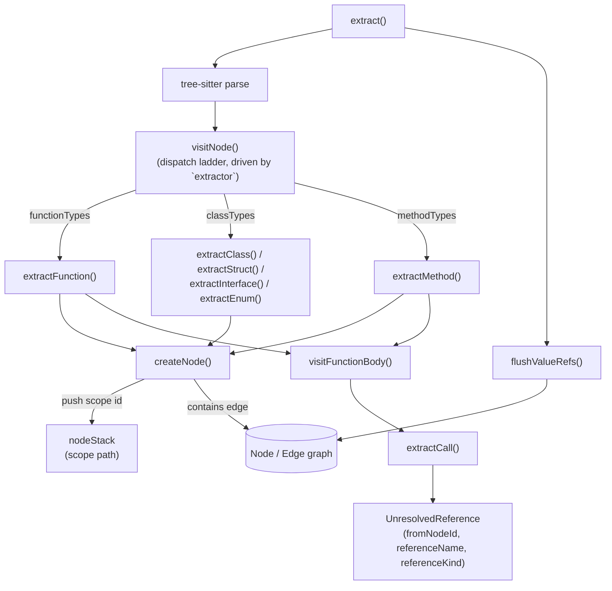

# TreeSitterExtractor — one generic walker, N language tables

## Overview
`TreeSitterExtractor` is the single class that turns one file's tree-sitter parse
tree into codegraph's universal symbol graph. The design choice that shapes the
entire 6000+ line file: there is **one** generic AST walker, not one extractor
per language. Every `extract*` method (function, class, method, interface,
struct, enum…) shares the same skeleton — read a `LanguageExtractor` config
table to learn what "a function" or "a call" looks like *in this grammar*, mint
a node, push it onto a scope stack, recurse — so language knowledge lives in
data (node-type sets, field names, optional hook functions), not in duplicated
control flow. The other defining trait: extraction never resolves anything
across scopes. A call, import, or `extends` whose target isn't locally obvious
becomes an `UnresolvedReference` — a name plus a location — queued for a
separate resolution phase this packet doesn't cover; this file's whole
contract is "syntax in, nodes + a list of still-unresolved names out."

## Diagram

## Design rationale (why it's built this way)
- **Data over duplication.** Every declaration extractor —
  [`extractFunction`](../catalog/src/extraction/tree-sitter.ts.md#TreeSitterExtractor.extractFunction),
  [`extractClass`](../catalog/src/extraction/tree-sitter.ts.md#TreeSitterExtractor.extractClass),
  [`extractMethod`](../catalog/src/extraction/tree-sitter.ts.md#TreeSitterExtractor.extractMethod),
  [`extractInterface`](../catalog/src/extraction/tree-sitter.ts.md#TreeSitterExtractor.extractInterface),
  [`extractStruct`](../catalog/src/extraction/tree-sitter.ts.md#TreeSitterExtractor.extractStruct),
  [`extractEnum`](../catalog/src/extraction/tree-sitter.ts.md#TreeSitterExtractor.extractEnum) —
  follows the identical shape: guard on
  [`extractor`](../catalog/src/extraction/tree-sitter.ts.md#TreeSitterExtractor.extractor)
  being set, resolve the name/body through the
  [`LanguageExtractor`](../catalog/src/extraction/tree-sitter-types.ts.md#LanguageExtractor)
  table's field names (its
  [`bodyField`](../catalog/src/extraction/tree-sitter-types.ts.md#LanguageExtractor.bodyField)
  is one such field), call
  [`createNode`](../catalog/src/extraction/tree-sitter.ts.md#TreeSitterExtractor.createNode),
  push/pop the scope. Supporting ~30 languages this way means adding a
  language is (mostly) filling in a config object, not writing a new visitor.
- **Escape hatch before ladder.**
  [`visitNode`](../catalog/src/extraction/tree-sitter.ts.md#TreeSitterExtractor.visitNode)
  gives the language's own custom hook first refusal before running the
  generic dispatch ladder — a grammar too irregular for the table model
  (Scala's `val`/`var`-as-callback-registration, or Pascal, handled by a
  dedicated
  [`visitPascalNode`](../catalog/src/extraction/tree-sitter.ts.md#TreeSitterExtractor.visitPascalNode)
  dispatcher) can opt an entire subtree out of the shared walker rather than
  forcing every language into one grammar shape.
- **Resolution is deliberately deferred, not attempted here.** Every call site,
  import, and inheritance edge whose target requires cross-file or cross-scope
  knowledge is recorded as a
  [`fromNodeId`](../catalog/src/types.ts.md#UnresolvedReference.fromNodeId) +
  [`referenceName`](../catalog/src/types.ts.md#UnresolvedReference.referenceName) +
  [`referenceKind`](../catalog/src/types.ts.md#UnresolvedReference.referenceKind)
  triple rather than an `Edge`, because at this point in the pipeline the
  extractor has only seen one file — it cannot know whether `Foo` resolves to
  a local class or an imported one. This is why
  [`extractCall`](../catalog/src/extraction/tree-sitter.ts.md#TreeSitterExtractor.extractCall),
  [`extractImport`](../catalog/src/extraction/tree-sitter.ts.md#TreeSitterExtractor.extractImport),
  [`extractDecoratorsFor`](../catalog/src/extraction/tree-sitter.ts.md#TreeSitterExtractor.extractDecoratorsFor),
  [`extractAnonymousClass`](../catalog/src/extraction/tree-sitter.ts.md#TreeSitterExtractor.extractAnonymousClass),
  and
  [`extractRustImplItem`](../catalog/src/extraction/tree-sitter.ts.md#TreeSitterExtractor.extractRustImplItem)
  read as "figure out a plausible name string," not "produce an edge."
- **The edge *kind* is chosen at the syntax level when the syntax already tells
  you the semantics.**
  [`extractDecoratorsFor`](../catalog/src/extraction/tree-sitter.ts.md#TreeSitterExtractor.extractDecoratorsFor)
  special-cases Solidity's `modifier_invocation` to emit a `calls` reference
  kind instead of `decorates`, because a Solidity modifier literally splices
  code around the function body at its `_;` marker — treating it as a
  decoration rather than a call would sever a real control-flow hop
  (`withdraw → onlyOwner → _checkRole`) from any later flow trace.
- **The scope stack does double duty.**
  [`nodeStack`](../catalog/src/extraction/tree-sitter.ts.md#TreeSitterExtractor.nodeStack)
  is simultaneously "the containment chain used to emit `contains` edges" and
  "the path joined into every node's
  [`qualifiedName`](../catalog/src/types.ts.md#Node.qualifiedName)" — one
  piece of mutable state serving two purposes that would otherwise need to be
  kept in sync by hand.

## Entry points
- [`extract`](../catalog/src/extraction/tree-sitter.ts.md#TreeSitterExtractor.extract) —
  the class's only public method. Something upstream (one file per call)
  invokes it once per source file; it drives the parse, the whole recursive
  walk, and the end-of-file cleanup passes, returning nodes, edges, errors,
  and unresolved references together as one `ExtractionResult`.
- [`makeExtractorContext`](../catalog/src/extraction/tree-sitter.ts.md#TreeSitterExtractor.makeExtractorContext) —
  the boundary object handed to a
  [`LanguageExtractor`](../catalog/src/extraction/tree-sitter-types.ts.md#LanguageExtractor)'s
  own hooks (its custom `visitNode` override, its member-synthesis hook)
  whenever generic dispatch defers to language-specific plugin code. Control
  re-enters the generic engine only through this object's closures
  (`createNode`, `visitNode`, `pushScope`/`popScope`), so a language plugin
  can mint real graph nodes and recurse without holding a reference to the
  extractor instance itself.

## Mechanism (step-by-step)
1. **Parse, then hand off to the walker.**
   [`extract`](../catalog/src/extraction/tree-sitter.ts.md#TreeSitterExtractor.extract)
   parses the file's text with tree-sitter, synthesizes a `file`-kind root
   node, pushes it, and calls
   [`visitNode`](../catalog/src/extraction/tree-sitter.ts.md#TreeSitterExtractor.visitNode)
   on the tree's root — everything else in this file happens underneath that
   one call.
2. **The dispatch ladder is a lookup against the language's own vocabulary,
   not a hard-coded grammar.** For each AST node,
   [`visitNode`](../catalog/src/extraction/tree-sitter.ts.md#TreeSitterExtractor.visitNode)
   checks the node's syntactic type against the sets on
   [`extractor`](../catalog/src/extraction/tree-sitter.ts.md#TreeSitterExtractor.extractor)
   (a
   [`LanguageExtractor`](../catalog/src/extraction/tree-sitter-types.ts.md#LanguageExtractor)):
   is this type in `functionTypes`? `classTypes`? `methodTypes`? The same 900
   lines of dispatch logic serve TypeScript, Rust, Python, and two dozen
   others because "what counts as a class" is a value in a table, not a
   `case 'class_declaration':` branch.
3. **Every emitted symbol is minted through one chokepoint.**
   [`createNode`](../catalog/src/extraction/tree-sitter.ts.md#TreeSitterExtractor.createNode)
   refuses to mint a node for an empty name (returning `null` — a guard every
   caller must check, since a phantom node would break foreign-key edges),
   computes the node's
   [`qualifiedName`](../catalog/src/types.ts.md#Node.qualifiedName) by
   joining the current
   [`nodeStack`](../catalog/src/extraction/tree-sitter.ts.md#TreeSitterExtractor.nodeStack),
   and — for grammars where the body sits outside the declaration's own
   source range (Dart) — widens
   [`endLine`](../catalog/src/types.ts.md#Node.endLine) past the node's own
   end so the node spans its real body. It is the one place a `contains` edge
   from the current scope is emitted, so no `extract*` method has to remember
   to do that itself.
4. **Declarations push a scope and recurse into their own body.** After
   [`createNode`](../catalog/src/extraction/tree-sitter.ts.md#TreeSitterExtractor.createNode)
   succeeds,
   [`extractFunction`](../catalog/src/extraction/tree-sitter.ts.md#TreeSitterExtractor.extractFunction),
   [`extractMethod`](../catalog/src/extraction/tree-sitter.ts.md#TreeSitterExtractor.extractMethod),
   [`extractClass`](../catalog/src/extraction/tree-sitter.ts.md#TreeSitterExtractor.extractClass),
   [`extractInterface`](../catalog/src/extraction/tree-sitter.ts.md#TreeSitterExtractor.extractInterface),
   [`extractStruct`](../catalog/src/extraction/tree-sitter.ts.md#TreeSitterExtractor.extractStruct),
   and
   [`extractEnum`](../catalog/src/extraction/tree-sitter.ts.md#TreeSitterExtractor.extractEnum)
   all push the new node's id onto
   [`nodeStack`](../catalog/src/extraction/tree-sitter.ts.md#TreeSitterExtractor.nodeStack)
   and walk the body — functions/methods hand their body to
   [`visitFunctionBody`](../catalog/src/extraction/tree-sitter.ts.md#TreeSitterExtractor.visitFunctionBody),
   while classes/interfaces/structs/enums re-enter
   [`visitNode`](../catalog/src/extraction/tree-sitter.ts.md#TreeSitterExtractor.visitNode)
   on each child so nested declarations go through the same ladder again.
5. **Function bodies are walked by a different, narrower pass focused on
   calls.**
   [`visitFunctionBody`](../catalog/src/extraction/tree-sitter.ts.md#TreeSitterExtractor.visitFunctionBody)
   doesn't care about declaration boundaries — it looks for call/instantiation
   shapes and hands them to
   [`extractCall`](../catalog/src/extraction/tree-sitter.ts.md#TreeSitterExtractor.extractCall),
   which resolves a callee name and appends a
   [`referenceName`](../catalog/src/types.ts.md#UnresolvedReference.referenceName) +
   [`referenceKind`](../catalog/src/types.ts.md#UnresolvedReference.referenceKind) +
   [`line`](../catalog/src/types.ts.md#UnresolvedReference.line) +
   [`column`](../catalog/src/types.ts.md#UnresolvedReference.column), tagged
   with the current
   [`fromNodeId`](../catalog/src/types.ts.md#UnresolvedReference.fromNodeId) —
   nothing here becomes a real `Edge` yet.
6. **A handful of syntactic shapes get bespoke handling because the generic
   ladder can't express them.**
   [`extractImport`](../catalog/src/extraction/tree-sitter.ts.md#TreeSitterExtractor.extractImport)
   tries a language hook first and falls back to per-language multi-binding
   logic for `import a, b` shapes a single-return hook can't express;
   [`extractTypeAlias`](../catalog/src/extraction/tree-sitter.ts.md#TreeSitterExtractor.extractTypeAlias)
   re-classifies `type X = …` into a struct or enum when the aliased type is
   actually one (Go's `type Foo struct {...}`);
   [`extractVariable`](../catalog/src/extraction/tree-sitter.ts.md#TreeSitterExtractor.extractVariable)
   reclassifies an arrow-valued `const` as a function and a HOC-wrapped
   `const` as a component rather than a plain value;
   [`extractAnonymousClass`](../catalog/src/extraction/tree-sitter.ts.md#TreeSitterExtractor.extractAnonymousClass)
   handles Java/C#'s `new T() { ...overrides }`; and
   [`extractRustImplItem`](../catalog/src/extraction/tree-sitter.ts.md#TreeSitterExtractor.extractRustImplItem)
   recovers `impl Trait for Type` by position-matching type identifiers, since
   tree-sitter carries no type information to check against.
7. **A same-file value-reference pass runs only after the whole file has been
   walked.**
   [`flushValueRefs`](../catalog/src/extraction/tree-sitter.ts.md#TreeSitterExtractor.flushValueRefs)
   is called at the end of
   [`extract`](../catalog/src/extraction/tree-sitter.ts.md#TreeSitterExtractor.extract),
   after every declaration and its file-scope constants are known, and — unlike
   everything upstream — emits real `Edge` objects directly (
   [`source`](../catalog/src/types.ts.md#Edge.source),
   [`target`](../catalog/src/types.ts.md#Edge.target),
   [`kind`](../catalog/src/types.ts.md#Edge.kind) `'references'`) rather than
   queuing an `UnresolvedReference`, because same-file name matching needs no
   cross-file resolution step.

## Key data structures
- [`Node`](../catalog/src/types.ts.md#Node) / [`Edge`](../catalog/src/types.ts.md#Edge) —
  the two output shapes. A `Node` carries
  [`id`](../catalog/src/types.ts.md#Node.id) (a hash of path + qualified
  name),
  [`kind`](../catalog/src/types.ts.md#Node.kind) (a
  [`NodeKind`](../catalog/src/types.ts.md#NodeKind)),
  [`name`](../catalog/src/types.ts.md#Node.name),
  [`qualifiedName`](../catalog/src/types.ts.md#Node.qualifiedName),
  [`filePath`](../catalog/src/types.ts.md#Node.filePath),
  [`language`](../catalog/src/types.ts.md#Node.language) (a
  [`Language`](../catalog/src/types.ts.md#Language)), position fields
  ([`startLine`](../catalog/src/types.ts.md#Node.startLine),
  [`endLine`](../catalog/src/types.ts.md#Node.endLine),
  [`startColumn`](../catalog/src/types.ts.md#Node.startColumn),
  [`endColumn`](../catalog/src/types.ts.md#Node.endColumn)), and
  [`updatedAt`](../catalog/src/types.ts.md#Node.updatedAt).
- The `UnresolvedReference` queue — every not-yet-resolved reference is a
  [`fromNodeId`](../catalog/src/types.ts.md#UnresolvedReference.fromNodeId) +
  [`referenceName`](../catalog/src/types.ts.md#UnresolvedReference.referenceName) +
  [`referenceKind`](../catalog/src/types.ts.md#UnresolvedReference.referenceKind) +
  [`line`](../catalog/src/types.ts.md#UnresolvedReference.line) +
  [`column`](../catalog/src/types.ts.md#UnresolvedReference.column) tuple —
  this file's entire output for anything it can't resolve locally.
- [`nodeStack`](../catalog/src/extraction/tree-sitter.ts.md#TreeSitterExtractor.nodeStack) —
  a plain array of node ids acting as the current containment/scope path; read
  by [`createNode`](../catalog/src/extraction/tree-sitter.ts.md#TreeSitterExtractor.createNode)
  for both the `contains` edge and the qualified-name join.
- [`LanguageExtractor`](../catalog/src/extraction/tree-sitter-types.ts.md#LanguageExtractor) —
  the per-language config/hook object: node-type sets
  (`functionTypes`/`classTypes`/`methodTypes`/…), field names like
  [`bodyField`](../catalog/src/extraction/tree-sitter-types.ts.md#LanguageExtractor.bodyField),
  and optional hooks (`resolveBody`, `getReceiverType`, `classifyClassNode`,
  `preParse`, …) for the shapes that don't fit the generic table. One instance
  per language, looked up once and cached as
  [`extractor`](../catalog/src/extraction/tree-sitter.ts.md#TreeSitterExtractor.extractor).
- [`source`](../catalog/src/extraction/tree-sitter.ts.md#TreeSitterExtractor.source) —
  the file's full text, held on the extractor instance so
  [`getNodeText`](../catalog/src/extraction/tree-sitter-helpers.ts.md#getNodeText)
  can slice out any node's text by byte offset; may be reassigned mid-`extract`
  by a `preParse` transform.

## Dynamics (design intent)
- The two end-of-file passes —
  [`flushValueRefs`](../catalog/src/extraction/tree-sitter.ts.md#TreeSitterExtractor.flushValueRefs)
  and the function-as-value flush both called from
  [`extract`](../catalog/src/extraction/tree-sitter.ts.md#TreeSitterExtractor.extract)
  — deliberately run only after the entire recursive walk over the file
  finishes, because they need to see the complete set of file-scope
  declarations before they can tell a genuine reference from a shadowed one.
- Scope-stack discipline is manual and unchecked by the type system: every
  `extract*` method that pushes an id onto
  [`nodeStack`](../catalog/src/extraction/tree-sitter.ts.md#TreeSitterExtractor.nodeStack)
  is responsible for popping it on every exit path, including early returns —
  [`createNode`](../catalog/src/extraction/tree-sitter.ts.md#TreeSitterExtractor.createNode)'s
  own null-on-empty-name guard exists partly so callers can bail out *before*
  pushing rather than having to pop a scope they never entered.

> [!inferred] The walk is a plain synchronous, single-threaded recursive
> descent over one file — nothing in this file spawns workers or awaits
> anything. (Parallelism across *files* is handled by a different module, not
> in this packet.) The packet's Evidence section reports no tests reference
> this subgraph, so this is read from source structure only, not observed
> execution.

## Edge cases
- [`createNode`](../catalog/src/extraction/tree-sitter.ts.md#TreeSitterExtractor.createNode)
  returns `null` for an empty/missing name instead of minting a placeholder —
  every one of its callers must null-check the result before using it.
- An anonymous function wrapper (an IIFE, an AMD `define([], function(){…})`)
  gets no node of its own, but
  [`extractFunction`](../catalog/src/extraction/tree-sitter.ts.md#TreeSitterExtractor.extractFunction)
  still walks its body — otherwise every named function and call nested inside
  the wrapper would be silently lost.
- Bodyless forward declarations (`class Foo;`) are skipped only for languages
  that opt in via a flag on
  [`extractor`](../catalog/src/extraction/tree-sitter.ts.md#TreeSitterExtractor.extractor),
  since some grammars (Kotlin, Scala) treat a bodiless class as a complete
  definition; [`extractStruct`](../catalog/src/extraction/tree-sitter.ts.md#TreeSitterExtractor.extractStruct)
  carries its own exception for C#'s bodiless positional records.
- When a language's custom hook inside
  [`visitNode`](../catalog/src/extraction/tree-sitter.ts.md#TreeSitterExtractor.visitNode)
  reports it handled a subtree, the generic ladder (functionTypes/classTypes/…)
  never sees any node inside that subtree at all — extraction for that region
  is entirely delegated to the language plugin.
- [`extractAnonymousClass`](../catalog/src/extraction/tree-sitter.ts.md#TreeSitterExtractor.extractAnonymousClass)
  always emits an `extends` reference for the anonymous class's supertype
  because tree-sitter's syntax alone can't distinguish "extends a class" from
  "implements an interface" — the distinction is left for a resolution phase
  outside this packet to sort out.

## Open questions
- This packet's subgraph stops at the boundary of `UnresolvedReference` —
  exactly how `referenceName`/`referenceKind` get matched to a concrete
  `Node.id` (import resolution, name matching, framework heuristics) lives in
  a different module not covered here.
- Several comments in the source reference a "Phase 5.5" interface-impl
  bridge and a "function-as-value capture (#756)" mechanism
  (`scanFnRefSubtree`, `maybeCaptureFnRefs`) that clearly interact with
  [`visitNode`](../catalog/src/extraction/tree-sitter.ts.md#TreeSitterExtractor.visitNode),
  but neither is a symbol in this packet's subgraph, so their exact mechanics
  can't be grounded from here.
- No tests in the configured test paths reference this subgraph (per the
  packet's Evidence section), so none of the behavior above has a test-backed
  example to point to — it is read directly from source.

## See also
- [LanguageExtractor: the per-language plugin contract](extraction-tree-sitter-types.ts.md)
- [Node/Edge/Language: the core graph data model](types.ts.md)
- [ResolutionContext/UnresolvedRef: the extraction↔resolution contract](resolution-types.ts.md)
- [Extraction pipeline orchestration](extraction-index.ts.md)
