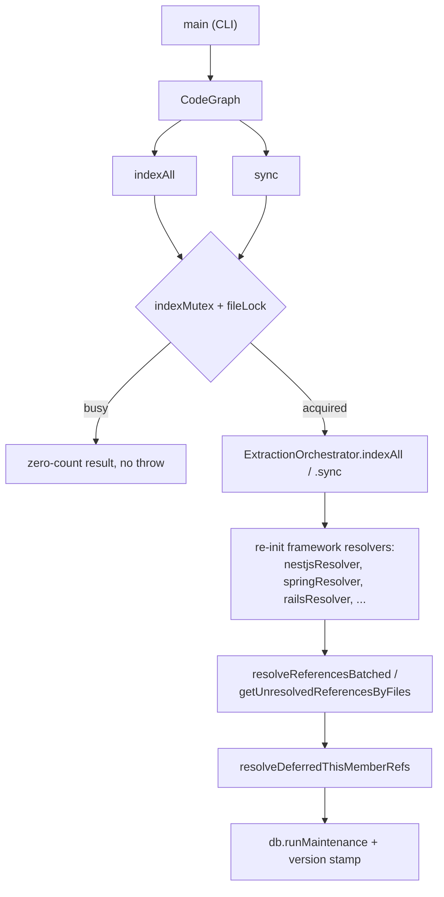
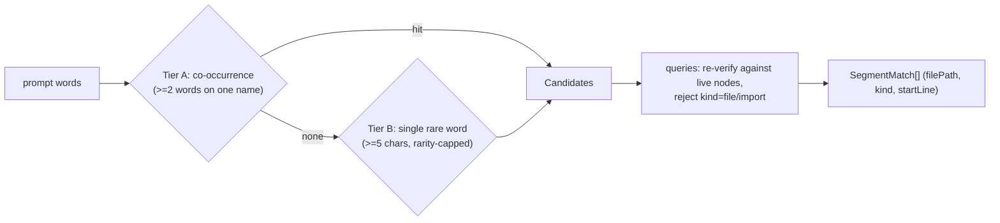

# The CodeGraph orchestration facade

## Overview
`index.ts` is codegraph's public library entry point, and its defining property is that it
contains almost no domain logic of its own. The [`CodeGraph`](../catalog/src/index.ts.md#CodeGraph)
class wires together extraction, resolution, storage, graph traversal, and context-building
into one facade, and the vast majority of its public methods are one-line passthroughs to
whichever subsystem actually owns the answer. What `index.ts` *does* own is sequencing and
safety: the exact order extraction → framework detection → reference resolution → dependent
second passes → maintenance must run in, and the locking that keeps two processes (a CLI
invocation, an MCP daemon, a git hook) from corrupting the same on-disk graph at once. Its two
headline methods, [`indexAll`](../catalog/src/index.ts.md#CodeGraph.indexAll) and
[`sync`](../catalog/src/index.ts.md#CodeGraph.sync), are the same pipeline shape run at two
different scopes — full rebuild versus filesystem-driven incremental reconcile — which makes
this file the right place to build a mental model of what "running an index" actually does,
end to end.

## Diagram

A second, distinct mechanism lives in the same file but outside this pipeline entirely —
[`getSegmentMatches`](../catalog/src/index.ts.md#CodeGraph.getSegmentMatches), codegraph's
non-embedding answer to "which symbols does this prompt refer to":

## Design rationale (why it's built this way)
The two-tier locking that opens both [`indexAll`](../catalog/src/index.ts.md#CodeGraph.indexAll)
and [`sync`](../catalog/src/index.ts.md#CodeGraph.sync) — an in-process `indexMutex` plus a
cross-process `fileLock` — exists because a single `.codegraph/` project is not guaranteed to
have only one writer: the CLI, an MCP server/daemon, and a git hook can all open the same
project independently. Rather than letting a busy lock throw, both methods return their own
result type populated with all-zero counts and a `durationMs` of `0`. That is a deliberate
"success-shaped" degrade — the codebase's broader convention (documented at the repo level) is
that recoverable conditions should never look like a hard failure to a caller.

`sync`'s incremental-reconcile design deliberately distrusts git as the source of truth. The
method's own comment is explicit: "The source of truth for 'what changed' is the filesystem vs
the indexed state — never git," because `git status` reports nothing dirty right after a `git
pull`/`checkout`/`merge`/`rebase` even though the working tree's *content* changed — exactly the
case an incremental indexer must not silently miss.

Framework re-detection is deliberately re-run after extraction rather than decided once at
construction time. Resolvers like [`nestjsResolver`](../catalog/src/resolution/frameworks/nestjs.ts.md#nestjsResolver),
[`springResolver`](../catalog/src/resolution/frameworks/java.ts.md#springResolver),
[`railsResolver`](../catalog/src/resolution/frameworks/ruby.ts.md#railsResolver),
[`aspnetResolver`](../catalog/src/resolution/frameworks/csharp.ts.md#aspnetResolver),
[`rustResolver`](../catalog/src/resolution/frameworks/rust.ts.md#rustResolver), and
[`expressResolver`](../catalog/src/resolution/frameworks/express.ts.md#expressResolver) are
constructed before any file exists in a brand-new project, and several of their `detect()`
implementations work by scanning the now-indexed file list for framework-specific
imports/files — so a naive one-shot detection at construction time would silently and
permanently miss every framework on that project's very first index.

Resolution has an intentional two-pass shape, not a single flat pass: the main batched pass
builds `implements`/`extends` edges, and only afterward can
[`resolveDeferredThisMemberRefs`](../catalog/src/resolution/index.ts.md#ReferenceResolver.resolveDeferredThisMemberRefs)
walk those edges to resolve a `this.<member>` reference whose member lives on a supertype.
Running it earlier would find nothing to walk.

[`getSegmentMatches`](../catalog/src/index.ts.md#CodeGraph.getSegmentMatches) is codegraph's
alternative to embeddings-based semantic retrieval — worth flagging for a cross-tool
comparison. Instead of a vector index, it splits identifiers into segments, matches prompt
words against a segment vocabulary with two confidence tiers, and then re-verifies every
candidate against live [`queries`](../catalog/src/index.ts.md#CodeGraph.queries) state,
explicitly excluding nodes whose only representative is `kind` `file`/`import`, "since
surfacing the import statement instead reads as a matched symbol but isn't one." The whole
mechanism is graph-derived statistics over the same SQLite store `indexAll`/`sync` populate,
not a second, separately-maintained index.

> [!inferred] The resolution phase this file triggers is also where dynamic-dispatch
> synthesizers such as [`synthesizeCallbackEdges`](../catalog/src/resolution/callback-synthesizer.ts.md#synthesizeCallbackEdges)
> and [`cFnPointerDispatchEdges`](../catalog/src/resolution/c-fnptr-synthesizer.ts.md#cFnPointerDispatchEdges)
> run, bridging patterns static parsing can't see (event/observer callbacks, C function
> pointers) into ordinary graph edges. Neither is called directly from any method in this
> subgraph, so their exact wiring point is outside what this file's code shows.

## Entry points
- [`open`](../catalog/src/index.ts.md#CodeGraph.open) — the read-path entry to an already
  initialized project: validates the `.codegraph/` directory, opens the database, and
  optionally calls [`sync`](../catalog/src/index.ts.md#CodeGraph.sync) when `options.sync` is
  set, so "give me the graph" and "make sure it's fresh first" are the same call site.
- [`indexAll`](../catalog/src/index.ts.md#CodeGraph.indexAll) — the full (re)index entry
  point, reached from the CLI's index command (via [`main`](../catalog/src/bin/codegraph.ts.md#main))
  or from the library's own `init`. It is the only path that clears and repopulates the
  name-segment vocabulary and stamps the index with the running engine's version.
- [`sync`](../catalog/src/index.ts.md#CodeGraph.sync) — the incremental entry point, reached
  from the CLI's sync command (via [`main`](../catalog/src/bin/codegraph.ts.md#main)), the
  file watcher's debounced callback, and optionally from inside `open`. Its defining property
  versus `indexAll` is scope: it only touches files it detects changed via a filesystem scan.
- [`getSegmentMatches`](../catalog/src/index.ts.md#CodeGraph.getSegmentMatches) — a retrieval
  entry point entirely outside the indexAll/sync pipeline, reached by a prompt "front-load
  hook" that wants to map free-text words to indexed symbol names using
  [`queries`](../catalog/src/index.ts.md#CodeGraph.queries) and each candidate's
  [`kind`](../catalog/src/types.ts.md#Node.kind), [`filePath`](../catalog/src/types.ts.md#Node.filePath),
  and [`startLine`](../catalog/src/types.ts.md#Node.startLine).
- [`main`](../catalog/src/bin/codegraph.ts.md#main) — the CLI process entry point in
  `bin/codegraph.ts`; whichever subcommand a user runs, this is the code that ultimately
  constructs a [`CodeGraph`](../catalog/src/index.ts.md#CodeGraph) and calls into it.

## Mechanism (step-by-step)
1. **Concurrency gate.** [`indexAll`](../catalog/src/index.ts.md#CodeGraph.indexAll) and
   [`sync`](../catalog/src/index.ts.md#CodeGraph.sync) both open by taking the in-process
   `indexMutex` and then acquiring the cross-process `fileLock`. If the file lock is already
   held by another process, neither method throws — each returns its own result type with
   every count at zero and `durationMs: 0`, a "nothing happened, try later" outcome rather
   than an exception.
2. **Extraction is fully delegated.** `indexAll` first clears the name-segment vocabulary
   through [`queries`](../catalog/src/index.ts.md#CodeGraph.queries) (repopulated as every
   file re-indexes, which doubles as orphan cleanup for names deleted since the last run),
   then hands the real work to `ExtractionOrchestrator`'s own [`indexAll`](../catalog/src/extraction/index.ts.md#ExtractionOrchestrator.indexAll),
   which scans, parses (via [`extractFromSource`](../catalog/src/extraction/tree-sitter.ts.md#extractFromSource)
   and [`extract`](../catalog/src/extraction/tree-sitter.ts.md#TreeSitterExtractor.extract)),
   and persists (via [`storeExtractionResult`](../catalog/src/extraction/index.ts.md#ExtractionOrchestrator.storeExtractionResult))
   every file. `sync` hands the equivalent work to `ExtractionOrchestrator`'s
   [`sync`](../catalog/src/extraction/index.ts.md#ExtractionOrchestrator.sync), which
   enumerates the current files and reconciles each against the DB with a cheap pre-filter,
   rather than trusting git, so that changes from a `git pull`/`checkout`/`merge` are still
   caught even though the working tree looks clean afterward.
3. **Framework re-detection runs before resolution, on the now-populated file list.**
   Framework resolvers such as [`nestjsResolver`](../catalog/src/resolution/frameworks/nestjs.ts.md#nestjsResolver),
   [`springResolver`](../catalog/src/resolution/frameworks/java.ts.md#springResolver),
   [`railsResolver`](../catalog/src/resolution/frameworks/ruby.ts.md#railsResolver),
   [`aspnetResolver`](../catalog/src/resolution/frameworks/csharp.ts.md#aspnetResolver),
   [`rustResolver`](../catalog/src/resolution/frameworks/rust.ts.md#rustResolver), and
   [`expressResolver`](../catalog/src/resolution/frameworks/express.ts.md#expressResolver)
   are constructed once, before any file exists — several of their detectors only return true
   by scanning the indexed file list, so this step is what gives them a real chance to
   activate on a project's first index.
4. **Reference resolution, scoped differently per entry point.** `indexAll` resolves every
   currently-unresolved reference in bounded batches. `sync`, when git information is
   available, narrows that same work to only the files that actually changed via
   [`getUnresolvedReferencesByFiles`](../catalog/src/db/queries.ts.md#QueryBuilder.getUnresolvedReferencesByFiles)
   — the "git fast path" — and otherwise falls back to the same whole-database batched
   resolution `indexAll` uses, explicitly to bound memory on a large first sync.
5. **Two mandatory second passes run only after resolution, because they consume edges
   resolution just built.** [`resolveDeferredThisMemberRefs`](../catalog/src/resolution/index.ts.md#ReferenceResolver.resolveDeferredThisMemberRefs)
   resolves `this.<member>` references whose member wasn't found on the immediately
   enclosing class by walking the supertype graph node-by-node — anchored to the class node
   in the reference's own file, never a same-named class elsewhere, which the source comment
   notes previously produced wrong cross-class edges on Rails — using the
   `implements`/`extends` edges the main resolution pass just produced. It cannot run any
   earlier, because those edges wouldn't exist yet.
6. **Maintenance and staleness bookkeeping close out a successful run.** Query-planner stats
   are refreshed and the WAL is checkpointed, and — only on a real full
   [`indexAll`](../catalog/src/index.ts.md#CodeGraph.indexAll) that touched at least one file
   — the index is stamped with the running package/extraction version, so a later run of a
   richer engine can tell a stale index apart from a current one; `sync`, which only ever
   touches a subset of files, deliberately never advances that stamp.

## Key data structures
- [`CodeGraph`](../catalog/src/index.ts.md#CodeGraph) — "Main CodeGraph class." Holds one
  handle per layer (`db`, [`queries`](../catalog/src/index.ts.md#CodeGraph.queries),
  `orchestrator`, `resolver`, `graphManager`, `traverser`, `contextBuilder`) plus its two
  concurrency primitives (`indexMutex`, `fileLock`) and an optional file watcher. Almost every
  public method on the class reads as `return this.<layer>.<method>(...)` — the class itself
  holds no graph data, only the wiring between the layers that do.
- [`queries`](../catalog/src/index.ts.md#CodeGraph.queries) — the single
  [`QueryBuilder`](../catalog/src/db/queries.ts.md#QueryBuilder) ("Query builder for the
  knowledge graph database") instance every other operation in this file goes through. It
  wraps the raw [`db`](../catalog/src/db/queries.ts.md#QueryBuilder.db) handle, a lazily
  populated `stmts` cache of prepared statements, and a node LRU cache — visible in methods
  like [`getNodeById`](../catalog/src/db/queries.ts.md#QueryBuilder.getNodeById) (cache-first,
  then [`prepare`](../catalog/src/db/sqlite-adapter.ts.md#SqliteDatabase.prepare) +
  [`rowToNode`](../catalog/src/db/queries.ts.md#rowToNode) on a miss) and
  [`updateNode`](../catalog/src/db/queries.ts.md#QueryBuilder.updateNode) (invalidates the
  cache before writing).
- [`ResolutionContext`](../catalog/src/resolution/types.ts.md#ResolutionContext) — "Context
  for resolution - provides access to the graph": the read-only lookup surface (including
  [`getNodesByName`](../catalog/src/resolution/types.ts.md#ResolutionContext.getNodesByName))
  handed to every framework resolver so resolution logic never touches SQL directly.
- [`UnresolvedRef`](../catalog/src/resolution/types.ts.md#UnresolvedRef) — "An unresolved
  reference from extraction": the pre-resolution shape, keyed by
  [`referenceName`](../catalog/src/resolution/types.ts.md#UnresolvedRef.referenceName),
  [`referenceKind`](../catalog/src/resolution/types.ts.md#UnresolvedRef.referenceKind),
  [`filePath`](../catalog/src/resolution/types.ts.md#UnresolvedRef.filePath), and
  [`language`](../catalog/src/resolution/types.ts.md#UnresolvedRef.language) — versus
  [`ResolvedRef`](../catalog/src/resolution/types.ts.md#ResolvedRef) ("A resolved reference"),
  the post-resolution shape carrying a target node id and confidence.
- [`Node`](../catalog/src/types.ts.md#Node) / [`Edge`](../catalog/src/types.ts.md#Edge) —
  everything extraction and resolution ultimately produces or consumes funnels through these
  two shapes; `indexAll`/`sync` never see anything more specific than "counts of nodes/edges
  created" from the layers they call.

## Dynamics (design intent)
Two independent concurrency guards protect one project. `indexMutex` serializes
[`indexAll`](../catalog/src/index.ts.md#CodeGraph.indexAll)/[`sync`](../catalog/src/index.ts.md#CodeGraph.sync)
calls **within one process** — a second call issued while one is already running on the same
`CodeGraph` instance queues rather than interleaving. The `fileLock` serializes **across
processes** on the same `.codegraph/codegraph.db` — a CLI invocation, an MCP daemon, and a git
hook can all hold a `CodeGraph` instance on the same project independently, and only one may
index at a time.

Within a single call, the six mechanism steps above form a strict pipeline, not a set of
independently orderable stages: extraction must finish before framework re-detection (it
needs the file list), which must finish before resolution (it changes which resolvers are
active), which must finish before the two deferred passes (they walk edges resolution just
built), which must finish before maintenance/version-stamping (it reports post-resolution
totals). Reordering any adjacent pair breaks the step that depends on the one before it.

`sync`'s two resolution paths are a memory/precision tradeoff rather than two independent
features: the git-scoped path via
[`getUnresolvedReferencesByFiles`](../catalog/src/db/queries.ts.md#QueryBuilder.getUnresolvedReferencesByFiles)
is strictly cheaper when a bounded changed-file list is available; the batched whole-database
fallback exists specifically so a first sync with no git info doesn't attempt to load every
unresolved reference into memory at once.

## Edge cases
- **A lock-busy result is shape-identical to "nothing to do."** Both
  [`indexAll`](../catalog/src/index.ts.md#CodeGraph.indexAll) and
  [`sync`](../catalog/src/index.ts.md#CodeGraph.sync) return the same all-zero result whether
  the file lock was busy or the run genuinely touched zero files — a caller that only checks
  counts, rather than also checking `durationMs`, can't tell the two apart.
- **The back half of the pipeline is entirely skipped when nothing was indexed.** Framework
  re-detection, resolution, the two deferred passes, and maintenance/version-stamping are all
  gated behind `result.filesIndexed > 0` (`indexAll`) or
  `filesAdded > 0 || filesModified > 0` (`sync`) — a run over a project with nothing new to
  index silently short-circuits after the extraction call.
- **Node ids shift when lines shift**, forcing a name-based, not id-based, re-link. Because a
  node's id is derived from file path, kind, name, *and* line number, an unrelated edit above
  a symbol (even a comment) changes that symbol's id on re-index; the cross-file incoming-edge
  snapshot inside [`storeExtractionResult`](../catalog/src/extraction/index.ts.md#ExtractionOrchestrator.storeExtractionResult)
  re-matches those edges by `(filePath, kind, name)`, captured via
  [`fromNodeId`](../catalog/src/types.ts.md#UnresolvedReference.fromNodeId) before the old
  node rows are deleted, rather than by the old id.
- **[`getSegmentMatches`](../catalog/src/index.ts.md#CodeGraph.getSegmentMatches) refuses to
  surface a name whose only nodes are `kind` `file`/`import`** — a segment-vocabulary hit on
  an import statement is rejected rather than returned as a matched symbol, because it isn't
  one.
- **SQLite's parameter-count ceiling bounds the git fast path.**
  [`getUnresolvedReferencesByFiles`](../catalog/src/db/queries.ts.md#QueryBuilder.getUnresolvedReferencesByFiles)
  chunks its file-path list before binding it into an `IN (...)` clause — an unbounded
  changed-file set on a very large repo's first `sync` would otherwise exceed SQLite's max
  bound-variable count.

## Open questions
> [!inferred] `resolver.initialize()`, `runPostExtract()`, `resolveChainedCallsViaConformance()`,
> and `resolveReferencesBatched()`'s own internals are all called from `indexAll`/`sync` but
> none of the four is itself present in this packet's subgraph — this file's code shows *that*
> and *when* they run, not what they do internally (see `resolution-index.ts` for that).
- Does `db.runMaintenance()` — called at the end of both
  [`indexAll`](../catalog/src/index.ts.md#CodeGraph.indexAll) and
  [`sync`](../catalog/src/index.ts.md#CodeGraph.sync) — throttle its WAL checkpoint and
  planner-stats refresh on very frequent syncs (e.g. a watcher debouncing rapid saves), or
  does every sync run it in full? Not visible from this subgraph.
- Is [`getSegmentMatches`](../catalog/src/index.ts.md#CodeGraph.getSegmentMatches)'s calling
  "front-load hook" invoked automatically on every agent prompt, or does a host need to opt
  in per session? The hook itself lives outside this file.

## See also
- [resolution-index.ts.md](resolution-index.ts.md) — `ReferenceResolver`, whose
  `resolveDeferredThisMemberRefs` and batched-resolution entry points this file calls directly
  after extraction.
- [extraction-index.ts.md](extraction-index.ts.md) — `ExtractionOrchestrator`, the direct
  delegate for both `indexAll` and `sync`'s scan/parse/persist work.
- [db-queries.ts.md](db-queries.ts.md) — `QueryBuilder`, the single object (`queries`) every
  operation in this file — indexing, resolution, and `getSegmentMatches` alike — reads and
  writes the graph through.
- [sync-watcher.ts.md](sync-watcher.ts.md) — the file watcher that drives `sync()`
  automatically on a debounce timer as the auto-sync counterpart to the CLI/MCP-triggered path.
