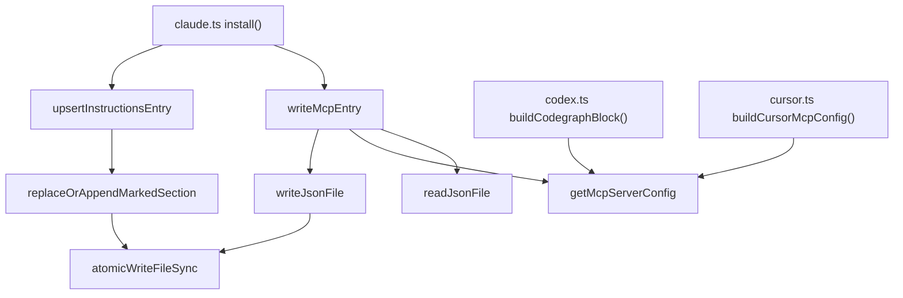

# Shared Config I/O Helpers for Per-Agent Installer Targets

## Overview
This module is the small, dependency-free toolkit that every per-agent installer target
(`claude.ts`, `cursor.ts`, `gemini.ts`, `kiro.ts`, `antigravity.ts`, `codex.ts`, `opencode.ts`, `hermes.ts`) composes
into its own `install`/`uninstall`/`detect` methods to read, mutate, and rewrite that agent's on-disk
config and instructions files. It is worth being upfront about what this is *not*: it does no parsing,
indexing, or graph construction — it has nothing to do with how CodeGraph comprehends a codebase. It is
the plumbing behind `codegraph install`, which injects an MCP-server entry
([`getMcpServerConfig`](../catalog/src/installer/targets/shared.ts.md#getMcpServerConfig)) and a short
pointer block
([`upsertInstructionsEntry`](../catalog/src/installer/targets/shared.ts.md#upsertInstructionsEntry))
into whatever config format a given coding agent happens to use. The one idea worth carrying away: every
mutation in every target funnels through the same two primitives — a forgiving read
([`readJsonFile`](../catalog/src/installer/targets/shared.ts.md#readJsonFile), which never throws) and an
atomic write
([`atomicWriteFileSync`](../catalog/src/installer/targets/shared.ts.md#atomicWriteFileSync), temp-file +
rename) — so eight differently-shaped installers get crash-safety and idempotency for free without a
shared base class.

## Diagram

## Design rationale (why it's built this way)
> [!inferred] The file's own header comment states the composition choice directly: the targets are
> "different enough (JSON vs TOML vs Markdown, varying idempotency markers) that a base class would force
> the awkward shape onto everyone," so `shared.ts` is "kept deliberately small" and each
> `AgentTarget` composes the helpers it needs rather than inheriting them. This explains why the module
> exports free functions instead of an abstract base class with template methods.

Two decisions carry most of the design weight:

- **A forgiving reader, not a strict one.** [`readJsonFile`](../catalog/src/installer/targets/shared.ts.md#readJsonFile)'s
  docstring is explicit that it returns `{}` when a file is "missing or unparseable" rather than
  throwing — and on a parse failure it copies the original to `<path>.backup` *before* returning `{}`, so
  a re-run against a config file a user hand-edited into invalid JSON doesn't silently discard their
  content once the installer overwrites it with a fresh `{}`-based file. This matters because these
  config files (`~/.claude.json`, `.cursor/mcp.json`, etc.) are files the installer does not own —
  hand-edited more than machine-written.
- **A marker-delimited section instead of full-file templating.** [`upsertInstructionsEntry`](../catalog/src/installer/targets/shared.ts.md#upsertInstructionsEntry)'s
  docstring notes it "self-heals a stale pre-#529 long block (markers match → replaced by the current
  short one), appends after existing user content otherwise" — so a CLAUDE.md/AGENTS.md/GEMINI.md the
  user has written prose into is never clobbered; only the byte range between
  [`CODEGRAPH_SECTION_START`](../catalog/src/installer/instructions-template.ts.md#CODEGRAPH_SECTION_START)
  and [`CODEGRAPH_SECTION_END`](../catalog/src/installer/instructions-template.ts.md#CODEGRAPH_SECTION_END)
  is ever touched, via [`replaceOrAppendMarkedSection`](../catalog/src/installer/targets/shared.ts.md#replaceOrAppendMarkedSection).
- **One canonical MCP block, with per-target escape hatches.** [`getMcpServerConfig`](../catalog/src/installer/targets/shared.ts.md#getMcpServerConfig)'s
  docstring calls it "same shape across all JSON-shaped agent configs (Claude, Cursor, opencode), only the
  surrounding wrapper differs" — but it isn't used verbatim everywhere: Cursor wraps it in
  [`buildCursorMcpConfig`](../catalog/src/installer/targets/cursor.ts.md#buildCursorMcpConfig) to inject a
  `--path` argument (a documented workaround for Cursor launching MCP subprocesses with the wrong working
  directory), and Codex's [`buildCodegraphBlock`](../catalog/src/installer/targets/codex.ts.md#buildCodegraphBlock)
  reads the same fields (`type`/`command`/`args` — see
  [`args`](../catalog/src/installer/targets/shared.ts.md#getMcpServerConfig.typeLiteral2.args),
  [`command`](../catalog/src/installer/targets/shared.ts.md#getMcpServerConfig.typeLiteral2.command)) but
  re-renders them as TOML instead of reusing a JSON-write helper, since `config.toml` needs its own
  serializer.

## Entry points
- [`writeMcpEntry`](../catalog/src/installer/targets/claude.ts.md#writeMcpEntry) and its siblings in
  [`cursor.ts`](../catalog/src/installer/targets/cursor.ts.md#writeMcpEntry),
  [`gemini.ts`](../catalog/src/installer/targets/gemini.ts.md#writeMcpEntry),
  [`kiro.ts`](../catalog/src/installer/targets/kiro.ts.md#writeMcpEntry), and
  [`antigravity.ts`](../catalog/src/installer/targets/antigravity.ts.md#writeMcpEntry) — the JSON-config
  entry point each target's `install()` calls to write or refresh the `mcpServers.codegraph` block;
  control reaches here once per `codegraph install` run per target.
- [`upsertInstructionsEntry`](../catalog/src/installer/targets/shared.ts.md#upsertInstructionsEntry) —
  called from every target's `install()` (e.g. [`ClaudeCodeTarget.install`](../catalog/src/installer/targets/claude.ts.md#ClaudeCodeTarget.install),
  [`CodexTarget.install`](../catalog/src/installer/targets/codex.ts.md#CodexTarget.install),
  [`OpencodeTarget.install`](../catalog/src/installer/targets/opencode.ts.md#OpencodeTarget.install),
  [`GeminiTarget.install`](../catalog/src/installer/targets/gemini.ts.md#GeminiTarget.install)) to place or
  self-heal the CodeGraph pointer block in that agent's instructions file.
- `detect()` methods — [`ClaudeCodeTarget.detect`](../catalog/src/installer/targets/claude.ts.md#ClaudeCodeTarget.detect),
  [`GeminiTarget.detect`](../catalog/src/installer/targets/gemini.ts.md#GeminiTarget.detect),
  [`CursorTarget.detect`](../catalog/src/installer/targets/cursor.ts.md#CursorTarget.detect),
  [`KiroTarget.detect`](../catalog/src/installer/targets/kiro.ts.md#KiroTarget.detect), and
  [`AntigravityTarget.detect`](../catalog/src/installer/targets/antigravity.ts.md#AntigravityTarget.detect) —
  reached before install/uninstall to check whether an agent is present and already configured, using only
  [`readJsonFile`](../catalog/src/installer/targets/shared.ts.md#readJsonFile) (read-only, never writes).
- `uninstall()` methods — [`ClaudeCodeTarget.uninstall`](../catalog/src/installer/targets/claude.ts.md#ClaudeCodeTarget.uninstall),
  [`CursorTarget.uninstall`](../catalog/src/installer/targets/cursor.ts.md#CursorTarget.uninstall),
  [`GeminiTarget.uninstall`](../catalog/src/installer/targets/gemini.ts.md#GeminiTarget.uninstall), and
  [`KiroTarget.uninstall`](../catalog/src/installer/targets/kiro.ts.md#KiroTarget.uninstall) — the reverse
  path, reading the config, deleting the `codegraph` key, and writing back via the same read/write pair.
- `printConfig()` methods — [`ClaudeCodeTarget.printConfig`](../catalog/src/installer/targets/claude.ts.md#ClaudeCodeTarget.printConfig),
  [`GeminiTarget.printConfig`](../catalog/src/installer/targets/gemini.ts.md#GeminiTarget.printConfig), and
  [`KiroTarget.printConfig`](../catalog/src/installer/targets/kiro.ts.md#KiroTarget.printConfig) — a
  read-only path that calls only [`getMcpServerConfig`](../catalog/src/installer/targets/shared.ts.md#getMcpServerConfig)
  to print a snippet a user can paste manually, never touching disk.

## Mechanism (step-by-step)
1. **Loading current state never fails loudly.** Every JSON-config write path (the TOML/JSONC/YAML
   targets — `codex.ts`, `opencode.ts`, `hermes.ts` — use their own parsers instead) starts by calling
   [`readJsonFile`](../catalog/src/installer/targets/shared.ts.md#readJsonFile) on the target config path.
   Reading the real source (not just the packet's truncated snippet) shows it treats "file missing" and
   "file present but unparseable JSON" as the same outcome — `{}` — but only after attempting a
   best-effort backup of the unparseable file. This means every downstream target function
   ([`writeMcpEntry`](../catalog/src/installer/targets/claude.ts.md#writeMcpEntry),
   [`writePermissionsEntry`](../catalog/src/installer/targets/claude.ts.md#writePermissionsEntry),
   [`writePromptHookEntry`](../catalog/src/installer/targets/claude.ts.md#writePromptHookEntry),
   [`removeHookCommandsMatching`](../catalog/src/installer/targets/claude.ts.md#removeHookCommandsMatching),
   [`cleanupLegacyLocalMcp`](../catalog/src/installer/targets/claude.ts.md#cleanupLegacyLocalMcp),
   [`cleanupLegacyEntry`](../catalog/src/installer/targets/antigravity.ts.md#cleanupLegacyEntry),
   [`removeCodegraphFromFile`](../catalog/src/installer/targets/antigravity.ts.md#removeCodegraphFromFile))
   can always treat the config object as present, skipping a null-check that would otherwise be
   duplicated across those seven functions.
2. **The MCP block is computed once, then adapted per target.** [`getMcpServerConfig`](../catalog/src/installer/targets/shared.ts.md#getMcpServerConfig)
   returns the fixed literal `{ type: 'stdio', command: 'codegraph', args: ['serve', '--mcp'] }` (its
   [`type`](../catalog/src/installer/targets/shared.ts.md#getMcpServerConfig.typeLiteral2.type),
   [`command`](../catalog/src/installer/targets/shared.ts.md#getMcpServerConfig.typeLiteral2.command), and
   [`args`](../catalog/src/installer/targets/shared.ts.md#getMcpServerConfig.typeLiteral2.args) fields) —
   every JSON-based target spawns the exact same long-running `codegraph serve --mcp` process; there is no
   per-agent binary or flags difference except what
   [`buildCursorMcpConfig`](../catalog/src/installer/targets/cursor.ts.md#buildCursorMcpConfig) adds on top
   for Cursor's working-directory quirk.
3. **Writes are atomic, and idempotency is a first-class return value, not a side effect to infer.**
   [`writeJsonFile`](../catalog/src/installer/targets/shared.ts.md#writeJsonFile) always routes through
   [`atomicWriteFileSync`](../catalog/src/installer/targets/shared.ts.md#atomicWriteFileSync) (write to
   `<path>.tmp.<pid>`, then rename) so a crash mid-write leaves either the old file or the new one, never a
   truncated one. The functions built on top of it don't just write and hope — they report what happened:
   [`upsertInstructionsEntry`](../catalog/src/installer/targets/shared.ts.md#upsertInstructionsEntry)
   returns a `{ `[`path`](../catalog/src/installer/targets/shared.ts.md#upsertInstructionsEntry.typeLiteral69.path)`,
   `[`action`](../catalog/src/installer/targets/shared.ts.md#upsertInstructionsEntry.typeLiteral69.action)` }`
   pair whose `action` is `'created' | 'updated' | 'unchanged'`, so the CLI can print a truthful "already
   configured" instead of claiming to have written a file it left untouched.
4. **Instructions-file edits go through a narrower, marker-scoped primitive than JSON writes do.**
   [`upsertInstructionsEntry`](../catalog/src/installer/targets/shared.ts.md#upsertInstructionsEntry)
   delegates to [`replaceOrAppendMarkedSection`](../catalog/src/installer/targets/shared.ts.md#replaceOrAppendMarkedSection),
   passing [`CODEGRAPH_INSTRUCTIONS_BLOCK`](../catalog/src/installer/instructions-template.ts.md#CODEGRAPH_INSTRUCTIONS_BLOCK)
   bounded by [`CODEGRAPH_SECTION_START`](../catalog/src/installer/instructions-template.ts.md#CODEGRAPH_SECTION_START)
   and [`CODEGRAPH_SECTION_END`](../catalog/src/installer/instructions-template.ts.md#CODEGRAPH_SECTION_END).
   Reading the source shows the three-way branch this hides: markers present and content already matching
   → no write at all; markers present but stale → the byte range between them is swapped, leaving
   everything else in the file untouched; markers absent → the block is appended after a blank-line
   separator rather than the file being rewritten from scratch. This is why every target's `install()`,
   including [`CodexTarget.install`](../catalog/src/installer/targets/codex.ts.md#CodexTarget.install) and
   [`OpencodeTarget.install`](../catalog/src/installer/targets/opencode.ts.md#OpencodeTarget.install), can
   call the same one function regardless of whether the target's config format elsewhere is TOML or JSONC —
   the instructions file is always treated as unstructured markdown-ish text.
5. **Legacy config paths reuse the same two primitives rather than a bespoke migration path.**
   [`cleanupLegacyLocalMcp`](../catalog/src/installer/targets/claude.ts.md#cleanupLegacyLocalMcp) and
   [`cleanupLegacyEntry`](../catalog/src/installer/targets/antigravity.ts.md#cleanupLegacyEntry) — invoked
   from [`ClaudeCodeTarget.install`](../catalog/src/installer/targets/claude.ts.md#ClaudeCodeTarget.install)/[`uninstall`](../catalog/src/installer/targets/claude.ts.md#ClaudeCodeTarget.uninstall)
   to migrate a pre-#207 `./.claude.json` entry — are just another `readJsonFile` → mutate →
   `writeJsonFile` round trip against a different path, not a separate one-off code path. The same is true
   of the older [`config-writer.ts`](../catalog/src/installer/config-writer.ts.md) module, whose
   [`hasMcpConfig`](../catalog/src/installer/config-writer.ts.md#hasMcpConfig) and
   [`hasPermissions`](../catalog/src/installer/config-writer.ts.md#hasPermissions) checks are thin
   `readJsonFile` wrappers kept for backward compatibility with callers that predate the per-target
   refactor.

## Key data structures
- **The MCP-server config literal** returned by [`getMcpServerConfig`](../catalog/src/installer/targets/shared.ts.md#getMcpServerConfig) —
  a plain object with [`type`](../catalog/src/installer/targets/shared.ts.md#getMcpServerConfig.typeLiteral2.type),
  [`command`](../catalog/src/installer/targets/shared.ts.md#getMcpServerConfig.typeLiteral2.command), and
  [`args`](../catalog/src/installer/targets/shared.ts.md#getMcpServerConfig.typeLiteral2.args) — is the one
  piece of state every JSON-based target writes into its own config tree under a `mcpServers.codegraph`
  (or equivalent) key. It carries no target-specific fields; per-target differences (Cursor's `--path`) are
  layered on by the caller, not stored here.
- **The write-outcome record** — `{ `[`path`](../catalog/src/installer/targets/shared.ts.md#upsertInstructionsEntry.typeLiteral69.path)`,
  `[`action`](../catalog/src/installer/targets/shared.ts.md#upsertInstructionsEntry.typeLiteral69.action)` }` —
  is the shape every write helper in this file and its per-target callers converge on
  (`'created' | 'updated' | 'unchanged'`, extended to include `'removed' | 'not-found' | 'kept'` by the
  target-level `writeMcpEntry`/`uninstall` functions built on top). It's the mechanism by which a whole
  `install`/`uninstall` run can be summarized as a list of file-level outcomes rather than a boolean
  success flag.
- **The marker pair** [`CODEGRAPH_SECTION_START`](../catalog/src/installer/instructions-template.ts.md#CODEGRAPH_SECTION_START)/[`CODEGRAPH_SECTION_END`](../catalog/src/installer/instructions-template.ts.md#CODEGRAPH_SECTION_END)
  delimiting [`CODEGRAPH_INSTRUCTIONS_BLOCK`](../catalog/src/installer/instructions-template.ts.md#CODEGRAPH_INSTRUCTIONS_BLOCK) —
  the only state that makes an instructions-file edit idempotent and reversible; without it,
  [`replaceOrAppendMarkedSection`](../catalog/src/installer/targets/shared.ts.md#replaceOrAppendMarkedSection)
  would have no way to distinguish "our block" from arbitrary user prose in the same file.

## Dynamics (design intent)
All of these functions are synchronous, single-shot, and meant to run once per invocation of `codegraph
install`/`uninstall` on the CLI's main thread — there is no async I/O, no locking, and no retry logic
beyond the atomic-rename trick in
[`atomicWriteFileSync`](../catalog/src/installer/targets/shared.ts.md#atomicWriteFileSync). The read →
mutate → write sequence in, e.g.,
[`writeMcpEntry`](../catalog/src/installer/targets/claude.ts.md#writeMcpEntry) is not safe against two
concurrent installer processes racing on the same config file (a rename can still land between another
process's read and write); the design intent is evidently a single foreground CLI run, not a
multi-process daemon touching these files. Compare this to the rest of the repo, where `src/sync/`'s file
watcher and the MCP daemon do need real concurrency discipline — this module was written for a
fire-and-forget CLI command, not a long-lived service.

## Edge cases
- A missing config file and a corrupt-but-present config file both resolve to `{}` from
  [`readJsonFile`](../catalog/src/installer/targets/shared.ts.md#readJsonFile) — callers cannot distinguish
  "never configured" from "configured, but we just clobbered a parse error" without checking
  `fs.existsSync` themselves first, which several `detect()` methods do independently.
- If the backup copy in [`readJsonFile`](../catalog/src/installer/targets/shared.ts.md#readJsonFile) itself
  fails (read-only filesystem, permissions), the failure is swallowed (`catch { /* ignore backup failure
  */ }`) and the function still returns `{}` — a corrupt file with no backup is possible in that scenario.
- [`replaceOrAppendMarkedSection`](../catalog/src/installer/targets/shared.ts.md#replaceOrAppendMarkedSection)
  only treats the section as found when `startIdx !== -1 && endIdx > startIdx`; a file with an end marker
  before a start marker (hand-edited into that state) falls through to the append branch rather than being
  treated as an error.
- [`upsertInstructionsEntry`](../catalog/src/installer/targets/shared.ts.md#upsertInstructionsEntry)
  collapses `replaceOrAppendMarkedSection`'s four-way result down to three by mapping `'appended'` to
  `'updated'` — from the CLI's perspective, a first-time-append and a marker-swap both read as "updated,"
  which is coarser than the internal state actually tracked.

## Open questions
> [!inferred] The same file also defines `getCodeGraphPermissions`, `jsonDeepEqual`, and
> `removeMarkedSection` — respectively the Claude permissions-allowlist literal, the deep-equality check
> that lets `writeMcpEntry`/`writePermissionsEntry` report `'unchanged'` instead of rewriting a
> byte-identical file, and the inverse of `replaceOrAppendMarkedSection` used by uninstall paths to strip a
> marker block. None of the three are in this packet's subgraph, so they aren't cited above even though
> they're load-bearing for the idempotency and uninstall behavior described here — see the source directly
> at `src/installer/targets/shared.ts` for their implementations.
- It's unclear from this packet alone whether any target ever calls these JSON helpers against a genuinely
  large config file (multi-MB `settings.json`) — the whole-file read/parse/stringify approach is fine for
  the small per-agent configs seen here but wouldn't scale to one.

## See also
- [Installer target type contracts](installer-targets-types.ts.md) — the `AgentTarget` interface each
  target composes these helpers into; the closest sibling to this module.
- [MCP tool surface](mcp-tools.ts.md) — what the `codegraph serve --mcp` command (the process every
  `getMcpServerConfig` block points to) actually exposes once an agent connects.
- [`.codegraph` project directory discovery](directory.ts.md) — a different piece of setup/bookkeeping
  plumbing (project-side rather than agent-config-side) with a similar "small, deterministic, filesystem-
  facing helper" flavor.
