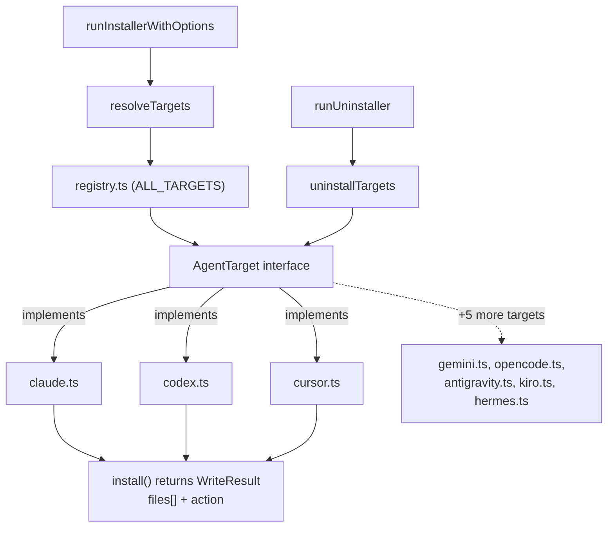

# AgentTarget — the Installer's Per-Agent Plugin Contract

## Overview
This module has no runtime logic — it is a pure type-declaration file that defines the plugin
contract behind `codegraph install`. The key idea: the installer orchestrator never contains a
switch statement over "which coding agent"; instead it holds an array of interchangeable
[`AgentTarget`](../catalog/src/installer/targets/types.ts.md#AgentTarget) instances and calls the
same five methods on all of them, while each concrete per-agent module (Claude Code, Cursor, Codex
CLI, opencode, Gemini CLI, Antigravity, Kiro, Hermes) owns its own config-file format (JSON, JSONC,
TOML, or a hand-rolled YAML-ish text format) and filesystem paths behind that uniform surface.
Everything the reader needs to know about *what codegraph is* — the tree-sitter extraction, the
symbol graph, SCIP grounding — is untouched by this file. It is worth being upfront about that: this
module is peripheral to code comprehension itself. Its place in this survey is as the mechanism that
gets an agent *wired up to call* the comprehension tools (the MCP server described elsewhere in this
wiki) in the first place — plumbing around the tool, not part of the tool's understanding of code.

## Diagram

## Design rationale (why it's built this way)
The file's own header comment states the goal directly: each MCP-capable agent "implements this
interface so the installer orchestrator can write the right MCP-server config + instructions file +
permissions for that agent without baking client-specific paths into core code. Adding a new agent =
one new file in `targets/` + one entry in `registry.ts`." That is the whole design in one sentence —
the interface exists to make the *orchestrator* agent-agnostic even though every concrete agent has a
wildly different config format underneath (compare the TOML writer in `codex.ts` to the JSONC editor
in `opencode.ts`).

Two choices stand out as non-obvious:
- **A single `Location` union threads through every method** — [`supportsLocation`](../catalog/src/installer/targets/types.ts.md#AgentTarget.supportsLocation),
  [`detect`](../catalog/src/installer/targets/types.ts.md#AgentTarget.detect),
  [`install`](../catalog/src/installer/targets/types.ts.md#AgentTarget.install), and
  [`uninstall`](../catalog/src/installer/targets/types.ts.md#AgentTarget.uninstall) all take the same
  [`Location`](../catalog/src/installer/targets/types.ts.md#Location) ('global' | 'local') — rather
  than each target inventing its own scope handling. This lets a target that genuinely has no
  project-local concept (the interface's own comment names Codex CLI as of 2026-05) simply answer
  `false` from `supportsLocation` once, and every call site (the orchestrator's uninstall sweep among
  them) skips it uniformly instead of every target duplicating that guard ad hoc.
- **`WriteResult` reports a semantic action per file, not a boolean.** The docstring on
  [`WriteResult`](../catalog/src/installer/targets/types.ts.md#WriteResult) spells out why
  `'unchanged'` exists as its own value: it "means we touched the file but its contents were already
  what we'd write — used for byte-identical idempotent re-runs." A plain success/failure boolean
  couldn't distinguish "nothing to do" from "just wrote it," which matters because the orchestrator's
  log line and the uninstall summary both key off this field rather than off any side channel.

> [!inferred] The interface is implemented as a plain object literal per target (e.g. `claudeTarget`,
> `codexTarget`), not a class hierarchy in the classic OO sense — but codegraph's own extractor still
> recovers dispatch through structural typing, which is what the `(virtual)` edges below are.

## Entry points
- [`AgentTarget`](../catalog/src/installer/targets/types.ts.md#AgentTarget) — the contract itself.
  Control crosses from generic orchestration into agent-specific code at exactly its five members:
  [`supportsLocation`](../catalog/src/installer/targets/types.ts.md#AgentTarget.supportsLocation),
  [`detect`](../catalog/src/installer/targets/types.ts.md#AgentTarget.detect),
  [`install`](../catalog/src/installer/targets/types.ts.md#AgentTarget.install),
  [`uninstall`](../catalog/src/installer/targets/types.ts.md#AgentTarget.uninstall), and
  [`printConfig`](../catalog/src/installer/targets/types.ts.md#AgentTarget.printConfig).
- [`runInstallerWithOptions`](../catalog/src/installer/index.ts.md#runInstallerWithOptions) — the
  `codegraph install` CLI entry; it is where a `Location` first gets chosen and handed down into
  [`resolveTargets`](../catalog/src/installer/index.ts.md#resolveTargets).
- [`runUninstaller`](../catalog/src/installer/index.ts.md#runUninstaller) — the mirror-image
  interactive entry for removal, driving [`uninstallTargets`](../catalog/src/installer/index.ts.md#uninstallTargets).
- `registry.ts` —
  the composition root: it imports every concrete implementer
  (`claude.ts`,
  `codex.ts`, etc.)
  and exposes [`resolveTargetFlag`](../catalog/src/installer/targets/registry.ts.md#resolveTargetFlag)
  for turning a `--target=` CLI value into concrete instances.

## Mechanism (step-by-step)
1. The contract is declared once: [`AgentTarget`](../catalog/src/installer/targets/types.ts.md#AgentTarget)
   lists [`supportsLocation`](../catalog/src/installer/targets/types.ts.md#AgentTarget.supportsLocation),
   [`detect`](../catalog/src/installer/targets/types.ts.md#AgentTarget.detect),
   [`install`](../catalog/src/installer/targets/types.ts.md#AgentTarget.install),
   [`uninstall`](../catalog/src/installer/targets/types.ts.md#AgentTarget.uninstall), and
   [`printConfig`](../catalog/src/installer/targets/types.ts.md#AgentTarget.printConfig), all
   parameterized by the same [`Location`](../catalog/src/installer/targets/types.ts.md#Location).
   Nothing here executes; it's purely the shape every target must fill in.
2. Eight modules fill it in as concrete classes, one per agent:
   `claude.ts`
   ([`detect`](../catalog/src/installer/targets/claude.ts.md#ClaudeCodeTarget.detect),
   [`install`](../catalog/src/installer/targets/claude.ts.md#ClaudeCodeTarget.install),
   [`uninstall`](../catalog/src/installer/targets/claude.ts.md#ClaudeCodeTarget.uninstall)),
   `codex.ts`
   ([`detect`](../catalog/src/installer/targets/codex.ts.md#CodexTarget.detect),
   [`install`](../catalog/src/installer/targets/codex.ts.md#CodexTarget.install),
   [`uninstall`](../catalog/src/installer/targets/codex.ts.md#CodexTarget.uninstall)),
   `cursor.ts`
   ([`install`](../catalog/src/installer/targets/cursor.ts.md#CursorTarget.install),
   [`uninstall`](../catalog/src/installer/targets/cursor.ts.md#CursorTarget.uninstall)),
   `gemini.ts`
   ([`detect`](../catalog/src/installer/targets/gemini.ts.md#GeminiTarget.detect),
   [`uninstall`](../catalog/src/installer/targets/gemini.ts.md#GeminiTarget.uninstall)),
   `opencode.ts`
   ([`detect`](../catalog/src/installer/targets/opencode.ts.md#OpencodeTarget.detect)),
   `antigravity.ts`
   ([`detect`](../catalog/src/installer/targets/antigravity.ts.md#AntigravityTarget.detect),
   [`uninstall`](../catalog/src/installer/targets/antigravity.ts.md#AntigravityTarget.uninstall)),
   `kiro.ts`
   ([`uninstall`](../catalog/src/installer/targets/kiro.ts.md#KiroTarget.uninstall)), and
   `hermes.ts`
   ([`detect`](../catalog/src/installer/targets/hermes.ts.md#HermesTarget.detect),
   [`uninstall`](../catalog/src/installer/targets/hermes.ts.md#HermesTarget.uninstall)). Each owns its
   own path resolution and file format entirely privately.
3. `registry.ts`
   collects all eight into `ALL_TARGETS` and exposes
   [`resolveTargetFlag`](../catalog/src/installer/targets/registry.ts.md#resolveTargetFlag) to turn a
   `--target=` string (or `auto`/`all`/`none`) into a concrete `AgentTarget[]` — this is the one place
   that knows every target by name; everywhere else touches them only through the interface.
4. The packet's own call graph shows *why* this matters for the survey's dynamic-dispatch angle: the
   interface members [`install`](../catalog/src/installer/targets/types.ts.md#AgentTarget.install),
   [`uninstall`](../catalog/src/installer/targets/types.ts.md#AgentTarget.uninstall), and
   [`detect`](../catalog/src/installer/targets/types.ts.md#AgentTarget.detect) each list several
   `(virtual)` call targets in their own subgraph entry — codegraph's class-hierarchy analysis
   recovering, per target, which concrete override an orchestrator call to the abstract method
   actually reaches at runtime. This is the same synthesized-edge mechanism the wider wiki's
   dynamic-dispatch pages describe, just observed here on codegraph's own installer rather than on a
   surveyed target repo.
5. Every concrete `install`/`uninstall` assembles its return value out of small, single-purpose
   helpers that each produce one `WriteResult['files'][number]` entry tagged with an
   [`action`](../catalog/src/installer/targets/types.ts.md#WriteResult.files.Array.typeLiteral0.action):
   [`writeMcpEntry`](../catalog/src/installer/targets/claude.ts.md#writeMcpEntry) (and its
   [codex](../catalog/src/installer/targets/codex.ts.md#writeMcpEntry),
   [cursor](../catalog/src/installer/targets/cursor.ts.md#writeMcpEntry),
   [gemini](../catalog/src/installer/targets/gemini.ts.md#writeMcpEntry),
   [opencode](../catalog/src/installer/targets/opencode.ts.md#writeMcpEntry),
   [kiro](../catalog/src/installer/targets/kiro.ts.md#writeMcpEntry), and
   [antigravity](../catalog/src/installer/targets/antigravity.ts.md#writeMcpEntry) counterparts),
   [`writePermissionsEntry`](../catalog/src/installer/targets/claude.ts.md#writePermissionsEntry),
   [`writePromptHookEntry`](../catalog/src/installer/targets/claude.ts.md#writePromptHookEntry),
   [`writeHermesConfig`](../catalog/src/installer/targets/hermes.ts.md#writeHermesConfig), and the
   removal-side counterparts
   [`removeInstructionsEntry`](../catalog/src/installer/targets/claude.ts.md#removeInstructionsEntry)
   (also on [gemini](../catalog/src/installer/targets/gemini.ts.md#removeInstructionsEntry),
   [codex](../catalog/src/installer/targets/codex.ts.md#removeInstructionsEntry), and
   [opencode](../catalog/src/installer/targets/opencode.ts.md#removeInstructionsEntry)),
   [`removeRulesEntry`](../catalog/src/installer/targets/cursor.ts.md#removeRulesEntry),
   [`removeHookCommandsMatching`](../catalog/src/installer/targets/claude.ts.md#removeHookCommandsMatching),
   [`removeMcpEntryAt`](../catalog/src/installer/targets/opencode.ts.md#removeMcpEntryAt), and
   [`cleanupLegacyWindowsState`](../catalog/src/installer/targets/opencode.ts.md#cleanupLegacyWindowsState).
   `install`/`uninstall` just `push()` these into one
   [`files`](../catalog/src/installer/targets/types.ts.md#WriteResult.files) array and return a
   [`WriteResult`](../catalog/src/installer/targets/types.ts.md#WriteResult).
6. The orchestrator entry points never look inside a target — they only walk the interface and the
   `WriteResult` shape: [`runInstallerWithOptions`](../catalog/src/installer/index.ts.md#runInstallerWithOptions)
   calls [`resolveTargets`](../catalog/src/installer/index.ts.md#resolveTargets) then each target's
   `install`; [`runUninstaller`](../catalog/src/installer/index.ts.md#runUninstaller) resolves targets
   via [`resolveTargetFlag`](../catalog/src/installer/targets/registry.ts.md#resolveTargetFlag) and
   sweeps them through [`uninstallTargets`](../catalog/src/installer/index.ts.md#uninstallTargets),
   which checks [`supportsLocation`](../catalog/src/installer/targets/types.ts.md#AgentTarget.supportsLocation)
   before calling `uninstall` and classifies each result by whether any file's `action` came back
   `'removed'`. A narrower third caller,
   [`selfHealPromptHook`](../catalog/src/upgrade/index.ts.md#selfHealPromptHook), re-uses the same
   `detect`/`writePromptHookEntry` pair on upgrade to opt an already-configured Claude install into a
   newer feature — the same contract serving a one-off self-heal, not just the main install/uninstall
   flows.

## Key data structures
- [`Location`](../catalog/src/installer/targets/types.ts.md#Location) — `'global' | 'local'`. The one
  scope knob every method takes; whether a given (target, location) pair is even valid is a runtime
  question answered by [`supportsLocation`](../catalog/src/installer/targets/types.ts.md#AgentTarget.supportsLocation),
  not by the type system.
- [`WriteResult`](../catalog/src/installer/targets/types.ts.md#WriteResult) — the shared return shape
  for both `install` and `uninstall`: a [`files`](../catalog/src/installer/targets/types.ts.md#WriteResult.files)
  array of `{ path, action }`, where [`action`](../catalog/src/installer/targets/types.ts.md#WriteResult.files.Array.typeLiteral0.action)
  is one of `'created' | 'updated' | 'unchanged' | 'removed' | 'not-found' | 'kept'`, plus an optional
  `notes` array of one-line strings the orchestrator prints verbatim (e.g. "Restart Cursor to apply").
- [`AgentTarget`](../catalog/src/installer/targets/types.ts.md#AgentTarget) — the interface itself:
  `id`/`displayName`/`docsUrl` identity fields plus the five behavioral methods cited throughout this
  page.

> [!inferred] Three sibling types declared in the same file — a `TargetId` string-literal union of
> agent ids, a `DetectionResult` (`{ installed, alreadyConfigured, configPath? }`) returned by
> `detect`, and an `InstallOptions` (`{ autoAllow, promptHook? }`) passed into `install` — are defined
> here too and visibly used by every concrete target, but none of them appear in this packet's
> Subgraph, so this page describes their shape from reading the real source rather than citing them.

## Dynamics (design intent)
No tests in the configured test paths exercise this subgraph directly (the packet's Evidence section
is empty), so this section draws only from the cited signatures. The orchestration entry points
[`runInstallerWithOptions`](../catalog/src/installer/index.ts.md#runInstallerWithOptions) and
[`runUninstaller`](../catalog/src/installer/index.ts.md#runUninstaller) are both `async` (their
signatures return `Promise<void>`, driven by interactive `clack` prompts), but the interface methods
themselves — [`install`](../catalog/src/installer/targets/types.ts.md#AgentTarget.install) and
[`uninstall`](../catalog/src/installer/targets/types.ts.md#AgentTarget.uninstall) — are synchronous,
returning a plain [`WriteResult`](../catalog/src/installer/targets/types.ts.md#WriteResult), not a
Promise. [`uninstallTargets`](../catalog/src/installer/index.ts.md#uninstallTargets) iterates targets
with a plain synchronous `.map()`, so every target's filesystem writes happen strictly one after
another within a single process — there is no parallel or interleaved writing across targets to
reason about.

## Edge cases
- **Location mismatch is silent, not an error.** A target that answers `false` from
  [`supportsLocation`](../catalog/src/installer/targets/types.ts.md#AgentTarget.supportsLocation) for
  a given `Location` is simply skipped by [`uninstallTargets`](../catalog/src/installer/index.ts.md#uninstallTargets)
  with an `'unsupported'` status rather than having `uninstall` called at all — a reader expecting
  every target's `uninstall` to always run should not assume that.
- **Uninstalling something never installed must not throw.** The interface's own docstring on
  [`uninstall`](../catalog/src/installer/targets/types.ts.md#AgentTarget.uninstall) states it "Must be
  safe to call when nothing was ever installed (returns `not-found` actions)" — every concrete
  `uninstall` this page cites checks file existence before deleting rather than assuming prior state.
- **`printConfig` is the one read-only method in an otherwise side-effecting interface.** Its
  docstring is explicit: "Must NOT touch the filesystem" — it exists only to print a paste-able
  snippet (`codegraph install --print-config <id>` and the README), not to participate in the
  install/uninstall write path at all.
- **The `'kept'` action value has no visible producer in this packet.** It's part of the
  [`action`](../catalog/src/installer/targets/types.ts.md#WriteResult.files.Array.typeLiteral0.action)
  union, but none of the `write*Entry`/`remove*Entry` helpers cited above return it — see Open
  questions.

## Open questions
- Which helper actually returns `action: 'kept'`? Not observable from this packet's subgraph or
  source excerpts — likely a shared helper (e.g. an instructions-upsert routine) outside this
  packet's scope.
- `describePaths(loc): string[]` is part of the real `AgentTarget` interface (confirmed by reading the
  source directly) but is absent from this packet's Subgraph entirely, so this page cannot cite any of
  its implementations or call sites.
- The sibling types `TargetId`, `DetectionResult`, and `InstallOptions` are used pervasively by every
  target implementation but, like `describePaths`, fall outside this packet's Subgraph — a full
  picture of the installer's data model needs a packet that includes them directly.

## See also
- [Shared JSON config read/write/upsert helpers](installer-targets-shared.ts.md) — the actual
  file-I/O primitives every `write*Entry`/`remove*Entry` helper cited above is built from.
- [MCP tool surface](mcp-tools.ts.md) — what a successful `install()` ultimately wires an agent up to
  call; this module is the plumbing, that page is the destination.
