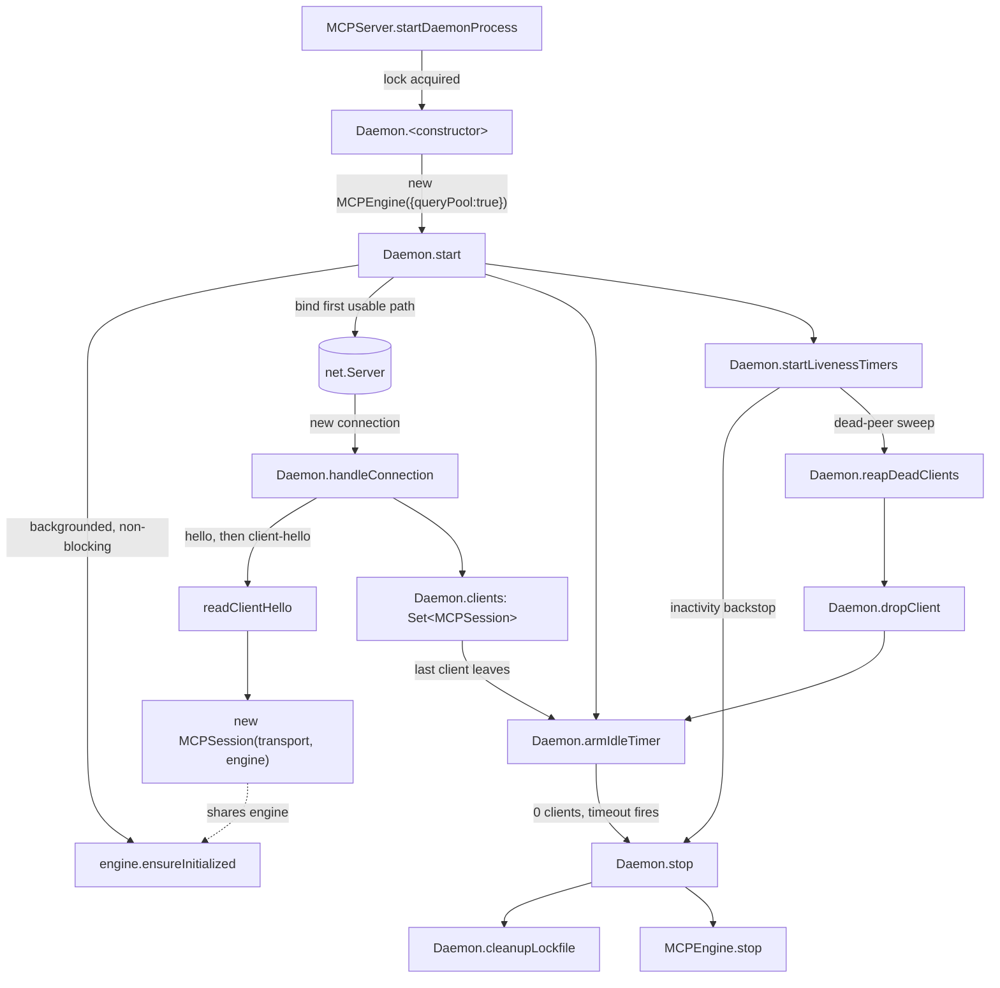

# The MCP daemon — one warm process serving every client

## Overview
`mcp-daemon.ts` confirms the perf intuition directly: without it, every MCP tool call from a
coding agent would open its own SQLite connection, re-run tree-sitter warm-up, and spin up its
own file watcher — repeated per invocation, per client. The `Daemon` class instead runs as one
detached background process per project root that owns a single `MCPEngine` (one SQLite
connection/WAL writer, one file watcher, one tree-sitter warm-up) and multiplexes it across N
concurrent MCP client connections arriving over a Unix-domain socket (a named pipe on Windows),
each getting its own lightweight [`MCPSession`](../catalog/src/mcp/session.ts.md#MCPSession.-constructor)
on top of the shared engine. The design's second half is just as deliberate as the sharing: the
daemon is spawned detached from any single client process specifically so that closing one
terminal or agent session can't take the others down with it, and it self-terminates through
layered idle/liveness timers once nobody is using it — a warm cache that pays for itself across
back-to-back agent runs without becoming a process that leaks forever.

## Diagram

## Design rationale (why it's built this way)
- **Init is backgrounded so the handshake never blocks.** [`start`](../catalog/src/mcp/daemon.ts.md#Daemon.start)'s
  own comment states the reasoning explicitly: "Engine init is deliberately backgrounded — see
  #172. The first session to land waits on `ensureInitialized` either way, and unloaded sessions
  (cross-project tool calls only) shouldn't pay any open cost." The daemon calls
  [`ensureInitialized`](../catalog/src/mcp/engine.ts.md#MCPEngine.ensureInitialized) with `void`
  (fire-and-forget) rather than awaiting it before binding the socket, so a slow first index-open
  never delays the daemon from accepting connections.
- **One engine, off-loaded read dispatch, because daemon mode is many-clients-one-event-loop.**
  [`<constructor>`](../catalog/src/mcp/daemon.ts.md#Daemon.-constructor)'s comment is direct about
  the trade-off: "Daemon mode serves many concurrent clients on one event loop, so off-load
  read-tool dispatch to a worker pool — otherwise concurrent explores serialize and starve the MCP
  transport (clients time out)." That is why it constructs its [`MCPEngine`](../catalog/src/mcp/engine.ts.md#MCPEngine.-constructor)
  with `queryPool: true` — a knob a single-client stdio launch leaves off — and
  [`maybeStartPool`](../catalog/src/mcp/engine.ts.md#MCPEngine.maybeStartPool)'s own comment
  confirms the pool is meant to start "once a default project is open (daemon...)". A tool call
  routed through [`execute`](../catalog/src/mcp/tools.ts.md#ToolHandler.execute) can therefore run
  on a worker thread instead of blocking every other client's I/O.
  > [!inferred] The exact worker-thread sizing/scheduling policy inside the pool is outside this
  > packet's subgraph (only its constructor, `destroy`, and `settle` are cited here) — see
  > `mcp-query-pool.ts.md`.
- **Deliberately detached from every client, on purpose.** The file's own header comment (not
  itself a cited symbol, but read directly from source) explains that the daemon is spawned
  "detached (its own session/process group, stdio decoupled)... It is NOT a child of any MCP
  host, so closing one terminal / Ctrl-C'ing one session can't take it down and sever the
  others. That's why this process has no PPID watchdog: it deliberately outlives every
  individual client." A thin per-client `proxy` process (outside this packet) is what carries
  the PPID watchdog instead, so a killed host still reaps its own proxy without touching the
  daemon serving everyone else.
- **Idle exit is layered, not single-signal, because "zero clients" can lie.** [`armIdleTimer`](../catalog/src/mcp/daemon.ts.md#Daemon.armIdleTimer)
  handles the common case (last [`clients`](../catalog/src/mcp/daemon.ts.md#Daemon.clients) drops
  to zero → wait `idleTimeoutMs` → [`stop`](../catalog/src/mcp/daemon.ts.md#Daemon.stop)), but
  [`startLivenessTimers`](../catalog/src/mcp/daemon.ts.md#Daemon.startLivenessTimers)'s docstring
  names the gap it exists to close: "Defense-in-depth against a daemon that outlives its clients
  (#692)... a daemon that outlives its clients... because a socket close never arrives." A Windows
  named-pipe hazard can leave a client counted forever, so an inactivity backstop and a
  [`reapDeadClients`](../catalog/src/mcp/daemon.ts.md#Daemon.reapDeadClients) liveness sweep
  (checking each client's peer pid via [`readClientHello`](../catalog/src/mcp/daemon.ts.md#readClientHello)-supplied
  data) both exist purely to catch what the client-count path misses.
- **Socket location adapts to the filesystem, not the other way around.** [`getDaemonSocketCandidates`](../catalog/src/mcp/daemon-paths.ts.md#getDaemonSocketCandidates)'s
  doc calls itself "Ordered socket / named-pipe path candidates the daemon should try to bind
  (and..." — [`start`](../catalog/src/mcp/daemon.ts.md#Daemon.start) walks that ordered list and
  falls back past a path that can't host a Unix-domain socket at all (ExFAT/FAT external volumes,
  some network mounts, WSL2 DrvFs), adopting whichever candidate actually binds rather than
  assuming the in-project path always works.
- **Discovery is best-effort, never load-bearing.** [`registerDaemon`](../catalog/src/mcp/daemon-registry.ts.md#registerDaemon)'s
  doc — "Best-effort: record this daemon so `list`/`stop --all` can find it" — and its writing of
  the [`root`](../catalog/src/mcp/daemon-registry.ts.md#DaemonRecord.root) ("Realpath'd project
  root the daemon serves") plus the lockfile's own [`pid`](../catalog/src/mcp/daemon-paths.ts.md#DaemonLockInfo.pid)
  are for `codegraph list`/`stop --all` convenience — the daemon's actual identity and lifecycle
  do not depend on that record surviving.

## Entry points
- [`<constructor>`](../catalog/src/mcp/daemon.ts.md#Daemon.-constructor) — reached from
  [`startDaemonProcess`](../catalog/src/mcp/index.ts.md#MCPServer.startDaemonProcess) once a
  launcher has won the daemon lock; this is where the shared, worker-pool-enabled
  [`MCPEngine`](../catalog/src/mcp/engine.ts.md#MCPEngine.-constructor) gets built.
- [`start`](../catalog/src/mcp/daemon.ts.md#Daemon.start) — control reaches it once per daemon
  lifetime, immediately after construction; it is the only place the socket is bound, discovery
  is registered, and the two self-termination timers ([`armIdleTimer`](../catalog/src/mcp/daemon.ts.md#Daemon.armIdleTimer),
  [`startLivenessTimers`](../catalog/src/mcp/daemon.ts.md#Daemon.startLivenessTimers)) first
  start.
- [`handleConnection`](../catalog/src/mcp/daemon.ts.md#Daemon.handleConnection) — `net.Server`'s
  per-socket callback; every one of the daemon's N concurrent clients enters here, and it is
  where a shared-engine [`MCPSession`](../catalog/src/mcp/session.ts.md#MCPSession.-constructor)
  gets minted for that one connection.
- [`stop`](../catalog/src/mcp/daemon.ts.md#Daemon.stop) — the single shutdown path, reached from
  `SIGINT`/`SIGTERM` handlers registered inside [`start`](../catalog/src/mcp/daemon.ts.md#Daemon.start),
  from either self-termination timer, or (in the process that owns the daemon in-process) from
  [`MCPServer#stop`](../catalog/src/mcp/index.ts.md#MCPServer.stop) delegating to it.

## Mechanism (step-by-step)
1. **Becoming the daemon is a race a launcher can lose gracefully.** [`startDaemonProcess`](../catalog/src/mcp/index.ts.md#MCPServer.startDaemonProcess)
   loops attempting to acquire a per-project lockfile; the loser of that race checks whether the
   holder's pid is alive and, if so, exits cleanly so the launcher instead proxies to the existing
   daemon, and if the holder is dead, clears the stale lock and retries. Only the winner constructs
   a [`Daemon`](../catalog/src/mcp/daemon.ts.md#Daemon.-constructor) and calls
   [`start`](../catalog/src/mcp/daemon.ts.md#Daemon.start) on it — everyone else never gets this
   far, which is exactly the point: one daemon per project root, arbitrated without a central
   coordinator.
2. **The constructor wires the one thing every client will share.** [`<constructor>`](../catalog/src/mcp/daemon.ts.md#Daemon.-constructor)
   builds a single [`MCPEngine`](../catalog/src/mcp/engine.ts.md#MCPEngine.-constructor) with
   `queryPool: true` and calls [`setProjectPathHint`](../catalog/src/mcp/engine.ts.md#MCPEngine.setProjectPathHint)
   with the project root — this one engine instance, not a new one per connection, is what makes
   the daemon a cache rather than just a socket multiplexer.
3. **`start` binds first, blocks on nothing expensive.** It fires [`ensureInitialized`](../catalog/src/mcp/engine.ts.md#MCPEngine.ensureInitialized)
   without awaiting it, then walks [`getDaemonSocketCandidates`](../catalog/src/mcp/daemon-paths.ts.md#getDaemonSocketCandidates)'s
   ordered path list, binding the first that succeeds and relocating past any that can't host a
   Unix-domain socket. Once bound it writes the discovery record via [`registerDaemon`](../catalog/src/mcp/daemon-registry.ts.md#registerDaemon)
   (keyed on [`root`](../catalog/src/mcp/daemon-registry.ts.md#DaemonRecord.root)) and immediately
   calls [`armIdleTimer`](../catalog/src/mcp/daemon.ts.md#Daemon.armIdleTimer) and
   [`startLivenessTimers`](../catalog/src/mcp/daemon.ts.md#Daemon.startLivenessTimers) — the
   self-termination clock starts even before a first client ever connects, so a daemon spawned
   then abandoned by a dying launcher still cleans itself up.
4. **Every connection gets a hello, then optionally reveals its peer pid.** [`handleConnection`](../catalog/src/mcp/daemon.ts.md#Daemon.handleConnection)
   first writes a version-stamped hello (carrying [`CodeGraphPackageVersion`](../catalog/src/mcp/version.ts.md#CodeGraphPackageVersion)
   and the daemon's [`socketPath`](../catalog/src/mcp/daemon.ts.md#Daemon.socketPath)) so a proxy
   can bail before piping any application bytes to a version-mismatched daemon. It then awaits
   [`readClientHello`](../catalog/src/mcp/daemon.ts.md#readClientHello), which is fail-safe by
   design — a timeout, a non-hello first line, or an early close all just yield null peer pids and
   fall back to the plain socket-close lifecycle.
5. **A session is minted per connection, but it rides the one shared engine.** [`handleConnection`](../catalog/src/mcp/daemon.ts.md#Daemon.handleConnection)
   constructs a fresh [`MCPSession`](../catalog/src/mcp/session.ts.md#MCPSession.-constructor) —
   whose own doc calls it "One MCP client's view of the server" — over the *same*
   [`MCPEngine`](../catalog/src/mcp/engine.ts.md#MCPEngine.-constructor) passed into the
   [`Daemon`](../catalog/src/mcp/daemon.ts.md#Daemon.-constructor) constructor, then adds it to
   [`clients`](../catalog/src/mcp/daemon.ts.md#Daemon.clients) — a set whose non-empty size is what
   keeps the daemon alive: the connection disarms any pending idle countdown,
   [`armIdleTimer`](../catalog/src/mcp/daemon.ts.md#Daemon.armIdleTimer) is (re-)started only when
   the set empties, and if the idle timer ever fires while a client is still present it re-arms
   itself rather than calling `stop`. The session itself is thin, stateless per-connection
   routing; the SQLite connection, tree-sitter grammars, and file watcher underneath it never move.
6. **Tool calls flow through the shared engine's single tool handler.** A session's [`handleMessage`](../catalog/src/mcp/session.ts.md#MCPSession.handleMessage)
   dispatches `tools/call` to [`handleToolsCall`](../catalog/src/mcp/session.ts.md#MCPSession.handleToolsCall),
   which calls [`retryInitIfNeeded`](../catalog/src/mcp/session.ts.md#MCPSession.retryInitIfNeeded)
   then [`execute`](../catalog/src/mcp/tools.ts.md#ToolHandler.execute) on the engine's one
   [`toolHandler`](../catalog/src/mcp/engine.ts.md#MCPEngine.toolHandler) — every concurrent
   client's `codegraph_explore`/`codegraph_callers`/etc. call is answered from the same warm
   [`cg`](../catalog/src/mcp/engine.ts.md#MCPEngine.cg) instance, and usage is recorded
   after the reply via [`recordUsage`](../catalog/src/telemetry/index.ts.md#Telemetry.recordUsage)
   from [`getTelemetry`](../catalog/src/telemetry/index.ts.md#getTelemetry) so telemetry never
   delays a tool response.
7. **Shutdown tears everything down exactly once, in order.** [`stop`](../catalog/src/mcp/daemon.ts.md#Daemon.stop)
   is idempotent-guarded, stops every connected session, closes the [`net.Server`], calls the
   engine's own [`stop`](../catalog/src/mcp/engine.ts.md#MCPEngine.stop) (which detaches the query
   pool via [`destroy`](../catalog/src/mcp/query-pool.ts.md#QueryPool.destroy) and closes the
   [`CodeGraph`](../catalog/src/index.ts.md#CodeGraph) via [`close`](../catalog/src/index.ts.md#CodeGraph.close)),
   then removes the lockfile via [`cleanupLockfile`](../catalog/src/mcp/daemon.ts.md#Daemon.cleanupLockfile)
   before exiting the process.

## Key data structures
- [`clients: Set<MCPSession>`](../catalog/src/mcp/daemon.ts.md#Daemon.clients) — the live
  connection registry; its size gates both halves of the idle-exit logic
  ([`armIdleTimer`](../catalog/src/mcp/daemon.ts.md#Daemon.armIdleTimer) only fires at zero,
  [`startLivenessTimers`](../catalog/src/mcp/daemon.ts.md#Daemon.startLivenessTimers)'s
  inactivity backstop only runs while it's non-zero) and what
  [`reapDeadClients`](../catalog/src/mcp/daemon.ts.md#Daemon.reapDeadClients) /
  [`dropClient`](../catalog/src/mcp/daemon.ts.md#Daemon.dropClient) mutate.
- [`idleTimer`](../catalog/src/mcp/daemon.ts.md#Daemon.idleTimer) — the no-clients countdown to
  [`stop`](../catalog/src/mcp/daemon.ts.md#Daemon.stop); armed by
  [`armIdleTimer`](../catalog/src/mcp/daemon.ts.md#Daemon.armIdleTimer) and disarmed the moment a
  new connection lands, so it only ever fires during a genuine idle window.
- [`MCPEngine`](../catalog/src/mcp/engine.ts.md#MCPEngine.-constructor) and its
  [`cg`](../catalog/src/mcp/engine.ts.md#MCPEngine.cg) / [`toolHandler`](../catalog/src/mcp/engine.ts.md#MCPEngine.toolHandler)
  properties — the actual warm state the whole daemon exists to keep alive: one open
  [`CodeGraph`](../catalog/src/index.ts.md#CodeGraph) (SQLite handle + resolved graph) and one
  [`ToolResult`](../catalog/src/mcp/tools.ts.md#ToolResult)-producing tool dispatcher, shared by
  reference across every [`MCPSession`](../catalog/src/mcp/session.ts.md#MCPSession.-constructor).
- [`DaemonLockInfo`](../catalog/src/mcp/daemon-paths.ts.md#DaemonLockInfo) — the on-disk lockfile
  record ([`pid`](../catalog/src/mcp/daemon-paths.ts.md#DaemonLockInfo.pid), version, socket path,
  start time) that both arbitrates which launcher becomes the daemon and lets
  [`cleanupLockfile`](../catalog/src/mcp/daemon.ts.md#Daemon.cleanupLockfile) verify, before
  deleting it, that the lockfile still names *this* process.

## Dynamics (design intent)
- Every timer the daemon starts — [`armIdleTimer`](../catalog/src/mcp/daemon.ts.md#Daemon.armIdleTimer)'s
  and [`startLivenessTimers`](../catalog/src/mcp/daemon.ts.md#Daemon.startLivenessTimers)'s — is
  unref'd, per their own comments: the listening `net.Server` is what keeps Node's event loop
  alive while the daemon is serving, so none of the self-termination machinery needs to (or
  should) hold the loop open on its own once the server closes.
- [`armIdleTimer`](../catalog/src/mcp/daemon.ts.md#Daemon.armIdleTimer) treats its own timeout
  firing as provisional, not final: it re-checks [`clients`](../catalog/src/mcp/daemon.ts.md#Daemon.clients)
  size at fire time and re-arms instead of stopping if a connection landed in the interim,
  guarding a `setImmediate`-ordering race between the timer callback and a just-accepted socket.
- The query pool exists because a daemon's single event loop is shared by every concurrent
  client: [`maybeStartPool`](../catalog/src/mcp/engine.ts.md#MCPEngine.maybeStartPool) is only
  invoked (from the engine's init path) when the daemon constructed the engine with
  `queryPool: true`, moving read-tool [`execute`](../catalog/src/mcp/tools.ts.md#ToolHandler.execute)
  dispatch off the thread that also has to keep accepting new connections and driving the file
  watcher.

## Edge cases
- **A client's socket-close event never arrives** (a documented Windows named-pipe hazard). The
  client-count path alone would pin the daemon open forever;
  [`startLivenessTimers`](../catalog/src/mcp/daemon.ts.md#Daemon.startLivenessTimers)'s inactivity
  backstop and [`reapDeadClients`](../catalog/src/mcp/daemon.ts.md#Daemon.reapDeadClients)'s
  peer-pid sweep (fed by [`readClientHello`](../catalog/src/mcp/daemon.ts.md#readClientHello))
  both exist specifically to catch this.
- **The client-hello never arrives, or arrives malformed.** [`readClientHello`](../catalog/src/mcp/daemon.ts.md#readClientHello)
  is designed to never reject — an oversized/garbled first line just resolves with null peer pids
  and hands the raw bytes back to the transport, so a legacy or direct (non-proxy) client
  degrades to the plain socket-close lifecycle instead of breaking the connection.
- **No filesystem location can host a Unix-domain socket** (ExFAT/FAT externals, some network
  mounts, WSL2 DrvFs). [`getDaemonSocketCandidates`](../catalog/src/mcp/daemon-paths.ts.md#getDaemonSocketCandidates)
  provides an ordered fallback list and [`start`](../catalog/src/mcp/daemon.ts.md#Daemon.start)
  adopts whichever candidate actually binds; if every candidate fails, it releases the lockfile
  via [`cleanupLockfile`](../catalog/src/mcp/daemon.ts.md#Daemon.cleanupLockfile) before
  re-throwing, so a launcher that finds this daemon dead-on-arrival isn't left spinning against a
  stale lock.
- **A daemon is abandoned before any client ever connects** (the launcher that spawned it died
  mid-handoff). Because [`armIdleTimer`](../catalog/src/mcp/daemon.ts.md#Daemon.armIdleTimer) and
  [`startLivenessTimers`](../catalog/src/mcp/daemon.ts.md#Daemon.startLivenessTimers) are both
  called unconditionally at the end of [`start`](../catalog/src/mcp/daemon.ts.md#Daemon.start) —
  not deferred until the first connection — this daemon still self-terminates on the normal idle
  schedule rather than lingering with zero purpose.

## Open questions
- The lock-acquisition and staleness-detection logic that decides *which* launcher becomes the
  daemon (referenced from [`start`](../catalog/src/mcp/daemon.ts.md#Daemon.start)'s own docs as
  something the caller must do first) is not in this packet's subgraph, so the exact atomicity
  guarantees aren't grounded here — only its consumers ([`registerDaemon`](../catalog/src/mcp/daemon-registry.ts.md#registerDaemon),
  [`DaemonLockInfo`](../catalog/src/mcp/daemon-paths.ts.md#DaemonLockInfo)) are.
- The env-var-tunable defaults for the idle timeout, the inactivity backstop, and the client
  sweep interval are read by functions outside this subgraph; only the timers they feed
  ([`armIdleTimer`](../catalog/src/mcp/daemon.ts.md#Daemon.armIdleTimer),
  [`startLivenessTimers`](../catalog/src/mcp/daemon.ts.md#Daemon.startLivenessTimers)) are cited
  here, so their exact default values aren't grounded in this page.
- `proxy.ts` — named in the module's own header comment as the client-facing counterpart every
  MCP host actually spawns — is not part of this packet, so the proxy side of the hello/refcount
  protocol isn't grounded here, only the daemon's half of it.

## See also
- [The MCP tool surface — explore, callers, impact](mcp-tools.ts.md) — the
  [`execute`](../catalog/src/mcp/tools.ts.md#ToolHandler.execute)/[`ToolResult`](../catalog/src/mcp/tools.ts.md#ToolResult)
  layer every session routes tool calls through; the daemon is what keeps its `CodeGraph`
  warm between calls.
- [MCP JSON-RPC transport](mcp-transport.ts.md) — the protocol this daemon speaks: every socket
  [`handleConnection`](../catalog/src/mcp/daemon.ts.md#Daemon.handleConnection) accepts is wrapped
  in a socket-backed transport and handed to a session the same way
  [`StdioTransport.start`](../catalog/src/mcp/transport.ts.md#StdioTransport.start) wraps a
  direct-mode process's stdio.
- [Worker pool serving MCP queries](mcp-query-pool.ts.md) — the executor
  [`maybeStartPool`](../catalog/src/mcp/engine.ts.md#MCPEngine.maybeStartPool) attaches only in
  daemon mode, offloading read-tool dispatch off the daemon's single event loop.
- [Top-level CodeGraph orchestration API](index.ts.md) — the [`CodeGraph`](../catalog/src/index.ts.md#CodeGraph)
  instance the daemon's engine keeps open via [`open`](../catalog/src/index.ts.md#CodeGraph.open)
  and tears down via [`close`](../catalog/src/index.ts.md#CodeGraph.close).
