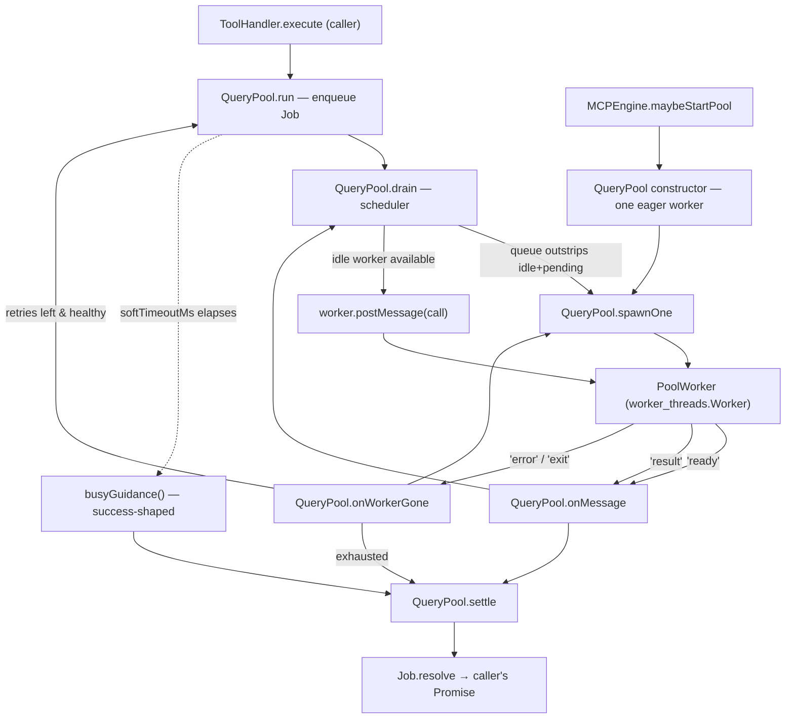

# MCP Query Pool — Worker-Thread Concurrency for Read Tools

## Overview
`QueryPool` exists to solve one specific failure mode of a shared MCP daemon: a
single Node event loop running CPU-heavy graph reads (`codegraph_explore`,
`codegraph_node`, etc.) synchronously will eventually stop servicing its own
transport socket, so a burst of concurrent agent calls looks to clients like a
hang rather than a queue. The pool's answer is not "make queries faster" but
"move them off the thread that owns the transport": it fans read-tool calls out
to a small, elastically-sized set of worker threads (each opening its own
SQLite connection) and multiplexes their results back onto per-call Promises.
The design leans hard into defensive scheduling — workers are grown lazily and
in small batches, crashes are retried and budgeted, and a call that can't be
served promptly is answered with retryable "busy" guidance rather than left to
hang or fail — because the pool's job is to make concurrency *safe*, not just
possible.

## Diagram

## Design rationale (why it's built this way)
The pool is built around three defensive knobs, each guarding a specific
failure it observed or anticipated:

- **Staggered growth, not instant scale-out.** [`MAX_CONCURRENT_SPAWN`](../catalog/src/mcp/query-pool.ts.md#MAX_CONCURRENT_SPAWN) caps
  how many workers can be cold-starting at once, because "a worker's cold
  start is heavy — full module load (tree-sitter etc.) + opening a large WAL
  DB — and starting the whole pool simultaneously thrashes CPU/I-O so badly it
  can stall the daemon's main loop for tens of seconds." Warming a couple at a
  time keeps each start fast while the pool still reaches full size within a
  few calls of a burst — no thundering herd.
- **A circuit breaker, not infinite respawning.** [`CRASH_BUDGET`](../catalog/src/mcp/query-pool.ts.md#CRASH_BUDGET) is the "total
  worker deaths before the pool declares itself unhealthy and the caller
  reverts to in-process dispatch. High enough to ride out a few transient
  crashes, low enough that a systematically-broken worker … degrades quickly
  instead of respawning forever." [`<get>healthy`](../catalog/src/mcp/query-pool.ts.md#QueryPool.-get-healthy) is the boolean the rest of
  the pool (and, per its own doc, the `ToolHandler`) checks before trusting the
  pool with new work.
- **A success-shaped overload response, never a hard failure.** A queued call
  that can't be served within [`softTimeoutMs`](../catalog/src/mcp/query-pool.ts.md#QueryPoolOptions.softTimeoutMs) ("linger before a queued
  call gets busy-guidance. Default 45s") resolves via [`busyGuidance`](../catalog/src/mcp/query-pool.ts.md#busyGuidance), whose
  own doc comment spells out the reason: "Success-shaped overload guidance
  (NEVER [`isError`](../catalog/src/mcp/tools.ts.md#ToolResult.isError) — see the abandonment rule)." An agent that receives an
  error response tends to stop trying a tool altogether, so overload is
  reported as a retryable "wait a moment," not a failure.

Two smaller decisions reinforce testability and safety: [`PoolWorker`](../catalog/src/mcp/query-pool.ts.md#PoolWorker) is "the
minimal worker surface the pool drives — satisfied by a real `worker_threads`
Worker," and [`createWorker`](../catalog/src/mcp/query-pool.ts.md#QueryPoolOptions.createWorker) is a "worker factory (tests inject a fake)" —
together they let the pool's queueing/growth/crash-recovery/backstop logic be
exercised without ever spawning a real thread. And [`root`](../catalog/src/mcp/query-pool.ts.md#QueryPoolOptions.root) — "default project
root each worker opens at spawn" — is fixed per pool: every worker in a given
pool serves the same project.

> [!inferred] The file's own header comment (not a subgraph symbol, so not
> quoted verbatim here) explains the motivating incident: one shared
> synchronous SQLite connection on one event loop meant a wave of ~10
> concurrent `codegraph_explore` calls delivered zero MCP transport heartbeats
> for 25 seconds, and responses couldn't flush until the whole batch drained —
> reading to clients as a hang. Each [`PoolWorker`](../catalog/src/mcp/query-pool.ts.md#PoolWorker) opens its own SQLite
> connection (WAL supports multiple concurrent readers), which is what
> restores true parallelism instead of just moving the same serialization
> problem into a thread.

## Entry points
- [`run`](../catalog/src/mcp/query-pool.ts.md#QueryPool.run) — the pool's only public dispatch method. [`ToolHandler.execute`](../catalog/src/mcp/tools.ts.md#ToolHandler.execute)
  reaches it for CPU-heavy read tools once a pool is attached; its doc promises
  it "always resolves (never rejects)," which is the contract the rest of the
  pool (crash recovery, the soft-timeout backstop) exists to uphold.
- [`<constructor>`](../catalog/src/mcp/query-pool.ts.md#QueryPool.-constructor) — reached once per project, from [`maybeStartPool`](../catalog/src/mcp/engine.ts.md#MCPEngine.maybeStartPool)
  ("start the worker-thread query pool once a default project is open"). It
  resolves every tunable ([`maxSize`](../catalog/src/mcp/query-pool.ts.md#QueryPool.maxSize), [`softTimeoutMs`](../catalog/src/mcp/query-pool.ts.md#QueryPool.softTimeoutMs), [`maxRetries`](../catalog/src/mcp/query-pool.ts.md#QueryPool.maxRetries), [`createWorker`](../catalog/src/mcp/query-pool.ts.md#QueryPool.createWorker))
  and eagerly spawns one warm worker via [`spawnOne`](../catalog/src/mcp/query-pool.ts.md#QueryPool.spawnOne) so the first call never
  pays a full cold-start.
- [`onMessage`](../catalog/src/mcp/query-pool.ts.md#QueryPool.onMessage) and [`onWorkerGone`](../catalog/src/mcp/query-pool.ts.md#QueryPool.onWorkerGone) — asynchronous entry points invoked from the
  event handlers [`spawnOne`](../catalog/src/mcp/query-pool.ts.md#QueryPool.spawnOne) registers via [`on`](../catalog/src/mcp/query-pool.ts.md#PoolWorker.on) (`'message'`, `'error'`,
  `'exit'`) on every [`PoolWorker`](../catalog/src/mcp/query-pool.ts.md#PoolWorker). Control reaches these whenever a worker reports
  progress or dies — they are the pool's only window into worker lifecycle.

## Mechanism (step-by-step)
1. **Construction fixes the pool's shape once.** [`<constructor>`](../catalog/src/mcp/query-pool.ts.md#QueryPool.-constructor) clamps the
   configured [`size`](../catalog/src/mcp/query-pool.ts.md#QueryPoolOptions.size) between 1 and the hard ceiling [`MAX_POOL_SIZE`](../catalog/src/mcp/query-pool.ts.md#MAX_POOL_SIZE) ("hard
   ceiling on pool size regardless of core count / env"), resolves the soft
   timeout, and installs [`createWorker`](../catalog/src/mcp/query-pool.ts.md#QueryPoolOptions.createWorker) (real [`worker_threads`](../catalog/src/mcp/query-pool.ts.md#WORKER_FILE) Worker or a
   test fake), then calls [`spawnOne`](../catalog/src/mcp/query-pool.ts.md#QueryPool.spawnOne) once so the pool is never cold when the
   first job arrives.
2. **`run` turns a call into a `Job` and hands off to the scheduler.** [`run`](../catalog/src/mcp/query-pool.ts.md#QueryPool.run)
   wraps the caller's `resolve` in a [`Job`](../catalog/src/mcp/query-pool.ts.md#Job) record (id, args, `retries: 0`,
   `settled: false`, `enqueuedAt`), arms a [`softTimer`](../catalog/src/mcp/query-pool.ts.md#Job.softTimer) that will fire
   [`busyGuidance`](../catalog/src/mcp/query-pool.ts.md#busyGuidance) through [`settle`](../catalog/src/mcp/query-pool.ts.md#QueryPool.settle) if the job is still unsettled after
   `softTimeoutMs`, pushes the job onto [`queue`](../catalog/src/mcp/query-pool.ts.md#QueryPool.queue), and calls [`drain`](../catalog/src/mcp/query-pool.ts.md#QueryPool.drain). The
   Promise itself never rejects — every path through the pool ends in `resolve`.
3. **`drain` is the whole scheduler, and it does two jobs in sequence.** First
   it grows the pool: while [`queue`](../catalog/src/mcp/query-pool.ts.md#QueryPool.queue) is longer than [`idle`](../catalog/src/mcp/query-pool.ts.md#QueryPool.idle) plus
   [`pendingWorkers`](../catalog/src/mcp/query-pool.ts.md#QueryPool.pendingWorkers) (workers already cold-starting), and the pool is under
   [`maxSize`](../catalog/src/mcp/query-pool.ts.md#QueryPool.maxSize), under [`MAX_CONCURRENT_SPAWN`](../catalog/src/mcp/query-pool.ts.md#MAX_CONCURRENT_SPAWN) simultaneous spawns, and still
   [`<get>healthy`](../catalog/src/mcp/query-pool.ts.md#QueryPool.-get-healthy), it calls [`spawnOne`](../catalog/src/mcp/query-pool.ts.md#QueryPool.spawnOne). Counting *pending* workers toward
   capacity (not just idle ones) is what stops a single call — whose eager
   worker just hasn't reported ready yet — from spawning the entire pool.
   Second, while both an idle worker and a queued job exist, it pops a job
   (skipping any already [`settled`](../catalog/src/mcp/query-pool.ts.md#Job.settled) by the soft-timeout backstop), records it in
   [`inflight`](../catalog/src/mcp/query-pool.ts.md#QueryPool.inflight), and dispatches it with [`postMessage`](../catalog/src/mcp/query-pool.ts.md#PoolWorker.postMessage).
4. **`spawnOne` creates a worker and wires its whole lifecycle up front.**
   Guarded by [`destroyed`](../catalog/src/mcp/query-pool.ts.md#QueryPool.destroyed) and [`maxSize`](../catalog/src/mcp/query-pool.ts.md#QueryPool.maxSize), it calls [`createWorker`](../catalog/src/mcp/query-pool.ts.md#QueryPool.createWorker), adds the
   result to both [`workers`](../catalog/src/mcp/query-pool.ts.md#QueryPool.workers) and [`pendingWorkers`](../catalog/src/mcp/query-pool.ts.md#QueryPool.pendingWorkers), and registers all three
   [`on`](../catalog/src/mcp/query-pool.ts.md#PoolWorker.on) handlers a [`PoolWorker`](../catalog/src/mcp/query-pool.ts.md#PoolWorker) can fire: `'message'` routes to
   [`onMessage`](../catalog/src/mcp/query-pool.ts.md#QueryPool.onMessage), `'error'` and a non-zero `'exit'` both route to
   [`onWorkerGone`](../catalog/src/mcp/query-pool.ts.md#QueryPool.onWorkerGone). If [`createWorker`](../catalog/src/mcp/query-pool.ts.md#QueryPool.createWorker) itself throws, that also counts
   against [`totalCrashes`](../catalog/src/mcp/query-pool.ts.md#QueryPool.totalCrashes) — a platform that can't spawn threads degrades the
   same way a runtime crash does.
5. **`onMessage` is the happy path — a worker reporting ready or done.** A
   `'ready'` [`WorkerMessage`](../catalog/src/mcp/query-pool.ts.md#WorkerMessage) moves the worker from [`pendingWorkers`](../catalog/src/mcp/query-pool.ts.md#QueryPool.pendingWorkers) into
   [`idle`](../catalog/src/mcp/query-pool.ts.md#QueryPool.idle) and re-runs [`drain`](../catalog/src/mcp/query-pool.ts.md#QueryPool.drain) — this is how a worker that was still
   cold-starting when it was counted in step 3 eventually becomes eligible for
   dispatch. A `'result'` message looks the worker up in [`inflight`](../catalog/src/mcp/query-pool.ts.md#QueryPool.inflight),
   returns it to [`idle`](../catalog/src/mcp/query-pool.ts.md#QueryPool.idle) immediately (before the caller is even resolved), calls
   [`settle`](../catalog/src/mcp/query-pool.ts.md#QueryPool.settle) with the [`result`](../catalog/src/mcp/query-pool.ts.md#WorkerMessage.result) (or [`busyGuidance`](../catalog/src/mcp/query-pool.ts.md#busyGuidance) if none was
   sent), and re-drains so the now-idle worker can immediately pick up the next
   queued job.
6. **`onWorkerGone` is the unhappy path — a worker died.** It removes the
   worker from every bookkeeping collection ([`workers`](../catalog/src/mcp/query-pool.ts.md#QueryPool.workers), [`pendingWorkers`](../catalog/src/mcp/query-pool.ts.md#QueryPool.pendingWorkers),
   [`idle`](../catalog/src/mcp/query-pool.ts.md#QueryPool.idle), [`inflight`](../catalog/src/mcp/query-pool.ts.md#QueryPool.inflight)), increments [`totalCrashes`](../catalog/src/mcp/query-pool.ts.md#QueryPool.totalCrashes), and best-effort
   [`terminate`](../catalog/src/mcp/query-pool.ts.md#PoolWorker.terminate)s it. If the pool is still [`healthy`](../catalog/src/mcp/query-pool.ts.md#QueryPool.-get-healthy) it immediately
   [`spawnOne`](../catalog/src/mcp/query-pool.ts.md#QueryPool.spawnOne)s a replacement to keep capacity. Any job that was in flight on the
   dead worker is given one more chance: if its [`retries`](../catalog/src/mcp/query-pool.ts.md#Job.retries) count is under
   [`maxRetries`](../catalog/src/mcp/query-pool.ts.md#QueryPool.maxRetries) and the pool is still healthy, it goes back on the *front* of
   [`queue`](../catalog/src/mcp/query-pool.ts.md#QueryPool.queue) (retried before any other pending work); otherwise [`settle`](../catalog/src/mcp/query-pool.ts.md#QueryPool.settle) resolves
   it as an [`isError`](../catalog/src/mcp/tools.ts.md#ToolResult.isError) crash message. Either way it re-runs [`drain`](../catalog/src/mcp/query-pool.ts.md#QueryPool.drain) at the end.
7. **`settle` is the single choke point every path resolves through.**
   [`settle`](../catalog/src/mcp/query-pool.ts.md#QueryPool.settle) is idempotent on [`Job.settled`](../catalog/src/mcp/query-pool.ts.md#Job.settled): whichever of "worker
   answered" or "soft timer fired" happens first wins, clears the other's
   [`softTimer`](../catalog/src/mcp/query-pool.ts.md#Job.softTimer), and calls [`resolve`](../catalog/src/mcp/query-pool.ts.md#Job.resolve) — this is the mechanism that makes
   [`run`](../catalog/src/mcp/query-pool.ts.md#QueryPool.run)'s "always resolves" promise possible even when a worker never answers.

## Key data structures
- [`Job`](../catalog/src/mcp/query-pool.ts.md#Job) — one queued or in-flight call: [`id`](../catalog/src/mcp/query-pool.ts.md#Job.id), [`toolName`](../catalog/src/mcp/query-pool.ts.md#Job.toolName), [`args`](../catalog/src/mcp/query-pool.ts.md#Job.args), the
  caller's [`resolve`](../catalog/src/mcp/query-pool.ts.md#Job.resolve), a [`retries`](../catalog/src/mcp/query-pool.ts.md#Job.retries) counter, a [`settled`](../catalog/src/mcp/query-pool.ts.md#Job.settled) guard flag,
  [`enqueuedAt`](../catalog/src/mcp/query-pool.ts.md#Job.enqueuedAt) (for the busy-wait message), and the [`softTimer`](../catalog/src/mcp/query-pool.ts.md#Job.softTimer) handle.
- Four separate collections track worker state rather than one status enum:
  [`workers`](../catalog/src/mcp/query-pool.ts.md#QueryPool.workers) (every live worker), [`pendingWorkers`](../catalog/src/mcp/query-pool.ts.md#QueryPool.pendingWorkers) (spawned but not yet
  `'ready'` — counted toward growth capacity so the pool doesn't over-spawn),
  [`idle`](../catalog/src/mcp/query-pool.ts.md#QueryPool.idle) (ready and free), and [`inflight`](../catalog/src/mcp/query-pool.ts.md#QueryPool.inflight) (a `Map` from worker to the
  [`Job`](../catalog/src/mcp/query-pool.ts.md#Job) it's currently running). A worker is in exactly one of `pendingWorkers`,
  `idle`, or a key of `inflight` at any time.
- [`PoolWorker`](../catalog/src/mcp/query-pool.ts.md#PoolWorker) — the minimal surface the pool needs ([`postMessage`](../catalog/src/mcp/query-pool.ts.md#PoolWorker.postMessage), [`terminate`](../catalog/src/mcp/query-pool.ts.md#PoolWorker.terminate),
  [`on`](../catalog/src/mcp/query-pool.ts.md#PoolWorker.on)) — deliberately narrower than the real `Worker` type so tests can supply a fake.
- [`WorkerMessage`](../catalog/src/mcp/query-pool.ts.md#WorkerMessage) — the wire protocol a worker posts back: [`type`](../catalog/src/mcp/query-pool.ts.md#WorkerMessage.type) (`'ready'` or
  `'result'`), [`ok`](../catalog/src/mcp/query-pool.ts.md#WorkerMessage.ok) (only meaningful on `'ready'`), and [`result`](../catalog/src/mcp/query-pool.ts.md#WorkerMessage.result) (only on `'result'`).
- [`QueryPoolOptions`](../catalog/src/mcp/query-pool.ts.md#QueryPoolOptions) — the pool's configuration surface: [`root`](../catalog/src/mcp/query-pool.ts.md#QueryPoolOptions.root), [`size`](../catalog/src/mcp/query-pool.ts.md#QueryPoolOptions.size),
  [`softTimeoutMs`](../catalog/src/mcp/query-pool.ts.md#QueryPoolOptions.softTimeoutMs), [`maxRetries`](../catalog/src/mcp/query-pool.ts.md#QueryPoolOptions.maxRetries), [`createWorker`](../catalog/src/mcp/query-pool.ts.md#QueryPoolOptions.createWorker) — every field but `root`
  is optional and defaulted in the [`<constructor>`](../catalog/src/mcp/query-pool.ts.md#QueryPool.-constructor).

## Dynamics (design intent)
The pool's own thread does no query work at all — [`run`](../catalog/src/mcp/query-pool.ts.md#QueryPool.run), [`drain`](../catalog/src/mcp/query-pool.ts.md#QueryPool.drain),
[`spawnOne`](../catalog/src/mcp/query-pool.ts.md#QueryPool.spawnOne), [`onMessage`](../catalog/src/mcp/query-pool.ts.md#QueryPool.onMessage), and [`onWorkerGone`](../catalog/src/mcp/query-pool.ts.md#QueryPool.onWorkerGone) are all synchronous
bookkeeping; every CPU-heavy step happens inside a [`PoolWorker`](../catalog/src/mcp/query-pool.ts.md#PoolWorker) on another
thread. Ordering favors recency for failures and fairness for everything else:
a crashed job's retry is pushed to the *front* of [`queue`](../catalog/src/mcp/query-pool.ts.md#QueryPool.queue) in
[`onWorkerGone`](../catalog/src/mcp/query-pool.ts.md#QueryPool.onWorkerGone) ("retry promptly"), while normal jobs are FIFO through
[`queue`](../catalog/src/mcp/query-pool.ts.md#QueryPool.queue). Parallelism is bounded twice over — [`maxSize`](../catalog/src/mcp/query-pool.ts.md#QueryPool.maxSize) caps how many
workers can ever exist, and [`MAX_CONCURRENT_SPAWN`](../catalog/src/mcp/query-pool.ts.md#MAX_CONCURRENT_SPAWN) caps how many can be
*starting* at once — so peak concurrency is reached gradually even under a
sudden burst. The [`softTimer`](../catalog/src/mcp/query-pool.ts.md#Job.softTimer) is a wall-clock backstop, not a cancellation:
nothing here can interrupt a worker's synchronous CPU work in progress, so a
job can still be answered twice in effect (busy-guidance first, then the real
result later) — [`settle`](../catalog/src/mcp/query-pool.ts.md#QueryPool.settle)'s `settled` guard is what makes only the first
one observable to the caller.

## Edge cases
- **A worker whose `'ready'` handshake reports failure is still put to work.**
  In [`onMessage`](../catalog/src/mcp/query-pool.ts.md#QueryPool.onMessage), `ok === false` on a `'ready'` [`WorkerMessage`](../catalog/src/mcp/query-pool.ts.md#WorkerMessage) increments
  [`totalCrashes`](../catalog/src/mcp/query-pool.ts.md#QueryPool.totalCrashes) but the worker is still pushed onto [`idle`](../catalog/src/mcp/query-pool.ts.md#QueryPool.idle) and will receive a
  real job on the next [`drain`](../catalog/src/mcp/query-pool.ts.md#QueryPool.drain). Nothing in this subgraph removes it. A reader
  might expect a failed-open worker to be discarded outright.
- **The soft-timeout backstop and a real result can both fire for one job.**
  [`run`](../catalog/src/mcp/query-pool.ts.md#QueryPool.run)'s [`softTimer`](../catalog/src/mcp/query-pool.ts.md#Job.softTimer) can elapse and call [`settle`](../catalog/src/mcp/query-pool.ts.md#QueryPool.settle) with
  [`busyGuidance`](../catalog/src/mcp/query-pool.ts.md#busyGuidance) while the worker is still grinding on the same job (there's no
  way to cancel it); the worker's eventual `'result'` still reaches
  [`onMessage`](../catalog/src/mcp/query-pool.ts.md#QueryPool.onMessage) and calls [`settle`](../catalog/src/mcp/query-pool.ts.md#QueryPool.settle) again, but [`Job.settled`](../catalog/src/mcp/query-pool.ts.md#Job.settled) makes
  the second call a no-op — the caller only ever sees the first answer.
- **`onWorkerGone` can be invoked twice for the same death.** A worker can fire
  both `'error'` and a non-zero `'exit'`; the guard `if (!this.workers.has(w))
  return` at the top of [`onWorkerGone`](../catalog/src/mcp/query-pool.ts.md#QueryPool.onWorkerGone) makes the second call a no-op instead
  of double-counting the crash or double-requeuing the job.
- **A crash storm silently stops the pool from helping.** Once [`totalCrashes`](../catalog/src/mcp/query-pool.ts.md#QueryPool.totalCrashes)
  reaches [`CRASH_BUDGET`](../catalog/src/mcp/query-pool.ts.md#CRASH_BUDGET), [`<get>healthy`](../catalog/src/mcp/query-pool.ts.md#QueryPool.-get-healthy) goes false: [`drain`](../catalog/src/mcp/query-pool.ts.md#QueryPool.drain) stops
  growing the pool and [`onWorkerGone`](../catalog/src/mcp/query-pool.ts.md#QueryPool.onWorkerGone) stops retrying crashed jobs even if
  [`maxRetries`](../catalog/src/mcp/query-pool.ts.md#QueryPool.maxRetries) headroom remains — every subsequent job in flight on a dying
  worker fails outright rather than retrying.
- **Configured `size` is clamped twice.** [`MAX_POOL_SIZE`](../catalog/src/mcp/query-pool.ts.md#MAX_POOL_SIZE) applies in the
  [`<constructor>`](../catalog/src/mcp/query-pool.ts.md#QueryPool.-constructor) regardless of the [`size`](../catalog/src/mcp/query-pool.ts.md#QueryPoolOptions.size) option or core count passed in —
  a caller cannot exceed 16 workers even by explicit configuration.

## Open questions
- This packet's seeds ([`<constructor>`](../catalog/src/mcp/query-pool.ts.md#QueryPool.-constructor), [`drain`](../catalog/src/mcp/query-pool.ts.md#QueryPool.drain), [`onWorkerGone`](../catalog/src/mcp/query-pool.ts.md#QueryPool.onWorkerGone), [`run`](../catalog/src/mcp/query-pool.ts.md#QueryPool.run)) scope
  it to the dispatch loop; the real source also defines an async shutdown
  method (terminating live workers and settling any outstanding queue/inflight
  jobs) that isn't part of this subgraph, so pool teardown and its interaction
  with the [`destroyed`](../catalog/src/mcp/query-pool.ts.md#QueryPool.destroyed) flag aren't documented here.
- The env-var-driven pool-size resolution that [`maybeStartPool`](../catalog/src/mcp/engine.ts.md#MCPEngine.maybeStartPool) uses before
  constructing the pool lives in a helper this subgraph doesn't include, so the
  exact precedence between an env override and the [`<constructor>`](../catalog/src/mcp/query-pool.ts.md#QueryPool.-constructor)'s own
  `cores - 1` default isn't grounded here beyond the double-clamp noted above.
- The worker side of the protocol (how a spawned process turns a `'call'`
  message into a `'result'`, and how it degrades a failed project open into a
  real per-job error rather than silence) lives in a sibling module outside
  this packet's subgraph, so the pool's crash-recovery guarantees are only
  documented here from the scheduler's half of the contract.
- No test in the configured test paths references this subgraph, so the
  crash-recovery, backstop, and growth-throttling behavior described above is
  grounded in source reading, not in observed test assertions.

## See also
- [MCP Tool Surface](mcp-tools.ts.md) — `ToolHandler.execute` is this pool's caller; it decides per-call whether to run in-process or hand off to `run`.
- [MCP Transport](mcp-transport.ts.md) — the stdio JSON-RPC transport this pool exists to keep responsive under concurrent load.
- [MCP Daemon](mcp-daemon.ts.md) — the long-lived process that owns one `QueryPool` per open project.
- [Parse Pool](extraction-parse-pool.ts.md) — a sibling worker-thread pool for the extraction pipeline; compare its growth/crash-recovery choices to this one's.
