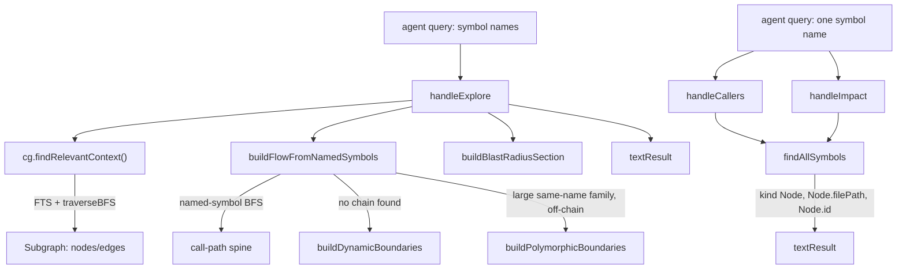

# The MCP tool surface — explore, callers, impact

## Overview
`mcp-tools.ts` is the only part of codegraph an agent ever actually talks to: every other
module (extraction, resolution, the SQLite-backed graph) exists to make this file's answers
correct. The key design idea is that the tools are not a thin RPC wrapper over the graph —
they are a **second retrieval-and-formatting layer** that decides *what subset of the graph
is worth an agent's context budget* and shapes it so the agent can stop calling tools and
start editing. [`handleExplore`](../catalog/src/mcp/tools.ts.md#ToolHandler.handleExplore)
is the flagship: it turns a bag of symbol names into a call-flow narrative plus the verbatim
source the agent would otherwise have Read one file at a time.
[`handleCallers`](../catalog/src/mcp/tools.ts.md#ToolHandler.handleCallers) and
[`handleImpact`](../catalog/src/mcp/tools.ts.md#ToolHandler.handleImpact) are the sharper,
cheaper instruments for "who calls this" / "what breaks if I change this," and both share
[`findAllSymbols`](../catalog/src/mcp/tools.ts.md#ToolHandler.findAllSymbols)'s answer to a
problem every real codebase has: a name is not a symbol — `UserService` exists once per
monorepo app, `execute` exists on every `Command` subclass.

## Diagram

## Design rationale (why it's built this way)
- **The tool adapts to the agent, not the other way around.** The author's docstring on
  [`buildFlowFromNamedSymbols`](../catalog/src/mcp/tools.ts.md#ToolHandler.buildFlowFromNamedSymbols)
  states the premise directly: "an agent's codegraph_explore query is a bag of symbol names
  that usually spans the flow it's investigating." Rather than asking the agent to phrase a
  query differently or call a different tool, `handleExplore` extracts whatever names *are*
  in the query and does the disambiguation/ranking work itself.
- **A name collision is the default case, not an edge case.** [`handleCallers`](../catalog/src/mcp/tools.ts.md#ToolHandler.handleCallers)
  and [`handleImpact`](../catalog/src/mcp/tools.ts.md#ToolHandler.handleImpact) both route
  every lookup through [`findAllSymbols`](../catalog/src/mcp/tools.ts.md#ToolHandler.findAllSymbols),
  whose docstring says it's "used by callers/callees/impact to aggregate" — and both then
  branch on whether the aggregate resolved to one definition or several *distinct* ones
  (source comments tag this "#764"), producing one report per definition instead of silently
  merging unrelated same-named classes into a single misleading blast radius.
  > [!inferred] The "#764" / "#687" / "#1046" / "#1064" markers throughout this file read as
  > issue-tracker references driving iterative tuning; the source doesn't explain what those
  > issues said, only what changed because of them.
- **Static analysis stops at the point of dynamic dispatch — so name the stopping point.**
  [`buildDynamicBoundaries`](../catalog/src/mcp/tools.ts.md#ToolHandler.buildDynamicBoundaries)'s
  docstring is explicit that its job is not to guess an edge: "The answer to 'how does A
  reach B' when no static path exists IS the dispatch site: that's where the flow continues
  at runtime." Rather than silently returning an incomplete chain, the tool surfaces the
  exact call site and, via [`buildPolymorphicBoundaries`](../catalog/src/mcp/tools.ts.md#ToolHandler.buildPolymorphicBoundaries),
  the candidate concrete implementations reachable through interface/registry dispatch.
- **Output is sized to the answer, not to the graph.** [`getExploreOutputBudget`](../catalog/src/mcp/tools.ts.md#getExploreOutputBudget)
  scales the character/file ceiling with indexed file count, and its comment records the
  reasoning: response size must stay under the host's inline tool-result cap, because
  crossing it means the MCP host externalizes the result to a file the agent then has to
  Read back — "exactly what a 35K vscode explore did," reintroducing the read the tool
  exists to avoid.
- **A success-shaped response beats a failure.** Every method in the subgraph that hits an
  ordinary "not found" condition — [`handleCallers`](../catalog/src/mcp/tools.ts.md#ToolHandler.handleCallers)
  when [`findAllSymbols`](../catalog/src/mcp/tools.ts.md#ToolHandler.findAllSymbols) returns
  nothing, [`handleExplore`](../catalog/src/mcp/tools.ts.md#ToolHandler.handleExplore) when
  the subgraph is empty — returns through [`textResult`](../catalog/src/mcp/tools.ts.md#ToolHandler.textResult)
  with an explanatory string, never an error flag.
  > [!inferred] The repo's own engineering notes (not part of this subgraph) frame this as
  deliberate: an early `isError` response teaches the agent to stop calling the tool
  altogether, so only genuine security refusals or malfunctions use that path.

## Entry points
- [`handleExplore`](../catalog/src/mcp/tools.ts.md#ToolHandler.handleExplore) — the primary,
  highest-traffic tool (`codegraph_explore`). Control reaches it with a free-text query that
  is treated as a mix of natural language and named symbols; it is the only entry point that
  both searches the graph *and* reads and renders verbatim source.
- [`handleCallers`](../catalog/src/mcp/tools.ts.md#ToolHandler.handleCallers) — `codegraph_callers`,
  reached with a single `symbol` argument; answers "who calls this" as a flat or
  per-definition list of caller [`Node`](../catalog/src/types.ts.md#Node)s, no source bodies.
- [`handleImpact`](../catalog/src/mcp/tools.ts.md#ToolHandler.handleImpact) — `codegraph_impact`,
  reached with `symbol` and an optional traversal `depth`; answers "what breaks if I change
  this" by merging the transitive callers/callees radius of every matching definition.

## Mechanism (step-by-step)
1. **Explore resolves the query against the graph, twice, two different ways.** [`handleExplore`](../catalog/src/mcp/tools.ts.md#ToolHandler.handleExplore)
   first calls the context layer's [`findRelevantContext`](../catalog/src/context/index.ts.md#ContextBuilder.findRelevantContext) —
   a hybrid FTS/name search seeded outward with [`traverseBFS`](../catalog/src/graph/traversal.ts.md#GraphTraverser.traverseBFS) —
   to gather a broad, relevance-ranked set of candidate [`Node`](../catalog/src/types.ts.md#Node)s
   into its [`nodes`](../catalog/src/types.ts.md#Subgraph.nodes) map, alongside [`Edge`](../catalog/src/types.ts.md#Edge)s.
   In parallel it treats the same query as a literal list of symbol names and resolves each
   one directly, so a lower-frequency name that would rank below the FTS cutoff still lands
   in the result — the two passes cover "vague natural language" and "precise symbol bag"
   without asking the agent to pick a mode.
2. **A second pass turns the named symbols into a story.** [`buildFlowFromNamedSymbols`](../catalog/src/mcp/tools.ts.md#ToolHandler.buildFlowFromNamedSymbols)
   takes the same query text, resolves each token to its callable [`Node`](../catalog/src/types.ts.md#Node)s
   (disambiguating an overloaded simple name by requiring its container class also appear in
   the query), then breadth-first-searches the call graph from each named symbol looking for
   a path that lands on *another* named symbol — allowing at most one un-named "bridge" hop
   so it never wanders off into an unrelated function's fan-out. A successful path becomes the
   "Flow" section prepended to the whole response; a failed search falls through to boundary
   detection (next step) instead of silently returning nothing.
3. **When the flow breaks, the break itself becomes the answer.** If no chain connects the
   named symbols, [`buildDynamicBoundaries`](../catalog/src/mcp/tools.ts.md#ToolHandler.buildDynamicBoundaries)
   reads the source body of the disconnected [`Node`](../catalog/src/types.ts.md#Node)s (via
   their [`startLine`](../catalog/src/types.ts.md#Node.startLine)/[`endLine`](../catalog/src/types.ts.md#Node.endLine))
   and scans it with [`scanDynamicDispatch`](../catalog/src/mcp/dynamic-boundaries.ts.md#scanDynamicDispatch)
   (itself built on [`stripCommentsForRegex`](../catalog/src/resolution/strip-comments.ts.md#stripCommentsForRegex)
   so comments don't spuriously match) for computed-member calls, `getattr`, and similar
   dynamic-dispatch idioms; when it finds a runtime-chosen key, [`boundaryCandidates`](../catalog/src/mcp/tools.ts.md#ToolHandler.boundaryCandidates)
   shortlists plausible concrete targets by name-matching convention (`onFoo`, `handleFoo`,
   `FooHandler`). Separately, [`buildPolymorphicBoundaries`](../catalog/src/mcp/tools.ts.md#ToolHandler.buildPolymorphicBoundaries)
   catches the case where a named method resolves to a *large* same-name family (an
   interface/registry dispatch) that never lands on the chain — it looks up each candidate's
   containing type and its `implements`/`extends` targets to find a shared supertype with
   enough implementers to count as genuine polymorphism, then names that supertype and a
   sample of its implementers as the likely runtime targets.
4. **Everything the agent asked about, plus what depends on it.** Before rendering source,
   [`handleExplore`](../catalog/src/mcp/tools.ts.md#ToolHandler.handleExplore) calls
   [`buildBlastRadiusSection`](../catalog/src/mcp/tools.ts.md#ToolHandler.buildBlastRadiusSection),
   which takes the subgraph's root [`Node`](../catalog/src/types.ts.md#Node)s and looks up
   their callers, reporting caller file counts and whether any of those callers live in a
   test file — a compact "what to verify before editing this" appended unconditionally, with
   no separate tool call required.
5. **Callers, callees, and impact all answer "which definition" before answering the actual
   question.** [`handleCallers`](../catalog/src/mcp/tools.ts.md#ToolHandler.handleCallers) and
   [`handleImpact`](../catalog/src/mcp/tools.ts.md#ToolHandler.handleImpact) both start by
   calling [`findAllSymbols`](../catalog/src/mcp/tools.ts.md#ToolHandler.findAllSymbols) —
   which searches by name and, for a qualified query, retries on just the tail segment — to
   collect every matching [`Node`](../catalog/src/types.ts.md#Node), down-ranking matches in
   generated files via [`isGeneratedFile`](../catalog/src/extraction/generated-detection.ts.md#isGeneratedFile)
   so a hand-written definition outranks protobuf scaffolding of the same name. The caller
   groups the matches into distinct definitions (by file), and only then walks
   callers/impact per group — a single flat report for one definition, one section per
   definition when there are several.
6. **Every response is a plain success-shaped string.** Regardless of path, every handler in
   this subgraph terminates by handing its formatted string to [`textResult`](../catalog/src/mcp/tools.ts.md#ToolHandler.textResult),
   which wraps it in the MCP [`ToolResult`](../catalog/src/mcp/tools.ts.md#ToolResult) content
   shape — the uniform contract the rest of the MCP layer (and the calling agent) can rely on.

## Key data structures
- [`Node`](../catalog/src/types.ts.md#Node) / [`Edge`](../catalog/src/types.ts.md#Edge) — the
  only currency these tools trade in. A `Node` carries [`id`](../catalog/src/types.ts.md#Node.id)
  (a hash of file path + qualified name), [`kind`](../catalog/src/types.ts.md#Node.kind),
  [`name`](../catalog/src/types.ts.md#Node.name), [`qualifiedName`](../catalog/src/types.ts.md#Node.qualifiedName),
  [`filePath`](../catalog/src/types.ts.md#Node.filePath), [`language`](../catalog/src/types.ts.md#Node.language),
  and line/column span; an `Edge` carries [`source`](../catalog/src/types.ts.md#Edge.source),
  [`target`](../catalog/src/types.ts.md#Edge.target), [`kind`](../catalog/src/types.ts.md#Edge.kind),
  optional call-site [`line`](../catalog/src/types.ts.md#Edge.line), optional
  [`metadata`](../catalog/src/types.ts.md#Edge.metadata), and [`provenance`](../catalog/src/types.ts.md#Edge.provenance) —
  `'tree-sitter' | 'scip' | 'heuristic'`. A `heuristic`-provenance edge is a synthesized
  dynamic-dispatch link (the packet calls this a `(virtual)` edge — a recovered
  base↔override or dispatcher↔handler connection, not a static call) and is exactly what
  `buildFlowFromNamedSymbols`'s flow spine and dynamic-boundary sections are built to surface
  and label distinctly from an ordinary call.
- `ExploreOutputBudget` (returned by [`getExploreOutputBudget`](../catalog/src/mcp/tools.ts.md#getExploreOutputBudget)) —
  a tier of output-shaping knobs (max total chars, max files, max chars per file, whether to
  include the relationships/budget-note sections) keyed to the indexed project's file count,
  so a 100-file repo and a 15,000-file repo get proportionally different-sized answers from
  the same code path.
- [`CodeGraph`](../catalog/src/index.ts.md#CodeGraph) — every handler's first move is
  [`getCodeGraph`](../catalog/src/mcp/tools.ts.md#ToolHandler.getCodeGraph), which resolves a
  `projectPath` (or the session default) to a live `CodeGraph` instance; its
  [`queries`](../catalog/src/index.ts.md#CodeGraph.queries) property is the query layer that
  ultimately runs SQL via [`db`](../catalog/src/db/queries.ts.md#QueryBuilder.db) /
  [`prepare`](../catalog/src/db/sqlite-adapter.ts.md#SqliteDatabase.prepare), exposes name/text
  search through [`searchNodes`](../catalog/src/db/queries.ts.md#QueryBuilder.searchNodes),
  and turns raw rows back into `Node`s with [`rowToNode`](../catalog/src/db/queries.ts.md#rowToNode).

## Dynamics (design intent)
- [`getCodeGraph`](../catalog/src/mcp/tools.ts.md#ToolHandler.getCodeGraph)'s comments
  describe always re-resolving the nearest `.codegraph/` root from the input path on every
  call, rather than trusting a cached resolution — the stated reason is that a long-lived MCP
  server process must notice a git worktree that gained its own `.codegraph/` after the
  server first resolved it up to the parent checkout, and the DB connection itself is still
  cached by resolved root so re-resolving only costs a cheap stat walk, not a reopen.
- [`buildFlowFromNamedSymbols`](../catalog/src/mcp/tools.ts.md#ToolHandler.buildFlowFromNamedSymbols)'s
  breadth-first search is bounded (a node cap and a maximum hop count) precisely so a single
  `codegraph_explore` call stays fast even though it is, in effect, searching the whole call
  graph from up to eight seed symbols simultaneously.

## Edge cases
- **A symbol name resolves to nothing.** [`handleCallers`](../catalog/src/mcp/tools.ts.md#ToolHandler.handleCallers)
  and [`handleImpact`](../catalog/src/mcp/tools.ts.md#ToolHandler.handleImpact) both check
  [`findAllSymbols`](../catalog/src/mcp/tools.ts.md#ToolHandler.findAllSymbols)'s result for
  emptiness and return a plain "not found" [`textResult`](../catalog/src/mcp/tools.ts.md#ToolHandler.textResult)
  rather than an error — the caller still gets a well-formed response to reason from.
- **The query resolves to fewer than two named symbols.** [`buildFlowFromNamedSymbols`](../catalog/src/mcp/tools.ts.md#ToolHandler.buildFlowFromNamedSymbols)
  can't build a chain from a single anchor, so it falls back to reporting any synthesized
  (`heuristic`-[`provenance`](../catalog/src/types.ts.md#Edge.provenance)) edges touching that
  one symbol, or the dynamic-boundary scan on it, before giving up entirely.
- **A same-named family is large but genuinely just overloads, not polymorphism.** [`buildPolymorphicBoundaries`](../catalog/src/mcp/tools.ts.md#ToolHandler.buildPolymorphicBoundaries)
  requires both a minimum implementer count on the candidate supertype and a minimum number
  of sampled definers that actually share it, specifically to avoid mistaking an ordinary
  overload set for a registry/plugin dispatch.
- **A matching definition sits in a generated file.** [`findAllSymbols`](../catalog/src/mcp/tools.ts.md#ToolHandler.findAllSymbols)
  uses [`isGeneratedFile`](../catalog/src/extraction/generated-detection.ts.md#isGeneratedFile)
  to sort generated-file matches after hand-written ones with the same name, so a query
  against a protobuf-scaffolded type name still surfaces the hand-written implementation
  first.

## Open questions
- The packet's subgraph does not include the tool registration/schema layer (where
  `codegraph_explore` / `codegraph_callers` / `codegraph_impact` are wired to their JSON
  schemas and descriptions) or the dispatch method that routes an incoming MCP call to
  `handleExplore` et al. — that wiring clearly exists (the docstrings name the tool by its
  `codegraph_*` id) but isn't grounded here.
- `findRelevantContext`'s own internal scoring/co-location-boost logic is outside this
  subgraph; only its signature and its use of `traverseBFS` are visible from `mcp-tools.ts`'s
  side of the call.
- `handleCallees` (the callees counterpart to `handleCallers`) is not in this subgraph even
  though it clearly exists in the same file with a near-identical shape — its role in the
  overall tool surface isn't grounded here.

## See also
- [The Node/Edge graph model](types.ts.md) — the data model every method documented here
  reads and traverses.
- [Top-level CodeGraph orchestration API](index.ts.md) — the `CodeGraph` class whose methods
  (`findRelevantContext`, `getCallers`, `getImpactRadius`, `getStats`) these handlers call.
- [QueryBuilder: SQL query layer over the graph](db-queries.ts.md) — the SQLite layer
  underneath `CodeGraph.queries`, reached indirectly on every tool call.
- [~30 framework heuristics synthesizing dispatcher→handler edges](resolution-callback-synthesizer.ts.md) —
  the source of the `heuristic`-provenance edges that `buildFlowFromNamedSymbols` and
  `synthEdgeNote` surface as dynamic-dispatch links.
