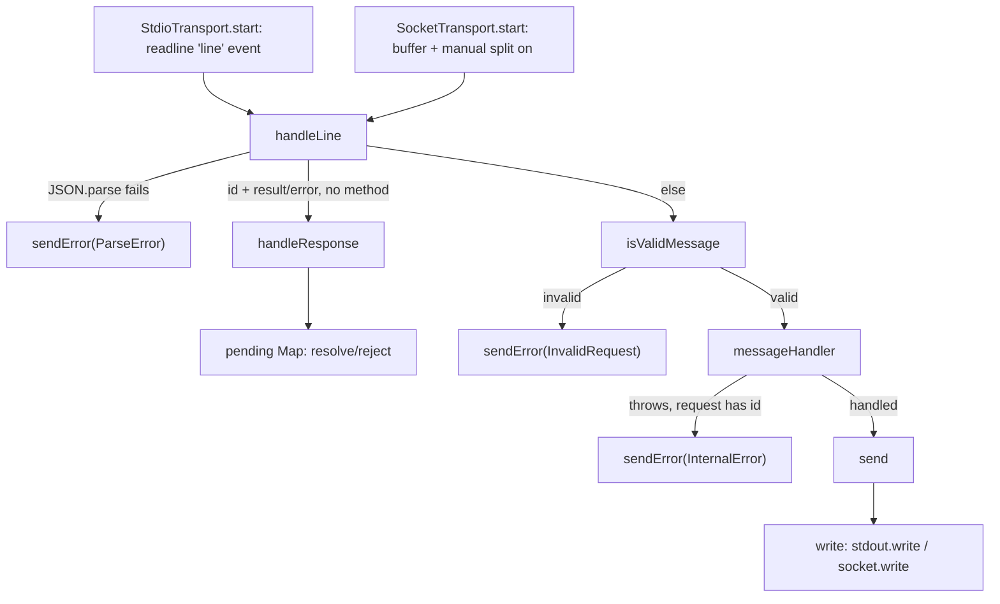

# MCP JSON-RPC transport — newline-delimited framing over stdio and socket

## Overview
`transport.ts` is the seam between "bytes on a stream" and "MCP protocol semantics," and it
deliberately knows nothing about the latter — no mention of `initialize`, tools, or the graph
lives here. Its one job is turning a byte stream into decoded JSON-RPC 2.0 messages and back,
in a way that's identical whether the bytes come from a single agent's stdin/stdout (direct
mode) or from one of several sockets multiplexed onto a shared, warm daemon process. The key
design idea is a single abstract base,
[`handleLine`](../catalog/src/mcp/transport.ts.md#LineBasedJsonRpcTransport.handleLine)'s
owner `LineBasedJsonRpcTransport`, that both carriers extend — so everything above the
transport (the session/tool-dispatch logic) programs against the `JsonRpcTransport` interface's
[`start`](../catalog/src/mcp/transport.ts.md#JsonRpcTransport.start) contract only, and never
needs to know or care which carrier is live. It is also quietly bidirectional: the
server can initiate its own request to the client (used elsewhere for `roots/list`) and this
file supplies the half of that machinery that resolves the eventual reply.

## Diagram

## Design rationale (why it's built this way)
- **One protocol implementation, two carriers.** The file's own header doc says it plainly:
  stdio and socket "share the same wire format (newline-delimited JSON-RPC 2.0)" and "both
  implement `JsonRpcTransport`... so the session-level protocol logic... is identical
  regardless of where the bytes come from" — concretely, both carriers satisfy the same
  [`start`](../catalog/src/mcp/transport.ts.md#JsonRpcTransport.start) contract, and
  [`handleLine`](../catalog/src/mcp/transport.ts.md#LineBasedJsonRpcTransport.handleLine),
  [`sendError`](../catalog/src/mcp/transport.ts.md#LineBasedJsonRpcTransport.sendError), and
  [`send`](../catalog/src/mcp/transport.ts.md#LineBasedJsonRpcTransport.send) are written once
  in the shared base; only line-splitting and byte-writing
  ([`write`](../catalog/src/mcp/transport.ts.md#StdioTransport.write) vs.
  [`write`](../catalog/src/mcp/transport.ts.md#SocketTransport.write)) differ per carrier.
- **A response-shaped line is not an error, even though it has no `method`.** In
  [`handleLine`](../catalog/src/mcp/transport.ts.md#LineBasedJsonRpcTransport.handleLine), a
  line with `id` plus `result`/`error` but no `method` is routed to
  [`handleResponse`](../catalog/src/mcp/transport.ts.md#LineBasedJsonRpcTransport.handleResponse)
  before the general validity check ever runs. A trailing comment in the source records why
  this branch exists at all: such lines "used to be dropped as 'Invalid Request' because they
  carry no method" — i.e. the server-initiated-request path silently failed to receive its
  own replies until this special case was added.
- **Readline for stdio, manual buffering for sockets — because the two streams don't chunk the
  same way.** `StdioTransport` hands framing to Node's `readline` module via its
  [`rl`](../catalog/src/mcp/transport.ts.md#StdioTransport.rl) property, which already
  guarantees one callback per line. A raw `net.Socket`'s `'data'` event carries arbitrary
  chunk boundaries with no such guarantee, so `SocketTransport`'s
  [`start`](../catalog/src/mcp/transport.ts.md#SocketTransport.start) instead accumulates
  chunks into a private buffer and repeatedly slices off everything up to the next `\n`,
  leaving a partial tail for the next chunk.
- **The socket path deliberately does not await each line's handler.** Still inside
  [`start`](../catalog/src/mcp/transport.ts.md#SocketTransport.start), the per-line dispatch is
  `void this.handleLine(line)` rather than `await`ed, and the comment explains the tradeoff:
  "JSON-RPC permits out-of-order responses, and serializing here would deadlock if a handler
  issued a server-initiated request that needed a *later* line to arrive (e.g. `roots/list`
  mid-`tools/call`)." Awaiting per line would make the bidirectional request/response pattern
  (the `pending`-map machinery below) unsafe to use from inside a handler.
- **`exitOnClose` exists because "the process" and "the session" stopped being the same thing.**
  [`StdioTransportOptions`](../catalog/src/mcp/transport.ts.md#StdioTransportOptions)'s
  [`exitOnClose`](../catalog/src/mcp/transport.ts.md#StdioTransportOptions.exitOnClose) field
  docstring says it directly: default `true` matches "the original single-process behavior,"
  but shared-daemon mode sets it `false` because "the stdio 'session' is just *one* of many
  clients — losing it shouldn't drag the daemon down." The paired
  [`onClose`](../catalog/src/mcp/transport.ts.md#StdioTransportOptions.onClose) callback lets
  the daemon decrement a connected-clients count instead of exiting.
- **A stdin `'error'` is treated as terminal, not ignored, because of a specific host quirk.**
  `StdioTransport`'s [`start`](../catalog/src/mcp/transport.ts.md#StdioTransport.start) listens
  for `process.stdin.on('error', ...)` in addition to readline's normal `'close'`, with a
  comment tracing this to issue #799: a socket-backed stdin (the shape VS Code uses) can fail
  with `ECONNRESET`/hangup as an `'error'` that readline never surfaces as `'close'` — left
  unhandled, that escalated to the global uncaught-exception handler and orphaned the server,
  busy-spinning a POLLHUP file descriptor at 100% CPU on Linux.

## Entry points
- [`start`](../catalog/src/mcp/transport.ts.md#StdioTransport.start) — reached when the MCP
  host launches codegraph in direct/stdio mode, or when the shared daemon's own launcher
  process keeps a stdio session open with `exitOnClose: false`; wires a `readline` interface
  over `process.stdin`/`process.stdout` via [`rl`](../catalog/src/mcp/transport.ts.md#StdioTransport.rl)
  and [`opts`](../catalog/src/mcp/transport.ts.md#StdioTransport.opts).
- [`start`](../catalog/src/mcp/transport.ts.md#SocketTransport.start) — reached once per
  accepted connection when several MCP clients multiplex onto one warm daemon process; wires
  raw `'data'`/`'close'`/`'error'` handlers directly on the underlying socket.
- [`start`](../catalog/src/mcp/transport.ts.md#JsonRpcTransport.start) and
  [`sendError`](../catalog/src/mcp/transport.ts.md#JsonRpcTransport.sendError) — the two
  methods of the shared interface that the session layer actually calls; everything above this
  file (e.g. `session.ts`'s message dispatch) programs against these, never against a concrete
  transport class.
- [`handleLine`](../catalog/src/mcp/transport.ts.md#LineBasedJsonRpcTransport.handleLine) — the
  single line-decode entry both concrete `start()` implementations funnel every raw line into,
  regardless of carrier.

## Mechanism (step-by-step)
1. **A raw stream becomes discrete lines, by two different means.** `StdioTransport`'s
   [`start`](../catalog/src/mcp/transport.ts.md#StdioTransport.start) delegates line-splitting
   to its [`rl`](../catalog/src/mcp/transport.ts.md#StdioTransport.rl) `readline.Interface`,
   which fires one `'line'` event per input line. `SocketTransport`'s
   [`start`](../catalog/src/mcp/transport.ts.md#SocketTransport.start) instead appends every
   `'data'` chunk to an internal buffer and loops, slicing off each complete line up to the
   next `\n` and leaving any incomplete tail for the following chunk — the difference exists
   because sockets, unlike `readline`, give no line-boundary guarantee per chunk.
2. **Every line, from either carrier, is decoded and error-checked in one place.**
   [`handleLine`](../catalog/src/mcp/transport.ts.md#LineBasedJsonRpcTransport.handleLine)
   trims the line, ignores it if blank, and `JSON.parse`s it; a parse failure calls
   [`sendError`](../catalog/src/mcp/transport.ts.md#LineBasedJsonRpcTransport.sendError) with
   [`ErrorCodes`](../catalog/src/mcp/transport.ts.md#ErrorCodes)`.ParseError` and returns —
   one bad line never aborts the whole session.
3. **The decoded object is classified before it's trusted as a request.**
   [`handleLine`](../catalog/src/mcp/transport.ts.md#LineBasedJsonRpcTransport.handleLine)
   first checks whether the shape looks like a *reply* to a request the server itself sent
   (an `id` plus `result`/`error`, but no `method`); if so it goes straight to
   [`handleResponse`](../catalog/src/mcp/transport.ts.md#LineBasedJsonRpcTransport.handleResponse),
   which looks the `id` up in the
   [`pending`](../catalog/src/mcp/transport.ts.md#LineBasedJsonRpcTransport.pending) map and
   resolves or rejects the matching promise. Anything else is checked by
   [`isValidMessage`](../catalog/src/mcp/transport.ts.md#LineBasedJsonRpcTransport.isValidMessage)
   (must carry `jsonrpc: '2.0'` and a string `method`); a failure there sends
   `InvalidRequest` via [`sendError`](../catalog/src/mcp/transport.ts.md#LineBasedJsonRpcTransport.sendError).
4. **A valid message is handed to whatever the transport's owner installed.** The surviving
   message is cast to a [`JsonRpcRequest`](../catalog/src/mcp/transport.ts.md#JsonRpcRequest)
   or [`JsonRpcNotification`](../catalog/src/mcp/transport.ts.md#JsonRpcNotification) and
   passed to the transport's stored
   [`messageHandler`](../catalog/src/mcp/transport.ts.md#LineBasedJsonRpcTransport.messageHandler) —
   a [`MessageHandler`](../catalog/src/mcp/transport.ts.md#MessageHandler)-typed callback set
   by whoever called `start()`. This is the file's real decoupling point: `transport.ts` never
   names `initialize` or `tools/call` itself; that dispatch table lives one layer up, in
   `session.ts`'s
   [`handleMessage`](../catalog/src/mcp/session.ts.md#MCPSession.handleMessage), which switches
   on `method` to [`handleInitialize`](../catalog/src/mcp/session.ts.md#MCPSession.handleInitialize),
   [`handleToolsList`](../catalog/src/mcp/session.ts.md#MCPSession.handleToolsList), and
   [`handleToolsCall`](../catalog/src/mcp/session.ts.md#MCPSession.handleToolsCall) — all of
   which take the same [`JsonRpcRequest`](../catalog/src/mcp/transport.ts.md#JsonRpcRequest)
   shape this file defines.
5. **A handler failure is converted back into a wire-level error, but only if there's someone
   to answer.** If `messageHandler` throws while processing a request that carries an
   [`id`](../catalog/src/mcp/transport.ts.md#JsonRpcRequest.id),
   [`handleLine`](../catalog/src/mcp/transport.ts.md#LineBasedJsonRpcTransport.handleLine)
   catches it and calls
   [`sendError`](../catalog/src/mcp/transport.ts.md#LineBasedJsonRpcTransport.sendError) with
   [`ErrorCodes`](../catalog/src/mcp/transport.ts.md#ErrorCodes)`.InternalError`; a thrown error
   from a `method`-only notification (no `id`) has nowhere to be addressed and is not reported
   back over the wire at all.
6. **Every outbound message, success or error, funnels through the same two calls.**
   [`send`](../catalog/src/mcp/transport.ts.md#LineBasedJsonRpcTransport.send) serializes a
   [`JsonRpcResponse`](../catalog/src/mcp/transport.ts.md#JsonRpcResponse) with
   `JSON.stringify` and calls the carrier's own
   [`write`](../catalog/src/mcp/transport.ts.md#LineBasedJsonRpcTransport.write); concretely
   that's [`write`](../catalog/src/mcp/transport.ts.md#StdioTransport.write) writing a
   newline-terminated line to `process.stdout`, or
   [`write`](../catalog/src/mcp/transport.ts.md#SocketTransport.write) writing to the socket
   (guarded by a `destroyed` check so a write after close is a silent no-op rather than a
   crash).

## Key data structures
- [`JsonRpcRequest`](../catalog/src/mcp/transport.ts.md#JsonRpcRequest) /
  [`JsonRpcNotification`](../catalog/src/mcp/transport.ts.md#JsonRpcNotification) — the two
  inbound shapes; a request carries an
  [`id`](../catalog/src/mcp/transport.ts.md#JsonRpcRequest.id) that a reply must echo, a
  notification does not. [`JsonRpcResponse`](../catalog/src/mcp/transport.ts.md#JsonRpcResponse)
  is the outbound counterpart, carrying its own
  [`id`](../catalog/src/mcp/transport.ts.md#JsonRpcResponse.id) (nullable, for errors that
  precede knowing the id), [`jsonrpc`](../catalog/src/mcp/transport.ts.md#JsonRpcResponse.jsonrpc),
  and mutually-exclusive `result`/[`error`](../catalog/src/mcp/transport.ts.md#JsonRpcResponse.error)
  fields, the latter shaped like
  [`JsonRpcError`](../catalog/src/mcp/transport.ts.md#JsonRpcError).
- [`ErrorCodes`](../catalog/src/mcp/transport.ts.md#ErrorCodes) — the standard JSON-RPC 2.0
  numeric error codes (`ParseError`, `InvalidRequest`, `MethodNotFound`, `InvalidParams`,
  `InternalError`) that every
  [`sendError`](../catalog/src/mcp/transport.ts.md#LineBasedJsonRpcTransport.sendError) call in
  this file picks from.
- [`pending`](../catalog/src/mcp/transport.ts.md#LineBasedJsonRpcTransport.pending) — a `Map`
  from an outstanding server-initiated request's id to its `resolve`/`reject` pair. It is the
  half of the bidirectional-request machinery this packet grounds:
  [`handleResponse`](../catalog/src/mcp/transport.ts.md#LineBasedJsonRpcTransport.handleResponse)
  is the consumer that drains it when a matching reply arrives.
- [`StdioTransportOptions`](../catalog/src/mcp/transport.ts.md#StdioTransportOptions) — the
  two-knob configuration
  ([`exitOnClose`](../catalog/src/mcp/transport.ts.md#StdioTransportOptions.exitOnClose),
  [`onClose`](../catalog/src/mcp/transport.ts.md#StdioTransportOptions.onClose)) that lets a
  `StdioTransport` behave either as a whole process's lifecycle owner or as one disposable
  session inside a longer-lived daemon; [`opts`](../catalog/src/mcp/transport.ts.md#StdioTransport.opts)
  is where the resolved (defaulted) values are stored.
- [`MessageHandler`](../catalog/src/mcp/transport.ts.md#MessageHandler) — the function type
  `(message: JsonRpcRequest | JsonRpcNotification) => Promise<void>` that is this file's entire
  contract with the layer above it; stored per-instance as
  [`messageHandler`](../catalog/src/mcp/transport.ts.md#LineBasedJsonRpcTransport.messageHandler).

## Dynamics (design intent)
- [`handleLine`](../catalog/src/mcp/transport.ts.md#LineBasedJsonRpcTransport.handleLine) is
  `async`, but `SocketTransport`'s
  [`start`](../catalog/src/mcp/transport.ts.md#SocketTransport.start) invokes it without
  `await` on each drained line, by design: the source comment states that serializing per-line
  processing would deadlock a handler that itself issues a server-initiated request awaiting a
  *later* incoming line. The practical effect is that on the socket carrier, multiple
  in-flight requests can be answered out of order — which is exactly what JSON-RPC 2.0's
  id-correlated (not order-dependent) response model is built to tolerate.
- `StdioTransport`'s [`start`](../catalog/src/mcp/transport.ts.md#StdioTransport.start) does
  `await this.handleLine(line)` inside its `readline` `'line'` callback instead, so the stdio
  carrier processes lines one at a time in arrival order.
  > [!inferred] The packet doesn't state why the two carriers differ here; a plausible reading
  > is that a single stdio client has no concurrent-request concern to unblock, whereas the
  > socket carrier's real target — a daemon serving several independent MCP clients — does.

## Edge cases
- A blank or whitespace-only line is silently dropped by
  [`handleLine`](../catalog/src/mcp/transport.ts.md#LineBasedJsonRpcTransport.handleLine)
  before any parsing is attempted.
- Malformed JSON on the wire is reported via
  [`ErrorCodes`](../catalog/src/mcp/transport.ts.md#ErrorCodes)`.ParseError` and does not tear
  down the session — the next line is still read normally.
- A response arriving for an id not present in
  [`pending`](../catalog/src/mcp/transport.ts.md#LineBasedJsonRpcTransport.pending) (already
  resolved, already timed out, or never sent by this server) is silently ignored inside
  [`handleResponse`](../catalog/src/mcp/transport.ts.md#LineBasedJsonRpcTransport.handleResponse) —
  its own doc comment calls this out explicitly: "Unknown ids are ignored — the client may echo
  something we never sent, or a request may have already timed out."
- `exitOnClose` defaults to `true`, so a bare `StdioTransport` constructed without
  [`StdioTransportOptions`](../catalog/src/mcp/transport.ts.md#StdioTransportOptions) will call
  `process.exit(0)` the moment stdin closes — a caller embedding it inside a longer-lived
  process (as the shared daemon does) must explicitly pass `exitOnClose: false` or the whole
  host process dies with it.
- On `StdioTransport`, both a clean `readline` `'close'` *and* a raw `process.stdin` `'error'`
  event are treated as the same terminal condition (guarded by a `closed` flag so it only fires
  once) — a reader relying only on `'close'` would miss the VS Code socket-backed-stdin
  `ECONNRESET` case the #799 fix addresses.

## Open questions
- The [`pending`](../catalog/src/mcp/transport.ts.md#LineBasedJsonRpcTransport.pending) map and
  [`handleResponse`](../catalog/src/mcp/transport.ts.md#LineBasedJsonRpcTransport.handleResponse)
  are the *receiving* half of the bidirectional server-initiated-request pattern (used for
  `roots/list`), but the method that actually sends such a request and populates `pending` is
  not part of this packet's subgraph, so its id-generation and timeout behavior can't be
  grounded here.
- Likewise, `notify`/`sendResult`/`stop` (visible in the source alongside
  [`start`](../catalog/src/mcp/transport.ts.md#JsonRpcTransport.start) on the same
  `JsonRpcTransport` interface) and `SocketTransport`'s close-handler registration aren't in
  this packet's subgraph — the
  daemon-facing lifecycle they support (multiple clients cleanly disconnecting) is only
  partially visible from here.
- It isn't grounded in this subgraph why `SocketTransport` and `StdioTransport` need distinct
  id prefixes for their server-initiated requests; the likely reason is disambiguating
  outstanding request ids across a daemon's several concurrent sessions, but the multiplexing
  code that would confirm this sits outside this packet.

## See also
- [The MCP tool surface — explore, callers, impact](mcp-tools.ts.md) — the
  `handleToolsCall`-reached tool dispatch this transport ultimately carries requests to and
  results back from.
- [Background daemon keeping the DB warm across MCP calls](mcp-daemon.ts.md) — the process that
  runs `SocketTransport` instances, one per connected client, over the shared engine this
  transport's `pending`/`handleResponse` bidirectional path was built to support.
- [Worker pool serving MCP queries](mcp-query-pool.ts.md) — the executor `messageHandler`'s
  dispatch chain (`session.ts`) ultimately reaches once a request clears this transport's
  framing and validation.
