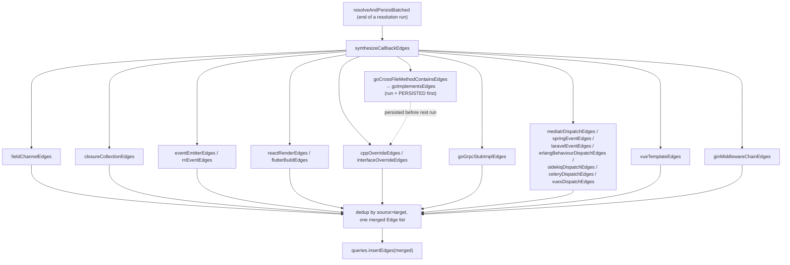
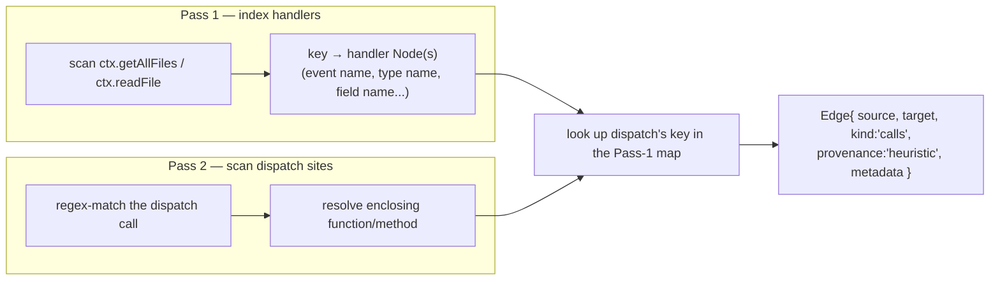

# Callback/Dispatch Edge Synthesis — Closing codegraph's Dynamic-Dispatch Gap

## Overview
Static tree-sitter extraction can only see a call when the callee's name appears literally at the call site. The moment a real program routes control through *indirection* — a stored callback, a string-keyed event name, an interface reference, a generated RPC stub, a templating DSL — that literal name disappears and the flow breaks in the graph even though it is fully connected at runtime. `callback-synthesizer.ts` is codegraph's answer: roughly thirty narrow, framework-specific heuristic passes, each recognizing one such indirection *shape* in one ecosystem and emitting the missing `calls`/`implements` edge, all fired from a single orchestrator, [`synthesizeCallbackEdges`](../catalog/src/resolution/callback-synthesizer.ts.md#synthesizeCallbackEdges). The key design idea is *not* a general dynamic-dispatch engine — it is the opposite: dozens of small, independently-validated, precision-first recognizers, because a Redux thunk, a Laravel event, and a Go interface satisfaction are structurally unrelated problems that only look similar from a distance. Every edge this file adds is tagged `provenance:'heuristic'` on the exact same [`Edge`](../catalog/src/types.ts.md#Edge) shape as a real static edge, so once synthesized it is indistinguishable to the rest of the graph (trace, `codegraph_explore`, impact radius) from an edge tree-sitter extracted directly.

## Diagram

A second view of the shape most of the ~30 passes share — a two-pass registration/dispatch pairing:

## Design rationale (why it's built this way)
The file's own header doc frames it as bridging two shapes at minimum — "(1) Field-backed observer... (2) String-keyed EventEmitter" — and states the guiding precision policy explicitly: **"High-precision/low-recall by design."** That policy recurs as concrete code, not just intent. [`erlangBehaviourDispatchEdges`](../catalog/src/resolution/callback-synthesizer.ts.md#erlangBehaviourDispatchEdges) requires *exactly one* in-repo behaviour to declare a given `name/arity` pair before it will link a dispatch site — "a name+arity collision across behaviours bails (silent beats wrong)." [`sidekiqDispatchEdges`](../catalog/src/resolution/callback-synthesizer.ts.md#sidekiqDispatchEdges) resolves an unqualified worker reference only when it names a *single* worker class; an ambiguous match resolves to nothing rather than guessing. [`goGrpcStubImplEdges`](../catalog/src/resolution/callback-synthesizer.ts.md#goGrpcStubImplEdges) will only bridge a gRPC stub struct that lives in a generated file, specifically to avoid "bridg[ing] such hand-written structs and creat[ing] misleading edges." The recurring engineering judgment is that a wrong edge actively misleads an agent walking the graph, while a missing edge just leaves the boundary honestly unresolved — so every pass is built to fail closed.

[`goImplementsEdges`](../catalog/src/resolution/callback-synthesizer.ts.md#goImplementsEdges)'s docstring explains why Go specifically needs a *structural* pass no other language here does: "Go has no `implements` keyword — a struct satisfies an interface structurally when its method set covers the interface's." Because [`interfaceOverrideEdges`](../catalog/src/resolution/callback-synthesizer.ts.md#interfaceOverrideEdges) (the general vtable-override bridge) walks real `implements`/`extends` edges out of the database, Go interfaces are otherwise invisible to it — `goImplementsEdges` exists purely to manufacture the edge other languages get for free from extraction. That in turn is why [`goCrossFileMethodContainsEdges`](../catalog/src/resolution/callback-synthesizer.ts.md#goCrossFileMethodContainsEdges) must run first: Go methods declared in a different file from their receiver type are otherwise "orphaned from the struct," and `goImplementsEdges` derives a struct's method set from exactly those `contains` edges — so skipping or reordering the pre-pass silently under-counts which interfaces a struct satisfies.

> [!inferred] The choice to run ~30 independent whole-graph scans sequentially (rather than, say, a single combined AST walk) trades raw throughput for isolation: a bad regex or an edge case in one framework's pass can't corrupt another's results, and each pass can be added, disabled, or re-validated independently — visible in how each function is a self-contained, dependency-free scan over `ctx`/`queries`.

## Entry points
- [`resolveAndPersistBatched`](../catalog/src/resolution/index.ts.md#ReferenceResolver.resolveAndPersistBatched) — the batched reference-resolution driver; its own doc comment ("Resolve and persist in batches to keep memory bounded") and its `calls/refs` show it invokes `synthesizeCallbackEdges` once, after all batches of unresolved references have been drained — this synthesis pass is explicitly a *post*-resolution, whole-graph step, not something that runs per file or per batch.
- [`synthesizeCallbackEdges`](../catalog/src/resolution/callback-synthesizer.ts.md#synthesizeCallbackEdges) — the sole orchestrator and the only symbol this module exports (re-exported through `index.ts`). It takes the live [`QueryBuilder`](../catalog/src/db/queries.ts.md#QueryBuilder) and [`ResolutionContext`](../catalog/src/resolution/types.ts.md#ResolutionContext), runs every sub-pass, merges and dedupes the results, and returns the count of edges actually inserted.

## Mechanism (step-by-step)
1. **The Go structural pre-passes run and persist before anything else.** [`goCrossFileMethodContainsEdges`](../catalog/src/resolution/callback-synthesizer.ts.md#goCrossFileMethodContainsEdges) links a Go method to its receiver type when they live in different files (deterministic — Go guarantees same-package-same-directory — so it is *not* tagged heuristic), and its result is inserted into the database immediately. Only then does [`goImplementsEdges`](../catalog/src/resolution/callback-synthesizer.ts.md#goImplementsEdges) run: it compares each Go interface's method-name set against each struct's method-name set (drawn from those now-complete `contains` edges) and synthesizes the `implements` edge Go's structural typing never states explicitly. This ordering is load-bearing, not incidental — a later pass in the same orchestrator run reads `implements` edges back out of the database.

2. **Field-backed observer channels** are the file's namesake shape: a *registrar* method stashes a value into `this.<field>`, and a *dispatcher* method later iterates that same field. [`fieldChannelEdges`](../catalog/src/resolution/callback-synthesizer.ts.md#fieldChannelEdges) finds registrar/dispatcher method pairs sharing a file and a field name (matched against `REGISTRAR_NAME`/`DISPATCHER_NAME` name patterns in the real source), then walks each registrar's *callers* to find the literal callback argument passed at the registration call site (`scene.onUpdate(this.triggerRender)`), and links dispatcher → that callback. The registration call site itself is preserved in `metadata.registeredAt` — the docstring calls this "the #1 thing an agent reads/greps to explain the flow," surfaced so a caller never needs a separate Read.

3. **Lifecycle re-render bridges** cover a narrower but very common case: a framework re-invokes a fixed, conventionally-named method after state changes, with no static call in between. [`reactRenderEdges`](../catalog/src/resolution/callback-synthesizer.ts.md#reactRenderEdges) links every sibling method of a class's `render` that calls `this.setState(` to that `render` method; [`flutterBuildEdges`](../catalog/src/resolution/callback-synthesizer.ts.md#flutterBuildEdges) does the Dart-analog with `setState(...)` → `build`. Both accept over-approximation (any `setState`-calling method is linked, even if the framework wouldn't reach it that way at runtime) because the goal is reachability, not a precise call graph — the same posture the header doc states plainly for the whole file.

4. **String-keyed event buses** pair emitters and listeners purely by the literal string they share. [`eventEmitterEdges`](../catalog/src/resolution/callback-synthesizer.ts.md#eventEmitterEdges) builds an event-name → dispatcher-id map and an event-name → handler map from `.emit`/`.on` call sites across the whole repo, then links every dispatcher to every handler of the same event — capped so a generic name like `'error'` with many handlers on both sides is skipped rather than fanned out into noise. [`rnEventEdges`](../catalog/src/resolution/callback-synthesizer.ts.md#rnEventEdges) is the cross-language variant of the identical shape: it recognizes the *native* side of a React Native bridge (Objective-C `sendEventWithName:`, Swift `sendEvent(withName:)`, JVM `.emit(...)`) and links it to the *JS* `addListener` handler by the same event-name key — closing a boundary no single-language extractor could see.

5. **Type/name-keyed dispatch buses** are the largest family — one per backend framework, but all the same two-pass shape (Pass 1: scan the whole repo for a type-or-name → handler map; Pass 2: scan for dispatch call sites and look the key up). [`mediatrDispatchEdges`](../catalog/src/resolution/callback-synthesizer.ts.md#mediatrDispatchEdges) keys .NET `_mediator.Send`/`.Publish` by request/notification type to the matching `IRequestHandler<T>`'s `Handle`; [`springEventEdges`](../catalog/src/resolution/callback-synthesizer.ts.md#springEventEdges) keys Java `publishEvent(new XEvent(...))` by event type to `@EventListener` methods; [`laravelEventEdges`](../catalog/src/resolution/callback-synthesizer.ts.md#laravelEventEdges) keys PHP `event(new XEvent(...))` by event class name, resolved from *two* independent Laravel registration mechanisms (a typed `handle(XEvent $e)` parameter, and the `EventServiceProvider`'s `$listen` array) so a listener registered either way is found; [`sidekiqDispatchEdges`](../catalog/src/resolution/callback-synthesizer.ts.md#sidekiqDispatchEdges) and [`celeryDispatchEdges`](../catalog/src/resolution/callback-synthesizer.ts.md#celeryDispatchEdges) key Ruby/Python async-job dispatch (`.perform_async`, `.delay`) by worker/task name, each gated on a language-specific marker (a `Sidekiq::Worker` mixin string, a `@shared_task` decorator) read straight from source since neither mixins nor decorators produce a resolvable static edge; [`vuexDispatchEdges`](../catalog/src/resolution/callback-synthesizer.ts.md#vuexDispatchEdges) keys Vuex's namespaced `dispatch('ns/action')`/`commit('M')` strings, splitting on `/` to disambiguate the module; and [`erlangBehaviourDispatchEdges`](../catalog/src/resolution/callback-synthesizer.ts.md#erlangBehaviourDispatchEdges) keys Erlang's `Var:fn(args)` variable-module dispatch by `(name, arity)` against every `-callback` declaration it finds across the repo, using the *ambiguity gate* described in Design rationale.

6. **Closure-collection dispatch** looks similar to the field-backed shape but is proven differently. [`closureCollectionEdges`](../catalog/src/resolution/callback-synthesizer.ts.md#closureCollectionEdges) pairs a registrar (`this.<field>.append(...)`) with a dispatcher (`this.<field>.forEach { $0() }`) purely by field name, but the pairing is licensed by the dispatcher actually *invoking* each collection element (`$0(`/`it(` — proof the collection holds closures, not just data), which is why it is deliberately cross-file/cross-class: the docstring cites Alamofire, where the base class `Request.didCompleteTask` iterates a `validators` field the subclass `DataRequest.validate` appends to.

7. **Class-hierarchy / vtable override bridging** links a base or interface method to each concrete override, since a call through a pointer/interface at runtime is a vtable indirection with no static call edge. [`cppOverrideEdges`](../catalog/src/resolution/callback-synthesizer.ts.md#cppOverrideEdges) does this for C++ `extends`; [`interfaceOverrideEdges`](../catalog/src/resolution/callback-synthesizer.ts.md#interfaceOverrideEdges) generalizes it across Java/Kotlin/C#/TypeScript/Swift/Scala/Go/Rust `implements`+`extends`, grouping overloads by name so every base overload links to every same-named override. The packet's own subgraph notes mark these as `(virtual)` edges — "a real connection, not a static call" recovered by class-hierarchy analysis rather than name/string matching.

8. **A cross-language, codegen-aware bridge** covers the case where the missing link isn't dynamic at runtime at all, but structurally invisible to the type system. [`goGrpcStubImplEdges`](../catalog/src/resolution/callback-synthesizer.ts.md#goGrpcStubImplEdges) matches a protoc-generated `UnimplementedXxxServer` stub struct to a hand-written struct elsewhere in the repo whose method-name set is a superset of the stub's RPC methods — because Go's structural typing leaves no `implements` edge for the resolver to follow from a generated interface to its real handler, which the docstring says was validated against a real failing trace on cosmos-sdk.

9. **Template-DSL and positional-slice dispatch** cover indirection that isn't even in a general-purpose language. [`vueTemplateEdges`](../catalog/src/resolution/callback-synthesizer.ts.md#vueTemplateEdges) regex-scans a `.vue` file's compiled `<template>` block for component tags and `@click="handler"` bindings — the docstring explains this exists because "the `.vue` extractor only parses `<script>`," so template-only usages are otherwise invisible to any tree-sitter-based pass. [`ginMiddlewareChainEdges`](../catalog/src/resolution/callback-synthesizer.ts.md#ginMiddlewareChainEdges) recognizes Go's gin router: it finds the dispatcher method that walks a `handlers` slice by index, separately collects every handler identifier registered via `.Use`/`.GET`/etc., and links every dispatcher to every registered handler — since the slice's runtime index order has no static representation at all.

10. **The orchestrator sequences, yields, merges, and persists once.** [`synthesizeCallbackEdges`](../catalog/src/resolution/callback-synthesizer.ts.md#synthesizeCallbackEdges) itself is mostly plumbing: call each pass in a fixed order (Go pre-passes first, as above), `await` a yield point between every single one, collect all the returned `Edge[]` arrays, and deduplicate the concatenation by `source`/`target` pair before one final `insertEdges` call.

## Key data structures
- [`Edge`](../catalog/src/types.ts.md#Edge) — every synthesizer's sole output type: [`source`](../catalog/src/types.ts.md#Edge.source)/[`target`](../catalog/src/types.ts.md#Edge.target) node ids, a [`kind`](../catalog/src/types.ts.md#Edge.kind) (almost always `'calls'`, occasionally `'implements'` for the Go structural passes), an optional [`line`](../catalog/src/types.ts.md#Edge.line) for the call site, and [`metadata`](../catalog/src/types.ts.md#Edge.metadata) carrying a `synthesizedBy` tag (e.g. `'redux-thunk'`, `'go-grpc-stub-impl'`) plus a `via`/`registeredAt` pointer back to the human-readable wiring site. Every edge here sets [`provenance`](../catalog/src/types.ts.md#Edge.provenance) to `'heuristic'` (except the two deterministic Go structural pre-passes), which is what lets a consumer distinguish a synthesized guess from an extraction-derived fact.
- [`Node`](../catalog/src/types.ts.md#Node) — read via [`id`](../catalog/src/types.ts.md#Node.id), [`kind`](../catalog/src/types.ts.md#Node.kind), [`name`](../catalog/src/types.ts.md#Node.name), [`qualifiedName`](../catalog/src/types.ts.md#Node.qualifiedName), [`filePath`](../catalog/src/types.ts.md#Node.filePath), [`language`](../catalog/src/types.ts.md#Node.language), [`startLine`](../catalog/src/types.ts.md#Node.startLine)/[`endLine`](../catalog/src/types.ts.md#Node.endLine) throughout — every pass works exclusively off these fields (name-matching, kind-filtering, line-range slicing for `ctx.readFile`) rather than any richer per-language AST the extractors may have captured.
- [`ResolutionContext`](../catalog/src/resolution/types.ts.md#ResolutionContext) — the narrow, cached, read-only view every pass is handed: [`getNodesInFile`](../catalog/src/resolution/types.ts.md#ResolutionContext.getNodesInFile), [`getNodesByName`](../catalog/src/resolution/types.ts.md#ResolutionContext.getNodesByName), [`getAllFiles`](../catalog/src/resolution/types.ts.md#ResolutionContext.getAllFiles), and [`readFile`](../catalog/src/resolution/types.ts.md#ResolutionContext.readFile) are the four calls nearly every synthesizer is built from — this file never touches the filesystem or the SQL layer directly except through this interface (or, for edge-graph traversal, `queries`).
- [`QueryBuilder`](../catalog/src/db/queries.ts.md#QueryBuilder) — the subset of passes that need existing edges (interface/extends lookups for the hierarchy-override family, `implements` lookups for the Erlang and Go passes) go through it rather than `ctx`. Node hydration inside it runs through an LRU [`stmts`](../catalog/src/db/queries.ts.md#QueryBuilder.stmts)-cached [`prepare`](../catalog/src/db/sqlite-adapter.ts.md#SqliteDatabase.prepare)d statement against [`db`](../catalog/src/db/queries.ts.md#QueryBuilder.db) via [`getNodeById`](../catalog/src/db/queries.ts.md#QueryBuilder.getNodeById), which converts the raw row with [`rowToNode`](../catalog/src/db/queries.ts.md#rowToNode) — the same node-materialization path every other resolver stage uses.
- [`stripCommentsForRegex`](../catalog/src/resolution/strip-comments.ts.md#stripCommentsForRegex) — a shared, per-language comment/string stripper (`python`/`ruby`/`rust`/`erlang`/`php`/`go`/C-style) that almost every regex-based pass runs source through before matching, so a commented-out `$listen` map or a string literal containing `.emit(` can't produce a false dispatch/registration match.

## Dynamics (design intent)
Every pass in this file runs synchronously, on the indexer's main thread, as one whole-graph scan — and there are roughly thirty of them. [`synthesizeCallbackEdges`](../catalog/src/resolution/callback-synthesizer.ts.md#synthesizeCallbackEdges)'s own leading comment states the consequence directly: "Their AGGREGATE can run for well over a minute on a large repo — long enough for the #850 liveness watchdog to SIGKILL the process mid-index... since its heartbeat lives on this same thread." The fix is cooperative yielding: the orchestrator creates one `yieldToLoop` and `await`s it between *every* sub-pass call, and the heaviest individual passes — [`fieldChannelEdges`](../catalog/src/resolution/callback-synthesizer.ts.md#fieldChannelEdges), [`closureCollectionEdges`](../catalog/src/resolution/callback-synthesizer.ts.md#closureCollectionEdges), and [`eventEmitterEdges`](../catalog/src/resolution/callback-synthesizer.ts.md#eventEmitterEdges) among them — additionally yield *mid-scan* every 128 or 256 nodes/files, so a single pass over a huge graph can't itself stall the watchdog's window. The comment is explicit that this is a deliberate half-measure, not a fix for a real hang: "a pass that itself hangs (a real wedge) never reaches the next yield, so the watchdog still catches that."

The Go pre-passes are the one place ordering is semantically required rather than just a scheduling nicety: [`goCrossFileMethodContainsEdges`](../catalog/src/resolution/callback-synthesizer.ts.md#goCrossFileMethodContainsEdges) and [`goImplementsEdges`](../catalog/src/resolution/callback-synthesizer.ts.md#goImplementsEdges) are each inserted into the database (`queries.insertEdges(...)`) immediately after they run and *before* the rest of the passes start, because later passes in the same call — the hierarchy-override family in particular — read `implements`/`contains` edges back out of the database rather than from any in-memory result. Every other pass's output is instead accumulated in a local variable and only merged and persisted once, at the very end, via a single dedup loop keyed on `` `${e.source}>${e.target}` `` and one final `insertEdges` call.

## Edge cases
- **Ambiguity is a bail condition, not a best-guess.** [`sidekiqDispatchEdges`](../catalog/src/resolution/callback-synthesizer.ts.md#sidekiqDispatchEdges) resolves an unqualified worker name only if exactly one worker class bears it; [`vuexDispatchEdges`](../catalog/src/resolution/callback-synthesizer.ts.md#vuexDispatchEdges) and [`celeryDispatchEdges`](../catalog/src/resolution/callback-synthesizer.ts.md#celeryDispatchEdges) apply the same same-file-or-unique-match rule; [`erlangBehaviourDispatchEdges`](../catalog/src/resolution/callback-synthesizer.ts.md#erlangBehaviourDispatchEdges) bails outright on any `name/arity` collision across behaviours. In every case a collision produces *zero* edges for that site rather than a plausible-looking wrong one.
- **Generic keys are fan-out-capped, not linked exhaustively.** [`eventEmitterEdges`](../catalog/src/resolution/callback-synthesizer.ts.md#eventEmitterEdges) explicitly skips an event name once its dispatcher or handler set grows past a cap, noting a name like `'error'` "can't be matched without receiver-type info" and would otherwise over-link; [`erlangBehaviourDispatchEdges`](../catalog/src/resolution/callback-synthesizer.ts.md#erlangBehaviourDispatchEdges) applies the analogous cap to a mega-behaviour with hundreds of implementers.
- **The two Go structural pre-passes are the only edges here that are *not* `provenance:'heuristic'`.** [`goCrossFileMethodContainsEdges`](../catalog/src/resolution/callback-synthesizer.ts.md#goCrossFileMethodContainsEdges)'s docstring is explicit that this is deliberate — a same-package, same-directory method-to-type link is "a deterministic structural link, not a heuristic," matching how extraction itself tags the same-file case.
- **A generated-code gate prevents self-referential bridging.** [`goGrpcStubImplEdges`](../catalog/src/resolution/callback-synthesizer.ts.md#goGrpcStubImplEdges) requires the stub struct to live in a generated file specifically so that a hand-written struct someone happens to name `UnimplementedFooServer` is never mistaken for protoc output, and separately excludes generated-file *candidates* so that sibling generated types (`msgClient`, `UnsafeMsgServer`) with coincidentally matching method sets don't get bridged to each other.
- **Registration order in the orchestrator matters even though most passes look independent.** Because [`goImplementsEdges`](../catalog/src/resolution/callback-synthesizer.ts.md#goImplementsEdges) must run after [`goCrossFileMethodContainsEdges`](../catalog/src/resolution/callback-synthesizer.ts.md#goCrossFileMethodContainsEdges) is persisted, and later hierarchy passes depend on `goImplementsEdges`'s output being in the database, reordering [`synthesizeCallbackEdges`](../catalog/src/resolution/callback-synthesizer.ts.md#synthesizeCallbackEdges)'s call sequence (rather than just adding a pass to it) risks silently under-counting Go interface satisfaction without any error.

## Open questions
> [!inferred] The packet's own Evidence section reports no unit tests in the configured test paths reference this subgraph, so the precision claims embedded in the design rationale (fan-out caps, ambiguity gates, generated-file gating) are not verifiable from source + tests alone here — this page cites only what the source and its docstrings state.

> [!inferred] The final merge in `synthesizeCallbackEdges` dedupes strictly by the `source>target` node-id pair. If two different synthesizers (e.g. `interfaceOverrideEdges` and `cppOverrideEdges` on a mixed-language hierarchy, or a language-specific pass and a generic one) ever produced an edge for the *same* pair, only the first one encountered in the fixed concatenation order would survive, silently dropping the other's `metadata.synthesizedBy` attribution. Whether this cross-synthesizer collision is possible in practice, and whether it has ever been observed, isn't answered anywhere in this subgraph.

> [!inferred] Several caps and gating constants (fan-out limits, decorator lookback windows, minified-file line-length thresholds) are hard-coded per pass rather than configurable, unlike the DB-layer's cache sizes which are explicitly tunable via an environment variable (per `ResolutionContext`'s own doc comments elsewhere in resolution). Whether these heuristics' thresholds were tuned against a broader validation corpus is outside what this module's source can confirm.

## See also
- [Node/Edge — the core graph data model](types.ts.md)
- [ResolutionContext/UnresolvedRef — extraction↔resolution contract](resolution-types.ts.md)
- [ReferenceResolver — UnresolvedRef → edges](resolution-index.ts.md)
- [QueryBuilder — SQL query layer over the graph](db-queries.ts.md)
