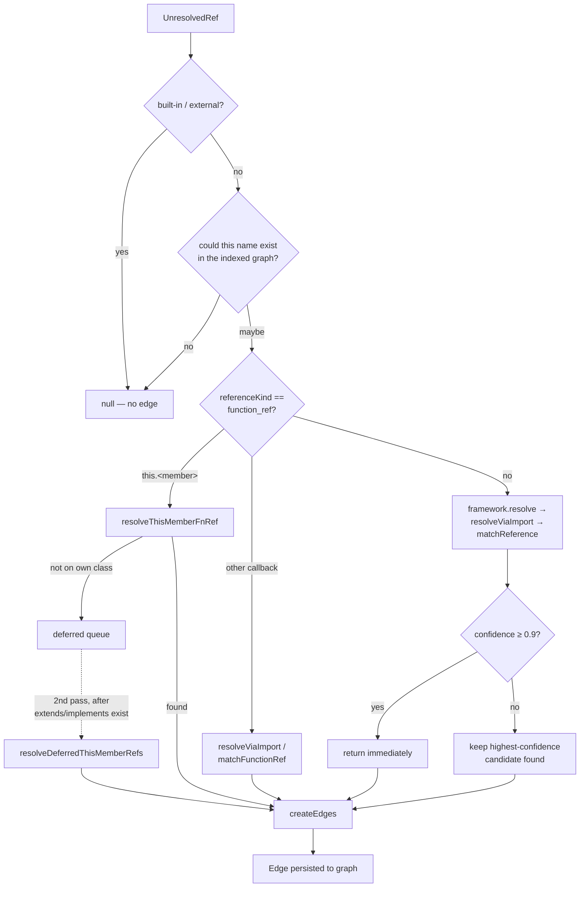
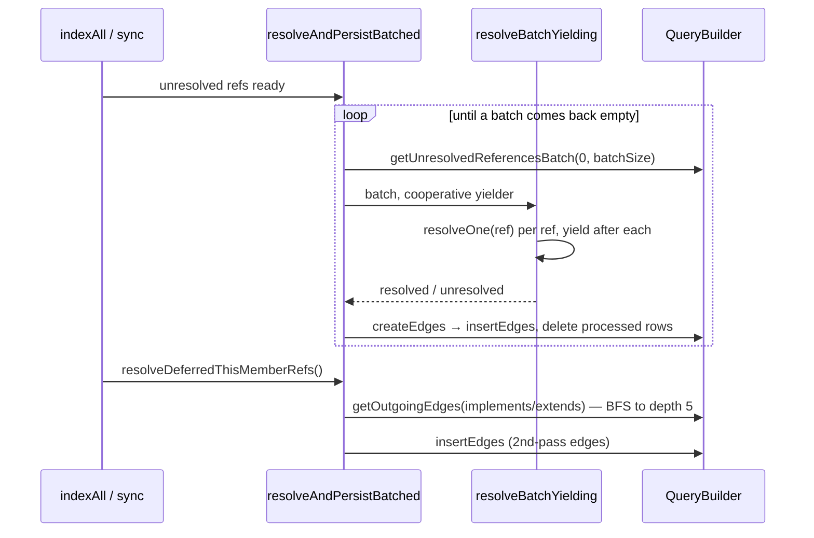

# Static Reference Resolution — turning fuzzy names into graph edges

## Overview
CodeGraph's tree-sitter extractors see syntax, not semantics: a call site or import
statement becomes an `UnresolvedRef` — a bare name plus a `referenceKind` and a
location — the same shape no matter what language it came from, with no idea yet
which declaration it names. `ReferenceResolver` is the layer that closes that gap
*without a real type checker*: for every ref it tries a small, ordered set of
heuristics and keeps the first one confident enough, turning a name into a specific
target `Node` via [`resolveOne`](../catalog/src/resolution/index.ts.md#ReferenceResolver.resolveOne).
Where extraction hands codegraph a pile of isolated symbols, resolution is what makes
the graph *connected* — [`createEdges`](../catalog/src/resolution/index.ts.md#ReferenceResolver.createEdges)
converts each accepted match into a real [`Edge`](../catalog/src/types.ts.md#Edge). The
whole module runs under a constraint most name-resolvers never have to think about:
it executes synchronously on the indexer's single main thread, over codebases with
hundreds of thousands of references, without ever stalling long enough to trip
codegraph's own liveness watchdog. The sibling half of "resolution" — recovering
edges for dynamic dispatch that has no static name at all — lives in
`callback-synthesizer.ts`; this module is the static, name-based half.

## Diagram

A second, orthogonal view — how a whole indexing run drives this module in two
passes, because inheritance-dependent refs can't resolve until inheritance edges
exist yet:

## Design rationale (why it's built this way)
The module leans hard on one principle, restated in comments at nearly every branch
that could go either way: **an unresolved reference is better than a wrong edge.**
Inside [`resolveOne`](../catalog/src/resolution/index.ts.md#ReferenceResolver.resolveOne)
itself, a CFML inheritance path that names a supertype by dotted directory
segments is routed to a dedicated matcher with explicit "no fallthrough on miss"
behavior — the comment reasons that an unresolvable supertype is usually an
out-of-repo library (`mxunit`, `testbox`), so guessing would silently connect the
class to the wrong same-named symbol instead. The same call site is where PHP
include paths and Terraform variable refs are also refused a name-matching
fallback for the identical reason. This is a deliberate trade of recall for
precision: codegraph would rather tell an agent "no edge here" than hand it a
plausible-looking but incorrect call graph.

The second load-bearing decision is the **tiered-confidence waterfall** inside
[`resolveOne`](../catalog/src/resolution/index.ts.md#ReferenceResolver.resolveOne):
strategies run in a fixed order — framework-specific resolution, then
[`resolveViaImport`](../catalog/src/resolution/import-resolver.ts.md#resolveViaImport),
then [`matchReference`](../catalog/src/resolution/name-matcher.ts.md#matchReference) —
and any result scoring `confidence >= 0.9` returns immediately without trying the
rest. Only when nothing hits that bar does it fall back to comparing whatever
lower-confidence candidates were collected along the way and keeping the best one.
This means the *order* of strategies encodes a belief about which signals are
trustworthy without corroboration (an import binding, a qualified name) versus
which need consensus (bare-name matching).

The third is a genuine chicken-and-egg problem: some references can only be
resolved using edges that resolution itself produces. A `this.<member>`
function-as-value reference — the classic `btn.on('click', this.handleClick)`
callback-registration idiom — might name a method inherited from a supertype, but
`extends`/`implements` edges don't exist until *after* the main resolution pass
writes them. [`resolveThisMemberFnRef`](../catalog/src/resolution/index.ts.md#ReferenceResolver.resolveThisMemberFnRef)
resolves what it can against the class's own members and, on a miss, pushes the
ref onto an in-memory deferred queue rather than giving up — because the batched
main pass deletes unresolved rows from the database, an in-memory queue is the
only way to hand the ref to a later pass. [`resolveDeferredThisMemberRefs`](../catalog/src/resolution/index.ts.md#ReferenceResolver.resolveDeferredThisMemberRefs)
drains that queue once inheritance edges exist and walks them with a depth-capped
breadth-first search anchored on the *node*, not the name — the doc comment
explicitly calls out that a name-keyed union of supertypes produced cross-class
wrong edges on Rails (a codebase with a dozen classes named `Engine`).

> [!inferred] A structurally identical second-pass queue exists for chained
> static-factory/fluent calls (mirroring this one's lifecycle, per the source
> comments), but its resolving function isn't part of this packet's subgraph — see
> Open questions.

## Entry points
- [`<constructor>`](../catalog/src/resolution/index.ts.md#ReferenceResolver.-constructor) —
  hit once per indexing session when codegraph builds a `ReferenceResolver` for a
  project. It sizes a family of per-instance LRU caches off a shared, env-overridable
  limit and immediately builds the [`ResolutionContext`](../catalog/src/resolution/types.ts.md#ResolutionContext)
  via [`createContext`](../catalog/src/resolution/index.ts.md#ReferenceResolver.createContext) —
  every resolution strategy in the module reads the graph exclusively through that
  context, never through [`queries`](../catalog/src/resolution/index.ts.md#ReferenceResolver.queries) directly.
- [`resolveAndPersistBatched`](../catalog/src/resolution/index.ts.md#ReferenceResolver.resolveAndPersistBatched) —
  the main entry for a full index: called once extraction has populated the
  database with nodes and raw `UnresolvedRef` rows, it drains them in bounded
  batches so memory stays flat on large repos.
- [`resolveAll`](../catalog/src/resolution/index.ts.md#ReferenceResolver.resolveAll) —
  the synchronous, whole-set variant (no batching, no yielding) used where the
  caller already holds a scoped, small list of `UnresolvedReference`s in memory —
  the incremental-sync counterpart to the batched full-index path.
- [`resolveDeferredThisMemberRefs`](../catalog/src/resolution/index.ts.md#ReferenceResolver.resolveDeferredThisMemberRefs) —
  the second-pass entry, called after the first pass has persisted `implements`/
  `extends` edges; both [`indexAll`](../catalog/src/index.ts.md#CodeGraph.indexAll)
  and [`sync`](../catalog/src/index.ts.md#CodeGraph.sync) call it directly once the
  main resolution pass finishes.

## Mechanism (step-by-step)
1. **A resolver is built once per project and holds state across the whole run.**
   The [`<constructor>`](../catalog/src/resolution/index.ts.md#ReferenceResolver.-constructor)
   allocates several bounded caches (keyed by file, by name, by qualified name, by
   method) sized from one shared limit — the file-content cache gets a fifth of
   the budget because full source text is heavier than metadata — and builds a
   single [`ResolutionContext`](../catalog/src/resolution/types.ts.md#ResolutionContext)
   via [`createContext`](../catalog/src/resolution/index.ts.md#ReferenceResolver.createContext)
   that every strategy shares. Every context method is itself a cache-then-query
   wrapper — e.g. its `getNodesByName` closure checks a name cache before ever
   calling [`getNodesByName`](../catalog/src/resolution/types.ts.md#ResolutionContext.getNodesByName)
   against the database — so repeated lookups of a popular name (a common method
   like `render` or `handle`) cost one query, not thousands.

2. **`resolveOne` filters aggressively before it does any real matching work.**
   The first two checks inside [`resolveOne`](../catalog/src/resolution/index.ts.md#ReferenceResolver.resolveOne)
   reject a reference outright: [`isBuiltInOrExternal`](../catalog/src/resolution/index.ts.md#ReferenceResolver.isBuiltInOrExternal)
   filters language-specific standard-library and built-in names (with care not
   to over-filter — C/C++ built-ins are only dropped when nothing in the codebase
   shadows them, since projects routinely define their own `malloc`/`read`/`open`),
   and a name-existence pre-check discards references to names that provably
   don't exist anywhere in the indexed symbol table, with a deliberate escape
   hatch for names that match a local import (needed for re-export rename chains
   where the call site's name never appears as a declaration anywhere).

3. **Function-as-value references get a dedicated, stricter path.** When
   `referenceKind` is `function_ref` (a function or method passed as a value —
   `#756`'s callback-registration case), [`resolveOne`](../catalog/src/resolution/index.ts.md#ReferenceResolver.resolveOne)
   never falls through to the framework/fuzzy strategies below. A `this.<member>`
   value resolves only via [`resolveThisMemberFnRef`](../catalog/src/resolution/index.ts.md#ReferenceResolver.resolveThisMemberFnRef)
   against the enclosing class's own scope; anything else tries
   [`resolveViaImport`](../catalog/src/resolution/import-resolver.ts.md#resolveViaImport)
   first (an imported callback is the most precise cross-file signal available)
   and falls back to [`matchFunctionRef`](../catalog/src/resolution/name-matcher.ts.md#matchFunctionRef)
   only if that misses.

4. **Everything else runs the confidence waterfall.** Framework resolvers are
   tried first (a `>= 0.9` hit returns immediately), then
   [`resolveViaImport`](../catalog/src/resolution/import-resolver.ts.md#resolveViaImport),
   then [`matchReference`](../catalog/src/resolution/name-matcher.ts.md#matchReference) —
   which itself tries file-path, qualified-name, and (via
   [`matchFunctionRef`](../catalog/src/resolution/name-matcher.ts.md#matchFunctionRef)
   and [`matchMethodCall`](../catalog/src/resolution/name-matcher.ts.md#matchMethodCall))
   name-based strategies in its own confidence order. Whatever survives is
   compared, and the single highest-confidence `ResolvedRef` wins (a tie keeps
   the first candidate found); an empty candidate set yields `null` rather than
   an edge.

5. **A resolved match still gets its edge kind refined using graph knowledge that
   wasn't available at extraction time.** [`createEdges`](../catalog/src/resolution/index.ts.md#ReferenceResolver.createEdges)
   looks up the resolved target via [`getNodeById`](../catalog/src/db/queries.ts.md#QueryBuilder.getNodeById)
   and promotes an `extends` edge to `implements` when the target turns out to be
   an interface/protocol, and a `calls` edge to `instantiates` when the target
   turns out to be a class/struct — the latter specifically because Python and
   Ruby write instantiation as a bare call (`Foo()`), which extraction cannot tell
   apart from a function call without knowing what `Foo` resolves to.

6. **A full index processes references in memory-bounded batches, yielding between
   every single one.** [`resolveAndPersistBatched`](../catalog/src/resolution/index.ts.md#ReferenceResolver.resolveAndPersistBatched)
   repeatedly pulls a batch from the database, hands it to
   [`resolveBatchYielding`](../catalog/src/resolution/index.ts.md#ReferenceResolver.resolveBatchYielding)
   (which calls [`resolveOne`](../catalog/src/resolution/index.ts.md#ReferenceResolver.resolveOne)
   per ref and awaits a cooperative yield after each one), persists the resulting
   edges immediately, and deletes both resolved and unresolved rows from that
   batch so the next read — always from offset 0, since deletion shifts
   everything forward — never reprocesses them.

7. **Inheritance-dependent refs get resolved in a second pass, after the graph has
   the edges they need.** [`resolveDeferredThisMemberRefs`](../catalog/src/resolution/index.ts.md#ReferenceResolver.resolveDeferredThisMemberRefs)
   drains the in-memory queue [`resolveThisMemberFnRef`](../catalog/src/resolution/index.ts.md#ReferenceResolver.resolveThisMemberFnRef)
   built up, and for each deferred ref walks up the class hierarchy via
   [`getOutgoingEdges`](../catalog/src/db/queries.ts.md#QueryBuilder.getOutgoingEdges)
   filtered to `implements`/`extends`, looking up each supertype's own members via
   its `contains` edges until it finds one matching the member name (capped at 5
   levels), then persists the newly found edges.

## Key data structures
- [`UnresolvedRef`](../catalog/src/resolution/types.ts.md#UnresolvedRef) — the
  input unit: a bare [`referenceName`](../catalog/src/resolution/types.ts.md#UnresolvedRef.referenceName)
  plus [`referenceKind`](../catalog/src/resolution/types.ts.md#UnresolvedRef.referenceKind),
  [`language`](../catalog/src/resolution/types.ts.md#UnresolvedRef.language),
  [`filePath`](../catalog/src/resolution/types.ts.md#UnresolvedRef.filePath), and
  the [`fromNodeId`](../catalog/src/resolution/types.ts.md#UnresolvedRef.fromNodeId)
  of the node containing it — everything a strategy needs to guess a target
  without the extractor having resolved anything itself.
- [`ResolvedRef`](../catalog/src/resolution/types.ts.md#ResolvedRef) — the output
  of a successful match: the original ref, a `targetNodeId`, a numeric
  `confidence`, and a `resolvedBy` provenance tag (`exact-match` / `import` /
  `qualified-name` / `framework` / `fuzzy` / `instance-method` / `file-path` /
  `function-ref`) — this tag is what lets `byMethod` stats in the resolution
  results show which strategy is doing the work on a given codebase.
- [`ResolutionContext`](../catalog/src/resolution/types.ts.md#ResolutionContext) —
  the single interface every strategy function is handed instead of raw database
  access (its methods wrap calls like [`getNodeById`](../catalog/src/db/queries.ts.md#QueryBuilder.getNodeById));
  it is what makes `name-matcher.ts` and `import-resolver.ts` testable independent
  of the resolver instance's own caching.
- [`FrameworkResolver`](../catalog/src/resolution/types.ts.md#FrameworkResolver) —
  the plugin contract for the framework-specific tier tried first in the
  waterfall; a detected framework's own `resolve()` is one strategy among the
  ones [`resolveOne`](../catalog/src/resolution/index.ts.md#ReferenceResolver.resolveOne)
  tries, not a separate code path.
- [`Node`](../catalog/src/types.ts.md#Node) / [`Edge`](../catalog/src/types.ts.md#Edge) —
  the persisted graph shapes resolution ultimately produces; a resolved reference
  only matters once [`createEdges`](../catalog/src/resolution/index.ts.md#ReferenceResolver.createEdges)
  turns it into an `Edge` whose [`source`](../catalog/src/types.ts.md#Edge.source)
  and [`target`](../catalog/src/types.ts.md#Edge.target) are both `Node`
  [`id`](../catalog/src/types.ts.md#Node.id)s.

## Dynamics (design intent)
Resolution is a single-threaded, synchronous pass over what can be hundreds of
thousands of references, and it runs on the same event loop codegraph's own
liveness watchdog is monitoring. The doc comment on
[`resolveBatchYielding`](../catalog/src/resolution/index.ts.md#ReferenceResolver.resolveBatchYielding)
is explicit about why the yield checkpoint is *per-reference* rather than
per-N-references: a single collision-heavy method name can force a candidate
fetch of tens of thousands of rows, so any fixed batching granularity could still
multiply worst-case cost past the watchdog's window — which is exactly what
killed a real indexing run on a large Java monorepo before this was tightened. The
comment on [`resolveAndPersistBatched`](../catalog/src/resolution/index.ts.md#ReferenceResolver.resolveAndPersistBatched)
notes the batching loop is behaviorally identical to resolving everything in one
shot — yielding changes only timing, never which edges get created, since
[`resolveOne`](../catalog/src/resolution/index.ts.md#ReferenceResolver.resolveOne)
is independent per reference.

The batching loop also carries a defensive termination guard: because it always
re-reads from offset 0 (deleting processed rows shifts the remainder forward), the
count of remaining unresolved references *must* shrink every iteration or the loop
stops — the comment explains this guards against a resolver whose match doesn't
key-match the stored row, which historically grew a 99-file repository to millions
of edges before being caught. The second-pass function,
[`resolveDeferredThisMemberRefs`](../catalog/src/resolution/index.ts.md#ReferenceResolver.resolveDeferredThisMemberRefs),
is explicitly ordered to run only after the first pass's `implements`/`extends`
edges are persisted, and clears the resolver's caches first so its supertype walk
sees fresh data.

## Edge cases
- **Name collisions across the extraction/resolution boundary.** This module
  reads two different types that both happen to have fields named `language`,
  `filePath`, `referenceKind`, `referenceName`, and `fromNodeId`: the
  resolution-time [`UnresolvedRef`](../catalog/src/resolution/types.ts.md#UnresolvedRef)
  (e.g. its own [`language`](../catalog/src/resolution/types.ts.md#UnresolvedRef.language))
  and a persisted-node-adjacent DB row shape with its own same-named fields (e.g.
  [`referenceName`](../catalog/src/types.ts.md#UnresolvedReference.referenceName)
  and [`line`](../catalog/src/types.ts.md#UnresolvedReference.line)). A batch
  entry point converts one into the other field-by-field — a reader tracing a
  bug should check *which* of the two shapes a given line is actually holding.
- **A `this.<member>` miss doesn't mean "no target" — it means "check again after
  inheritance edges exist."** [`resolveThisMemberFnRef`](../catalog/src/resolution/index.ts.md#ReferenceResolver.resolveThisMemberFnRef)
  returns `null` on a same-class miss, but the ref isn't discarded; it's queued
  for [`resolveDeferredThisMemberRefs`](../catalog/src/resolution/index.ts.md#ReferenceResolver.resolveDeferredThisMemberRefs).
  Code that only looks at [`resolveOne`](../catalog/src/resolution/index.ts.md#ReferenceResolver.resolveOne)'s
  return value would wrongly conclude such a ref is permanently unresolved.
- **`isBuiltInOrExternal` is intentionally asymmetric across languages** —
  [`isBuiltInOrExternal`](../catalog/src/resolution/index.ts.md#ReferenceResolver.isBuiltInOrExternal)
  filters Python's built-in methods (`append`, `get`, `update`, …) only when no
  known codebase symbol shadows that exact name, so a Flask view function named
  `def get()` still resolves — the same name check protects C/C++ standard
  library names from over-filtering user-defined lookalikes.
- **A resolved candidate isn't final until the graph confirms its kind is
  compatible.** [`createEdges`](../catalog/src/resolution/index.ts.md#ReferenceResolver.createEdges)'s
  `extends`→`implements` and `calls`→`instantiates` promotions both re-fetch the
  target via [`getNodeById`](../catalog/src/db/queries.ts.md#QueryBuilder.getNodeById)
  — the edge *kind* recorded in the graph can differ from the `referenceKind` the
  extractor originally emitted.

## Open questions
> [!inferred] The following are visible in the surrounding source but fall outside
> this packet's subgraph, so they're named here rather than cited as symbols.

- The fast existence pre-filter and the local-import escape hatch that guard the
  top of [`resolveOne`](../catalog/src/resolution/index.ts.md#ReferenceResolver.resolveOne)
  are backed by a helper not in this packet — its own packet (or
  `resolution-types.ts.md`) would ground exactly how the pre-warmed name/file
  sets are built and kept in sync with the database.
- A structurally identical second-pass deferred-queue mechanism exists for
  chained static-factory/fluent calls (per source comments, it mirrors
  [`resolveDeferredThisMemberRefs`](../catalog/src/resolution/index.ts.md#ReferenceResolver.resolveDeferredThisMemberRefs)'s
  lifecycle), but its resolving function and queue aren't part of this subgraph.
- The language-family "gates" that drop an otherwise-successful import or
  name-match result when source and target belong to two different *known*
  language families (preventing e.g. a TypeScript type ref from matching a
  same-named Kotlin class) live in this same file but outside this packet's
  subgraph — worth a dedicated look at how "known family" is defined.
- Dynamic-dispatch edge synthesis runs immediately after
  [`resolveAndPersistBatched`](../catalog/src/resolution/index.ts.md#ReferenceResolver.resolveAndPersistBatched)'s
  batching loop finishes, in the same method — this packet only covers the
  static, name-based half; see `resolution-callback-synthesizer.ts.md` for the
  rest.

## See also
- [ExtractionContext↔Resolution contract](resolution-types.ts.md) — the
  `ResolutionContext`/`UnresolvedRef` types this module implements and consumes;
  read together with this page, not separately.
- [Dynamic-dispatch callback synthesis](resolution-callback-synthesizer.ts.md) —
  the other half of "resolution": edges for dispatch that has no static name to
  resolve at all, run immediately after this module's batched pass.
- [The graph data model](types.ts.md) — `Node`/`Edge`/`Language`, the shapes this
  module ultimately produces and reads back via `getNodeById`.
- [The SQL query layer](db-queries.ts.md) — `QueryBuilder`, the only path to the
  database every `ResolutionContext` method in this module goes through.
