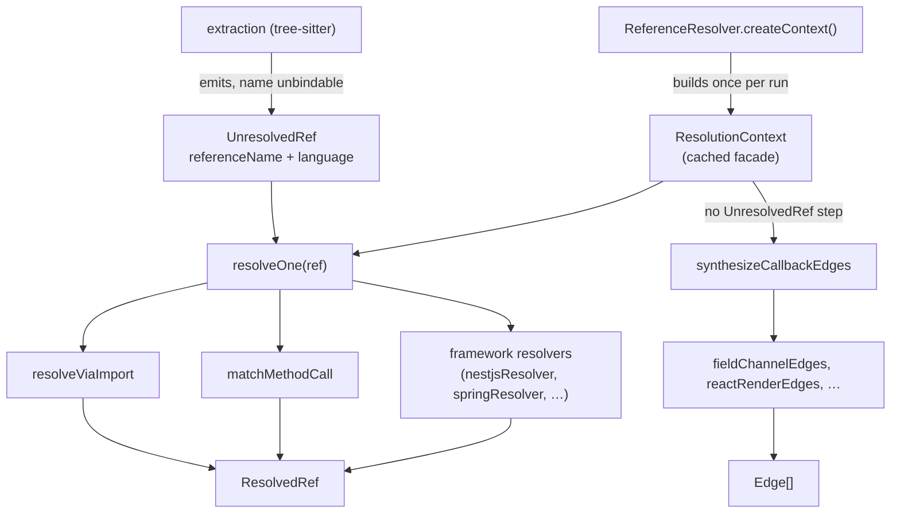

# ResolutionContext and UnresolvedRef — the extraction/resolution contract

## Overview
codegraph's indexer is split into two stages that don't speak the same language: extraction thinks in tree-sitter/AST terms, resolution thinks in graph queries. `types.ts` is the seam between them — it defines the one wire format extraction emits for every name it can't statically bind (`UnresolvedRef`) and the one facade the resolution stage hands to every strategy that tries to bind it (`ResolutionContext`) ([`UnresolvedRef`](../catalog/src/resolution/types.ts.md#UnresolvedRef), [`ResolutionContext`](../catalog/src/resolution/types.ts.md#ResolutionContext)). The key design idea is that `ResolutionContext` is not just a query interface — it's a *cached* facade over the concrete `QueryBuilder`/filesystem, and it's the single dependency that ~24 language/framework resolvers (`nestjsResolver`, `springResolver`, `railsResolver`, …) and ~30 dynamic-dispatch synthesizers (`fieldChannelEdges`, `reactRenderEdges`, `vueTemplateEdges`, …) all take instead of touching the database directly. That single indirection is what lets the whole resolution layer be extended (new framework, new language) and tested (a minimal fake context) without ever changing the storage layer.

## Diagram

## Design rationale (why it's built this way)
`ResolutionContext`'s own docstring frames it plainly: "Context for resolution - provides access to the graph" ([`ResolutionContext`](../catalog/src/resolution/types.ts.md#ResolutionContext)). Reading the interface body shows that framing understates it — several of its members exist purely to fix production performance incidents, not to add capability. `getFileLines` and `getMethodMatches` are both LRU-caching wrappers whose doc comments cite a real incident (#1122): splitting a file into lines per-reference, or re-scanning every node sharing a method name per-reference, was O(refs-in-file × file-size) and drove ~20% of total index CPU on a Java-heavy repo — bad enough to trip the indexer's liveness watchdog on large codebases. Baking the cache into the `ResolutionContext` contract itself (rather than leaving each of the ~24 framework resolvers to reimplement it) means every consumer gets the fix for free.

A second non-obvious decision: several members are declared *optional* (`getFileLines?`, `getMethodMatches?`, `getSupertypes?`, `getNodeById?`, `getProjectAliases?`, `getGoModule?`, `getWorkspacePackages?`, `getReExports?`, `listDirectories?`, `getCppIncludeDirs?`) precisely so that external/test contexts can implement a minimal `ResolutionContext` and still type-check — the production implementation ([`createContext`](../catalog/src/resolution/index.ts.md#ReferenceResolver.createContext)) fills in all of them, but a hand-written test double doesn't have to. `getSupertypes?` additionally encodes a staging invariant in its doc comment: it is backed by resolved `implements`/`extends` edges, so it is *empty* during the first resolution pass (those edges don't exist yet) and only becomes useful on the later conformance pass — a caller invoking it too early gets a silent empty result, not an error, which is a sharp edge for anyone extending resolution logic.

> [!inferred] The eight-way `resolvedBy` discriminant on `ResolvedRef` (`'exact-match' | 'import' | 'qualified-name' | 'framework' | 'fuzzy' | 'instance-method' | 'file-path' | 'function-ref'`, read directly from source) is not itself a cited subgraph symbol, but it visibly mirrors the resolution strategies fanned out from `resolveOne` — each strategy tags its own provenance so downstream consumers (and confidence scoring) can tell *how* a reference was bound, not just that it was.

## Entry points
- [`createContext`](../catalog/src/resolution/index.ts.md#ReferenceResolver.createContext) — the one place a real [`ResolutionContext`](../catalog/src/resolution/types.ts.md#ResolutionContext) gets constructed. `ReferenceResolver` calls it once per resolution run, closing over its own node/name/method-match/qualified-name caches so every accessor on the returned object is cache-backed from the start.
- [`resolveOne`](../catalog/src/resolution/index.ts.md#ReferenceResolver.resolveOne) — the per-reference entry point control reaches once extraction has produced an [`UnresolvedRef`](../catalog/src/resolution/types.ts.md#UnresolvedRef); it is where the strategy cascade (import resolution, method matching, framework resolvers) actually begins.
- [`resolveAndPersistBatched`](../catalog/src/resolution/index.ts.md#ReferenceResolver.resolveAndPersistBatched) and [`resolveBatchYielding`](../catalog/src/resolution/index.ts.md#ReferenceResolver.resolveBatchYielding) — the batch-level entry points driven at the end of a full index or an incremental sync; they're what actually call `resolveOne` for every pending ref while keeping memory bounded and the process responsive.
- [`synthesizeCallbackEdges`](../catalog/src/resolution/callback-synthesizer.ts.md#synthesizeCallbackEdges) — a second, parallel entry point invoked once after per-reference resolution, taking a [`ResolutionContext`](../catalog/src/resolution/types.ts.md#ResolutionContext) directly rather than a queue of refs.

## Mechanism (step-by-step)
1. Extraction walks the AST and, whenever it meets a name it cannot bind on the spot (a call, an import, a `this.member`), emits an [`UnresolvedRef`](../catalog/src/resolution/types.ts.md#UnresolvedRef) carrying the [`referenceName`](../catalog/src/resolution/types.ts.md#UnresolvedRef.referenceName) and the source file's [`language`](../catalog/src/resolution/types.ts.md#UnresolvedRef.language) alongside its file/line/column. This is deliberately a plain data record — extraction never touches the graph itself, so it can run fully in parallel with no shared state.
2. Before any reference is resolved, [`createContext`](../catalog/src/resolution/index.ts.md#ReferenceResolver.createContext) builds the single [`ResolutionContext`](../catalog/src/resolution/types.ts.md#ResolutionContext) instance the whole run will share, wiring each accessor to a bounded LRU cache over the concrete `QueryBuilder`. Every downstream consumer — framework resolver or synthesizer — only ever sees this cached view, never the raw database.
3. For each ref, [`resolveOne`](../catalog/src/resolution/index.ts.md#ReferenceResolver.resolveOne) — invoked in a loop from [`resolveBatchYielding`](../catalog/src/resolution/index.ts.md#ReferenceResolver.resolveBatchYielding) — tries binding strategies in sequence against the shared context, collecting candidates and returning the highest-confidence one: it runs the registered `FrameworkResolver`s such as [`nestjsResolver`](../catalog/src/resolution/frameworks/nestjs.ts.md#nestjsResolver) or [`springResolver`](../catalog/src/resolution/frameworks/java.ts.md#springResolver) *first* (a framework hit at ≥0.9 confidence returns immediately), then [`resolveViaImport`](../catalog/src/resolution/import-resolver.ts.md#resolveViaImport) for import-based binding, then name-matching (of which [`matchMethodCall`](../catalog/src/resolution/name-matcher.ts.md#matchMethodCall)'s method-name-on-type binding is one case) — each strategy receiving the identical `(UnresolvedRef, ResolutionContext)` pair, which is what makes adding language #25 a matter of writing one more resolver rather than touching the dispatch loop.
4. A structurally different path skips `UnresolvedRef` entirely: [`synthesizeCallbackEdges`](../catalog/src/resolution/callback-synthesizer.ts.md#synthesizeCallbackEdges) is handed only the [`ResolutionContext`](../catalog/src/resolution/types.ts.md#ResolutionContext) and runs roughly thirty pattern-specific whole-graph scans — [`fieldChannelEdges`](../catalog/src/resolution/callback-synthesizer.ts.md#fieldChannelEdges), [`reactRenderEdges`](../catalog/src/resolution/callback-synthesizer.ts.md#reactRenderEdges), [`vueTemplateEdges`](../catalog/src/resolution/callback-synthesizer.ts.md#vueTemplateEdges) among them — because dynamic-dispatch shapes like an observer registry or `setState`→render have no unresolved *name* to look up at all; there's simply no call site with a dangling identifier for extraction to have flagged.
5. A later, second pass over the same context re-attempts `this.<member>` references extraction couldn't resolve the first time via [`resolveDeferredThisMemberRefs`](../catalog/src/resolution/index.ts.md#ReferenceResolver.resolveDeferredThisMemberRefs) — its own doc frames it as retrying refs "whose member wasn't on the enclosing" type on the first pass, which only becomes resolvable once inheritance edges exist; it still keys off the same [`referenceName`](../catalog/src/resolution/types.ts.md#UnresolvedRef.referenceName)/[`language`](../catalog/src/resolution/types.ts.md#UnresolvedRef.language) fields as step 1.

## Key data structures
- **`UnresolvedRef`** ([cite](../catalog/src/resolution/types.ts.md#UnresolvedRef)) — `fromNodeId`, [`referenceName`](../catalog/src/resolution/types.ts.md#UnresolvedRef.referenceName), `referenceKind`, `line`/`column`/`filePath`, [`language`](../catalog/src/resolution/types.ts.md#UnresolvedRef.language), and an optional `candidates?: string[]` for qualified names extraction has already narrowed the name to.
- **`ResolutionContext`** ([cite](../catalog/src/resolution/types.ts.md#ResolutionContext)) — the capability surface: required node/file lookups (`getNodesInFile`, `getNodesByName`, `getNodesByQualifiedName`, `getNodesByKind`, `getNodesByLowerName`, `fileExists`, `readFile`, `getProjectRoot`, `getAllFiles`, `getImportMappings`) plus the ten optional, staged, or perf-critical accessors described above.
- **`ResolvedRef`** (from source, not a separately cited subgraph symbol) — wraps the `original` `UnresolvedRef` with a `targetNodeId`, a `confidence` score, and the `resolvedBy` strategy tag.
- **`ResolutionResult`** (from source) — the aggregate `{ resolved, unresolved, stats }` shape a full run (or batch) produces; `stats.byMethod` buckets counts per `resolvedBy` value.
- **`FrameworkResolver`** (from source) — the plugin contract every language/framework module implements: `detect(context)`, `resolve(ref, context)`, optional `claimsReference?(name)` (opts a nameless dynamic-dispatch target, e.g. Django's `self._iterable_class(...)`, through the name-exists pre-filter), optional `extract?(filePath, content)` for framework-specific nodes (routes, components), and optional `postExtract?(context)` for cross-file finalization (e.g. NestJS's `RouterModule.register([...])` setting route prefixes declared in a sibling file) — its doc stresses the node `id` must survive `postExtract` so existing edges stay valid.
- **`ImportMapping` / `ReExport`** (from source) — the shapes `getImportMappings`/`getReExports` return: local vs. exported name, source module, default/namespace flags, and a `'named' | 'wildcard'` re-export discriminant used to chase symbols through barrel files.

## Dynamics (design intent)
Resolution is mostly synchronous and single-threaded, and the docs in this area are explicit about the cost of that. [`resolveBatchYielding`](../catalog/src/resolution/index.ts.md#ReferenceResolver.resolveBatchYielding)'s own comment says it inserts "a yield checkpoint between EVERY ref" specifically so a liveness watchdog (referenced as issue #850) can still fire during a long batch. [`synthesizeCallbackEdges`](../catalog/src/resolution/callback-synthesizer.ts.md#synthesizeCallbackEdges) carries the same concern at a coarser grain: its ~30 sub-passes are "all running synchronously on the indexer's main thread," and their aggregate "can run for well over a minute on a large repo — long enough for the #850 liveness watchdog to SIGKILL the process mid-index (#1091)," so it yields between passes rather than within one (a pass that itself hangs still gets caught, because it never reaches its next yield point). [`resolveAndPersistBatched`](../catalog/src/resolution/index.ts.md#ReferenceResolver.resolveAndPersistBatched)'s doc frames its own batching purely as a memory-bound: "keep memory bounded" by persisting per batch instead of accumulating every `ResolvedRef` in memory for the whole run.

## Edge cases
- Ten of `ResolutionContext`'s members are optional; code written against the interface (a new framework resolver, a new synthesizer) must not assume they exist — [`createContext`](../catalog/src/resolution/index.ts.md#ReferenceResolver.createContext) implements all of them, but any other implementer (tests, external embedders) may not.
- `getSupertypes?` returns an empty result during the first resolution pass by design (the `implements`/`extends` edges it reads haven't been persisted yet) — this is silent, not an error, so a chained-call resolver that reads it too early will simply see no supertypes rather than fail loudly.
- `UnresolvedRef.candidates?` is optional and, in this packet's subgraph, has no citing consumer — see Open questions.
- `resolvedBy` is a closed string union (from source); adding a ninth resolution strategy means extending that union as well as wiring the strategy into `resolveOne`, not just implementing a new `FrameworkResolver`.

## Open questions
- No symbol in this packet's subgraph reads `UnresolvedRef.candidates?` — it's unclear from this module alone which resolver strategy (if any) currently consumes extraction's pre-narrowed candidate list, or whether it's reserved for a strategy not exercised by the frameworks in this packet.
- The precise ordering `resolveOne` uses across its strategies (import vs. method-match vs. framework vs. fuzzy) is only partially visible here — `resolveViaImport` and `matchMethodCall` both show up in `resolveOne`'s `calls/refs`, but the full cascade and its short-circuit conditions live in `resolveOne`'s body in `index.ts`, outside this packet.
- `FrameworkResolver`, `ResolvedRef`, `ResolutionResult`, `ImportMapping`, and `ReExport` are central to this file's contract but don't appear as their own entries in this packet's subgraph (only their user-facing fields like `language`/`referenceName` do) — likely an artifact of how the symbol graph ranks occurrences rather than a sign they're unused.

## See also
- [ReferenceResolver: UnresolvedRef → edges](resolution-index.ts.md) — the primary consumer that drives `resolveOne`/`resolveAll` over this contract.
- [~30 framework heuristics synthesizing dispatcher→handler edges](resolution-callback-synthesizer.ts.md) — the other major consumer of `ResolutionContext`, bypassing `UnresolvedRef` entirely.
- [Node/Edge/Language: the core graph data model](types.ts.md) — the `Node`/`Language` types `ResolutionContext`'s methods return and accept.
- [extraction pipeline orchestration](extraction-index.ts.md) — where `UnresolvedRef`s are actually produced, upstream of everything in this page.
