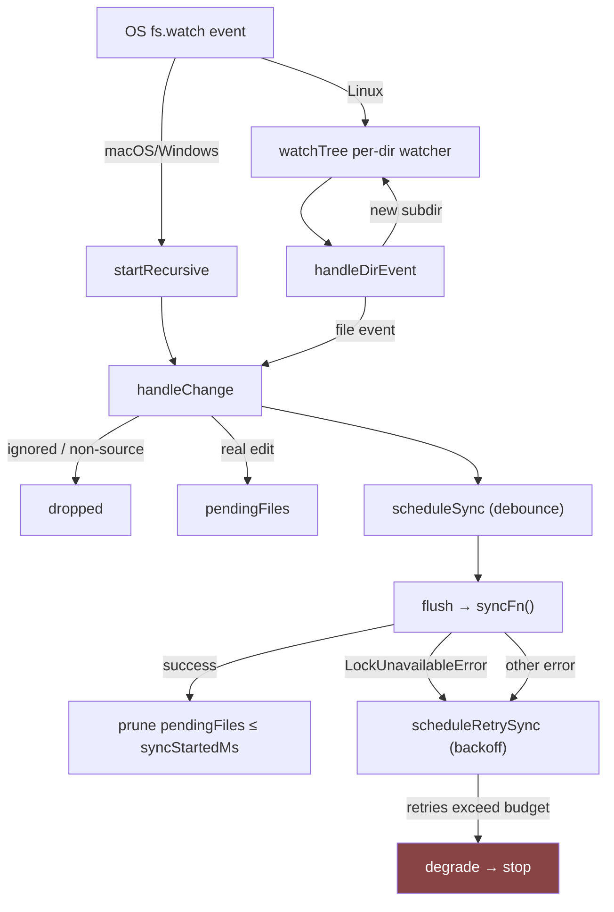

# FileWatcher — bounded-cost live re-indexing

## Overview
`sync/watcher.ts` is codegraph's answer to "how does the graph stay current without a
full re-index on every keystroke." Its key design idea isn't the debounce (that part is
routine) — it's that the watch strategy itself is chosen per-OS to keep resource cost
**bounded independent of repo size**: one recursive handle on macOS/Windows, one
inotify watch per directory (not per file) on Linux. That single decision is a direct
fix for a prior system-crashing bug (fd exhaustion from one watch per file on macOS),
and it shapes almost everything else in the file — the two start strategies, the
directory-watch cap, and the ENOSPC/EMFILE error branches all exist to keep that bound
honest. On top of the watch layer sits a small state machine — pending-file tracking,
debounce, and an exponential-backoff degrade latch — that turns raw OS events into a
single, safe, retryable call back into the sync pipeline.

## Diagram

## Design rationale (why it's built this way)
The file's own header comment is explicit about the two watch strategies existing
because native recursive `fs.watch` is only reliable on macOS/Windows. There,
[`startRecursive`](../catalog/src/sync/watcher.ts.md#FileWatcher.startRecursive) installs
a single recursive watcher that costs O(1) descriptors no matter the tree size — the doc
comment calls *this* the fix for "the macOS file-table exhaustion," where the previous
implementation held one open fd per watched *file* (tens of thousands of fds that
exhausted `kern.maxfiles` and crashed unrelated processes). Linux has no recursive mode,
so [`watchTree`](../catalog/src/sync/watcher.ts.md#FileWatcher.watchTree) instead walks
the tree and installs one inotify watch **per directory**, which is O(directories) rather
than O(files) — bounding a *different* cost, the kernel's inotify budget, not the macOS
file table.
[`maxDirWatches`](../catalog/src/sync/watcher.ts.md#maxDirWatches) then caps how many
directories Linux will watch (default 50,000, tunable via
`CODEGRAPH_MAX_DIR_WATCHES`) so a pathological monorepo can't exhaust the kernel's
`fs.inotify.max_user_watches` budget — hitting the cap logs once and silently leaves
the remaining subtree to `codegraph sync` as a backstop rather than failing.

A second rationale runs through [`flush`](../catalog/src/sync/watcher.ts.md#FileWatcher.flush):
`pendingFiles` is deliberately **not** cleared when a sync starts, only after it
succeeds, and only for entries whose `lastSeenMs` predates `syncStartedMs`. An edit
that lands mid-sync is ambiguous — it might or might not have been read by the
in-flight sync — and the code's own comment states the chosen bias: prefer a false
"shown stale, actually fresh" (costs the agent one extra Read) over a false "shown
fresh, actually stale" (misleads the agent into trusting a wrong answer). This
same asymmetric-cost reasoning explains why the two failure paths (lock contention via
`LockUnavailableError`, and generic sync failure) both count consecutive failures
([`lockRetryCount`](../catalog/src/sync/watcher.ts.md#FileWatcher.lockRetryCount),
[`syncFailureRetryCount`](../catalog/src/sync/watcher.ts.md#FileWatcher.syncFailureRetryCount))
and back off exponentially before calling
[`degrade`](../catalog/src/sync/watcher.ts.md#FileWatcher.degrade) — a deterministically
broken extractor or a `SQLITE_FULL` would otherwise retry forever at the debounce
cadence, silently killing the auto-update guarantee while still spamming logs.

> [!inferred] The choice to make `degrade()` a one-way latch until the next
> `start()` (rather than auto-recovering) reads as a safety bias: once the watcher
> has proven it can't keep the graph current, it stops pretending rather than
> serving stale results silently.

## Entry points
- [`watch`](../catalog/src/index.ts.md#CodeGraph.watch) — the public `CodeGraph` API
  method; constructs a `FileWatcher` wired to the engine's `sync()` and calls
  [`start`](../catalog/src/sync/watcher.ts.md#FileWatcher.start). This is where control
  first reaches this module from the rest of codegraph (CLI `serve`/daemon or MCP
  server enabling live sync).
- [`unwatch`](../catalog/src/index.ts.md#CodeGraph.unwatch) — calls
  [`stop`](../catalog/src/sync/watcher.ts.md#FileWatcher.stop) to tear the watcher down
  cleanly (used on shutdown or explicit disable).
- [`start`](../catalog/src/sync/watcher.ts.md#FileWatcher.start) — the real entry into
  the watch machinery: picks the per-OS strategy
  ([`startRecursive`](../catalog/src/sync/watcher.ts.md#FileWatcher.startRecursive) vs
  [`startPerDirectory`](../catalog/src/sync/watcher.ts.md#FileWatcher.startPerDirectory)),
  first checking [`watchDisabledReason`](../catalog/src/sync/watch-policy.ts.md#watchDisabledReason)
  to bail out on environments (WSL2 `/mnt/` drives) where `fs.watch` is unusably slow.

## Mechanism (step-by-step)
1. **Startup gating and scope setup.** [`start`](../catalog/src/sync/watcher.ts.md#FileWatcher.start)
   first resets retry counters, then asks
   [`watchDisabledReason`](../catalog/src/sync/watch-policy.ts.md#watchDisabledReason)
   whether this environment should skip live watching entirely — it returns non-null on
   WSL2 `/mnt/` mounts (detected via [`detectWsl`](../catalog/src/sync/watch-policy.ts.md#detectWsl)),
   where recursive `fs.watch` calls block long enough to break MCP startup handshakes.
   If watching proceeds, it builds `ignoreMatcher` via
   [`buildScopeIgnore`](../catalog/src/extraction/index.ts.md#buildScopeIgnore) — the
   *same* scope object the indexer's extraction pipeline uses (via
   [`discoverEmbeddedRepoRoots`](../catalog/src/extraction/index.ts.md#discoverEmbeddedRepoRoots),
   [`buildDefaultIgnore`](../catalog/src/extraction/index.ts.md#buildDefaultIgnore),
   [`findNestedGitRepos`](../catalog/src/extraction/index.ts.md#findNestedGitRepos)/
   [`findIgnoredEmbeddedRepos`](../catalog/src/extraction/index.ts.md#findIgnoredEmbeddedRepos)) —
   so the watcher can never drift out of sync with what the indexer actually scans.
2. **Installing the watch set.** On macOS/Windows,
   [`startRecursive`](../catalog/src/sync/watcher.ts.md#FileWatcher.startRecursive)
   installs a single recursive watcher and routes every event straight to
   [`handleChange`](../catalog/src/sync/watcher.ts.md#FileWatcher.handleChange). On
   Linux, [`startPerDirectory`](../catalog/src/sync/watcher.ts.md#FileWatcher.startPerDirectory)
   calls [`watchTree`](../catalog/src/sync/watcher.ts.md#FileWatcher.watchTree)
   recursively: it skips directories [`shouldIgnoreDir`](../catalog/src/sync/watcher.ts.md#FileWatcher.shouldIgnoreDir)
   flags, installs one watch per surviving directory, and on `EMFILE`/`ENFILE` calls
   [`degrade`](../catalog/src/sync/watcher.ts.md#FileWatcher.degrade) with the shared
   [`EXHAUSTION_REASON`](../catalog/src/sync/watcher.ts.md#EXHAUSTION_REASON) message
   (process-wide descriptor exhaustion means every further directory would fail too),
   while an `ENOSPC` (inotify budget) instead calls the non-fatal
   [`warnInotifyLimit`](../catalog/src/sync/watcher.ts.md#FileWatcher.warnInotifyLimit)
   and keeps the watches already installed.
3. **Routing a raw OS event to a project-relative path.** On Linux,
   [`handleDirEvent`](../catalog/src/sync/watcher.ts.md#FileWatcher.handleDirEvent)
   first checks whether the changed entry is itself a new directory (needs its own
   watch, since Linux has no recursive mode) via `statSync`, extending the tree with
   another [`watchTree`](../catalog/src/sync/watcher.ts.md#FileWatcher.watchTree) call
   if so; otherwise it normalizes the path
   ([`normalizePath`](../catalog/src/utils.ts.md#normalizePath)) and forwards to
   [`handleChange`](../catalog/src/sync/watcher.ts.md#FileWatcher.handleChange). The
   recursive-watch path calls `handleChange` directly with the raw filename.
4. **Filtering to real, in-scope source edits.** [`handleChange`](../catalog/src/sync/watcher.ts.md#FileWatcher.handleChange)
   is the single choke point both strategies funnel through: it drops
   `ignoreMatcher`-matched paths (checked via the same
   [`ignores`](../catalog/src/extraction/index.ts.md#ScopeIgnore.ignores) logic the
   indexer uses) and non-source extensions
   ([`isSourceFile`](../catalog/src/extraction/grammars.ts.md#isSourceFile), consulting
   per-project extension overrides from
   [`loadExtensionOverrides`](../catalog/src/project-config.ts.md#loadExtensionOverrides) →
   [`loadParsedConfig`](../catalog/src/project-config.ts.md#loadParsedConfig) →
   [`parseConfig`](../catalog/src/project-config.ts.md#parseConfig)). This check is
   load-bearing specifically for the recursive strategy, whose single OS stream reports
   events for ignored trees (`node_modules`, `dist`) too — nothing upstream has already
   filtered them. A surviving edit is recorded in
   [`pendingFiles`](../catalog/src/sync/watcher.ts.md#FileWatcher.pendingFiles) and
   triggers [`scheduleSync`](../catalog/src/sync/watcher.ts.md#FileWatcher.scheduleSync).
5. **Debounce, then reconcile.** [`scheduleSync`](../catalog/src/sync/watcher.ts.md#FileWatcher.scheduleSync)
   resets a single [`debounceTimer`](../catalog/src/sync/watcher.ts.md#FileWatcher.debounceTimer)
   on every qualifying edit so a burst of saves collapses into one
   [`flush`](../catalog/src/sync/watcher.ts.md#FileWatcher.flush) call after
   `debounceMs` (default 2000ms) of quiet. `flush` invokes the injected `syncFn`
   (wired by [`watch`](../catalog/src/index.ts.md#CodeGraph.watch) to the engine's real
   sync), clears only the pending entries the sync is guaranteed to have captured, and
   reports completion/failure through `onSyncComplete`
   ([`onSyncComplete`](../catalog/src/sync/watcher.ts.md#FileWatcher.onSyncComplete)) or
   `onSyncError` ([`onSyncError`](../catalog/src/sync/watcher.ts.md#FileWatcher.onSyncError)).
6. **Failure absorbs into retry, not data loss.** A `LockUnavailableError` (another
   process holds the write lock) or any other sync exception leaves `pendingFiles`
   untouched and increments the corresponding retry counter; once past
   `MAX_LOCK_RETRIES`/`MAX_SYNC_FAILURE_RETRIES` the watcher calls
   [`degrade`](../catalog/src/sync/watcher.ts.md#FileWatcher.degrade), which sets the
   one-way [`degradedReason`](../catalog/src/sync/watcher.ts.md#FileWatcher.degradedReason)
   latch, fires `onDegraded`
   ([`onDegraded`](../catalog/src/sync/watcher.ts.md#FileWatcher.onDegraded)), and calls
   [`stop`](../catalog/src/sync/watcher.ts.md#FileWatcher.stop) — closing
   `recursiveWatcher`/[`dirWatchers`](../catalog/src/sync/watcher.ts.md#FileWatcher.dirWatchers)
   and clearing `ignoreMatcher` and `pendingFiles`, but preserving `degradedReason`
   itself so a caller can still ask "why did auto-sync die."

## Key data structures
- [`pendingFiles`](../catalog/src/sync/watcher.ts.md#FileWatcher.pendingFiles) — a
  `Map<path, {firstSeenMs, lastSeenMs}>` of source files edited since the last clean
  sync; its docstring calls out that it's re-populated by events arriving mid-sync, and
  it is the basis of the MCP-facing staleness signal (a tool can tell an agent "this
  file's index entry may lag, re-Read it").
- [`ignoreMatcher`](../catalog/src/sync/watcher.ts.md#FileWatcher.ignoreMatcher) — the
  `ScopeIgnore` built once at [`start`](../catalog/src/sync/watcher.ts.md#FileWatcher.start)
  by the same [`buildScopeIgnore`](../catalog/src/extraction/index.ts.md#buildScopeIgnore)
  the extraction pipeline uses; it is torn down (`null`) on `stop()` and rebuilt fresh
  on the next `start()`, so an embedded repo added mid-session only joins scope after a
  restart.
- [`dirWatchers`](../catalog/src/sync/watcher.ts.md#FileWatcher.dirWatchers) — Linux
  only: `Map<absPath, fs.FSWatcher>`, one entry per watched directory, bounded by
  [`maxDirWatches`](../catalog/src/sync/watcher.ts.md#maxDirWatches).
- `degradedReason` / `lockRetryCount` / `syncFailureRetryCount` — the retry/latch state
  described above; all three are reset only by `start()` (the latch) or a clean sync
  (the counters).

## Dynamics (design intent)
The watcher is single-threaded JS-event-loop code with no explicit locking, but its
`syncing` flag guards against re-entrant [`flush`](../catalog/src/sync/watcher.ts.md#FileWatcher.flush)
calls: `flush` returns immediately if a sync is already in progress, and the `finally`
block is what decides whether to reschedule — either at the normal debounce cadence
([`scheduleSync`](../catalog/src/sync/watcher.ts.md#FileWatcher.scheduleSync)) if there
was no failure, or with exponential backoff
([`scheduleRetrySync`](../catalog/src/sync/watcher.ts.md#FileWatcher.scheduleRetrySync),
`debounceMs · 2^(n-1)` capped at `MAX_RETRY_BACKOFF_MS`) if either retry counter is
nonzero. Ordering between "this sync captured the edit" and "a new edit arrived
mid-sync" is resolved purely by timestamp comparison (`lastSeenMs` vs `syncStartedMs`)
inside `flush`, not by any queue — the file's own comment frames this as a deliberate
choice to bias toward false-stale over false-fresh.

> [!inferred] There is no explicit mutex around `ignoreMatcher`/`dirWatchers` mutation
> because `fs.watch` callbacks and `setTimeout` callbacks in Node all run on the same
> event-loop turn boundary — the class relies on that single-threaded execution model
> rather than any lock.

## Edge cases
- **WSL2 `/mnt/` drives skip live watching entirely** — [`watchDisabledReason`](../catalog/src/sync/watch-policy.ts.md#watchDisabledReason)
  returns non-null before any OS watch is installed, and `start()` returns `false`;
  callers fall back to manual `codegraph sync` or git hooks.
- **Directory-watch cap on Linux** — once [`dirWatchers`](../catalog/src/sync/watcher.ts.md#FileWatcher.dirWatchers)
  hits [`maxDirWatches`](../catalog/src/sync/watcher.ts.md#maxDirWatches), `watchTree`
  silently stops descending into new subtrees (logging once); those directories are
  live-blind until a manual sync.
- **inotify exhaustion vs process fd exhaustion are handled differently** — `ENOSPC`
  (kernel inotify budget) only warns and keeps existing watches; `EMFILE`/`ENFILE`
  (process-wide descriptor exhaustion) is treated as terminal and calls
  [`degrade`](../catalog/src/sync/watcher.ts.md#FileWatcher.degrade) because every
  further watch attempt would fail identically.
- **A lock-contention failure and a "real" sync failure are tracked as separate
  counters** ([`lockRetryCount`](../catalog/src/sync/watcher.ts.md#FileWatcher.lockRetryCount)
  vs [`syncFailureRetryCount`](../catalog/src/sync/watcher.ts.md#FileWatcher.syncFailureRetryCount)),
  each reset independently, but `flush`'s backoff calculation uses `Math.max` of the
  two so interleaved failure types still back off correctly.
- **`degradedReason` deliberately survives the `stop()` that `degrade()` triggers** —
  a reader might expect `stop()` to fully reset state, but the field is explicitly
  excluded from that reset so `isDegraded()` stays true until the next `start()`.

## Open questions
- The subgraph does not include `isAlwaysIgnored` or `unwatchDir` (both referenced from
  [`handleChange`](../catalog/src/sync/watcher.ts.md#FileWatcher.handleChange)/
  [`shouldIgnoreDir`](../catalog/src/sync/watcher.ts.md#FileWatcher.shouldIgnoreDir) and
  `watchTree`'s error handler respectively) — their exact ignore rules and per-directory
  teardown behavior aren't grounded here.
- Neither `isActive` nor `waitUntilReady`/`getPendingFiles` (the MCP-facing staleness
  API) appear in this packet's subgraph, so their exact contract with the MCP tool
  layer is out of scope for this page.
- What actually decides between "the CLI daemon calls `watch()` once at startup" vs
  "watch is re-armed per MCP session" is outside this module — [`watch`](../catalog/src/index.ts.md#CodeGraph.watch)
  is the only visible caller boundary in the subgraph.

## See also
- [CodeGraph orchestration API](index.ts.md) — owns the `watch`/`unwatch` lifecycle and
  wires `FileWatcher`'s `syncFn` to the real engine sync.
- [Extraction pipeline orchestration](extraction-index.ts.md) — the re-extraction the
  watcher's debounced `flush` ultimately triggers, and the source of the shared
  ignore-scope machinery (`buildScopeIgnore`, embedded-repo discovery) this module
  reuses verbatim.
- [`.codegraph` project directory discovery](directory.ts.md) — `isCodeGraphDataDir`,
  used transitively by the embedded-repo discovery this watcher's scope depends on.
- [Path validation/normalization utilities](utils.ts.md) — `normalizePath`, used on
  every event path before it reaches `pendingFiles` or the ignore matcher.
