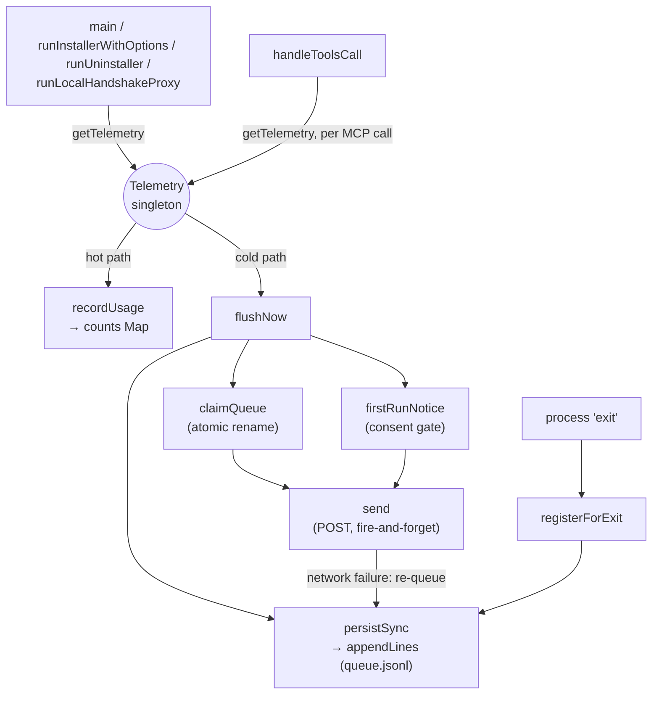

# The Telemetry client — buffered usage counters, sent fail-silent

## Overview
`src/telemetry/index.ts` is codegraph's anonymous usage-telemetry client — a small,
dependency-free module wrapped in a `Telemetry` class and a process-wide singleton,
[`getTelemetry`](../catalog/src/telemetry/index.ts.md#getTelemetry). It is **not** part
of codegraph's code-comprehension pipeline itself: it doesn't parse, index, resolve, or
query anything. Its only relationship to the comprehension lens is meta — its
`usage_rollup` counters are how the maintainers observe *which* comprehension tools
(`codegraph_explore`, `affected`, …) and which languages actually get used in the wild,
feeding back into where extractor/framework effort goes. The key design idea is a hard
split between two very different cost budgets: **recording** must be free (an in-memory
map increment on the MCP tool-call hot path), while **persisting and sending** are
allowed to touch disk and network, but only synchronously and tiny at process exit, or
opportunistically and bounded everywhere else — and every network failure mode resolves
to silence, never a retry loop or a visible error.

## Diagram

## Design rationale (why it's built this way)
The module's own header comment states four invariants, and nearly every non-obvious
choice below exists to satisfy one of them: zero hot-path cost, zero stdout (stdio is
the MCP protocol channel), "off is off," and fail-silent on every error.

**Recording and persisting are deliberately different operations.** [`recordUsage`](../catalog/src/telemetry/index.ts.md#Telemetry.recordUsage)'s
own doc comment is blunt about this: "In-memory increment — safe on the MCP tool-call
hot path." Nothing about calling it touches disk. Getting that data to disk is instead
the job of [`persistSync`](../catalog/src/telemetry/index.ts.md#Telemetry.persistSync),
described in its doc as "Synchronous, tiny, exit-safe," and it is wired to run inside a
`process.on('exit')` handler — the file's [`registerForExit`](../catalog/src/telemetry/index.ts.md#registerForExit)
comment explains why that specific event: `'exit'` fires even under `process.exit()`,
unlike `beforeExit`, and handlers there "must be synchronous," which rules out an async
flush at the point most CLI commands actually terminate.

**The consent notice is ordered around when bytes actually leave the machine, not when
usage is first recorded.** [`flushNow`](../catalog/src/telemetry/index.ts.md#Telemetry.flushNow)'s
inline comment spells out a subtle sequencing bug it avoids: recording only buffers
locally and stays silent, so [`firstRunNotice`](../catalog/src/telemetry/index.ts.md#Telemetry.firstRunNotice)
is deferred until immediately before [`send`](../catalog/src/telemetry/index.ts.md#Telemetry.send)
actually has something to transmit — "this lets the installer show its explicit consent
toggle before any notice can fire, instead of the preAction usage count pre-empting it."
If the notice fired at the first `recordUsage` call instead, a user running the
interactive installer could see the passive default-on notice before ever being asked.

**Sending is claimed, not locked.** [`claimQueue`](../catalog/src/telemetry/index.ts.md#Telemetry.claimQueue)'s
doc — "Atomically claim the queue for sending (rename). Concurrent processes can't
double-send" — chooses a filesystem rename as the concurrency primitive instead of a
lock file, because a rename is atomic and self-cleaning: two processes racing to rename
the same path can only have one succeed, and there is nothing to remember to release
except the renamed file itself, which [`recoverStaleClaims`](../catalog/src/telemetry/index.ts.md#Telemetry.recoverStaleClaims)
sweeps up if the process that claimed it dies mid-send.

## Entry points
- [`getTelemetry`](../catalog/src/telemetry/index.ts.md#getTelemetry) — the only way any
  other module obtains a `Telemetry` instance. It lazily constructs the process-wide
  singleton via [`<constructor>`](../catalog/src/telemetry/index.ts.md#Telemetry.-constructor)
  on first call and hands back the same instance thereafter, so every caller in the
  process shares one in-memory buffer.
- [`handleToolsCall`](../catalog/src/mcp/session.ts.md#MCPSession.handleToolsCall) —
  control reaches telemetry once per MCP tool invocation, and only *after* the tool's
  result is already written to the transport (its own comment: "telemetry must never
  delay a tool response"), calling [`recordUsage`](../catalog/src/telemetry/index.ts.md#Telemetry.recordUsage)
  with kind `'mcp_tool'`.
- [`main`](../catalog/src/bin/codegraph.ts.md#main) — the CLI process entry point;
  whichever subcommand runs, this is where a CLI invocation reaches
  [`flushNow`](../catalog/src/telemetry/index.ts.md#Telemetry.flushNow) /
  [`getStatus`](../catalog/src/telemetry/index.ts.md#Telemetry.getStatus) through
  `getTelemetry`.
- [`runInstallerWithOptions`](../catalog/src/installer/index.ts.md#runInstallerWithOptions)
  and [`runUninstaller`](../catalog/src/installer/index.ts.md#runUninstaller) — reached
  during interactive `codegraph install`/uninstall; both await
  [`flushNow`](../catalog/src/telemetry/index.ts.md#Telemetry.flushNow) directly, which
  is acceptable there because a one-time setup command already takes longer than the
  flush's own bounded timeout.
- [`runLocalHandshakeProxy`](../catalog/src/mcp/proxy.ts.md#runLocalHandshakeProxy) —
  reached when an MCP host's cold-start proxy serves a tool call in-process because the
  background daemon isn't answering yet; it threads a
  [`ClientInfo`](../catalog/src/telemetry/index.ts.md#ClientInfo) through to
  `recordUsage` for that fallback path only, so a call already counted by the daemon's
  own session is never counted twice.

## Mechanism (step-by-step)
1. **Recording is a pure in-memory increment.** [`recordUsage`](../catalog/src/telemetry/index.ts.md#Telemetry.recordUsage)
   builds a composite key from the UTC day, usage kind, name, and (truncated) client
   name/version, then either bumps an existing entry's [`c`](../catalog/src/telemetry/index.ts.md#CountLine.c)/[`e`](../catalog/src/telemetry/index.ts.md#CountLine.e)
   counters or inserts a fresh [`CountLine`](../catalog/src/telemetry/index.ts.md#CountLine)
   into the [`counts`](../catalog/src/telemetry/index.ts.md#Telemetry.counts) map — no
   disk, no network, no await. The first call on a process also arms
   [`ensureExitHook`](../catalog/src/telemetry/index.ts.md#Telemetry.ensureExitHook) so
   whatever accumulates is guaranteed a drain at exit even if nothing ever flushes
   explicitly.
2. **Exit is the only guaranteed persistence path.** [`registerForExit`](../catalog/src/telemetry/index.ts.md#registerForExit)
   installs exactly one process-level `'exit'` listener shared by every instance
   (comment: "N instances must not mean N listeners on process"), which calls
   [`persistSync`](../catalog/src/telemetry/index.ts.md#Telemetry.persistSync) on each
   registered [`exitInstances`](../catalog/src/telemetry/index.ts.md#exitInstances)
   member. `persistSync` drains `counts` and [`events`](../catalog/src/telemetry/index.ts.md#Telemetry.events)
   into [`BufferLine`](../catalog/src/telemetry/index.ts.md#BufferLine) records and hands
   them to [`appendLines`](../catalog/src/telemetry/index.ts.md#Telemetry.appendLines),
   which appends to the JSONL file at [`<get>queuePath`](../catalog/src/telemetry/index.ts.md#Telemetry.-get-queuePath).
3. **`flushNow` is the only path that touches the network, and only on explicit
   request** (from `main`, the installer/uninstaller flows, or
   [`maybeFlush`](../catalog/src/telemetry/index.ts.md#Telemetry.maybeFlush)'s
   fire-and-forget wrapper). It first calls `persistSync` so nothing in memory is lost,
   then [`recoverStaleClaims`](../catalog/src/telemetry/index.ts.md#Telemetry.recoverStaleClaims)
   to fold back any abandoned claim, then [`claimQueue`](../catalog/src/telemetry/index.ts.md#Telemetry.claimQueue)
   to atomically rename the queue file so no concurrent process can also claim it. Lines
   are then split by [`utcDay`](../catalog/src/telemetry/index.ts.md#Telemetry.utcDay):
   only completed-day count lines and any lifecycle line (recognized by having an
   [`ev`](../catalog/src/telemetry/index.ts.md#EventLine.ev) field) are sendable —
   today's still-open rollup stays buffered.
4. **The consent notice fires only immediately before the first bytes would actually
   leave the machine.** If there is anything sendable, `flushNow` calls
   [`firstRunNotice`](../catalog/src/telemetry/index.ts.md#Telemetry.firstRunNotice)
   before [`send`](../catalog/src/telemetry/index.ts.md#Telemetry.send). `firstRunNotice`
   checks [`readConfig`](../catalog/src/telemetry/index.ts.md#Telemetry.readConfig) for
   [`first_run_notice_shown`](../catalog/src/telemetry/index.ts.md#ConfigFile.first_run_notice_shown);
   if unset, it writes a fresh or updated config (minting
   [`machine_id`](../catalog/src/telemetry/index.ts.md#ConfigFile.machine_id) via
   [`writeConfig`](../catalog/src/telemetry/index.ts.md#Telemetry.writeConfig)) and emits
   one line to [`writeStderr`](../catalog/src/telemetry/index.ts.md#Telemetry.writeStderr) —
   never stdout, since stdio is the MCP protocol channel.
5. **`send` batches, POSTs, and never retries.** It builds one envelope per call —
   [`machine_id`](../catalog/src/telemetry/index.ts.md#ConfigFile.machine_id) from the
   config, [`SCHEMA_VERSION`](../catalog/src/telemetry/index.ts.md#SCHEMA_VERSION) — then
   slices the outgoing lines into chunks of at most
   [`MAX_EVENTS_PER_REQUEST`](../catalog/src/telemetry/index.ts.md#MAX_EVENTS_PER_REQUEST)
   and issues one POST per chunk. Its own doc — "Returns the lines that did NOT make it
   out (to be re-queued)" — describes the failure contract: any thrown error (offline,
   DNS, timeout) stops sending further chunks and returns everything from that point
   on, while a normal HTTP response of *any* status is treated as final, win or lose.
6. **Whatever didn't ship goes back to the queue.** [`flushNow`](../catalog/src/telemetry/index.ts.md#Telemetry.flushNow) concatenates `send`'s
   returned failures with the day-not-yet-complete `keep` list and re-appends them via
   `appendLines`, then removes the claim file — so a network failure is invisible to the
   caller except that the data simply waits for the next flush.

## Key data structures
- **[`BufferLine`](../catalog/src/telemetry/index.ts.md#BufferLine)** — a union of the
  two things that ever sit in the local queue: a usage-count delta or a lifecycle event
  (its own doc: "One buffered line: either a usage-count delta or a lifecycle event").
- **[`CountLine`](../catalog/src/telemetry/index.ts.md#CountLine)** — one
  `(day, kind, name, client)` rollup: [`d`](../catalog/src/telemetry/index.ts.md#CountLine.d)
  (UTC day), [`k`](../catalog/src/telemetry/index.ts.md#CountLine.k) (usage kind),
  [`n`](../catalog/src/telemetry/index.ts.md#CountLine.n) (name, truncated),
  [`c`](../catalog/src/telemetry/index.ts.md#CountLine.c)/[`e`](../catalog/src/telemetry/index.ts.md#CountLine.e)
  (call/error counts), and optional [`cn`](../catalog/src/telemetry/index.ts.md#CountLine.cn)/[`cv`](../catalog/src/telemetry/index.ts.md#CountLine.cv)
  (client name/version, MCP-only) plus a [`v`](../catalog/src/telemetry/index.ts.md#CountLine.v)
  schema stamp. Deliberately coarse — exact call sites, arguments, and file paths never
  enter this shape.
- **`EventLine`** (the `BufferLine` sibling) — an [`ev`](../catalog/src/telemetry/index.ts.md#EventLine.ev)
  (lifecycle kind), [`ts`](../catalog/src/telemetry/index.ts.md#EventLine.ts) timestamp,
  and free-form [`props`](../catalog/src/telemetry/index.ts.md#EventLine.props) bag.
- **[`counts`](../catalog/src/telemetry/index.ts.md#Telemetry.counts)** — the live
  `Map<string, CountLine>` that `recordUsage` mutates; keyed so repeat calls with the
  same day/kind/name/client collapse into one row instead of growing unboundedly per
  call.
- **[`ConfigFile`](../catalog/src/telemetry/index.ts.md#ConfigFile)** — the on-disk
  consent record: [`enabled`](../catalog/src/telemetry/index.ts.md#ConfigFile.enabled),
  `machine_id`, `consent_source`, `first_run_notice_shown`, and
  [`updated_at`](../catalog/src/telemetry/index.ts.md#ConfigFile.updated_at). Read
  through [`readConfig`](../catalog/src/telemetry/index.ts.md#Telemetry.readConfig),
  which caches into [`configCache`](../catalog/src/telemetry/index.ts.md#Telemetry.configCache)
  (`undefined` = not yet read, `null` = no config on disk — a three-state cache, not a
  plain boolean-or-null).
- **`TelemetryStatus`** — the resolved answer to "is telemetry on right now, and why":
  [`enabled`](../catalog/src/telemetry/index.ts.md#TelemetryStatus.enabled),
  [`decidedBy`](../catalog/src/telemetry/index.ts.md#TelemetryStatus.decidedBy) (its doc:
  "mirrors the precedence order"),
  [`machineId`](../catalog/src/telemetry/index.ts.md#TelemetryStatus.machineId), and
  [`configPath`](../catalog/src/telemetry/index.ts.md#TelemetryStatus.configPath).
- **[`ClientInfo`](../catalog/src/telemetry/index.ts.md#ClientInfo)** — the optional
  `{ name?, version? }` an MCP caller attaches so `mcp_tool` rollups can be broken down
  by which agent (Claude Code, Cursor, …) drove the call.

## Dynamics (design intent)
> [!inferred] The concurrency surface here is not threads but **independent OS
> processes** sharing one global state directory — a long-lived MCP daemon, an MCP proxy
> falling back in-process, and one-off CLI invocations can all be alive at once and all
> hold a `Telemetry` instance. This is inferred from the mechanism (atomic-rename
> claiming, a stale-claim sweep, a single shared exit listener) rather than stated
> outright in a single comment.

- [`registerForExit`](../catalog/src/telemetry/index.ts.md#registerForExit) registers
  one `process.on('exit')` listener no matter how many `Telemetry` instances exist in a
  process, iterating [`exitInstances`](../catalog/src/telemetry/index.ts.md#exitInstances)
  to call [`persistSync`](../catalog/src/telemetry/index.ts.md#Telemetry.persistSync) on
  each — relevant because tests construct their own short-lived instances and must not
  pile listeners onto the shared `process` object.
- [`claimQueue`](../catalog/src/telemetry/index.ts.md#Telemetry.claimQueue)'s atomic
  rename is what makes it safe for two processes to call `flushNow` at nearly the same
  moment against the same [`dir`](../catalog/src/telemetry/index.ts.md#Telemetry.dir):
  only one rename can succeed, and the loser's `claimQueue` call simply returns `null`
  ("no queue, or another process just claimed it") and does nothing further this round.
- [`recoverStaleClaims`](../catalog/src/telemetry/index.ts.md#Telemetry.recoverStaleClaims)
  is the recovery half of that same design: if a process dies between claiming the queue
  (the rename) and removing the claim file, the claimed file would otherwise sit
  orphaned forever; a later `flushNow` from *any* process merges a sufficiently old
  claim file's contents back into the live queue before proceeding.

## Edge cases
- **`readConfig`'s cache is three-valued, not boolean.** [`configCache`](../catalog/src/telemetry/index.ts.md#Telemetry.configCache)
  distinguishes "not read yet" (`undefined`) from "read and there is no valid config"
  (`null`) so a missing/corrupt config file is cached as a negative result instead of
  being re-read from disk on every call.
- **`send` never retries and treats every response as final** — "Any response — 204,
  4xx, anything — is final" per the inline comment; a transient 500 from the ingest
  endpoint is not distinguished from a permanent rejection, so a bad request silently
  drops that batch rather than looping.
- **A crashed sender's claim isn't lost, but isn't retried promptly either** —
  [`recoverStaleClaims`](../catalog/src/telemetry/index.ts.md#Telemetry.recoverStaleClaims)
  only merges a claim back after it has sat untouched for a while, so data from a
  process that died mid-send is delayed, not dropped, and only reappears once some
  *other* process happens to call `flushNow`.
- **The buffer file has a hard byte cap**, enforced in [`appendLines`](../catalog/src/telemetry/index.ts.md#Telemetry.appendLines):
  once the combined existing-plus-new payload exceeds the cap, the oldest lines are
  dropped first (a partial leading line is discarded too) — the comment is explicit
  about the tradeoff: "telemetry is best-effort — bounded disk use beats completeness."
- **Corrupt individual lines in the queue are skipped, not fatal** — [`claimQueue`](../catalog/src/telemetry/index.ts.md#Telemetry.claimQueue)
  parses the claimed file line-by-line inside its own try/catch and only keeps lines
  whose [`v`](../catalog/src/telemetry/index.ts.md#CountLine.v) matches the current
  [`SCHEMA_VERSION`](../catalog/src/telemetry/index.ts.md#SCHEMA_VERSION) — a stray
  corrupt line, or a line written by an older/newer schema version, is silently dropped
  rather than aborting the whole flush.
- **Default is on, not off.** [`getStatus`](../catalog/src/telemetry/index.ts.md#Telemetry.getStatus)'s
  precedence — environment `DO_NOT_TRACK`, then `CODEGRAPH_TELEMETRY`, then stored
  [`enabled`](../catalog/src/telemetry/index.ts.md#ConfigFile.enabled) config, then
  default — falls through to `{ enabled: true, decidedBy: 'default' }` when nothing has
  ever decided otherwise, so a user who never interacts with any consent surface is
  opted in by default and only ever informed via [`firstRunNotice`](../catalog/src/telemetry/index.ts.md#Telemetry.firstRunNotice)'s
  one-time stderr line.
- **`isEnabled` is re-checked at the last possible moment.** [`isEnabled`](../catalog/src/telemetry/index.ts.md#Telemetry.isEnabled)
  is a thin wrapper over `getStatus().enabled`, but `persistSync` re-checks it *after*
  already having drained `counts`/`events` into local variables — a mid-process
  `codegraph telemetry off` cannot resurrect the queue file from data already in flight
  toward being written.

## Open questions
> [!inferred] This packet's subgraph seeds on `<constructor>`, `flushNow`,
> `recordUsage`, and `send` — several real methods on `Telemetry` in the source (a
> `recordLifecycle` counterpart to `recordUsage` for install/index/uninstall events, an
> explicit `setEnabled`/opt-out toggle, `hasStoredChoice`, a `startInterval`/`stopInterval`
> pair for the long-lived MCP daemon, and a `packageVersion` helper used inside `send`)
> are not part of this subgraph and so are deliberately not linked or claimed here. The
> `EventLine`/`ev`/`props` fields above show that lifecycle events flow through the same
> `BufferLine` buffer as usage counts, but the exact call sites that produce them are out
> of scope for this page.
- What actually invokes `setEnabled` when a user runs `codegraph telemetry off`, and
  does turning telemetry off purge already-buffered data immediately or only at the next
  flush? Not visible from this subgraph.
- How does the long-lived MCP daemon schedule its periodic flush (an interval, tied to
  `maybeFlush`) versus the one-shot bounded await used by the installer? The subgraph
  shows `maybeFlush` wrapping `flushNow` but not what schedules repeated calls to it.
- This page is intentionally thin on "why does a code-comprehension survey include a
  telemetry client" — the honest answer is that it doesn't illuminate comprehension
  mechanics at all; it's included because it was ingested as its own packet, and its
  only real link to the survey's lens is that its counters are what tell codegraph's
  maintainers which comprehension features get used.

## See also
- [index.ts](index.ts.md) — the top-level `CodeGraph` orchestration API; full-index runs
  driven from there are the source of the lifecycle `'index'` events this module's
  `BufferLine`/`EventLine` shape is built to carry (see Open questions).
- [mcp-tools.ts](mcp-tools.ts.md) — the MCP tool surface whose per-tool executions are
  exactly what `recordUsage`'s `'mcp_tool'` rollups count, one call per
  `codegraph_explore`/`callers`/`impact` invocation.
- [mcp-daemon.ts](mcp-daemon.ts.md) — the background daemon that keeps the DB warm
  across MCP calls; its long-lived process is the natural home for this module's
  periodic-flush design (`maybeFlush`), as opposed to the one-shot bounded flush used by
  short-lived CLI commands.
