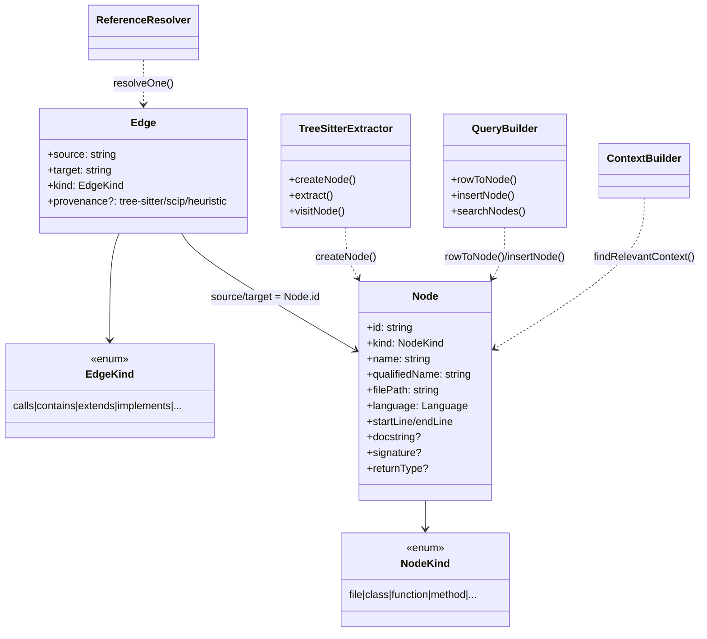

# The Node/Edge graph model

## Overview
`types.ts` is codegraph's representation substrate: it defines what a "symbol" and a
"relationship" *are* for every language, extractor, resolver, and query the tool has.
The central design idea is that all ~39 supported languages (`objc.ts`, `r.ts`, `kotlin.ts`,
`cobol.ts`, `vbnet.ts`, `solidity.ts`, `scala.ts`, `ruby.ts` and the rest) are flattened
into **one shape** — a single [`Node`](../catalog/src/types.ts.md#Node) interface with a
closed `kind` enum and one `Edge` shape with a closed `EdgeKind` enum — rather than each
language extractor inventing its own schema.
Everything downstream (SQLite storage, resolution, MCP tools) can then treat a Rust
struct, a Kotlin class, and a CFML component identically, because they all arrive as the
same `Node` fields. The tradeoff this buys — and costs — is the whole story of the file.

## Diagram

## Design rationale (why it's built this way)
The single biggest structural choice is that `NodeKind` and `Language` are **runtime-iterable
`as const` arrays** (`NODE_KINDS`, `LANGUAGES`) rather than plain TypeScript union types
declared with `type X = 'a' | 'b'`. The file's own comment explains why: "the same source
of truth backs both the TS type and any runtime validation (e.g. the search query
parser)." A plain union type disappears at compile time — you cannot iterate it, validate
a string against it, or build a CLI `--kind` flag's allowed-values list from it. By
defining the array first and deriving the type from it (`NodeKind = (typeof
NODE_KINDS)[number]`), one edit adds a kind everywhere it needs to exist — the CLI's
query parser, the resolver's kind filters, the type checker — with no risk of the
runtime and compile-time lists drifting apart. This is a strong signal for a project with
39 language extractors: each new extractor is under constant pressure to want "just one
more kind," and this pattern is the guardrail that keeps that from being a silent,
unvalidated string.

The [`id`](../catalog/src/types.ts.md#Node.id) field is a hash, not an auto-increment
integer or a UUID (its own doc comment calls it a "hash of file path + qualified name";
in practice `generateNodeId` hashes file path, kind, name, and **line number**). Hashing
makes identity **recomputable** without a database round-trip: any extractor, anywhere,
can compute a symbol's id deterministically before it's ever been inserted. But because
the hash folds in the line number, the id is *not* stable across an edit that shifts a
symbol's line — so
[`storeExtractionResult`](../catalog/src/extraction/index.ts.md#ExtractionOrchestrator.storeExtractionResult)
does **not** re-link cross-file edges by re-deriving old ids after a file changes. It
snapshots each surviving incoming edge together with its target's `(kind, name)` and
re-resolves to the re-indexed node's *new* id — matching by `(kind, name)` precisely
because that is stable across line shifts where the raw id is not.

> [!inferred] `Edge.provenance` (`'tree-sitter' | 'scip' | 'heuristic'`) is optional and,
> reading the field comment alone, appears designed so an edge can carry an audit trail of
> *how* it was produced — letting the resolver and any confidence-based logic distinguish a
> directly-parsed call from a framework-heuristic-synthesized one (e.g. dispatcher→handler
> edges). The type itself doesn't show that distinction being consumed; it only defines the
> vocabulary.

## Entry points
- [`Node`](../catalog/src/types.ts.md#Node) — the interface every extraction path
  constructs and every query path returns. [`createNode`](../catalog/src/extraction/tree-sitter.ts.md#TreeSitterExtractor.createNode)
  is the canonical construction site during parsing; [`rowToNode`](../catalog/src/db/queries.ts.md#rowToNode)
  is the canonical reconstruction site when reading back from SQLite. Control reaches
  `Node` construction on every file parsed and every row read — it is the busiest type in
  the codebase (its `id`, `kind`, and `filePath` fields are referenced from nearly every
  module in this subgraph, including every per-language extractor file and every
  per-framework resolver).
- [`searchNodes`](../catalog/src/db/queries.ts.md#QueryBuilder.searchNodes) — the query-time
  entry point that turns a raw text query into a list of `Node`s (via
  [`rowToNode`](../catalog/src/db/queries.ts.md#rowToNode)), reached whenever the CLI or an
  MCP tool needs to find symbols by name rather than by graph traversal.
- [`findRelevantContext`](../catalog/src/context/index.ts.md#ContextBuilder.findRelevantContext)
  — the entry point that assembles a `Subgraph` (a `Map<string, Node>` plus an `Edge[]`) for
  a natural-language-ish query, reached by [`handleExplore`](../catalog/src/mcp/tools.ts.md#ToolHandler.handleExplore),
  the MCP tool an agent calls to explore a codebase.
- [`main`](../catalog/src/bin/codegraph.ts.md#main) — the CLI process entry point; it is in
  this subgraph because the CLI's option parsing and output formatting ultimately move
  `Node`/`Edge`-shaped data (via `id`, `kind`, `filePath`) from the database to the
  terminal.

## Mechanism (step-by-step)
1. **Extraction constructs `Node`s from source.** Each language's tree-sitter walk (driven
   by [`visitNode`](../catalog/src/extraction/tree-sitter.ts.md#TreeSitterExtractor.visitNode))
   calls [`createNode`](../catalog/src/extraction/tree-sitter.ts.md#TreeSitterExtractor.createNode)
   whenever it recognizes a declaration — a function via
   [`extractMethod`](../catalog/src/extraction/tree-sitter.ts.md#TreeSitterExtractor.extractMethod),
   a variable via [`extractVariable`](../catalog/src/extraction/tree-sitter.ts.md#TreeSitterExtractor.extractVariable),
   a type alias via [`extractTypeAlias`](../catalog/src/extraction/tree-sitter.ts.md#TreeSitterExtractor.extractTypeAlias).
   `createNode` is the one place that computes `id` (via `generateNodeId`, hashing file
   path + kind + name + line) and stamps `filePath`, `language`, and the position fields —
   so every extractor, regardless of language, produces `Node`s with identical shape and
   identical identity semantics. [`extract`](../catalog/src/extraction/tree-sitter.ts.md#TreeSitterExtractor.extract)
   is the per-file driver on `TreeSitterExtractor` that returns the resulting
   `Node[]`/`Edge[]` pair.
2. **Non-tree-sitter formats build `Node`s by hand.** Not every extractor walks a grammar
   the same way: [`extractComponent`](../catalog/src/extraction/cfml-extractor.ts.md#CfmlExtractor.extractComponent)
   (CFML) and [`extractMapper`](../catalog/src/extraction/mybatis-extractor.ts.md#MyBatisExtractor.extractMapper)
   (MyBatis XML) construct `Node` object literals directly rather than going through
   `createNode`, because their source formats (tag-based CFML, XML mapper files) don't fit
   the generic tree-sitter-declaration walk. This is a case where the single `Node` shape
   is the contract but not every producer shares the same construction helper — an
   extension point a new non-AST format (a future YAML/JSON-based language) would follow.
3. **Persistence round-trips `Node` through SQLite unchanged in shape.**
   [`insertNode`](../catalog/src/db/queries.ts.md#QueryBuilder.insertNode) writes a `Node`'s
   fields into row columns, and [`rowToNode`](../catalog/src/db/queries.ts.md#rowToNode) is
   the exact inverse — it reconstructs a `Node` from a raw `NodeRow`, including parsing the
   `decorators`/`typeParameters` array fields back out of their JSON-serialized column
   storage. The DB layer never invents a different in-memory shape; a `Node` read back from
   SQLite is structurally identical to one just extracted.
4. **Resolution turns unresolved names into `Edge`s, using `Node` fields as the lookup
   keys.** [`resolveOne`](../catalog/src/resolution/index.ts.md#ReferenceResolver.resolveOne)
   and [`resolveViaImport`](../catalog/src/resolution/import-resolver.ts.md#resolveViaImport)
   both search existing `Node`s by `filePath`/`name`/`kind` to decide what an unresolved
   call or import target actually is. `createContext`
   ([`createContext`](../catalog/src/resolution/index.ts.md#ReferenceResolver.createContext))
   builds the lookup surface (`getNodesByName`, `getNodesInFile`, `getMethodMatches`, all
   keyed on `Node` fields) that every resolver — including the ~15 framework resolvers in
   this subgraph ([`nestjsResolver`](../catalog/src/resolution/frameworks/nestjs.ts.md#nestjsResolver),
   [`springResolver`](../catalog/src/resolution/frameworks/java.ts.md#springResolver),
   [`railsResolver`](../catalog/src/resolution/frameworks/ruby.ts.md#railsResolver),
   [`aspnetResolver`](../catalog/src/resolution/frameworks/csharp.ts.md#aspnetResolver),
   [`rustResolver`](../catalog/src/resolution/frameworks/rust.ts.md#rustResolver),
   [`goResolver`](../catalog/src/resolution/frameworks/go.ts.md#goResolver),
   [`djangoResolver`](../catalog/src/resolution/frameworks/python.ts.md#djangoResolver),
   [`reactResolver`](../catalog/src/resolution/frameworks/react.ts.md#reactResolver),
   [`svelteResolver`](../catalog/src/resolution/frameworks/svelte.ts.md#svelteResolver),
   [`laravelResolver`](../catalog/src/resolution/frameworks/laravel.ts.md#laravelResolver),
   [`vueResolver`](../catalog/src/resolution/frameworks/vue.ts.md#vueResolver),
   [`expressResolver`](../catalog/src/resolution/frameworks/express.ts.md#expressResolver),
   [`vaporResolver`](../catalog/src/resolution/frameworks/swift.ts.md#vaporResolver),
   [`swiftUIResolver`](../catalog/src/resolution/frameworks/swift.ts.md#swiftUIResolver),
   [`uikitResolver`](../catalog/src/resolution/frameworks/swift.ts.md#uikitResolver), and
   [`astroResolver`](../catalog/src/resolution/frameworks/astro.ts.md#astroResolver)) — reads
   from. Each framework resolver only ever *consumes* `Node`/`filePath`/`id`/`kind`; none of
   them extend or vary the `Node` shape, which is what lets
   [`cFnPointerDispatchEdges`](../catalog/src/resolution/c-fnptr-synthesizer.ts.md#cFnPointerDispatchEdges)
   (a C-specific dynamic-dispatch synthesizer) and a Rails route resolver both emit
   ordinary `Edge`s that every downstream consumer treats the same way.
5. **Query-time consumers assemble `Node`s into agent-facing answers.**
   [`findRelevantContext`](../catalog/src/context/index.ts.md#ContextBuilder.findRelevantContext)
   builds a `Subgraph` — the query-result shape holding `Map<string, Node>` plus `Edge[]`
   plus root ids — that [`handleExplore`](../catalog/src/mcp/tools.ts.md#ToolHandler.handleExplore)
   returns to the calling agent over MCP. [`searchNodes`](../catalog/src/db/queries.ts.md#QueryBuilder.searchNodes)
   is the narrower text-search counterpart, producing `SearchResult`s (a `Node` plus a
   relevance `score`) rather than a full subgraph.

## Key data structures
- **`Node`** — the symbol record: identity (`id`, computed as a hash so it's
  recomputable without a DB lookup), classification (`kind`, `language`), location
  (`filePath`, `startLine`/`endLine`, `startColumn`/`endColumn`), and a grab-bag of
  language-general modifiers (`visibility`, `isExported`, `isAsync`, `isStatic`,
  `isAbstract`, `decorators`, `typeParameters`, `returnType`) that not every language
  populates. `docstring` and `signature` carry the author-facing text a downstream
  context-builder can show verbatim instead of re-deriving it.
- **`NodeKind`** (22 values: `file`, `module`, `class`, `struct`, `interface`, `trait`,
  `protocol`, `function`, `method`, `property`, `field`, `variable`, `constant`, `enum`,
  `enum_member`, `type_alias`, `namespace`, `parameter`, `import`, `export`, `route`,
  `component`) — one closed vocabulary spanning every supported language's declaration
  forms. `route` and `component` are notably not general-purpose-language concepts; they
  exist because framework resolvers (Express routes, React components) need a `Node` kind
  to attach to.
- **`Edge`** — a directed relationship: `source`/`target` are `Node.id` strings (not
  object references), `kind` is the relationship type, and `metadata`/`line`/`column` carry
  call-site detail. `provenance` distinguishes a statically-parsed edge from a
  `heuristic`ally-synthesized one.
- **`EdgeKind`** (12 values: `contains`, `calls`, `imports`, `exports`, `extends`,
  `implements`, `references`, `type_of`, `returns`, `instantiates`, `overrides`,
  `decorates`) — the relationship vocabulary every resolver and extractor is constrained
  to emit.
- **`UnresolvedReference`** — the *pre-Edge* form: a reference an extractor saw but
  couldn't yet resolve to a target `Node.id` (e.g. a call to a name not yet indexed).
  `ReferenceKind` extends `EdgeKind` with one extra, internal-only value — `function_ref`
  — used for a function name captured as a *value* (a callback registration) rather than a
  call; the type comment is explicit that `function_ref` "never becomes an edge kind,"
  it is resolved to an ordinary `references` edge targeting function/method nodes.
- **`Subgraph`** — the query-result container: `nodes: Map<string, Node>` (not an array —
  keyed by id for O(1) membership checks during traversal), `edges: Edge[]`, `roots:
  string[]` (the entry points a traversal started from), and an optional `confidence:
  'high' | 'low'` flag. The doc comment on `confidence` is explicit about its purpose:
  `'low'` means the query "resolved only to isolated common-word matches (no entry point
  corroborated by 2+ distinct query terms)," a signal callers use to give an honest
  low-confidence handoff instead of presenting a thin result as comprehensive.
- **`SearchResult`** — a [`node`](../catalog/src/types.ts.md#SearchResult.node) paired with
  a relevance `score`. The score's doc comment warns it is "NOT normalized and NOT a 0-1
  fraction" — FTS5 BM25 scores are an unbounded magnitude while fuzzy/exact-match paths
  return roughly 0-1 — so it is only safe to use for relative ranking within one
  `searchNodes` call, never as a cross-call or absolute confidence measure.
- **`FileRecord`** — per-file bookkeeping (`contentHash`, `nodeCount`, `errors`) that lets
  incremental re-indexing detect an unchanged file by hash rather than re-parsing it.

## Dynamics (design intent)
> [!inferred] The type definitions themselves carry no concurrency or scheduling
> behavior — `types.ts` has no classes, no async methods, and no locking. Its dynamics
> are entirely in how *other* modules use these types over time, which is out of scope
> for this file: `id`'s hash-based recomputation (rather than a DB-assigned identity) is
> what makes multi-worker or incremental extraction safe to parallelize without an
> identity-allocation bottleneck, but that claim is inferred from the field's doc
> comment and design, not demonstrated by anything in this subgraph.

## Edge cases
- **Every "modifier" field on `Node` is optional** (`visibility`, `isExported`, `isAsync`,
  `isStatic`, `isAbstract`, `decorators`, `typeParameters`, `returnType`,
  `docstring`, `signature`) — a consumer cannot assume any of them are populated for a
  given `Node`, since which fields a given language's extractor fills in varies (e.g.
  `returnType` is documented as captured "for C/C++" specifically, to support chained
  call-receiver type inference — see the field comment referencing issue #645).
- **`id` is derived, not assigned** — two different extraction runs of the same unchanged
  symbol produce the same `id`, but the doc comment shows this depends on file path,
  kind, name, *and line number*, so a symbol that shifts lines (even from an unrelated
  edit above it, like a docstring change) gets a new `id` on re-index, which is why
  cross-file edge re-linking after a re-index has to match by `(filePath, kind, name)`
  rather than by `id` (see [`storeExtractionResult`](../catalog/src/extraction/index.ts.md#ExtractionOrchestrator.storeExtractionResult)'s
  cross-file-edge snapshot logic).
- **`Edge.source`/`target` are bare id strings**, not populated `Node` references — any
  consumer needs a separate `Node` lookup (typically through the `Subgraph.nodes` map or a
  `QueryBuilder` call) to go from an `Edge` to the actual symbols it connects.
- **`ReferenceKind`'s `function_ref` value is a trap for anyone reading `EdgeKind` in
  isolation** — it is a valid `ReferenceKind` (used only inside `UnresolvedReference`) but
  is explicitly documented as never surfacing as a persisted `Edge.kind`; code that
  switches over `EdgeKind` values will never see it, but code switching over
  `ReferenceKind` must handle it.

## Open questions
> [!inferred] The subgraph doesn't show where `NodeKind`/`EdgeKind` values are validated
> against `NODE_KINDS`/an equivalent edge-kind array at runtime (the file's own comment
> says the const-array pattern exists partly to back "runtime validation," e.g. the search
> query parser, but the query parser itself is not part of this subgraph).
- What decides `Edge.provenance` today beyond the three static string values — is
  `'heuristic'` provenance ever surfaced back to a resolver to affect resolution
  confidence, or is it purely descriptive metadata for downstream consumers? Not visible
  from this subgraph alone.

## See also
- [db-queries.ts](db-queries.ts.md) — the `QueryBuilder` that is the primary
  Node/Edge persistence and query layer over this data model.
- [extraction-tree-sitter.ts](extraction-tree-sitter.ts.md) — the core extraction
  engine (`TreeSitterExtractor`) that is the busiest constructor of `Node`s across all
  languages.
- [resolution-index.ts](resolution-index.ts.md) — `ReferenceResolver`, which turns
  `UnresolvedReference`s into `Edge`s using this file's types as its lookup contract.
- [mcp-tools.ts](mcp-tools.ts.md) — the MCP tool surface (`handleExplore` and others)
  that packages `Node`/`Subgraph` data for an agent to consume.
