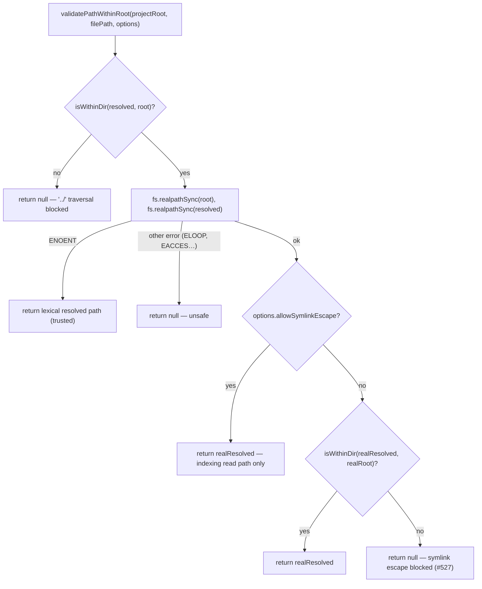
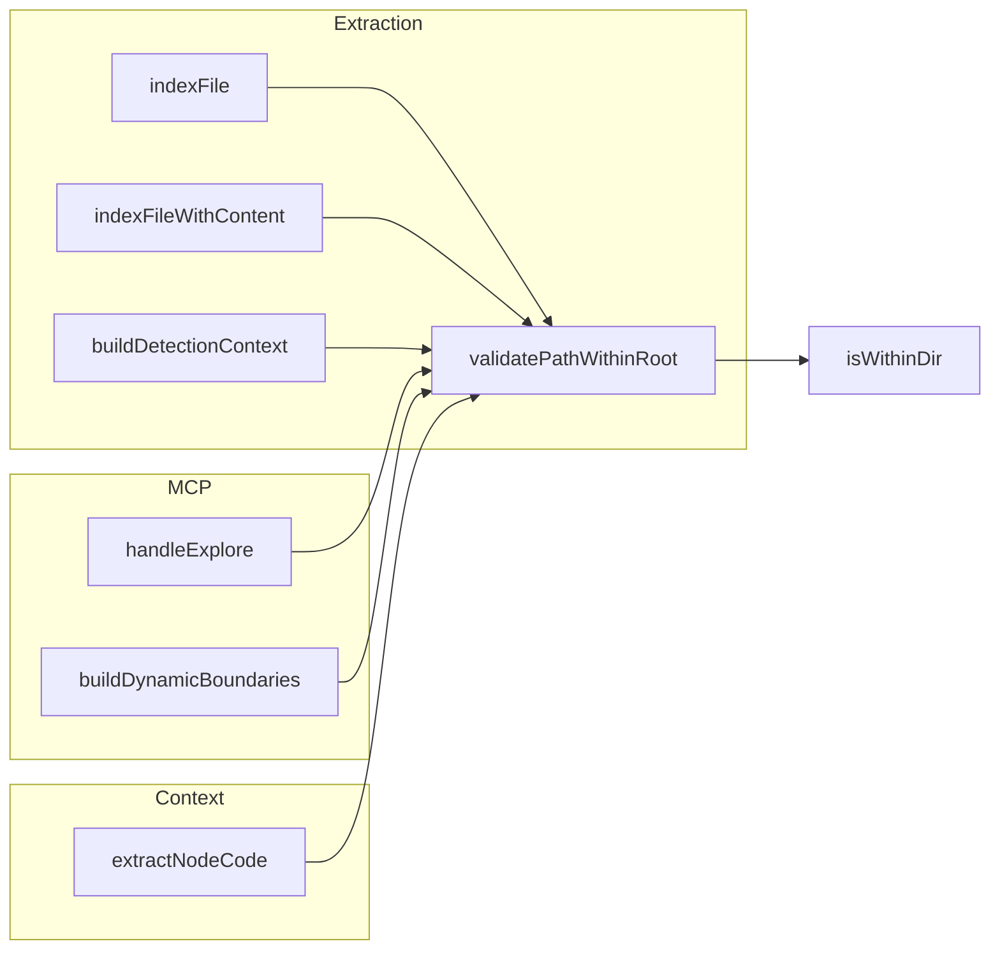

# utils.ts — the path-safety chokepoint and process-coordination primitives

## Overview
`src/utils.ts` is codegraph's low-level utility spine — not a themed subsystem but a
small file whose exports every other layer imports from directly rather than touching
`fs`/OS primitives themselves. This packet's subgraph makes that concrete: the "called
by" lists for [`validatePathWithinRoot`](../catalog/src/utils.ts.md#validatePathWithinRoot)
and [`normalizePath`](../catalog/src/utils.ts.md#normalizePath) fan out across
extraction, sync, resolution, context, and MCP — every place codegraph turns a
graph-stored path back into a real filesystem read funnels through here first. The key
design idea is that **path safety is enforced at the read sink, not just at discovery
time**: `validatePathWithinRoot` is the one function that decides whether a path a node
claims to live at is actually still inside the project root before any content is
served to an agent, closing the gap between "the indexer once saw this path" and "it's
safe to read now." Sitting alongside it are two unrelated but equally load-bearing
concerns — [`FileLock`](../catalog/src/utils.ts.md#FileLock) (cross-process mutual
exclusion so the CLI, MCP daemon, and git hooks never write the SQLite DB at the same
time) and `MemoryMonitor` (heap-usage polling for long indexing runs). The fan-out
itself is a good demonstration of the tool this repo builds: an agent asking "is this
security check applied everywhere it needs to be" gets the answer from one
callers-query instead of grepping the whole tree — exactly the retrieval codegraph's
own MCP surface exists to make cheap.

## Diagram

A second view shows why this is a chokepoint rather than an isolated helper — the
callers span every layer that ever turns a stored path back into file content:

## Design rationale (why it's built this way)
[`validatePathWithinRoot`](../catalog/src/utils.ts.md#validatePathWithinRoot)'s own
docstring frames it as deliberately two-layered: a cheap lexical
[`isWithinDir`](../catalog/src/utils.ts.md#isWithinDir) check catches a `../` string
traversal before any syscall, and only then does it pay for `fs.realpathSync` on both
sides to catch the case a lexical check alone misses — an in-repo symlink whose logical
path sits inside the root but whose real target points outside it (issue #527). The
docstring calls both content-serving sinks (`codegraph_node`'s `includeCode`,
`codegraph_explore`'s source rendering) out by name as the reason this exists: "this is
the chokepoint that keeps out-of-root file contents from leaking."

The [`allowSymlinkEscape`](../catalog/src/utils.ts.md#validatePathWithinRoot.options-typeLiteral9.allowSymlinkEscape)
option exists to resolve a specific tension: the directory walk that discovers files to
index deliberately follows in-root symlinks whose targets live outside the root (the
docstring's example is a `game/` symlink in a Dota custom-game tree, issue #935), so if
the *read* path rejected the same symlinks the walk had just followed, every file the
walk enumerated would fail to index. The flag waives only the realpath-escape rejection
— the lexical `../` guard still applies even with it set — and per the source, only
[`indexFile`](../catalog/src/extraction/index.ts.md#ExtractionOrchestrator.indexFile)
and [`indexFileWithContent`](../catalog/src/extraction/index.ts.md#ExtractionOrchestrator.indexFileWithContent)
ever pass it. Every content-serving sink in the subgraph —
[`handleExplore`](../catalog/src/mcp/tools.ts.md#ToolHandler.handleExplore),
[`extractNodeCode`](../catalog/src/context/index.ts.md#ContextBuilder.extractNodeCode),
[`buildDetectionContext`](../catalog/src/extraction/index.ts.md#ExtractionOrchestrator.buildDetectionContext),
[`buildDynamicBoundaries`](../catalog/src/mcp/tools.ts.md#ToolHandler.buildDynamicBoundaries)
— calls `validatePathWithinRoot` with no options at all, so the escape-permitting
branch never executes on their behalf; the docstring's own comment underlines this is
intentional ("indexing only reads paths it just discovered, into a local index — it
never serves them to an agent, so this does not widen the #527 leak surface").

[`FileLock`](../catalog/src/utils.ts.md#FileLock)'s staleness rule pairs two signals
rather than trusting either alone: [`isProcessAlive`](../catalog/src/utils.ts.md#FileLock.isProcessAlive)
(a `kill(pid, 0)` probe) guards against a lock file whose owner already died, while
[`STALE_TIMEOUT_MS`](../catalog/src/utils.ts.md#FileLock.STALE_TIMEOUT_MS)'s docstring
states the lock is stale "regardless of PID status" once it's older than 2 minutes —
protecting against PID reuse after a crash, where a dead owner's PID gets recycled by
some unrelated live process that would otherwise defeat the liveness check.

> [!inferred] Every `FileLock.acquire()` call site visible in this subgraph
> ([`indexAll`](../catalog/src/index.ts.md#CodeGraph.indexAll),
> [`sync`](../catalog/src/index.ts.md#CodeGraph.sync),
> [`indexFiles`](../catalog/src/index.ts.md#CodeGraph.indexFiles),
> [`healSegmentVocabIfEmpty`](../catalog/src/index.ts.md#CodeGraph.healSegmentVocabIfEmpty))
> wraps it inside a second, in-process lock not covered by this packet's subgraph — so
> the file lock is cross-process serialization nested inside per-process
> serialization, not the sole guard against concurrent writers.

## Entry points
- [`handleExplore`](../catalog/src/mcp/tools.ts.md#ToolHandler.handleExplore) — the MCP
  `codegraph_explore` tool handler; a content-serving sink that reaches
  `validatePathWithinRoot` while rendering source for the subgraph it found.
- [`indexFile`](../catalog/src/extraction/index.ts.md#ExtractionOrchestrator.indexFile) /
  [`indexFileWithContent`](../catalog/src/extraction/index.ts.md#ExtractionOrchestrator.indexFileWithContent) —
  the indexing read path, the only two callers that pass `allowSymlinkEscape`; control
  reaches here from every full or per-file index run.
- [`extractNodeCode`](../catalog/src/context/index.ts.md#ContextBuilder.extractNodeCode) —
  the `ContextBuilder`'s code-block extraction for a given node, gated first by a
  config-leaf check (never reads a secret's value off disk) before it ever reaches
  `validatePathWithinRoot`.
- [`indexAll`](../catalog/src/index.ts.md#CodeGraph.indexAll),
  [`sync`](../catalog/src/index.ts.md#CodeGraph.sync),
  [`indexFiles`](../catalog/src/index.ts.md#CodeGraph.indexFiles), and
  [`healSegmentVocabIfEmpty`](../catalog/src/index.ts.md#CodeGraph.healSegmentVocabIfEmpty) —
  every top-level `CodeGraph` write operation calls
  [`acquire`](../catalog/src/utils.ts.md#FileLock.acquire) first; this is where control
  reaches the cross-process lock.
- [`watchTree`](../catalog/src/sync/watcher.ts.md#FileWatcher.watchTree),
  [`startRecursive`](../catalog/src/sync/watcher.ts.md#FileWatcher.startRecursive), and
  [`handleDirEvent`](../catalog/src/sync/watcher.ts.md#FileWatcher.handleDirEvent) — the
  file watcher normalizes every raw OS event path through
  [`normalizePath`](../catalog/src/utils.ts.md#normalizePath) before it reaches
  downstream ignore/change logic.
- [`start`](../catalog/src/utils.ts.md#MemoryMonitor.start) — the memory-monitor's own
  entry point; this subgraph has no in-subgraph caller for it (see Open questions), so
  it is documented here as instrumentation whose wiring site is outside this packet.

## Mechanism (step-by-step)
1. **Lexical containment first.** [`validatePathWithinRoot`](../catalog/src/utils.ts.md#validatePathWithinRoot)
   resolves `filePath` against `projectRoot` with `path.resolve`, then calls
   [`isWithinDir`](../catalog/src/utils.ts.md#isWithinDir) to reject anything whose
   resolved string isn't the root itself or a path underneath it — a `../../etc/passwd`
   style traversal is rejected here without ever touching the filesystem.
2. **Symlink-aware recheck, branching on intent.** The function then resolves real
   paths with `fs.realpathSync` on both root and target. If the caller passed
   [`allowSymlinkEscape`](../catalog/src/utils.ts.md#validatePathWithinRoot.options-typeLiteral9.allowSymlinkEscape),
   the realpath is trusted outright (the indexing-only relaxation); otherwise
   `isWithinDir` runs a second time against the *real* paths, so a symlink whose
   logical location is in-root but whose target escapes it is still rejected.
3. **Trusting the lexical result only on ENOENT.** If `realpathSync` throws because the
   path doesn't exist yet — a file about to be written, or an index row for a
   since-deleted file — [`validatePathWithinRoot`](../catalog/src/utils.ts.md#validatePathWithinRoot)
   falls back to the already-lexically-validated path rather than failing; any other
   resolution error (`ELOOP`, `EACCES`, …) is treated as unsafe and returns `null`.
4. **`normalizePath` as the shared string form.** [`normalizePath`](../catalog/src/utils.ts.md#normalizePath)
   is a one-line backslash-to-forward-slash rewrite, but it's the common denominator
   every path comparison and stored path relies on — git-status parsing
   ([`collectGitStatus`](../catalog/src/extraction/index.ts.md#collectGitStatus)),
   embedded-repo discovery
   ([`discoverEmbeddedRepoRoots`](../catalog/src/extraction/index.ts.md#discoverEmbeddedRepoRoots),
   [`collectGitFiles`](../catalog/src/extraction/index.ts.md#collectGitFiles),
   [`findIgnoredEmbeddedRepos`](../catalog/src/extraction/index.ts.md#findIgnoredEmbeddedRepos),
   [`gitlinkEmbeddedRepoSkipped`](../catalog/src/extraction/index.ts.md#gitlinkEmbeddedRepoSkipped)),
   the fallback filesystem walk
   ([`scanDirectoryWalk`](../catalog/src/extraction/index.ts.md#scanDirectoryWalk)), the
   watcher ([`watchTree`](../catalog/src/sync/watcher.ts.md#FileWatcher.watchTree),
   [`shouldIgnoreDir`](../catalog/src/sync/watcher.ts.md#FileWatcher.shouldIgnoreDir),
   [`ingestEventForTests`](../catalog/src/sync/watcher.ts.md#FileWatcher.ingestEventForTests)),
   and WSL drive-mount detection
   ([`isWindowsDriveMount`](../catalog/src/sync/watch-policy.ts.md#isWindowsDriveMount))
   all normalize before comparing or storing, so a Windows-produced path never silently
   diverges from a POSIX-produced one for the same file.
5. **`FileLock`'s stale-vs-live decision.** [`acquire`](../catalog/src/utils.ts.md#FileLock.acquire)
   checks whether [`lockPath`](../catalog/src/utils.ts.md#FileLock.lockPath) exists; if
   so it reads the PID inside, compares the lock file's mtime age against
   [`STALE_TIMEOUT_MS`](../catalog/src/utils.ts.md#FileLock.STALE_TIMEOUT_MS), and only
   throws "locked by another process" when the lock is both young enough *and* its PID
   is still alive per [`isProcessAlive`](../catalog/src/utils.ts.md#FileLock.isProcessAlive);
   otherwise it deletes the stale file and writes its own PID with an exclusive-create
   flag, setting [`held`](../catalog/src/utils.ts.md#FileLock.held) to `true` (an
   `EEXIST` on that write means a second process won the race and still throws).
   [`withLock`](../catalog/src/utils.ts.md#FileLock.withLock) and
   [`withLockAsync`](../catalog/src/utils.ts.md#FileLock.withLockAsync) are convenience
   wrappers that call `acquire()`, run the supplied function, and release in a
   `finally` — though the visible top-level callers
   ([`indexAll`](../catalog/src/index.ts.md#CodeGraph.indexAll),
   [`sync`](../catalog/src/index.ts.md#CodeGraph.sync)) call
   [`acquire`](../catalog/src/utils.ts.md#FileLock.acquire) directly rather than through
   either wrapper, presumably because they need progress callbacks and resolver work
   interleaved between acquire and release.
6. **`MemoryMonitor`'s poll loop.** [`start`](../catalog/src/utils.ts.md#MemoryMonitor.start)
   first calls [`stop`](../catalog/src/utils.ts.md#MemoryMonitor.stop) to clear any
   existing interval and resets [`peakUsage`](../catalog/src/utils.ts.md#MemoryMonitor.peakUsage)
   to zero, then installs a `setInterval` that samples `process.memoryUsage().heapUsed`,
   updates [`peakUsage`](../catalog/src/utils.ts.md#MemoryMonitor.peakUsage) when the
   sample is a new high, and invokes
   [`onThresholdExceeded`](../catalog/src/utils.ts.md#MemoryMonitor.onThresholdExceeded)
   whenever usage exceeds [`threshold`](../catalog/src/utils.ts.md#MemoryMonitor.threshold) —
   tracked via [`checkInterval`](../catalog/src/utils.ts.md#MemoryMonitor.checkInterval)
   so a later `stop()` can clear it.

## Key data structures
- [`FileLock`](../catalog/src/utils.ts.md#FileLock) — [`lockPath`](../catalog/src/utils.ts.md#FileLock.lockPath)
  (the on-disk marker file), [`held`](../catalog/src/utils.ts.md#FileLock.held) (whether
  *this* instance currently owns the lock, gating whether `release` acts), and the
  static [`STALE_TIMEOUT_MS`](../catalog/src/utils.ts.md#FileLock.STALE_TIMEOUT_MS)
  (2 minutes) that bounds how long a crashed owner can block others.
- `MemoryMonitor`'s instance state — [`checkInterval`](../catalog/src/utils.ts.md#MemoryMonitor.checkInterval)
  (the live timer handle, or `null` when stopped), [`peakUsage`](../catalog/src/utils.ts.md#MemoryMonitor.peakUsage)
  (running high-water mark, reset on every `start()`), [`threshold`](../catalog/src/utils.ts.md#MemoryMonitor.threshold)
  (byte cutoff set from the constructor's MB argument), and
  [`onThresholdExceeded`](../catalog/src/utils.ts.md#MemoryMonitor.onThresholdExceeded)
  (the optional callback fired on each over-threshold sample, not just once).
- The [`allowSymlinkEscape`](../catalog/src/utils.ts.md#validatePathWithinRoot.options-typeLiteral9.allowSymlinkEscape)
  boolean — a single option field that is the entire difference between the indexing
  read path and every content-serving read path.

## Dynamics (design intent)
[`FileLock`](../catalog/src/utils.ts.md#FileLock) is a synchronous, file-based mutex
meant to serialize DB *writers* across process boundaries (CLI invocations, an MCP
daemon, a git hook all touching the same `.codegraph` SQLite file), not threads within
one process. Its top-level callers —
[`indexAll`](../catalog/src/index.ts.md#CodeGraph.indexAll),
[`sync`](../catalog/src/index.ts.md#CodeGraph.sync),
[`indexFiles`](../catalog/src/index.ts.md#CodeGraph.indexFiles),
[`healSegmentVocabIfEmpty`](../catalog/src/index.ts.md#CodeGraph.healSegmentVocabIfEmpty) —
all fail soft when [`acquire`](../catalog/src/utils.ts.md#FileLock.acquire) throws: the
source shows each wrapping the `acquire()` call in its own `try/catch` and returning a
zero-progress, non-throwing result rather than propagating the lock error, which is
consistent with codegraph's broader "expected conditions return success-shaped
guidance" pattern documented at the MCP layer.
[`start`](../catalog/src/utils.ts.md#MemoryMonitor.start)'s `setInterval`
runs on the same Node event loop as the rest of the process, so its threshold callback
fires between ticks of whatever long-running indexing work it's observing — it cannot
preempt that work, only report on it.

## Edge cases
- A crashed-but-not-yet-reaped process, or a legitimate indexing run that simply takes
  longer than [`STALE_TIMEOUT_MS`](../catalog/src/utils.ts.md#FileLock.STALE_TIMEOUT_MS)
  (2 minutes), both look identical to [`acquire`](../catalog/src/utils.ts.md#FileLock.acquire):
  the lock is removed and re-grabbed by whoever calls next, regardless of the original
  owner's `isProcessAlive` status once the age threshold is crossed.
- [`validatePathWithinRoot`](../catalog/src/utils.ts.md#validatePathWithinRoot)'s ENOENT
  fallback trusts a nonexistent path based purely on the lexical check — there's no
  filesystem confirmation for the race where a path is deleted or not-yet-created,
  since a nonexistent path has no symlink target to escape through in the first place.
- [`isWithinDir`](../catalog/src/utils.ts.md#isWithinDir) only lowercases both sides on
  `win32` (NTFS case-insensitivity plus `realpathSync` potentially returning different
  case than the lexical root) — a case-sensitive filesystem mounted under Windows is
  not the assumption this code makes.
- [`start`](../catalog/src/utils.ts.md#MemoryMonitor.start) silently
  discards the previous peak on every call — restarting monitoring mid-run (it calls
  [`stop`](../catalog/src/utils.ts.md#MemoryMonitor.stop) and zeroes
  [`peakUsage`](../catalog/src/utils.ts.md#MemoryMonitor.peakUsage) internally) means a
  caller that calls `start()` twice loses the first interval's high-water mark.

## Open questions
- No symbol in this subgraph calls [`start`](../catalog/src/utils.ts.md#MemoryMonitor.start) —
  where codegraph actually wires memory-threshold monitoring into a real indexing run
  (a CLI progress hook, most likely) is outside this packet.
- `FileLock`'s `release()` method is not itself a subgraph symbol; its behavior is only
  visible indirectly through [`withLock`](../catalog/src/utils.ts.md#FileLock.withLock)/[`withLockAsync`](../catalog/src/utils.ts.md#FileLock.withLockAsync)'s
  own `finally` block in source, not as an independently cited claim here.
- A separate guard, `validateProjectPath` (sensitive-system-directory refusal for a
  project root argument), lives in the same file but isn't in this packet's subgraph —
  how it composes with `validatePathWithinRoot` at a request's entry point isn't shown.

## See also
- [.codegraph project directory discovery](directory.ts.md) — the other path-safety
  surface in the codebase; project-root discovery and this module's root-containment
  check are the two halves of "is this path inside the right project."
- [Extraction pipeline orchestration](extraction-index.ts.md) — the heaviest caller of
  both `validatePathWithinRoot` and `normalizePath` in this subgraph (`indexFile`,
  `indexFileWithContent`, `buildDetectionContext`, and the git/embedded-repo discovery
  functions all live there).
- [The MCP tool surface — explore, callers, impact](mcp-tools.ts.md) — the
  content-serving side of the boundary: `handleExplore` and `buildDynamicBoundaries`
  are exactly the sinks `allowSymlinkEscape` is never allowed to reach.
- [The CodeGraph orchestration facade](index.ts.md) — owns every `FileLock.acquire()`
  call site visible in this subgraph (`indexAll`, `sync`, `indexFiles`,
  `healSegmentVocabIfEmpty`).
