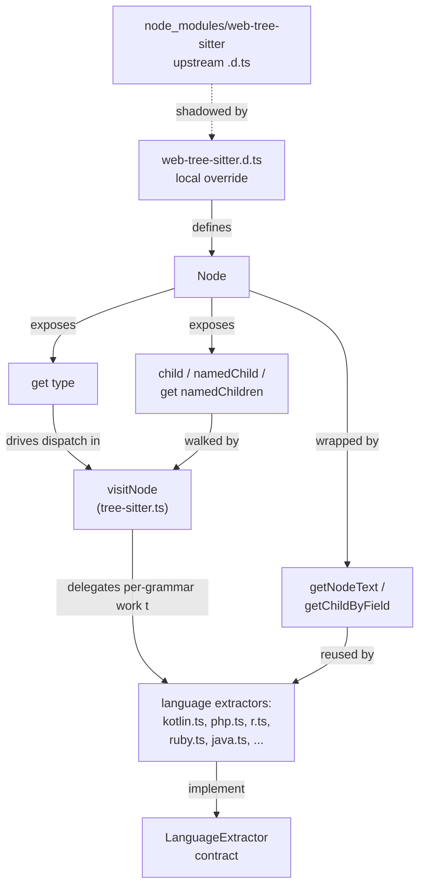

# web-tree-sitter.d.ts — the CST substrate underneath every language extractor

## Overview

`web-tree-sitter.d.ts` has zero runtime logic — it's an ambient module augmentation (`declare module 'web-tree-sitter'`) that TypeScript resolves *instead of* the type declarations shipped inside `node_modules/web-tree-sitter` itself, because a local `.d.ts` wins module resolution over the package's own. Its one substantive decision is to narrow the upstream `Node.children`/`Node.namedChildren` types from `(Node | null)[]` to non-nullable `Node[]`, trading strict-null accuracy for an invariant the whole extraction pipeline can lean on without guarding every array access. But the more consequential fact for comprehension is what actually gets *used*: of the whole declared API (`Parser`, `Language`, `Tree`, `Node`, `TreeCursor`, and roughly 40 combined members), the extraction pipeline funnels through a strikingly narrow slice of `Node` — its `type` tag and its child-navigation accessors — and that narrow slice is the one interface every one of codegraph's 20+ per-language extractor modules is written against.

## Diagram

## Design rationale (why it's built this way)

The file's own header states the reasoning directly: "The upstream types declare children/namedChildren as `(Node | null)[]`, but in practice they never contain null entries. This override uses non-nullable arrays to match native tree-sitter's API and avoid pervasive null-check changes across the extraction pipeline." That's a deliberate trade: rather than have every consumer of [`Node`](../catalog/src/web-tree-sitter.d.ts.md#Node) — every language module, every walker — filter or non-null-assert each entry of a children array, the type system is told up front that the array is fully populated, and the small risk (a future WASM binding version genuinely emitting a null) is absorbed once here instead of at each of dozens of call sites.

> [!inferred] Scoping the fix as a `declare module` augmentation (rather than, say, patching `web-tree-sitter`'s own `.d.ts` in `node_modules` or forking the package) means the override travels with the codegraph source tree and survives a normal `npm install`/`npm ci` — a `patch-package`-style fix would need to be reapplied or hidden behind a postinstall step, which this file's plain declaration-merging approach avoids.

## Entry points

- [`Node`](../catalog/src/web-tree-sitter.d.ts.md#Node) — the class every extraction path actually touches; a parsed file's CST is nothing but a tree of these, and control reaches into this module's declarations the moment any extractor calls a `Node` accessor rather than the class's own (nonexistent) runtime code.
- [`<get>type`](../catalog/src/web-tree-sitter.d.ts.md#Node.-get-type) — the property [`visitNode`](../catalog/src/extraction/tree-sitter.ts.md#TreeSitterExtractor.visitNode) and effectively every language module (e.g. `kotlin.ts`, `ruby.ts`, `java.ts`) reads first — it's the grammar-node-kind string every dispatch branch keys off.
- [`<get>namedChildren`](../catalog/src/web-tree-sitter.d.ts.md#Node.-get-namedChildren), [`namedChild`](../catalog/src/web-tree-sitter.d.ts.md#Node.namedChild), and [`child`](../catalog/src/web-tree-sitter.d.ts.md#Node.child) — the three ways any extractor descends the tree; control reaches them from inside every recursive-descent extraction function, from [`extractClass`](../catalog/src/extraction/tree-sitter.ts.md#TreeSitterExtractor.extractClass) down to per-language helpers like [`extractClassMembers`](../catalog/src/extraction/languages/r.ts.md#extractClassMembers).

## Mechanism

1. **Type identification is the dispatch key.** [`<get>type`](../catalog/src/web-tree-sitter.d.ts.md#Node.-get-type) returns the bare grammar-node-kind string (e.g. `"function_declaration"`); nothing else on `Node` tells an extractor what kind of syntax it's looking at. [`visitNode`](../catalog/src/extraction/tree-sitter.ts.md#TreeSitterExtractor.visitNode) reads it once per node to route to [`extractClass`](../catalog/src/extraction/tree-sitter.ts.md#TreeSitterExtractor.extractClass), [`extractFunction`](../catalog/src/extraction/tree-sitter.ts.md#TreeSitterExtractor.extractFunction), [`extractEnum`](../catalog/src/extraction/tree-sitter.ts.md#TreeSitterExtractor.extractEnum), [`extractInterface`](../catalog/src/extraction/tree-sitter.ts.md#TreeSitterExtractor.extractInterface) and [`extractImport`](../catalog/src/extraction/tree-sitter.ts.md#TreeSitterExtractor.extractImport) — and each of those, in turn, calls `<get>type` again internally to classify the sub-nodes it's handed. This one accessor is the load-bearing seam between "generic tree" and "language-specific meaning."
2. **Three ways to descend, no more.** [`child`](../catalog/src/web-tree-sitter.d.ts.md#Node.child) and [`namedChild`](../catalog/src/web-tree-sitter.d.ts.md#Node.namedChild) index a single position (all children vs. named-only); [`<get>namedChildren`](../catalog/src/web-tree-sitter.d.ts.md#Node.-get-namedChildren) hands back the whole array for a loop-based walk. Every per-language extractor — `php.ts`, `objc.ts`, `solidity.ts`, `c-cpp.ts`, `dart.ts` and `erlang.ts` among many others — reaches for one of these three and nothing else to move through the tree. That codegraph supports 20+ languages with wildly different grammars (COBOL, Solidity, Kotlin, R) while every one of them walks the CST through the same three methods is the module's real payoff: a language extractor only has to know *its own grammar's node-type strings*, not a different traversal API per language.
3. **Two ergonomic wrappers keep extractors from re-deriving primitives.** [`getNodeText`](../catalog/src/extraction/tree-sitter-helpers.ts.md#getNodeText) turns a `Node`'s raw offsets into the source substring it spans, and [`getChildByField`](../catalog/src/extraction/tree-sitter-helpers.ts.md#getChildByField) looks up a child by the grammar's named field instead of positional index. Both are one-line functions parameterized on `Node`, and both are imported into essentially every language module (e.g. `scala.ts`, `swift.ts`) — they exist so extraction code reads in terms of "the text of this node" and "the child named `body`" rather than raw index arithmetic at every call site.
4. **Language modules satisfy a shared contract on top of this substrate.** Every namespace module in the subgraph — from `kotlin.ts` through `go.ts` — plugs into `tree-sitter.ts`'s orchestrator by implementing [`LanguageExtractor`](../catalog/src/extraction/tree-sitter-types.ts.md#LanguageExtractor), whose hooks are all typed in terms of this module's `Node`. `web-tree-sitter.d.ts` is therefore the one vocabulary every extractor and the orchestrator agree on, even though they never call into each other's language-specific code.

## Key data structures

`Node` is a thin wrapper the WASM binding hands back for every CST position; the fields that matter to extraction are `startIndex`/`endIndex` (byte offsets — what [`getNodeText`](../catalog/src/extraction/tree-sitter-helpers.ts.md#getNodeText) slices with), [`<get>type`](../catalog/src/web-tree-sitter.d.ts.md#Node.-get-type) (the grammar-kind string), and the navigation trio [`child`](../catalog/src/web-tree-sitter.d.ts.md#Node.child) / [`namedChild`](../catalog/src/web-tree-sitter.d.ts.md#Node.namedChild) / [`<get>namedChildren`](../catalog/src/web-tree-sitter.d.ts.md#Node.-get-namedChildren). "Named" throughout tree-sitter's vocabulary means grammar-significant (identifiers, literals, statements) as opposed to punctuation/anonymous tokens — that distinction is why extractors default to the *named* variants: it skips syntax noise like commas and braces without extra filtering code.

> [!inferred] `Point`, `Range`, `Edit`, `Tree`, `Parser`, `Language`, and `TreeCursor` are declared in the file (confirmed by reading the source directly) but none appear anywhere in this packet's subgraph — the cited extraction path never reaches them, which suggests parsing/tree-lifecycle management (an already-parsed `Tree`'s root, incremental `edit()`s) lives in a different part of the pipeline than the per-node extraction walk this packet covers.

## Dynamics (design intent)

There is no runtime control flow in this file — its only "dynamics" are TypeScript's own module-resolution order at compile time: a local `declare module 'web-tree-sitter'` merges in ahead of the package's shipped declarations, so every `import ... from 'web-tree-sitter'` elsewhere in the codebase — including `tree-sitter.ts`'s import of `Node` — resolves to *these* declarations, not the upstream ones.

> [!inferred] This is compile-time-only leverage: at runtime the actual WASM binding's behavior is unchanged by this file, so the non-nullable-array override is a promise to the type checker, not an enforced guarantee — expanded on in Edge cases below.

## Edge cases

- **Name collision with codegraph's own `Node`.** Tree-sitter's `Node` (a CST position) and codegraph's persisted `Node` (a symbol-graph row, defined in the core types module) share a name. `tree-sitter.ts` resolves the ambiguity in its own imports by aliasing this module's type to `SyntaxNode`. A reader skimming any language extractor should notice that `SyntaxNode`, not `Node`, is the tree-sitter type actually in scope there, even though this catalog (and the packet) still refers to it as `Node` at its point of definition.
- **The non-null override is a trust boundary, not an enforced one.** If a future `web-tree-sitter` WASM build (or an unusual grammar) ever emitted a `null` inside `children`/`namedChildren`, nothing in this file's declarations would catch it — the extraction pipeline would see `undefined`-shaped access failures at runtime instead of a compile-time nullable warning, precisely because the override traded that safety away.
- **The override only holds if TypeScript keeps resolving locally.** The precedence the file's own header claims ("this file takes precedence over node_modules/web-tree-sitter/web-tree-sitter.d.ts") is a `moduleResolution`/`typeRoots` behavior, not something the file enforces itself — a `tsconfig.json` change elsewhere in the repo could silently make the upstream (nullable) types win again, reintroducing null-checks the extraction code no longer performs.

## Open questions

- The subgraph shows no cited consumer of `Tree`, `Parser`, `TreeCursor`, `Language`, `Point`, `Range`, or `Edit` — whether those are exercised by parsing/incremental-reparse code elsewhere in the pipeline (outside this packet) or are largely vestigial declared surface isn't settled by this packet alone.
- The source also declares `childForFieldName`/`childForFieldId` (positional-vs-field-name lookup), but only the wrapped form ([`getChildByField`](../catalog/src/extraction/tree-sitter-helpers.ts.md#getChildByField)) and the positional trio ([`child`](../catalog/src/web-tree-sitter.d.ts.md#Node.child)/[`namedChild`](../catalog/src/web-tree-sitter.d.ts.md#Node.namedChild)/[`<get>namedChildren`](../catalog/src/web-tree-sitter.d.ts.md#Node.-get-namedChildren)) show up as directly cited in this subgraph — whether any extractor calls the raw field-lookup methods instead of going through the wrapper isn't visible from this packet.

## See also

- [extraction-tree-sitter.ts.md](extraction-tree-sitter.ts.md) — the core walker ([`visitNode`](../catalog/src/extraction/tree-sitter.ts.md#TreeSitterExtractor.visitNode) and the `extract*` family) that drives this module's `Node` API end to end.
- [extraction-tree-sitter-helpers.ts.md](extraction-tree-sitter-helpers.ts.md) — [`getNodeText`](../catalog/src/extraction/tree-sitter-helpers.ts.md#getNodeText) and [`getChildByField`](../catalog/src/extraction/tree-sitter-helpers.ts.md#getChildByField), the two thin wrappers every language extractor shares.
- [extraction-tree-sitter-types.ts.md](extraction-tree-sitter-types.ts.md) — [`LanguageExtractor`](../catalog/src/extraction/tree-sitter-types.ts.md#LanguageExtractor), the plugin contract every per-language module implements on top of this CST substrate.
- [types.ts.md](types.ts.md) — codegraph's own `Node`/`Edge` symbol-graph model, whose name collides with tree-sitter's `Node` (see Edge cases).
