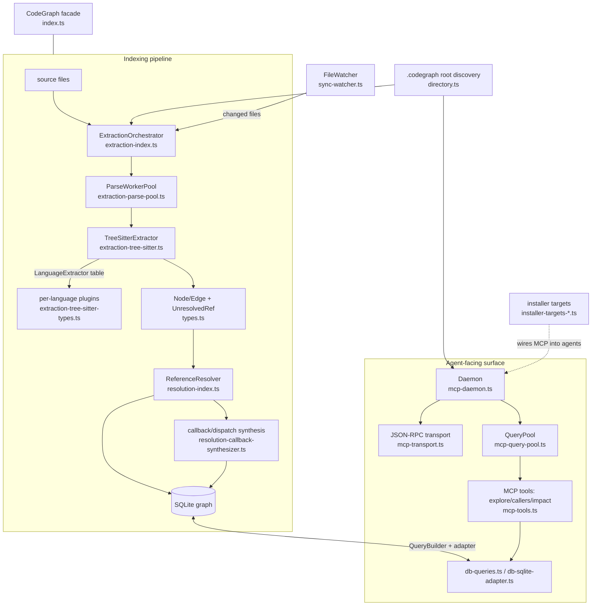

# codegraph — what it is and how it fits together

## In one paragraph
codegraph is a TypeScript CLI **and** MCP server that indexes a codebase into a **SQLite-backed
symbol/reference graph** and serves it to coding agents (Claude Code, Cursor, Codex, Gemini, …) so
they answer "who calls this / what breaks if I change it / how does this flow work" with a few
sub-millisecond graph queries instead of a read-and-grep exploration. Its defining choice is
**compiler-less, tree-sitter grounding**: ~39 languages are parsed with tree-sitter grammars and
flattened into one universal [`Node`/`Edge`](concepts/types.ts.md) model — there is no SCIP index, no
language server, and no embeddings. The graph the agent queries is the *product*, not an intermediate.
Because a pure syntactic walk can't see indirection, codegraph bolts a second stage onto extraction: a
name-based [reference resolver](concepts/resolution-index.ts.md) plus ~30 framework-specific
[dynamic-dispatch synthesizers](concepts/resolution-callback-synthesizer.ts.md) that *recover* the
edges a tree-sitter parse structurally misses (Redux thunks, Laravel events, Go implicit interfaces,
C++ vtables, React re-render). The whole thing is local-first (no code leaves the machine), stays
current through a [filesystem watcher](concepts/sync-watcher.ts.md) rather than git, and is kept warm
across agent calls by a [background daemon](concepts/mcp-daemon.ts.md).

## Core architecture

The spine: **discover the project root → parse files (parallel) → extract a universal Node/Edge graph
+ deferred unresolved names → resolve names and synthesize dynamic-dispatch edges → persist to SQLite →
serve read queries to agents over MCP.** A full index and an incremental sync are the *same* pipeline at
two scopes.

## Main concepts

**The universal graph model.** Every one of ~39 languages is flattened into one `Node` shape (closed
`kind` enum) and one `Edge` shape (closed `EdgeKind` enum), so storage, resolution, and the MCP tools
treat a Rust struct, a Kotlin class, and a CFML component identically. This is codegraph's
representation substrate — see [types.ts](concepts/types.ts.md).

**Tree-sitter extraction: one walker, N language tables.** A single generic AST walker
([`TreeSitterExtractor`](concepts/extraction-tree-sitter.ts.md)) is parameterized by a per-language
[`LanguageExtractor`](concepts/extraction-tree-sitter-types.ts.md) config (node-type sets + field
names + optional hooks), so language knowledge lives in data, not duplicated control flow. Shared
CST-walking primitives (stable node IDs, docstring recovery) live in
[helpers](concepts/extraction-tree-sitter-helpers.ts.md); the underlying CST API is the
[web-tree-sitter WASM binding](concepts/web-tree-sitter.d.ts.md). Extraction deliberately resolves
nothing across scopes — it emits `Node`/`Edge` plus a list of `UnresolvedReference`s.

**Two-stage resolution (the dynamic-dispatch answer).** The
[extraction/resolution contract](concepts/resolution-types.ts.md) hands each unresolved name to a
[static reference resolver](concepts/resolution-index.ts.md) (a confidence-tiered waterfall:
framework → import → name-match, "no edge beats a wrong edge"). What static resolution can't see —
control routed through indirection — is recovered by the
[callback/dispatch synthesizer](concepts/resolution-callback-synthesizer.ts.md): ~30 precision-first,
framework-specific heuristic passes that emit `provenance:'heuristic'` edges indistinguishable to
downstream queries from statically-extracted ones. Callback *registration* sites are captured during
extraction by [function-ref capture](concepts/extraction-function-ref.ts.md).

**The graph store and its query layer.** The graph lives in SQLite. A
[`QueryBuilder`](concepts/db-queries.ts.md) is the sole SQL seam — prepared-statement reuse, row↔Node
mapping, and cheap-first cascading text search (FTS5 → LIKE → bounded edit-distance) — behind an
[adapter interface](concepts/db-sqlite-adapter.ts.md) that let the project swap its SQLite driver in a
one-file change.

**The agent-facing MCP surface.** [MCP tools](concepts/mcp-tools.ts.md) (`codegraph_explore`,
callers, impact) are a *second retrieval-and-formatting layer* that decides what slice of the graph is
worth an agent's context budget and returns success-shaped answers so the agent keeps using the tool.
They ride a [JSON-RPC transport](concepts/mcp-transport.ts.md), are kept concurrent by a
[query worker pool](concepts/mcp-query-pool.ts.md), and are served from a warm
[daemon](concepts/mcp-daemon.ts.md) so N clients pay tree-sitter warm-up + DB open once.

**Scaling and currency.** A [parse worker pool](concepts/extraction-parse-pool.ts.md) fans CPU-bound
parsing across cores while SQLite writes stay single-threaded; a
[filesystem watcher](concepts/sync-watcher.ts.md) keeps the graph current with OS-bounded resource cost
(not git-diff driven); the [orchestration facade](concepts/index.ts.md) sequences the pipeline and
locks the on-disk graph against concurrent writers.

**Supporting layers.** [Project-root discovery](concepts/directory.ts.md) turns "a cwd" into a resolved
`.codegraph/` root (and even guesses which project a prompt is about); [path-safety utilities](concepts/utils.ts.md)
gate every content read against the project root; the [installer](concepts/installer-targets-types.ts.md)
[targets](concepts/installer-targets-shared.ts.md) wire the MCP server into each agent's config; and a
[telemetry client](concepts/telemetry-index.ts.md) records anonymous, opt-out usage counters. These
last three are plumbing *around* comprehension, not part of it.

## How a request flows
An agent calls `codegraph_explore` with symbol names → the request arrives over the
[transport](concepts/mcp-transport.ts.md) at the warm [daemon](concepts/mcp-daemon.ts.md) → is
dispatched to a [query-pool](concepts/mcp-query-pool.ts.md) worker → the
[tool handler](concepts/mcp-tools.ts.md) resolves each name via the
[`QueryBuilder`](concepts/db-queries.ts.md), walks the graph's edges (static *and* synthesized) to
build a call-flow spine, budgets the output, and returns formatted context. Nothing re-parses; the
graph was built once by the [pipeline](concepts/index.ts.md) and is kept current by the
[watcher](concepts/sync-watcher.ts.md).

## Code-comprehension surfaces
The survey's comparison axes, for codegraph specifically:

- **Grounding substrate** — **tree-sitter CST, compiler-less.** No SCIP, no language server, no
  embeddings. Symbols come from grammar-driven syntactic parsing
  ([extraction-tree-sitter.ts](concepts/extraction-tree-sitter.ts.md),
  [web-tree-sitter.d.ts](concepts/web-tree-sitter.d.ts.md)); the graph *is* the retrieval index
  ([db-queries.ts](concepts/db-queries.ts.md) does exact/fuzzy SQL search, not vector ANN). This is
  the opposite pole from SCIP-grounded tools and from embedding/vector-search tools.
- **Symbol/call graph** — **the graph is the product**, queried directly by an agent over MCP
  ([mcp-tools.ts](concepts/mcp-tools.ts.md)) over a universal [Node/Edge model](concepts/types.ts.md).
  Its standout feature is **heuristic dynamic-dispatch edge synthesis**
  ([resolution-callback-synthesizer.ts](concepts/resolution-callback-synthesizer.ts.md)) — recovering
  ~30 kinds of framework indirection a static graph misses — plus a name-based
  [static resolver](concepts/resolution-index.ts.md) with confidence tiers.
- **Multi-language extraction** — **~39 languages via a pluggable `LanguageExtractor` contract**
  ([extraction-tree-sitter-types.ts](concepts/extraction-tree-sitter-types.ts.md)): one generic walker,
  per-language data tables + hooks, shared [helpers](concepts/extraction-tree-sitter-helpers.ts.md),
  and per-language [function-as-value capture](concepts/extraction-function-ref.ts.md).
- **Incremental reconcile** — **filesystem-watcher driven**
  ([sync-watcher.ts](concepts/sync-watcher.ts.md)) with content-hash/mtime file tracking
  ([extraction-index.ts](concepts/extraction-index.ts.md)), reconciled by the same
  [pipeline facade](concepts/index.ts.md) as a full build — **not** git-commit-anchored and **not** a
  Merkle-DAG tripwire.

## Map of the wiki
- **Where do I start?** This page, then [`index.md`](index.md) for the full concept + module table.
- **How does it represent code?** → [types.ts](concepts/types.ts.md).
- **How does it parse N languages?** → [extraction-tree-sitter.ts](concepts/extraction-tree-sitter.ts.md)
  + [extraction-tree-sitter-types.ts](concepts/extraction-tree-sitter-types.ts.md).
- **How does it recover calls it can't see statically?** →
  [resolution-callback-synthesizer.ts](concepts/resolution-callback-synthesizer.ts.md) +
  [resolution-index.ts](concepts/resolution-index.ts.md).
- **How does an agent query it?** → [mcp-tools.ts](concepts/mcp-tools.ts.md) +
  [mcp-daemon.ts](concepts/mcp-daemon.ts.md).
- **How does it stay fast / current?** → [extraction-parse-pool.ts](concepts/extraction-parse-pool.ts.md),
  [mcp-query-pool.ts](concepts/mcp-query-pool.ts.md), [sync-watcher.ts](concepts/sync-watcher.ts.md).
- **What is `<symbol>` exactly?** → the per-module `catalog/` pages (the exhaustive index; created by
  `finalize`).
