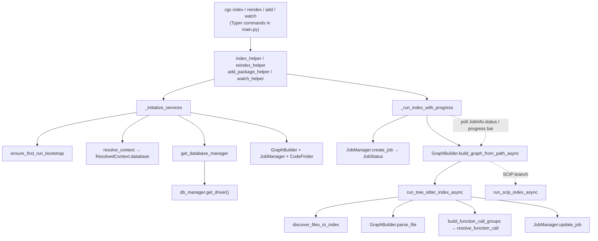

# CLI helpers — service wiring and index-with-progress orchestration

## Overview
`cli_helpers.py` is the seam between CodeGraphContext's Typer commands and its
indexing/query machinery: every `cgc` subcommand is a thin argument-parsing shell
that delegates the real work to a helper here. Two functions carry the concept.
[`_initialize_services`](../catalog/src/codegraphcontext/cli/cli_helpers.md#_initialize_services)
is the **single wiring point** — it resolves which database/context to use, opens a
driver, and hands back the trio of long-lived service objects (`GraphBuilder`,
`CodeFinder`, `JobManager`-backed builder) that the rest of the CLI operates on.
[`_run_index_with_progress`](../catalog/src/codegraphcontext/cli/cli_helpers.md#_run_index_with_progress)
is the **orchestration point** — it launches the async graph build as a background
task and drives a live Rich progress bar off the shared `JobManager` state. The key
design idea: the CLI never talks to the graph store or the parsers directly; it goes
through these two helpers, so context resolution, backend fallback, and progress
rendering are written once and reused by index, reindex, watch, query, and analysis
commands alike.

## Diagram

## Design rationale (why it's built this way)
The most load-bearing decision is that **services are constructed lazily and
per-command, not held globally**.
[`_initialize_services`](../catalog/src/codegraphcontext/cli/cli_helpers.md#_initialize_services)
runs on every command entry, and its own docstring states its contract plainly:
*"Initializes and returns core service managers based on the resolved context.
Returns (db\_manager, graph\_builder, code\_finder, resolved\_context)."* Doing this
per-command is what lets the same binary point at different graph databases: the
context (via [`resolve_context`](../catalog/src/codegraphcontext/cli/config_manager.md#resolve_context))
picks a [`database`](../catalog/src/codegraphcontext/cli/config_manager.md#ResolvedContext.database)
name, which is only applied as a *default* (`DEFAULT_DATABASE`) when no runtime
override is already set — so a `--database` flag or an MCP-supplied env var always
wins over the stored context.

A second deliberate choice is **defensive backend selection with silent fallback**.
The factory [`get_database_manager`](../catalog/src/codegraphcontext/core/__init__.md#get_database_manager)
chooses a manager by config, but `_initialize_services` wraps the first
`get_driver()` call in exception handling that catches a FalkorDB-unavailable
condition and re-initializes against KùzuDB, and separately handles Neo4j connection
failure (with an opt-in `CGC_ALLOW_NEO4J_FALLBACK`). The intent: a CLI user should
get a working embedded graph even when the "preferred" server backend isn't present,
rather than a stack trace. When nothing works,
[`_fail_services_init`](../catalog/src/codegraphcontext/cli/cli_helpers.md#_fail_services_init)
converts the situation into a clean `typer.Exit(code=1)`.

The third choice is the **poll-a-job progress model** rather than callbacks. Indexing
is genuinely async and file-parallel, so
[`_run_index_with_progress`](../catalog/src/codegraphcontext/cli/cli_helpers.md#_run_index_with_progress)
decouples the UI from the worker: the build runs as an `asyncio` task while the helper
polls shared [`JobManager`](../catalog/src/codegraphcontext/core/jobs.md#JobManager)
state every 100ms and repaints. This is why progress works uniformly whether the
underlying pipeline is Tree-sitter or SCIP — the UI only ever reads
[`status`](../catalog/src/codegraphcontext/core/jobs.md#JobInfo.status) and file
counts, never the parser internals.

## Entry points
- [`_initialize_services`](../catalog/src/codegraphcontext/cli/cli_helpers.md#_initialize_services) —
  reached first by essentially *every* command that touches the graph: the index
  family, the read-only query helpers, watch, and the analysis commands
  ([`analyze_callers`](../catalog/src/codegraphcontext/cli/main.md#analyze_callers),
  [`analyze_chain`](../catalog/src/codegraphcontext/cli/main.md#analyze_chain),
  [`analyze_complexity`](../catalog/src/codegraphcontext/cli/main.md#analyze_complexity)),
  plus data-movement commands like [`delete`](../catalog/src/codegraphcontext/cli/main.md#delete),
  [`bundle_import`](../catalog/src/codegraphcontext/cli/main.md#bundle_import), and
  [`_write_datasource_graph`](../catalog/src/codegraphcontext/cli/main.md#_write_datasource_graph).
  It is the one place services come into existence.
- [`index_helper`](../catalog/src/codegraphcontext/cli/cli_helpers.md#index_helper) and
  [`reindex_helper`](../catalog/src/codegraphcontext/cli/cli_helpers.md#reindex_helper) —
  the `cgc index` command dispatches to `index_helper` normally and to `reindex_helper`
  under `--force`. `index_helper` is skip-if-already-indexed (it counts `File` nodes and
  returns early with a tip to use `--force`); `reindex_helper`'s docstring is *"Force
  re-index by deleting and rebuilding the repository"* — it deletes the old repo
  subgraph, then rebuilds. Both funnel into the same progress orchestration.
- [`add_package_helper`](../catalog/src/codegraphcontext/cli/cli_helpers.md#add_package_helper) —
  the `cgc add-package` path. It resolves an installed package's on-disk location and
  indexes it with `is_dependency=True`, so dependency code is graphed distinctly from
  the primary repo, reusing the same index-with-progress machinery.
- [`watch_helper`](../catalog/src/codegraphcontext/cli/cli_helpers.md#watch_helper) —
  the `cgc watch` command's blocking mode; its docstring: *"Watch a directory for
  changes and auto-update the graph (blocking mode)."* It initializes services, verifies
  the path, then hands off to the file-system watcher for continuous re-indexing.
- The read-only query helpers
  [`cypher_helper`](../catalog/src/codegraphcontext/cli/cli_helpers.md#cypher_helper),
  [`cypher_helper_visual`](../catalog/src/codegraphcontext/cli/cli_helpers.md#cypher_helper_visual),
  and [`visualize_helper`](../catalog/src/codegraphcontext/cli/cli_helpers.md#visualize_helper) —
  the *query interface* side of this module. They all begin with `_initialize_services`
  and then run a Cypher query / serve the Playground UI, reusing the exact same wiring
  the write path uses (this is the trait that makes CGC comparable to the other surveyed
  tools: one graph store, queried through a uniform service handle).

## Mechanism (step-by-step)
1. **Command dispatch.** A Typer command in `main.py` parses flags and calls the matching
   helper — e.g. `cgc index` calls
   [`index_helper`](../catalog/src/codegraphcontext/cli/cli_helpers.md#index_helper), or
   [`reindex_helper`](../catalog/src/codegraphcontext/cli/cli_helpers.md#reindex_helper)
   under `--force`. The helper resolves the path and derives the working directory it will
   pass to context resolution, so per-repo context lookup is anchored at the target repo,
   not wherever the shell happens to be.
2. **Service wiring.**
   [`_initialize_services`](../catalog/src/codegraphcontext/cli/cli_helpers.md#_initialize_services)
   first runs [`ensure_first_run_bootstrap`](../catalog/src/codegraphcontext/cli/config_manager.md#ensure_first_run_bootstrap)
   (one-time setup for fresh installs), then calls
   [`resolve_context`](../catalog/src/codegraphcontext/cli/config_manager.md#resolve_context)
   to pick a context and its [`database`](../catalog/src/codegraphcontext/cli/config_manager.md#ResolvedContext.database).
   It applies that DB as `DEFAULT_DATABASE` only if no runtime override exists, then asks
   the factory [`get_database_manager`](../catalog/src/codegraphcontext/core/__init__.md#get_database_manager)
   for the right manager (FalkorDB / Kùzu / Neo4j / others).
3. **Driver open + fallback.** The helper calls `db_manager.get_driver()` — dispatching to
   the concrete manager, e.g.
   [`DatabaseManager.get_driver`](../catalog/src/codegraphcontext/core/database.md#DatabaseManager.get_driver)
   for Neo4j or
   [`EmbeddedGraphManager.get_driver`](../catalog/src/codegraphcontext/core/database_embedded_kuzu.md#EmbeddedGraphManager.get_driver)
   for embedded Kùzu. On a FalkorDB-unavailable error it transparently rebuilds a
   `KuzuDBManager` and retries; unrecoverable failures route through
   [`_fail_services_init`](../catalog/src/codegraphcontext/cli/cli_helpers.md#_fail_services_init).
   On success it constructs the [`GraphBuilder`](../catalog/src/codegraphcontext/tools/graph_builder.md#GraphBuilder),
   a [`JobManager`](../catalog/src/codegraphcontext/core/jobs.md#JobManager), and a
   [`CodeFinder`](../catalog/src/codegraphcontext/tools/code_finder.md#CodeFinder), and
   returns the tuple.
4. **Launch job + progress loop.** The index helper calls `asyncio.run` on
   [`_run_index_with_progress`](../catalog/src/codegraphcontext/cli/cli_helpers.md#_run_index_with_progress),
   which registers a job via
   [`JobManager.create_job`](../catalog/src/codegraphcontext/core/jobs.md#JobManager.create_job)
   (initial state from [`JobStatus`](../catalog/src/codegraphcontext/core/jobs.md#JobStatus)),
   starts [`GraphBuilder.build_graph_from_path_async`](../catalog/src/codegraphcontext/tools/graph_builder.md#GraphBuilder.build_graph_from_path_async)
   as a task, and then loops: read the job, update the Rich bar with `total_files` /
   `processed_files` and the current filename, and break once the job's
   [`status`](../catalog/src/codegraphcontext/core/jobs.md#JobInfo.status) reaches
   `COMPLETED`/`FAILED`/`CANCELLED`.
5. **Pipeline selection.**
   [`build_graph_from_path_async`](../catalog/src/codegraphcontext/tools/graph_builder.md#GraphBuilder.build_graph_from_path_async)
   checks the `SCIP_INDEXER` config via
   [`get_config_value`](../catalog/src/codegraphcontext/cli/config_manager.md#get_config_value):
   if SCIP is enabled and a scip binary exists for the detected language it takes the SCIP
   path ([`run_scip_index_async`](../catalog/src/codegraphcontext/tools/indexing/scip_pipeline.md#run_scip_index_async)),
   otherwise it falls back to the Tree-sitter pipeline
   [`run_tree_sitter_index_async`](../catalog/src/codegraphcontext/tools/indexing/pipeline.md#run_tree_sitter_index_async).
   Both write to the same graph, so the CLI helpers above are agnostic to which ran.
6. **Extraction + resolution (Tree-sitter path).**
   [`run_tree_sitter_index_async`](../catalog/src/codegraphcontext/tools/indexing/pipeline.md#run_tree_sitter_index_async)
   discovers files with
   [`discover_files_to_index`](../catalog/src/codegraphcontext/tools/indexing/discovery.md#discover_files_to_index)
   (honoring `.cgcignore` and the parser extension map), parses each via
   [`GraphBuilder.parse_file`](../catalog/src/codegraphcontext/tools/graph_builder.md#GraphBuilder.parse_file),
   writes symbols, then builds the call edges through
   [`build_function_call_groups`](../catalog/src/codegraphcontext/tools/indexing/resolution/calls.md#build_function_call_groups)
   (per-call resolution in
   [`resolve_function_call`](../catalog/src/codegraphcontext/tools/indexing/resolution/calls.md#resolve_function_call))
   and inheritance edges via
   [`GraphBuilder.link_inheritance`](../catalog/src/codegraphcontext/tools/graph_builder.md#GraphBuilder.link_inheritance),
   reporting progress back through
   [`JobManager.update_job`](../catalog/src/codegraphcontext/core/jobs.md#JobManager.update_job).
   A post-pass, [`run_inheritance_reresolve`](../catalog/src/codegraphcontext/tools/indexing/resolution/post_resolution.md#run_inheritance_reresolve),
   re-resolves low-confidence CALLS edges using the INHERITS graph.
7. **Continuous mode.**
   [`watch_helper`](../catalog/src/codegraphcontext/cli/cli_helpers.md#watch_helper)
   reuses steps 2–3, then instead of a one-shot build it hands the path to
   [`CodeWatcher.watch_directory`](../catalog/src/codegraphcontext/core/watcher.md#CodeWatcher.watch_directory),
   which blocks and re-indexes on file-system events — using
   [`info_logger`](../catalog/src/codegraphcontext/utils/debug_log.md#info_logger) /
   [`warning_logger`](../catalog/src/codegraphcontext/utils/debug_log.md#warning_logger)
   for status rather than the progress bar. It guards against a destructive full rescan by
   checking `File` node counts before deciding the repo is unindexed.

## Key data structures
- **The service tuple** returned by
  [`_initialize_services`](../catalog/src/codegraphcontext/cli/cli_helpers.md#_initialize_services):
  `(db_manager, graph_builder, code_finder, resolved_context)`. Everything downstream reads
  from this — writes go through `graph_builder`, queries through `code_finder`, and cleanup
  (`close_driver`) through `db_manager`.
- **`ResolvedContext`** — the resolution result whose
  [`database`](../catalog/src/codegraphcontext/cli/config_manager.md#ResolvedContext.database)
  field names the backend and whose `db_path`/`cgcignore_path` are threaded into the index
  run. This is what makes "which graph am I querying" a first-class, per-command decision.
- **Job state** — a job created by
  [`JobManager.create_job`](../catalog/src/codegraphcontext/core/jobs.md#JobManager.create_job),
  mutated by [`update_job`](../catalog/src/codegraphcontext/core/jobs.md#JobManager.update_job),
  and read via its [`status`](../catalog/src/codegraphcontext/core/jobs.md#JobInfo.status)
  ([`JobStatus`](../catalog/src/codegraphcontext/core/jobs.md#JobStatus) enum). It is the
  shared channel between the async build worker and the CLI progress loop.
- **`GraphBuilder.parsers`** — the extension→language map set in
  [`GraphBuilder`](../catalog/src/codegraphcontext/tools/graph_builder.md#GraphBuilder)'s
  constructor. It is what makes discovery multi-language: the set of keys is passed to
  [`discover_files_to_index`](../catalog/src/codegraphcontext/tools/indexing/discovery.md#discover_files_to_index)
  as the supported-extension filter.

## Dynamics (design intent)
The build is file-parallel behind an `asyncio.Semaphore` inside
[`run_tree_sitter_index_async`](../catalog/src/codegraphcontext/tools/indexing/pipeline.md#run_tree_sitter_index_async)
(concurrency limit 10), while [`_run_index_with_progress`](../catalog/src/codegraphcontext/cli/cli_helpers.md#_run_index_with_progress)
runs a cooperative 100ms poll loop against the job. The
[`JobManager`](../catalog/src/codegraphcontext/core/jobs.md#JobManager) is documented as a
*thread-safe manager*, which is what makes the worker-writes / UI-reads split safe. Note the
ordering the pipeline docstring commits to — *"Parse all discovered files, write symbols,
then inheritance + CALLS"* — symbols must exist before edges can be resolved, so call and
inheritance resolution are a distinct later phase, not interleaved with parsing.

## Edge cases
- **Backend fallback is invisible in the return value.** `_initialize_services` may swap the
  `db_manager` from FalkorDB to Kùzu mid-function; callers only see a working driver, so a
  command can silently end up on a different store than the context named.
- **Skip-if-indexed vs. force.**
  [`index_helper`](../catalog/src/codegraphcontext/cli/cli_helpers.md#index_helper) returns
  early when the repo already has `File` nodes; only
  [`reindex_helper`](../catalog/src/codegraphcontext/cli/cli_helpers.md#reindex_helper)
  deletes-then-rebuilds. An interrupted prior run (repo node, zero files) is treated as
  re-indexable rather than "already done".
- **`get_running_loop` reuse.** `_initialize_services` reuses an existing event loop if one
  is running, else creates one — relevant when the helpers are called from an already-async
  context (e.g. the MCP server) rather than a plain CLI invocation.
- **Watch never trusts an empty repo list.**
  [`watch_helper`](../catalog/src/codegraphcontext/cli/cli_helpers.md#watch_helper)
  cross-checks a `File`-node count so a transient empty `list_indexed_repositories` result
  can't trigger a destructive full rescan of an already-populated graph.

## Open questions
- The SCIP path ([`run_scip_index_async`](../catalog/src/codegraphcontext/tools/indexing/scip_pipeline.md#run_scip_index_async))
  is selected inside `build_graph_from_path_async` by config, but the exact language
  detection and scip-binary availability logic lives in `scip_indexer`, which is outside
  this packet's subgraph — how the two pipelines' edges are reconciled in the store is not
  visible from the CLI-helper layer.

> [!inferred]
> The read-only helpers (`cypher_helper`, `visualize_helper`) appear to open a full service
> stack (including a writable `GraphBuilder`) even though they only read; the source here
> shows them calling `_initialize_services` but not the query internals, so whether they use
> a lighter path for large graphs isn't settled by this packet.

## See also
- Graph construction pipeline (`GraphBuilder`, `run_tree_sitter_index_async`) — the machinery these helpers orchestrate.
- Context/config resolution (`resolve_context`, `ResolvedContext`) — how the target database is chosen.
- Database backend factory (`get_database_manager`) — the FalkorDB/Kùzu/Neo4j selection this module wires in.
