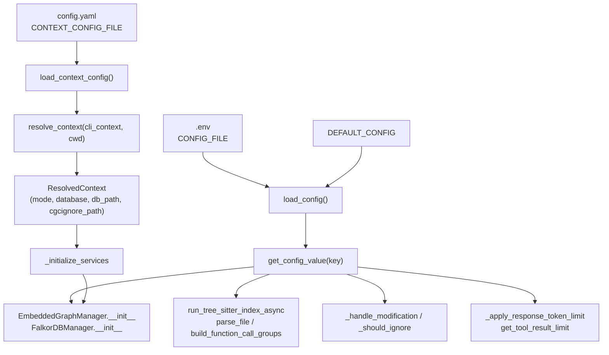

# CLI config & context resolution

## Overview
`config_manager` is CodeGraphContext's answer to one question that every other subsystem asks: *which
database do I connect to, and with what settings?* It stores that answer in **two files under a single
home directory** ([`CONFIG_DIR`](../catalog/src/codegraphcontext/cli/config_manager.md#CONFIG_DIR) =
`~/.codegraphcontext/`): a flat **`.env`** of key=value knobs and DB credentials
([`CONFIG_FILE`](../catalog/src/codegraphcontext/cli/config_manager.md#CONFIG_FILE)), and a structured
**`config.yaml`** describing *contexts*
([`CONTEXT_CONFIG_FILE`](../catalog/src/codegraphcontext/cli/config_manager.md#CONTEXT_CONFIG_FILE)). The
two layers are read by two different front doors:
[`get_config_value`](../catalog/src/codegraphcontext/cli/config_manager.md#get_config_value) for individual
settings, and [`resolve_context`](../catalog/src/codegraphcontext/cli/config_manager.md#resolve_context)
for "which backend + db_path + ignore file applies here." Everything downstream — the indexing pipeline, the
file watcher, the MCP server, and each database manager — reads through these two doors rather than
touching the files directly, so config becomes the tool's single source of truth for grounding-substrate
selection.

## Diagram

## Design rationale (why it's built this way)
The split into two files is deliberate and not merely historical. The `.env` layer holds *scalar knobs*
whose values are strings a user (or `cgc config set`) edits freely, and it doubles as the credential store
(`NEO4J_*`, `FALKORDB_*`) — hence
[`DATABASE_CREDENTIAL_KEYS`](../catalog/src/codegraphcontext/cli/config_manager.md#DATABASE_CREDENTIAL_KEYS)
is carved out of the general settings so credentials can be *preserved* across a config reset and *masked*
in display. [`DEFAULT_CONFIG`](../catalog/src/codegraphcontext/cli/config_manager.md#DEFAULT_CONFIG) is the
authoritative list of every knob and its default (backend paths, ignore dirs, SCIP flags, token limits);
when loading the *local* project `.env`, only keys in `DEFAULT_CONFIG` or
[`DATABASE_CREDENTIAL_KEYS`](../catalog/src/codegraphcontext/cli/config_manager.md#DATABASE_CREDENTIAL_KEYS)
are accepted — the global `.env` has no such filter and loads any key unconditionally. The `config.yaml`
layer instead holds
*structured, multi-valued state*: a registry of named contexts, each pinning a backend and a set of indexed
repos — a shape that would be awkward in flat key=value.

The reason a whole subsystem exists just to answer "which DB" is that CodeGraphContext supports **three
operating modes** (`mode` on
[`ContextConfig`](../catalog/src/codegraphcontext/cli/config_manager.md#ContextConfig.mode) — `global`,
`per-repo`, `named`) and **multiple backends** (falkordb / kuzudb / neo4j). Rather than scatter that
decision, it is centralized in one dataclass,
[`ResolvedContext`](../catalog/src/codegraphcontext/cli/config_manager.md#ResolvedContext), whose docstring
states the intent plainly: *"everything needed to instantiate the DB."* Not every caller goes through it,
though:
`get_database_manager` is invoked
with no `ResolvedContext` at all and independently re-derives the backend from
`CGC_RUNTIME_DB_TYPE`/`DEFAULT_DATABASE` env vars.

> [!inferred]
> Reads go through `get_config_value` at *call time* rather than a cached snapshot, which lets live config
> edits take effect without a restart — the token-limit reader
> [`_apply_response_token_limit`](../catalog/src/codegraphcontext/server.md#_apply_response_token_limit)
> makes this explicit in its docstring, and the same lazy-read pattern recurs across the pipeline and
> watcher call sites. This is a reading of the consistent call-site style, not a stated invariant.

## Entry points
- [`get_config_value`](../catalog/src/codegraphcontext/cli/config_manager.md#get_config_value) — the
  universal scalar-read door. It simply calls
  [`load_config`](../catalog/src/codegraphcontext/cli/config_manager.md#load_config) and returns
  `config.get(key)`. Nearly every subsystem reaches it: the indexer checks `SCIP_INDEXER` /
  `SKIP_EXTERNAL_RESOLUTION` / `INDEX_SOURCE`, the watcher reads `IGNORE_DIRS`, the DB managers read
  `FALKORDB_PATH`, and the server reads `MAX_TOOL_RESPONSE_TOKENS`. Thin, boolean-typed convenience
  wrappers sit on top — [`is_db_deletion_allowed`](../catalog/src/codegraphcontext/cli/config_manager.md#is_db_deletion_allowed)
  and [`get_tool_result_limit`](../catalog/src/codegraphcontext/utils/tool_limits.md#get_tool_result_limit).
- [`resolve_context`](../catalog/src/codegraphcontext/cli/config_manager.md#resolve_context) — the
  backend-selection door, hit at the start of any DB-touching command. Given an optional `--context` flag
  and a working directory it returns the fully-resolved
  [`ResolvedContext`](../catalog/src/codegraphcontext/cli/config_manager.md#ResolvedContext).
- [`_initialize_services`](../catalog/src/codegraphcontext/cli/cli_helpers.md#_initialize_services) — the
  CLI's bridge from config to live services. It runs
  [`resolve_context`](../catalog/src/codegraphcontext/cli/config_manager.md#resolve_context), then hands the
  resolved [`database`](../catalog/src/codegraphcontext/cli/config_manager.md#ResolvedContext.database) and
  [`db_path`](../catalog/src/codegraphcontext/cli/config_manager.md#ResolvedContext.db_path) to the database
  manager factory. `cgc index` reaches it via
  [`index_helper`](../catalog/src/codegraphcontext/cli/cli_helpers.md#index_helper).
- [`_load_credentials`](../catalog/src/codegraphcontext/cli/main.md#_load_credentials) — the process-startup
  door that merges `.env` sources into `os.environ` by precedence before any manager reads them. Which
  `.env` files load is fixed earlier in the function, independent of context; it calls
  [`resolve_context`](../catalog/src/codegraphcontext/cli/config_manager.md#resolve_context) afterward only
  to set `DEFAULT_DATABASE` from the resolved context when no runtime override is present, for db-type
  reporting.

## Mechanism (step-by-step)

1. **Locate the files.** Everything hangs off
   [`CONFIG_DIR`](../catalog/src/codegraphcontext/cli/config_manager.md#CONFIG_DIR) (`~/.codegraphcontext/`);
   [`CONFIG_FILE`](../catalog/src/codegraphcontext/cli/config_manager.md#CONFIG_FILE) is `CONFIG_DIR/.env`
   and [`CONTEXT_CONFIG_FILE`](../catalog/src/codegraphcontext/cli/config_manager.md#CONTEXT_CONFIG_FILE) is
   `CONFIG_DIR/config.yaml`. [`ensure_config_dir`](../catalog/src/codegraphcontext/cli/config_manager.md#ensure_config_dir)
   lazily creates the directory (and a `logs/` subdir) before any write, and
   [`ensure_first_run_bootstrap`](../catalog/src/codegraphcontext/cli/config_manager.md#ensure_first_run_bootstrap)
   performs one-time setup on a brand-new install (guarded by a first-run marker so it runs once).

2. **Read a scalar setting.**
   [`load_config`](../catalog/src/codegraphcontext/cli/config_manager.md#load_config) builds the effective
   config by layering, lowest to highest: a copy of
   [`DEFAULT_CONFIG`](../catalog/src/codegraphcontext/cli/config_manager.md#DEFAULT_CONFIG), then the global
   `.env`, then a local project `.env` (which may override only recognized keys — settings or
   [`DATABASE_CREDENTIAL_KEYS`](../catalog/src/codegraphcontext/cli/config_manager.md#DATABASE_CREDENTIAL_KEYS)),
   then real process environment variables on top. Its docstring names this "Load configuration with
   priority support." [`get_config_value`](../catalog/src/codegraphcontext/cli/config_manager.md#get_config_value)
   returns one key from that merged dict — so a downstream reader always sees env-var overrides winning over
   file values.

3. **Write a scalar setting.**
   [`set_config_value`](../catalog/src/codegraphcontext/cli/config_manager.md#set_config_value) validates the
   key/value, then load-modify-saves via
   [`save_config`](../catalog/src/codegraphcontext/cli/config_manager.md#save_config). It special-cases the
   pseudo-key `mode`, delegating to
   [`set_context_mode`](../catalog/src/codegraphcontext/cli/config_manager.md#set_context_mode) so
   `cgc config set mode named` edits `config.yaml` instead of `.env`.
   [`save_config`](../catalog/src/codegraphcontext/cli/config_manager.md#save_config) writes settings and
   credentials into separate labelled sections and, with `preserve_db_credentials=True`, re-reads existing
   credentials so a settings write never clobbers them.
   [`reset_config`](../catalog/src/codegraphcontext/cli/config_manager.md#reset_config) backs up and rewrites
   `.env` from [`DEFAULT_CONFIG`](../catalog/src/codegraphcontext/cli/config_manager.md#DEFAULT_CONFIG) while
   preserving credentials; [`show_config`](../catalog/src/codegraphcontext/cli/config_manager.md#show_config)
   renders the merged config in a table, masking any `*PASSWORD*` key.

4. **Load the context registry.**
   [`load_context_config`](../catalog/src/codegraphcontext/cli/config_manager.md#load_context_config) first
   runs [`_migrate_legacy_config_yaml`](../catalog/src/codegraphcontext/cli/config_manager.md#_migrate_legacy_config_yaml)
   (copies an old `cgc_config.yaml` to `config.yaml`, leaving the original in place), then parses `config.yaml` into a
   [`ContextConfig`](../catalog/src/codegraphcontext/cli/config_manager.md#ContextConfig.contexts) of
   [`ContextInfo`](../catalog/src/codegraphcontext/cli/config_manager.md#ContextInfo.database) entries,
   filling any empty `db_path` from
   [`_default_db_path`](../catalog/src/codegraphcontext/cli/config_manager.md#_default_db_path). If the file
   is missing it writes a fresh default via
   [`save_context_config`](../catalog/src/codegraphcontext/cli/config_manager.md#save_context_config); if it
   is corrupt it warns through [`console`](../catalog/src/codegraphcontext/cli/config_manager.md#console) and
   falls back to defaults rather than crashing.

5. **Resolve the effective context.**
   [`resolve_context`](../catalog/src/codegraphcontext/cli/config_manager.md#resolve_context) applies a strict
   priority ladder (its docstring lists it): (1) an explicit `--context` name, looked up in
   [`contexts`](../catalog/src/codegraphcontext/cli/config_manager.md#ContextConfig.contexts) and raising if
   unregistered; (2) in `per-repo`
   [`mode`](../catalog/src/codegraphcontext/cli/config_manager.md#ContextConfig.mode), a local
   `.codegraphcontext/` folder (auto-created in cwd if absent, seeded from the global `.env`); (3) in
   `named` mode, the [`default_context`](../catalog/src/codegraphcontext/cli/config_manager.md#ContextConfig.default_context);
   (4) an ultimate `global` fallback whose backend comes from `CGC_RUNTIME_DB_TYPE` or `DEFAULT_DATABASE`
   and whose path comes from
   [`_default_global_db_path`](../catalog/src/codegraphcontext/cli/config_manager.md#_default_global_db_path).
   Each branch returns a [`ResolvedContext`](../catalog/src/codegraphcontext/cli/config_manager.md#ResolvedContext)
   carrying [`mode`](../catalog/src/codegraphcontext/cli/config_manager.md#ResolvedContext.mode),
   [`context_name`](../catalog/src/codegraphcontext/cli/config_manager.md#ResolvedContext.context_name),
   [`database`](../catalog/src/codegraphcontext/cli/config_manager.md#ResolvedContext.database),
   [`db_path`](../catalog/src/codegraphcontext/cli/config_manager.md#ResolvedContext.db_path), and
   [`cgcignore_path`](../catalog/src/codegraphcontext/cli/config_manager.md#ResolvedContext.cgcignore_path).

6. **Instantiate the backend from the resolution.**
   [`_initialize_services`](../catalog/src/codegraphcontext/cli/cli_helpers.md#_initialize_services) reads the
   resolved [`database`](../catalog/src/codegraphcontext/cli/config_manager.md#ResolvedContext.database) and
   [`db_path`](../catalog/src/codegraphcontext/cli/config_manager.md#ResolvedContext.db_path) and constructs
   the manager — but only sets `DEFAULT_DATABASE` from the context when neither a runtime override nor an
   existing env value is present, so context is a *default*, not an override. The managers themselves,
   [`FalkorDBManager.__init__`](../catalog/src/codegraphcontext/core/database_falkordb.md#FalkorDBManager.__init__)
   and [`EmbeddedGraphManager.__init__`](../catalog/src/codegraphcontext/core/database_embedded_kuzu.md#EmbeddedGraphManager.__init__),
   apply their own fallback chain (explicit arg → env var → `get_config_value` → hard default), meaning a DB
   path can be pinned either through the context or directly through `.env`.

7. **Feed config into indexing and watching.** Once services exist, the same
   [`get_config_value`](../catalog/src/codegraphcontext/cli/config_manager.md#get_config_value) door gates
   downstream behavior: the pipeline
   [`build_graph_from_path_async`](../catalog/src/codegraphcontext/tools/graph_builder.md#GraphBuilder.build_graph_from_path_async)
   reads `SCIP_INDEXER`/`SCIP_LANGUAGES` to choose SCIP vs. Tree-sitter,
   [`run_tree_sitter_index_async`](../catalog/src/codegraphcontext/tools/indexing/pipeline.md#run_tree_sitter_index_async)
   and [`build_function_call_groups`](../catalog/src/codegraphcontext/tools/indexing/resolution/calls.md#build_function_call_groups)
   read resolution flags, [`parse_file`](../catalog/src/codegraphcontext/tools/graph_builder.md#GraphBuilder.parse_file)
   and [`_create_all_function_calls`](../catalog/src/codegraphcontext/tools/graph_builder.md#GraphBuilder._create_all_function_calls)
   read `INDEX_SOURCE`/`SKIP_EXTERNAL_RESOLUTION`, and file discovery
   ([`discover_files_to_index`](../catalog/src/codegraphcontext/tools/indexing/discovery.md#discover_files_to_index),
   [`parse_ignore_dir_names`](../catalog/src/codegraphcontext/utils/path_ignore.md#parse_ignore_dir_names),
   [`file_path_has_ignore_dir_segment`](../catalog/src/codegraphcontext/utils/path_ignore.md#file_path_has_ignore_dir_segment))
   plus the incremental watcher
   ([`_handle_modification`](../catalog/src/codegraphcontext/core/watcher.md#RepositoryEventHandler._handle_modification),
   [`_should_ignore`](../catalog/src/codegraphcontext/core/watcher.md#RepositoryEventHandler._should_ignore))
   read `IGNORE_DIRS`. Config is thus the knob-store the entire ingestion path consults.

## Key data structures
- [`ResolvedContext`](../catalog/src/codegraphcontext/cli/config_manager.md#ResolvedContext) — the immutable
  result of resolution: `mode`, `context_name`,
  [`database`](../catalog/src/codegraphcontext/cli/config_manager.md#ResolvedContext.database),
  [`db_path`](../catalog/src/codegraphcontext/cli/config_manager.md#ResolvedContext.db_path),
  [`cgcignore_path`](../catalog/src/codegraphcontext/cli/config_manager.md#ResolvedContext.cgcignore_path),
  plus an `is_local` flag. This is the currency passed to service init.
- [`ContextConfig`](../catalog/src/codegraphcontext/cli/config_manager.md#ContextConfig.contexts) — the
  on-disk `config.yaml` shape: a global
  [`mode`](../catalog/src/codegraphcontext/cli/config_manager.md#ContextConfig.mode), a
  [`default_context`](../catalog/src/codegraphcontext/cli/config_manager.md#ContextConfig.default_context),
  and a dict of named
  [`ContextInfo`](../catalog/src/codegraphcontext/cli/config_manager.md#ContextInfo.database) records, each
  pinning a backend, [`db_path`](../catalog/src/codegraphcontext/cli/config_manager.md#ContextInfo.db_path),
  and the list of [`repos`](../catalog/src/codegraphcontext/cli/config_manager.md#ContextInfo.repos)
  registered to it.
- [`DEFAULT_CONFIG`](../catalog/src/codegraphcontext/cli/config_manager.md#DEFAULT_CONFIG) — the canonical
  flat-config schema and defaults, and
  [`DATABASE_CREDENTIAL_KEYS`](../catalog/src/codegraphcontext/cli/config_manager.md#DATABASE_CREDENTIAL_KEYS)
  — the subset treated as secrets (preserved on reset, masked on display, allowed to override from local
  `.env`).

## Dynamics (design intent)
Context CRUD is small and load-modify-save on a single YAML file. Create/update flows
([`create_context`](../catalog/src/codegraphcontext/cli/config_manager.md#create_context),
[`register_repo_in_context`](../catalog/src/codegraphcontext/cli/config_manager.md#register_repo_in_context),
[`set_default_context`](../catalog/src/codegraphcontext/cli/config_manager.md#set_default_context),
[`delete_context`](../catalog/src/codegraphcontext/cli/config_manager.md#delete_context)) all call
[`load_context_config`](../catalog/src/codegraphcontext/cli/config_manager.md#load_context_config), mutate
the in-memory [`ContextConfig`](../catalog/src/codegraphcontext/cli/config_manager.md#ContextConfig.contexts),
then [`save_context_config`](../catalog/src/codegraphcontext/cli/config_manager.md#save_context_config).
[`register_repo_in_context`](../catalog/src/codegraphcontext/cli/config_manager.md#register_repo_in_context)
is documented as *idempotent* — it appends a resolved repo path only if absent — and can auto-create the
context. Writes go through an atomic temp-file-and-replace helper (used by
[`save_context_config`](../catalog/src/codegraphcontext/cli/config_manager.md#save_context_config) and
[`_save_workspace_mappings`](../catalog/src/codegraphcontext/cli/config_manager.md#_save_workspace_mappings)),
so a crashed write cannot leave a half-written `config.yaml`. The CLI surface
([`context_list`](../catalog/src/codegraphcontext/cli/main.md#context_list),
[`context_create`](../catalog/src/codegraphcontext/cli/main.md#context_create),
[`list_contexts`](../catalog/src/codegraphcontext/cli/config_manager.md#list_contexts)) is a thin rendering
layer over these helpers.

> [!inferred]
> The packet's Evidence block reports no tests referencing this subgraph, so all dynamics above are read
> from source and docstrings, not from test-verified behavior.

## Edge cases
- **Corrupt `config.yaml`** is caught in
  [`load_context_config`](../catalog/src/codegraphcontext/cli/config_manager.md#load_context_config), which
  warns and returns defaults rather than raising — a deliberate choice to keep the CLI usable.
- **Self-copy from `$HOME`**: when `per-repo` resolution runs from the home directory, the local
  `.codegraphcontext/.env` target *is* the global
  [`CONFIG_FILE`](../catalog/src/codegraphcontext/cli/config_manager.md#CONFIG_FILE); the source comment in
  [`resolve_context`](../catalog/src/codegraphcontext/cli/config_manager.md#resolve_context) notes it guards
  against `shutil.SameFileError` that would otherwise crash resolution.
- **Leaked DB paths**: [`_default_global_db_path`](../catalog/src/codegraphcontext/cli/config_manager.md#_default_global_db_path)
  ignores a `FALKORDB_PATH` that resolves outside
  [`CONFIG_DIR`](../catalog/src/codegraphcontext/cli/config_manager.md#CONFIG_DIR), so a stray value from
  another project's local `.env` cannot redirect the global DB.
- **Unregistered `--context`**:
  [`resolve_context`](../catalog/src/codegraphcontext/cli/config_manager.md#resolve_context) raises a
  not-found error (surfaced by
  [`_initialize_services`](../catalog/src/codegraphcontext/cli/cli_helpers.md#_initialize_services) as a
  clean CLI exit) rather than silently falling back.
- **`named` mode with no default context** falls through to the `global` branch, so a half-configured
  `named` mode still resolves to a working DB.

## Open questions
- The workspace-mapping path (a saved cwd→context association read during `per-repo` resolution) is written
  by [`_save_workspace_mappings`](../catalog/src/codegraphcontext/cli/config_manager.md#_save_workspace_mappings),
  but the reader (`get_workspace_mapping`) and the local-dir finder (`find_local_cgc_dir`) are not in this
  packet's subgraph, so exactly how a mapping is keyed and matched is not fully groundable here.
- `.env` precedence at process startup is orchestrated by
  [`_load_credentials`](../catalog/src/codegraphcontext/cli/main.md#_load_credentials) merging up to four
  sources into `os.environ`; the full source list (including `mcp.json`) is only partially visible in the
  packet snippet.

## See also
- Sibling concept pages for CodeGraphContext's indexing pipeline, the file watcher (incremental reconcile),
  and the database-manager backends, all of which consume this subsystem's
  [`get_config_value`](../catalog/src/codegraphcontext/cli/config_manager.md#get_config_value) and
  [`ResolvedContext`](../catalog/src/codegraphcontext/cli/config_manager.md#ResolvedContext).
- [`codegraphcontext` overview](../overview.md).
