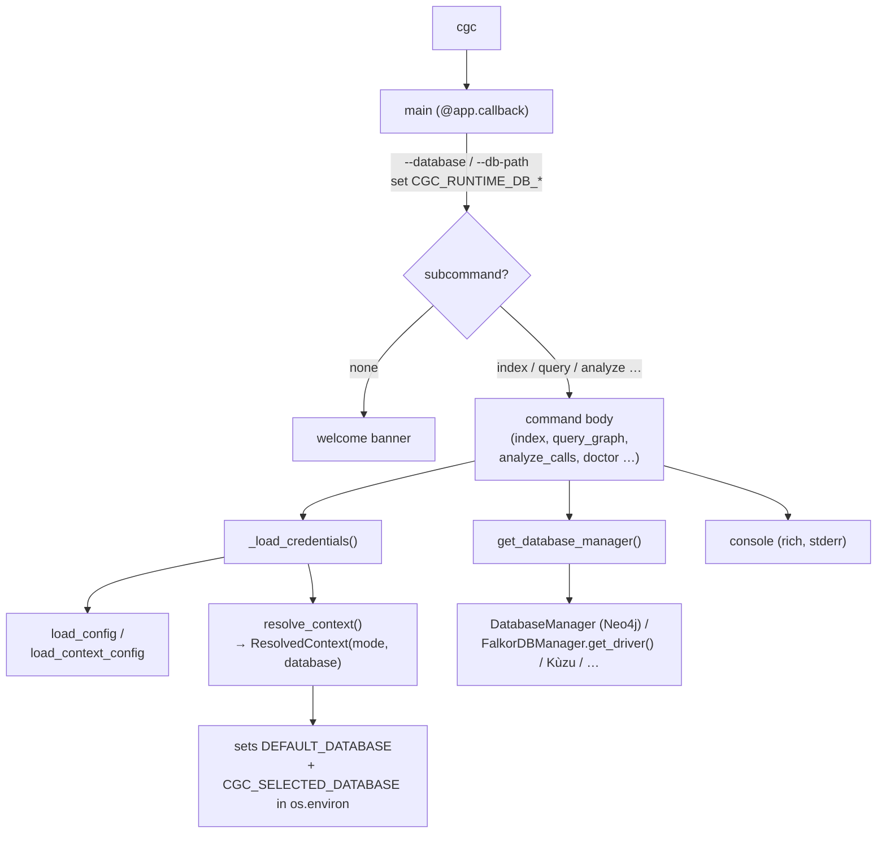

# The cgc CLI — command surface and pipeline routing

## Overview
`src/codegraphcontext/cli/main.py` is the single front door to CodeGraphContext. It is a
[Typer](https://typer.tiangolo.com/) application, [`app`](../catalog/src/codegraphcontext/cli/main.md#app),
that wears two hats the welcome banner spells out: an **MCP server** an AI agent speaks to, and a
**CLI toolkit** a human drives directly. Both hats sit over the *same* code graph. The file is large but
its shape is simple and repetitive: a root `app` with a handful of top-level commands, plus a dozen
`typer.Typer` sub-apps (`mcp`, `context`, `config`, `bundle`, `hook`, `find`, `analyze`, `datasource`, …)
mounted under it. Almost every command body follows one three-beat rhythm — **load credentials → resolve
which database/context to talk to → initialize services and run one graph query** — so understanding that
rhythm once ([`_load_credentials`](../catalog/src/codegraphcontext/cli/main.md#_load_credentials),
[`resolve_context`](../catalog/src/codegraphcontext/cli/config_manager.md#resolve_context),
[`get_database_manager`](../catalog/src/codegraphcontext/core/__init__.md#get_database_manager)) explains
the whole surface. The key design idea: **the CLI holds almost no logic** — it parses flags, sets up the
runtime, and delegates to helpers and the graph backend.

## Diagram

## Design rationale (why it's built this way)
The most consequential decision is that [`console`](../catalog/src/codegraphcontext/cli/main.md#console)
is built with `Console(stderr=True)` — all human-facing status, tables, and banners go to **stderr**, not
stdout. This is not cosmetic: the same process runs as an MCP server that speaks JSON-RPC over stdin/stdout
([`mcp_start`](../catalog/src/codegraphcontext/cli/main.md#mcp_start)), so stdout must stay a clean machine
channel. Routing all rich output to stderr lets the tool be both a chatty human CLI and a silent protocol
server without a mode switch. (Note the config-manager's own
[`console`](../catalog/src/codegraphcontext/cli/config_manager.md#console) is a plain `Console()` — a
distinct instance.)

The second decision is **lazy, per-command credential loading**. There is no global "connect once" step;
every command that touches the graph calls
[`_load_credentials`](../catalog/src/codegraphcontext/cli/main.md#_load_credentials) itself. Its docstring
lays out a deliberate four-tier precedence (runtime env > local project `.env` / `.codegraphcontext/.env` >
global `~/.codegraphcontext/.env` > `mcp.json`), and it is careful that **shell env always wins** — the
comment explains that `DEFAULT_DATABASE=falkordb cgc index …` must not be clobbered by a `DEFAULT_DATABASE=neo4j`
sitting in a global `.env`. This per-command approach means a stray `cgc --help` or `cgc version` never
touches a database, and each invocation reflects the *current* directory's config.

Third, database selection is a **factory + auto-detect** rather than a hard dependency.
[`get_database_manager`](../catalog/src/codegraphcontext/core/__init__.md#get_database_manager) picks a
backend from `CGC_RUNTIME_DB_TYPE` → `DEFAULT_DATABASE` → implicit auto-detection, and falls back across
FalkorDB Lite, Kùzu, Ladybug, Nornic, and Neo4j depending on what's installed. This is why the banner can
promise "works with FalkorDB by default (no database setup needed)": the CLI degrades to whatever graph
store is present.

> [!inferred]
> The proliferation of sub-app groups and one-letter shortcut commands (`m`, `n`, `i`, `ls`, `rm`, `v`, `w`)
> reads as a deliberate ergonomics choice — the analyze/find verbs form a discoverable namespace, while the
> shortcuts keep the common index/list/query loop terse. The source shows the aliases delegating to the full
> command, but the intent (discoverability vs. speed) is my reading of the structure.

## Entry points
- [`main`](../catalog/src/codegraphcontext/cli/main.md#app) — the root Typer callback, registered on
  [`app`](../catalog/src/codegraphcontext/cli/main.md#app) with `invoke_without_command=True`. It runs
  *before* any subcommand: it turns the global `--database` / `--db-path` flags into `CGC_RUNTIME_DB_TYPE`
  and `CGC_RUNTIME_DB_PATH` env vars (the highest-priority DB override), stashes the `--visual` flag on the
  Typer context object, and — if no subcommand was given — prints the welcome banner describing the two
  modes. Control always passes through here first.
- [`mcp_start`](../catalog/src/codegraphcontext/cli/main.md#mcp_start) — `cgc mcp start`, the **MCP-server**
  entry. It loads credentials, spins up a fresh asyncio event loop, constructs the server, and blocks in
  `loop.run_until_complete(server.run())` until Ctrl-C. This is the path an IDE integration takes; every
  other command below is the human-CLI path.
- [`index`](../catalog/src/codegraphcontext/cli/main.md#index) — `cgc index <path>`, the ingestion entry.
  After [`_load_credentials`](../catalog/src/codegraphcontext/cli/main.md#_load_credentials) it defaults the
  path to the cwd and routes to either a reindex helper (`--force`, delete-and-rebuild) or the plain index
  helper. This is where a codebase *becomes* a graph.
- The **query/analysis verbs** — [`query_graph`](../catalog/src/codegraphcontext/cli/main.md#query_graph)
  (`cgc query "<cypher>"`, raw read-only Cypher), the `find` group
  ([`find_by_name`](../catalog/src/codegraphcontext/cli/main.md#find_by_name),
  [`find_by_type`](../catalog/src/codegraphcontext/cli/main.md#find_by_type),
  [`find_by_pattern`](../catalog/src/codegraphcontext/cli/main.md#find_by_pattern),
  [`find_by_argument_search`](../catalog/src/codegraphcontext/cli/main.md#find_by_argument_search)), and the
  `analyze` group ([`analyze_calls`](../catalog/src/codegraphcontext/cli/main.md#analyze_calls),
  [`analyze_callers`](../catalog/src/codegraphcontext/cli/main.md#analyze_callers),
  [`analyze_chain`](../catalog/src/codegraphcontext/cli/main.md#analyze_chain),
  [`analyze_dependencies`](../catalog/src/codegraphcontext/cli/main.md#analyze_dependencies),
  [`analyze_inheritance_tree`](../catalog/src/codegraphcontext/cli/main.md#analyze_inheritance_tree),
  [`analyze_overrides`](../catalog/src/codegraphcontext/cli/main.md#analyze_overrides),
  [`analyze_complexity`](../catalog/src/codegraphcontext/cli/main.md#analyze_complexity),
  [`analyze_dead_code`](../catalog/src/codegraphcontext/cli/main.md#analyze_dead_code),
  [`analyze_variable_usage`](../catalog/src/codegraphcontext/cli/main.md#analyze_variable_usage),
  [`analyze_kotlin_call_audit`](../catalog/src/codegraphcontext/cli/main.md#analyze_kotlin_call_audit)). These
  are the **human-facing read side of the code graph** — the same relationships (calls, imports,
  inheritance, complexity) the MCP tools expose, surfaced as CLI verbs.
- [`doctor`](../catalog/src/codegraphcontext/cli/main.md#doctor) — `cgc doctor`, the diagnostics entry. It is
  the one command that touches nearly every config primitive
  ([`ensure_first_run_bootstrap`](../catalog/src/codegraphcontext/cli/config_manager.md#ensure_first_run_bootstrap),
  [`ensure_config_file`](../catalog/src/codegraphcontext/cli/config_manager.md#ensure_config_file),
  [`load_config`](../catalog/src/codegraphcontext/cli/config_manager.md#load_config),
  [`validate_config_value`](../catalog/src/codegraphcontext/cli/config_manager.md#validate_config_value)) plus
  a live [`DatabaseManager`](../catalog/src/codegraphcontext/core/database.md#DatabaseManager) connectivity
  check — a good map of what a healthy install needs.

## Mechanism (step-by-step)
1. **Registration at import time.** Loading the module builds the root
   [`app`](../catalog/src/codegraphcontext/cli/main.md#app) and, top-to-bottom, mounts each sub-app with
   `app.add_typer(...)`: [`context_app`](../catalog/src/codegraphcontext/cli/main.md#context_app) under
   `context`, [`config_app`](../catalog/src/codegraphcontext/cli/main.md#config_app) under `config`,
   [`bundle_app`](../catalog/src/codegraphcontext/cli/main.md#bundle_app) under `bundle`,
   [`find_app`](../catalog/src/codegraphcontext/cli/main.md#find_app) under `find`,
   [`analyze_app`](../catalog/src/codegraphcontext/cli/main.md#analyze_app) under `analyze`, and
   [`registry_app`](../catalog/src/codegraphcontext/cli/main.md#registry_app) under `registry`. Each
   `@<group>_app.command(...)`-decorated function becomes one `cgc <group> <verb>` command. The full surface
   is thus assembled declaratively as the file loads; there is no dispatch table to maintain.
2. **Root callback fires first.** However `cgc` is invoked, Typer runs the
   [`main`](../catalog/src/codegraphcontext/cli/main.md#app) callback before the chosen subcommand. It
   promotes `--database`/`--db-path` into `CGC_RUNTIME_DB_*` environment variables (so a global flag becomes
   the top-priority DB override that later selection logic reads), calls `ctx.ensure_object(dict)` to create
   the shared Typer context object, records `--visual`, and short-circuits on `--version`/`--help`. With no
   subcommand it prints the welcome banner and stops.
3. **The command loads credentials.** Any command that will touch the graph opens by calling
   [`_load_credentials`](../catalog/src/codegraphcontext/cli/main.md#_load_credentials). It first ensures the
   config dir exists ([`ensure_config_dir`](../catalog/src/codegraphcontext/cli/config_manager.md#ensure_config_dir)),
   snapshots the runtime environment, then layers `mcp.json` → global `.env` → project `.env` sources by
   precedence and writes the merged result into `os.environ` — but **never** over a value already in the
   shell environment. Config file reads go through
   [`load_config`](../catalog/src/codegraphcontext/cli/config_manager.md#load_config), which itself honors an
   env > local-`.env` > global-`.env` priority.
4. **It resolves the active context and database.** Still inside `_load_credentials`, the function scans
   `sys.argv` for a `--context`/`-c` flag and calls
   [`resolve_context`](../catalog/src/codegraphcontext/cli/config_manager.md#resolve_context), which reads
   [`load_context_config`](../catalog/src/codegraphcontext/cli/config_manager.md#load_context_config) (the
   YAML at `~/.codegraphcontext/config.yaml`) and returns a `ResolvedContext` carrying a
   [`mode`](../catalog/src/codegraphcontext/cli/config_manager.md#ResolvedContext.mode) (`global` /
   `per-repo` / `named`) and a target [`database`](../catalog/src/codegraphcontext/cli/config_manager.md#ResolvedContext.database).
   When no runtime override exists and the context names a non-global database, `_load_credentials` writes
   that choice into `DEFAULT_DATABASE`, then runs a documented five-tier selection and records the winner as
   `CGC_SELECTED_DATABASE` / `CGC_DB_SELECTION_SOURCE` for downstream diagnostics — printing a "Using
   database: … (source: …)" banner so the operator always knows which store was chosen and why.
5. **It obtains a backend and runs one query.** With env prepared, the command initializes services and asks
   the factory [`get_database_manager`](../catalog/src/codegraphcontext/core/__init__.md#get_database_manager)
   for a concrete manager. That factory reads `CGC_RUNTIME_DB_TYPE`/`DEFAULT_DATABASE`, logs via
   [`info_logger`](../catalog/src/codegraphcontext/utils/debug_log.md#info_logger), and returns the matching
   backend — e.g. the Neo4j singleton
   [`DatabaseManager`](../catalog/src/codegraphcontext/core/database.md#DatabaseManager), or a FalkorDB
   manager whose [`get_driver`](../catalog/src/codegraphcontext/core/database_falkordb.md#FalkorDBManager.get_driver)
   lazily starts the embedded subprocess. The command body (e.g.
   [`analyze_calls`](../catalog/src/codegraphcontext/cli/main.md#analyze_calls)) then runs a single graph
   query through a code-finder and renders a `rich` table to
   [`console`](../catalog/src/codegraphcontext/cli/main.md#console), closing the driver in a `finally`.
   [`query_graph`](../catalog/src/codegraphcontext/cli/main.md#query_graph) is the rawest form of this step —
   it hands an arbitrary read-only Cypher string straight to a helper.
   > [!inferred]
   > The `_initialize_services(context)` helper and the code-finder/graph-builder it returns live in
   > `cli_helpers` and are outside this packet's subgraph, so I cannot cite them; the observable contract
   > from the command bodies is `services[:3] → (db_manager, graph_builder, code_finder)`, guarded by
   > `if not all(services[:3]): raise typer.Exit(1)`.
6. **Portability and lifecycle commands share the rhythm.** The `bundle` group
   ([`bundle_export`](../catalog/src/codegraphcontext/cli/main.md#bundle_export),
   [`bundle_import`](../catalog/src/codegraphcontext/cli/main.md#bundle_import),
   [`bundle_load`](../catalog/src/codegraphcontext/cli/main.md#bundle_load)) reads/writes portable `.cgc`
   graph snapshots — `bundle_load` composes `bundle_import` after downloading — and
   [`delete`](../catalog/src/codegraphcontext/cli/main.md#delete) tears repos out of the graph. The `hook`
   group ([`hook_install`](../catalog/src/codegraphcontext/cli/main.md#hook_install),
   [`hook_uninstall`](../catalog/src/codegraphcontext/cli/main.md#hook_uninstall),
   [`hook_status`](../catalog/src/codegraphcontext/cli/main.md#hook_status)) wires Git hooks so `cgc update`
   runs after commits/checkouts — the CLI's answer to keeping the graph current. The `datasource` group
   ([`datasource_redis`](../catalog/src/codegraphcontext/cli/main.md#datasource_redis),
   [`datasource_cassandra`](../catalog/src/codegraphcontext/cli/main.md#datasource_cassandra)) ingests
   external schemas into the same graph via the shared writer
   [`_write_datasource_graph`](../catalog/src/codegraphcontext/cli/main.md#_write_datasource_graph). All obey
   the same load-credentials-then-act contract.

## Key data structures
- **`ResolvedContext`** — the resolution result from
  [`resolve_context`](../catalog/src/codegraphcontext/cli/config_manager.md#resolve_context); the two fields
  the CLI actually branches on are [`mode`](../catalog/src/codegraphcontext/cli/config_manager.md#ResolvedContext.mode)
  and [`database`](../catalog/src/codegraphcontext/cli/config_manager.md#ResolvedContext.database). Everything
  about "which graph am I talking to" collapses into this small struct.
- **The config file locations** — [`CONFIG_DIR`](../catalog/src/codegraphcontext/cli/config_manager.md#CONFIG_DIR)
  (`~/.codegraphcontext`), the `.env` at
  [`CONFIG_FILE`](../catalog/src/codegraphcontext/cli/config_manager.md#CONFIG_FILE), and the YAML at
  [`CONTEXT_CONFIG_FILE`](../catalog/src/codegraphcontext/cli/config_manager.md#CONTEXT_CONFIG_FILE). These
  three paths are the CLI's entire on-disk state surface; `doctor` reports on all three.
- **Environment as a bus.** The CLI's real "shared state" is `os.environ`. Flags and files are marshalled
  into keys like `CGC_RUNTIME_DB_TYPE`, `DEFAULT_DATABASE`, `CGC_SELECTED_DATABASE`, and the backend factory
  reads them back out. There is no in-memory config object threaded through commands.

## Dynamics (design intent)
[`mcp_start`](../catalog/src/codegraphcontext/cli/main.md#mcp_start) is one of three long-lived, blocking
commands: it creates a dedicated asyncio loop and runs the server until interrupted, then calls
`server.shutdown()` and closes the loop in `finally`. `cgc watch` blocks in the foreground monitoring the
filesystem until Ctrl+C, and `cgc api start` blocks on `uvicorn.run`. The rest of the CLI-toolkit commands
are one-shot and synchronous — open a driver, run one query, close it. The backend, however, is built for reuse: the Neo4j
[`DatabaseManager`](../catalog/src/codegraphcontext/core/database.md#DatabaseManager) is a thread-safe
singleton with double-checked locking so a single connection pool is shared "across the application"
(its docstring), which matters under the concurrent MCP-server path far more than under one-shot CLI calls.

## Edge cases
- **stdout vs stderr.** Because [`console`](../catalog/src/codegraphcontext/cli/main.md#console) writes to
  stderr, redirecting `cgc query … > out.txt` captures the machine payload, not the pretty tables — by design,
  so the MCP JSON channel stays clean.
- **Shell env beats files.** [`_load_credentials`](../catalog/src/codegraphcontext/cli/main.md#_load_credentials)
  skips any merged key already present in the runtime environment; a `DEFAULT_DATABASE` exported in the shell
  overrides one in `~/.codegraphcontext/.env`, and the CLI prints when a key is defined in multiple sources.
- **Self-copy in per-repo mode.** [`resolve_context`](../catalog/src/codegraphcontext/cli/config_manager.md#resolve_context)
  guards against running from the home directory, where the local `.codegraphcontext/.env` would *be*
  [`CONFIG_FILE`](../catalog/src/codegraphcontext/cli/config_manager.md#CONFIG_FILE) and copying it onto itself
  would raise `shutil.SameFileError` and crash context resolution.
- **Missing backend, no crash.** [`get_database_manager`](../catalog/src/codegraphcontext/core/__init__.md#get_database_manager)
  falls back across backends when the requested one isn't installed (e.g. Kùzu not present → Ladybug/Neo4j/
  Nornic), logging each fallback rather than failing hard.
- **First run.** [`ensure_first_run_bootstrap`](../catalog/src/codegraphcontext/cli/config_manager.md#ensure_first_run_bootstrap)
  and [`ensure_config_file`](../catalog/src/codegraphcontext/cli/config_manager.md#ensure_config_file) create
  the config dir and a default `.env` lazily, so a brand-new install runs without manual setup.

## Open questions
- The service-initialization helper (`_initialize_services`) and the `code_finder` that actually executes each
  analyze/find query are outside this packet's subgraph, so the exact Cypher each verb runs (and how
  `--visual` renders) can't be grounded here — see the graph-builder / code-finder packets.
- [`warning_logger`](../catalog/src/codegraphcontext/utils/debug_log.md#warning_logger) is in the subgraph but
  no call site appears in the CLI paths read here; its role in the CLI (vs. server/indexer) is unconfirmed.
- Whether `cgc update` (the hook-driven refresh) does true incremental reconcile or a full re-index lives in
  the update helper, not the CLI.

## See also
- Sibling concept pages under `wiki/code/codegraphcontext/concepts/` for the config manager, the database
  backends (Neo4j / FalkorDB / Kùzu), the MCP server and its tools, and the indexing/graph-builder pipeline.
- Top-level `wiki/concepts/` for the cross-repo `symbol-graph`, `multi-language-extraction`, and
  `scip-grounding` comparisons this CLI is the front door to.
</content>
</invoke>
